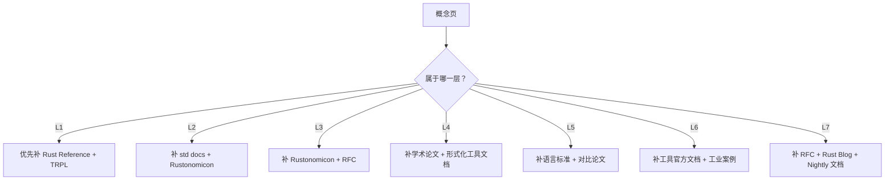

# 概念-权威来源对齐图谱（Concept-Source Alignment Atlas）

> **EN**: Concept-Source Alignment Atlas
> **Summary**: Alignment of each core concept with international authoritative sources: Rust Reference, TRPL, RFCs, academia, courses, industry, and standards. 每个核心概念与国际化权威来源的对齐：Rust Reference、TRPL、RFCs、学术、课程、工业、标准。
> **受众**: [研究者]
> **内容分级**: [元层]
> **权威来源**: 本文件为 `concept/` 权威页。
> **来源**: [Rust Reference](https://doc.rust-lang.org/reference/introduction.html) · [TRPL](https://doc.rust-lang.org/book/title-page.html)

---

## 一、使用说明

本图谱提供 `concept/` 各层权威页与**国际化权威来源**之间的对齐入口，不复制来源正文。每个来源类别给出其在不同层级的代表概念页，便于研究者按来源查概念、按概念补来源。

---

## 二、权威来源覆盖统计

| 来源层级 | 来源类型 | 引用次数 | 涉及概念数 |
|:---|:---|:---:|:---:|
| Lx_other | 其他 | 4021 | 330 |
| L1_specification | Rust Reference | 897 | 376 |
| L1_trpl | TRPL | 764 | 377 |
| L1_github | Rust GitHub | 501 | 168 |
| L2_academic | 学术论文 | 479 | 333 |
| L3_course | 顶尖课程 | 438 | 326 |
| L5_standard | 国际标准 | 357 | 322 |
| L0_wikipedia | Wikipedia | 325 | 133 |
| L1_std | std docs | 325 | 107 |
| L1_rustonomicon | Rustonomicon | 226 | 132 |
| L1_rfc | RFCs | 196 | 85 |
| L1_cargo | Cargo Book | 164 | 56 |

## 三、各层级权威来源覆盖度

| 层级 | 概念数 | Rust Reference | TRPL | RFCs | 学术 | 课程 | 标准 |
|:---|:---:|:---:|:---:|:---:|:---:|:---:|:---:|
| L0 元信息层 | 60 | 54 | 55 | 5 | 11 | 4 | 0 |
| L1 基础概念层 | 43 | 43 | 43 | 13 | 43 | 43 | 43 |
| L2 进阶概念层 | 33 | 33 | 33 | 12 | 33 | 33 | 33 |
| L3 高级概念层 | 36 | 36 | 36 | 17 | 36 | 36 | 36 |
| L4 形式化理论层 | 51 | 51 | 51 | 7 | 51 | 51 | 51 |
| L5 对比分析层 | 19 | 19 | 19 | 1 | 19 | 19 | 19 |
| L6 生态工程层 | 86 | 86 | 86 | 11 | 86 | 86 | 86 |
| L7 前沿趋势层 | 54 | 54 | 54 | 19 | 54 | 54 | 54 |

## 四、来源类别与概念层对应

| 来源类别 | 典型用途 | 主要覆盖层 | 代表概念页 |
|:---|:---|:---:|:---|
| Rust Reference | 语言规范、语法、类型、名称解析 | L1–L4 | [Statements and Expressions Reference](../../04_formal/05_rustc_internals/48_statements_and_expressions_reference.md), [Names Reference](../../04_formal/05_rustc_internals/51_names_reference.md) |
| TRPL | 教学式解释、所有权、并发、错误处理 | L1–L3 | [Ownership](../../01_foundation/01_ownership_borrow_lifetime/01_ownership.md), [Concurrency](../../03_advanced/00_concurrency/01_concurrency.md) |
| RFCs | 语言设计提案、preview features | L3–L7 | [Safety Tags Preview](../../07_future/03_preview_features/08_safety_tags_preview.md), [Const Trait Impl Preview](../../07_future/03_preview_features/11_const_trait_impl_preview.md) |
| std docs | 标准库 API 与 trait 语义 | L1–L3 | [Collections](../../01_foundation/05_collections/08_collections.md), [Iterator Patterns](../../02_intermediate/07_iterators_and_closures/15_iterator_patterns.md) |
| Rustonomicon | unsafe、FFI、内存模型 | L3–L4 | [Unsafe Rust](../../03_advanced/02_unsafe/03_unsafe.md), [Memory Model](../../03_advanced/02_unsafe/29_memory_model.md) |
| Cargo Book | 包管理、工作流、manifest | L6 | [Cargo Workspaces](../../06_ecosystem/01_cargo/78_cargo_workspaces.md), [Cargo Manifest Reference](../../06_ecosystem/01_cargo/64_cargo_manifest_reference.md) |
| 学术论文 | 形式化模型、验证工具 | L4–L7 | [RustBelt](../../04_formal/02_separation_logic/04_rustbelt.md), [Aeneas Symbolic Semantics](../../04_formal/03_operational_semantics/30_aeneas_symbolic_semantics.md) |
| 国际标准 | Unicode、ABI、IEEE、IETF | L1/L3/L6 | [Strings and Encoding](../../01_foundation/06_strings_and_text/18_strings_and_encoding.md), [Network Protocols](../../06_ecosystem/04_web_and_networking/38_network_protocols.md) |

## 五、各层代表性来源对齐

### 5.1 L1 基础概念层

| 概念页 | 主要来源 | 建议补充来源 |
|:---|:---|:---|
| [Ownership](../../01_foundation/01_ownership_borrow_lifetime/01_ownership.md) | TRPL ch.4, Rust Reference | 学术论文（线性逻辑） |
| [Borrowing](../../01_foundation/01_ownership_borrow_lifetime/02_borrowing.md) | TRPL ch.4, Rustonomicon | NLL RFC, Polonius 论文 |
| [Lifetimes](../../01_foundation/01_ownership_borrow_lifetime/03_lifetimes.md) | TRPL ch.10, Rust Reference | 子类型变型论文 |
| [Type System Basics](../../01_foundation/02_type_system/04_type_system.md) | TRPL ch.3/6, Rust Reference | Pierce TAPL |
| [Strings and Encoding](../../01_foundation/06_strings_and_text/18_strings_and_encoding.md) | TRPL, std docs | Unicode Standard |
| [Modules and Paths](../../01_foundation/07_modules_and_items/11_modules_and_paths.md) | Rust Reference, TRPL ch.7 | Cargo Book |

### 5.2 L2 进阶概念层

| 概念页 | 主要来源 | 建议补充来源 |
|:---|:---|:---|
| [Traits](../../02_intermediate/00_traits/01_traits.md) | TRPL ch.10, Rust Reference | RFC 0244, associated items RFC |
| [Generics](../../02_intermediate/01_generics/02_generics.md) | TRPL ch.10, Rust Reference | 类型推断论文 |
| [Interior Mutability](../../02_intermediate/02_memory_management/08_interior_mutability.md) | Rustonomicon, std docs | Rust Reference |
| [Error Handling Deep Dive](../../02_intermediate/03_error_handling/16_error_handling_deep_dive.md) | Rust Blog, ThisError docs | 异常安全论文 |

### 5.3 L3 高级概念层

| 概念页 | 主要来源 | 建议补充来源 |
|:---|:---|:---|
| [Unsafe Rust](../../03_advanced/02_unsafe/03_unsafe.md) | Rustonomicon, Rust Reference | RustBelt 论文 |
| [FFI](../../03_advanced/04_ffi/05_rust_ffi.md) | Rustonomicon, Rust Reference | Itanium C++ ABI, target platform docs |
| [Async/Await](../../03_advanced/01_async/02_async.md) | TRPL ch.17, Rust Async Book | async fn RFC, pinning RFC |
| [Pin and Unpin](../../03_advanced/01_async/06_pin_unpin.md) | Rust Async Book, RFC 2349 | 形式化语义论文 |
| [Atomics and Memory Ordering](../../03_advanced/00_concurrency/11_atomics_and_memory_ordering.md) | Rustonomicon, std docs | C++ memory model, LLVM atomics guide |

### 5.4 L4 形式化理论层

| 概念页 | 主要来源 | 建议补充来源 |
|:---|:---|:---|
| [Linear Logic](../../04_formal/01_ownership_logic/01_linear_logic.md) | Girard 论文, RustBelt | 教学讲义 |
| [RustBelt](../../04_formal/02_separation_logic/04_rustbelt.md) | POPL 2018, Iris 项目 | Rust 官方形式化验证路线图 |
| [Type Theory](../../04_formal/00_type_theory/02_type_theory.md) | Pierce TAPL, Harper PFPL | Rust Reference 类型章节 |
| [Miri](../../04_formal/04_model_checking/31_miri.md) | Miri 文档, Stacked Borrows 论文 | Tree Borrows 论文 |
| [Type Inference Complexity](../../04_formal/00_type_theory/29_type_inference_complexity.md) | HM 论文, Rust trait 复杂度分析 | rustc 源码注释 |

### 5.5 L5–L7 层

| 概念页 | 主要来源 | 建议补充来源 |
|:---|:---|:---|
| [Rust vs C++](../../05_comparative/01_systems_languages/01_rust_vs_cpp.md) | Stroustrup 著作, Rust Book | ISO C++ 标准 |
| [Execution Model Isomorphism](../../05_comparative/00_paradigms/05_execution_model_isomorphism.md) | 并发理论教材, CSP/CCS | Tokio docs |
| [Toolchain](../../06_ecosystem/00_toolchain/01_toolchain.md) | Rust Forge, rustup docs | 各工具官方文档 |
| [Formal Verification Tools](../../06_ecosystem/08_formal_verification/74_formal_verification_tools.md) | Kani/Miri/Creusot docs | 学术工具论文 |
| [Rust 2024 Edition](../../07_future/01_edition_roadmap/19_rust_edition_preview.md) | Edition Guide, RFC | 迁移指南 |
| [Safety Tags Preview](../../07_future/03_preview_features/08_safety_tags_preview.md) | RFC 3842, Rust Blog | 形式化规格 |

## 六、来源缺口修复决策树

## 七、来源质量原则

1. **优先 L1 官方来源**：Rust Reference、TRPL、std docs、RFCs。
2. **L4 形式化内容必须引用学术论文**：RustBelt、Iris、TAPL 等。
3. **L6 生态内容引用官方文档或成熟 crate 文档**。
4. **避免循环引用**：不要以本项目其他 concept 页作为唯一权威来源。

## 八、缺少权威来源的概念（需补全）

| 概念 | 层级 | 当前来源数 | 建议补全来源 |
|:---|:---:|:---:|:---|
| [占位符页面](../placeholders/placeholder_generic.md) | L0 元信息层 | 3 | 无需外部来源 |
| [主题-权威来源对齐图谱](../02_sources/topic_authority_alignment_map.md) | L0 元信息层 | 0 | 项目内部来源 |
| [Cross Reference Matrix](../04_navigation/cross_reference_matrix.md) | L0 元信息层 | 0 | 项目内部来源 |

---

> **内容分级**: [元层]
