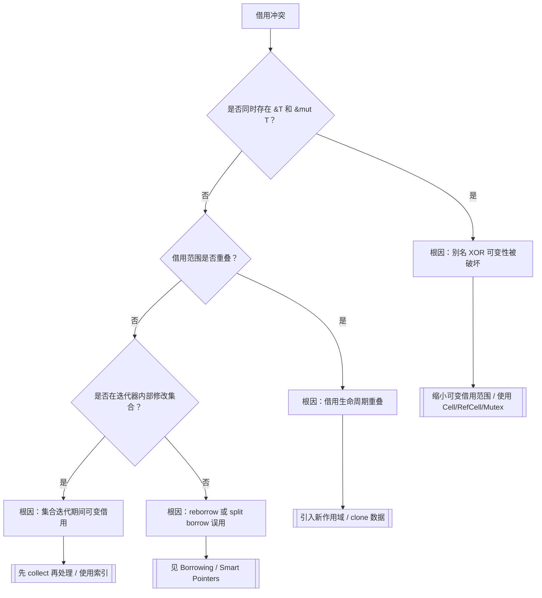
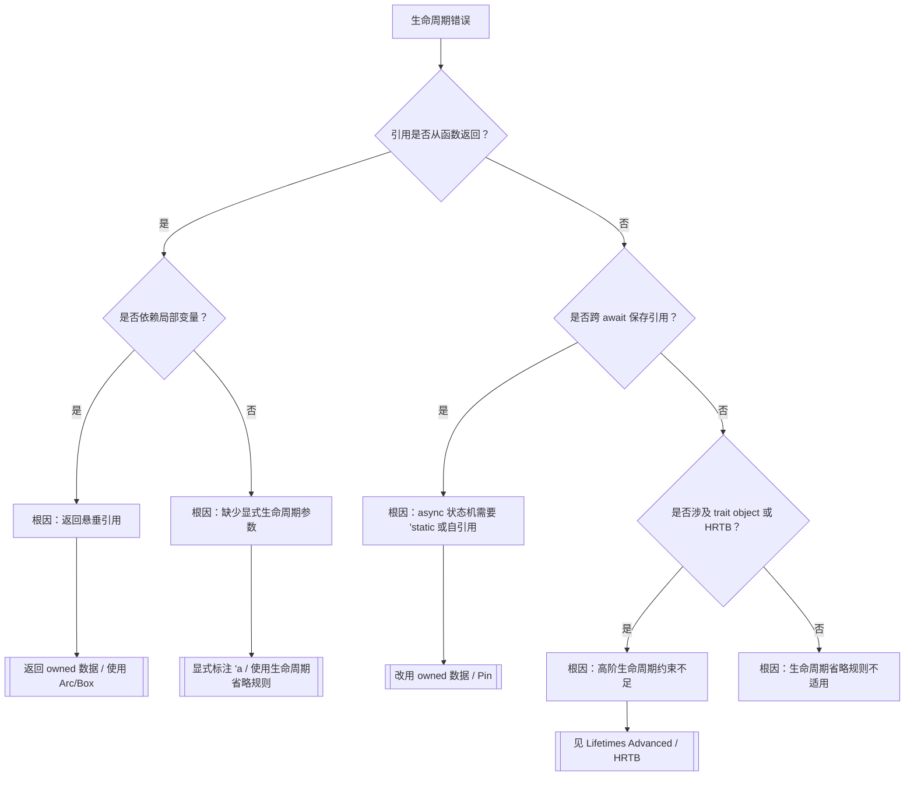
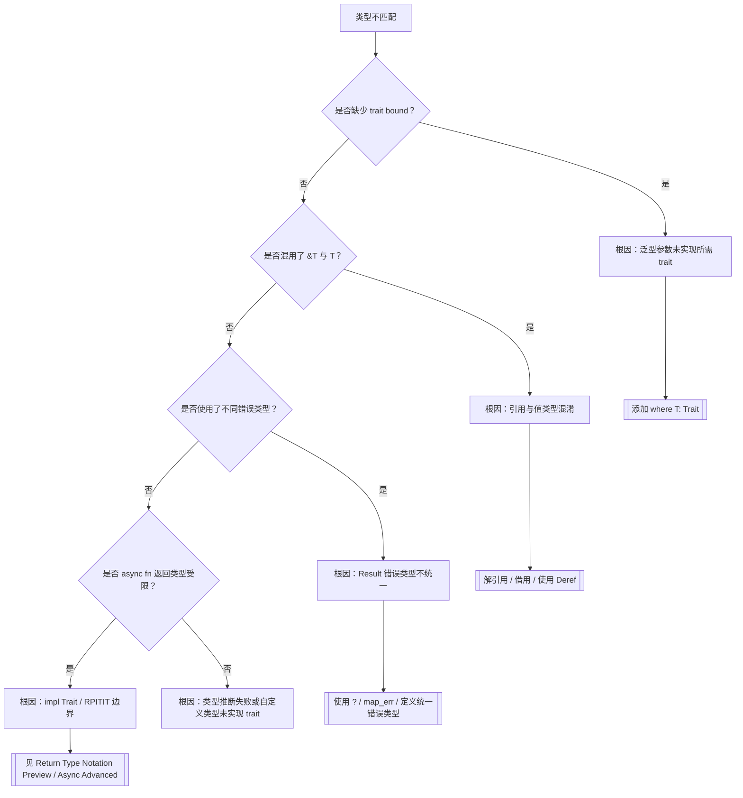
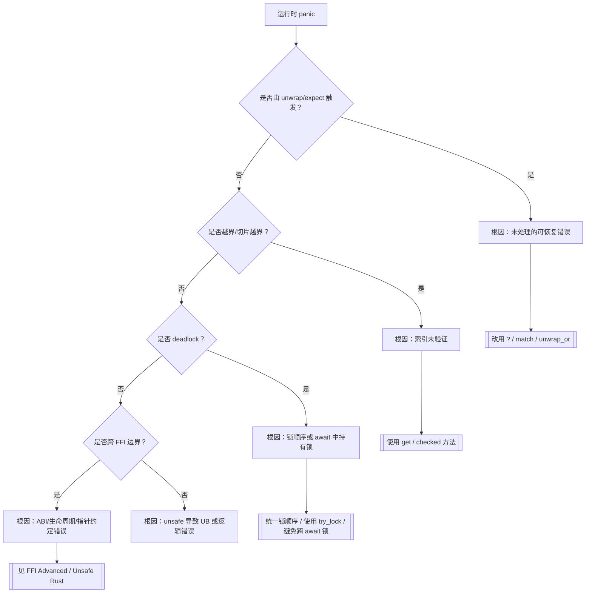
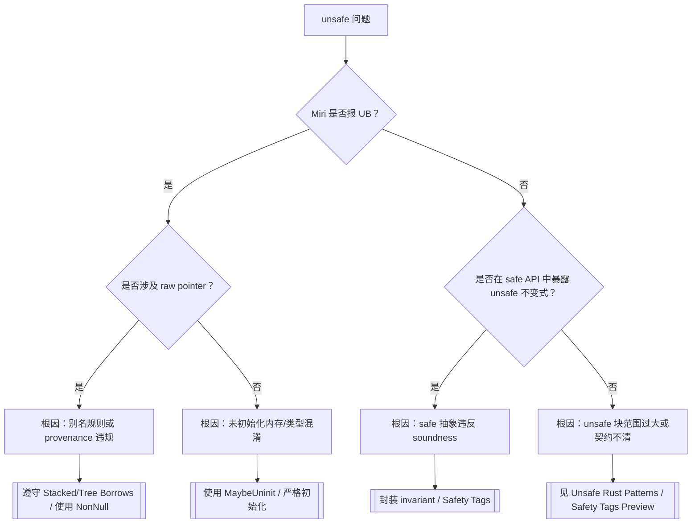

# 推理判定树图谱（Reasoning Judgment Tree Atlas）

> **EN**: Reasoning Judgment Tree Atlas
> **Summary**: Symptom → diagnostic question → root cause → fix strategy concept paths for compiler errors and runtime issues. 编译错误/运行时问题 → 判定问题 → 根因 → 修复策略的概念路径。
> **受众**: [研究者]
> **内容分级**: [元层]
> **来源**: [Rust Reference](https://doc.rust-lang.org/reference/introduction.html) · [TRPL](https://doc.rust-lang.org/book/title-page.html)

---

## 一、使用说明

本图谱将常见编译错误与运行时问题抽象为**判定树**。每个节点提出一个诊断问题，最终叶子给出根因与应进入的权威概念页。本页不展开具体修复代码，只提供导航。

---

## 二、症状索引表

| 症状类别 | 典型报错/现象 | 入口判定树 |
|:---:|:---|:---|
| 借用冲突 | `cannot borrow as mutable` / `cannot borrow as immutable` | [借用冲突判定树](#31-借用冲突判定树) |
| 生命周期 | `lifetime may not live long enough` | [生命周期判定树](#32-生命周期判定树) |
| 类型不匹配 | `expected ... found ...` / trait bound unsatisfied | [类型不匹配判定树](#33-类型不匹配判定树) |
| 运行时 panic | `unwrap` panic / index out of bounds / deadlock | [运行时 panic 判定树](#34-运行时-panic-判定树) |
| unsafe 相关 | UB / Miri 报错 / soundness 质疑 | [unsafe 判定树](#35-unsafe-判定树) |

---

## 三、主要判定树

### 3.1 借用冲突判定树

### 3.2 生命周期判定树

### 3.3 类型不匹配判定树

### 3.4 运行时 panic 判定树

### 3.5 Unsafe 判定树

---

## 四、按修复策略索引

| 修复策略 | 适用症状 | 权威概念页 |
|:---|:---|:---|
| 缩小借用范围 | 借用冲突、生命周期 | [Borrowing](../../01_foundation/01_ownership_borrow_lifetime/02_borrowing.md), [Lifetimes](../../01_foundation/01_ownership_borrow_lifetime/03_lifetimes.md) |
| 使用内部可变性 | 需要可变但只能拿到共享引用 | [Interior Mutability](../../02_intermediate/02_memory_management/08_interior_mutability.md) |
| 使用智能指针 | 共享所有权、堆分配、自引用 | [Smart Pointers](../../02_intermediate/02_memory_management/12_smart_pointers.md), [Pin and Unpin](../../03_advanced/01_async/06_pin_unpin.md) |
| 统一错误类型 | Result 链报错 | [Error Handling Deep Dive](../../02_intermediate/03_error_handling/16_error_handling_deep_dive.md) |
| 使用并发原语 | 跨线程数据竞争/死锁 | [Concurrency](../../03_advanced/00_concurrency/01_concurrency.md), [Concurrency Patterns](../../03_advanced/00_concurrency/10_concurrency_patterns.md) |
| 形式化验证 | unsafe soundness 怀疑 | [Miri](../../04_formal/04_model_checking/31_miri.md), [Kani](../../04_formal/04_model_checking/32_kani.md), [RustBelt](../../04_formal/02_separation_logic/04_rustbelt.md) |

---

## 五、使用判定树的技巧

1. 从报错信息或现象定位症状类别。
2. 按顺序回答每个判定问题，避免同时修改多处代码。
3. 到达叶子节点后，先阅读推荐的权威概念页，再实施修复。
4. 若问题仍未解决，使用 [Miri](../../04_formal/04_model_checking/31_miri.md) 或 [Kani](../../04_formal/04_model_checking/32_kani.md) 进一步验证。

## 六、与相关元页的关系

- 需要按场景决策 → [场景决策树图谱](03_scenario_decision_tree_atlas.md)
- 需要查看示例/反例 → [示例与反例图谱](04_example_counterexample_atlas.md)
- 需要逻辑推理链 → [逻辑推理图谱](05_logical_reasoning_atlas.md)
- 需要概念定义 → [概念定义图谱](01_concept_definition_atlas.md)

---

> **内容分级**: [元层]
