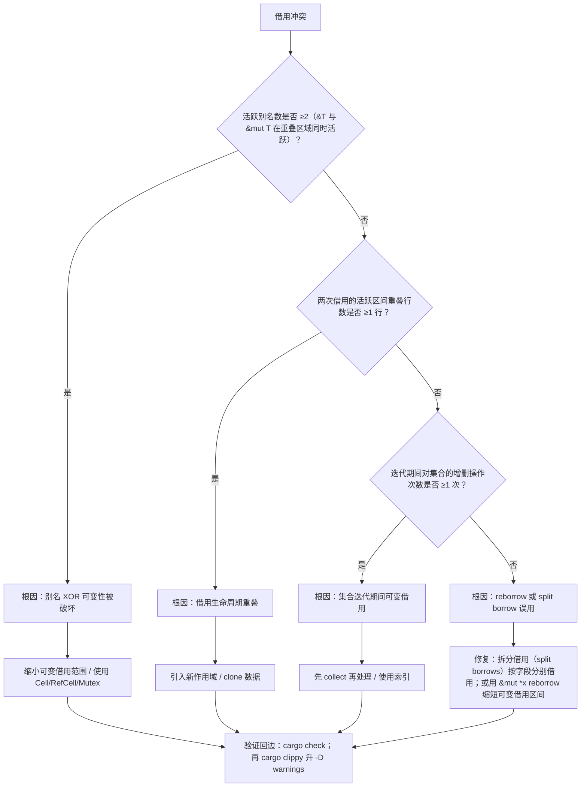
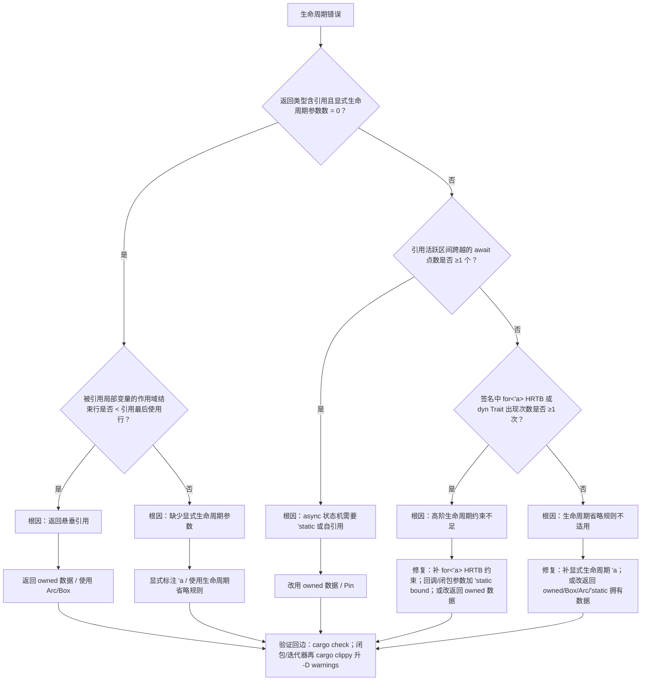
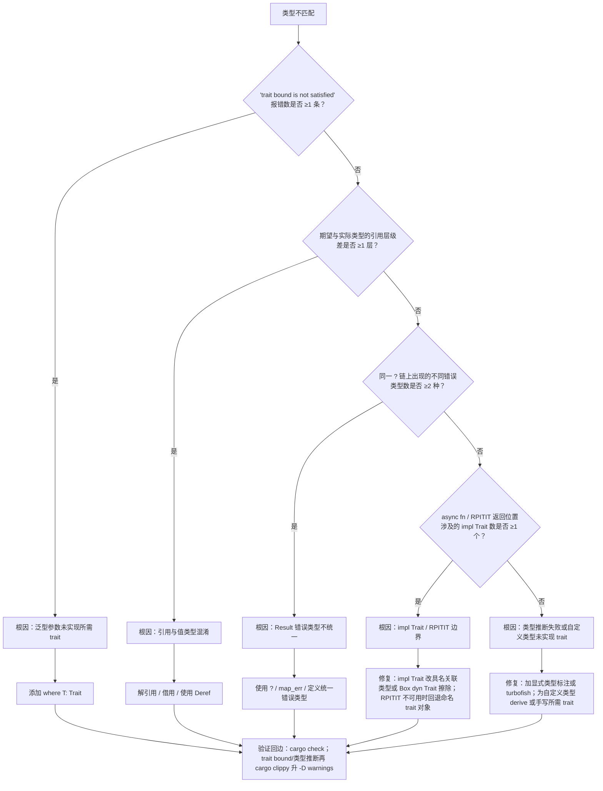
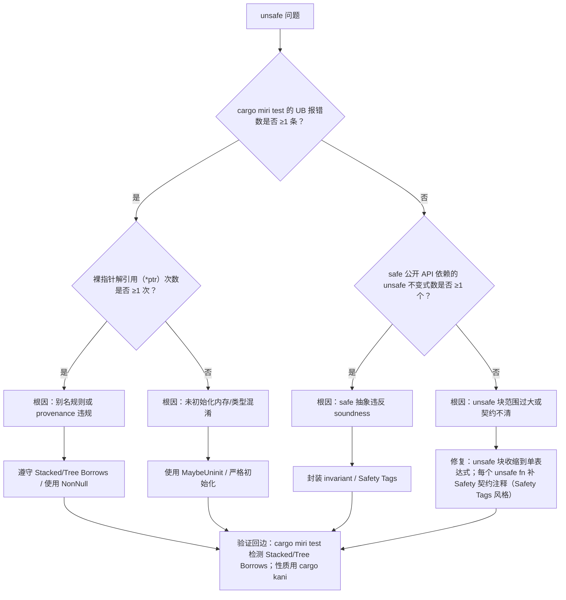
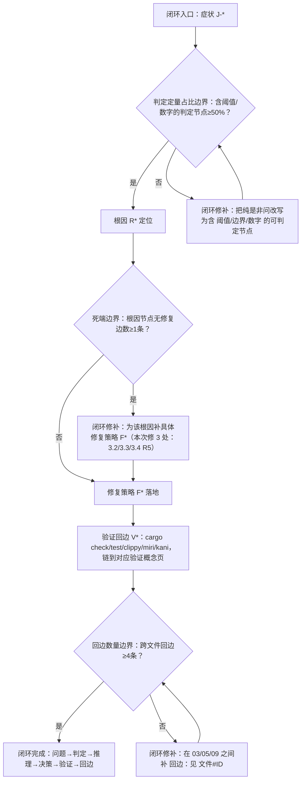
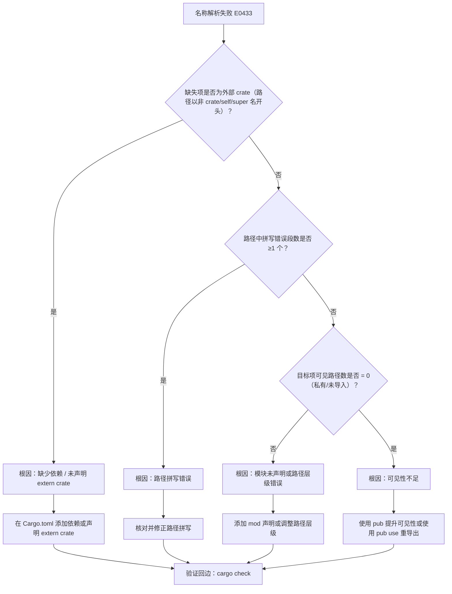
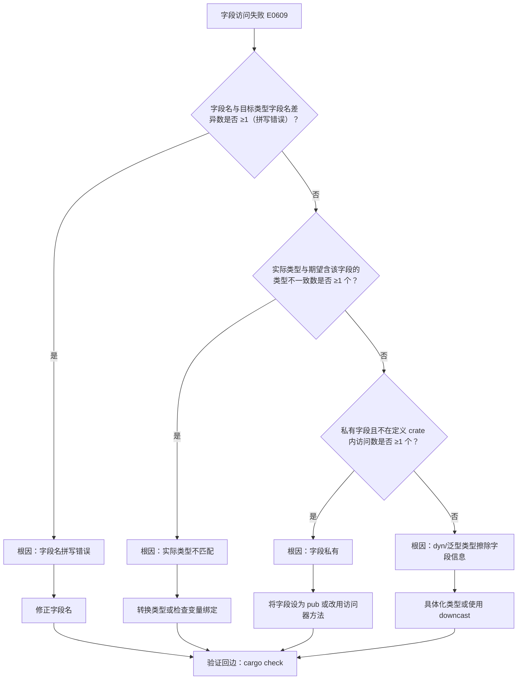

# 推理判定树图谱（Reasoning Judgment Tree Atlas）

> **EN**: Reasoning Judgment Tree Atlas
> **Summary**: Symptom → diagnostic question → root cause → fix strategy concept paths for compiler errors and runtime issues. 编译错误/运行时问题 → 判定问题 → 根因 → 修复策略的概念路径。
> **Rust 版本**: 1.97.0+ (Edition 2024)
> **受众**: [研究者]
> **内容分级**: [元层]
> **权威来源**: 本文件为 `concept/` 权威页。
> **来源**: [Rust Reference](https://doc.rust-lang.org/reference/introduction.html) · [TRPL](https://doc.rust-lang.org/book/title-page.html)

---

## 一、使用说明

本图谱将常见编译错误与运行时问题抽象为**判定树**。每个节点提出一个诊断问题，最终叶子给出根因与应进入的权威概念页。本页不展开具体修复代码，只提供导航。

> **机器可读层**: 本页 §3 的五棵判定树与「闭环增强」的闭环总图，已导出为可遍历的机器可读结构
> [`decision_trees.yaml`](decision_trees.yaml)（节点 id/类型/判定条件/定量阈值 + 是/否/条件边 + 覆盖概念 + 来源锚点），
> 由 `python scripts/check_decision_trees.py` 校验结构完整性（无死端、叶子即结论、引用概念在 KG v3 中存在）并统计判定定量占比。
> §3.1–§3.5 的判定节点（菱形）均含可辩护的定量阈值（别名数、重叠行数、await 点数、报错条数、锁等待环长度等），判定定量占比 21/21 = 100%。

---

## 二、症状索引表

| 症状类别 | 典型报错/现象 | 入口判定树 |
|:---:|:---|:---|
| 借用冲突 | `cannot borrow as mutable` / `cannot borrow as immutable` | [借用冲突判定树](#31-借用冲突判定树) |
| 生命周期 | `lifetime may not live long enough` | [生命周期判定树](#32-生命周期判定树) |
| 类型不匹配 | `expected ... found ...` / trait bound unsatisfied | [类型不匹配判定树](#33-类型不匹配判定树) |
| 运行时 panic | `unwrap` panic / index out of bounds / deadlock | [运行时 panic 判定树](#34-运行时-panic-判定树) |
| unsafe 相关 | UB / Miri 报错 / soundness 质疑 | [unsafe 判定树](#35-unsafe-判定树) |

---

## 三、主要判定树

本节聚焦「主要判定树」，覆盖借用冲突判定树、生命周期判定树、类型不匹配判定树、运行时 panic 判定树等方面。论述顺序由定义到边界：先明确「主要判定树」在「推理判定树图谱（Reasoning Judgment Tree Atlas）」中的确切含义与适用范围，再给出可核验的例证或数据，最后标注它与相邻主题的分界线。读完后应能用一句话复述「主要判定树」的判定标准，并指出它在全页论证链中的位置。

### 3.1 借用冲突判定树



### 3.2 生命周期判定树



### 3.3 类型不匹配判定树



### 3.4 运行时 panic 判定树

```mermaid
flowchart TD
    P[运行时 panic] --> Q1{"unwrap/expect 调用点的 panic 次数是否 ≥1 次？"}
    Q1 -->|是| R1[根因：未处理的可恢复错误]
    Q1 -->|否| Q2{"索引 i 与长度 len 是否满足 i ≥ len？"}
    Q2 -->|是| R2[根因：索引未验证]
    Q2 -->|否| Q3{"持锁等待环中的任务/线程数是否 ≥2 个？"}
    Q3 -->|是| R3[根因：锁顺序或 await 中持有锁]
    Q3 -->|否| Q4{"跨 FFI 边界调用次数 ≥1 次且 panic 穿越 extern 边界？"}
    Q4 -->|是| R4[根因：ABI/生命周期/指针约定错误]
    Q4 -->|否| R5[根因：unsafe 导致 UB 或逻辑错误]
    R1 --> F1[改用 ? / match / unwrap_or]
    R2 --> F2[使用 get / checked 方法]
    R3 --> F3[统一锁顺序 / 使用 try_lock / 避免跨 await 锁]
    R4 --> F4[修复：FFI 边界用 catch_unwind 拦截 panic；统一错误码返回值约定；#[repr(C)] 显式布局]
    R5 --> F5[修复：定位 unsafe 边界；用 get/checked 替换索引；持锁不跨 await；可疑 UB 走 miri]
    F1 --> V4[验证回边：cargo test；再 cargo clippy 升 -W unwrap_used/indexing_slicing/await_holding_lock]
    F2 --> V4
    F3 --> V4
    F4 --> V4
    F5 --> V4
```

### 3.5 Unsafe 判定树



---

## 四、按修复策略索引

| 修复策略 | 适用症状 | 权威概念页 |
|:---|:---|:---|
| 缩小借用范围 | 借用冲突、生命周期 | [Borrowing](../../01_foundation/01_ownership_borrow_lifetime/02_borrowing.md), [Lifetimes](../../01_foundation/01_ownership_borrow_lifetime/03_lifetimes.md) |
| 使用内部可变性 | 需要可变但只能拿到共享引用 | [Interior Mutability](../../02_intermediate/02_memory_management/02_interior_mutability.md) |
| 使用智能指针 | 共享所有权、堆分配、自引用 | [Smart Pointers](../../02_intermediate/02_memory_management/04_smart_pointers.md), [Pin and Unpin](../../03_advanced/01_async/08_pin_unpin.md) |
| 统一错误类型 | Result 链报错 | [Error Handling Deep Dive](../../02_intermediate/03_error_handling/02_error_handling_deep_dive.md) |
| 使用并发原语 | 跨线程数据竞争/死锁 | [Concurrency](../../03_advanced/00_concurrency/01_concurrency.md), [Concurrency Patterns](../../03_advanced/00_concurrency/03_concurrency_patterns.md) |
| 形式化验证 | unsafe soundness 怀疑 | [Miri](../../04_formal/04_model_checking/08_miri.md), [Kani](../../04_formal/04_model_checking/09_kani.md), [RustBelt](../../04_formal/02_separation_logic/01_rustbelt.md) |

---

## 五、使用判定树的技巧

1. 从报错信息或现象定位症状类别。
2. 按顺序回答每个判定问题，避免同时修改多处代码。
3. 到达叶子节点后，先阅读推荐的权威概念页，再实施修复。
4. 若问题仍未解决，使用 [Miri](../../04_formal/04_model_checking/08_miri.md) 或 [Kani](../../04_formal/04_model_checking/09_kani.md) 进一步验证。

## 六、与相关元页的关系

- 需要按场景决策 → [场景决策树图谱](03_scenario_decision_tree_atlas.md)
- 需要查看示例/反例 → [示例与反例图谱](04_example_counterexample_atlas.md)
- 需要逻辑推理链 → [逻辑推理图谱](05_logical_reasoning_atlas.md)
- 需要概念定义 → [概念定义图谱](01_concept_definition_atlas.md)

---

## 闭环增强（可执行化）

> 本小节为**纯增量**补充：为 §3 五棵判定树补上「根因 → 具体修复 → 验证回边」的闭环，并赋予稳定 ID（入口 `J-*`、验证 `V1–V5`），与 03（场景决策）/05（定理）建立跨文件回边。原 §2–§6 全部内容保持不变；§3.1–§3.5 仅在原树**末尾追加**修复与验证节点（不删不改原节点）。
>
> 入口稳定 ID：`J-BORROW-01`（§3.1 借用冲突）、`J-LIFE-02`（§3.2 生命周期）、`J-TYPE-03`（§3.3 类型不匹配）、`J-PANIC-04`（§3.4 运行时 panic）、`J-UNSAFE-05`（§3.5 unsafe）。

### L. 死端修复（3 处：根因 → 具体修复策略）

| 判定树 | 原死端根因 | 补的具体修复策略（已追加到原树） |
|:---:|:---|:---|
| §3.2 生命周期 | `R5` 生命周期省略规则不适用 | `F5` 补显式生命周期 `'a`；或改返回 owned/`Box`/`Arc`/`'static` 拥有数据 |
| §3.3 类型不匹配 | `R5` 类型推断失败或自定义类型未实现 trait | `F5` 加显式类型标注或 turbofish；为自定义类型 derive 或手写所需 trait |
| §3.4 运行时 panic | `R5` unsafe 导致 UB 或逻辑错误 | `F5` 定位 unsafe 边界；用 `get`/`checked` 替换索引；持锁不跨 await；可疑 UB 走 miri |

> 修复后三处根因节点均有出边（`R5 --> F5`），不再是无修复死端。

### M. 验证回边（每棵树末尾追加 V1–V5）

| 验证节点 | 对应判定树 | 精确命令 | 验证概念页 |
|:---:|:---|:---|:---|
| `V1` | §3.1 借用冲突（`J-BORROW-01`） | `cargo check` → `cargo clippy --all-targets -- -D warnings` | [Cargo Profiles and Lints](../../06_ecosystem/01_cargo/11_cargo_profiles_and_lints.md) |
| `V2` | §3.2 生命周期（`J-LIFE-02`） | `cargo check` → `cargo clippy --all-targets -- -D warnings` | [Cargo Profiles and Lints](../../06_ecosystem/01_cargo/11_cargo_profiles_and_lints.md) |
| `V3` | §3.3 类型不匹配（`J-TYPE-03`） | `cargo check` → `cargo clippy --all-targets -- -D warnings` | [Cargo Profiles and Lints](../../06_ecosystem/01_cargo/11_cargo_profiles_and_lints.md) |
| `V4` | §3.4 运行时 panic（`J-PANIC-04`） | `cargo test --all-targets` → `cargo clippy --all-targets -- -W clippy::unwrap_used -W clippy::indexing_slicing -W clippy::await_holding_lock`；可疑 UB 走 `cargo miri test --all-targets`（需每日构建版工具链） | [Testing Strategies](../../06_ecosystem/09_testing_and_quality/01_testing_strategies.md) · [Miri](../../04_formal/04_model_checking/08_miri.md) |
| `V5` | §3.5 unsafe（`J-UNSAFE-05`） | `cargo miri test --all-targets`（需每日构建版工具链） → `cargo kani` | [Miri](../../04_formal/04_model_checking/08_miri.md) · [Kani](../../04_formal/04_model_checking/09_kani.md) |

> 说明：上表 clippy lint（`unwrap_used`/`indexing_slicing`/`await_holding_lock`）为真实 lint 名，但可用性随 toolchain 版本可能调整（⚠需复核）；不确定时退回通用 `cargo clippy --all-targets -- -D warnings`。

### N. 闭环总图（问题 → 判定 → 推理 → 决策 → 验证 → 回边）



> 叶子合规：K9/K5/K7/K6/K10 均为具体动作或状态，无 `[[` 跳出；定量判定节点 K1/K3/K8 含「≥50%/≥1条/≥4条」。

### O. 跨文件回边（`J-*` → 03/05）

| 入口 ID | 回边目标 | 用途 |
|:---:|:---|:---|
| `J-BORROW-01` | 回边：见 [`05_logical_reasoning_atlas.md#TH-BORROW-02`](05_logical_reasoning_atlas.md) | 借用冲突判定的定理依据（别名 XOR 可变性） |
| `J-LIFE-02` | 回边：见 [`05_logical_reasoning_atlas.md#TH-LIFE-03`](05_logical_reasoning_atlas.md) | 生命周期判定的定理依据（引用不悬垂） |
| `J-TYPE-03` | 回边：见 [`03_scenario_decision_tree_atlas.md#T-ABS-01`](03_scenario_decision_tree_atlas.md) | trait bound/对象安全错误的设计期预防入口 |
| `J-PANIC-04` | 回边：见 [`03_scenario_decision_tree_atlas.md#T-CONC-01`](03_scenario_decision_tree_atlas.md) | 死锁（持锁跨 await）的设计期预防入口 |
| `J-UNSAFE-05` | 回边：见 [`05_logical_reasoning_atlas.md#TH-PIN-07`](05_logical_reasoning_atlas.md) 与 [`#TH-TYPE-04`](05_logical_reasoning_atlas.md) | unsafe soundness 质疑的定理依据 |

> 回边：见 [`03_scenario_decision_tree_atlas.md#T-CONC-01`](03_scenario_decision_tree_atlas.md)（`J-PANIC-04` 死锁的设计期预防）；回边：见 [`05_logical_reasoning_atlas.md#TH-SEND-06`](05_logical_reasoning_atlas.md)（`J-UNSAFE-05`/`J-PANIC-04` 并发安全的定理依据）。

### P. 本文件闭环小结

- 修复死端：**3 处**（§3.2/§3.3/§3.4 的 `R5`），均补具体修复策略 `F5` 并接续验证回边。
- 追加验证回边节点：**5 个**（`V1–V5`，每棵判定树末尾各一），均含具体命令并链到 Miri/Kani/Clippy 概念页。
- 新增 mermaid：**1 个**（闭环总图）；新增定量判定节点：**3 个**（K1/K3/K8）。
- 跨文件回边：**7 条**（→ 05：`TH-BORROW-02`/`TH-LIFE-03`/`TH-PIN-07`/`TH-TYPE-04`/`TH-SEND-06`；→ 03：`T-ABS-01`/`T-CONC-01`）。

### Q. 跳出叶子收敛（`[[见…]]` → 具体修复）

| 判定树 | 原跳出叶子 | 收敛后的具体修复策略 |
|:---:|:---|:---|
| §3.1 借用冲突 | `F4[[见 Borrowing / Smart Pointers]]` | 拆分借用（split borrows）按字段分别借用；或用 `&mut *x` reborrow 缩短可变借用区间 |
| §3.2 生命周期 | `F4[[见 Lifetimes Advanced / HRTB]]` | 补 `for<'a>` HRTB 约束；回调/闭包参数加 `'static` bound；或改返回 owned 数据 |
| §3.3 类型不匹配 | `F4[[见 Return Type Notation 预研 / Async Advanced]]` | `impl Trait` 改具名关联类型或 `Box<dyn Trait>` 擦除；RPITIT 不可用时回退命名 trait 对象 |
| §3.4 运行时 panic | `F4[[见 FFI Advanced / Unsafe Rust]]` | FFI 边界用 `catch_unwind` 拦截 panic；统一错误码返回值约定；`#[repr(C)]` 显式布局 |
| §3.5 unsafe | `F4[[见 Unsafe Rust Patterns / Safety Tags 预研]]` | unsafe 块收缩到单表达式；每个 `unsafe fn` 补 Safety 契约注释（Safety Tags 风格） |

> 形状语义修正（2026-07-12）：§3.1–§3.5 的 `F1–F3` 修复策略叶子原为子程序形 `[[…]]`，但它们是具体修复动作（如「缩小可变借用范围 / 使用 Cell/RefCell/Mutex」）而非跨页跳转引用，按「叶子即机制」标准统一改为矩形 `[…]`；本页 mermaid 内 `[[` 跳出叶子归零。

> 中间层桥接：上述 5 条修复策略对应的权威概念页见 §四「按修复策略索引」（[Borrowing](../../01_foundation/01_ownership_borrow_lifetime/02_borrowing.md) · [Lifetimes](../../01_foundation/01_ownership_borrow_lifetime/03_lifetimes.md) · [Error Handling Deep Dive](../../02_intermediate/03_error_handling/02_error_handling_deep_dive.md) · [FFI Advanced](../../03_advanced/04_ffi/02_ffi_advanced.md) · [Unsafe Rust Patterns](../../03_advanced/02_unsafe/04_unsafe_rust_patterns.md) · [Miri](../../04_formal/04_model_checking/08_miri.md) · [Kani](../../04_formal/04_model_checking/09_kani.md)），叶子不再跳出本页。

<!-- GENERATED-INDEX: 以下「数据驱动索引」节由 scripts/generate_knowledge_topology_atlas.py 自动生成；人工策展内容写在标记之前。 -->

## 数据驱动索引：推理/判定表征覆盖全量概念（自动生成）

> 以下来自 `extract_concept_topology.py` 的表征信号抽取：概念页含「核心推理链/定理链/反命题(树)/证明树/逆向推理」类章节（`##`–`####` 级标题，含「反命题与边界分析」「### 核心推理链」等深层小节），或头部有定理链元数据，即收录。每行仅给出入口与信号，推理正文以权威页为准。

覆盖 **369** 个概念（信号：推理/定理类章节或定理链元数据）。

### L0 元信息层（39 个概念）

| 概念页 | 表征信号 | 主题提示 |
|:---|:---|:---|
| [Bloom Taxonomy](../../00_meta/00_framework/bloom_taxonomy.md) | 推理/定理节 ×2 · 定理链元数据 ✓ | 核心推理链 · 反命题与边界 |
| [Rust 安全边界扩展推理树](../../00_meta/00_framework/boundary_extension_tree.md) | 推理/定理节 ×2 · 定理链元数据 ✓ | 核心推理链 · 反命题与边界 |
| [Rust 知识体系双维认知矩阵](../../00_meta/00_framework/cognitive_dimension_matrix.md) | 推理/定理节 ×2 · 定理链元数据 ✓ | 核心推理链 · 反命题与边界 |
| [Rust 知识体系能力图谱](../../00_meta/00_framework/competency_graph.md) | 推理/定理节 ×2 · 定理链元数据 ✓ | 核心推理链 · 反命题与边界 |
| [Rust 知识体系概念定义判定森林](../../00_meta/00_framework/concept_definition_decision_forest.md) | 推理/定理节 ×2 | 核心推理链 · 反命题与边界 |
| [Rust 编译期可判定性谱系全景](../../00_meta/00_framework/decidability_spectrum.md) | 推理/定理节 ×4 · 定理链元数据 ✓ | 定理推理链 · 推理链图谱 |
| [Rust 语义表达力多视角深化](../../00_meta/00_framework/expressiveness_multiview.md) | 推理/定理节 ×3 · 定理链元数据 ✓ | 定理推理链 · 核心推理链 |
| [Rust 知识体系失效分析树集](../../00_meta/00_framework/fault_tree_analysis_collection.md) | 推理/定理节 ×2 · 定理链元数据 ✓ | 核心推理链 · 反命题与边界 |
| [Rust 知识体系全局思维导图](../../00_meta/00_framework/knowledge_mindmap.md) | 推理/定理节 ×2 · 定理链元数据 ✓ | 核心推理链 · 反命题与边界 |
| [方法论：思维表征与知识结构规范](../../00_meta/00_framework/methodology.md) | 推理/定理节 ×4 · 定理链元数据 ✓ | 定理推理链（Theorem Chain） · 反命题树格式 |
| [Rust 范式转换模式矩阵](../../00_meta/00_framework/paradigm_transition_matrix.md) | 推理/定理节 ×2 · 定理链元数据 ✓ | 核心推理链 · 反命题与边界 |
| [通用 PL 基座路线图：Rust 在编程语言坐标系中的位置](../../00_meta/00_framework/pl_foundations_roadmap.md) | 推理/定理节 ×1 | 反命题 |
| [语义桥：算法、设计模式与工作流模式的统一谱系](../../00_meta/00_framework/semantic_bridge_algorithms_patterns.md) | 推理/定理节 ×2 · 定理链元数据 ✓ | 核心推理链 · 反命题与边界 |
| [Rust Semantic Expressiveness: A Panoramic Survey](../../00_meta/00_framework/semantic_expressiveness.md) | 推理/定理节 ×2 · 定理链元数据 ✓ | 核心推理链 · 反命题与边界 |
| [Rust 表征空间](../../00_meta/00_framework/semantic_space.md) | 推理/定理节 ×3 · 定理链元数据 ✓ | 反命题分析（Anti-Propositions） · 核心推理链 |
| [Rust 知识体系定理推理森林](../../00_meta/00_framework/theorem_inference_forest.md) | 推理/定理节 ×3 | 推理链 · 核心推理链 |
| [全局待办清单](../../00_meta/00_framework/todos.md) | 推理/定理节 ×2 · 定理链元数据 ✓ | 核心推理链 · 反命题与边界 |
| [Rust 核心术语英中对照表](../../00_meta/01_terminology/01_terminology_glossary.md) | 推理/定理节 ×2 · 定理链元数据 ✓ | 核心推理链 · 反命题与边界 |
| [Concept 文件双语模板 v2](../../00_meta/01_terminology/02_bilingual_template_v2.md) | 推理/定理节 ×3 | 反命题与边界分析 · 反命题树 |
| [Concept 文件双语模板](../../00_meta/01_terminology/03_bilingual_template.md) | 推理/定理节 ×1 | 反命题与边界 |
| [权威来源映射表](../../00_meta/02_sources/01_authority_source_map.md) | 推理/定理节 ×2 · 定理链元数据 ✓ | 核心推理链 · 反命题与边界 |
| [RustBelt 谓词映射图](../../00_meta/02_sources/02_rustbelt_predicate_map.md) | 推理/定理节 ×2 · 定理链元数据 ✓ | 核心推理链 · 反命题与边界 |
| [权威来源清单与知识来源关系分析](../../00_meta/02_sources/03_sources.md) | 推理/定理节 ×2 · 定理链元数据 ✓ | 核心推理链 · 反命题与边界 |
| [Concept Audit Guide](../../00_meta/03_audit/01_concept_audit_guide.md) | 推理/定理节 ×2 · 定理链元数据 ✓ | 核心推理链 · 反命题与边界 |
| [Rust 知识体系 A/S/P 三维认知标记规范](../../00_meta/03_audit/02_asp_marking_guide.md) | 推理/定理节 ×2 · 定理链元数据 ✓ | 核心推理链 · 反命题与边界 |
| [概念一致性检查清单](../../00_meta/03_audit/03_audit_checklist.md) | 推理/定理节 ×3 · 定理链元数据 ✓ | 每个核心文件的定理链 · 核心推理链 |
| [Rust 知识体系思维表征覆盖率仪表板](../../00_meta/03_audit/07_quality_dashboard_v2.md) | 推理/定理节 ×2 · 定理链元数据 ✓ | 核心推理链 · 反命题与边界 |
| [Rust 职业市场全景：2026 年数据与分析](../../00_meta/04_navigation/02_career_landscape.md) | 推理/定理节 ×1 | 反命题与边界分析 |
| [全局概念索引](../../00_meta/04_navigation/03_concept_index.md) | 推理/定理节 ×2 · 定理链元数据 ✓ | 核心推理链 · 反命题与边界 |
| [跨层知识图谱](../../00_meta/04_navigation/04_inter_layer_map.md) | 推理/定理节 ×4 · 定理链元数据 ✓ | 关键跨层推理链（定理一致性） · 新增跨层推理链 |
| [Rust 知识体系层次内模型间映射图](../../00_meta/04_navigation/06_intra_layer_model_map.md) | 推理/定理节 ×2 · 定理链元数据 ✓ | 核心推理链 · 反命题与边界 |
| [Rust 知识体系学习指南](../../00_meta/04_navigation/07_learning_guide.md) | 推理/定理节 ×2 · 定理链元数据 ✓ | 核心推理链 · 反命题与边界 |
| [MVP 学习路径：从零到多线程 CLI](../../00_meta/04_navigation/08_learning_mvp_path.md) | 推理/定理节 ×2 · 定理链元数据 ✓ | 核心推理链 · 反命题与边界 |
| [Rust 知识体系全景导航](../../00_meta/04_navigation/09_navigation.md) | 推理/定理节 ×2 · 定理链元数据 ✓ | 核心推理链 · 反命题与边界 |
| [Rust 知识体系问题图谱](../../00_meta/04_navigation/10_problem_graph.md) | 推理/定理节 ×2 · 定理链元数据 ✓ | 核心推理链 · 反命题与边界 |
| [Rust 概念速查卡片](../../00_meta/04_navigation/11_quick_reference.md) | 推理/定理节 ×2 · 定理链元数据 ✓ | 核心推理链 · 反命题与边界 |
| [Rust 知识体系自测题库](../../00_meta/04_navigation/12_self_assessment.md) | 推理/定理节 ×2 · 定理链元数据 ✓ | 核心推理链 · 反命题与边界 |
| [逻辑推理图谱](../../00_meta/knowledge_topology/05_logical_reasoning_atlas.md) | 推理/定理节 ×5 | 推理链总览 · 核心推理链 |
| [Rust 知识体系知识图谱本体规范 v2.0](../../00_meta/knowledge_topology/kg_ontology_v2.md) | 定理链元数据 ✓ | 定理链元数据 |

### L1 基础概念层（39 个概念）

| 概念页 | 表征信号 | 主题提示 |
|:---|:---|:---|
| [Rust 起步指南](../../01_foundation/00_start/00_start.md) | 推理/定理节 ×2 | 反命题决策树 · 反向推理 |
| [编程语言理论基础](../../01_foundation/00_start/01_pl_prerequisites.md) | 推理/定理节 ×1 | 核心推理链 |
| [零成本抽象：Rust 的性能哲学](../../01_foundation/00_start/02_zero_cost_abstractions.md) | 推理/定理节 ×3 | 反命题与边界分析 · 反命题树 |
| [闭包基础：捕获环境与匿名函数](../../01_foundation/00_start/03_closure_basics.md) | 推理/定理节 ×3 | 反命题与边界分析 · 反命题树 |
| [标准 I/O 与进程](../../01_foundation/00_start/05_std_io_and_process.md) | 推理/定理节 ×3 | 反命题与边界分析 · 反命题树 |
| [Rust 关键字](../../01_foundation/00_start/06_keywords.md) | 定理链元数据 ✓ | 定理链元数据 |
| [Rust 运算符与符号](../../01_foundation/00_start/07_operators_and_symbols.md) | 定理链元数据 ✓ | 定理链元数据 |
| [Rust 所有权-借用-生命周期知识图谱](../../01_foundation/01_ownership_borrow_lifetime/00_ownership_borrow_lifetime_knowledge_map.md) | 推理/定理节 ×3 | 定理链 · 反向推理 |
| [Ownership](../../01_foundation/01_ownership_borrow_lifetime/01_ownership.md) | 推理/定理节 ×3 | 定理推理链（Theorem Chain） · 反命题与边界分析 |
| [Borrowing](../../01_foundation/01_ownership_borrow_lifetime/02_borrowing.md) | 推理/定理节 ×3 | 定理推理链（Theorem Chain） · 反命题与边界分析 |
| [Lifetimes](../../01_foundation/01_ownership_borrow_lifetime/03_lifetimes.md) | 推理/定理节 ×3 | 定理推理链（Theorem Chain） · 反命题与边界分析（Inverse Propositions & Boundar… |
| [Lifetimes 高级主题](../../01_foundation/01_ownership_borrow_lifetime/04_lifetimes_advanced.md) | 推理/定理节 ×2 | 定理链补充 · 反命题与边界 |
| [所有权清单自测：Brown University Ownership Inventory](../../01_foundation/01_ownership_borrow_lifetime/06_ownership_inventories_brown_book.md) | 定理链元数据 ✓ | 定理链元数据 |
| [Type System Basics](../../01_foundation/02_type_system/01_type_system.md) | 推理/定理节 ×4 | 定理推理链（Theorem Chain） · 反命题与边界分析（Inverse Propositions & Boundar… |
| [Never Type (`!`)：底类型与穷尽性](../../01_foundation/02_type_system/02_never_type.md) | 推理/定理节 ×1 | 核心推理链 |
| [数值类型与运算：从整数到浮点的完整图景](../../01_foundation/02_type_system/03_numerics.md) | 推理/定理节 ×3 | 反命题与边界分析 · 反命题树 |
| [类型强制与转换：显式与隐式的边界](../../01_foundation/02_type_system/04_coercion_and_casting.md) | 推理/定理节 ×3 | 反命题与边界分析 · 反命题树 |
| [引用语义：自动解引用、Deref 强制与类型转换](../../01_foundation/03_values_and_references/01_reference_semantics.md) | 推理/定理节 ×4 | 反命题与边界分析 · 反命题树 |
| [控制流：表达式导向的流程控制](../../01_foundation/04_control_flow/01_control_flow.md) | 推理/定理节 ×3 | 反命题与边界分析 · 反命题树 |
| [模式匹配](../../01_foundation/04_control_flow/02_patterns.md) | 定理链元数据 ✓ | 定理链元数据 |
| [语句与表达式](../../01_foundation/04_control_flow/04_statements_and_expressions.md) | 定理链元数据 ✓ | 定理链元数据 |
| [集合类型：Rust 标准库的数据结构谱系](../../01_foundation/05_collections/01_collections.md) | 推理/定理节 ×3 | 反命题与边界分析 · 反命题树 |
| [高级集合类型：BTreeMap、VecDeque、BinaryHeap 与自定义 Hasher 深度分析](../../01_foundation/05_collections/02_collections_advanced.md) | 推理/定理节 ×3 | 反命题与边界分析 · 反命题树 |
| [字符串与文本：Rust 的 Unicode 处理与格式化系统](../../01_foundation/06_strings_and_text/01_strings_and_text.md) | 推理/定理节 ×3 | 反命题与边界分析 · 反命题树 |
| [字符串与编码：Rust 的文本处理类型系统](../../01_foundation/06_strings_and_text/02_strings_and_encoding.md) | 推理/定理节 ×3 | 反命题与边界分析 · 反命题树 |
| [格式化与显示](../../01_foundation/06_strings_and_text/03_formatting_and_display.md) | 推理/定理节 ×3 | 反命题与边界分析 · 反命题树 |
| [模块系统与路径：Rust 的代码组织哲学](../../01_foundation/07_modules_and_items/01_modules_and_paths.md) | 推理/定理节 ×3 | 反命题与边界分析 · 反命题树 |
| [类型别名](../../01_foundation/07_modules_and_items/07_type_aliases.md) | 推理/定理节 ×3 | 反命题与边界分析 · 反命题树 |
| [静态项](../../01_foundation/07_modules_and_items/08_static_items.md) | 推理/定理节 ×3 | 反命题与边界分析 · 反命题树 |
| [常量项与常量函数](../../01_foundation/07_modules_and_items/09_const_items_and_const_fn.md) | 推理/定理节 ×3 | 反命题与边界分析 · 反命题树 |
| [Preludes](../../01_foundation/07_modules_and_items/10_preludes.md) | 定理链元数据 ✓ | 定理链元数据 |
| [Crate 与源文件](../../01_foundation/07_modules_and_items/11_crates_and_source_files.md) | 推理/定理节 ×2 · 定理链元数据 ✓ | 反命题决策树 · 反向推理 |
| [项](../../01_foundation/07_modules_and_items/12_items.md) | 推理/定理节 ×2 · 定理链元数据 ✓ | 反命题决策树 · 反向推理 |
| [Rust 错误处理基础](../../01_foundation/08_error_handling/01_error_handling_basics.md) | 推理/定理节 ×3 | 反命题与边界分析 · 反命题树 |
| [错误处理控制流](../../01_foundation/08_error_handling/02_error_handling_control_flow.md) | 推理/定理节 ×3 | 定理链 · 反向推理 |
| [Panic 与 Abort：不可恢复错误的处理机制](../../01_foundation/08_error_handling/03_panic_and_abort.md) | 推理/定理节 ×3 | 反命题与边界分析 · 反命题树 |
| [属性与声明宏：编译期元编程基础](../../01_foundation/09_macros_basics/01_attributes_and_macros.md) | 推理/定理节 ×3 | 反命题与边界分析 · 反命题树 |
| [测试基础：从单元测试到集成测试](../../01_foundation/10_testing_basics/01_testing_basics.md) | 推理/定理节 ×3 | 反命题与边界分析 · 反命题树 |
| [常用开发工具](../../01_foundation/10_testing_basics/02_useful_development_tools.md) | 推理/定理节 ×2 · 定理链元数据 ✓ | 反命题决策树 · 反向推理 |

### L2 进阶概念层（29 个概念）

| 概念页 | 表征信号 | 主题提示 |
|:---|:---|:---|
| [Traits](../../02_intermediate/00_traits/01_traits.md) | 推理/定理节 ×8 | 定理推理链（Theorem Chain） · 反命题与边界分析（Counter-proposition & Boundary… |
| [分发机制 (Dispatch Mechanisms)](../../02_intermediate/00_traits/02_dispatch_mechanisms.md) | 推理/定理节 ×3 | 定理链 · 反命题 |
| [Serde 序列化模式：Rust 的类型驱动数据转换](../../02_intermediate/00_traits/03_serde_patterns.md) | 推理/定理节 ×4 | 反命题与边界分析 · 反命题树 |
| [高级 Trait 主题：从关联类型到特化](../../02_intermediate/00_traits/04_advanced_traits.md) | 推理/定理节 ×4 | 反命题与边界分析 · 反命题树 |
| [可派生 Trait](../../02_intermediate/00_traits/06_derive_traits.md) | 定理链元数据 ✓ | 定理链元数据 |
| [Generics](../../02_intermediate/01_generics/01_generics.md) | 推理/定理节 ×7 | 定理推理链（Theorem Chain） · 反命题与边界分析（Counter-proposition & Boundary… |
| [Const Generics（常量泛型）：值作为类型参数](../../02_intermediate/01_generics/02_const_generics.md) | 推理/定理节 ×1 | 单态化与编译期求值：推理链 |
| [类型级编程 (Type-Level Programming)](../../02_intermediate/01_generics/03_type_level_programming.md) | 推理/定理节 ×4 | 定理链 · 反命题 |
| [Memory Management](../../02_intermediate/02_memory_management/01_memory_management.md) | 推理/定理节 ×7 | 定理推理链（Theorem Chain） · 反命题与边界分析（Counter-proposition & Boundary… |
| [内部可变性：编译期规则的运行时逃逸](../../02_intermediate/02_memory_management/02_interior_mutability.md) | 推理/定理节 ×4 | 反命题与边界分析 · 反命题树 |
| [Cow：写时克隆与零拷贝抽象](../../02_intermediate/02_memory_management/03_cow_and_borrowed.md) | 推理/定理节 ×4 | 反命题与边界分析 · 反命题树 |
| [智能指针：堆内存管理与共享语义](../../02_intermediate/02_memory_management/04_smart_pointers.md) | 推理/定理节 ×4 | 反命题与边界分析 · 反命题树 |
| [Error Handling](../../02_intermediate/03_error_handling/01_error_handling.md) | 推理/定理节 ×7 | 定理推理链（Theorem Chain） · 反命题与边界分析（Counter-proposition & Boundary… |
| [错误处理深入：从 Result 到自定义错误生态](../../02_intermediate/03_error_handling/02_error_handling_deep_dive.md) | 推理/定理节 ×4 | 反命题与边界分析 · 反命题树 |
| [Panic 机制](../../02_intermediate/03_error_handling/03_panic.md) | 定理链元数据 ✓ | 定理链元数据 |
| [Rust 范围类型语义：`std::ops::Range` → `core::range`](../../02_intermediate/04_types_and_conversions/01_range_types.md) | 推理/定理节 ×4 | 反命题与边界分析 · 反命题树 |
| [闭包类型系统：Fn、FnMut、FnOnce 的捕获语义](../../02_intermediate/04_types_and_conversions/02_closure_types.md) | 推理/定理节 ×4 | 反命题与边界分析 · 反命题树 |
| [Newtype 与包装器模式：类型安全的零成本抽象](../../02_intermediate/04_types_and_conversions/03_newtype_and_wrapper.md) | 推理/定理节 ×4 | 反命题与边界分析 · 反命题树 |
| [高级类型系统：从关联类型到类型级编程](../../02_intermediate/04_types_and_conversions/04_type_system_advanced.md) | 推理/定理节 ×5 | 反命题与边界分析 · 反命题树 |
| [联合体](../../02_intermediate/04_types_and_conversions/06_unions.md) | 推理/定理节 ×3 | 反命题与边界分析 · 反命题树 |
| [类型转换](../../02_intermediate/04_types_and_conversions/07_type_conversions.md) | 推理/定理节 ×3 | 反命题与边界分析 · 反命题树 |
| [模块系统：Rust 的代码组织与可见性规则](../../02_intermediate/05_modules_and_visibility/01_module_system.md) | 推理/定理节 ×4 | 反命题与边界分析 · 反命题树 |
| [Rust API 命名约定](../../02_intermediate/05_modules_and_visibility/03_api_naming_conventions.md) | 定理链元数据 ✓ | 定理链元数据 |
| [`assert_matches!`：模式匹配断言的形式化语义](../../02_intermediate/06_macros_and_metaprogramming/01_assert_matches.md) | 推理/定理节 ×4 | 反命题与边界分析 · 反命题树 |
| [DSL 与嵌入 式设计：Rust 中的领域特定语言](../../02_intermediate/06_macros_and_metaprogramming/02_dsl_and_embedding.md) | 推理/定理节 ×4 | 反命题与边界分析 · 反命题树 |
| [宏模式：编译期代码生成的工程实践](../../02_intermediate/06_macros_and_metaprogramming/03_macro_patterns.md) | 推理/定理节 ×4 | 反命题与边界分析 · 反命题树 |
| [元编程：Rust 的编译期代码生成与变换](../../02_intermediate/06_macros_and_metaprogramming/04_metaprogramming.md) | 推理/定理节 ×4 | 反命题与边界分析 · 反命题树 |
| [属性分类详解](../../02_intermediate/06_macros_and_metaprogramming/06_attributes_by_category.md) | 推理/定理节 ×3 | 反命题与边界分析 · 反命题树 |
| [Rust 迭代器模式](../../02_intermediate/07_iterators_and_closures/01_iterator_patterns.md) | 推理/定理节 ×3 | 反命题与边界分析 · 逆向推理链（Backward Reasoning） |

### L3 高级概念层（53 个概念）

| 概念页 | 表征信号 | 主题提示 |
|:---|:---|:---|
| [Concurrency](../../03_advanced/00_concurrency/01_concurrency.md) | 推理/定理节 ×8 | 定理推理链（Theorem Chain） · 反命题与边界分析 |
| [并发 模式：从消息 传递到锁自由的数据结构](../../03_advanced/00_concurrency/03_concurrency_patterns.md) | 推理/定理节 ×4 | 反命题与边界分析 · 反命题树 |
| [Cross-Platform Concurrency](../../03_advanced/00_concurrency/05_cross_platform_concurrency.md) | 推理/定理节 ×3 | 定理链 · 反命题 |
| [原子操作与内存序：无锁并发的精确控制](../../03_advanced/00_concurrency/06_atomics_and_memory_ordering.md) | 推理/定理节 ×4 | 反命题与边界分析 · 反命题树 |
| [无锁编程与内存模型](../../03_advanced/00_concurrency/07_lock_free.md) | 推理/定理节 ×4 | 反命题与边界分析 · 反命题树 |
| [并行与分布式模式谱系：从线程池到共识算法](../../03_advanced/00_concurrency/08_parallel_distributed_pattern_spectrum.md) | 推理/定理节 ×2 | 逆向推理链（Backward Reasoning） · 核心推理链 |
| [Async/Await](../../03_advanced/01_async/01_async.md) | 推理/定理节 ×7 | 定理矩阵（10 行，含 ⟹ 推理链） · 推理链层级图 |
| [Async/Await 高级主题](../../03_advanced/01_async/02_async_advanced.md) | 推理/定理节 ×2 | 逆向推理链（Backward Reasoning） · 核心推理链 |
| [异步模式：从 Future 到生产级并发](../../03_advanced/01_async/03_async_patterns.md) | 推理/定理节 ×4 | 反命题与边界分析 · 反命题树 |
| [Future 与 Executor 机制 (Future and Executor Mechanisms)](../../03_advanced/01_async/04_future_and_executor_mechanisms.md) | 推理/定理节 ×3 | 定理链 · 反命题 |
| [Async 边界全景](../../03_advanced/01_async/06_async_boundary_panorama.md) | 定理链元数据 ✓ | 定理链元数据 |
| [Async Closures](../../03_advanced/01_async/07_async_closures.md) | 推理/定理节 ×2 | 核心推理链 · 反命题与边界 |
| [Pin 与 Unpin：自引用类型的不动性保证](../../03_advanced/01_async/08_pin_unpin.md) | 推理/定理节 ×4 | 反命题与边界分析 · 反命题树 |
| [Unsafe Rust 安全编程](../../03_advanced/02_unsafe/01_unsafe.md) | 推理/定理节 ×8 | 反命题决策树 · 反命题 1: "unsafe 块内没有安全检查" |
| [Unsafe 边界全景](../../03_advanced/02_unsafe/02_unsafe_boundary_panorama.md) | 定理链元数据 ✓ | 定理链元数据 |
| [NLL 与 Polonius：借用检查器的演进](../../03_advanced/02_unsafe/03_nll_and_polonius.md) | 推理/定理节 ×4 | 反命题与边界分析 · 反命题树 |
| [Unsafe Rust 模式：安全抽象的核心技术](../../03_advanced/02_unsafe/04_unsafe_rust_patterns.md) | 推理/定理节 ×1 | 反命题 |
| [Rust 内存模型](../../03_advanced/02_unsafe/06_memory_model.md) | 推理/定理节 ×2 · 定理链元数据 ✓ | 反命题决策树 · 反向推理 |
| [Unsafe 参考](../../03_advanced/02_unsafe/07_unsafe_reference.md) | 推理/定理节 ×2 · 定理链元数据 ✓ | 反命题决策树 · 反向推理 |
| [Macros](../../03_advanced/03_proc_macros/01_macros.md) | 推理/定理节 ×9 | 反命题决策树一："宏和函数等价" · 反命题决策树二："宏可以执行任意计算" |
| [过程宏：编译期代码生成的元编程工具](../../03_advanced/03_proc_macros/02_proc_macro.md) | 推理/定理节 ×4 | 反命题与边界分析 · 反命题树 |
| [过程宏代码生成优化](../../03_advanced/03_proc_macros/03_proc_macro_code_generation_optimization.md) | 推理/定理节 ×3 | 定理链 · 反命题 |
| [宏调试与诊断](../../03_advanced/03_proc_macros/04_macro_debugging_and_diagnostics.md) | 推理/定理节 ×3 | 定理链 · 反命题 |
| [生产级宏开发](../../03_advanced/03_proc_macros/05_production_grade_macro_development.md) | 推理/定理节 ×3 | 定理链 · 反命题 |
| [术语表 - C11 Macro System](../../03_advanced/03_proc_macros/06_macro_glossary.md) | 推理/定理节 ×3 · 定理链元数据 ✓ | 定理链 · 反命题 |
| [常见问题 (FAQ) - C11 Macro System](../../03_advanced/03_proc_macros/07_macro_faq.md) | 推理/定理节 ×3 · 定理链元数据 ✓ | 定理链 · 反命题 |
| [syn & quote 完整参考](../../03_advanced/03_proc_macros/08_syn_quote_reference.md) | 推理/定理节 ×4 · 定理链元数据 ✓ | 定理链 · 反命题 |
| [宏卫生性完整参考](../../03_advanced/03_proc_macros/09_macro_hygiene.md) | 推理/定理节 ×3 · 定理链元数据 ✓ | 定理链 · 反命题 |
| [条件编译](../../03_advanced/03_proc_macros/11_conditional_compilation.md) | 定理链元数据 ✓ | 定理链元数据 |
| [Rust FFI：与外部代码的安全边界](../../03_advanced/04_ffi/01_rust_ffi.md) | 推理/定理节 ×4 | 反命题与边界分析 · 反命题树 |
| [FFI 高级主题：跨语言边界的安全与性能](../../03_advanced/04_ffi/02_ffi_advanced.md) | 推理/定理节 ×4 | 反命题与边界分析 · 反命题树 |
| [Linkage](../../03_advanced/04_ffi/03_linkage.md) | 定理链元数据 ✓ | 定理链元数据 |
| [自定义分配器与内存布局优化](../../03_advanced/06_low_level_patterns/01_custom_allocators.md) | 推理/定理节 ×4 | 反命题与边界分析 · 反命题树 |
| [零拷贝解析与序列化优化](../../03_advanced/06_low_level_patterns/02_zero_copy_parsing.md) | 推理/定理节 ×4 | 反命题与边界分析 · 反命题树 |
| [类型擦除与动态分发](../../03_advanced/06_low_level_patterns/03_type_erasure.md) | 推理/定理节 ×4 | 反命题与边界分析 · 反命题树 |
| [Rust 网络编程：Tokio TCP/UDP、异步 IO 与 Tower 服务抽象](../../03_advanced/06_low_level_patterns/04_network_programming.md) | 推理/定理节 ×4 | 反命题与边界分析 · 反命题树 |
| [流处理语义：从 Dataflow Model 到 Differential Dataflow](../../03_advanced/06_low_level_patterns/05_stream_processing_semantics.md) | 推理/定理节 ×2 | 逆向推理链（Backward Reasoning） · 核心推理链 |
| [所有权性能优化](../../03_advanced/06_low_level_patterns/06_ownership_performance_optimization.md) | 推理/定理节 ×1 | 反命题 |
| [Rust 运行时](../../03_advanced/06_low_level_patterns/07_rust_runtime.md) | 推理/定理节 ×2 · 定理链元数据 ✓ | 反命题决策树 · 反向推理 |
| [内存分配与生命周期](../../03_advanced/06_low_level_patterns/08_memory_allocation_and_lifetime.md) | 定理链元数据 ✓ | 定理链元数据 |
| [变量](../../03_advanced/06_low_level_patterns/09_variables.md) | 定理链元数据 ✓ | 定理链元数据 |
| [可见性与隐私](../../03_advanced/06_low_level_patterns/10_visibility_and_privacy.md) | 定理链元数据 ✓ | 定理链元数据 |
| [Unsafe 集合内部实现：Vec、Arc、Mutex](../../03_advanced/07_unsafe_internals/01_unsafe_collections_internals.md) | 推理/定理节 ×3 | 反命题与边界分析 · 反命题树 |
| [Rust 进程模型与生命周期](../../03_advanced/08_process_ipc/01_process_model_and_lifecycle.md) | 推理/定理节 ×3 · 定理链元数据 ✓ | 定理链 · 反命题 |
| [Rust 高级进程管理](../../03_advanced/08_process_ipc/02_advanced_process_management.md) | 推理/定理节 ×3 · 定理链元数据 ✓ | 定理链 · 反命题 |
| [Rust 异步进程管理](../../03_advanced/08_process_ipc/03_async_process_management.md) | 推理/定理节 ×3 · 定理链元数据 ✓ | 定理链 · 反命题 |
| [Rust 跨平台进程管理](../../03_advanced/08_process_ipc/04_cross_platform_process_management.md) | 推理/定理节 ×3 · 定理链元数据 ✓ | 定理链 · 反命题 |
| [Rust 进程间通信机制](../../03_advanced/08_process_ipc/05_ipc_mechanisms.md) | 推理/定理节 ×3 · 定理链元数据 ✓ | 定理链 · 反命题 |
| [Rust 进程监控与诊断](../../03_advanced/08_process_ipc/06_process_monitoring_and_diagnostics.md) | 推理/定理节 ×3 · 定理链元数据 ✓ | 定理链 · 反命题 |
| [Rust 进程安全与沙箱](../../03_advanced/08_process_ipc/07_process_security_and_sandboxing.md) | 推理/定理节 ×3 · 定理链元数据 ✓ | 定理链 · 反命题 |
| [Rust 进程性能工程](../../03_advanced/08_process_ipc/08_process_performance_engineering.md) | 推理/定理节 ×3 · 定理链元数据 ✓ | 定理链 · 反命题 |
| [Rust 进程测试与基准](../../03_advanced/08_process_ipc/09_process_testing_and_benchmarking.md) | 推理/定理节 ×3 · 定理链元数据 ✓ | 定理链 · 反命题 |
| [Rust 现代进程管理库](../../03_advanced/08_process_ipc/10_modern_process_libraries.md) | 推理/定理节 ×3 · 定理链元数据 ✓ | 定理链 · 反命题 |

### L4 形式化理论层（48 个概念）

| 概念页 | 表征信号 | 主题提示 |
|:---|:---|:---|
| [Type Theory](../../04_formal/00_type_theory/01_type_theory.md) | 推理/定理节 ×7 | 定理推理链（Theorem Chain） · 定理一致性矩阵（11行，带⟹推理链） |
| [子类型与变型：Rust 类型系统中的协变、逆变与不变](../../04_formal/00_type_theory/02_subtype_variance.md) | 推理/定理节 ×3 | 反命题与边界分析 · 反命题树 |
| [类型推断：Hindley-Milner 算法与 Rust 的工业实现](../../04_formal/00_type_theory/03_type_inference.md) | 推理/定理节 ×3 | 反命题与边界分析 · 反命题树 |
| [范畴论与 Rust：从函子到单子](../../04_formal/00_type_theory/04_category_theory.md) | 推理/定理节 ×3 | 反命题与边界分析 · 反命题树 |
| [Lambda 演算与 Rust 计算模型](../../04_formal/00_type_theory/05_lambda_calculus.md) | 推理/定理节 ×3 | 反命题与边界分析 · 反命题树 |
| [Type Semantics](../../04_formal/00_type_theory/06_type_semantics.md) | 推理/定理节 ×4 | 反命题与边界分析 · 反命题树 |
| [rustc 类型检查与类型推断](../../04_formal/00_type_theory/07_type_checking_and_inference.md) | 推理/定理节 ×1 | 反命题决策树 |
| [Type Inference Complexity](../../04_formal/00_type_theory/08_type_inference_complexity.md) | 推理/定理节 ×1 | 反命题决策树 |
| [类型系统参考](../../04_formal/00_type_theory/09_type_system_reference.md) | 推理/定理节 ×2 · 定理链元数据 ✓ | 反命题决策树 · 证明树图 |
| [Linear Logic & Affine Logic](../../04_formal/01_ownership_logic/01_linear_logic.md) | 推理/定理节 ×5 | 反命题决策树（Anti-Proposition Decision Trees） · 反命题 1: "线性逻辑禁止所有复制" |
| [Ownership Formalization](../../04_formal/01_ownership_logic/02_ownership_formal.md) | 推理/定理节 ×2 | 定理推理链 · 反命题决策树 |
| [线性逻辑在 Rust 中的工程应用](../../04_formal/01_ownership_logic/03_linear_logic_applications.md) | 推理/定理节 ×3 | 反命题与边界分析 · 反命题树 |
| [Tree Borrows 深度解析](../../04_formal/01_ownership_logic/05_tree_borrows_deep_dive.md) | 推理/定理节 ×1 · 定理链元数据 ✓ | 反命题与边界 |
| [未定义行为清单](../../04_formal/01_ownership_logic/06_behavior_considered_undefined.md) | 定理链元数据 ✓ | 定理链元数据 |
| [RustBelt & Verification Toolchain](../../04_formal/02_separation_logic/01_rustbelt.md) | 推理/定理节 ×2 | ⟹ 推理链 · 反命题决策树（Antithesis Decision Trees） |
| [分离逻辑：Rust 所有权的形式化根基](../../04_formal/02_separation_logic/02_separation_logic.md) | 推理/定理节 ×3 | 反命题与边界分析 · 反命题树 |
| [BorrowSanitizer 运行时别名模型检测](../../04_formal/02_separation_logic/04_borrow_sanitizer_in_formal.md) | 推理/定理节 ×1 · 定理链元数据 ✓ | 反命题与边界 |
| [指称语义与领域理论](../../04_formal/03_operational_semantics/01_denotational_semantics.md) | 推理/定理节 ×4 | 反命题与边界分析 · 反命题树 |
| [Hoare 逻辑：程序验证的形式化基础与 Rust 契约](../../04_formal/03_operational_semantics/02_hoare_logic.md) | 推理/定理节 ×3 | 反命题与边界分析 · 反命题树 |
| [操作语义：程序行为的形式化定义](../../04_formal/03_operational_semantics/03_operational_semantics.md) | 推理/定理节 ×3 | 反命题与边界分析 · 反命题树 |
| [Axiomatic Semantics](../../04_formal/03_operational_semantics/05_axiomatic_semantics.md) | 推理/定理节 ×4 | 反命题与边界分析 · 反命题树 |
| [常量求值](../../04_formal/03_operational_semantics/07_constant_evaluation.md) | 定理链元数据 ✓ | 定理链元数据 |
| [Verification Toolchain Selection Guide](../../04_formal/04_model_checking/01_verification_toolchain.md) | 推理/定理节 ×1 | 核心推理链 |
| [航空航天认证与形式化方法 (Aerospace Certification & Formal Methods)](../../04_formal/04_model_checking/03_aerospace_certification_formal_methods.md) | 推理/定理节 ×1 | 核心推理链 |
| [现代 Rust 验证工具生态](../../04_formal/04_model_checking/04_modern_verification_tools.md) | 推理/定理节 ×1 | 核心推理链 |
| [通用程序语言理论基础：Rust 的 PL 基座](../../04_formal/04_model_checking/05_programming_language_foundations.md) | 推理/定理节 ×1 | 核心推理链 |
| [AutoVerus / Verus 自动证明生态](../../04_formal/04_model_checking/07_autoverus.md) | 推理/定理节 ×1 · 定理链元数据 ✓ | 反命题与边界 |
| [Miri：Rust 未定义行为动态检测器](../../04_formal/04_model_checking/08_miri.md) | 推理/定理节 ×2 | 反命题与边界 · 反命题树 |
| [MIR、Codegen 与 LLVM IR 入门](../../04_formal/05_rustc_internals/02_mir_codegen_llvm_primer.md) | 推理/定理节 ×2 | 反命题决策树 · 逆向推理链（Backward Reasoning） |
| [rustc 中的 Trait Solver](../../04_formal/05_rustc_internals/03_trait_solver_in_rustc.md) | 推理/定理节 ×1 | 逆向推理链（Backward Reasoning） |
| [Rustc 名称解析与 HIR](../../04_formal/05_rustc_internals/04_name_resolution_and_hir.md) | 推理/定理节 ×2 | 反命题与边界 · 反命题树 |
| [Application Binary Interface](../../04_formal/05_rustc_internals/05_application_binary_interface.md) | 定理链元数据 ✓ | 定理链元数据 |
| [名称、作用域与解析](../../04_formal/05_rustc_internals/06_names_and_resolution.md) | 推理/定理节 ×1 · 定理链元数据 ✓ | 反命题决策树 |
| [特殊类型与 Trait](../../04_formal/05_rustc_internals/07_special_types_and_traits.md) | 定理链元数据 ✓ | 定理链元数据 |
| [类型布局](../../04_formal/05_rustc_internals/08_type_layout.md) | 定理链元数据 ✓ | 定理链元数据 |
| [析构函数与 Drop Scope](../../04_formal/05_rustc_internals/09_destructors.md) | 定理链元数据 ✓ | 定理链元数据 |
| [词法结构](../../04_formal/05_rustc_internals/10_lexical_structure.md) | 推理/定理节 ×1 · 定理链元数据 ✓ | 反命题决策树 |
| [条目参考](../../04_formal/05_rustc_internals/11_items_reference.md) | 推理/定理节 ×1 · 定理链元数据 ✓ | 反命题决策树 |
| [属性](../../04_formal/05_rustc_internals/12_attributes.md) | 推理/定理节 ×1 · 定理链元数据 ✓ | 反命题决策树 |
| [语句与表达式参考](../../04_formal/05_rustc_internals/13_statements_and_expressions_reference.md) | 推理/定理节 ×1 · 定理链元数据 ✓ | 反命题决策树 |
| [模式参考](../../04_formal/05_rustc_internals/14_patterns_reference.md) | 推理/定理节 ×1 · 定理链元数据 ✓ | 反命题决策树 |
| [泛型编译器行为：单态化、分发与类型擦除](../../04_formal/05_rustc_internals/15_generics_compiler_behavior.md) | 推理/定理节 ×1 · 定理链元数据 ✓ | 反命题决策树 |
| [名字参考](../../04_formal/05_rustc_internals/16_names_reference.md) | 推理/定理节 ×1 · 定理链元数据 ✓ | 反命题决策树 |
| [Rust Reference 附录](../../04_formal/05_rustc_internals/17_reference_appendices.md) | 推理/定理节 ×1 · 定理链元数据 ✓ | 反命题决策树 |
| [符号约定](../../04_formal/06_notation/01_notation.md) | 定理链元数据 ✓ | 定理链元数据 |
| [进程代数与 Rust 并发原语：CSP · CCS · π 演算](../../04_formal/07_concurrency_semantics/01_process_calculi_for_rust.md) | 推理/定理节 ×1 | 定理链与相关概念 |
| [线性化与一致性谱系：从 Herlihy-Wing 到 Rust 无锁结构](../../04_formal/07_concurrency_semantics/02_linearizability_and_consistency.md) | 推理/定理节 ×1 | 定理链与相关概念 |
| [Actor 模型形式语义：从 Hewitt 公理到 Rust 生态](../../04_formal/07_concurrency_semantics/03_actor_semantics.md) | 推理/定理节 ×1 | 定理链与相关概念 |

### L5 对比分析层（17 个概念）

| 概念页 | 表征信号 | 主题提示 |
|:---|:---|:---|
| [Paradigm Matrix: Multi-Language Formal Comparison](../../05_comparative/00_paradigms/01_paradigm_matrix.md) | 推理/定理节 ×7 · 定理链元数据 ✓ | 核心维度矩阵（带 ⟹ 推理链） · 定理一致性矩阵（范式定位）— 带 ⟹ 推理链 |
| [Rust 执行模型同构性矩阵：同步 · 异步 · 并发 · 并行](../../05_comparative/00_paradigms/02_execution_model_isomorphism.md) | 推理/定理节 ×3 · 定理链元数据 ✓ | 定理推理链 · 核心推理链 |
| [Rust vs C++：形式系统模型 vs 机制工程模型 —— 全面分析论证>](../../05_comparative/01_systems_languages/01_rust_vs_cpp.md) | 推理/定理节 ×2 · 定理链元数据 ✓ | 反命题决策树集：三个常见迷思的消解 · 反命题一："Rust完全替代C++" |
| [Rust vs C++：ABI、对象模型与内存布局](../../05_comparative/01_systems_languages/02_cpp_abi_object_model.md) | 推理/定理节 ×1 · 定理链元数据 ✓ | 核心推理链 |
| [Rust vs Go：线性所有权 vs CSP 过程逻辑](../../05_comparative/01_systems_languages/03_rust_vs_go.md) | 推理/定理节 ×3 · 定理链元数据 ✓ | 反命题与边界分析 · 错误处理反命题 |
| [Rust vs Ruby：性能与表达力的两极](../../05_comparative/01_systems_languages/04_rust_vs_ruby.md) | 推理/定理节 ×3 · 定理链元数据 ✓ | 反命题与边界分析 · 反命题树 |
| [Rust vs Swift：现代系统语言的两种路径](../../05_comparative/01_systems_languages/05_rust_vs_swift.md) | 推理/定理节 ×3 · 定理链元数据 ✓ | 反命题与边界分析 · 反命题树 |
| [Rust vs Zig：现代系统语言的两种哲学](../../05_comparative/01_systems_languages/06_rust_vs_zig.md) | 推理/定理节 ×3 · 定理链元数据 ✓ | 反命题与边界分析 · 反命题树 |
| [Rust vs Java：系统编程与托管运行时的范式对比](../../05_comparative/02_managed_languages/01_rust_vs_java.md) | 推理/定理节 ×3 · 定理链元数据 ✓ | 反命题与边界分析 · 反命题树 |
| [Rust vs Python：系统编程与动态脚本的对照分析](../../05_comparative/02_managed_languages/02_rust_vs_python.md) | 推理/定理节 ×3 · 定理链元数据 ✓ | 反命题与边界分析 · 反命题树 |
| [Rust vs JavaScript：系统编程与脚本执行的范式差异](../../05_comparative/02_managed_languages/03_rust_vs_javascript.md) | 推理/定理节 ×3 · 定理链元数据 ✓ | 反命题与边界分析 · 反命题树 |
| [Rust vs Kotlin：静态安全的两种路径](../../05_comparative/02_managed_languages/04_rust_vs_kotlin.md) | 推理/定理节 ×3 · 定理链元数据 ✓ | 反命题与边界分析 · 反命题树 |
| [Rust vs Scala：类型系统的两种哲学](../../05_comparative/02_managed_languages/05_rust_vs_scala.md) | 推理/定理节 ×3 · 定理链元数据 ✓ | 反命题与边界分析 · 反命题树 |
| [Rust vs C#：托管与原生之路](../../05_comparative/02_managed_languages/06_rust_vs_csharp.md) | 推理/定理节 ×3 · 定理链元数据 ✓ | 反命题与边界分析 · 反命题树 |
| [Rust vs Elixir 对比分析](../../05_comparative/02_managed_languages/07_rust_vs_elixir.md) | 推理/定理节 ×3 · 定理链元数据 ✓ | 反命题与适用场景 · 反命题树 |
| [Rust vs TypeScript：静态类型系统的两种哲学 —— 编译期证明与渐进式工程](../../05_comparative/02_managed_languages/08_rust_vs_typescript.md) | 推理/定理节 ×3 · 定理链元数据 ✓ | 反命题与边界分析 · 反命题树 |
| [Rust 安全保证的边界条件全景](../../05_comparative/03_domain_comparisons/01_safety_boundaries.md) | 推理/定理节 ×2 · 定理链元数据 ✓ | FFI 边界反命题 · 反命题分析（Anti-Propositions） |

### L6 生态工程层（88 个概念）

| 概念页 | 表征信号 | 主题提示 |
|:---|:---|:---|
| [Toolchain](../../06_ecosystem/00_toolchain/01_toolchain.md) | 推理/定理节 ×2 · 定理链元数据 ✓ | 反命题决策树 · 核心推理链 |
| [日志与可观测性：Rust 服务端监控生态](../../06_ecosystem/00_toolchain/02_logging_observability.md) | 推理/定理节 ×3 · 定理链元数据 ✓ | 反命题与边界分析 · 反命题树 |
| [DevOps 与 CI/CD：Rust 的持续交付工程实践](../../06_ecosystem/00_toolchain/03_devops_and_ci_cd.md) | 推理/定理节 ×3 · 定理链元数据 ✓ | 反命题与边界分析 · 反命题树 |
| [Rust 编译器内部原理](../../06_ecosystem/00_toolchain/04_compiler_internals.md) | 推理/定理节 ×3 | 反命题与边界 · 反命题树 |
| [Rust 编译器基础设施深度解析](../../06_ecosystem/00_toolchain/05_compiler_infrastructure.md) | 推理/定理节 ×2 · 定理链元数据 ✓ | 反命题与选型建议 · 核心推理链 |
| [将 Rust 集成到现有平台](../../06_ecosystem/00_toolchain/08_platform_rust_integration.md) | 定理链元数据 ✓ | 定理链元数据 |
| [Rust 常用开发工具](../../06_ecosystem/00_toolchain/14_development_tools.md) | 定理链元数据 ✓ | 定理链元数据 |
| [Cargo Script 脚本化 Rust](../../06_ecosystem/01_cargo/01_cargo_script.md) | 推理/定理节 ×2 · 定理链元数据 ✓ | 核心推理链 · 反命题与边界 |
| [Cargo `public = true` 与 Resolver v3](../../06_ecosystem/01_cargo/02_public_private_deps.md) | 推理/定理节 ×2 · 定理链元数据 ✓ | 定理链 · 反命题与边界（反向推理） |
| [Cargo Build Scripts](../../06_ecosystem/01_cargo/05_cargo_build_scripts.md) | 推理/定理节 ×2 | 反命题与边界 · 反命题树 |
| [Cargo 安全公告：CVE-2026-5222 与 CVE-2026-5223](../../06_ecosystem/01_cargo/13_cargo_security_cves.md) | 推理/定理节 ×4 | 反命题与边界分析 · 反命题树 |
| [Cargo build-std](../../06_ecosystem/01_cargo/22_build_std.md) | 推理/定理节 ×1 | 定理链 |
| [Core Crates](../../06_ecosystem/02_core_crates/01_core_crates.md) | 推理/定理节 ×2 · 定理链元数据 ✓ | 反命题与边界分析 · 反命题分析（Anti-Propositions） |
| [Design Patterns](../../06_ecosystem/03_design_patterns/01_patterns.md) | 推理/定理节 ×2 · 定理链元数据 ✓ | 反命题决策树 {L6} · 核心推理链 |
| [Rust 惯用法谱系全景](../../06_ecosystem/03_design_patterns/02_idioms_spectrum.md) | 推理/定理节 ×2 · 定理链元数据 ✓ | 定理推理链 · 核心推理链 |
| [Rust 系统设计原则与国际权威对齐](../../06_ecosystem/03_design_patterns/03_system_design_principles.md) | 推理/定理节 ×2 · 定理链元数据 ✓ | 定理推理链 · 核心推理链 |
| [系统可组合性 (System Composability)](../../06_ecosystem/03_design_patterns/04_system_composability.md) | 定理链元数据 ✓ | 定理链元数据 |
| [微服务架构模式 (Microservice Architecture Patterns)](../../06_ecosystem/03_design_patterns/05_microservice_patterns.md) | 推理/定理节 ×2 · 定理链元数据 ✓ | 反命题与边界 · 核心推理链 |
| [事件驱动架构 (Event-Driven Architecture)](../../06_ecosystem/03_design_patterns/06_event_driven_architecture.md) | 推理/定理节 ×2 · 定理链元数据 ✓ | 反命题与边界 · 核心推理链 |
| [CQRS & Event Sourcing](../../06_ecosystem/03_design_patterns/07_cqrs_event_sourcing.md) | 推理/定理节 ×3 · 定理链元数据 ✓ | 反命题与边界分析 · 反命题树 |
| [Architecture Patterns](../../06_ecosystem/03_design_patterns/08_architecture_patterns.md) | 推理/定理节 ×3 · 定理链元数据 ✓ | 反命题与边界 · 反命题树 |
| [模式实现对比 (Pattern Implementation Comparison)](../../06_ecosystem/03_design_patterns/09_pattern_implementation_comparison.md) | 推理/定理节 ×1 · 定理链元数据 ✓ | 定理链 |
| [模式选择最佳实践 (Pattern Selection Best Practices)](../../06_ecosystem/03_design_patterns/10_pattern_selection_best_practices.md) | 推理/定理节 ×1 · 定理链元数据 ✓ | 定理链 |
| [形式化设计模式理论 (Formal Design Pattern Theory)](../../06_ecosystem/03_design_patterns/11_formal_design_pattern_theory.md) | 推理/定理节 ×1 · 定理链元数据 ✓ | 定理链 |
| [前沿研究与创新模式 (Frontier Research and Innovative Patterns)](../../06_ecosystem/03_design_patterns/12_frontier_research_and_innovative_patterns.md) | 推理/定理节 ×1 · 定理链元数据 ✓ | 定理链 |
| [工程实践与生产级模式](../../06_ecosystem/03_design_patterns/13_engineering_and_production_patterns.md) | 推理/定理节 ×1 · 定理链元数据 ✓ | 定理链 |
| [C09 设计模式 - 术语表](../../06_ecosystem/03_design_patterns/14_design_patterns_glossary.md) | 推理/定理节 ×1 · 定理链元数据 ✓ | 定理链 |
| [C09 设计模式 - 常见问题](../../06_ecosystem/03_design_patterns/15_design_patterns_faq.md) | 推理/定理节 ×1 · 定理链元数据 ✓ | 定理链 |
| [模式组合代数：设计模式的结构化关联与冲突分析](../../06_ecosystem/03_design_patterns/16_pattern_composition_algebra.md) | 推理/定理节 ×1 · 定理链元数据 ✓ | 核心推理链 |
| [Workflow Theory & Formalization](../../06_ecosystem/03_design_patterns/17_workflow_theory.md) | 推理/定理节 ×3 · 定理链元数据 ✓ | 反命题与边界 · 反命题树 |
| [API Design Patterns](../../06_ecosystem/03_design_patterns/18_api_design_patterns.md) | 推理/定理节 ×3 · 定理链元数据 ✓ | 反命题与边界 · 反命题树 |
| [分布式 系统：Rust 在微服务 与集群中的工程实践](../../06_ecosystem/04_web_and_networking/01_distributed_systems.md) | 推理/定理节 ×3 · 定理链元数据 ✓ | 反命题与边界分析 · 反命题树 |
| [Rust 云原生生态](../../06_ecosystem/04_web_and_networking/02_cloud_native.md) | 推理/定理节 ×3 · 定理链元数据 ✓ | 反命题与边界分析 · 反命题树 |
| [Rust Web 框架对比与选型](../../06_ecosystem/04_web_and_networking/03_web_frameworks.md) | 推理/定理节 ×4 · 定理链元数据 ✓ | 反命题与边界分析 · 反命题："Axum 总是最佳选择" |
| [Glommio 与 Thread-per-Core 异步运行时](../../06_ecosystem/04_web_and_networking/05_glommio_and_thread_per_core.md) | 推理/定理节 ×1 | 定理链 |
| [C10 Networks - Tier 2: WebSocket 实时通信](../../06_ecosystem/04_web_and_networking/06_websocket_realtime_communication.md) | 推理/定理节 ×1 · 定理链元数据 ✓ | 定理链 |
| [网络协议：QUIC/HTTP-3 与 Rust 实现](../../06_ecosystem/04_web_and_networking/07_network_protocols.md) | 推理/定理节 ×1 · 定理链元数据 ✓ | 核心推理链 |
| [高性能网络服务架构 (High-Performance Network Service Architecture)](../../06_ecosystem/04_web_and_networking/08_high_performance_network_service_architecture.md) | 推理/定理节 ×1 | 定理链 |
| [Reactive Programming & FRP](../../06_ecosystem/04_web_and_networking/09_reactive_programming.md) | 推理/定理节 ×3 · 定理链元数据 ✓ | 反命题与边界 · 反命题树 |
| [WASI & WebAssembly Component Model](../../06_ecosystem/05_systems_and_embedded/01_wasi.md) | 推理/定理节 ×1 · 定理链元数据 ✓ | 核心推理链 |
| [交叉编译：多目标平台支持与条件编译](../../06_ecosystem/05_systems_and_embedded/02_cross_compilation.md) | 推理/定理节 ×3 · 定理链元数据 ✓ | 反命题与边界分析 · 反命题树 |
| [Rust 嵌入式系统开发](../../06_ecosystem/05_systems_and_embedded/03_embedded_systems.md) | 推理/定理节 ×3 · 定理链元数据 ✓ | 反命题与边界分析 · 反命题树 |
| [Rust CLI 开发生态](../../06_ecosystem/05_systems_and_embedded/04_cli_development.md) | 推理/定理节 ×3 · 定理链元数据 ✓ | 反命题与边界分析 · 反命题树 |
| [Rust 操作系统内核开发](../../06_ecosystem/05_systems_and_embedded/05_os_kernel.md) | 推理/定理节 ×1 | 核心推理链 |
| [Robotics & ROS2 in Rust](../../06_ecosystem/05_systems_and_embedded/06_robotics.md) | 推理/定理节 ×3 · 定理链元数据 ✓ | 反命题与边界 · 反命题树 |
| [Rust 嵌入式图形开发](../../06_ecosystem/05_systems_and_embedded/07_embedded_graphics.md) | 推理/定理节 ×3 | 反命题与边界分析 · 反命题树 |
| [C-to-Rust Translation Ecosystem](../../06_ecosystem/05_systems_and_embedded/08_c_to_rust_translation.md) | 推理/定理节 ×1 · 定理链元数据 ✓ | 核心推理链 |
| [Embedded-HAL 1.0 迁移与 Embassy 生产状态](../../06_ecosystem/05_systems_and_embedded/09_embedded_hal_1_0_migration.md) | 推理/定理节 ×1 | 定理链 |
| [Application Domains](../../06_ecosystem/06_data_and_distributed/01_application_domains.md) | 推理/定理节 ×2 · 定理链元数据 ✓ | 反命题与边界分析 · 反命题分析（Anti-Propositions） |
| [Rust 数据库访问生态](../../06_ecosystem/06_data_and_distributed/02_database_access.md) | 推理/定理节 ×3 · 定理链元数据 ✓ | 反命题与边界分析 · 反命题树 |
| [流处理生态：Rust 实现与工业系统全景](../../06_ecosystem/06_data_and_distributed/03_stream_processing_ecosystem.md) | 推理/定理节 ×1 · 定理链元数据 ✓ | 核心推理链 |
| [数据库系统：Rust 在存储引擎中的语义](../../06_ecosystem/06_data_and_distributed/04_database_systems.md) | 推理/定理节 ×1 · 定理链元数据 ✓ | 核心推理链 |
| [Data Engineering](../../06_ecosystem/06_data_and_distributed/05_data_engineering.md) | 推理/定理节 ×3 · 定理链元数据 ✓ | 反命题与边界 · 反命题树 |
| [Distributed Consensus](../../06_ecosystem/06_data_and_distributed/06_distributed_consensus.md) | 推理/定理节 ×3 · 定理链元数据 ✓ | 反命题与边界 · 反命题树 |
| [Rust 数据科学与科学计算](../../06_ecosystem/06_data_and_distributed/07_rust_for_data_science.md) | 推理/定理节 ×3 | 反命题与边界 · 反命题树 |
| [CRDT 谱系：状态基、操作基与合并格形式化](../../06_ecosystem/06_data_and_distributed/08_crdt_type_zoo.md) | 推理/定理节 ×1 | 定理链与相关概念 |
| [因果序与向量时钟：Lamport 偏序的算法化](../../06_ecosystem/06_data_and_distributed/09_causal_ordering_vector_clocks.md) | 推理/定理节 ×1 | 定理链与相关概念 |
| [安全 实践：Rust 代码的防御性编程](../../06_ecosystem/07_security_and_cryptography/01_security_practices.md) | 推理/定理节 ×3 · 定理链元数据 ✓ | 反命题与边界分析 · 反命题树 |
| [Security & Cryptography](../../06_ecosystem/07_security_and_cryptography/02_security_cryptography.md) | 推理/定理节 ×3 · 定理链元数据 ✓ | 反命题与边界 · 反命题树 |
| [Formal Ecosystem Tower](../../06_ecosystem/08_formal_verification/01_formal_ecosystem_tower.md) | 定理链元数据 ✓ | 定理链元数据 |
| [Formal Verification Tools](../../06_ecosystem/08_formal_verification/02_formal_verification_tools.md) | 推理/定理节 ×3 · 定理链元数据 ✓ | 反命题与边界 · 反命题树 |
| [Rust 测试策略：从单元测试到属性验证](../../06_ecosystem/09_testing_and_quality/01_testing_strategies.md) | 推理/定理节 ×3 · 定理链元数据 ✓ | 反命题与边界分析 · 反命题树 |
| [文档生态：rustdoc、文档测试与 API 文档规范](../../06_ecosystem/09_testing_and_quality/02_documentation.md) | 推理/定理节 ×4 · 定理链元数据 ✓ | 反命题与边界分析 · 反命题树 |
| [测试生态：单元测试、集成测试与验证策略](../../06_ecosystem/09_testing_and_quality/03_testing.md) | 推理/定理节 ×4 · 定理链元数据 ✓ | 反命题与边界分析 · 反命题树 |
| [性能优化：Rust 代码的测量与调优](../../06_ecosystem/10_performance/01_performance_optimization.md) | 推理/定理节 ×3 · 定理链元数据 ✓ | 反命题与边界分析 · 反命题树 |
| [Blockchain & Smart Contract Security](../../06_ecosystem/11_domain_applications/01_blockchain.md) | 定理链元数据 ✓ | 定理链元数据 |
| [Game Development & ECS Architecture](../../06_ecosystem/11_domain_applications/02_game_ecs.md) | 定理链元数据 ✓ | 定理链元数据 |
| [WebAssembly 生态：Rust 的浏览器外运行时](../../06_ecosystem/11_domain_applications/03_webassembly.md) | 推理/定理节 ×3 · 定理链元数据 ✓ | 反命题与边界分析 · 反命题树 |
| [许可证与合规：Rust 项目的法律工程](../../06_ecosystem/11_domain_applications/04_licensing_and_compliance.md) | 推理/定理节 ×3 · 定理链元数据 ✓ | 反命题与边界分析 · 反命题树 |
| [Rust 游戏开发生态](../../06_ecosystem/11_domain_applications/05_game_development.md) | 推理/定理节 ×3 · 定理链元数据 ✓ | 反命题与边界分析 · 反命题树 |
| [算法与竞赛编程 (Algorithms & Competitive Programming)](../../06_ecosystem/11_domain_applications/07_algorithms_competitive_programming.md) | 定理链元数据 ✓ | 定理链元数据 |
| [算法工程实践 (Algorithm Engineering Practice)](../../06_ecosystem/11_domain_applications/08_algorithm_engineering_practice.md) | 推理/定理节 ×1 | 定理链 |
| [](../../06_ecosystem/11_domain_applications/09_data_structures_in_rust.md) | 推理/定理节 ×1 | 定理链 |
| [前沿算法技术](../../06_ecosystem/11_domain_applications/11_cutting_edge_algorithms.md) | 推理/定理节 ×1 · 定理链元数据 ✓ | 定理链 |
| [形式化算法理论](../../06_ecosystem/11_domain_applications/12_formal_algorithm_theory.md) | 推理/定理节 ×1 · 定理链元数据 ✓ | 定理链 |
| [Machine Learning Ecosystem](../../06_ecosystem/11_domain_applications/13_machine_learning_ecosystem.md) | 推理/定理节 ×3 · 定理链元数据 ✓ | 反命题与边界 · 反命题树 |
| [Rust 工业应用案例研究](../../06_ecosystem/11_domain_applications/14_industrial_case_studies.md) | 推理/定理节 ×1 | 核心推理链 |
| [Game Engine Internals](../../06_ecosystem/11_domain_applications/15_game_engine_internals.md) | 推理/定理节 ×3 · 定理链元数据 ✓ | 反命题与边界 · 反命题树 |
| [Rust 量子计算生态](../../06_ecosystem/11_domain_applications/16_quantum_computing_rust.md) | 推理/定理节 ×3 | 反命题与边界 · 反命题树 |
| [Rust WebAssembly 高级开发](../../06_ecosystem/11_domain_applications/17_webassembly_advanced.md) | 推理/定理节 ×2 | 反命题树 · 核心推理链 |
| [C12 WASM - 术语表](../../06_ecosystem/11_domain_applications/18_wasm_glossary.md) | 推理/定理节 ×1 · 定理链元数据 ✓ | 定理链 |
| [C12 WASM - 常见问题](../../06_ecosystem/11_domain_applications/19_wasm_faq.md) | 推理/定理节 ×1 · 定理链元数据 ✓ | 定理链 |
| [C12 WASM - JavaScript 互操作](../../06_ecosystem/11_domain_applications/20_wasm_javascript_interop.md) | 推理/定理节 ×1 · 定理链元数据 ✓ | 定理链 |
| [Rust 高级网络协议概览](../../06_ecosystem/12_networking/01_advanced_network_protocols.md) | 推理/定理节 ×1 | 定理链 |
| [网络安全](../../06_ecosystem/12_networking/02_network_security.md) | 推理/定理节 ×1 | 定理链 |
| [Rust 网络编程快速入门](../../06_ecosystem/12_networking/04_network_programming_quick_start.md) | 推理/定理节 ×1 | 定理链 |
| [C10 Networks - Tier 2: 网络基础实践](../../06_ecosystem/12_networking/05_networking_basics.md) | 推理/定理节 ×1 · 定理链元数据 ✓ | 定理链 |
| [形式化网络协议理论](../../06_ecosystem/12_networking/06_formal_network_protocol_theory.md) | 推理/定理节 ×1 | 定理链 |

### L7 前沿趋势层（56 个概念）

| 概念页 | 表征信号 | 主题提示 |
|:---|:---|:---|
| [Rust 形式模型演进跟踪](../../07_future/00_version_tracking/01_rust_version_tracking.md) | 推理/定理节 ×1 · 定理链元数据 ✓ | 核心推理链 |
| [Rust Editions](../../07_future/00_version_tracking/02_editions.md) | 推理/定理节 ×1 · 定理链元数据 ✓ | 反命题决策树 |
| [Rust 发布流程](../../07_future/00_version_tracking/03_rust_release_process.md) | 推理/定理节 ×2 · 定理链元数据 ✓ | 定理链 · 反命题 |
| [Rust 的发布流程与 Nightly Rust](../../07_future/00_version_tracking/04_nightly_rust.md) | 推理/定理节 ×1 · 定理链元数据 ✓ | 定理链 |
| [Rust 1.90 网络特性参考](../../07_future/00_version_tracking/rust_1_90_stabilized.md) | 推理/定理节 ×1 · 定理链元数据 ✓ | 定理链 |
| [Rust 1.91 稳定特性](../../07_future/00_version_tracking/rust_1_91_stabilized.md) | 推理/定理节 ×1 | 定理链 |
| [Rust 1.92 稳定特性](../../07_future/00_version_tracking/rust_1_92_stabilized.md) | 推理/定理节 ×1 | 定理链 |
| [Rust 1.93 稳定特性](../../07_future/00_version_tracking/rust_1_93_stabilized.md) | 推理/定理节 ×1 | 定理链 |
| [c10_networks - Rust 1.94 更新概览](../../07_future/00_version_tracking/rust_1_94_stabilized.md) | 推理/定理节 ×1 · 定理链元数据 ✓ | 定理链 |
| [Rust 1.98+ 前沿特性预览](../../07_future/00_version_tracking/rust_1_98_preview.md) | 定理链元数据 ✓ | 定理链元数据 |
| [Edition 2024 完全指南：新特性与迁移策略](../../07_future/01_edition_roadmap/02_edition_guide.md) | 推理/定理节 ×3 · 定理链元数据 ✓ | 反命题与边界分析 · 反命题树 |
| [Rust 2027 Edition 及未来路线图](../../07_future/01_edition_roadmap/04_roadmap.md) | 推理/定理节 ×3 · 定理链元数据 ✓ | 反命题与边界分析 · 反命题树 |
| [Effects System: Concept Pre-study](../../07_future/02_preview_features/01_effects_system.md) | 推理/定理节 ×1 · 定理链元数据 ✓ | 核心推理链 |
| [MC/DC Coverage 概念预研：安全关键 Rust 的覆盖率验证](../../07_future/02_preview_features/02_mcdc_coverage_preview.md) | 推理/定理节 ×3 · 定理链元数据 ✓ | 反命题与边界分析 · 反命题树 |
| [Safety Tags 概念预研：Unsafe 契约的机器可读标注](../../07_future/02_preview_features/03_safety_tags_preview.md) | 推理/定理节 ×4 · 定理链元数据 ✓ | 反命题与边界分析 · 反命题树 |
| [并行 前端编译预研：Rust 编译器 的多核扩展](../../07_future/02_preview_features/04_parallel_frontend_preview.md) | 推理/定理节 ×4 · 定理链元数据 ✓ | 反命题与边界分析 · 反命题树 |
| [派生 CoercePointee 预研：智能指针的自动类型强制](../../07_future/02_preview_features/05_derive_coerce_pointee_preview.md) | 推理/定理节 ×3 · 定理链元数据 ✓ | 反命题与边界分析 · 反命题树 |
| [Const Trait Impl 预研：常量上下文中的 Trait 泛化](../../07_future/02_preview_features/06_const_trait_impl_preview.md) | 推理/定理节 ×3 · 定理链元数据 ✓ | 反命题与边界分析 · 反命题树 |
| [Stable ABI Preview](../../07_future/02_preview_features/07_stable_abi_preview.md) | 推理/定理节 ×1 · 定理链元数据 ✓ | 核心推理链 |
| [Inline Const Pattern 预览](../../07_future/02_preview_features/08_inline_const_pattern_preview.md) | 推理/定理节 ×1 · 定理链元数据 ✓ | 核心推理链 |
| [Return Type Notation（RTN）预研：为 AFIT/RPITIT 返回类型添加边界](../../07_future/02_preview_features/09_return_type_notation_preview.md) | 推理/定理节 ×5 · 定理链元数据 ✓ | 反命题与边界分析 · 反命题树 |
| [`must_not_suspend` Lint Preview](../../07_future/02_preview_features/10_must_not_suspend_preview.md) | 推理/定理节 ×1 · 定理链元数据 ✓ | 核心推理链 |
| [Unsafe Fields 预研：字段级安全边界的精确标注](../../07_future/02_preview_features/11_unsafe_fields_preview.md) | 推理/定理节 ×3 · 定理链元数据 ✓ | 反命题与边界分析 · 反命题树 |
| [Lifetime Capture in `impl Trait` Preview](../../07_future/02_preview_features/13_lifetime_capture_preview.md) | 推理/定理节 ×1 · 定理链元数据 ✓ | 核心推理链 |
| [Pin Ergonomics 与 Reborrow Traits 预研：超越 `Pin::as_mut`](../../07_future/02_preview_features/14_pin_ergonomics_preview.md) | 推理/定理节 ×2 | 反命题与边界分析 · 反命题树 |
| [特质中返回位置 impl Trait（RPITIT）预览](../../07_future/02_preview_features/15_rpitit_preview.md) | 推理/定理节 ×1 · 定理链元数据 ✓ | 核心推理链 |
| [Cranelift 后端预研：Rust 编译器的快速调试编译](../../07_future/02_preview_features/16_cranelift_backend_preview.md) | 推理/定理节 ×3 · 定理链元数据 ✓ | 反命题与边界分析 · 反命题树 |
| [TAIT Preview](../../07_future/02_preview_features/17_type_alias_impl_trait_preview.md) | 推理/定理节 ×1 · 定理链元数据 ✓ | 核心推理链 |
| [Arbitrary Self Types 预览：自定义方法接收器](../../07_future/02_preview_features/18_arbitrary_self_types_preview.md) | 推理/定理节 ×2 · 定理链元数据 ✓ | 反命题与边界分析 · 核心推理链 |
| [Const Trait 实现预览](../../07_future/02_preview_features/19_const_trait_preview.md) | 推理/定理节 ×1 · 定理链元数据 ✓ | 核心推理链 |
| [Ergonomic Ref-Counting 预研：人机工学引用计数](../../07_future/02_preview_features/20_ergonomic_ref_counting_preview.md) | 定理链元数据 ✓ | 定理链元数据 |
| [Rust 语言规范预研：从参考文档到形式化规范](../../07_future/02_preview_features/21_rust_specification_preview.md) | 推理/定理节 ×3 · 定理链元数据 ✓ | 反命题与边界分析 · 反命题树 |
| [Async Drop：异步资源的优雅销毁](../../07_future/02_preview_features/22_async_drop_preview.md) | 推理/定理节 ×3 · 定理链元数据 ✓ | 反命题与边界分析 · 反命题树 |
| [Field Projections 预览：安全的字段级投影](../../07_future/02_preview_features/23_field_projections_preview.md) | 推理/定理节 ×2 · 定理链元数据 ✓ | 反命题与边界分析 · 核心推理链 |
| [BorrowSanitizer：动态别名规则验证工具](../../07_future/02_preview_features/24_borrow_sanitizer.md) | 推理/定理节 ×1 · 定理链元数据 ✓ | 反命题与边界 |
| [Gen Blocks 预研：超越异步的泛化生成器](../../07_future/02_preview_features/25_gen_blocks_preview.md) | 推理/定理节 ×3 · 定理链元数据 ✓ | 反命题与边界分析 · 反命题树 |
| [`std::autodiff`：Rust 官方自动微分前沿追踪](../../07_future/02_preview_features/26_std_autodiff_preview.md) | 推理/定理节 ×3 · 定理链元数据 ✓ | 边界与反命题 · 反命题树 |
| [cargo-semver-checks：从社区工具到 Cargo 官方集成](../../07_future/02_preview_features/27_cargo_semver_checks_preview.md) | 定理链元数据 ✓ | 定理链元数据 |
| [WASM Target Evolution Preview](../../07_future/02_preview_features/28_wasm_target_evolution.md) | 推理/定理节 ×1 · 定理链元数据 ✓ | 核心推理链 |
| [AArch64 SVE / SME：可伸缩向量扩展预览](../../07_future/02_preview_features/29_aarch64_sve_sme_preview.md) | 定理链元数据 ✓ | 定理链元数据 |
| [Rust in Space Preview](../../07_future/02_preview_features/30_rust_in_space.md) | 推理/定理节 ×1 · 定理链元数据 ✓ | 核心推理链 |
| [Specialization：Trait 实现的精确化与重叠解析](../../07_future/02_preview_features/31_specialization_preview.md) | 推理/定理节 ×3 · 定理链元数据 ✓ | 反命题与边界分析 · 反命题树 |
| [编译期执行与常量求值](../../07_future/02_preview_features/32_compile_time_execution.md) | 推理/定理节 ×3 · 定理链元数据 ✓ | 反命题与边界分析 · 反命题树 |
| [AutoVerus / Verus 预览跟踪](../../07_future/02_preview_features/33_autoverus_preview.md) | 定理链元数据 ✓ | 定理链元数据 |
| [Open Enums 概念预研：从 `#[non_exhaustive]` 到可扩展枚举](../../07_future/02_preview_features/34_open_enums_preview.md) | 推理/定理节 ×3 · 定理链元数据 ✓ | 反命题与边界分析 · 反命题树 |
| [f16 / f128 预研：半精度与四精度浮点类型](../../07_future/02_preview_features/35_f16_f128_preview.md) | 推理/定理节 ×1 · 定理链元数据 ✓ | 反命题与边界分析 |
| [UnsafePinned 预研：可变引用别名语义的精确标注](../../07_future/02_preview_features/36_unsafe_pinned_preview.md) | 推理/定理节 ×1 · 定理链元数据 ✓ | 反命题与边界分析 |
| [Default Field Values 预研：结构体字段默认值](../../07_future/02_preview_features/37_default_field_values_preview.md) | 推理/定理节 ×1 · 定理链元数据 ✓ | 反命题与边界分析 |
| [Complex Numbers 预研：标准库复数类型](../../07_future/02_preview_features/38_complex_numbers_preview.md) | 推理/定理节 ×1 · 定理链元数据 ✓ | 反命题与边界分析 |
| [AI × Rust：生成-验证闭环与确定性容器](../../07_future/04_research_and_experimental/01_ai_integration.md) | 定理链元数据 ✓ | 定理链元数据 |
| [Formal Methods Industrialization](../../07_future/04_research_and_experimental/02_formal_methods.md) | 推理/定理节 ×1 · 定理链元数据 ✓ | 反命题分析（Anti-Propositions） |
| [Language Evolution](../../07_future/04_research_and_experimental/03_evolution.md) | 推理/定理节 ×1 · 定理链元数据 ✓ | 反命题分析（Anti-Propositions） |
| [Rust for Linux ：操作系统内核中的内存安全](../../07_future/04_research_and_experimental/04_rust_for_linux.md) | 推理/定理节 ×3 · 定理链元数据 ✓ | 反命题与边界分析 · 反命题树 |
| [Rust 在 AI 与机器学习中的新兴角色](../../07_future/04_research_and_experimental/05_rust_in_ai.md) | 推理/定理节 ×3 · 定理链元数据 ✓ | 反命题与边界分析 · 反命题树 |
| [Rust for WebAssembly：从 wasm-bindgen 到前端框架的深度技术栈](../../07_future/04_research_and_experimental/06_rust_for_webassembly.md) | 推理/定理节 ×4 · 定理链元数据 ✓ | 反命题与边界分析 · 反命题决策树 |
| [eBPF / Aya / Rex 的 Rust 映射](../../07_future/04_research_and_experimental/07_ebpf_rust.md) | 推理/定理节 ×1 · 定理链元数据 ✓ | 核心推理链 |

---

## 七、rustc error code 覆盖补充判定树

> 本小节为 **rustc error code → 决策树** 映射的补全入口，覆盖此前 §3 主要判定树未直接包含的模块解析与字段访问错误。机器可读结构见 [`decision_trees.yaml`](decision_trees.yaml)。

### 7.1 名称解析判定树



### 7.2 字段访问判定树



---

## 国际权威参考 / International Authority References（P0 官方 · P1 学术 · P2 生态）

> 依据 `AGENTS.md` §2「对齐网络国际化权威内容」补充：仅追加已验证可达的权威链接，不改动正文事实。

- **P1 学术/形式化**: [Hogan et al.: Knowledge Graphs (ACM Comput. Surv. 2021)](https://dl.acm.org/doi/10.1145/3447772)
