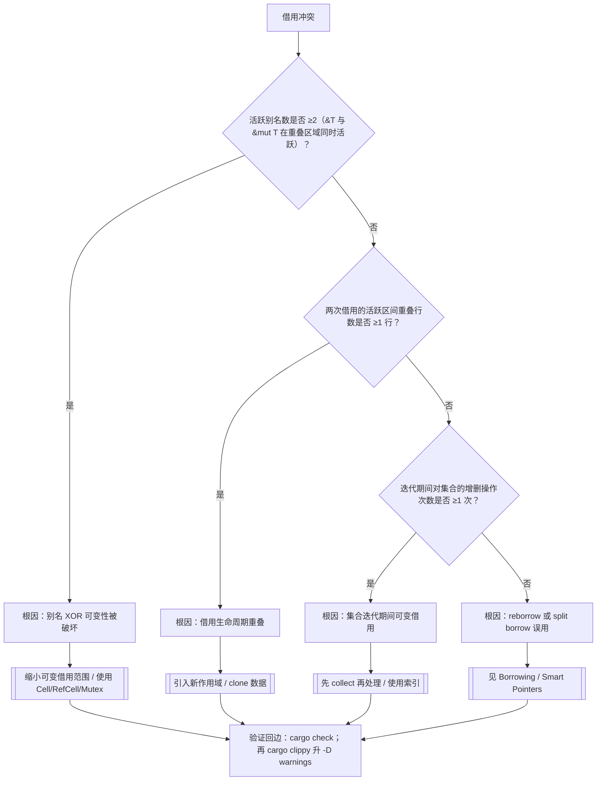
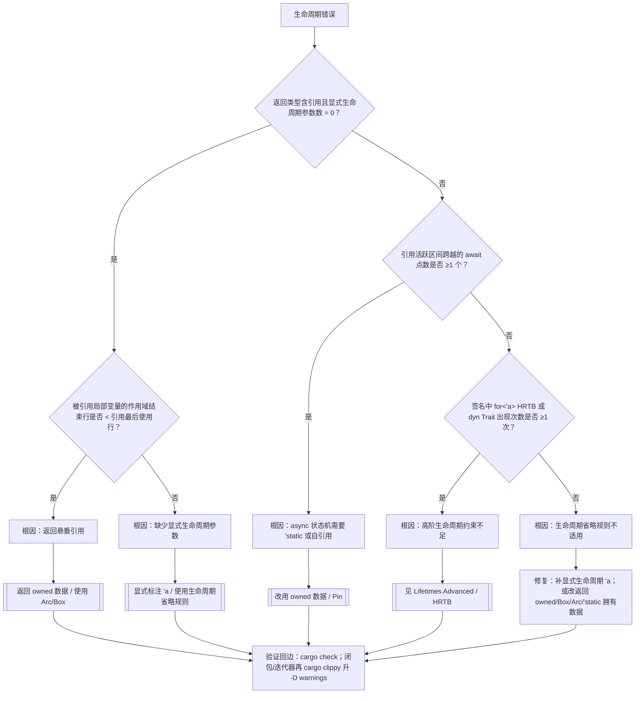
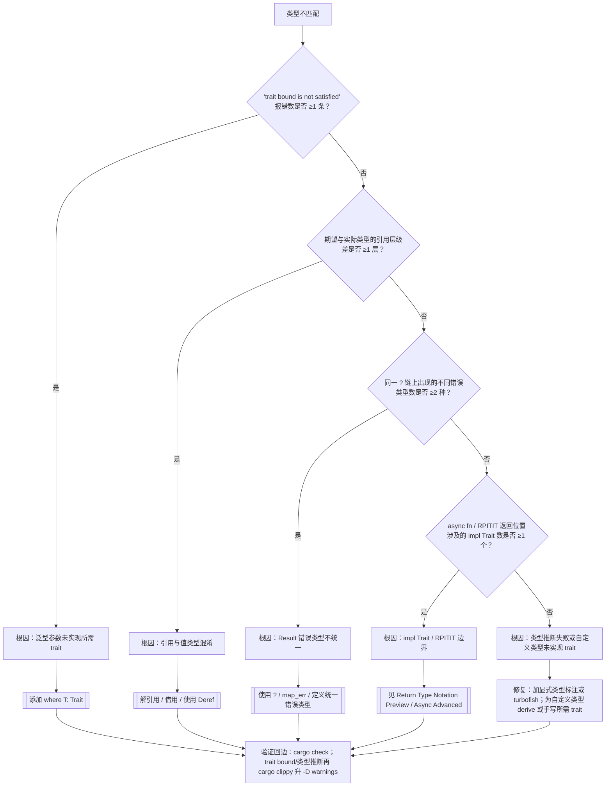
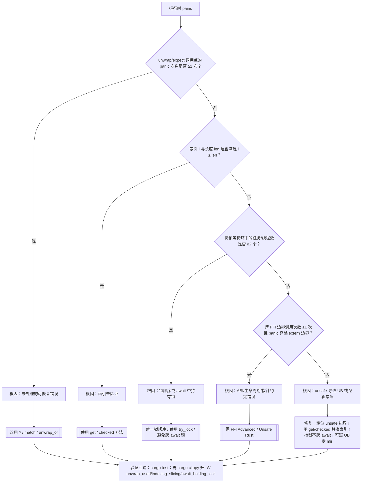
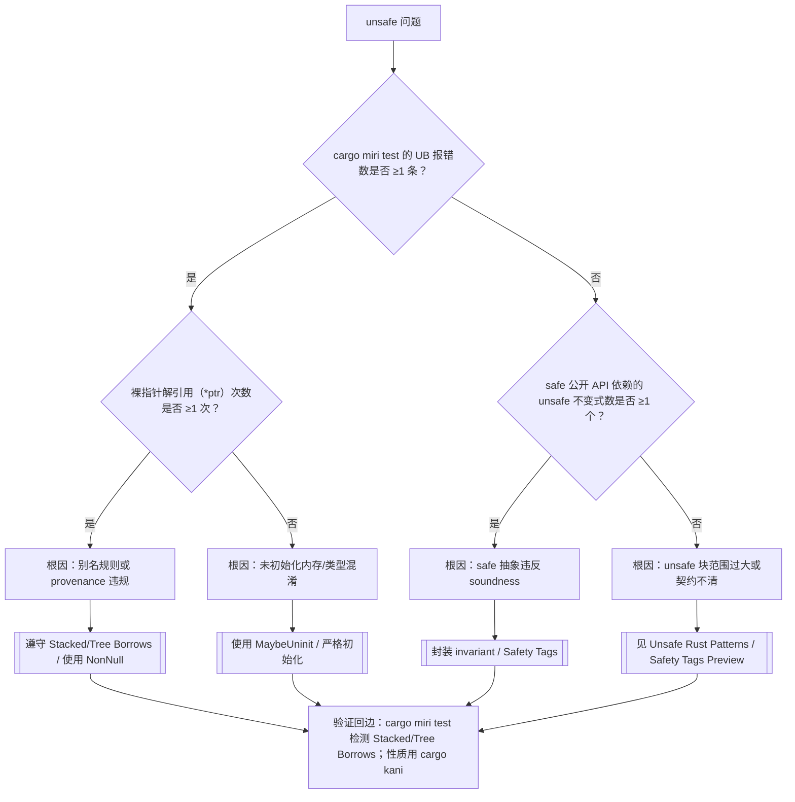
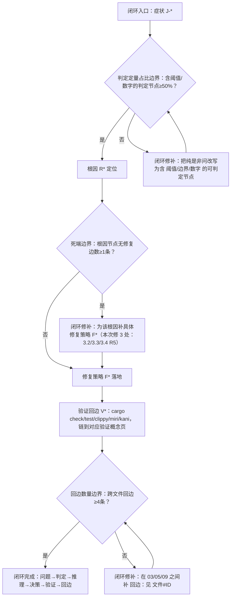

# 推理判定树图谱（Reasoning Judgment Tree Atlas）

> **EN**: Reasoning Judgment Tree Atlas
> **Summary**: Symptom → diagnostic question → root cause → fix strategy concept paths for compiler errors and runtime issues. 编译错误/运行时问题 → 判定问题 → 根因 → 修复策略的概念路径。
> **受众**: [研究者]
> **内容分级**: [元层]
> **权威来源**: 本文件为 `concept/` 权威页。
> **来源**: [Rust Reference](https://doc.rust-lang.org/reference/introduction.html) · [TRPL](https://doc.rust-lang.org/book/title-page.html)

---

## 一、使用说明

本图谱将常见编译错误与运行时问题抽象为**判定树**。每个节点提出一个诊断问题，最终叶子给出根因与应进入的权威概念页。本页不展开具体修复代码，只提供导航。

---

## 二、症状索引表

| 症状类别 | 典型报错/现象 | 入口判定树 |
|:---:|:---|:---|
| 借用冲突 | `cannot borrow as mutable` / `cannot borrow as immutable` | [借用冲突判定树](#31-借用冲突判定树) |
| 生命周期 | `lifetime may not live long enough` | [生命周期判定树](#32-生命周期判定树) |
| 类型不匹配 | `expected ... found ...` / trait bound unsatisfied | [类型不匹配判定树](#33-类型不匹配判定树) |
| 运行时 panic | `unwrap` panic / index out of bounds / deadlock | [运行时 panic 判定树](#34-运行时-panic-判定树) |
| unsafe 相关 | UB / Miri 报错 / soundness 质疑 | [unsafe 判定树](#35-unsafe-判定树) |

---

## 三、主要判定树

### 3.1 借用冲突判定树

### 3.2 生命周期判定树

### 3.3 类型不匹配判定树

### 3.4 运行时 panic 判定树

### 3.5 Unsafe 判定树

---

## 四、按修复策略索引

| 修复策略 | 适用症状 | 权威概念页 |
|:---|:---|:---|
| 缩小借用范围 | 借用冲突、生命周期 | [Borrowing](../../01_foundation/01_ownership_borrow_lifetime/02_borrowing.md), [Lifetimes](../../01_foundation/01_ownership_borrow_lifetime/03_lifetimes.md) |
| 使用内部可变性 | 需要可变但只能拿到共享引用 | [Interior Mutability](../../02_intermediate/02_memory_management/08_interior_mutability.md) |
| 使用智能指针 | 共享所有权、堆分配、自引用 | [Smart Pointers](../../02_intermediate/02_memory_management/12_smart_pointers.md), [Pin and Unpin](../../03_advanced/01_async/06_pin_unpin.md) |
| 统一错误类型 | Result 链报错 | [Error Handling Deep Dive](../../02_intermediate/03_error_handling/16_error_handling_deep_dive.md) |
| 使用并发原语 | 跨线程数据竞争/死锁 | [Concurrency](../../03_advanced/00_concurrency/01_concurrency.md), [Concurrency Patterns](../../03_advanced/00_concurrency/10_concurrency_patterns.md) |
| 形式化验证 | unsafe soundness 怀疑 | [Miri](../../04_formal/04_model_checking/31_miri.md), [Kani](../../04_formal/04_model_checking/32_kani.md), [RustBelt](../../04_formal/02_separation_logic/04_rustbelt.md) |

---

## 五、使用判定树的技巧

1. 从报错信息或现象定位症状类别。
2. 按顺序回答每个判定问题，避免同时修改多处代码。
3. 到达叶子节点后，先阅读推荐的权威概念页，再实施修复。
4. 若问题仍未解决，使用 [Miri](../../04_formal/04_model_checking/31_miri.md) 或 [Kani](../../04_formal/04_model_checking/32_kani.md) 进一步验证。

## 六、与相关元页的关系

- 需要按场景决策 → [场景决策树图谱](03_scenario_decision_tree_atlas.md)
- 需要查看示例/反例 → [示例与反例图谱](04_example_counterexample_atlas.md)
- 需要逻辑推理链 → [逻辑推理图谱](05_logical_reasoning_atlas.md)
- 需要概念定义 → [概念定义图谱](01_concept_definition_atlas.md)

---

## 闭环增强（可执行化）

> 本小节为**纯增量**补充：为 §3 五棵判定树补上「根因 → 具体修复 → 验证回边」的闭环，并赋予稳定 ID（入口 `J-*`、验证 `V1–V5`），与 03（场景决策）/05（定理）建立跨文件回边。原 §2–§6 全部内容保持不变；§3.1–§3.5 仅在原树**末尾追加**修复与验证节点（不删不改原节点）。
>
> 入口稳定 ID：`J-BORROW-01`（§3.1 借用冲突）、`J-LIFE-02`（§3.2 生命周期）、`J-TYPE-03`（§3.3 类型不匹配）、`J-PANIC-04`（§3.4 运行时 panic）、`J-UNSAFE-05`（§3.5 unsafe）。

### L. 死端修复（3 处：根因 → 具体修复策略）

| 判定树 | 原死端根因 | 补的具体修复策略（已追加到原树） |
|:---:|:---|:---|
| §3.2 生命周期 | `R5` 生命周期省略规则不适用 | `F5` 补显式生命周期 `'a`；或改返回 owned/`Box`/`Arc`/`'static` 拥有数据 |
| §3.3 类型不匹配 | `R5` 类型推断失败或自定义类型未实现 trait | `F5` 加显式类型标注或 turbofish；为自定义类型 derive 或手写所需 trait |
| §3.4 运行时 panic | `R5` unsafe 导致 UB 或逻辑错误 | `F5` 定位 unsafe 边界；用 `get`/`checked` 替换索引；持锁不跨 await；可疑 UB 走 miri |

> 修复后三处根因节点均有出边（`R5 --> F5`），不再是无修复死端。

### M. 验证回边（每棵树末尾追加 V1–V5）

| 验证节点 | 对应判定树 | 精确命令 | 验证概念页 |
|:---:|:---|:---|:---|
| `V1` | §3.1 借用冲突（`J-BORROW-01`） | `cargo check` → `cargo clippy --all-targets -- -D warnings` | [Cargo Profiles and Lints](../../06_ecosystem/01_cargo/65_cargo_profiles_and_lints.md) |
| `V2` | §3.2 生命周期（`J-LIFE-02`） | `cargo check` → `cargo clippy --all-targets -- -D warnings` | [Cargo Profiles and Lints](../../06_ecosystem/01_cargo/65_cargo_profiles_and_lints.md) |
| `V3` | §3.3 类型不匹配（`J-TYPE-03`） | `cargo check` → `cargo clippy --all-targets -- -D warnings` | [Cargo Profiles and Lints](../../06_ecosystem/01_cargo/65_cargo_profiles_and_lints.md) |
| `V4` | §3.4 运行时 panic（`J-PANIC-04`） | `cargo test --all-targets` → `cargo clippy --all-targets -- -W clippy::unwrap_used -W clippy::indexing_slicing -W clippy::await_holding_lock`；可疑 UB 走 `cargo +nightly miri test --all-targets` | [Testing Strategies](../../06_ecosystem/09_testing_and_quality/12_testing_strategies.md) · [Miri](../../04_formal/04_model_checking/31_miri.md) |
| `V5` | §3.5 unsafe（`J-UNSAFE-05`） | `cargo +nightly miri test --all-targets` → `cargo kani` | [Miri](../../04_formal/04_model_checking/31_miri.md) · [Kani](../../04_formal/04_model_checking/32_kani.md) |

> 说明：上表 clippy lint（`unwrap_used`/`indexing_slicing`/`await_holding_lock`）为真实 lint 名，但可用性随 toolchain 版本可能调整（⚠需复核）；不确定时退回通用 `cargo clippy --all-targets -- -D warnings`。

### N. 闭环总图（问题 → 判定 → 推理 → 决策 → 验证 → 回边）

> 叶子合规：K9/K5/K7/K6/K10 均为具体动作或状态，无 `[[` 跳出；定量判定节点 K1/K3/K8 含「≥50%/≥1条/≥4条」。

### O. 跨文件回边（`J-*` → 03/05）

| 入口 ID | 回边目标 | 用途 |
|:---:|:---|:---|
| `J-BORROW-01` | 回边：见 [`05_logical_reasoning_atlas.md#TH-BORROW-02`](05_logical_reasoning_atlas.md) | 借用冲突判定的定理依据（别名 XOR 可变性） |
| `J-LIFE-02` | 回边：见 [`05_logical_reasoning_atlas.md#TH-LIFE-03`](05_logical_reasoning_atlas.md) | 生命周期判定的定理依据（引用不悬垂） |
| `J-TYPE-03` | 回边：见 [`03_scenario_decision_tree_atlas.md#T-ABS-01`](03_scenario_decision_tree_atlas.md) | trait bound/对象安全错误的设计期预防入口 |
| `J-PANIC-04` | 回边：见 [`03_scenario_decision_tree_atlas.md#T-CONC-01`](03_scenario_decision_tree_atlas.md) | 死锁（持锁跨 await）的设计期预防入口 |
| `J-UNSAFE-05` | 回边：见 [`05_logical_reasoning_atlas.md#TH-PIN-07`](05_logical_reasoning_atlas.md) 与 [`#TH-TYPE-04`](05_logical_reasoning_atlas.md) | unsafe soundness 质疑的定理依据 |

> 回边：见 [`03_scenario_decision_tree_atlas.md#T-CONC-01`](03_scenario_decision_tree_atlas.md)（`J-PANIC-04` 死锁的设计期预防）；回边：见 [`05_logical_reasoning_atlas.md#TH-SEND-06`](05_logical_reasoning_atlas.md)（`J-UNSAFE-05`/`J-PANIC-04` 并发安全的定理依据）。

### P. 本文件闭环小结

- 修复死端：**3 处**（§3.2/§3.3/§3.4 的 `R5`），均补具体修复策略 `F5` 并接续验证回边。
- 追加验证回边节点：**5 个**（`V1–V5`，每棵判定树末尾各一），均含具体命令并链到 Miri/Kani/Clippy 概念页。
- 新增 mermaid：**1 个**（闭环总图）；新增定量判定节点：**3 个**（K1/K3/K8）。
- 跨文件回边：**7 条**（→ 05：`TH-BORROW-02`/`TH-LIFE-03`/`TH-PIN-07`/`TH-TYPE-04`/`TH-SEND-06`；→ 03：`T-ABS-01`/`T-CONC-01`）。

---

---

## 国际权威参考 / International Authority References（P0 官方 · P1 学术 · P2 生态）

> 依据 `AGENTS.md` §2「对齐网络国际化权威内容」补充：仅追加已验证可达的权威链接，不改动正文事实。

- **P1 学术/形式化**: [Hogan et al.: Knowledge Graphs (ACM Comput. Surv. 2021)](https://dl.acm.org/doi/10.1145/3447772)
