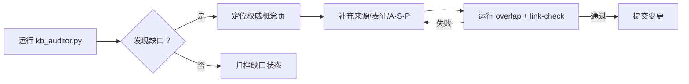

# 缺口与行动计划（Gap and Action Plan）

> **EN**: Gap and Action Plan
> **Summary**: Current gaps identified from topology extraction: source coverage, representation completeness, inter/intra-layer mappings, and definition consistency. 基于拓扑抽取结果识别的当前缺口：来源覆盖、表征完整性、层间/层内映射、定义一致性。
> **受众**: [研究者]
> **内容分级**: [元层]
> **权威来源**: 本文件为 `concept/` 权威页。
> **来源**: [Rust Reference](https://doc.rust-lang.org/reference/introduction.html) · [TRPL](https://doc.rust-lang.org/book/title-page.html)

---

## 一、当前缺口概览

| 缺口类型 | 数量 | 说明 |
|:---|:---:|:---|
| 无权威来源标注 | 0 | 概念文件未引用任何外部权威来源 |
| 来源标注薄弱（≤2） | 0 | 概念文件仅引用 1–2 个来源 |
| 无定理链 | 148 | 概念文件缺少定理链 |
| 无 A/S/P 标记 | 188 | 概念文件缺少 A/S/P 维度标记 |
| 无知识表征章节 | 254 | 概念文件无决策树/矩阵/示例等表征 |

## 二、缺口根因分析

| 根因 | 影响 | 关联元页 |
|:---|:---|:---|
| 早期文件使用旧模板 | 缺少 A/S/P、Bloom、定理链 | [模板去同质化指南](../03_audit/template_deduplication_guide.md), [双语模板](../01_terminology/bilingual_template_v2.md) |
| 元页与权威页职责边界不清 | 部分正文重复或索引不足 | [AGENTS.md](../../../AGENTS.md), [概念一致性检查清单](../03_audit/concept_consistency_audit_checklist.md) |
| 自动化抽取未覆盖新文件 | 来源数/表征统计滞后 | [质量仪表板](../03_audit/quality_dashboard_v2.md) |
| L7 预览特性迭代快 | 来源与定义随版本变化 | [Rust 形式模型演进跟踪](../../07_future/00_version_tracking/05_rust_version_tracking.md) |

## 三、优先修复任务

### P0：补全权威来源（L1–L4 核心概念）

| 概念 | 层级 | 当前来源数 | 建议行动 |
|:---|:---:|:---:|:---|
| [Rust 起步指南](../../01_foundation/00_start/00_start.md) | L1 | 9 | 补充 TRPL 与 Rust Reference 引用 |
| [Ownership](../../01_foundation/01_ownership_borrow_lifetime/01_ownership.md) | L1 | 32 | 已充足，维持 |
| [引用语义](../../01_foundation/03_values_and_references/05_reference_semantics.md) | L1 | 44 | 维持 |
| [Traits](../../02_intermediate/00_traits/01_traits.md) | L2 | 50 | 补充 RFC 与类型论来源 |
| [Generics](../../02_intermediate/01_generics/02_generics.md) | L2 | 59 | 已充足，维持 |
| [Unsafe Rust](../../03_advanced/02_unsafe/03_unsafe.md) | L3 | 72 | 补充 Rustonomicon 与形式化论文 |
| [Async/Await](../../03_advanced/01_async/02_async.md) | L3 | 93 | 维持 |
| [Linear Logic](../../04_formal/01_ownership_logic/01_linear_logic.md) | L4 | 39 | 补充教学讲义 |
| [Type Theory](../../04_formal/00_type_theory/02_type_theory.md) | L4 | 44 | 维持 |

### P1：增强知识表征

| 概念 | 层级 | 缺失表征 | 建议行动 |
|:---|:---:|:---|:---|
| [Rust 起步指南](../../01_foundation/00_start/00_start.md) | L1 | 决策树/矩阵/示例 | 补充属性矩阵或示例反例 |
| [引用语义：自动解引用、Deref 强制与类型转换](../../01_foundation/03_values_and_references/05_reference_semantics.md) | L1 | 决策树/矩阵/示例 | 补充属性矩阵或示例反例 |
| [零成本抽象：Rust 的性能哲学](../../01_foundation/00_start/06_zero_cost_abstractions.md) | L1 | 决策树/矩阵/示例 | 补充属性矩阵或示例反例 |
| [控制流：表达式导向的流程控制](../../01_foundation/04_control_flow/07_control_flow.md) | L1 | 决策树/矩阵/示例 | 补充属性矩阵或示例反例 |
| [集合类型：Rust 标准库的数据结构谱系](../../01_foundation/05_collections/08_collections.md) | L1 | 决策树/矩阵/示例 | 补充属性矩阵或示例反例 |
| [字符串与文本：Rust 的 Unicode 处理与格式化系统](../../01_foundation/06_strings_and_text/09_strings_and_text.md) | L1 | 决策树/矩阵/示例 | 补充属性矩阵或示例反例 |
| [数值类型与运算：从整数到浮点的完整图景](../../01_foundation/02_type_system/10_numerics.md) | L1 | 决策树/矩阵/示例 | 补充属性矩阵或示例反例 |
| [模块系统与路径：Rust 的代码组织哲学](../../01_foundation/07_modules_and_items/11_modules_and_paths.md) | L1 | 决策树/矩阵/示例 | 补充属性矩阵或示例反例 |
| [属性与声明宏：编译期元编程基础](../../01_foundation/09_macros_basics/12_attributes_and_macros.md) | L1 | 决策树/矩阵/示例 | 补充属性矩阵或示例反例 |
| [Panic 与 Abort：不可恢复错误的处理机制](../../01_foundation/08_error_handling/13_panic_and_abort.md) | L1 | 决策树/矩阵/示例 | 补充属性矩阵或示例反例 |
| [类型强制与转换：显式与隐式的边界](../../01_foundation/02_type_system/14_coercion_and_casting.md) | L1 | 决策树/矩阵/示例 | 补充属性矩阵或示例反例 |
| [闭包基础：捕获环境与匿名函数](../../01_foundation/00_start/15_closure_basics.md) | L1 | 决策树/矩阵/示例 | 补充属性矩阵或示例反例 |
| [测试基础：从单元测试到集成测试](../../01_foundation/10_testing_basics/16_testing_basics.md) | L1 | 决策树/矩阵/示例 | 补充属性矩阵或示例反例 |
| [字符串与编码：Rust 的文本处理类型系统](../../01_foundation/06_strings_and_text/18_strings_and_encoding.md) | L1 | 决策树/矩阵/示例 | 补充属性矩阵或示例反例 |
| [值语义 vs 引用语义](../../01_foundation/03_values_and_references/19_value_vs_reference_semantics.md) | L1 | 决策树/矩阵/示例 | 补充属性矩阵或示例反例 |
| [Move 语义：C++ 与 Rust 的资源转移模型](../../01_foundation/01_ownership_borrow_lifetime/23_move_semantics.md) | L1 | 决策树/矩阵/示例 | 补充属性矩阵或示例反例 |
| [Never Type (`!`)：底类型与穷尽性](../../01_foundation/02_type_system/31_never_type.md) | L1 | 决策树/矩阵/示例 | 补充属性矩阵或示例反例 |
| [Rust 错误处理基础](../../01_foundation/08_error_handling/32_error_handling_basics.md) | L1 | 决策树/矩阵/示例 | 补充属性矩阵或示例反例 |
| [编程语言理论基础](../../01_foundation/00_start/34_pl_prerequisites.md) | L1 | 决策树/矩阵/示例 | 补充属性矩阵或示例反例 |
| [Preludes](../../01_foundation/07_modules_and_items/35_preludes.md) | L1 | 决策树/矩阵/示例 | 补充属性矩阵或示例反例 |
| [Rust 关键字](../../01_foundation/00_start/36_keywords.md) | L1 | 决策树/矩阵/示例 | 补充属性矩阵或示例反例 |
| [Rust 运算符与符号](../../01_foundation/00_start/37_operators_and_symbols.md) | L1 | 决策树/矩阵/示例 | 补充属性矩阵或示例反例 |
| [Crate 与源文件](../../01_foundation/07_modules_and_items/38_crates_and_source_files.md) | L1 | 决策树/矩阵/示例 | 补充属性矩阵或示例反例 |

### P2：对齐国际标准

针对以下主题补充 Unicode / ISO / IEEE / IETF / ABI 标准引用：

- 字符串与编码：`concept/01_foundation/06_strings_and_text/18_strings_and_encoding.md` → Unicode Standard
- 内联汇编：`concept/03_advanced/05_inline_assembly/13_inline_assembly.md` → Intel/ARM 架构手册
- 网络编程：`concept/03_advanced/06_low_level_patterns/18_network_programming.md` → IETF RFCs
- ABI：`concept/04_formal/05_rustc_internals/38_application_binary_interface.md` → Itanium C++ ABI / System V AMD64 ABI
- 交叉编译/嵌入式：`concept/06_ecosystem/05_systems_and_embedded/17_cross_compilation.md` / `22_embedded_systems.md` → 目标平台规范

## 四、行动计划阶段表

| 阶段 | 时间窗口 | 目标 | 关键产出 |
|:---:|:---|:---|:---|
| Phase 1 | 当前–Q2 末 | 完成元层图谱补全 | 本目录 10 个 atlas 文件 ≥100 行且通过链接检查 |
| Phase 2 | Q3 | 补全 L1 表征缺口 | L1 核心页均含表格/示例/决策树之一 |
| Phase 3 | Q4 | 补全 A/S/P 与定理链 | 覆盖率仪表板缺口数下降 50% |
| Phase 4 | 明年 Q1 | 自动化拓扑生成 | `extract_concept_topology.py` 稳定运行 |

## 五、修复工作流

## 六、自动化建议

1. 在 `kb_auditor.py` 中增加：概念文件必须引用至少一个 L1 来源。
2. 每月运行 `extract_concept_topology.py` + `generate_knowledge_topology_atlas.py` 生成图谱集。
3. 对新增文件自动检测是否包含决策树/矩阵/示例反例中的一种表征。
4. 将本行动计划中的缺口列表与 [全局待办清单](../00_framework/todos.md) 同步。

## 七、当前状态速览

| 缺口 | 当前数量 | 目标 |
|:---|:---:|:---|
| 无定理链 | 148 | 逐步降低至 50 以下 |
| 无 A/S/P 标记 | 188 | 逐步降低至 50 以下 |
| 无知识表征章节 | 254 | 优先补全 L1 核心概念 |

---

> **内容分级**: [元层]

---

## 国际权威参考 / International Authority References（P0 官方 · P1 学术 · P2 生态）

> 依据 `AGENTS.md` §2「对齐网络国际化权威内容」补充：仅追加已验证可达的权威链接，不改动正文事实。

- **P1 学术/形式化**: [Hogan et al.: Knowledge Graphs (ACM Comput. Surv. 2021)](https://dl.acm.org/doi/10.1145/3447772)
