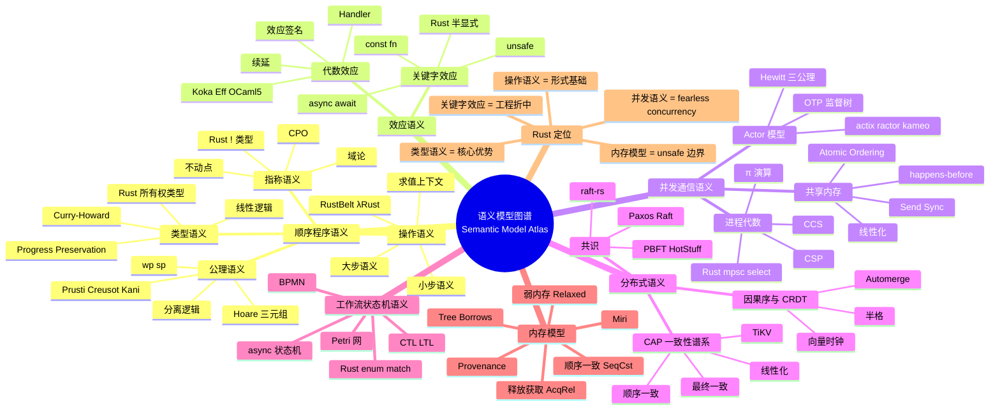

# 语义模型图谱（Semantic Model Atlas）

> **EN**: Semantic Model Atlas
> **Summary**: A unified cognitive map of semantic models for programming languages, mapping operational, denotational, axiomatic, type, effect, concurrency, distributed, workflow, and memory models to their canonical concept pages, representative tools, and Rust relationships.
> **Rust 版本**: 1.97.0+ (Edition 2024)
> **Bloom 层级**: L0-L1 (meta-navigation / atlas)
> **权威来源**: 本文件为 `concept/` 元层导航图谱。
> **受众**: [初学者]
> **内容分级**: [综述级]
> **前置概念**: [Concept Definition Atlas](01_concept_definition_atlas.md) · [Inter-Layer Mapping](06_inter_layer_mapping_atlas.md)
> **后置概念**: [Algebraic Effects](../../04_formal/07_concurrency_semantics/04_algebraic_effects.md) · [Dependent Types](../../04_formal/00_type_theory/10_dependent_refinement_types.md) · [Process Calculi](../../04_formal/07_concurrency_semantics/01_process_calculi_for_rust.md) · [Language Semantic Model Matrix](../../05_comparative/00_paradigms/05_language_semantic_model_matrix.md)

---

## 一、概述

**语义模型（Semantic Model）**是对程序“含义”的数学化描述。同一语法在不同语义模型下会呈现不同侧面：操作语义回答“程序如何一步一步执行”，指称语义回答“程序表示什么数学对象”，公理语义回答“程序满足什么规约”。本图谱把 Rust 知识库中分散的语义模型页统一组织成一张认知地图，帮助读者在 30 秒内定位自己需要的语义视角。

> **核心主张**：没有“唯一正确”的语义模型。Rust 的安全保证之所以强大，正是因为它在**类型语义**、**操作语义**、**内存模型**和**并发语义**之间建立了相互支撑的三角：类型系统排除非法程序，操作语义定义合法执行，内存模型约束底层访问，并发语义保证线程交互。

本页不重复各模型的详细推导，只提供：

1. **分类框架**——九大语义模型族及其子类；
2. **速查卡片**——每族模型的核心问题、形式工具、代表语言/工具、决策上下文、Rust 关联；
3. **Rust 定位**——Rust 在语义模型空间中的坐标；
4. **全局矩阵**——模型 × 形式工具 × 权威页的对照表；
5. **边界与反命题**——常见误判和模型选择陷阱。

---

## 二、语义模型分类

```text
语义模型空间
├── 顺序程序语义（Sequential Semantics）
│   ├── 操作语义（Operational）—— 如何执行
│   ├── 指称语义（Denotational）—— 表示什么数学对象
│   ├── 公理语义（Axiomatic）—— 满足什么规约
│   └── 类型语义（Type Semantics）—— 类型意味着什么
├── 计算效应语义（Effect Semantics）
│   ├── 代数效应与处理器（Algebraic Effects）
│   ├── Monad / 库级效应
│   └── 关键字效应（async / const / unsafe）
├── 并发与通信语义（Concurrency Semantics）
│   ├── 进程代数（CSP / CCS / π-calculus）
│   ├── Actor 模型
│   ├── 共享内存 + 内存模型
│   └── 线性化与一致性谱系
├── 分布式语义（Distributed Semantics）
│   ├── 共识与状态机复制（Raft / Paxos / PBFT）
│   ├── CAP 与一致性谱系
│   └── 因果序 / 向量时钟 / CRDT
├── 工作流与状态机语义（Workflow / State-Machine Semantics）
│   ├── Petri 网
│   ├── BPMN 形式化映射
│   └── 时态逻辑（CTL / LTL）
└── 内存模型（Memory Models）
    ├── 顺序一致性（Sequential Consistency）
    ├── 释放-获取（Release-Acquire）
    └── 弱内存与 happens-before
```

---

## 三、全局语义模型矩阵

| 模型族 | 核心问题 | 形式工具 | 代表语言 / 工具 | 何时使用 | Rust 关联 | 权威页链接 |
|:---|:---|:---|:---|:---|:---|:---|
| **操作语义** | 程序如何一步一步执行 | 小步/大步归约、SOS、CESK | λRust / K Framework / RustSEM / Miri | 需要精确定义执行步骤、证明编译器优化正确、分析并发交错 | RustBelt 使用 Iris 小步语义；Miri 解释执行 Tree Borrows | [操作语义](../../04_formal/03_operational_semantics/03_operational_semantics.md) |
| **指称语义** | 程序表示什么数学对象 | 完全偏序（CPO）、不动点、域论 | Scott-Strachey 框架 / Redex | 证明程序等价、类型安全 soundness、递归语义 | Rust 缺乏完整指称语义；`!` 类型对应底元素 ⊥ | [指称语义](../../04_formal/03_operational_semantics/01_denotational_semantics.md) |
| **公理语义** | 程序满足什么规约 | Hoare 三元组、wp/sp、分离逻辑 | Prusti / Creusot / Kani / Dafny | 需要验证功能性正确性、循环不变式、内存安全 | 借用检查器是“轻量级全自动公理验证器” | [公理语义](../../04_formal/03_operational_semantics/05_axiomatic_semantics.md) |
| **类型语义** | 类型意味着什么 | 进步/保持定理、Curry-Howard、线性逻辑 | System F / Rust 类型系统 | 需要把不变式编码进类型、在编译期排除错误类 | `&mut T` 是独占能力；`Option`/`Result` 是代数效应 | [类型语义](../../04_formal/00_type_theory/06_type_semantics.md) |
| **代数效应** | 副作用如何被追踪与解释 | 效应签名、handler、续延、行多态 | Koka / Eff / OCaml 5 | 需要组合多种副作用、可替换解释、结构化并发 | Rust 仅有“关键字效应”（async/const/unsafe），无通用 handler | [代数效应](../../04_formal/07_concurrency_semantics/04_algebraic_effects.md) |
| **进程代数** | 通信结构的形式血统 | CSP / CCS / π 演算、互模拟 | FDR / CSPm / 手写形式规约 | 分析 channel 语义、证明协议等价、教学并发 | `mpsc` / `select!` 的设计血统来自 CSP | [进程代数](../../04_formal/07_concurrency_semantics/01_process_calculi_for_rust.md) |
| **Actor 模型** | 命名进程 + 邮箱如何交互 | Hewitt 三公理、Agha 配置语义 | Erlang/OTP / Akka / actix / ractor | 需要位置透明、监督树、容错、分布式消息传递 | Rust actor crate 用类型系统保证消息匹配与 `Send` | [Actor 语义](../../04_formal/07_concurrency_semantics/03_actor_semantics.md) |
| **共享内存并发** | 多线程共享对象何时正确 | 线性化、happens-before、内存序 | Herlihy-Wing 框架 / C++11 内存模型 | 实现无锁数据结构、精确控制原子操作 | `Atomic*` + `Ordering` 直接暴露内存序 | [原子操作与内存序](../../03_advanced/00_concurrency/06_atomics_and_memory_ordering.md) |
| **分布式共识** | 多节点如何就同一值达成一致 | Quorum、状态机复制、BFT | Raft / Paxos / PBFT / HotStuff | 构建 replicated state machine、区块链、高可用服务 | `raft-rs` / `openraft` / `hotstuff-rs` | [分布式共识](../../06_ecosystem/06_data_and_distributed/06_distributed_consensus.md) |
| **CAP / 一致性谱系** | 分区下能同时保证什么 | 一致性格、可用性/分区容忍性权衡 | Cassandra / Spanner / CockroachDB | 设计分布式数据库、缓存、消息系统 | Rust 生态的 TiKV / CockroachDB 客户端 | [线性化与一致性](../../04_formal/07_concurrency_semantics/02_linearizability_and_consistency.md) |
| **因果序与 CRDT** | 无协调副本如何收敛 | 向量时钟、半格、状态/操作 CRDT | Riak / Redis CRDT / Automerge | 需要离线优先、最终一致、无单点故障 | `crdt` crate 生态 | [CRDT 谱系](../../06_ecosystem/06_data_and_distributed/08_crdt_type_zoo.md) · [因果序](../../06_ecosystem/06_data_and_distributed/09_causal_ordering_vector_clocks.md) |
| **工作流 / 状态机** | 长周期业务过程如何形式化 | Petri 网、BPMN、CTL/LTL | Camunda / Temporal / AWS Step Functions | 编排 Saga、持久化工作流、状态机验证 | `tokio` 状态机、`rusty-machine` 模式 | [工作流理论](../../06_ecosystem/03_design_patterns/17_workflow_theory.md) |
| **内存模型** | 指针、初始化、别名何时合法 | 抽象字节、provenance、Tree Borrows | Miri / LLVM 内存模型 | 写 `unsafe`、FFI、内联汇编、自定义分配器 | Rust 内存模型定义抽象字节与 UB 边界 | [Rust 内存模型](../../03_advanced/02_unsafe/06_memory_model.md) |

---

## 四、各类模型速查

以下按模型族给出“速查卡片”，每张卡片围绕五个问题展开：该模型回答什么核心问题、使用哪些形式工具、有哪些代表语言或工具、在什么决策场景下选用、以及与 Rust 的关联何在。读者可据此快速判断自己需要的语义视角。

### 4.1 顺序程序语义

顺序程序语义回答“单个线程内的代码意味着什么”。下面四张卡片分别对应操作语义（如何执行）、指称语义（表示什么数学对象）、公理语义（满足什么规约）和类型语义（类型意味着什么），它们从执行、数学、规约和类型四个视角刻画同一类程序。

#### 操作语义（Operational Semantics）

- **核心问题**：程序从状态 `s` 出发，一步能变成什么状态 `s'`？
- **形式工具**：小步语义 `⟨e, σ⟩ → ⟨e', σ'⟩`、大步语义 `⟨e, σ⟩ ⇓ ⟨v, σ'⟩`、求值上下文 `E[·]`。
- **代表语言/工具**：λRust（RustBelt）、KRust / RustSEM（K Framework）、Miri（可执行语义）。
- **决策上下文**：
  - 需要描述完整执行轨迹 → 小步语义；
  - 只需要证明类型安全 → 大步语义；
  - 需要动态检测 UB → Miri（基于 Tree Borrows 的操作语义解释器）。
- **Rust 关联**：Rust 没有官方形式化语义，但 RustBelt 在 Iris 中为 λRust 建立了小步操作语义，覆盖所有权转移、借用、并发交错。
- **权威页**：[操作语义](../../04_formal/03_operational_semantics/03_operational_semantics.md)

#### 指称语义（Denotational Semantics）

- **核心问题**：程序 `e` 的“意思”是什么数学对象 `[[e]]`？
- **形式工具**：Scott 域、完全偏序（CPO）、Kleene 不动点定理。
- **代表语言/工具**：PCF / Redex / 纸笔形式化。
- **决策上下文**：
  - 证明程序等价 → 指称等价是最粗的一致等价；
  - 处理递归/非终止 → 需要 CPO 与 ⊥；
  - 分析并发/弱内存 → 指称语义通常不如操作语义直接。
- **Rust 关联**：Rust 的递归类型（如 `enum List { Nil, Cons(i32, Box<List>) }`）需要域论不动点解释；`!`（never type）对应底元素 ⊥。
- **权威页**：[指称语义](../../04_formal/03_operational_semantics/01_denotational_semantics.md)

#### 公理语义（Axiomatic Semantics）

- **核心问题**：给定前置条件 `P`，执行 `C` 后能否保证后置条件 `Q`？
- **形式工具**：Hoare 三元组 `{P} C {Q}`、最弱前置条件 `wp(C, Q)`、最强后置条件 `sp(P, C)`、分离逻辑。
- **代表语言/工具**：Dafny、Frama-C、Prusti、Creusot、Kani。
- **决策上下文**：
  - 需要验证函数契约 → Creusot（wp）/ Prusti（Viper）；
  - 需要快速找反例 → Kani（符号执行/sp 方向）；
  - 需要处理别名/并发 → 分离逻辑 / RustBelt。
- **Rust 关联**：Rust 借用检查器本质上是一个全自动的轻量级公理验证器——它把所有权/生命周期不变式“编译”进类型系统。
- **权威页**：[公理语义](../../04_formal/03_operational_semantics/05_axiomatic_semantics.md)

#### 类型语义（Type Semantics）

- **核心问题**：类型 `T` 意味着什么？类型系统如何保证安全？
- **形式工具**：进步定理（Progress）、保持定理（Preservation）、Curry-Howard 对应、线性逻辑。
- **代表语言/工具**：System F、MLTT、Idris、Agda。
- **决策上下文**：
  - 需要把不变式编码进类型 → 依赖/细化类型；
  - 需要资源管理保证 → 线性/仿射类型；
  - 需要在工业可部署性与表达力之间平衡 → Rust/Haskell/OCaml。
- **Rust 关联**：Rust 的类型系统是“逻辑语义 + 子结构语义”的融合：`T: Clone` 是逻辑断言，`T` 只能 move 一次是资源约束。
- **权威页**：[类型语义](../../04_formal/00_type_theory/06_type_semantics.md)

---

### 4.2 计算效应语义

计算效应语义关注副作用如何被追踪、组合和解释。下面先介绍通用代数效应与效应处理器的理想模型，再对照 Rust 中通过 `async`/`const`/`unsafe` 等关键字实现的“半显式”效应，帮助读者理解 Rust 在通用 effect 系统与工程实践之间的取舍。

#### 代数效应与效应处理器（Algebraic Effects）

- **核心问题**：函数在计算过程中向环境请求哪些服务？这些服务如何被解释？
- **形式工具**：效应签名、handler、限定续延（delimited continuation）、行多态。
- **代表语言/工具**：Koka、Eff、Effekt、OCaml 5。
- **决策上下文**：
  - 需要组合多种副作用且不想用 Monad 变换器 → 代数效应；
  - 需要可恢复异常/状态/非确定性 → handler + 续延；
  - 需要零成本实现 → 一次性续延（one-shot）如 Koka / Rust async。
- **Rust 关联**：Rust 当前没有通用 effect handler。`async`/`await` 是一种受限的“关键字效应”：它在类型系统中留下 `Future<Output = T>` 轨迹，但不覆盖 I/O、异常等全部副作用。
- **权威页**：[代数效应](../../04_formal/07_concurrency_semantics/04_algebraic_effects.md)

#### 关键字效应（Keyword Effects）

- **核心问题**：语言对特定副作用（异步、常量求值、unsafe）提供语法支持，但不在类型系统中统一追踪。
- **形式工具**：effect 关键字、状态机转换、const 求值上下文。
- **代表语言/工具**：Rust（`async`/`await`、`const fn`、`unsafe`）、C# (`async`)、Swift (`async`)。
- **决策上下文**：
  - 需要高性能异步 I/O → `async`/`await`；
  - 需要编译期计算 → `const fn`；
  - 需要调用底层原语 → `unsafe`。
- **Rust 关联**：Rust 的 effect 关键字是“半显式”的：调用 `async fn` 必须 `await`，调用 `unsafe` 必须写 `unsafe` 块，但不存在统一的 `effect` 类型约束。
- **权威页**：[副作用与纯度](../../01_foundation/00_start/04_effects_and_purity.md) · [Async/Await](../../03_advanced/01_async/01_async.md)

---

### 4.3 并发与通信语义

并发与通信语义刻画多个执行实体如何交互。下面从进程代数（通信结构）、Actor 模型（命名进程与邮箱）和共享内存线性化（多线程共享对象正确性）三个角度展开，分别对应 Rust 中 channel、actor 框架和原子操作三类并发范式的形式基础。

#### 进程代数（Process Calculi）

- **核心问题**：通信结构的形式血统是什么？两个并发程序何时行为等价？
- **形式工具**：CSP（Hoare）、CCS（Milner）、π 演算（Milner/Parrow/Walker）、互模拟。
- **代表语言/工具**：FDR、CSPm、Go（CSP 风格 channel）、Rust `mpsc`。
- **决策上下文**：
  - 需要同步会合通信 → CSP；
  - 需要动态改变通信拓扑 → π 演算；
  - 需要证明协议等价 → 互模拟。
- **Rust 关联**：Rust 的 `mpsc`/`select!` 设计血统来自 CSP，但默认 `channel()` 是无界缓冲，只有 `sync_channel(0)` 才是会合语义。
- **权威页**：[进程代数](../../04_formal/07_concurrency_semantics/01_process_calculi_for_rust.md)

#### Actor 模型

- **核心问题**：命名进程 + 邮箱如何交互？失败如何被隔离与恢复？
- **形式工具**：Hewitt 三公理（send/create/become）、Agha 配置语义、OTP 监督树。
- **代表语言/工具**：Erlang/OTP、Akka、actix、ractor、kameo。
- **决策上下文**：
  - 需要位置透明、监督树、容错 → Erlang/OTP 或 Rust actor 框架；
  - 需要强类型消息匹配 → Rust actor crate（编译期检查）。
- **Rust 关联**：Rust actor 框架用类型系统保证：消息类型编译期匹配、跨线程消息必须 `Send`。
- **权威页**：[Actor 语义](../../04_formal/07_concurrency_semantics/03_actor_semantics.md)

#### 共享内存并发与线性化

- **核心问题**：多线程共享对象的“正确”精确定义是什么？
- **形式工具**：Herlihy-Wing 线性化、历史/线性化点、一致性谱系、happens-before。
- **代表语言/工具**：Java `java.util.concurrent`、C++ atomic、Rust `std::sync::atomic`。
- **决策上下文**：
  - 需要无锁数据结构 → 线性化点分析；
  - 需要精确控制原子性/可见性 → 内存序选择。
- **Rust 关联**：Rust 的 `Send/Sync` auto trait 在类型层面排除数据竞争；`Atomic*` + `Ordering` 提供与 C++11 同构的内存序模型。
- **权威页**：[线性化与一致性](../../04_formal/07_concurrency_semantics/02_linearizability_and_consistency.md) · [原子操作与内存序](../../03_advanced/00_concurrency/06_atomics_and_memory_ordering.md)

---

### 4.4 分布式语义

分布式语义把并发视角扩展到网络分区与节点故障场景。下面依次讨论分布式共识与状态机复制（如何在故障下达成一致）、CAP 与一致性谱系（分区下的一致性/可用性权衡）以及因果序与 CRDT（无协调副本如何保持因果关系并收敛），三者共同覆盖 Rust 分布式系统设计的核心形式基础。

#### 分布式共识与状态机复制

- **核心问题**：多节点在故障下如何就同一值/日志达成一致？
- **形式工具**：Quorum、状态机复制（SMR）、FLP 不可能性、部分同步假设。
- **代表语言/工具**：Paxos、Raft、PBFT、HotStuff、Tendermint、`raft-rs`。
- **决策上下文**：
  - 节点可信、崩溃故障 → Raft / Paxos（CFT，2f+1）；
  - 节点可能恶意 → PBFT / HotStuff / Tendermint（BFT，3f+1）；
  - 需要可读实现 → Raft。
- **Rust 关联**：TiKV / OpenRaft / hotstuff-rs 等 Rust 实现利用所有权和类型系统减少共识实现中的内存错误。
- **权威页**：[分布式共识](../../06_ecosystem/06_data_and_distributed/06_distributed_consensus.md)

#### CAP 与一致性谱系

- **核心问题**：网络分区下，一致性、可用性、分区容忍性如何权衡？
- **形式工具**：一致性格（从线性化到最终一致）、CAP 定理、PACELC。
- **代表语言/工具**：Spanner（CP）、Cassandra（AP）、CockroachDB（CP）。
- **决策上下文**：
  - 强一致性优先 → CP 系统；
  - 可用性/延迟优先 → AP 系统 + 冲突解决。
- **Rust 关联**：Rust 生态的 TiKV 提供 Spanner-like CP 语义；CRDT/向量时钟支持 AP 场景。
- **权威页**：[线性化与一致性](../../04_formal/07_concurrency_semantics/02_linearizability_and_consistency.md)

#### 因果序与 CRDT

- **核心问题**：无协调副本如何保持因果关系并最终收敛？
- **形式工具**：向量时钟、半格、状态 CRDT / 操作 CRDT。
- **代表语言/工具**：Riak、Redis CRDT、Automerge、`crdt` crate。
- **决策上下文**：
  - 需要离线优先、最终一致 → CRDT；
  - 需要精确因果关系 → 向量时钟。
- **Rust 关联**：Rust 的 `crdt` crate 生态提供了多种 CRDT 实现，类型系统帮助保证合并操作的单调性。
- **权威页**：[CRDT 谱系](../../06_ecosystem/06_data_and_distributed/08_crdt_type_zoo.md) · [因果序与向量时钟](../../06_ecosystem/06_data_and_distributed/09_causal_ordering_vector_clocks.md)

---

### 4.5 工作流与状态机语义

工作流与状态机语义把短周期计算扩展到需要跨时间、跨步骤、可能失败和补偿的长周期业务过程。下面以 Petri 网、BPMN 和时态逻辑为工具，说明如何对这类过程进行建模、执行和验证，并指出 Rust 的 `enum` + `match` 与 `async` 状态机在此视角下的同构性。

#### 工作流 / 状态机形式化

- **核心问题**：长周期业务过程如何被建模、执行和验证？
- **形式工具**：Petri 网、BPMN 形式化映射、CTL/LTL 时态逻辑。
- **代表语言/工具**：Camunda、Temporal、AWS Step Functions、`tokio` 状态机。
- **决策上下文**：
  - 需要图形化建模 → BPMN；
  - 需要形式化验证死锁/可达性 → Petri 网；
  - 需要持久化长周期工作流 → Temporal / 自研状态机。
- **Rust 关联**：Rust 的 `enum` + `match` 是表达状态机的天然工具；`async`/`await` 编译为状态机，与工作流状态机同构。
- **权威页**：[工作流理论](../../06_ecosystem/03_design_patterns/17_workflow_theory.md)

---

### 4.6 内存模型

内存模型回答“多线程或 `unsafe` 代码中，哪些读写顺序和指针使用是合法的”。下面从最强的顺序一致性出发，经过工程常用的释放-获取语义，最后落到 Rust 特有的别名与 provenance 规则，逐层揭示 UB 边界和调试工具。

#### 顺序一致性（Sequential Consistency）

- **核心问题**：多线程执行看起来是否像所有内存操作按某种全局顺序交错？
- **形式工具**：全局总序、程序序、读写的原子性。
- **代表语言/工具**：教学模型、早期共享内存语言。
- **决策上下文**：
  - 教学/理论分析 → SC；
  - 真实高性能硬件 → 弱内存模型。
- **Rust 关联**：`Ordering::SeqCst` 提供顺序一致性，但通常比 `Acquire`/`Release` 更慢。
- **权威页**：[原子操作与内存序](../../03_advanced/00_concurrency/06_atomics_and_memory_ordering.md)

#### 释放-获取（Release-Acquire）

- **核心问题**：如何在不付出 SC 成本的前提下，保证跨线程的“发布-消费”语义？
- **形式工具**：happens-before 关系、synchronizes-with、release sequence。
- **代表语言/工具**：C++11 memory model、Rust `std::sync::atomic`。
- **决策上下文**：
  - 需要生产者-消费者同步 → Release-Acquire；
  - 需要锁自由数据结构 → Acquire/Release + CAS。
- **Rust 关联**：`AtomicPtr::compare_exchange` 配合 `AcqRel`/`Acquire` 是实现无锁队列的标准模式。
- **权威页**：[原子操作与内存序](../../03_advanced/00_concurrency/06_atomics_and_memory_ordering.md)

#### Rust 内存模型（别名与 Provenance）

- **核心问题**：哪些指针使用是合法的？未定义行为（UB）的边界在哪里？
- **形式工具**：抽象字节、初始化/未初始化字节、provenance、Stacked Borrows / Tree Borrows。
- **代表语言/工具**：Miri、LLVM 内存模型、Unsafe Code Guidelines。
- **决策上下文**：
  - 写 `unsafe` / FFI → 必须理解 provenance 与别名规则；
  - 调试 UB → 用 Miri 检测 Tree Borrows 违规。
- **Rust 关联**：Rust 内存模型定义了抽象字节、provenance、以及 Stacked/Tree Borrows 别名模型；这是 `unsafe` 代码正确性的语义基础。
- **权威页**：[Rust 内存模型](../../03_advanced/02_unsafe/06_memory_model.md)

---

## 五、Rust 语义模型定位

本节把 Rust 放进语义模型空间中给出坐标：先以二维图展示形式化强度与工程可部署性之间的权衡，再说明 Rust 如何通过组合类型、操作、内存、并发和效应五层语义模型实现安全保证，最后提供一张按问题选模型的速查表。

### 5.1 Rust 在语义模型空间中的坐标

```text
                    形式化强度
                         ▲
                         │
    指称语义 ─────────────┼───────────── 依赖类型 / ITP
    （CPO/不动点）        │
                         │
    公理语义 ─────────────┼───────────── RustBelt / Iris
    （Hoare/wp）          │              │
                         │              │
    类型语义 ─────────────┼───────────── Rust 类型系统 ◄── Rust 核心优势
    （Progress/          │              │    编译期内存安全
     Preservation）       │              │
                         │              │
    操作语义 ─────────────┼───────────── Miri / λRust
    （小步归约）          │
                         │
    内存模型 ─────────────┼───────────── Tree Borrows
    （provenance）        │
                         │
    并发语义 ─────────────┼───────────── Send/Sync + Atomic
    （Actor/CSP）         │
                         │
    关键字效应 ───────────┼───────────── async/const/unsafe
    （半显式）            │
                         │
    无显式效应 ───────────┼───────────── C / C++ / Go
                         │
                         └────────────────────────────────────► 工程可部署性
```

### 5.2 Rust 的语义模型组合

Rust 的安全保证不是单一语义模型的产物，而是以下五者的组合：

| 语义层 | Rust 机制 | 保证 |
|:---|:---|:---|
| **类型语义** | `&T` / `&mut T` / 所有权 / 生命周期 | 编译期排除悬垂指针、数据竞争、重复释放 |
| **操作语义** | MIR / borrow check / move 检查 | 定义合法执行步骤，支撑 Miri 和 RustBelt |
| **内存模型** | Tree Borrows / provenance / 抽象字节 | 界定 `unsafe` 代码的 UB 边界 |
| **并发语义** | `Send` / `Sync` / `Atomic` / `mpsc` | 类型级无数据竞争 + 可选择的通信模型 |
| **效应语义** | `async` / `const` / `unsafe` 关键字 | 对特定副作用进行语法层面的标记与限制 |

> **关键洞察**：Rust 的“零成本抽象”之所以安全，是因为类型语义已经把大量运行时检查前移到编译期；操作语义和内存模型为这些前移提供了数学基础；并发语义把线程安全也纳入类型系统。

### 5.3 何时选择哪种语义视角？

| 你的问题 | 推荐语义模型 | Rust 工具/页 |
|:---|:---|:---|
| “这段代码为什么编译不过？” | 类型语义 + 操作语义 | [类型语义](../../04_formal/00_type_theory/06_type_semantics.md) · [操作语义](../../04_formal/03_operational_semantics/03_operational_semantics.md) |
| “这段 `unsafe` 代码是否 UB？” | 内存模型 + 操作语义 | [Rust 内存模型](../../03_advanced/02_unsafe/06_memory_model.md) · Miri |
| “这个无锁队列是否正确？” | 并发语义 + 内存模型 | [原子操作与内存序](../../03_advanced/00_concurrency/06_atomics_and_memory_ordering.md) · [线性化与一致性](../../04_formal/07_concurrency_semantics/02_linearizability_and_consistency.md) |
| “这个函数是否满足规约？” | 公理语义 | [公理语义](../../04_formal/03_operational_semantics/05_axiomatic_semantics.md) · Kani / Prusti / Creusot |
| “channel 语义从哪来？” | 进程代数 | [进程代数](../../04_formal/07_concurrency_semantics/01_process_calculi_for_rust.md) |
| “actor 监督树如何工作？” | Actor 语义 | [Actor 语义](../../04_formal/07_concurrency_semantics/03_actor_semantics.md) |
| “分布式共识选什么算法？” | 分布式语义 | [分布式共识](../../06_ecosystem/06_data_and_distributed/06_distributed_consensus.md) |
| “async 状态机如何转换？” | 工作流/状态机语义 + 效应语义 | [工作流理论](../../06_ecosystem/03_design_patterns/17_workflow_theory.md) · [代数效应](../../04_formal/07_concurrency_semantics/04_algebraic_effects.md) |

---

## 六、语义模型全景思维导图



---

## 七、反命题 / 边界

本节列出学习与工程实践中常见的语义模型误判，并给出模型选择边界表。前者帮助读者避免把某种模型过度推广，后者则在具体场景下指出“不该选什么”与“推荐选什么”。

### 7.1 常见误判

1. **“操作语义比指称语义更精确”**
   - **错**。精确性取决于问题：证明程序等价用指称语义更自然；描述执行步骤用操作语义更直接。两者是互补抽象层级。

2. **“Rust 的 `async` 就是完整的代数效应”**
   - **错**。`async`/`await` 是**一次性续延**的受限效应实例，没有通用 `perform`/`handler` 机制，不能组合任意副作用。

3. **“CSP 恒等式可以直接搬到 Rust `select!`”**
   - **错**。CSP 外部选择 `P [] P = P` 在 Rust `select!` 中不成立，因为分支可能有副作用、Drop 行为、公平性策略差异。

4. **“有了类型系统就不需要内存模型”**
   - **错**。Safe Rust 的安全由类型系统保证，但 `unsafe`、FFI、内联汇编的正确性直接依赖 Rust 内存模型与 Tree Borrows。

5. **“分布式共识算法可以任意替换”**
   - **错**。CFT（Raft/Paxos）与 BFT（PBFT/HotStuff）的故障模型、节点数假设、通信复杂度完全不同，不能根据流行度选择。

6. **“SeqCst 总是最安全的内存序”**
   - **部分错**。`SeqCst` 提供全局顺序，但通常比 `Acquire`/`Release` 更慢；在不需要全局顺序的场景下是过度同步。

### 7.2 模型选择边界

| 场景 | 不要选 | 推荐选 | 理由 |
|:---|:---|:---|:---|
| 验证 safe Rust 函数正确性 | 纯操作语义手动推导 | Prusti / Creusot / Kani | 工具可自动化生成验证条件 |
| 分析 `unsafe` UB | 自然语言推理 | Miri + 内存模型 | 需要可执行/可检测的语义 |
| 设计 channel 协议 | 直接拍脑袋写代码 | CSP / π 演算骨架 | 明确同步/缓冲/移动性假设 |
| 构建高可用服务 | 自己写 Paxos | raft-rs / openraft | 工业实现已经处理大量边界 |
| 离线优先协作编辑 | 强一致性数据库 | CRDT + 向量时钟 | 最终一致 + 无单点更符合场景 |
| 长周期 Saga 工作流 | 纯函数组合 | 工作流状态机 / Temporal | 需要持久化、超时、补偿语义 |

---

## 八、来源与延伸阅读

本节提供两类延伸阅读：一级权威来源覆盖形式语义、类型系统、并发、分布式、工作流和 Rust 形式化的经典文献；本库相关导航页则把读者引向知识库中与之对应的 L3–L5 权威概念页。

### 8.1 一级权威来源

| 来源 | 领域 | 说明 |
|:---|:---|:---|
| [Winskel 1993 — The Formal Semantics of Programming Languages](https://mitpress.mit.edu/9780262731034) | 操作/指称/公理语义 | 形式语义经典教材 |
| [Pierce 2002 — Types and Programming Languages](https://www.cis.upenn.edu/~bcpierce/tapl/) | 类型语义 | 类型系统与语言设计的标准参考 |
| [Plotkin 1981 — A Structural Approach to Operational Semantics](https://homepages.inf.ed.ac.uk/gdp/publications/sos_jlap.pdf) | 操作语义 | 结构化操作语义奠基 |
| [Hoare 1978 — Communicating Sequential Processes](https://doi.org/10.1145/359576.359585) | 进程代数 | CSP 奠基论文 |
| [Milner 1999 — Communicating and Mobile Systems: the π-Calculus](https://www.research.ed.ac.uk/en/publications/communicating-and-mobile-systems-the-%CF%80-calculus/) | 进程代数 | π 演算权威专著 |
| [Hewitt, Bishop & Steiger 1973 — A Universal Modular ACTOR Formalism](https://www.ijcai.org/Proceedings/73/Papers/027B.pdf) | Actor 模型 | Actor 模型起源 |
| [Plotkin & Pretnar 2009 — Handlers of Algebraic Effects](https://doi.org/10.1007/978-3-642-00590-9_7) | 代数效应 | 效应处理器奠基 |
| [Herlihy & Wing 1990 — Linearizability: A Correctness Condition for Concurrent Objects](https://doi.org/10.1145/78969.78972) | 并发语义 | 线性化定义 |
| [Lamport 1979 — How to Make a Multiprocessor Computer That Correctly Executes Multiprocess Programs](https://doi.org/10.1109/TC.1979.1675439) | 内存模型 | 顺序一致性奠基 |
| [Lamport 1982 — The Byzantine Generals Problem](https://dl.acm.org/doi/10.1145/357172.357176) | 分布式语义 | 拜占庭容错起源 |
| [FLP 1985 — Fischer, Lynch, Paterson](https://groups.csail.mit.edu/tds/papers/Lynch/jacm85.pdf) | 分布式共识 | 异步共识不可能性 |
| [Ongaro & Ousterhout 2014 — Raft](https://raft.github.io/raft.pdf) | 分布式共识 | 工程可读共识算法 |
| [van der Aalst — Process Mining](https://www.springer.com/gp/book/9783662498507) | 工作流语义 | 工作流/过程挖掘权威 |
| [Rust Reference — Memory Model](https://doc.rust-lang.org/reference/memory-model.html) | Rust 内存模型 | Rust 官方内存模型规范 |
| [RustBelt — Jung et al. POPL 2018](https://plv.mpi-sws.org/rustbelt/popl18/) | Rust 形式化 | Rust 所有权与并发的 Iris 证明 |

### 8.2 本库相关导航页

- [并发形式语义子层导览](../../04_formal/07_concurrency_semantics/README.md)
- [L3 并发编程](../../03_advanced/00_concurrency/01_concurrency.md)
- [L3 Async/Await](../../03_advanced/01_async/01_async.md)
- [L3 Unsafe Rust](../../03_advanced/02_unsafe/01_unsafe.md)
- [L4 线性逻辑](../../04_formal/01_ownership_logic/01_linear_logic.md)
- [L4 RustBelt](../../04_formal/02_separation_logic/01_rustbelt.md)
- [L5 五模型定义矩阵](../../05_comparative/00_paradigms/04_five_models_definition_matrix.md)
- [L5 执行模型同构性矩阵](../../05_comparative/00_paradigms/02_execution_model_isomorphism.md)
- [L3 并行与分布式模式谱系](../../03_advanced/00_concurrency/08_parallel_distributed_pattern_spectrum.md)

---

> **Canonical 声明**：根据 AGENTS.md §2，本页是“语义模型图谱”在 `concept/00_meta/knowledge_topology/` 的单一权威导航页。各模型的详细推导分别位于上述链接的 L3–L4 权威页；其他位置如需涉及同一主题，应使用摘要或重定向 stub，并链接到本页及对应权威页。
