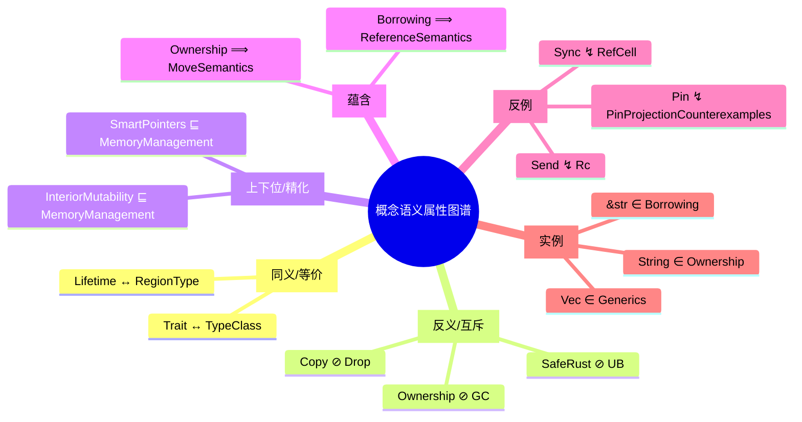

> **EN**: Semantic Properties Atlas
> **Summary**: Curated synonym, antonym, hyponym, entailment, mutex, and counter-example relations for core Rust concepts, materialized as KG semantic predicates.
>
> **Rust 版本**: 1.97.0+ (Edition 2024)
> **Bloom 层级**: L0
> **权威来源**: 本文件为 `concept/` 权威页。
> **受众**: [研究者]
> **内容分级**: [综述级]
> **来源**: [Rust Reference](https://doc.rust-lang.org/reference/) · [TRPL](https://doc.rust-lang.org/book/title-page.html)
> **定理链**: N/A — 描述性/导航性/策展性文档

---

# 概念语义属性图谱（Semantic Properties Atlas）

## 一、定位与目标

本图谱为 Rust 知识体系的核心概念补充**语义属性**（semantic properties）：同义、反义、上下位、蕴含、互斥与反例。这些属性对应项目 KG 中的精确谓词：

| 自然语言属性 | KG 谓词 | OWL 特征 | 说明 |
|:---|:---|:---|:---|
| 同义 / 等价 | `ex:equivalentTo` | Symmetric, Transitive, Reflexive | 教学或工程语境下可互换表述的概念 |
| 反义 / 互斥 | `ex:mutexWith` | Symmetric, Irreflexive | 在同一合法程序上下文中不能同时成立 |
| 上下位 / 精化 | `ex:refines` | Transitive | 下位概念细化或特化上位概念 |
| 蕴含 / 导出 | `ex:entails` | Transitive | 成立前者即可推出后者 |
| 反例 | `ex:counterExample` | Asymmetric | 典型地违反或否定源概念目标属性的实例 |
| 实例 | `ex:instanceOf` | Asymmetric | 具体语言构造是某抽象概念的实例 |

> **与国际标准的对齐**: 本图谱的谓词设计复用 W3C OWL 2 对象属性特征（Symmetric / Transitive / Irreflexive / Asymmetric），并通过 SKOS 的 `skos:exactMatch`、`skos:related`、`skos:broader` / `skos:narrower` 提供轻量级互操作入口。详情见 [`kg_ontology_v2.md`](./kg_ontology_v2.md) 与 [`06_ai_ontology_and_rust_semantics.md`](../../04_formal/13_semantic_engineering/06_ai_ontology_and_rust_semantics.md)。

---

## 二、核心概念语义属性矩阵

### 2.1 同义 / 等价（`ex:equivalentTo`）

| 源概念 | 关系 | 目标概念 | 依据与边界 |
|:---|:---:|:---|:---|
| [Lifetime](../../01_foundation/01_ownership_borrow_lifetime/03_lifetimes.md) | equivalentTo | [Ownership Formalization](../../04_formal/01_ownership_logic/02_ownership_formal.md) | 在 Rust 形式化文献中，生命周期常建模为**区域类型（region type）**；二者是同一编译期约束机制在教学/工程语境下的不同表述。注意：并非严格的逻辑同延，OWLa 侧应使用 `skos:closeMatch` 或 `owl:equivalentClass` 并附加 `skos:scopeNote`。 |
| [Trait](../../02_intermediate/00_traits/01_traits.md) | equivalentTo | [Rust vs Haskell](../../05_comparative/02_managed_languages/09_rust_vs_haskell.md) | Rust `trait` 与 Haskell `type class` 在“参数化多态的行为约束”这一语义上可视为等价构造；实现机制（字典传递 vs 单态化）不同，映射为 `skos:closeMatch` 更安全。 |

### 2.2 反义 / 互斥（`ex:mutexWith`）

| 源概念 | 关系 | 目标概念 | 依据与边界 |
|:---|:---:|:---|:---|
| [Ownership](../../01_foundation/01_ownership_borrow_lifetime/01_ownership.md) | mutexWith | [Memory Management](../../02_intermediate/02_memory_management/01_memory_management.md) | 所有权模型与垃圾回收（GC）是两种互斥的内存管理策略：同一运行时通常只采用其一作为核心策略。 |
| [Move Semantics / Copy](../../01_foundation/01_ownership_borrow_lifetime/05_move_semantics.md) | mutexWith | [Memory Management](../../02_intermediate/02_memory_management/01_memory_management.md) | Rust 禁止同一类型同时实现 `Copy` 与 `Drop`；本行以 `Memory Management` 中的 Drop/RAII 语义为互斥对象。 |
| [Effects and Purity](../../01_foundation/00_start/04_effects_and_purity.md) | mutexWith | [Behavior Considered Undefined](../../04_formal/01_ownership_logic/06_behavior_considered_undefined.md) | Safe Rust 的核心保证是**不出现未定义行为**；二者在 safe 代码上下文中互斥。 |
| [Borrowing](../../01_foundation/01_ownership_borrow_lifetime/02_borrowing.md) | mutexWith | [Unsafe Rust Patterns](../../03_advanced/02_unsafe/04_unsafe_rust_patterns.md) | 借用规则禁止可变引用与共享引用混用；违反该规则的共享可变别名模式属于 unsafe 反模式。 |

### 2.3 上下位 / 精化（`ex:refines`）

| 源概念 | 关系 | 目标概念 | 依据 |
|:---|:---:|:---|:---|
| [Smart Pointers](../../02_intermediate/02_memory_management/04_smart_pointers.md) | refines | [Memory Management](../../02_intermediate/02_memory_management/01_memory_management.md) | 智能指针是内存管理策略的特化实现。 |
| [Interior Mutability](../../02_intermediate/02_memory_management/02_interior_mutability.md) | refines | [Memory Management](../../02_intermediate/02_memory_management/01_memory_management.md) | 内部可变性是内存管理模型中“共享可变状态”的受控特化。 |
| [Lifetimes Advanced](../../01_foundation/01_ownership_borrow_lifetime/04_lifetimes_advanced.md) | refines | [Lifetimes](../../01_foundation/01_ownership_borrow_lifetime/03_lifetimes.md) | 高级生命周期主题是对基础生命周期规则的细化。 |
| [Async Advanced](../../03_advanced/01_async/02_async_advanced.md) | refines | [Async/Await](../../03_advanced/01_async/01_async.md) | async 高级主题细化基础 async/await 语义。 |
| [Unsafe Rust Patterns](../../03_advanced/02_unsafe/04_unsafe_rust_patterns.md) | refines | [Unsafe Rust](../../03_advanced/02_unsafe/01_unsafe.md) | unsafe 模式是 unsafe Rust 编程的特化场景。 |

### 2.4 蕴含 / 导出（`ex:entails`）

| 源概念 | 关系 | 目标概念 | 依据 |
|:---|:---:|:---|:---|
| [Ownership](../../01_foundation/01_ownership_borrow_lifetime/01_ownership.md) | entails | [Move Semantics](../../01_foundation/01_ownership_borrow_lifetime/05_move_semantics.md) | 所有权规则直接导出移动语义。 |
| [Borrowing](../../01_foundation/01_ownership_borrow_lifetime/02_borrowing.md) | entails | [Reference Semantics](../../01_foundation/03_values_and_references/01_reference_semantics.md) | 借用规则建立在引用语义之上，并约束其合法使用方式。 |
| [Lifetimes](../../01_foundation/01_ownership_borrow_lifetime/03_lifetimes.md) | entails | [Lifetimes Advanced](../../01_foundation/01_ownership_borrow_lifetime/04_lifetimes_advanced.md) | 生命周期系统保证无悬垂引用；高级主题展示其边界与推导。 |

### 2.5 反例（`ex:counterExample`）

| 源概念 | 关系 | 目标概念 | 依据 |
|:---|:---:|:---|:---|
| [Pin](../../03_advanced/01_async/08_pin_unpin.md) | counterExample | [Pin Projection Counterexamples](../../03_advanced/01_async/11_pin_projection_counterexamples.md) | Pin 投影错误是典型的反例：违反 Pin 保证会导致自引用类型失效。 |
| [Move Semantics / Copy](../../01_foundation/01_ownership_borrow_lifetime/05_move_semantics.md) | counterExample | [Collections](../../01_foundation/05_collections/01_collections.md) | `Vec<T>` 等拥有堆内存的类型不能实现 `Copy`，是“所有类型默认 Copy”假设的反例。 |
| [Send](../../03_advanced/00_concurrency/02_send_sync_auto_traits.md) | counterExample | [Smart Pointers](../../02_intermediate/02_memory_management/04_smart_pointers.md) | `Rc<T>` 不是 `Send`，是“拥有堆数据即可跨线程”假设的反例。 |
| [Sync](../../03_advanced/00_concurrency/02_send_sync_auto_traits.md) | counterExample | [Interior Mutability](../../02_intermediate/02_memory_management/02_interior_mutability.md) | `RefCell<T>` 不是 `Sync`，是“内部可变类型可安全共享”假设的反例。 |

### 2.6 实例（`ex:instanceOf`）

| 源概念 | 关系 | 目标概念 | 依据 |
|:---|:---:|:---|:---|
| [Collections](../../01_foundation/05_collections/01_collections.md) | instanceOf | [Generics](../../02_intermediate/01_generics/01_generics.md) | `Vec<T>` / `HashMap<K, V>` 是泛型集合类型的典型实例。 |
| [Strings and Text](../../01_foundation/06_strings_and_text/01_strings_and_text.md) | instanceOf | [Ownership](../../01_foundation/01_ownership_borrow_lifetime/01_ownership.md) | `String` 是 Rust 中“拥有式堆分配类型”的实例。 |
| [Strings and Encoding](../../01_foundation/06_strings_and_text/02_strings_and_encoding.md) | instanceOf | [Borrowing](../../01_foundation/01_ownership_borrow_lifetime/02_borrowing.md) | `&str` 是“借用式切片视图”的实例。 |
| [Concurrency Patterns](../../03_advanced/00_concurrency/03_concurrency_patterns.md) | instanceOf | [Concurrency](../../03_advanced/00_concurrency/01_concurrency.md) | `Mutex`、`RwLock`、`Channel` 是并发原语的实例。 |
| [Future and Executor Mechanisms](../../03_advanced/01_async/04_future_and_executor_mechanisms.md) | instanceOf | [Async/Await](../../03_advanced/01_async/01_async.md) | `Future` 是异步计算抽象的实例。 |

---

## 三、谓词语义与国际标准对照

| 项目谓词 | OWL 2 解释 | SKOS 对应 | 典型使用场景 |
|:---|:---|:---|:---|
| `ex:equivalentTo` | `owl:equivalentClass` / `owl:equivalentProperty`（强语义，需人工审校） | `skos:exactMatch` | 跨语言构造映射、教学同义词 |
| `ex:mutexWith` | `owl:disjointWith` 的实例级表达；属性设为 Symmetric + Irreflexive | `skos:related` + 互斥注释 | 安全规则冲突、互斥 trait / 内存策略 |
| `ex:refines` | `rdfs:subClassOf` 的精化方向 | `skos:narrower` | 专题页细化基础概念 |
| `ex:entails` | `rdfs:subClassOf` 的逻辑方向 / `owl:ObjectProperty` + Transitive | `skos:broader`（逆向） | 概念成立的必然后果 |
| `ex:counterExample` | Asymmetric object property；可附加 `prov:wasDerivedFrom` 指向具体反例页 | `skos:example`（否定） | 教学反例、错误模式 |
| `ex:instanceOf` | `rdf:type` / `rdfs:subClassOf` 的实例层表达 | `skos:member` / `skos:narrower` | 具体类型是抽象概念的实例 |

> **SHACL 建议**: 可为 `ex:mutexWith` 添加自反约束（`sh:sparql` 禁止 `$this ex:mutexWith $this`），为 `ex:counterExample` 禁止源/目标相同，从而通过 [`kg_shapes.ttl`](../kg_shapes.ttl) 提升数据质量。

---

## 四、与 KG v3 刷新流程的衔接

本图谱由 `scripts/apply_kg_semantic_predicates.py` 解析，并在 `generate_kg_index.py` → `generate_kg_v3.py` → `apply_kg_semantic_predicates.py --all-batches --apply` → `fallback_kg_generic_to_related.py --apply` → `compress_kg_relatedto.py --apply` 流程中被实例化为 `kg_data_v3.json` 中的精确谓词。运行后应满足：

- `python scripts/check_kg_shapes.py --strict` 通过；
- `python scripts/check_kg_relation_precision.py --strict` 核心 50 实体 generic_ratio = 0%；
- `ex:mutexWith`、`ex:counterExample`、`ex:instanceOf`、`ex:equivalentTo` 的计数 > 0。

---

## 五、思维导图

---

## 六、国际权威参考

- **P0 标准**: [W3C — OWL 2 Web Ontology Language](https://www.w3.org/TR/owl2-overview/)
- **P0 标准**: [W3C — SHACL](https://www.w3.org/TR/shacl/)
- **P0 标准**: [W3C — SKOS Reference](https://www.w3.org/TR/skos-reference/)
- **P0 标准**: [W3C — RDF-star and SPARQL-star](https://w3c.github.io/rdf-star/cg-spec/editors_draft.html)
- **P1 形式化**: [Baader et al. — The Description Logic Handbook](https://dl.acm.org/doi/10.5555/1206588)
- **P1 上层本体**: [BFO — Basic Formal Ontology](https://basic-formal-ontology.org/)
- **P1 上层本体**: [DOLCE](http://www.loa.istc.cnr.it/dolce/overview.html)
- **P2 生态**: [Neo4j — Graph Data Science](https://neo4j.com/use-cases/knowledge-graph/)
- **P2 生态**: [Microsoft GraphRAG](https://microsoft.github.io/graphrag/)
- **P1 学术**: [Colelough & Regli — Neuro-Symbolic AI in 2024: A Systematic Review](https://arxiv.org/abs/2501.05435)

---

> **维护者**: Rust 学习项目团队
> **最后更新**: 2026-07-31
> **状态**: ✅ v1.0 已对齐 KG v3 谓词语义工程
