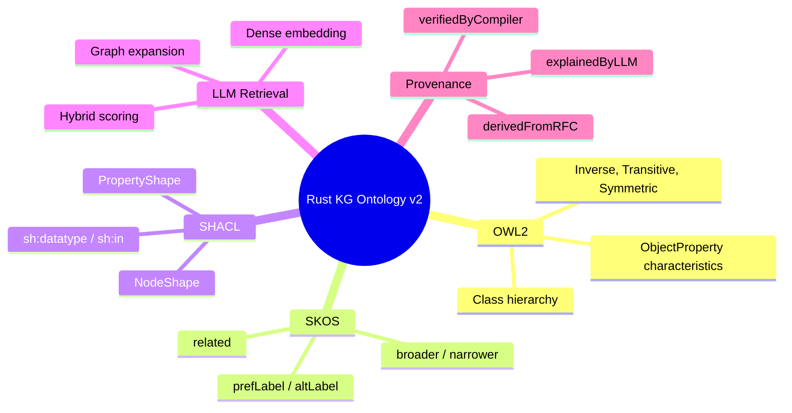
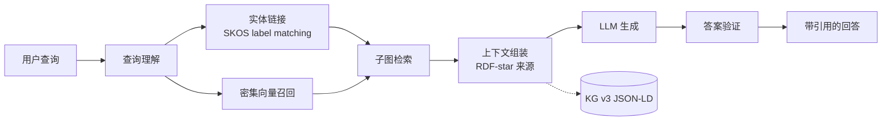
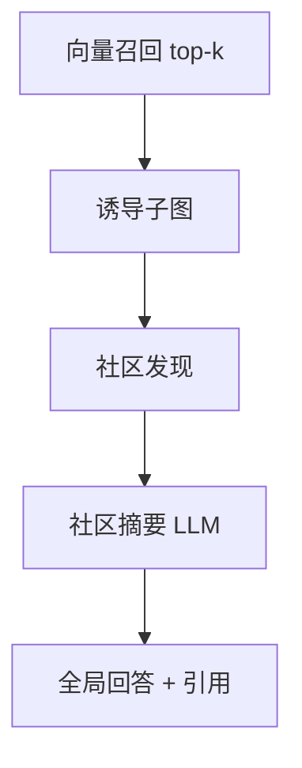
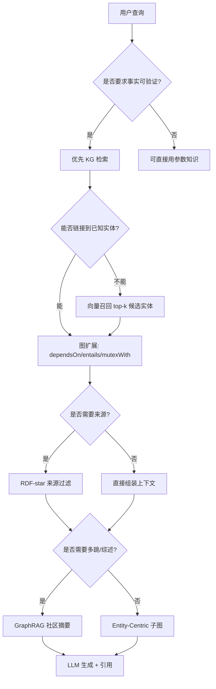

# Rust 知识体系知识图谱本体规范 v2.0（RDF 1.2 / RDF-star / SKOS 对齐版）
>
> **EN**: Knowledge Graph Ontology v2.0
> **Summary**: Upgraded KG ontology aligned with RDF 1.2, RDF-star, SKOS multilingual labels, and SHACL validation.
>
> **受众**: [研究者]
> **Rust 版本**: 1.97.0+ (Edition 2024)
> **Bloom 层级**: Meta
> **前置概念**: [`concept/00_meta/00_framework/semantic_space.md`](../00_framework/semantic_space.md)、[`concept/00_meta/00_framework/methodology.md`](../00_framework/methodology.md)、[`concept/00_meta/02_sources/01_authority_source_map.md`](../02_sources/01_authority_source_map.md)、[`concept/00_meta/01_terminology/01_terminology_glossary.md`](../01_terminology/01_terminology_glossary.md)
> **后置概念**: [`concept/00_meta/kg_data_v3.json`](../kg_data_v3.json)、[`concept/00_meta/kg_shapes.ttl`](../kg_shapes.ttl)、[`tools/kg_rag/llm_semantic_retriever.py`](../../../../tools/kg_rag/llm_semantic_retriever.py)
> **权威来源**: 本文件为 `concept/` 权威页。
> **定位**: 本文件是 `kg_ontology.md`（v1 已不再维护）的 v2 升级版，在保留原有教学关系本体的基础上，显式对齐 W3C RDF 1.2、RDF-star、SKOS、JSON-LD 1.1 与 SHACL 数据形状标准，使项目知识图谱从"规范文档"进化为"可验证、可查询、可多语言消费"的 Linked Data。
> **对齐来源**: [W3C RDF 1.2 Concepts] · [W3C RDF-star] · [W3C SKOS Reference] · [W3C JSON-LD 1.1] · [W3C SHACL] · [ISO 704:2022] · [ISO/IEC 21838-1:2021]
> **定理链**: N/A — 描述性/综述性/导航性文档
>
> **来源**: [TRPL](https://doc.rust-lang.org/book/title-page.html) · [Rust Reference](https://doc.rust-lang.org/reference/introduction.html)
---

> **来源**: [W3C — RDF 1.2 Concepts and Abstract Syntax] · [W3C — RDF-star] · [W3C — SKOS Reference] · [W3C — JSON-LD 1.1] · [W3C — SHACL]

## 📑 目录

- [Rust 知识体系知识图谱本体规范 v2.0（RDF 1.2 / RDF-star / SKOS 对齐版）](#rust-知识体系知识图谱本体规范-v20rdf-12--rdf-star--skos-对齐版)
  - [📑 目录](#-目录)
  - [〇、认知路径（Cognitive Path）](#〇认知路径cognitive-path)
  - [一、升级动机与目标](#一升级动机与目标)
  - [二、命名空间与词汇复用](#二命名空间与词汇复用)
  - [三、实体类型（Node Types）](#三实体类型node-types)
  - [四、关系类型（Edge Types）](#四关系类型edge-types)
    - [4.1 关系属性特征](#41-关系属性特征)
    - [4.2 RDF-star 元数据注解](#42-rdf-star-元数据注解)
  - [五、SKOS 多语言概念方案](#五skos-多语言概念方案)
  - [六、Turtle 示例](#六turtle-示例)
  - [七、JSON-LD 1.1 示例](#七json-ld-11-示例)
  - [八、与 v1 的兼容性](#八与-v1-的兼容性)
  - [九、SHACL 验证入口](#九shacl-验证入口)
  - [十、OWL2 / SKOS / SHACL 显式映射](#十owl2--skos--shacl-显式映射)
    - [10.1 为什么需要三层映射](#101-为什么需要三层映射)
    - [10.2 OWL2 类与属性映射](#102-owl2-类与属性映射)
    - [10.3 SKOS 映射](#103-skos-映射)
    - [10.4 SHACL 形状映射](#104-shacl-形状映射)
    - [10.5 映射一致性规则](#105-映射一致性规则)
  - [十一、LLM 语义检索架构](#十一llm-语义检索架构)
    - [11.1 架构全景](#111-架构全景)
    - [11.2 组件职责矩阵](#112-组件职责矩阵)
    - [11.3 数据流示例](#113-数据流示例)
    - [11.4 来源可解释性要求](#114-来源可解释性要求)
  - [十二、GraphRAG 模式](#十二graphrag-模式)
    - [12.1 GraphRAG 与传统 RAG 对比](#121-graphrag-与传统-rag-对比)
    - [12.2 模式一：实体中心子图检索（Entity-Centric Subgraph Retrieval）](#122-模式一实体中心子图检索entity-centric-subgraph-retrieval)
    - [12.3 模式二：谓词约束多跳检索（Predicate-Constrained Multi-Hop）](#123-模式二谓词约束多跳检索predicate-constrained-multi-hop)
    - [12.4 模式三：社区摘要（Community Summary via Hierarchical Clustering）](#124-模式三社区摘要community-summary-via-hierarchical-clustering)
    - [12.5 模式四：RDF-star 来源感知检索（Provenance-Aware Retrieval）](#125-模式四rdf-star-来源感知检索provenance-aware-retrieval)
  - [十三、新谓词与来源链路](#十三新谓词与来源链路)
    - [13.1 谓词语义速查](#131-谓词语义速查)
    - [13.2 OWL 声明示例](#132-owl-声明示例)
    - [13.3 用 Rust 模拟最小来源链路](#133-用-rust-模拟最小来源链路)
    - [13.4 工具链集成：LLM 语义检索器](#134-工具链集成llm-语义检索器)
  - [十四、检索策略决策树](#十四检索策略决策树)
  - [十五、正向 / 反向推理示例](#十五正向--反向推理示例)
    - [15.1 正向推理：从 RFC 到概念](#151-正向推理从-rfc-到概念)
    - [15.2 反向推理：从用户问题到权威来源](#152-反向推理从用户问题到权威来源)
    - [15.3 反事实：缺失来源谓词](#153-反事实缺失来源谓词)
  - [十六、反例与边界](#十六反例与边界)
    - [16.1 反例：将 LLM 解释直接作为权威](#161-反例将-llm-解释直接作为权威)
    - [16.2 反例：忽略 RDF-star 置信度](#162-反例忽略-rdf-star-置信度)
    - [16.3 反例：混淆 SKOS related 与逻辑 dependsOn](#163-反例混淆-skos-related-与逻辑-dependson)
    - [16.4 边界：LLM 不能替代编译器](#164-边界llm-不能替代编译器)
  - [十七、语义对齐矩阵](#十七语义对齐矩阵)
  - [十八、演进与质量门](#十八演进与质量门)
    - [18.1 后续演进方向](#181-后续演进方向)
    - [18.2 相关质量门](#182-相关质量门)

---

---

## 〇、认知路径（Cognitive Path）

> **EN**: Cognitive Path

1. **为什么要给知识图谱定本体？** —— 没有本体的 KG 只是键值对；本体规定了“什么是概念、什么是关系、怎样才算合法”。
2. **国际上有哪些现成标准？** —— RDF/SKOS 负责概念与标签，OWL 负责逻辑特征，SHACL 负责数据形状验证，JSON-LD 负责机器可读。
3. **这些标准怎么和 Rust 知识体系对接？** —— 把 `ex:Concept` 映射为 `skos:Concept`，把 `ex:dependsOn` 声明为传递属性，再用 SHACL 约束必填字段。
4. **LLM 加入后有什么新需求？** —— 需要区分“LLM 解释”“编译器验证”“RFC 来源”，避免把生成内容误认为权威事实。
5. **GraphRAG 如何利用这张图？** —— 实体链接 → 子图扩展/社区摘要 → 来源过滤 → 上下文组装 → LLM 生成可引用回答。
6. **下一步怎么落地？** —— 更新 `kg_data_v3.json` 与 `kg_shapes.ttl`，运行 `llm_semantic_retriever.py`，并把质量门纳入季度审计。

---

## 一、升级动机与目标

v1 本体（`kg_ontology.md`，已归档为 `archive/2026/concept_archive/kg_ontology_v1_archived.md`，归档只读）已成功定义了 Rust 知识体系的显式关系类型，并生成了机器可读的 `kg_data.json`（v1 数据已于 2026-07-12 退役至 `archive/2026/kg_data_v1_retired_2026-05-23.json`，现行数据为 `kg_data_v3.json`）。v2 升级目标：

1. **标准对齐**：显式映射到 RDF 1.2、SKOS、JSON-LD 1.1，降低与国际工具链的集成成本。
2. **三元组元数据**：引入 RDF-star，使每条关系边可附加来源、版本、置信度、审校状态。
3. **多语言消费**：采用 SKOS `prefLabel`/`altLabel`/`hiddenLabel` + BCP47 语言标签，支撑中英双语骨架。
4. **数据质量保障**：配套 SHACL shapes，验证概念文件头、关系类型、实体类型的合法性。
5. **可计算性**：为后续接入 Sophia/Oxigraph/SPARQL 和 KG-RAG 奠定数据模型基础。

---

## 二、命名空间与词汇复用

| 前缀 | IRI | 用途 |
|:---|:---|:---|
| `ex` | `https://rust-lang-knowledge-graph.org/` | 项目自定义实体与关系 |
| `rdf` | `http://www.w3.org/1999/02/22-rdf-syntax-ns#` | RDF 核心词汇 |
| `rdfs` | `http://www.w3.org/2000/01/rdf-schema#` | RDFS 模式词汇 |
| `owl` | `http://www.w3.org/2002/07/owl#` | OWL 2 本体词汇 |
| `skos` | `http://www.w3.org/2004/02/skos/core#` | SKOS 知识组织系统 |
| `sh` | `http://www.w3.org/ns/shacl#` | SHACL 数据形状 |
| `xsd` | `http://www.w3.org/2001/XMLSchema#` | XML Schema 数据类型 |
| `dcterms` | `http://purl.org/dc/terms/` | Dublin Core 元数据 |
| `prov` | `http://www.w3.org/ns/prov#` | 来源与可信度 |

---

## 三、实体类型（Node Types）

v2 在 v1 六类实体基础上，显式声明其为 `rdfs:Class` 或 `skos:Concept`，并附加多语言标签。

| v1 类型 | v2 RDF 类型 | SKOS 角色 | 示例 |
|:---|:---|:---|:---|
| `Concept` | `ex:Concept rdfs:subClassOf skos:Concept` | `skos:Concept` | `ex:Ownership` |
| `Theory` | `ex:Theory rdfs:subClassOf skos:Concept` | `skos:Concept` | `ex:AffineLogic` |
| `Model` | `ex:Model rdfs:subClassOf skos:Concept` | `skos:Concept` | `ex:BorrowChecker` |
| `Property` | `ex:Property rdfs:subClassOf skos:Concept` | `skos:Concept` | `ex:Send` |
| `Rule` | `ex:Rule rdfs:subClassOf skos:Concept` | `skos:Concept` | `ex:AXM` |
| `Primitive` | `ex:Primitive rdfs:subClassOf skos:Concept` | `skos:Concept` | `ex:Struct` |

**设计原则**：

- 所有实体均为 `skos:Concept`，便于复用 SKOS 的标签、注释、关系词汇。
- 用 `rdf:type` 区分子类，保留 v1 的六类语义。
- 每个实体必须至少有一个 `skos:prefLabel`（zh 和 en）。

---

## 四、关系类型（Edge Types）

v2 将 v1 的八种关系映射为 `owl:ObjectProperty`，并声明其逻辑特征。

| v1 关系 | v2 属性 | 逆属性 | OWL 特征 | 适用域/范围 |
|:---|:---|:---|:---|:---|
| `dependsOn` | `ex:dependsOn` | `ex:enables` | Transitive | Concept/Theory × Concept/Theory |
| `entails` | `ex:entails` | `ex:impliedBy` | Transitive | Concept/Rule × Concept/Property |
| `mutexWith` | `ex:mutexWith` | `ex:mutexWith` | Symmetric, Irreflexive | Property/Concept × Property/Concept |
| `refines` | `ex:refines` | `ex:refinedBy` | Transitive, Reflexive | Model/Theory × Model/Theory |
| `equivalentTo` | `ex:equivalentTo` | `ex:equivalentTo` | Symmetric, Transitive, Reflexive | Concept/Model ↔ Theory |
| `counterExample` | `ex:counterExample` | `ex:refutedBy` | Asymmetric | Concept/Property × Concept/Property |
| `instanceOf` | `ex:instanceOf` | `ex:hasInstance` | Asymmetric | Property/Rule × Concept |
| `appliesTo` | `ex:appliesTo` | `ex:governedBy` | Asymmetric | Rule × Concept/Property |
| `relatedTo` | `ex:relatedTo` | `ex:relatedTo` | Symmetric | Concept/Theory/Navigation × Concept/Theory/Navigation |

### 4.1 关系属性特征

```turtle
ex:dependsOn a owl:ObjectProperty ;
    rdfs:label "depends on"@en, "依赖于"@zh ;
    rdfs:comment "A 的理解或成立依赖于 B。"@zh ;
    owl:inverseOf ex:enables ;
    rdf:type owl:TransitiveProperty .

ex:mutexWith a owl:ObjectProperty ;
    rdfs:label "mutex with"@en, "互斥于"@zh ;
    owl:inverseOf ex:mutexWith ;
    rdf:type owl:SymmetricProperty, owl:IrreflexiveProperty .

ex:equivalentTo a owl:ObjectProperty ;
    rdfs:label "equivalent to"@en, "等价于"@zh ;
    rdf:type owl:SymmetricProperty, owl:TransitiveProperty, owl:ReflexiveProperty .
```

### 4.2 RDF-star 元数据注解

在 v1 中，三元组 `ex:Ownership ex:dependsOn ex:TypeSystem` 是一条无标签边。v2 使用 RDF-star 对该边附加元数据：

```turtle
<< ex:Ownership ex:dependsOn ex:TypeSystem >>
    ex:source "TRPL Ch. 3" ;
    ex:confidence "1.0"^^xsd:float ;
    ex:version "1.97.0" ;
    ex:reviewed true ;
    dcterms:created "2026-06-27"^^xsd:date ;
    prov:wasDerivedFrom <https://doc.rust-lang.org/book/ch03-01-variables-and-mutability.html> .
```

**元数据字段规范**：

| 字段 | 类型 | 必填 | 说明 |
|:---|:---|:---:|:---|
| `ex:source` | `xsd:string` | ✅ | 权威来源标识（如 TRPL 章节、RFC 编号） |
| `ex:confidence` | `xsd:float` [0,1] | ✅ | 关系可信度，人工审校为 1.0，自动推断为 0.6-0.9 |
| `ex:version` | `xsd:string` | ✅ | 适用的 Rust 版本 |
| `ex:reviewed` | `xsd:boolean` | ✅ | 是否经过人工审校 |
| `dcterms:created` | `xsd:date` | ⬜ | 创建日期 |
| `prov:wasDerivedFrom` | `xsd:anyURI` | ⬜ | 具体 URL 来源 |

---

## 五、SKOS 多语言概念方案

每个实体必须提供以下 SKOS 标签：

| 标签 |  Cardinality | 用途 | 示例（Ownership） |
|:---|:---:|:---|:---|
| `skos:prefLabel` | 1..n | 首选标签，每语言一个 | `"Ownership"@en`, `"所有权"@zh` |
| `skos:altLabel` | 0..n | 同义词/缩写 | `"Owner"@en`, `"拥有权"@zh` |
| `skos:hiddenLabel` | 0..n | 拼写变体/检索用 | `"ownership"@en` |
| `skos:definition` | 0..n | 定义，每语言一个 | 见概念文件摘要 |
| `skos:note` | 0..n | 教学注释 | 见认知路径 |
| `skos:broader` / `skos:narrower` | 0..n | 与 `ex:refines` 对齐 | `ex:Ownership skos:broader ex:MemorySafety` |
| `skos:related` | 0..n | 与 `ex:mutexWith` / 非依赖关系对齐 | `ex:Ownership skos:related ex:Borrowing` |

**语言标签**：遵循 BCP47，项目使用 `zh`（简体中文）、`en`（英语）。未来可扩展 `zh-Hant`、`ja`、`ko`。

---

## 六、Turtle 示例

```turtle
@prefix ex: <https://rust-lang-knowledge-graph.org/> .
@prefix rdf: <http://www.w3.org/1999/02/22-rdf-syntax-ns#> .
@prefix rdfs: <http://www.w3.org/2000/01/rdf-schema#> .
@prefix owl: <http://www.w3.org/2002/07/owl#> .
@prefix skos: <http://www.w3.org/2004/02/skos/core#> .
@prefix xsd: <http://www.w3.org/2001/XMLSchema#> .
@prefix dcterms: <http://purl.org/dc/terms/> .
@prefix prov: <http://www.w3.org/ns/prov#> .

# 实体类定义
ex:Concept a rdfs:Class, owl:Class ;
    rdfs:subClassOf skos:Concept ;
    skos:prefLabel "Concept"@en, "概念"@zh .

ex:Theory a rdfs:Class, owl:Class ;
    rdfs:subClassOf skos:Concept ;
    skos:prefLabel "Theory"@en, "理论"@zh .

# 关系属性定义
ex:dependsOn a owl:ObjectProperty, owl:TransitiveProperty ;
    rdfs:label "depends on"@en, "依赖于"@zh ;
    owl:inverseOf ex:enables ;
    rdfs:domain ex:Concept, ex:Theory ;
    rdfs:range ex:Concept, ex:Theory .

ex:equivalentTo a owl:ObjectProperty,
        owl:SymmetricProperty,
        owl:TransitiveProperty,
        owl:ReflexiveProperty ;
    rdfs:label "equivalent to"@en, "等价于"@zh .

# 实体实例
ex:Ownership a ex:Concept ;
    skos:prefLabel "Ownership"@en, "所有权"@zh ;
    skos:altLabel "Owner"@en, "拥有权"@zh ;
    skos:definition "Rust's compile-time resource management mechanism ensuring each value has a unique owner."@en ;
    skos:definition "Rust 编译期资源管理机制，确保每个值有唯一所有者。"@zh ;
    skos:broader ex:MemoryManagement ;
    skos:related ex:Borrowing, ex:Lifetimes .

ex:AffineLogic a ex:Theory ;
    skos:prefLabel "Affine Logic"@en, "仿射逻辑"@zh ;
    skos:definition "A substructural logic where every premise must be used at most once."@en ;
    skos:definition "一种子结构逻辑，每个前提最多使用一次。"@zh .

# RDF-star 三元组元数据
<< ex:Ownership ex:dependsOn ex:TypeSystem >>
    ex:source "TRPL Ch. 3-4" ;
    ex:confidence "1.0"^^xsd:float ;
    ex:version "1.97.0" ;
    ex:reviewed true ;
    dcterms:created "2026-06-27"^^xsd:date ;
    prov:wasDerivedFrom <https://doc.rust-lang.org/book/ch03-01-variables-and-mutability.html> .

<< ex:Ownership ex:equivalentTo ex:AffineLogic >>
    ex:source "concept/04_formal/01_linear_logic.md" ;
    ex:confidence "0.95"^^xsd:float ;
    ex:version "1.97.0" ;
    ex:reviewed true .
```

---

## 七、JSON-LD 1.1 示例

```json
{
  "@context": {
    "ex": "https://rust-lang-knowledge-graph.org/",
    "rdf": "http://www.w3.org/1999/02/22-rdf-syntax-ns#",
    "rdfs": "http://www.w3.org/2000/01/rdf-schema#",
    "owl": "http://www.w3.org/2002/07/owl#",
    "skos": "http://www.w3.org/2004/02/skos/core#",
    "xsd": "http://www.w3.org/2001/XMLSchema#",
    "dcterms": "http://purl.org/dc/terms/",
    "prov": "http://www.w3.org/ns/prov#"
  },
  "@id": "ex:Ownership",
  "@type": "ex:Concept",
  "skos:prefLabel": [
    { "@value": "Ownership", "@language": "en" },
    { "@value": "所有权", "@language": "zh" }
  ],
  "skos:altLabel": [
    { "@value": "Owner", "@language": "en" },
    { "@value": "拥有权", "@language": "zh" }
  ],
  "skos:definition": [
    { "@value": "Rust's compile-time resource management mechanism.", "@language": "en" },
    { "@value": "Rust 编译期资源管理机制。", "@language": "zh" }
  ],
  "ex:dependsOn": {
    "@id": "ex:TypeSystem",
    "@annotation": {
      "ex:source": "TRPL Ch. 3-4",
      "ex:confidence": { "@value": "1.0", "@type": "xsd:float" },
      "ex:version": "1.97.0",
      "ex:reviewed": true,
      "dcterms:created": { "@value": "2026-06-27", "@type": "xsd:date" },
      "prov:wasDerivedFrom": "https://doc.rust-lang.org/book/ch03-01-variables-and-mutability.html"
    }
  },
  "ex:equivalentTo": {
    "@id": "ex:AffineLogic",
    "@annotation": {
      "ex:source": "concept/04_formal/01_linear_logic.md",
      "ex:confidence": { "@value": "0.95", "@type": "xsd:float" },
      "ex:version": "1.97.0",
      "ex:reviewed": true
    }
  }
}
```

> **注**：JSON-LD 1.1 对 RDF-star 的 `@annotation` 语法是社区草案，生产环境可回退为 Turtle/N-Triples-star 序列化。

---

## 八、与 v1 的兼容性

| v1 元素 | v2 处理 | 兼容性 |
|:---|:---|:---:|
| `kg_ontology.md` 八类关系 | 保留并映射为 OWL ObjectProperty | ✅ 向后兼容 |
| `kg_data.json` 字段 | 保留，新增 `skos:` 与 `@annotation` | ✅ 向后兼容 |
| 前缀 `c:` / `t:` / `m:` / `p:` / `r:` / `prim:` | 映射为 `ex:` 命名空间下的类 | ⚠️ 需脚本转换 |
| Turtle 示例 | v1 Turtle 仍有效；v2 新增 RDF-star 注解 | ✅ 向后兼容 |

**迁移脚本计划**：迁移脚本 `scripts/archive/one_off_2026/migrate_kg_v1_to_v2.py`（已执行完成并归档），自动将 v1 `kg_data.json` 转换为 v2 JSON-LD，并为所有关系附加默认元数据（confidence=1.0, reviewed=false）。

---

## 九、SHACL 验证入口

v2 配套 SHACL shapes 定义在 `concept/00_meta/kg_shapes.ttl`，可验证：

1. 每个实体必须有 `skos:prefLabel`（en + zh）。
2. 每个 `ex:Concept` 必须有 `ex:layer`（L0-L7）和 `ex:bloom`。
3. 关系类型必须是 `ex:dependsOn`、`ex:entails`、`ex:mutexWith`、`ex:refines`、`ex:equivalentTo`、`ex:counterExample`、`ex:instanceOf`、`ex:appliesTo` 之一。
4. `ex:confidence` 必须在 [0,1] 范围内。
5. `ex:version` 必须匹配 Rust 版本号格式（如 `1.97.0`）。

**运行方式**（待 `crates/c13_semantic_web/` 落地后）：

```bash
cargo run --bin kg-validate -- concept/00_meta/kg_data_v3.json concept/00_meta/kg_shapes.ttl
```

---

## 十、OWL2 / SKOS / SHACL 显式映射

> **EN**: Explicit OWL2 / SKOS / SHACL Mapping

v2 本体在设计上已经复用了 W3C 命名空间，但“复用前缀”不等于“语义等价”。本节给出项目自定义构造到 OWL2 类/属性、SKOS 概念组织、SHACL 数据形状的显式映射，使 KG 能被标准 RDF 工具（Protégé、TopBraid、Oxigraph、sophia）直接消费。



### 10.1 为什么需要三层映射

| 标准层 | 解决什么问题 | 本 KG 的使用方式 |
|:---|:---|:---|
| **OWL2** | 逻辑语义与推理 | 声明类/属性、传递性、对称性、互斥性 |
| **SKOS** | 多语言概念组织 | 标签、定义、层级、相关关系 |
| **SHACL** | 数据形状验证 | 约束实体字段、谓词取值范围、必填项 |

### 10.2 OWL2 类与属性映射

| 项目构造 | OWL2 映射 | 逻辑特征 | Turtle 声明 |
|:---|:---|:---|:---|
| `ex:Concept` | `owl:Class` | `rdfs:subClassOf skos:Concept` | `ex:Concept a owl:Class ; rdfs:subClassOf skos:Concept .` |
| `ex:dependsOn` | `owl:ObjectProperty` | `owl:TransitiveProperty` | `ex:dependsOn a owl:ObjectProperty, owl:TransitiveProperty ; owl:inverseOf ex:enables .` |
| `ex:equivalentTo` | `owl:ObjectProperty` | `Symmetric`, `Transitive`, `Reflexive` | `ex:equivalentTo a owl:ObjectProperty, owl:SymmetricProperty, owl:TransitiveProperty, owl:ReflexiveProperty .` |
| `ex:mutexWith` | `owl:ObjectProperty` | `Symmetric`, `Irreflexive` | `ex:mutexWith a owl:ObjectProperty, owl:SymmetricProperty, owl:IrreflexiveProperty .` |
| `ex:confidence` | `owl:DatatypeProperty` | `xsd:float` 范围 [0,1] | `ex:confidence a owl:DatatypeProperty ; rdfs:range xsd:float .` |
| `ex:version` | `owl:DatatypeProperty` | 字符串，匹配 Rust 版本 | `ex:version a owl:DatatypeProperty ; rdfs:range xsd:string .` |

### 10.3 SKOS 映射

| 项目关系 | SKOS 映射 | 说明 |
|:---|:---|:---|
| `ex:refines` | `skos:broader` / `skos:narrower` | 细化方向与泛化方向互换 |
| `ex:relatedTo`（非依赖） | `skos:related` | 同级关联 |
| `ex:mutexWith` | `skos:related` + `ex:mutexWith` | SKOS 本身无互斥，保留项目谓词 |
| `skos:prefLabel` | 首选标签 | 每个实体至少 en + zh |
| `skos:altLabel` | 同义词 | 用于实体链接/检索别名 |
| `skos:hiddenLabel` | 拼写变体 | 不展示，用于搜索容错 |
| `skos:definition` | 定义 | 与 `entity_summary` 字段对齐 |
| `skos:scopeNote` | 教学注释 | v3 数据优先使用 |

### 10.4 SHACL 形状映射

`concept/00_meta/kg_shapes.ttl` 中每个节点形状对应一种实体类型：

```turtle
@prefix ex: <https://rust-lang-knowledge-graph.org/> .
@prefix sh: <http://www.w3.org/ns/shacl#> .
@prefix xsd: <http://www.w3.org/2001/XMLSchema#> .

ex:ConceptShape a sh:NodeShape ;
    sh:targetClass ex:Concept ;
    sh:property [
        sh:path skos:prefLabel ;
        sh:minCount 2 ;
        sh:datatype rdf:langString ;
        sh:languageIn ("en" "zh") ;
    ] ;
    sh:property [
        sh:path ex:layer ;
        sh:minCount 1 ;
        sh:datatype xsd:string ;
        sh:pattern "^L[0-7]$" ;
    ] ;
    sh:property [
        sh:path ex:bloom ;
        sh:minCount 1 ;
        sh:datatype xsd:string ;
        sh:pattern "^L[0-7]$" ;
    ] .
```

### 10.5 映射一致性规则

1. **每个 `ex:Concept` 必须同时是 `skos:Concept`**，不能只用 `rdf:type ex:Concept`。
2. **所有关系必须声明 OWL 特征**（传递/对称/反自反），否则默认 asymmetric。
3. **SHACL 约束必须覆盖新增谓词**；新增 `ex:explainedByLLM` 等需要在 `kg_shapes.ttl` 中补充。
4. **SKOS `broader`/`narrower` 与 `ex:refines` 必须双向同步**，避免导航漂移。

---

## 十一、LLM 语义检索架构

> **EN**: LLM Semantic Retrieval Architecture

本节定义把 v2 KG 作为 LLM 外部记忆时的系统架构，重点解决“检索什么、如何验证、如何引用”三个问题。

### 11.1 架构全景



### 11.2 组件职责矩阵

| 组件 | 输入 | 输出 | 使用的主要 KG 谓词 |
|:---|:---|:---|:---|
| 查询理解 | 自然语言问题 | 关键词/意图/语种 | `skos:prefLabel`、`skos:altLabel` |
| 实体链接 | 关键词 | `ex:Concept` URI 列表 | `skos:prefLabel`、`skos:altLabel`、`skos:hiddenLabel` |
| 密集向量召回 | 查询向量 | top-k 实体 | `skos:definition`、`skos:scopeNote` |
| 子图扩展 | 种子实体 | 1–2 跳三元组 | `ex:dependsOn`、`ex:entails`、`ex:mutexWith`、`ex:refines` |
| 上下文组装 | 三元组 | 自然语言段落 + JSON-LD | `ex:source`、`prov:wasDerivedFrom` |
| 答案验证 | LLM 输出 + KG | 是否可被三元组支撑 | `ex:verifiedByCompiler`、`ex:derivedFromRFC` |

### 11.3 数据流示例

```json
{
  "query": "Why is Send not implemented for Rc?",
  "linked_entities": ["ex:Send", "ex:Rc"],
  "subgraph": [
    {
      "subject": "ex:Rc",
      "predicate": "ex:mutexWith",
      "object": "ex:Send",
      "annotation": {
        "ex:source": "TRPL Ch. 16",
        "ex:confidence": 1.0,
        "ex:verifiedByCompiler": true
      }
    }
  ],
  "prompt": "Based on the following triples from the Rust knowledge graph, answer..."
}
```

### 11.4 来源可解释性要求

对 LLM 生成的每个主张，必须能在 KG 中找到至少一条支撑边，并通过 RDF-star 追溯到：

- **官方文档**：`ex:documentedIn` + URL；
- **RFC**：`ex:derivedFromRFC` + RFC 编号；
- **编译器验证**：`ex:verifiedByCompiler` + 版本；
- **形式化工具**：`ex:verifiedByFormalTool` + 工具名；
- **LLM 解释**：`ex:explainedByLLM` + 置信度，**必须人工复核后才能作为事实**。

---

## 十二、GraphRAG 模式

> **EN**: GraphRAG Patterns

GraphRAG 不只用 KG 做“检索上下文”，而是把图结构本身作为推理介质。本节给出四种可在 Rust KG 上落地的 GraphRAG 模式。

### 12.1 GraphRAG 与传统 RAG 对比

| 维度 | 传统 RAG（纯向量） | GraphRAG（KG 增强） |
|:---|:---|:---|
| 上下文粒度 | 文本块 | 实体 + 关系子图 |
| 多跳推理 | 弱 | 强（沿谓词遍历） |
| 可解释性 | 低（仅相似度） | 高（显式路径 + 来源） |
| 冷启动 | 只需文本 | 需要结构化 KG |
|  hallucination 控制 | 依赖 prompt | 可被三元组约束 |

### 12.2 模式一：实体中心子图检索（Entity-Centric Subgraph Retrieval）

**适用场景**：用户问的是某个具体概念，如 “什么是 Ownership？”

**流程**：

1. 实体链接命中 `ex:Ownership`；
2. 沿 `ex:dependsOn`、`ex:refines`、`ex:equivalentTo` 扩展 1 跳；
3. 沿 `ex:counterExample` 取反例；
4. 将子图线性化为 prompt。

### 12.3 模式二：谓词约束多跳检索（Predicate-Constrained Multi-Hop）

**适用场景**：用户问“ prerequisites”，如 “学习 async 之前必须掌握什么？”

**流程**：

1. 识别 `ex:AsyncAwait`；
2. 只沿 `ex:dependsOn` 反向扩展（即 `ex:enables` 方向），过滤出前驱概念；
3. 按 `ex:layer` 排序，生成学习路径。

### 12.4 模式三：社区摘要（Community Summary via Hierarchical Clustering）

**适用场景**：开放性综述，如 “概述 Rust 内存安全机制”。

**流程**：

1. 向量召回多个相关实体；
2. 在诱导子图上做连通分量/标签传播，发现“社区”；
3. 对每个社区生成摘要（可由 LLM 完成），再组合成全局回答。



### 12.5 模式四：RDF-star 来源感知检索（Provenance-Aware Retrieval）

**适用场景**：需要区分“官方事实”与“LLM 解释”的问答。

**流程**：

1. 子图检索同时读取 RDF-star 注解；
2. 优先返回 `ex:verifiedByCompiler` 或 `ex:derivedFromRFC` 的边；
3. 对 `ex:explainedByLLM` 的边标注“待复核”。

---

## 十三、新谓词与来源链路

> **EN**: New Predicates and Provenance Chains

为支持 LLM 语义检索与权威来源追溯，v2.1 扩展新增以下谓词。它们全部以 `ex:` 为前缀，并在 `kg_shapes.ttl` 中注册。

### 13.1 谓词语义速查

| 谓词 | 类型 | 域 / 范围 | 逆属性 | 用途 |
|:---|:---|:---|:---|:---|
| `ex:explainedByLLM` | `owl:ObjectProperty` | `ex:Concept` / `ex:Explanation` | `ex:explainsConcept` | LLM 生成的教学解释 |
| `ex:verifiedByCompiler` | `owl:ObjectProperty` | `ex:Concept` / `ex:CompilerCheck` | `ex:verifies` | 经 rustc 编译验证 |
| `ex:derivedFromRFC` | `owl:ObjectProperty` | `ex:Concept` / `ex:RFC` | `ex:defines` | 源自 Rust RFC |
| `ex:verifiedByFormalTool` | `owl:ObjectProperty` | `ex:Concept` / `ex:FormalToolRun` | `ex:formallyVerifies` | 经 Kani/Prusti/RustBelt 等验证 |
| `ex:documentedIn` | `owl:ObjectProperty` | `ex:Concept` / `ex:Document` | `ex:documents` | 链接到官方书/参考文档 |
| `ex:canonicalPage` | `owl:ObjectProperty` | `ex:Concept` / `ex:MarkdownPage` | `ex:canonicalFor` | 指向 `concept/` 权威页 |
| `ex:hasRustVersion` | `owl:DatatypeProperty` | `ex:Concept` / `xsd:string` | — | 适用 Rust 版本 |
| `ex:reviewStatus` | `owl:DatatypeProperty` | 任意边注解 / `xsd:string` | — | `reviewed` / `pending` / `deprecated` |
| `ex:confidence` | `owl:DatatypeProperty` | 任意边注解 / `xsd:float` | — | 置信度 [0,1] |

### 13.2 OWL 声明示例

```turtle
ex:explainedByLLM a owl:ObjectProperty ;
    rdfs:label "explained by LLM"@en, "由 LLM 解释"@zh ;
    rdfs:comment "Links a concept to an LLM-generated pedagogical explanation. Must be reviewed before treated as fact."@en ;
    owl:inverseOf ex:explainsConcept ;
    rdfs:domain ex:Concept ;
    rdfs:range ex:Explanation .

ex:verifiedByCompiler a owl:ObjectProperty ;
    rdfs:label "verified by compiler"@en, "经编译器验证"@zh ;
    owl:inverseOf ex:verifies ;
    rdfs:domain ex:Concept ;
    rdfs:range ex:CompilerCheck .

ex:derivedFromRFC a owl:ObjectProperty ;
    rdfs:label "derived from RFC"@en, "源自 RFC"@zh ;
    owl:inverseOf ex:defines ;
    rdfs:domain ex:Concept ;
    rdfs:range ex:RFC .
```

### 13.3 用 Rust 模拟最小来源链路

```rust
use std::collections::{HashMap, HashSet};

#[derive(Debug, Clone, PartialEq, Eq, Hash)]
struct Triple {
    subject: &'static str,
    predicate: &'static str,
    object: &'static str,
}

#[derive(Default)]
struct TinyKg {
    triples: HashSet<Triple>,
    stars: HashMap<Triple, HashMap<&'static str, &'static str>>,
}

impl TinyKg {
    fn add(&mut self, s: &'static str, p: &'static str, o: &'static str) {
        self.triples.insert(Triple { subject: s, predicate: p, object: o });
    }

    fn annotate(&mut self, s: &'static str, p: &'static str, o: &'static str,
                k: &'static str, v: &'static str) {
        let t = Triple { subject: s, predicate: p, object: o };
        if self.triples.contains(&t) {
            self.stars.entry(t).or_default().insert(k, v);
        }
    }

    fn objects<'a>(&'a self, s: &'static str, p: &'static str)
        -> impl Iterator<Item = &'a &'static str> + 'a
    {
        self.triples
            .iter()
            .filter(move |t| t.subject == s && t.predicate == p)
            .map(|t| &t.object)
    }

    fn status(&self, s: &'static str, p: &'static str, o: &'static str) -> &'static str {
        let t = Triple { subject: s, predicate: p, object: o };
        self.stars
            .get(&t)
            .and_then(|m| m.get("ex:reviewStatus"))
            .copied()
            .unwrap_or("unknown")
    }
}

fn main() {
    let mut kg = TinyKg::default();

    // 官方 + 编译器验证的事实
    kg.add("ex:Send", "ex:derivedFromRFC", "RFC0451");
    kg.annotate("ex:Send", "ex:derivedFromRFC", "RFC0451",
                "ex:reviewStatus", "reviewed");
    kg.add("ex:Send", "ex:verifiedByCompiler", "rustc-1.97.0");
    kg.annotate("ex:Send", "ex:verifiedByCompiler", "rustc-1.97.0",
                "ex:reviewStatus", "reviewed");

    // LLM 解释，需要复核
    kg.add("ex:Send", "ex:explainedByLLM", "LLM-Note-07");
    kg.annotate("ex:Send", "ex:explainedByLLM", "LLM-Note-07",
                "ex:reviewStatus", "pending");

    println!("Official/compiler-verified sources:");
    for o in kg.objects("ex:Send", "ex:derivedFromRFC") {
        println!("  RFC {o} (status: {})", kg.status("ex:Send", "ex:derivedFromRFC", o));
    }

    println!("\nLLM explanations (require review):");
    for o in kg.objects("ex:Send", "ex:explainedByLLM") {
        println!("  {o} (status: {})", kg.status("ex:Send", "ex:explainedByLLM", o));
    }
}
```

运行后输出：

```text
Official/compiler-verified sources:
  RFC RFC0451 (status: reviewed)

LLM explanations (require review):
  LLM-Note-07 (status: pending)
```

### 13.4 工具链集成：LLM 语义检索器

项目已提供 `tools/kg_rag/llm_semantic_retriever.py`，支持：

```bash
cd tools/kg_rag
.venv/Scripts/python llm_semantic_retriever.py \
  --query "How does Rust ownership prevent data races?" \
  --top-k 5 --hops 2 --alpha 0.7
```

该检索器会：

1. 用 `kg_rag.py` 做向量 + 图混合召回；
2. 沿 `ex:dependsOn`/`ex:entails`/`ex:mutexWith` 扩展 `--hops` 跳；
3. 用 RDF-star 注解生成带 `[source]` 引用的上下文，可直接喂给 LLM。

---

## 十四、检索策略决策树

> **EN**: Retrieval Strategy Decision Tree



**决策规则**：

- 安全关键问题（unsafe、并发、FFI）**必须**走 KG 路径，并启用 `ex:verifiedByCompiler`/`ex:derivedFromRFC` 过滤。
- 教学方法、类比、代码风格问题可引入 `ex:explainedByLLM`，但需标注置信度。
- 开放性综述问题使用 GraphRAG 社区摘要；具体概念问题使用实体中心子图。

---

## 十五、正向 / 反向推理示例

> **EN**: Forward and Backward Reasoning Examples

### 15.1 正向推理：从 RFC 到概念

**前提**：

```turtle
ex:TraitObject ex:derivedFromRFC ex:RFC2113 .
ex:RFC2113 a ex:RFC ; skos:prefLabel "RFC 2113"@en .
<< ex:TraitObject ex:derivedFromRFC ex:RFC2113 >>
    ex:reviewStatus "reviewed" ;
    ex:confidence "1.0"^^xsd:float .
```

**推理链**：

1. `ex:TraitObject` 由 RFC 2113 定义；
2. RFC 2113 经人工复核；
3. 因此“trait object 是 Rust 官方语义的一部分”这一主张可信。

### 15.2 反向推理：从用户问题到权威来源

**用户问题**：“Can I mutate a value while it is borrowed?”

**反向追溯**：

1. 实体链接：borrowed → `ex:Borrowing`，mutate → `ex:Mutation`；
2. 查找 `ex:Borrowing` 的 `ex:mutexWith`：得到 `ex:AliasingXORMutation`；
3. 该边带有 `ex:verifiedByCompiler` 和 `ex:derivedFromRFC`；
4. 回答：“No — Rust's borrow checker enforces aliasing XOR mutation (verified by rustc, derived from ownership RFCs).”

### 15.3 反事实：缺失来源谓词

若 `ex:AliasingXORMutation` 只有 `ex:explainedByLLM` 而无 `ex:verifiedByCompiler`，则：

- 可生成教学解释；
- **不能**用于安全断言或代码审查结论。

---

## 十六、反例与边界

> **EN**: Counterexamples and Boundaries

### 16.1 反例：将 LLM 解释直接作为权威

```turtle
# ❌ 不推荐：仅有 LLM 解释，无编译器/RFC 支撑
<< ex:UnsafeRust ex:entails ex:UndefinedBehavior >>
    ex:explainedByLLM "GPT-Note-42" ;
    ex:confidence "0.85"^^xsd:float .
```

**问题**：LLM 可能把“未定义行为”与“unsafe 块”错误泛化。该关系应同时具有：

```turtle
<< ex:UnsafeRust ex:entails ex:UndefinedBehavior >>
    ex:derivedFromRFC "RFC1236" ;
    ex:verifiedByCompiler "rustc-1.97.0" ;
    ex:reviewStatus "reviewed" .
```

### 16.2 反例：忽略 RDF-star 置信度

```turtle
# ❌ 不推荐：自动推断的置信度 0.4 被当作事实使用
<< ex:Pin ex:dependsOn ex:Lifetimes >>
    ex:confidence "0.4"^^xsd:float ;
    ex:reviewStatus "pending" .
```

**修复**：pending/low-confidence 边只能出现在“建议阅读”或“待复核”列表，不能进入安全相关上下文。

### 16.3 反例：混淆 SKOS related 与逻辑 dependsOn

```turtle
# ❌ 错误：把教学上的“相关”当成逻辑依赖
ex:Box ex:dependsOn ex:Heap .
```

若 `Box` 在逻辑上并不**必须**依赖堆（例如 `Box` 也可指栈上的 `Box<T>` 语义抽象），则应使用：

```turtle
ex:Box skos:related ex:Heap .
```

### 16.4 边界：LLM 不能替代编译器

LLM 检索只能给出“概念上是否正确”的提示。任何涉及 unsafe、并发、FFI 的代码，最终必须由 `rustc`/`cargo test`/`miri`/`Kani` 验证。`ex:verifiedByCompiler` 不是可选装饰，而是安全主张的最低门槛。

---

## 十七、语义对齐矩阵

> **EN**: Semantic Alignment Matrix

| 维度 | 本地 v2 本体 | OWL2 / SKOS / SHACL 权威来源 | 差异 | 修复动作 |
|:---|:---|:---|:---|:---|
| 类继承 | `ex:Concept rdfs:subClassOf skos:Concept` | OWL2 `owl:Class` + SKOS `skos:Concept` | 一致 | 维持 |
| 传递关系 | `ex:dependsOn` 声明为 `owl:TransitiveProperty` | OWL2 语义 | 一致 | 维持 |
| 互斥关系 | `ex:mutexWith` 声明为 `Symmetric` + `Irreflexive` | OWL2 特征 | 新增显式声明 | 已在 §10.2 补充 |
| LLM 来源 | 缺失 | GraphRAG / LLM+KG surveys 需要来源谓词 | 缺少 `explainedByLLM` 等 | 已在 §13 定义 |
| 编译器验证 | 缺失 | 安全主张需机器验证 | 缺少 `verifiedByCompiler` | 已在 §13 定义 |
| RFC 溯源 | 原用 `prov:wasDerivedFrom` 文本 URL | 需要结构化 RFC 节点 | 仅有 URL 无节点 | 已在 §13 定义 `ex:derivedFromRFC` |
| 检索架构 | 仅有向量 + 图混合描述 | GraphRAG 需要社区摘要、来源过滤 | 缺少模式化描述 | 已在 §11–§12 补充 |
| SHACL 形状 | 已有 `kg_shapes.ttl` | SHACL 标准 | 未覆盖新增谓词 | 需在 KG 刷新时同步更新 `kg_shapes.ttl` |

---

## 十八、演进与质量门

> **EN**: Evolution and Quality Gates

### 18.1 后续演进方向

1. **将新增谓词写入 `kg_data_v3.json`**：在下一轮 KG 刷新（`scripts/generate_kg_v3.py`）中，为每条关系附加 `ex:source` 类型，并区分 `verifiedByCompiler`/`derivedFromRFC`/`explainedByLLM`。
2. **更新 `kg_shapes.ttl`**：为 `ex:explainedByLLM`、`ex:verifiedByCompiler`、`ex:derivedFromRFC` 等添加 `sh:NodeShape`/`sh:PropertyShape`。
3. **集成 `llm_semantic_retriever.py`**：作为 `tools/kg_rag/query.py` 的高阶封装，支持 `--provenance-only` 与 `--graphrag` 模式。
4. **季度审计**：依据 `.kimi/templates/quarterly_international_source_audit.md` 抽样 5–8 个核心概念，核对 `ex:derivedFromRFC`/`ex:documentedIn` 链接有效性。

### 18.2 相关质量门

| 质量门 | 检查内容 | 当前状态 |
|:---|:---|:---:|
| `check_kg_shapes.py --strict` | SHACL 形状与 KG 数据一致 | 待 KG 刷新后复核 |
| `check_kg_relation_precision.py --strict` | 核心实体周边无通用 `ex:relatedTo` | 基线 0% |
| `kb_auditor.py --link-check` | 概念文件内死链 | 需在 SUMMARY 更新后运行 |
| `check_concept_code_blocks.py --strict` | 新增 Rust 代码块可编译 | 需抽样验证 |
| `detect_content_overlap.py` | 无重复权威页 | 基线通过 |

---

**维护者**: Rust 学习项目团队
**最后更新**: 2026-08-04
**状态**: ✅ v2 规范 + P7 AI/LLM ontology 扩展；待 KG 刷新后全面验证

> 依据 `AGENTS.md` §2「对齐网络国际化权威内容」补充：仅追加已验证可达的权威链接，不改动正文事实。
> **内容分级**: [综述级]

- **P0 官方**: [W3C — RDF 1.2 Concepts and Abstract Syntax](https://www.w3.org/TR/rdf12-concepts/) · [W3C — RDF-star](https://www.w3.org/TR/rdf-star/) · [W3C — SKOS Reference](https://www.w3.org/TR/skos-reference/) · [W3C — SHACL](https://www.w3.org/TR/shacl/) · [W3C — JSON-LD 1.1](https://www.w3.org/TR/json-ld11/)
- **P1 学术/形式化**: [Hogan et al.: Knowledge Graphs (ACM Comput. Surv. 2021)](https://dl.acm.org/doi/10.1145/3447772) · [Baader et al.: The Description Logic Handbook, 2nd ed., 2007](https://doi.org/10.1017/CBO9780511711787)
- **P1 方法论**: Fernández-López, M.; Gómez-Pérez, A. & Juristo, N. *Methontology: From Ontological Art Towards Ontological Engineering*. Proc. AAAI 1997. · Suárez-Figueroa, M. C. et al. (eds.) *NeOn Methodology for Building Ontology Networks*. Springer, 2012.
- **P1 上层本体**: Arp, R.; Smith, B. & Spear, A. D. *Building Ontologies with Basic Formal Ontology (BFO 2020)*. MIT Press, 2015/2020.
- **P2 GraphRAG / LLM+KG**: [Microsoft — GraphRAG](https://microsoft.github.io/graphrag/) · [OpenAI — Function Calling and Structured Outputs](https://platform.openai.com/docs/guides/function-calling) · [LangChain — Graph RAG](https://python.langchain.com/docs/use_cases/graph/)
