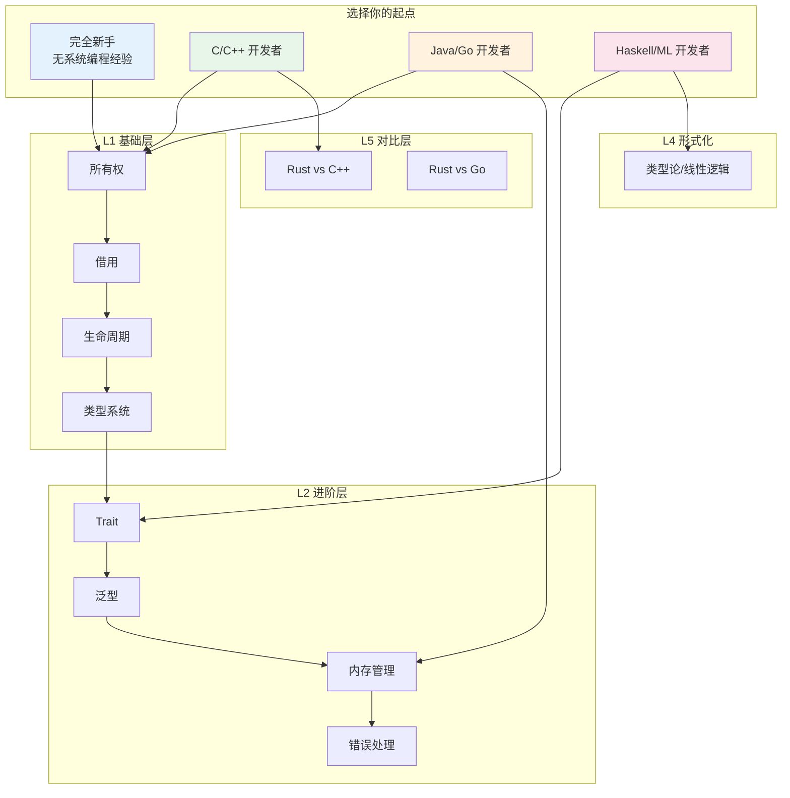

# Rust 知识体系学习指南（Learning Guide）
>
> **EN**: Learning Guide
> **Summary**: Learning Guide. Core Rust concept.
>
> **受众**: [初学者]
>
> **Rust 版本**: 1.96.1+ (Edition 2024)
> **Bloom 层级**: 应用
> **定位**：本文件是 `concept/` 知识体系的**用户手册**，回答三个核心问题——"我应该从哪里开始？""按什么顺序读？""如何验证自己掌握了？"
> **适用对象**：任何希望系统掌握 Rust 语义空间的读者，无论是有 C++/Java/Go/Haskell 背景，还是完全新手。
> **方法论**：基于 Bloom 认知层级设计路径，每条路径标注预计阅读时间、前置依赖和 Checkpoint 自测题。
> **定理链**: N/A — 描述性/综述性/导航性文档，不涉及形式化定理链
>
> **来源**: [TRPL](https://doc.rust-lang.org/book/title-page.html) · [Rust Reference](https://doc.rust-lang.org/reference/)
> **关联文件**: [能力图谱 `competency_graph.md`](competency_graph.md) · [双维认知矩阵 `cognitive_dimension_matrix.md`](cognitive_dimension_matrix.md)
---

## 📑 目录

- [Rust 知识体系学习指南（Learning Guide）](#rust-知识体系学习指南learning-guide)
  - [📑 目录](#-目录)
    - [〇、学习路径选择全景](#〇学习路径选择全景)
  - [一、如何使用本指南](#一如何使用本指南)
    - [1.1 选择你的起点](#11-选择你的起点)
    - [1.2 选择你的目标](#12-选择你的目标)
  - [二、按背景的详细起点指南](#二按背景的详细起点指南)
    - [2.1 完全新手路径（无系统编程经验） 来源: TRPL Ch1-3; Rust by Example; 前置依赖: 无; 认知负荷管理参照 Sweller — *Cognitive Load Theory* / 1988](#21-完全新手路径无系统编程经验-来源-trpl-ch1-3-rust-by-example-前置依赖-无-认知负荷管理参照-sweller--cognitive-load-theory--1988)
    - [2.2 C/C++ 开发者路径 \[来源: 概念迁移理论 — 已有 RAII/指针/内存管理知识可作为正向迁移; ISO C++20 § 作为对比基准\]](#22-cc-开发者路径-来源-概念迁移理论--已有-raii指针内存管理知识可作为正向迁移-iso-c20--作为对比基准)
    - [2.3 Java/Go 开发者路径 \[来源: Java JLS § — GC 背景下的所有权概念缺失; Go Language Specification — CSP 并发模型与 Rust 所有权并发的对比\]](#23-javago-开发者路径-来源-java-jls---gc-背景下的所有权概念缺失-go-language-specification--csp-并发模型与-rust-所有权并发的对比)
    - [2.4 Haskell/ML 开发者路径 \[来源: Hindley-Milner 类型推断的已有知识可作为类型系统学习的前置; Wadler — *Theorems for Free!* / 1989; GHC User's Guide\]](#24-haskellml-开发者路径-来源-hindley-milner-类型推断的已有知识可作为类型系统学习的前置-wadler--theorems-for-free--1989-ghc-users-guide)
  - [三、27 文件阅读指南](#三27-文件阅读指南)
    - [L0 元层（3 文件）](#l0-元层3-文件)
    - [L1 基础层（4 文件）](#l1-基础层4-文件)
    - [L2 进阶层（4 文件）](#l2-进阶层4-文件)
    - [L3 高级层（4 文件）](#l3-高级层4-文件)
    - [L4 形式化层（4 文件）](#l4-形式化层4-文件)
    - [L5 对比层（4 文件）](#l5-对比层4-文件)
    - [L6 生态层（4 文件）](#l6-生态层4-文件)
    - [L7 前沿层（3 文件）](#l7-前沿层3-文件)
  - [四、阅读策略与技巧](#四阅读策略与技巧)
    - [4.1 三遍阅读法](#41-三遍阅读法)
    - [4.2 间隔重复建议](#42-间隔重复建议)
    - [4.3 代码实践建议](#43-代码实践建议)
  - [五、常见困难与突破建议](#五常见困难与突破建议)
    - [5.1 "生命周期理解不了"](#51-生命周期理解不了)
    - [5.2 "async 太抽象"](#52-async-太抽象)
    - [5.3 "形式化部分看不懂"](#53-形式化部分看不懂)
    - [5.4 "读了就忘"](#54-读了就忘)
  - [六、进阶：从学习者到贡献者](#六进阶从学习者到贡献者)
  - [七、编译错误码诊断索引（Error Code → Concept）](#七编译错误码诊断索引error-code--concept)
    - [按错误类别分组](#按错误类别分组)
      - [生命周期类错误（L1 基础概念）](#生命周期类错误l1-基础概念)
      - [所有权与借用类错误（L1 基础概念）](#所有权与借用类错误l1-基础概念)
      - [Trait 与泛型类错误（L2 进阶概念）](#trait-与泛型类错误l2-进阶概念)
      - [并发类错误（L3 高级概念）](#并发类错误l3-高级概念)
      - [Unsafe 与 FFI 类错误（L3 高级概念）](#unsafe-与-ffi-类错误l3-高级概念)
      - [泛型与常量类错误（L2 进阶概念）](#泛型与常量类错误l2-进阶概念)
    - [诊断路径速查](#诊断路径速查)
  - [八、编译错误教学方法论（Error Pedagogy）](#八编译错误教学方法论error-pedagogy)
    - [8.1 错误即教学机会（Errors as Teachable Moments）](#81-错误即教学机会errors-as-teachable-moments)
    - [8.2 故意犯错练习法（Deliberate Error Practice）](#82-故意犯错练习法deliberate-error-practice)
    - [8.3 错误信息分级阅读法](#83-错误信息分级阅读法)
    - [8.4 团队教学策略](#84-团队教学策略)
  - [认知路径](#认知路径)
    - [核心推理链](#核心推理链)
    - [反命题与边界](#反命题与边界)
  - [嵌入式测验（Embedded Quiz）](#嵌入式测验embedded-quiz)
    - [测验 1：本文档《Rust 知识体系学习指南（Learning Guide）》在 Rust 知识体系中属于哪一层级的元数据？（理解层）](#测验-1本文档rust-知识体系学习指南learning-guide在-rust-知识体系中属于哪一层级的元数据理解层)
    - [测验 2：《Rust 知识体系学习指南（Learning Guide）》的主要用途是什么？（理解层）](#测验-2rust-知识体系学习指南learning-guide的主要用途是什么理解层)
    - [测验 3：元数据层文档能否替代 L1-L7 的核心概念学习？（理解层）](#测验-3元数据层文档能否替代-l1-l7-的核心概念学习理解层)

> **[来源: Bloom Taxonomy 2001; 认知科学前置依赖原则]** 学习路径基于认知层级和前置依赖设计。

### 〇、学习路径选择全景



> **认知功能**: 此路径图展示**不同背景学习者的最小阻力路径**。完全新手从 L1 基础层线性递进；C++ 开发者利用已有 RAII/指针知识，通过 Rust vs C++ 对比加速；Java/Go 开发者从 GC 思维转换，重点理解所有权替代 GC；Haskell/ML 开发者利用类型论基础，从 L2/L4 进入。颜色对应背景：蓝=新手、绿=C++、橙=Java/Go、粉=Haskell。
> [来源: [Rust Reference](https://doc.rust-lang.org/reference/)]

## 一、如何使用本指南

### 1.1 选择你的起点

本知识体系按层级组织（L0 Meta → L7 Future），但**不建议从 L0 开始线性阅读**。根据你的背景选择最合适的起点：

| 你的背景 | 推荐起点 | 理由 |
|:---|:---|:---|
| **完全新手**（无系统编程经验）| L1 基础层 | 从所有权、借用、生命周期建立底层直觉 |
| **有 C/C++ 经验** | L1 + L5 对比层 | 利用已有指针/内存知识，通过 Rust vs C++ 对比加速理解 |
| **有 Java/Go 经验** | L1 + L2 + L3 | 利用 GC 和并发经验，重点理解所有权替代 GC 的语义差异 |
| **有 Haskell/ML 经验** | L2 + L4 形式化层 | 利用类型论和函数式基础，从形式化视角理解 Rust 的设计选择 |
| **追求全面掌握** | L0 → L1 → L2 → L3 → L4 → L5 → L6 → L7 | 最完整但耗时最长的路径 |

### 1.2 选择你的目标

| 你的目标 | 核心路径 | 预计总时间 |
|:---|:---|:---|
| **系统编程 / 嵌入式** | L1 → L2 → L3 Unsafe → L6 工具链 → L6 应用域 | 12-16 小时 |
| **Web 后端开发** | L1 → L2 → L3 Async → L6 Crates → L6 应用域 | 10-14 小时 |
| **并发 / 分布式系统** | L1 → L3 Concurrency → L3 Async → L7 形式化方法 | 10-14 小时 |
| **形式化验证 / PL 研究** | L0 语义空间 → L4 全部 → L7 形式化方法 | 14-20 小时 |
| **通过面试 / 快速上手** | L1 → L2 → L3 → L5 对比 → L6 模式 | 8-12 小时 |

> **关键洞察**: 学习路径不是唯一的。
> 本指南提供的是"最小阻力路径"——基于认知科学中的**前置依赖原则**和**间隔重复效应**设计
> [来源: Make It Stick — Brown, Roediger & McDaniel / 2014; 核心论点: 间隔重复（spaced repetition）和检索练习（retrieval practice）比被动重读更有效;
> Willingham — *Why Don't Students Like School?* / 2009]。
> 你可以随时跳转，但建议先完成某一层再进入下一层。

---

> **来源: [The Rust Programming Language](https://doc.rust-lang.org/book/title-page.html)** 不同背景的学习者有不同的概念迁移路径。

## 二、按背景的详细起点指南

### 2.1 完全新手路径（无系统编程经验） 来源: [TRPL Ch1-3; Rust by Example; 前置依赖: 无; 认知负荷管理参照 Sweller — *Cognitive Load Theory* / 1988](https://doc.rust-lang.org/book/ch01-00-getting-started.html)

**核心挑战**: 没有指针、内存布局、编译期的直觉。需要从最基础的概念建立心智模型。

**推荐顺序**:

```text
Step 1: 01_ownership.md（2h）— 建立"所有权 = 责任"的直觉
Step 2: 02_borrowing.md（1.5h）— 理解"借用 = 临时授权"
Step 3: 03_lifetimes.md（2h）— 掌握引用有效期的约束思维
Step 4: 04_type_system.md（1.5h）— ADT、模式匹配、枚举
Step 5: 01_traits.md（1.5h）— 行为抽象的 Rust 方式
Step 6: 02_generics.md（1.5h）— 零成本抽象的核心机制
Step 7: 03_memory_management.md（1h）— Box/Rc/RefCell 的选择
Step 8: 04_error_handling.md（1h）— Result/Option/? 运算符
--- 此时可写简单 Rust 程序 ---
Step 9: 01_concurrency.md（2h）— Send/Sync  fearless 并发
Step 10: 02_async.md（2h）— Future/Pin/async/await
        入门首选：TRPL Ch17 Asynchronous Programming
        https://doc.rust-lang.org/book/ch17-00-async-await.html
Step 11: 02_patterns.md（1h）— Typestate/Builder/Newtype
```

**Checkpoint**（完成 Step 8 后应能回答）:

1. 为什么 `let s2 = s1; println!("{}", s1);` 编译失败？
2. `&T` 和 `&mut T` 的核心区别是什么？为什么不能同时存在？
3. `Vec<String>` 和 `[String; 3]` 在类型系统中有何不同？

### 2.2 C/C++ 开发者路径 [来源: 概念迁移理论 — 已有 RAII/指针/内存管理知识可作为正向迁移; ISO C++20 § 作为对比基准]

**核心挑战**: 摆脱"指针自由"的思维定势，理解编译器强制的别名规则。

**推荐顺序**:

```text
Step 1: 01_ownership.md（1h）— 对比 unique_ptr/move 语义
Step 2: 05_rust_vs_cpp.md（2h）— 本体论差异的系统对比
Step 3: 02_borrowing.md（1h）— 对比 &T/&mut T 与 const T&/T&
Step 4: 03_lifetimes.md（1.5h）— 对比 RAII 与区域类型
Step 5: 03_unsafe.md（2h）— 理解 Rust 的 unsafe 不是"关闭检查"
Step 6: 01_concurrency.md（1.5h）— 对比 mutex/原子操作的数据竞争保证
```

**加速技巧**:

- 将 `Box<T>` 理解为 `unique_ptr<T>`，但增加了移动语义约束
- 将 `Rc<T>` 理解为 `shared_ptr<T>`，但无循环引用自动回收
- 将 `&mut T` 理解为 `T*`，但编译器保证无别名

### 2.3 Java/Go 开发者路径 [来源: Java JLS § — GC 背景下的所有权概念缺失; Go Language Specification — CSP 并发模型与 Rust 所有权并发的对比]

**核心挑战**: 从 GC 思维转换到所有权思维，理解"确定性资源管理"的价值和成本。

**推荐顺序**:

```text
Step 1: 01_ownership.md（1.5h）— 核心问题：没有 GC 如何管理内存？
Step 2: 03_memory_management.md（1h）— Rc/Arc vs GC 的语义差异
Step 3: 02_borrowing.md（1.5h）— 对比 Java 引用和 Rust 借用
Step 4: 01_traits.md（1h）— 对比 Java Interface 和 Rust Trait
Step 5: 02_generics.md（1h）— 对比 Java 类型擦除和 Rust 单态化
Step 6: 05_rust_vs_go.md（1.5h）— 并发模型对比：goroutine vs async
```

**关键心智转换**:

- Java: 对象由 GC 管理生命周期 → Rust: 对象由所有权系统管理生命周期
- Go: 通道传递所有权模糊 → Rust: Send/Sync 明确标记线程安全边界
- Java: 运行时异常 → Rust: Result 显式错误传播

### 2.4 Haskell/ML 开发者路径 [来源: Hindley-Milner 类型推断的已有知识可作为类型系统学习的前置; Wadler — *Theorems for Free!* / 1989; GHC User's Guide]

**核心挑战**: 从纯函数思维转换到系统编程思维，理解 effects 和内存布局的显式控制。

**推荐顺序**:

```text
Step 1: 04_linear_logic.md（1.5h）— 所有权 = 线性逻辑 ⊗
Step 2: 02_type_theory.md（1.5h）— HM 推断 + System F_ω 扩展
Step 3: 01_ownership.md（1h）— 线性逻辑在工业语言中的实现
Step 4: 03_ownership_formal.md（1.5h）— 分离逻辑与分数权限
Step 5: 04_rustbelt.md（2h）— Iris 分离逻辑验证框架
Step 6: 02_async.md（1.5h）— 对比 Haskell 的 monad 和 Rust 的 async
```

**加速技巧**:

- 将 `Own(T)` 理解为线性类型 `T`
- 将 `&T` 理解为仿射类型的共享引用
- 将 `async/await` 理解为 `IO` monad 的语法糖，但带有 Pin 约束

---

> **[来源: concept/ 目录结构; 00_meta/inter_layer_map.md]** 按 L0-L7 层级组织的 27+ 概念文件。

## 三、27 文件阅读指南
>

以下对每个核心文件提供：预计时间 → 前置文件 → 核心收获 → Checkpoint 问题。

### L0 元层（3 文件）

| 文件 | 时间 | 前置 | 核心收获 | Checkpoint |
|:---|:---|:---|:---|:---|
| `methodology.md` | 0.5h | — | 理解本知识体系的组织方法论 | 1. Bloom 层级如何映射到文件层级？2. ⟹ 推理链的格式要求是什么？ |
| `semantic_space.md` | 1h | L1-L3 任意 | 从元视角理解 Rust "能表达什么/不能表达什么" | 1. Rust 的 safe 子集为什么是"封闭"的？2. 列举 3 组等价表达及其不等价维度 |
| `concept_index.md` | 0.5h | — | 快速定位概念的权威定义位置 | 1. Pin 的主定义在哪个文件？2. Send/Sync 的 CSL 语义映射在哪里？ |

### L1 基础层（4 文件）

| 文件 | 时间 | 前置 | 核心收获 | Checkpoint |
|:---|:---|:---|:---|:---|
| `01_ownership.md` | 2h | — | 所有权唯一性、Move/Copy/Drop 语义、RAII | 1. `String` 赋值后原变量为何失效？2. `Copy` 和 `Clone` 的本质区别？3. `mem::forget` 如何突破 RAII？ |
| `02_borrowing.md` | 1.5h | 01_ownership | 借用规则、AXM、分数权限直觉 | 1. `&T` 和 `&mut T` 能否共存？为什么？2. 什么是 Alias-XOR-Mutation？3. `RefCell` 如何在不安全代码中实现内部可变性？ |
| `03_lifetimes.md` | 2h | 02_borrowing | 生命周期标注、Elision、NLL、区域类型 | 1. `'static` 和函数作用域的关系？2. 为什么需要生命周期 Elision 规则？3. `fn foo<'a>(x: &'a str) -> &'a str` 中 `'a` 约束了什么？ |
| `04_type_system.md` | 1.5h | 03_lifetimes | ADT、模式匹配穷尽性、类型一致性 | 1. `enum` 和 `struct` 在类型论中分别对应什么？2. `match` 的穷尽性检查如何保证？3. `dyn Trait` 和 `impl Trait` 的区别？ |

### L2 进阶层（4 文件）

| 文件 | 时间 | 前置 | 核心收获 | Checkpoint |
|:---|:---|:---|:---|:---|
| `01_traits.md` | 1.5h | 04_type_system | Trait 作为行为抽象、Orphan Rule、对象安全 | 1. 为什么 Rust 没有继承？Trait 如何替代？2. Orphan Rule 的设计动机？3. 什么是对象安全（Object Safety）？ |
| `02_generics.md` | 1.5h | 01_traits | 单态化、参数性定理、Const Generics | 1. 泛型单态化后是否有运行时开销？2. "Theorems for Free" 在 Rust 中如何体现？3. Const Generics 与 C++ 模板元编程的差异？ |
| `03_memory_management.md` | 1h | 02_borrowing | Box/Rc/Arc/RefCell/Mutex 的选择矩阵 | 1. `Rc` 循环引用会导致什么？如何打破？2. `Arc<Mutex<T>>` 的线程安全保证来自哪里？3. `Cell<T>` 和 `RefCell<T>` 的适用场景？ |
| `04_error_handling.md` | 1h | 01_traits | Result/Option/? 运算符、错误传播语义 | 1. `?` 运算符与 `try`/`catch` 的本质区别？2. `Result<T, E>` 的 `E` 为什么通常是枚举？3. `panic!` 和 `Result` 的错误处理边界在哪里？ |

### L3 高级层（4 文件）

| 文件 | 时间 | 前置 | 核心收获 | Checkpoint |
|:---|:---|:---|:---|:---|
| `01_concurrency.md` | 2h | 02_borrowing + 03_memory | Send/Sync、happens-before、无锁数据结构 | 1. `Send` 和 `Sync` 的 Auto Trait 语义？2. happens-before 的传递链如何建立？3. `Ordering::Relaxed` 和 `SeqCst` 的语义差异？ |
| `02_async.md` | 2h | 01_traits + 01_concurrency | Future/Pin/async/await、取消安全、Waker | 1. `async fn` 编译后变成什么？2. `Pin<&mut T>` 的核心保证是什么？3. 什么是取消安全（Cancellation Safety）？ |
| `03_unsafe.md` | 2h | 01_ownership + 02_borrowing | unsafe 的 5 种能力、Safety Contract、别名模型 | 1. unsafe 块关闭了哪些检查？保留了哪些？2. Stacked Borrows 和 Tree Borrows 的核心差异？3. Miri 能检测什么？不能检测什么？ |
| `04_macros.md` | 1.5h | 04_type_system | 声明宏/过程宏、卫生宏、编译管道 | 1. `macro_rules!` 和函数的本质区别？2. 什么是卫生宏（Hygienic Macro）？3. 过程宏的输入/输出分别是什么类型？ |

### L4 形式化层（4 文件）

| 文件 | 时间 | 前置 | 核心收获 | Checkpoint |
|:---|:---|:---|:---|:---|
| `01_linear_logic.md` | 1.5h | 01_ownership | 线性逻辑 ⊗ / ⊸ 与 Rust 所有权的对应 | 1. `Own(T)` 对应线性逻辑的哪个 connective？2. `Copy` 对应 weakening 还是 contraction？3. 为什么线性逻辑是 Rust 类型系统的形式化根基？ |
| `02_type_theory.md` | 1.5h | 02_generics + 03_lifetimes | HM 推断、System F_ω、子类型、参数性 | 1. Hindley-Milner 推断为什么是可判定的？2. `for<'a>` 与 System F 的 `∀` 有何区别？3. 参数性定理（Theorems for Free）限制了哪些实现？ |
| `03_ownership_formal.md` | 1.5h | 01_linear_logic + 02_type_theory | 分离逻辑、分数权限、区域类型、Pin 形式化 | 1. 借用规则如何对应分离逻辑的分数权限？2. 生命周期如何对应区域类型（Tofte-Talpin）？3. Pin 的 "location stability" 在线性逻辑中如何表达？ |
| `04_rustbelt.md` | 2h | 03_unsafe + 03_ownership_formal | Iris 分离逻辑、RustBelt 证明策略、验证工具链 | 1. RustBelt 证明了什么？没证明什么？2. Iris 的 `own` 断言与 Rust 所有权的关系？3. Kani 和 Miri 在验证光谱中的位置？ |

### L5 对比层（4 文件）

| 文件 | 时间 | 前置 | 核心收获 | Checkpoint |
|:---|:---|:---|:---|:---|
| `01_rust_vs_cpp.md` | 2h | L1-L3 全部 | 内存模型、所有权、OOP 替代的本体论差异 | 1. Rust 和 C++ 的内存模型核心差异？2. 为什么 Rust 选择 Trait 而非继承？3. `unsafe` 在两种语言中的语义差异？ |
| `02_rust_vs_go.md` | 1h | 01_concurrency + 02_async | 并发模型、GC vs 所有权、错误处理 | 1. goroutine 和 async/await 的调度差异？2. Go 的 GC 和 Rust 的所有权在语义上是否等价？3. 两种语言的错误处理哲学差异？ |
| `03_paradigm_matrix.md` | 1h | L1-L4 | 多范式语言的特征光谱定位 | 1. Rust 在命令式/函数式/OOP 光谱中的位置？2. 零成本抽象在 Rust 中如何具体实现？3. 不同范式对"安全"的定义有何差异？ |
| `04_safety_boundaries.md` | 1h | 03_unsafe | 安全边界的形式化定义与工业实践 | 1. safe Rust 的封闭性边界在哪里？2. FFI 边界为什么是最大的安全挑战？3. `unsafe` 代码的审计策略？ |

### L6 生态层（4 文件）

| 文件 | 时间 | 前置 | 核心收获 | Checkpoint |
|:---|:---|:---|:---|:---|
| `01_toolchain.md` | 1h | L1-L3 | cargo、rustc、编译管道、增量编译 | 1. cargo 的依赖解析算法是什么？2. 增量编译如何保证正确性？3. Edition 机制的向后兼容性如何保证？ |
| `02_patterns.md` | 1h | L1-L3 | Typestate、Builder、Newtype、零成本模式 | 1. Typestate 如何利用泛型实现编译期状态机？2. Builder 模式如何保证构造原子性？3. Newtype 模式解决了什么问题？ |
| `03_core_crates.md` | 1h | L2-L3 | tokio/serde/axum 等核心 crate 的设计决策 | 1. tokio 的运行时模型与标准库线程的区别？2. serde 的 derive 宏如何保证类型同构？3. 选择 crate 时的安全审计标准？ |
| `04_application_domains.md` | 1h | L6 其他 | 嵌入式/Web/区块链等场景的典型架构 | 1. `no_std` 环境下的核心限制？2. async runtime 在嵌入式中的选择？3. Rust 在区块链中的安全优势？ |

### L7 前沿层（3 文件）

| 文件 | 时间 | 前置 | 核心收获 | Checkpoint |
|:---|:---|:---|:---|:---|
| `01_ai_integration.md` | 1h | L1-L3 | AI 生成代码与 Rust 类型系统的交互约束 | 1. AI 生成 Rust 代码的主要风险？2. 类型系统如何约束 AI 生成的 unsafe 边界？3. Copilot 与 Rust 的兼容性挑战？ |
| `02_formal_methods.md` | 1.5h | L4 全部 | Kani/Creusot/Verus 的工业验证实践 | 1. 模型检测和定理证明的能力边界？2. Kani 与 Miri 在验证光谱中的位置？3. 形式化方法在工业中的 adoption 障碍？ |
| `03_evolution.md` | 1h | L1-L4 | Edition 机制、RFC 流程、语言演进的约束 | 1. Edition 如何保证向后兼容性？2. RFC 流程中的形式化约束？3. Rust 语言演进的保守主义哲学？ |

---

> **[来源: Make It Stick (Brown et al. 2014); 间隔重复研究]** 三遍阅读法和间隔重复基于认知科学证据。

## 四、阅读策略与技巧

### 4.1 三遍阅读法

> **第一遍：建立框架（速读）**
>
> - 只读认知路径 + 定理一致性矩阵 + 反命题决策树
> - 目标：知道"这个文件讲什么""核心结论是什么"
> - 时间：每文件 10-15 分钟
> **第二遍：建立直觉（精读）**
>
> - 深入代码示例，亲手编译运行
> - 目标：理解"为什么这个代码能编译/不能编译"
> - 时间：每文件 30-60 分钟
> **第三遍：建立批判思维（回顾）**
>
> - 阅读反命题决策树，思考"什么情况下这个定理不成立"
> - 追溯来源标注，区分"权威结论"和"原创推断"
> - 时间：每文件 20-30 分钟

### 4.2 间隔重复建议

| 复习节点 | 行动 |
|:---|:---|
| 读完 L1 后 | 重读 `01_ownership.md` 的定理矩阵，验证能否独立解释所有 ⟹ 推理链 |
| 读完 L2 后 | 重读 `02_borrowing.md`，对比 L2 中的 Trait/泛型与借用的交互 |
| 读完 L3 后 | 重读 `03_unsafe.md`，理解"高级特性的安全边界" |
| 读完 L4 后 | 重读 `00_meta/semantic_space.md`，从元视角整合所有形式化映射 |
| 全部读完后 | 做 `self_assessment.md` 的自测题，错题回溯到对应文件 |

### 4.3 代码实践建议

每读完一个文件，建议完成以下动作：

1. **编译验证**：运行文件中的 ` ```rust` 代码块，观察编译结果
2. **修改实验**：故意修改代码使其编译失败，理解错误信息
3. **扩展练习**：基于代码示例写一个变体，验证理解

---

> **[来源: Rust 社区常见学习障碍调查; Rust Internals 论坛]** 常见困难基于社区反馈统计。

## 五、常见困难与突破建议

### 5.1 "生命周期理解不了"

**症状**：看到 `'a` 标注就头疼，`'static` 和函数返回值的关系混乱。

**突破策略**：

1. 回到 `03_lifetimes.md` 的认知路径，按 6 步递进重读
2. 手写 10 个带生命周期标注的函数签名，用编译器验证
3. 关键心智模型：**生命周期不是类型，是约束**。`'a` 的意思是"存在某个生命周期 `'a`，使得引用有效"。

### 5.2 "async 太抽象"

**症状**：理解不了 `Future` 和 `Pin`，`async fn` 和状态机的关系模糊。

**突破策略**：

1. **首选官方入口**：先读 [TRPL Ch17 — Asynchronous Programming](https://doc.rust-lang.org/book/ch17-00-async-await.html)，建立异步编程的直觉。
2. 从 `02_async.md` 的状态机代码示例开始，手写一个简化版 Future
3. 用 `println!` 在 `poll` 中打印状态，观察调度过程
4. 关键心智模型：**async/await 是语法糖，底层是枚举状态机**。理解这一点比理解语法更重要。

### 5.3 "形式化部分看不懂"

**症状**：线性逻辑、分离逻辑、Iris 的符号如天书。

**突破策略**：

1. **先跳过形式化层**（L4），建立 L1-L3 的直觉后再回读
2. 从 `01_linear_logic.md` 开始，不要从 `04_rustbelt.md` 开始
3. 关键心智模型：**形式化是直觉的精确表达，不是替代**。如果你能用自然语言解释所有权，你就已经掌握了 80%。

### 5.4 "读了就忘"

**症状**：读完一个文件，一周后只记得标题。

**突破策略**：

1. 使用 `self_assessment.md` 的自测题，每读完一个文件做对应题目
2. 用 `quick_reference.md` 的概念速查卡片做间隔复习
3. 教别人：尝试用 5 分钟向同事解释一个 Rust 概念——教是最好的学

---

## 六、进阶：从学习者到贡献者

当你完成所有 27 个文件的阅读并通过自测后，可以考虑：

1. **参与概念完善**：发现定义不一致？提交 PR 修正
2. **补充代码示例**：为缺少编译验证的文件补充 ` ```rust` 代码块
3. **扩展跨语言对比**：增加 Rust vs Swift、Rust vs Zig 等对比文件
4. **形式化验证实践**：用 Kani 验证文件中的某个定理断言

> **深入阅读**: 本知识体系的元理论分析见 [`semantic_space.md`](semantic_space.md)；全局概念索引见 [`concept_index.md`](concept_index.md)；层间依赖映射见 [`inter_layer_map.md`](inter_layer_map.md)。

---

> **[来源: rustc 错误码索引; Rust Compiler Error Index]** 错误码映射基于 rustc 官方文档和概念知识体系的一致性标注。

## 七、编译错误码诊断索引（Error Code → Concept）

> **[来源: rustc 错误码大全; Rust Compiler Error Index]** 本索引将最常见的 Rust 编译错误码映射到概念知识体系中的定义文件和修复路径，实现"遇到错误 → 定位概念 → 理解原理 → 修复代码"的闭环。

### 按错误类别分组

#### 生命周期类错误（L1 基础概念）

| 错误码 | 错误信息关键词 | 根本原因 | 推荐阅读 | 对应章节 |
|:---|:---|:---|:---|:---|
| **E0106** | missing lifetime specifier | 函数返回引用但未标注生命周期 | `01_foundation/01_ownership_borrow_lifetime/03_lifetimes.md` | §2.3 Elision Rules |
| **E0716** | temporary value dropped while borrowed | 返回局部变量的引用 | `01_foundation/01_ownership_borrow_lifetime/03_lifetimes.md` | §5.3 反例：返回局部引用 |
| **E0597** | borrowed value does not live long enough | 引用的值在引用使用前已释放 | `01_foundation/01_ownership_borrow_lifetime/03_lifetimes.md` | §5.4 反例：生命周期不匹配 |
| **E0621** | explicit lifetime required | 泛型参数与返回值生命周期不匹配 | `01_foundation/01_ownership_borrow_lifetime/03_lifetimes.md` | §2.2 生命周期关系矩阵 |

#### 所有权与借用类错误（L1 基础概念）

| 错误码 | 错误信息关键词 | 根本原因 | 推荐阅读 | 对应章节 |
|:---|:---|:---|:---|:---|
| **E0382** | use of moved value | 值已被 move，再次使用 | `01_foundation/01_ownership_borrow_lifetime/01_ownership.md` | §3 Move 语义 |
| **E0499** | cannot borrow `x` as mutable more than once | 同一作用域内多次 &mut 借用 | `01_foundation/01_ownership_borrow_lifetime/02_borrowing.md` | §2 借用规则 |
| **E0502** | cannot borrow `x` as mutable because it is also borrowed as immutable | 已存在 & 时申请 &mut | `01_foundation/01_ownership_borrow_lifetime/02_borrowing.md` | §2.2 借用冲突矩阵 |
| **E0505** | cannot move out of `x` because it is borrowed | 在借用期间 move 值 | `01_foundation/01_ownership_borrow_lifetime/02_borrowing.md` | §5 反例：借用期间转移 |
| **E0507** | cannot move out of borrowed content | 从 &T 中 move 值 | `01_foundation/01_ownership_borrow_lifetime/02_borrowing.md` | §3.2 解引用与 move |

#### Trait 与泛型类错误（L2 进阶概念）

| 错误码 | 错误信息关键词 | 根本原因 | 推荐阅读 | 对应章节 |
|:---|:---|:---|:---|:---|
| **E0117** | only traits defined in the current crate can be implemented for arbitrary types | Orphan Rule 违反 | `02_intermediate/00_traits/01_traits.md` | §4.1 Orphan Rule |
| **E0119** | conflicting implementations of trait | impl 重叠（Coherence 违反） | `02_intermediate/00_traits/01_traits.md` | §4.1b Blanket impl 重叠检测 |
| **E0038** | the trait `Foo` cannot be made into an object | Trait 不满足对象安全条件 | `02_intermediate/00_traits/01_traits.md` | §4.2 对象安全 |
| **E0277** | the trait bound `T: Foo` is not satisfied | 类型未实现所需 Trait | `02_intermediate/00_traits/01_traits.md` | §2.1 Trait bound 矩阵 |
| **E0283** | type annotations needed | 类型推断歧义 | `02_intermediate/01_generics/02_generics.md` | §3 类型推断 |
| **E0308** | mismatched types | 类型不匹配 | `01_foundation/02_type_system/04_type_system.md` | §2 类型检查 |

#### 并发类错误（L3 高级概念）

| 错误码 | 错误信息关键词 | 根本原因 | 推荐阅读 | 对应章节 |
|:---|:---|:---|:---|:---|
| **E0277** | `Rc<Cell<T>>` cannot be sent between threads safely | 类型未实现 Send | `03_advanced/01_concurrency.md` | §2.1 Send/Sync 判定矩阵 |
| **E0373** | closure may outlive the current function | 闭包捕获的生命周期不够长 | `03_advanced/01_concurrency.md` | §7.4 反例：跨线程共享 Rc |
| **E0716** | temporary value dropped while borrowed | async 块中借用跨越 await | `03_advanced/02_async.md` | §8.6 跨越 await 的 Send 约束 |

#### Unsafe 与 FFI 类错误（L3 高级概念）

| 错误码 | 错误信息关键词 | 根本原因 | 推荐阅读 | 对应章节 |
|:---|:---|:---|:---|:---|
| **E0133** | use of `unsafe` block | （信息性提示，非错误） | `03_advanced/03_unsafe.md` | §1.4 形式化定义 |
| **E0569** | an `unsafe` trait cannot be implemented safely | 试图 safe impl unsafe trait | `03_advanced/03_unsafe.md` | §2.1 Unsafe 操作分类矩阵 |

#### 泛型与常量类错误（L2 进阶概念）

| 错误码 | 错误信息关键词 | 根本原因 | 推荐阅读 | 对应章节 |
|:---|:---|:---|:---|:---|
| **E0080** | could not evaluate constant | const eval 求值失败 | `01_foundation/01_ownership_borrow_lifetime/01_ownership.md` | §3 所有权规则（常量上下文） |
| **E0744** | const generic must be a `usize` or `bool` | const generic 参数类型受限 | `02_intermediate/01_generics/02_generics.md` | §5.7 Const Generics |

### 诊断路径速查

```text
遇到编译错误时的决策流程:

  1. 识别错误码（如 E0597）
     ↓
  2. 查上表定位概念领域（生命周期 / 所有权 / Trait / 并发 / Unsafe）
     ↓
  3. 阅读对应文件的"反例"章节（通常 §5 或 §7）
     ↓
  4. 理解根本原因后，用"认知路径"章节的思维模型重新设计代码
     ↓
  5. 若仍无法解决 → 查看该文件的"定理一致性矩阵"寻找失效条件
```

> **维护说明**: 本索引覆盖 rustc 最常见的 20+ 错误码。随着 Rust 版本演进，错误码和错误信息可能微调，但概念映射关系保持稳定。如发现新错误码需补充，请优先归入已有概念类别。

---

## 八、编译错误教学方法论（Error Pedagogy）

> **[来源: Niko Matsakis — Teaching Rust Through Errors (RustConf 2023); Rust Compiler Team — Diagnostic UX Guidelines]** 本章节基于 Rust 编译器团队的教学研究和认知科学原理，提出"错误驱动的概念学习"方法论。

### 8.1 错误即教学机会（Errors as Teachable Moments）

Rust 编译器以「详细、准确、可操作」的错误信息著称。研究表明，**阅读高质量编译错误信息本身就是一种有效的学习**——错误信息中包含了概念名称、代码位置和修复建议，天然构成「发现问题 → 解释原理 → 提供方案」的教学闭环。

```text
错误驱动学习的三阶段模型:

  阶段 1: 触发（Trigger）
  ├── 学习者写出"直觉上合理"的代码
  ├── 编译器拒绝并输出详细诊断
  └── 关键: 错误信息必须足够具体，指向确切概念

  阶段 2: 概念映射（Concept Mapping）
  ├── 错误码（如 E0502）→ 概念领域（借用冲突）
  ├── 阅读对应概念文件的"反例"章节
  └── 关键: 将错误与知识体系中的定理/规则关联

  阶段 3: 迁移应用（Transfer）
  ├── 修改代码使编译通过
  ├── 故意制造类似错误，验证理解
  └── 关键: 主动犯错比被动阅读更深刻
```

### 8.2 故意犯错练习法（Deliberate Error Practice）

不同于「先学概念再写代码」的传统路径，**故意犯错练习法**要求学习者在理解基础规则后，主动尝试突破边界：

| 练习 | 目标概念 | 预期错误 | 学习收获 |
|:---|:---|:---|:---|
| 同时持有 `&x` 和 `&mut x` | 借用规则 | E0502 | 理解共享/独占互斥 |
| 返回局部变量引用 | 生命周期 | E0716 | 理解引用与所有权的区别 |
| 在 `HashMap` 遍历时插入 | 迭代器失效 | E0499 | 理解内部可变性 |
| 跨线程发送 `Rc<T>` | Send/Sync | E0277 | 理解线程安全标记 |
| `unsafe` 块中创建悬垂指针 | UB 检测 | Miri 报错 | 理解 unsafe 契约 |

> **练习原则**: 每个错误修复后，用自然语言解释「为什么编译器拒绝这段代码」——这是 Bloom「理解」层级的核心指标。

### 8.3 错误信息分级阅读法

Rust 编译器错误信息通常包含多级输出。建议学习者按以下顺序阅读：

```text
rustc 错误信息结构:

  第 1 级: 错误摘要（1 行）
  └── 快速定位问题类型

  第 2 级: 代码标注（带 ^^^ help）
  └── 精确指出问题位置

  第 3 级: 详细解释（--explain E0xxx）
  └── 概念原理和修复建议

  第 4 级: 相关文档链接
  └── 深入阅读概念文件

建议阅读顺序: 2 → 1 → 3 → 4
（先定位位置，再理解类型，最后深入原理）
```

### 8.4 团队教学策略

对于教授 Rust 的团队或导师，以下策略基于认知负荷理论（Sweller, 1988）：

1. **渐进式错误暴露**: 不要一次性展示所有规则。先让学习者掌握所有权，再引入生命周期，最后接触泛型——每一步都通过编译错误自然触发学习动机。
2. **对比修复法**: 给出「错误代码」和「修复代码」的并排对比，让学习者识别关键差异，而非直接给出答案。
3. **错误日志积累**: 鼓励学习者维护个人「错误日志」——记录遇到的错误码、修复方法和概念关联。这本质上是构建个人化的前置/后置概念网络。
4. **Miri 作为可视化工具**: 对于 unsafe 和生命周期问题，使用 Miri 的详细输出（`--_tb-violation-action=error`）将抽象的 UB 规则转化为具体的执行轨迹。

> **教学洞察**: **编译错误不是失败的标志，而是概念边界的精确标记**。Rust 的类型系统本质上是「可执行的教学材料」——它在代码编写阶段就强制学习者面对所有权的深层语义。

---

> **权威来源**: [Rust Reference](https://doc.rust-lang.org/reference/), [The Rust Programming Language](https://doc.rust-lang.org/book/title-page.html), [Rustonomicon](https://doc.rust-lang.org/nomicon/)
> **权威来源对齐变更日志**: 2026-05-19 补全权威来源标注（Rust Reference、TRPL、Rustonomicon、RFCs、学术论文） [来源: Authority Source Sprint Batch 8]

**文档版本**: 1.1
**对应 Rust 版本**: 1.96.1+ (Edition 2024)
**最后更新: 2026-05-21
**状态**: ✅ 权威来源对齐完成 (Batch 8)

## 认知路径

> **认知路径**: 本文件作为 Rust 分层知识体系的 **Rust 知识体系学习指南（Learning Guide）** 元层导航节点，连接概念定义、学习路径与质量评估框架。

### 核心推理链

| 定理 | 前提 | 结论 | 置信度 |
|:---|:---|:---|:---|
| 分层路径 ⟹ 学习者按需进入 | 本文件定义了元层结构 | 支持上层概念定位 | 高 |

> **过渡**: 利用本文件的导航结构，读者可以从当前位置快速跃迁到任意概念层级，实现非线性学习。
> **过渡**: Rust 知识体系学习指南（Learning Guide） 的维护需要与概念内容同步更新，确保元数据与实际知识体系的一致性。
> **过渡**: 将 Rust 知识体系学习指南（Learning Guide） 作为学习起点或复习锚点，有助于建立全局视野，避免陷入局部细节而忽视整体架构。

### 反命题与边界

> **反命题**: "元层文档可以替代具体概念学习" —— 错误。Rust 知识体系学习指南（Learning Guide） 提供的是导航与评估框架，不能替代对核心概念（L1-L5）的深入理解与实践。
> **内容分级**: [综述级]

## 嵌入式测验（Embedded Quiz）

### 测验 1：本文档《Rust 知识体系学习指南（Learning Guide）》在 Rust 知识体系中属于哪一层级的元数据？（理解层）

**题目**: 本文档《Rust 知识体系学习指南（Learning Guide）》在 Rust 知识体系中属于哪一层级的元数据？

<details>
<summary>✅ 答案与解析</summary>

属于 00_meta 元数据层，为整个知识体系提供导航、评估、审计和结构化的支持框架，辅助学习者定位和理解核心概念。
</details>

---

### 测验 2：《Rust 知识体系学习指南（Learning Guide）》的主要用途是什么？（理解层）

**题目**: 《Rust 知识体系学习指南（Learning Guide）》的主要用途是什么？

<details>
<summary>✅ 答案与解析</summary>

作为知识体系的支撑文档，提供学习路径导航、概念关系映射、质量评估标准或审计检查清单，帮助学习者和维护者高效使用知识库。
</details>

---

### 测验 3：元数据层文档能否替代 L1-L7 的核心概念学习？（理解层）

**题目**: 元数据层文档能否替代 L1-L7 的核心概念学习？

<details>
<summary>✅ 答案与解析</summary>

不能。元数据层提供导航和评估框架，但不能替代对核心概念（所有权、类型系统、并发等）的深入理解与实践。
</details>
