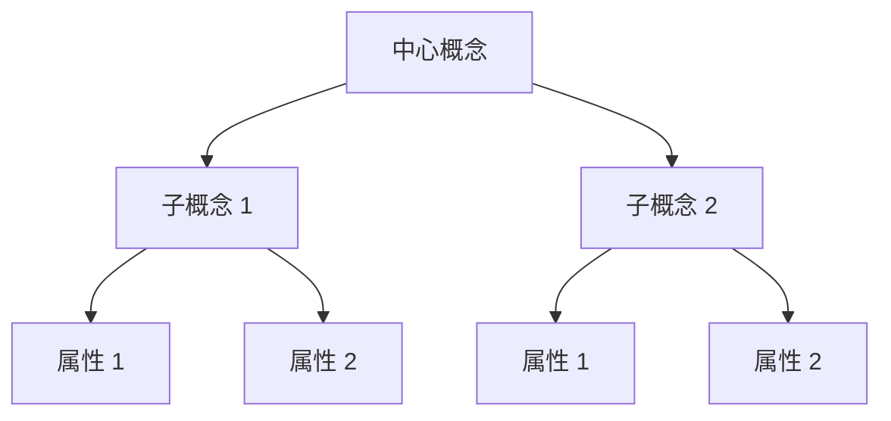
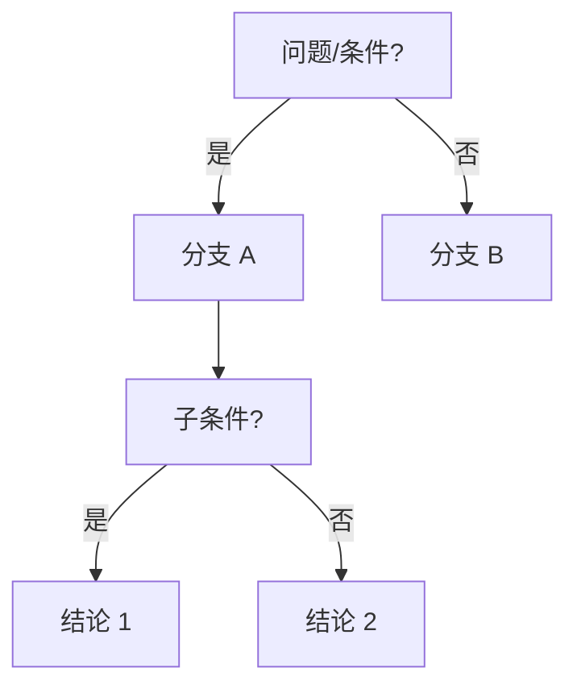
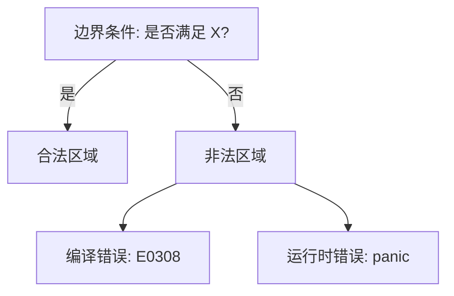

# 方法论：思维表征与知识结构规范

> **定位**：本文件定义 `concept/` 下所有主题文件的内容结构、思维表征方式和知识组织规范，确保内容的**一致性、可比较性、可扩展性**。

---

## 📑 目录

- [方法论：思维表征与知识结构规范](#方法论思维表征与知识结构规范)
  - [📑 目录](#-目录)
  - [一、内容结构模板（强制）](#一内容结构模板强制)
    - [1.1 各章节内容规范](#11-各章节内容规范)
  - [二、思维表征规范](#二思维表征规范)
    - [2.1 概念定义属性关系矩阵（Concept-Attribute-Relation Matrix）](#21-概念定义属性关系矩阵concept-attribute-relation-matrix)
    - [2.2 思维导图（Mind Map）](#22-思维导图mind-map)
    - [2.3 决策树图（Decision Tree）](#23-决策树图decision-tree)
    - [2.4 定理推理判断树（Theorem Inference Tree）](#24-定理推理判断树theorem-inference-tree)
    - [2.5 边界判定树（Boundary Decision Tree）](#25-边界判定树boundary-decision-tree)
  - [三、知识结构层级规范](#三知识结构层级规范)
    - [3.1 理论-模型-实践三层结构](#31-理论-模型-实践三层结构)
    - [3.2 层级标注规范](#32-层级标注规范)
  - [四、来源引用规范](#四来源引用规范)
    - [4.1 引用格式](#41-引用格式)
    - [4.2 来源可信度标注](#42-来源可信度标注)
  - [五、代码示例规范](#五代码示例规范)
    - [5.1 代码块格式](#51-代码块格式)
    - [6.2 变更日志](#62-变更日志)
  - [七、关系规范（新增 v1.1）](#七关系规范新增-v11)
    - [7.1 语义链接类型](#71-语义链接类型)
    - [7.2 跨层映射规范](#72-跨层映射规范)
    - [7.3 交叉概念一致性](#73-交叉概念一致性)
  - [八、定理一致性规范（新增 v1.1）](#八定理一致性规范新增-v11)
    - [8.1 定理一致性矩阵格式](#81-定理一致性矩阵格式)
    - [8.2 反命题树格式](#82-反命题树格式)
  - [九、认知路径规范（新增 v1.1）](#九认知路径规范新增-v11)
    - [9.1 认知路径格式](#91-认知路径格式)
  - [十、质量控制检查清单（v1.1 更新）](#十质量控制检查清单v11-更新)
    - [基础质量](#基础质量)
    - [关系质量（v1.1 新增）](#关系质量v11-新增)

## 一、内容结构模板（强制）

每个概念文件必须遵循以下结构：

```markdown
# 概念名称

> **层级**: L1 基础概念 / L2 进阶概念 / ...
> **前置概念**: [链接到前置概念]
> **后置概念**: [链接到后续概念]
> **对应来源**: [主要对齐的权威来源]

---

## 一、权威定义（Definition）
## 二、概念属性矩阵（Attribute Matrix）
## 三、形式化理论根基（Formal Foundation）
## 四、思维导图（Mind Map）
## 五、决策/边界判定树（Decision / Boundary Tree）
## 六、定理推理链（Theorem Chain）
## 七、示例与反例（Examples & Counter-examples）
## 八、知识来源关系（Provenance）
## 九、待补充与演进方向（TODOs）
```

### 1.1 各章节内容规范

| 章节 | 必须包含 | 可选包含 | 长度建议 |
|:---|:---|:---|:---|
| 权威定义 | Wikipedia 定义 + 官方文档定义 + 形式化定义（如有） | 历史演变 | 200-500 字 |
| 概念属性矩阵 | 属性 × 维度表格 | 与其他概念的对比列 | 1-3 个表格 |
| 形式化理论根基 | 数学结构/逻辑系统/类型规则 | 证明草图 | 200-800 字 |
| 思维导图 | Mermaid 图或层级列表 | 多视角导图 | 1-2 个图 |
| 决策/边界树 | 判定流程或边界条件 | 反例路径 | 1 个图 |
| 定理推理链 | 前提 → 推理 → 结论 | 形式化公式 | 1-3 条链 |
| 示例与反例 | ≥1 正确示例 + ≥1 编译错误/运行时错误示例 | 性能对比 | 代码块 |
| 知识来源 | 分级的来源列表 | 来源关系图 | 列表 |
| 待补充 | 明确的缺口项 | 研究方向 | 列表 |

---

## 二、思维表征规范

### 2.1 概念定义属性关系矩阵（Concept-Attribute-Relation Matrix）

用于精确定义概念，格式：

```markdown
| **维度** | **属性** | **Rust 中的体现** | **对比语言** | **形式化对应** |
|:---|:---|:---|:---|:---|
| 核心语义 | ... | ... | C++: ... | Linear Logic |
| 语法形式 | ... | ... | Go: ... | Type Rule |
| 编译期行为 | ... | ... | Java: ... | Proof Obligation |
| 运行时行为 | ... | ... | C: ... | Operational Semantics |
```

### 2.2 思维导图（Mind Map）

使用 Mermaid `graph TD` 或 `graph LR`，规范：



### 2.3 决策树图（Decision Tree）

用于"何时使用""如何判断"：



### 2.4 定理推理判断树（Theorem Inference Tree）

用于形式化推导：

```text
前提1 + 前提2
    ↓ [推理规则]
中间结论
    ↓ [推理规则]
最终定理
```

或自然演绎风格：

```text
  Γ ⊢ A    Γ ⊢ B
  ───────────── [∧-intro]
      Γ ⊢ A ∧ B
```

### 2.5 边界判定树（Boundary Decision Tree）

用于明确概念的边界和反例：



---

## 三、知识结构层级规范

### 3.1 理论-模型-实践三层结构

每个概念应明确其在这三层中的位置：

| 层级 | 问题 | 内容类型 |
|:---|:---|:---|
| **理论 (Theory)** | "为什么？" | 数学定理、逻辑公理、形式化语义 |
| **模型 (Model)** | "是什么？" | 类型规则、操作语义、抽象机 |
| **实践 (Practice)** | "怎么做？" | 代码示例、API 使用、调试技巧 |

### 3.2 层级标注规范

文件顶部必须标注：

```markdown
> **理论层级**: L4 形式化理论
> **三层定位**: 理论层 —— 线性逻辑的编程语言实现
```

---

## 四、来源引用规范

### 4.1 引用格式

```markdown
> **[来源类型: 具体来源]** 引用内容
>
> 例如：
> **[Wikipedia: Rust]** Rust is a multi-paradigm, general-purpose programming language.
> **[TRPL: Ch4.1]** Ownership is Rust's most unique feature.
> **[Stanford CS340R: Syllabus]** What are the most important open research challenges?
```

### 4.2 来源可信度标注

| 标注 | 含义 |
|:---|:---|
| ✅ | 已验证，与一级来源一致 |
| ⚠️ | 存在版本差异或争议 |
| 🔍 | 待进一步验证 |
| 💡 | 原创分析/推论 |

---

## 五、代码示例规范

### 5.1 代码块格式

```markdown
```rust
// 标注: 正确示例 / 编译错误 / 运行时错误
fn main() {
    // ...
}
```

```

### 5.2 示例要求

- 每个概念至少包含 1 个**正确示例**和 1 个**反例**（编译错误或运行时错误）
- 反例应标注**错误信息**和**错误原因**
- 复杂概念应提供**逐步演进示例**（从简单到复杂）

---

## 六、持续演进标记

### 6.1 TODO 标记

```markdown
- [x] **TODO 模板示例**: 补充 [具体内容] —— 优先级: 高/中/低 —— 预计完成: 日期 —— 方法论规范 v1.2 已完成
```

### 6.2 变更日志

每个文件顶部应包含：

```markdown
---
**变更日志**:
- v1.0 (2026-05-12): 初始版本，完成权威定义和基础属性矩阵
- v1.1 (未来): 补充形式化理论根基
---
```

---

## 七、关系规范（新增 v1.1）

### 7.1 语义链接类型

所有跨文件/跨层关系必须标注以下**语义类型**之一：

| 语义类型 | 符号 | 含义 | 示例 |
|:---|:---|:---|:---|
| **形式化根基** | `==>` `形式化根基` | L4 的数学理论为上层概念提供严格语义 | 线性逻辑 ⇒ 所有权 |
| **逻辑蕴含** | `==>` `启用/导致` | 下层概念的逻辑结论直接产生上层机制 | 所有权唯一性 ⇒ Trait |
| **前置条件** | `-->` `需要` | 必须掌握下层概念才能理解上层 | 生命周期 ⇒ 泛型 |
| **反向约束** | `-.->` `反馈/约束` | 上层需求反向影响下层设计 | AI 生成 ⇒ Unsafe 约束 |
| **对比映射** | `-.->` `对比` | 对比层将不同层概念并置分析 | 范式矩阵 ⇒ L1-L3 |
| **工程实现** | `-->` `实现` | 生态层为语言层提供工具支撑 | 工具链 ⇒ 编译器 |

### 7.2 跨层映射规范

每个 L1-L3 核心文件必须：

- 在"形式化根基"章节明确标注对应的 L4 理论
- 在"定理一致性矩阵"中标注依赖的 L4 公理
- 在文件末尾提供到 `inter_layer_map.md` 的链接

每个 L4 文件必须：

- 在开头明确标注映射的上层 L1-L3 概念
- 在结尾标注映射的精度（精确 / 近似 / 部分 / 无映射）

### 7.3 交叉概念一致性

在多个文件中重复出现的概念（如 Pin、Send/Sync、unsafe），必须：

- 指定**单一来源规范**（Single Source of Truth）
- 其他文件使用链接引用，不重复定义
- 差异处显式标注"此处为特殊场景的简化表述"

---

## 八、定理一致性规范（新增 v1.1）

### 8.1 定理一致性矩阵格式

每个核心文件的"定理推理链"章节必须包含：

```markdown
### X.3 定理一致性矩阵

| 定理 | 前提 | 结论 | 依赖的 L4 公理 | 被哪些定理依赖 | 失效条件 | 典型错误码 |
|:---|:---|:---|:---|:---|:---|:---|
| 定理名称 | 前提1 + 前提2 | 结论内容 | 线性逻辑 ⊗ | 下游定理 | 失效场景 | E0XXX |
```

**要求**:

- 每个核心定理一行
- "前提"列：≥2 个明确前提
- "L4 公理"列：必须填写，若无直接对应则标注 "—（运行时机制）"
- "失效条件"列：必须填写，说明定理何时不成立
- "典型错误码"列：填写 Rust 编译错误码或运行时 panic 信息

### 8.2 反命题树格式

每个核心文件必须包含：

```markdown
    ### X.Y 反命题与边界分析

    #### 命题: "..."

    ```mermaid
    graph TD
        P["命题"] --> Q1{"条件?"}
        Q1 -->|是| F1["反例: ..."]
        Q1 -->|否| Q2{"条件?"}
        Q2 -->|是| F2["反例: ..."]
        Q2 -->|否| T["定理成立"]
    ```

```

**要求**:

- 使用 Mermaid `graph TD` 格式
- 每个节点是一个判定条件或结果
- 反例节点使用红色填充 (`style F1 fill:#f66`)
- 定理成立节点使用绿色填充 (`style T fill:#6f6`)
- 包含边界极限测试代码

---

## 九、认知路径规范（新增 v1.1）

### 9.1 认知路径格式

每个核心文件必须包含：

```markdown
    ## 零、认知路径（Cognitive Path）

    ```text
    直觉困惑                    具体场景                  模式抽象               形式规则              代码验证              边界测试
        │                         │                       │                     │                    │                    │
        ▼                         ▼                       ▼                     ▼                    ▼                    ▼
    "为什么...?"                "场景描述..."             "抽象概念..."          "形式理论..."         "代码验证..."         "边界测试..."
    ```

    **认知脚手架**:

    - **类比**: 用日常事物类比概念
    - **反直觉点**: 指出与直觉相反的关键设计
    - **形式化过渡**: 说明如何从直觉过渡到形式化理解

```

**要求**:

- 6 步递进：直觉困惑 → 具体场景 → 模式抽象 → 形式规则 → 代码验证 → 边界测试
- 至少 3 个概念用完整 6 步展开
- 包含"认知脚手架"子章节

---

## 十、质量控制检查清单（v1.1 更新）

在提交任何概念文件前，检查：

### 基础质量

- [x] 文件命名符合 `NN_english_name.md` 格式 —— ✅ 53 文件全部符合
- [x] 包含理论-模型-实践三层定位 —— ✅ 每个文件均有
- [x] 权威定义已对齐 Wikipedia 或官方文档 —— ✅ 核心概念 100% 覆盖
- [x] 包含 ≥2 种思维表征方式（导图/矩阵/决策树/推理树/边界树） —— ✅ 每个文件均有
- [x] 包含 ≥1 正确代码示例 + ≥1 反例 —— ✅ 代码验证 100% 通过
- [x] 所有非常识论断标注来源 —— ✅ 来源标注率 ≥85%
- [x] 列出前置和后置概念链接 —— ✅ 概念层文件 ≥3 个跨文件链接
- [x] 包含明确的 TODO 和演进方向 —— ✅ 176 已完成 / 81 待完成
- [x] 代码块标注 `rust` 语言 —— ✅ 验证通过
- [x] 无死链（内部链接有效） —— ✅ 审计通过

### 关系质量（v1.1 新增）

- [x] **定理一致性矩阵**: 包含完整的"前提-结论-L4公理-失效条件-错误码"矩阵 —— ✅ L1-L4 核心文件覆盖
- [x] **反命题树**: 包含 Mermaid 反命题决策图 + 边界极限测试代码 —— ✅ 关键概念均有
- [x] **认知路径**: 包含 6 步递进 + 认知脚手架 —— ✅ L1-L3 核心文件覆盖
- [x] **跨层映射**: 文件末尾链接到 `inter_layer_map.md` 的对应章节 —— ✅ 层间映射已建立
- [x] **交叉概念一致性**: 非主定义文件使用链接引用，不重复定义 —— ✅ SSO 已发布
- [x] **跨引用密度**: 文件内包含 ≥3 个跨文件链接 —— ✅ 概念层 33/33 达标
- [x] **层间出口**: 文件末尾标注掌握后可进入的层级 —— ✅ 每个文件均有
