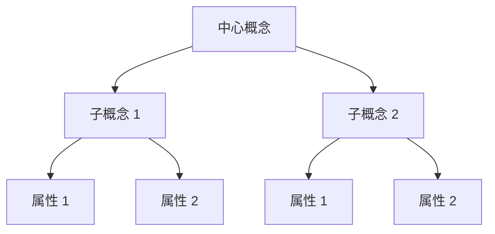
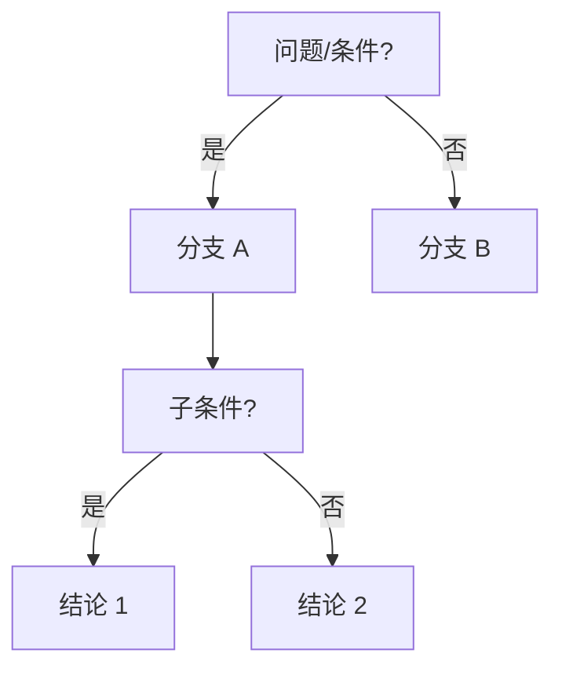
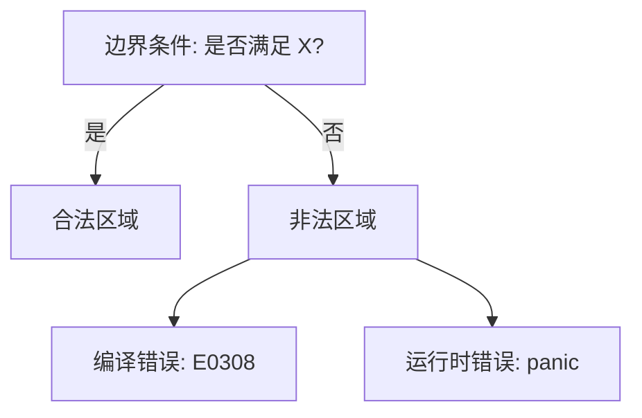

# 方法论：思维表征与知识结构规范

> **定位**：本文件定义 `concept/` 下所有主题文件的内容结构、思维表征方式和知识组织规范，确保内容的**一致性、可比较性、可扩展性**。

---

## 一、内容结构模板（强制）

每个概念文件必须遵循以下结构：

```markdown
# 概念名称

> **层级**: L1 基础概念 / L2 进阶概念 / ...
> **前置概念**: [链接到前置概念]
> **后置概念**: [链接到后续概念]
> **对应来源**: [主要对齐的权威来源]

---

## 一、权威定义（Definition）
## 二、概念属性矩阵（Attribute Matrix）
## 三、形式化理论根基（Formal Foundation）
## 四、思维导图（Mind Map）
## 五、决策/边界判定树（Decision / Boundary Tree）
## 六、定理推理链（Theorem Chain）
## 七、示例与反例（Examples & Counter-examples）
## 八、知识来源关系（Provenance）
## 九、待补充与演进方向（TODOs）
```

### 1.1 各章节内容规范

| 章节 | 必须包含 | 可选包含 | 长度建议 |
|:---|:---|:---|:---|
| 权威定义 | Wikipedia 定义 + 官方文档定义 + 形式化定义（如有） | 历史演变 | 200-500 字 |
| 概念属性矩阵 | 属性 × 维度表格 | 与其他概念的对比列 | 1-3 个表格 |
| 形式化理论根基 | 数学结构/逻辑系统/类型规则 | 证明草图 | 200-800 字 |
| 思维导图 | Mermaid 图或层级列表 | 多视角导图 | 1-2 个图 |
| 决策/边界树 | 判定流程或边界条件 | 反例路径 | 1 个图 |
| 定理推理链 | 前提 → 推理 → 结论 | 形式化公式 | 1-3 条链 |
| 示例与反例 | ≥1 正确示例 + ≥1 编译错误/运行时错误示例 | 性能对比 | 代码块 |
| 知识来源 | 分级的来源列表 | 来源关系图 | 列表 |
| 待补充 | 明确的缺口项 | 研究方向 | 列表 |

---

## 二、思维表征规范

### 2.1 概念定义属性关系矩阵（Concept-Attribute-Relation Matrix）

用于精确定义概念，格式：

```markdown
| **维度** | **属性** | **Rust 中的体现** | **对比语言** | **形式化对应** |
|:---|:---|:---|:---|:---|
| 核心语义 | ... | ... | C++: ... | Linear Logic |
| 语法形式 | ... | ... | Go: ... | Type Rule |
| 编译期行为 | ... | ... | Java: ... | Proof Obligation |
| 运行时行为 | ... | ... | C: ... | Operational Semantics |
```

### 2.2 思维导图（Mind Map）

使用 Mermaid `graph TD` 或 `graph LR`，规范：



### 2.3 决策树图（Decision Tree）

用于"何时使用""如何判断"：



### 2.4 定理推理判断树（Theorem Inference Tree）

用于形式化推导：

```text
前提1 + 前提2
    ↓ [推理规则]
中间结论
    ↓ [推理规则]
最终定理
```

或自然演绎风格：

```text
  Γ ⊢ A    Γ ⊢ B
  ───────────── [∧-intro]
      Γ ⊢ A ∧ B
```

### 2.5 边界判定树（Boundary Decision Tree）

用于明确概念的边界和反例：



---

## 三、知识结构层级规范

### 3.1 理论-模型-实践三层结构

每个概念应明确其在这三层中的位置：

| 层级 | 问题 | 内容类型 |
|:---|:---|:---|
| **理论 (Theory)** | "为什么？" | 数学定理、逻辑公理、形式化语义 |
| **模型 (Model)** | "是什么？" | 类型规则、操作语义、抽象机 |
| **实践 (Practice)** | "怎么做？" | 代码示例、API 使用、调试技巧 |

### 3.2 层级标注规范

文件顶部必须标注：

```markdown
> **理论层级**: L4 形式化理论
> **三层定位**: 理论层 —— 线性逻辑的编程语言实现
```

---

## 四、来源引用规范

### 4.1 引用格式

```markdown
> **[来源类型: 具体来源]** 引用内容
>
> 例如：
> **[Wikipedia: Rust]** Rust is a multi-paradigm, general-purpose programming language.
> **[TRPL: Ch4.1]** Ownership is Rust's most unique feature.
> **[Stanford CS340R: Syllabus]** What are the most important open research challenges?
```

### 4.2 来源可信度标注

| 标注 | 含义 |
|:---|:---|
| ✅ | 已验证，与一级来源一致 |
| ⚠️ | 存在版本差异或争议 |
| 🔍 | 待进一步验证 |
| 💡 | 原创分析/推论 |

---

## 五、代码示例规范

### 5.1 代码块格式

```markdown
```rust
// 标注: 正确示例 / 编译错误 / 运行时错误
fn main() {
    // ...
}
```

```

### 5.2 示例要求

- 每个概念至少包含 1 个**正确示例**和 1 个**反例**（编译错误或运行时错误）
- 反例应标注**错误信息**和**错误原因**
- 复杂概念应提供**逐步演进示例**（从简单到复杂）

---

## 六、持续演进标记

### 6.1 TODO 标记

```markdown
- [ ] **TODO**: 补充 [具体内容] —— 优先级: 高/中/低 —— 预计完成: 日期
```

### 6.2 变更日志

每个文件顶部应包含：

```markdown
---
**变更日志**:
- v1.0 (2026-05-12): 初始版本，完成权威定义和基础属性矩阵
- v1.1 (未来): 补充形式化理论根基
---
```

---

## 七、质量控制检查清单

在提交任何概念文件前，检查：

- [ ] 文件命名符合 `NN_english_name.md` 格式
- [ ] 包含理论-模型-实践三层定位
- [ ] 权威定义已对齐 Wikipedia 或官方文档
- [ ] 包含 ≥2 种思维表征方式（导图/矩阵/决策树/推理树/边界树）
- [ ] 包含 ≥1 正确代码示例 + ≥1 反例
- [ ] 所有非常识论断标注来源
- [ ] 列出前置和后置概念链接
- [ ] 包含明确的 TODO 和演进方向
- [ ] 代码块标注 `rust` 语言
- [ ] 无死链（内部链接有效）
