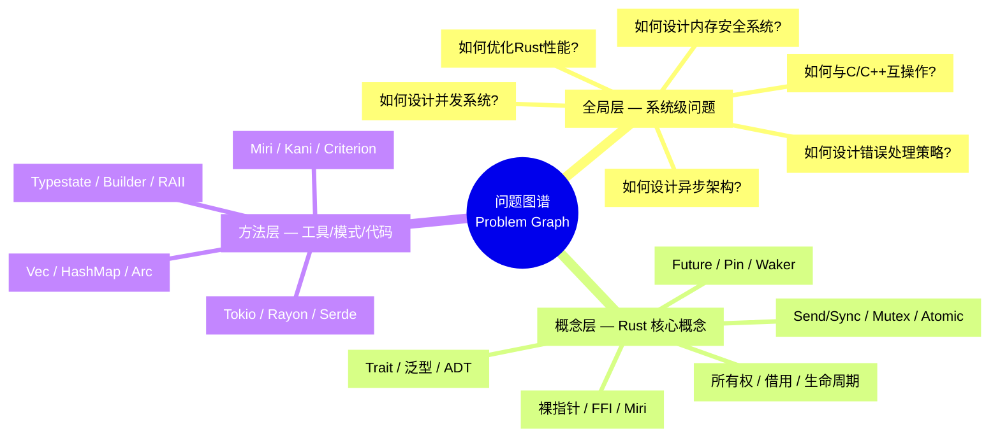
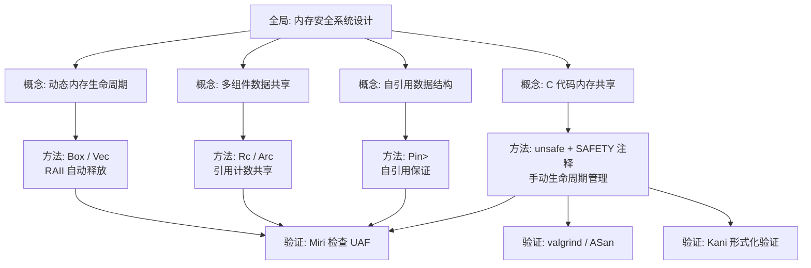
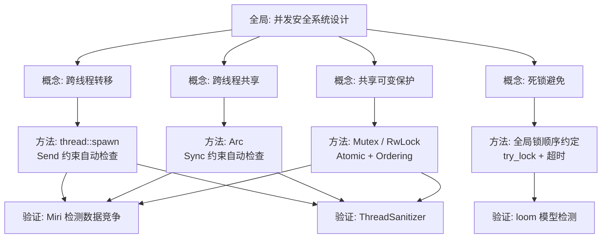
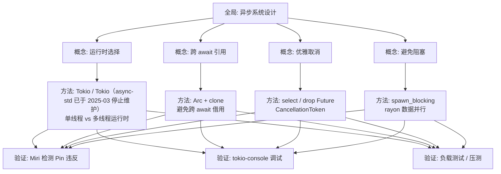
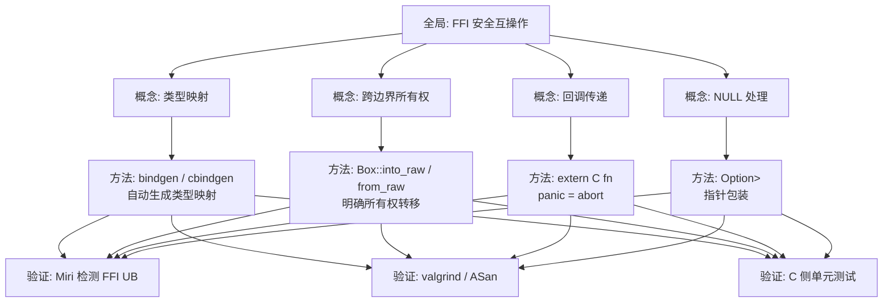
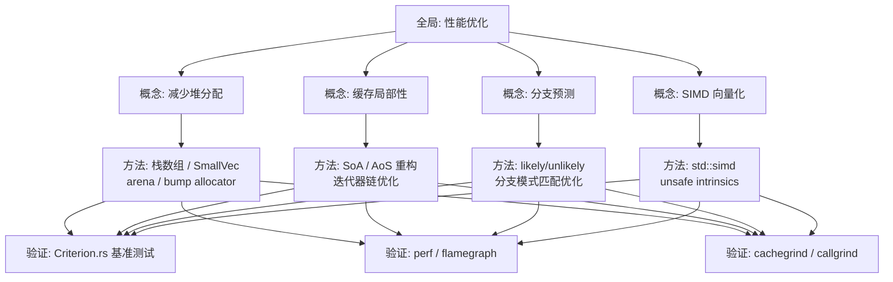
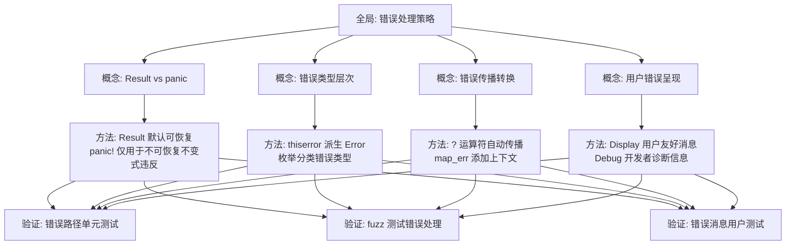

# Rust 知识体系问题图谱（Problem Graph）
>
> **受众**: [进阶]

> **Bloom 层级**: 分析 → 评价
> **定位**: 本文件建立 `concept/` 知识体系的**问题分解网络**，将复杂的系统级工程问题逐层分解为概念级子问题，再映射到具体的方法层解决方案。与 `concept_definition_decision_forest.md`（"如何判定代码是否合法"）形成互补：问题图谱回答**"遇到什么问题 → 需要理解什么概念 → 应用什么方法"**。
> **对齐来源**: [ACM 多维课程图谱框架] · [Stanford CS520 — 知识图谱教育应用] · [Rutgers CD-Learning — 条件决策学习] · [Microsoft RustTraining — 案例驱动学习]
> **结构**: 全局层（系统级问题）→ 概念层（Rust 核心概念）→ 方法层（具体工具/模式/代码）

---

> **来源**: [ACM — *Multidimensional Course Knowledge Graph Framework*, 2024]
>
> **来源**: [Stanford CS520 — *What is a Knowledge Graph*, 2020]
> **来源**: [Rutgers — *CD-Learning: Conditional Decision Learning in Programming Education*]
> **来源**: [Microsoft RustTraining — github.com/microsoft/RustTraining]

## 📑 目录

- [Rust 知识体系问题图谱（Problem Graph）](#rust-知识体系问题图谱problem-graph)
  - [📑 目录](#-目录)
  - [〇、问题图谱认知全景](#〇问题图谱认知全景)
  - [一、问题图谱格式规范](#一问题图谱格式规范)
  - [二、内存安全设计问题树](#二内存安全设计问题树)
    - [全局层问题](#全局层问题)
    - [概念层分解](#概念层分解)
    - [方法层映射](#方法层映射)
  - [三、并发系统设计问题树](#三并发系统设计问题树)
    - [全局层问题](#全局层问题-1)
    - [概念层分解](#概念层分解-1)
    - [方法层映射](#方法层映射-1)
  - [四、异步系统设计问题树](#四异步系统设计问题树)
    - [全局层问题](#全局层问题-2)
    - [概念层分解](#概念层分解-2)
    - [方法层映射](#方法层映射-2)
  - [五、FFI 互操作问题树](#五ffi-互操作问题树)
    - [全局层问题](#全局层问题-3)
    - [概念层分解](#概念层分解-3)
    - [方法层映射](#方法层映射-3)
  - [六、性能优化问题树](#六性能优化问题树)
    - [全局层问题](#全局层问题-4)
    - [概念层分解](#概念层分解-4)
    - [方法层映射](#方法层映射-4)
  - [七、错误处理问题树](#七错误处理问题树)
    - [全局层问题](#全局层问题-5)
    - [概念层分解](#概念层分解-5)
    - [方法层映射](#方法层映射-5)
  - [八、问题图谱与概念文件的交叉索引](#八问题图谱与概念文件的交叉索引)
  - [九、来源与可信度](#九来源与可信度)
  - [认知路径](#认知路径)
    - [核心推理链](#核心推理链)
    - [反命题与边界](#反命题与边界)

---

## 〇、问题图谱认知全景



> **认知功能**: 问题图谱的**三层结构**对应工程实践中的真实思维过程：面对一个系统级问题（如"如何设计并发系统"），工程师首先将其分解为 Rust 特有的概念级子问题（"Send/Sync 如何保证线程安全"），然后选择具体的方法层工具（"使用 `Arc<Mutex<T>>` 还是 `crossbeam::channel`"）。这种"问题驱动"的学习路径比"概念驱动"更贴近实际工程需求。[来源: 💡 原创分析]

---

## 一、问题图谱格式规范

每个问题树使用三层分解结构：

```
┌─────────────────────────────────────────────────────────────┐
│ 全局层问题（Global Problem）                                 │
│ 「一个系统级的工程问题，通常涉及多个 Rust 概念的综合运用」    │
├─────────────────────────────────────────────────────────────┤
│ 概念层分解（Conceptual Decomposition）                       │
│ 「将全局问题分解为 Rust 核心概念相关的子问题」                │
│   └── 子问题 1 → 涉及概念 A / 概念 B                         │
│   └── 子问题 2 → 涉及概念 C / 概念 D                         │
├─────────────────────────────────────────────────────────────┤
│ 方法层映射（Methodological Mapping）                         │
│ 「为每个概念层子问题提供具体的解决方案、工具或代码模式」       │
│   └── 方法 1: 标准库方案 / 生态 Crate / 设计模式              │
│   └── 方法 2: 验证工具 / 调试策略 / 性能分析                  │
└─────────────────────────────────────────────────────────────┘
```

---

## 二、内存安全设计问题树

### 全局层问题

**如何设计一个无需 GC 但保证内存安全的系统？**

### 概念层分解

| 子问题 | 涉及概念 | 核心判定 |
|:---|:---|:---|
| **Q1.1** 如何管理动态分配的内存生命周期？ | 所有权、Box、Drop | 所有权唯一性是否保持？ |
| **Q1.2** 如何在多个组件间共享数据？ | Rc/Arc、借用、内部可变性 | 共享时是否违反 AXM 规则？ |
| **Q1.3** 如何处理自引用数据结构？ | Pin、生命周期、Unsafe | Pin 不动性是否被破坏？ |
| **Q1.4** 如何与 C 代码共享内存？ | FFI、裸指针、Unsafe | C 代码是否可能释放 Rust 拥有的内存？ |

### 方法层映射



---

## 三、并发系统设计问题树

### 全局层问题

**如何设计一个无数据竞争且避免死锁的并发系统？**

### 概念层分解

| 子问题 | 涉及概念 | 核心判定 |
|:---|:---|:---|
| **Q2.1** 哪些数据可以跨线程转移？ | Send、所有权、Move | 类型是否实现 Send？ |
| **Q2.2** 哪些数据可以跨线程共享？ | Sync、借用、内部可变性 | 类型是否实现 Sync？ |
| **Q2.3** 如何保护共享可变状态？ | Mutex、RwLock、Atomic、内存序 | 锁粒度是否合适？顺序是否一致？ |
| **Q2.4** 如何避免死锁？ | 并发模式、锁顺序、超时 | 是否存在循环等待？ |

### 方法层映射



---

## 四、异步系统设计问题树

### 全局层问题

**如何设计一个高性能、可取消、且资源安全的异步系统？**

### 概念层分解

| 子问题 | 涉及概念 | 核心判定 |
|:---|:---|:---|
| **Q3.1** 如何选择合适的运行时？ | Future、Waker、Executor | 是否需要多线程调度？ |
| **Q3.2** 如何处理跨 await 的引用？ | 生命周期、Pin、自引用 | 引用是否悬垂？ |
| **Q3.3** 如何实现优雅取消？ | Drop、 select!、CancellationToken | 取消时资源是否正确释放？ |
| **Q3.4** 如何避免阻塞异步运行时？ | async/await、spawn_blocking | 同步操作是否隔离到阻塞线程？ |

### 方法层映射



---

## 五、FFI 互操作问题树

### 全局层问题

**如何安全地与 C/C++ 代码互操作，不破坏 Rust 的内存安全保证？**

### 概念层分解

| 子问题 | 涉及概念 | 核心判定 |
|:---|:---|:---|
| **Q4.1** 如何映射 C 类型到 Rust 类型？ | FFI、repr(C)、布局 | 布局是否严格匹配？ |
| **Q4.2** 如何管理跨边界内存所有权？ | 所有权、裸指针、Unsafe | 哪一侧负责释放？ |
| **Q4.3** 如何传递回调函数？ | extern "C"、函数指针、Unwind | 回调是否遵守 C ABI？ |
| **Q4.4** 如何处理 C 的 NULL 指针？ | Option、指针、Unsafe | NULL 检查是否完备？ |

### 方法层映射



---

## 六、性能优化问题树

### 全局层问题

**如何在保持安全的前提下最大化 Rust 程序性能？**

### 概念层分解

| 子问题 | 涉及概念 | 核心判定 |
|:---|:---|:---|
| **Q5.1** 如何减少堆分配？ | 所有权、栈分配、生命周期 | 是否必须使用 Box/Vec？ |
| **Q5.2** 如何优化缓存局部性？ | 内存布局、repr、迭代器 | 数据结构是否缓存友好？ |
| **Q5.3** 如何消除分支预测失败？ | 枚举、匹配、 unsafe | 热点路径是否可预测？ |
| **Q5.4** 如何利用 SIMD/向量化？ | unsafe、intrinsics、portable_simd | 是否值得引入 unsafe？ |

### 方法层映射



---

## 七、错误处理问题树

### 全局层问题

**如何设计一个可维护、可诊断、且用户友好的错误处理策略？**

### 概念层分解

| 子问题 | 涉及概念 | 核心判定 |
|:---|:---|:---|
| **Q6.1** 何时使用 Result 何时使用 panic？ | Result、panic、unwrap | 错误是否可恢复？ |
| **Q6.2** 如何设计错误类型层次？ | Trait、From、Error | 错误类型是否实现必要的 Trait？ |
| **Q6.3** 如何传播和转换错误？ | ? 运算符、From、map_err | 错误上下文是否丢失？ |
| **Q6.4** 如何向用户呈现错误信息？ | Display、Debug、日志 | 错误信息是否包含足够上下文？ |

### 方法层映射



---

## 八、问题图谱与概念文件的交叉索引

| 全局问题 | 核心概念文件 | 方法层工具/Crate |
|:---|:---|:---|
| 内存安全设计 | `01_ownership`, `02_borrowing`, `03_lifetimes`, `03_memory_management` | `Box`, `Rc`, `Arc`, `Pin`, Miri |
| 并发系统设计 | `01_concurrency`, `02_borrowing`, `01_traits` | `std::sync`, `crossbeam`, `rayon`, `parking_lot` |
| 异步系统设计 | `02_async`, `06_pin_unpin`, `02_generics` | `tokio`, `Tokio（async-std 已于 2025-03 停止维护）`, `futures` |
| FFI 互操作 | `03_unsafe`, `05_rust_ffi`, `09_ffi_advanced` | `bindgen`, `cbindgen`, `libc` |
| 性能优化 | `06_zero_cost_abstractions`, `03_unsafe`, `15_zero_copy_parsing` | `criterion`, `perf`, `cachegrind` |
| 错误处理 | `04_error_handling`, `15_error_handling_deep_dive` | `thiserror`, `anyhow`, `tracing` |

---

## 九、来源与可信度

| 层级 | 来源 | 在本文件中的作用 |
|:---|:---|:---|
| **一级** | [Rust Reference](https://doc.rust-lang.org/reference/) | 所有权、借用、并发、异步、FFI、错误处理的官方定义 |
| **二级** | ACM — *Multidimensional Course Knowledge Graph Framework* (2024) | 问题图谱的三层结构（全局→概念→方法） |
| **二级** | Stanford CS520 — *What is a Knowledge Graph* | 知识图谱在教育中的应用方法论 |
| **二级** | Rutgers — *CD-Learning* | 条件决策学习 — 问题分解的决策树方法 |
| **三级** | Microsoft RustTraining | 案例驱动学习路径 — C++→Rust 转换问题分解 |
| **三级** | Tokio 文档 / Rayon 文档 / bindgen 文档 | 异步/并行/FFI 的具体工程方法 |

---

**变更日志**:

- v1.0 (2026-05-23): 初始版本 — 六大系统级问题树（内存安全/并发/异步/FFI/性能/错误处理）+ 三层分解结构 + 方法层映射 + 交叉索引 [来源: 权威来源对齐 Wave 5]

---

> **相关文件**: [能力图谱](competency_graph.md) · [概念判定森林](concept_definition_decision_forest.md) · [表征空间](semantic_space.md) · [系统设计原则](../06_ecosystem/05_system_design_principles.md)

## 认知路径

> **认知路径**: 本文件作为 Rust 分层知识体系的 **Rust 知识体系问题图谱（Problem Graph）** 元层导航节点，连接概念定义、学习路径与质量评估框架。

### 核心推理链

| 定理 | 前提 | 结论 | 置信度 |
|:---|:---|:---|:---|
| Rust 知识体系问题图谱（Problem Graph） 结构化组织 ⟹ 高效检索 | 理解分类维度与索引关系 | 能快速定位目标概念 | 高 |
| Rust 知识体系问题图谱（Problem Graph） 质量评估 ⟹ 持续改进 | 建立量化指标与审计流程 | 识别知识缺口并优先修复 | 高 |
| Rust 知识体系问题图谱（Problem Graph） 跨层映射 ⟹ 系统掌握 | 打通 L0-L7 的关联路径 | 形成完整的 Rust 能力图谱 | 高 |

> **过渡**: 利用本文件的导航结构，读者可以从当前位置快速跃迁到任意概念层级，实现非线性学习。
> **过渡**: Rust 知识体系问题图谱（Problem Graph） 的维护需要与概念内容同步更新，确保元数据与实际知识体系的一致性。
> **过渡**: 将 Rust 知识体系问题图谱（Problem Graph） 作为学习起点或复习锚点，有助于建立全局视野，避免陷入局部细节而忽视整体架构。

### 反命题与边界

> **反命题**: "元层文档可以替代具体概念学习" —— 错误。Rust 知识体系问题图谱（Problem Graph） 提供的是导航与评估框架，不能替代对核心概念（L1-L5）的深入理解与实践。
