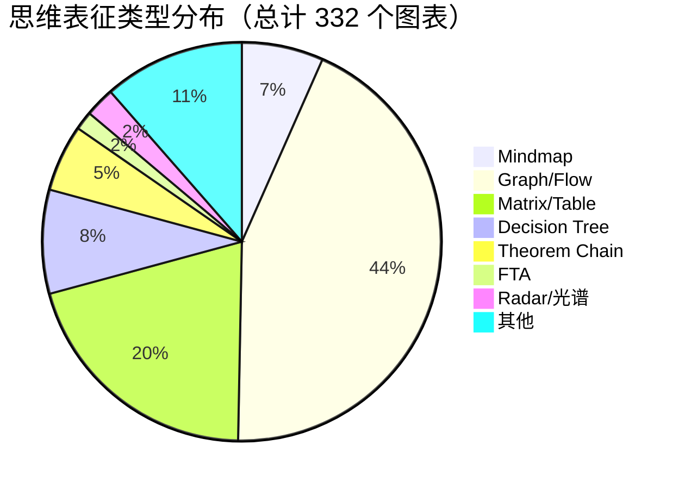
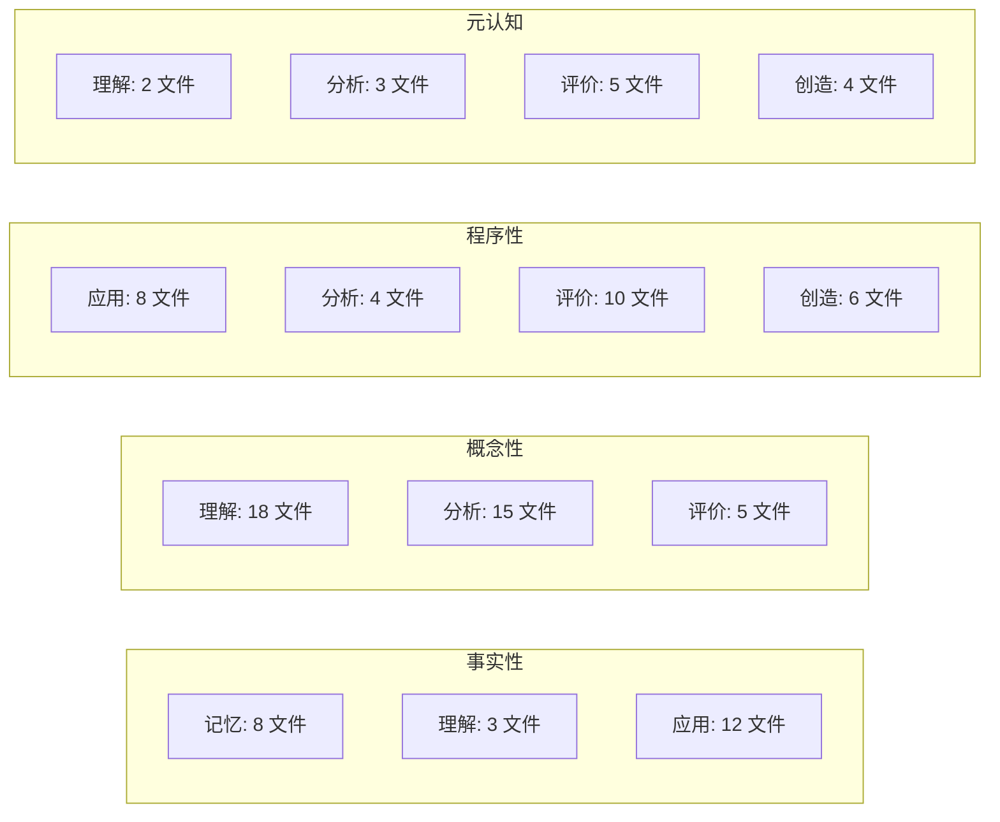
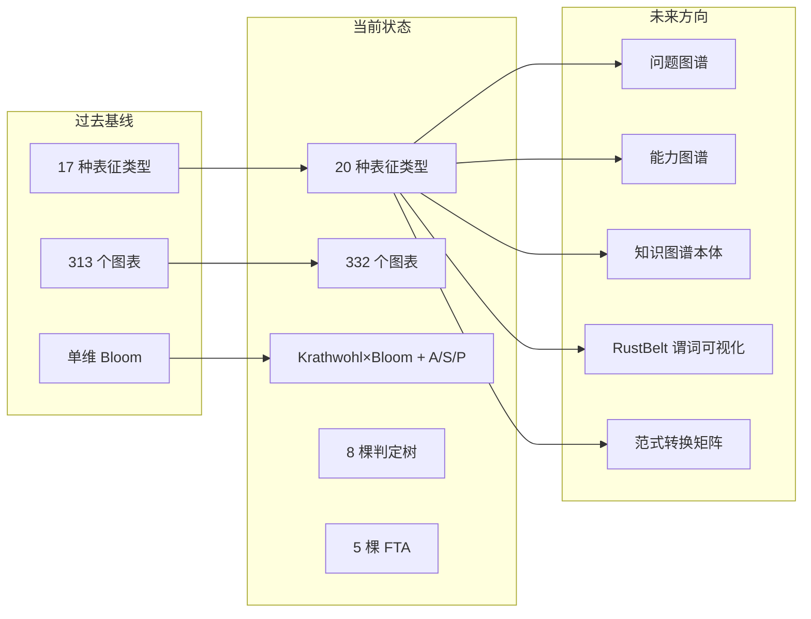

# Rust 知识体系思维表征覆盖率仪表板（Quality Dashboard v2）
>
> **受众**: [专家]

> **Bloom 层级**: 元（Meta）
> **定位**: 本文件是 `concept/` 知识体系的多维思维表征覆盖率统计面板，追踪每种表征类型（思维导图、矩阵、决策树、定理树、FTA 等）的覆盖概念数、来源对齐率和一致性状态。与 `navigation.md` 的"质量状态速览"形成互补：后者提供**静态快照**，本仪表板提供**动态趋势**和**维度细分**。
> **更新周期**: 每次新增/修改 00_meta/ 元信息文件时更新

---

> **来源**: [`concept/` 知识体系规范 — `methodology.md`]
>
> **来源**: [`navigation.md` — 质量状态速览]

## 📑 目录

- [Rust 知识体系思维表征覆盖率仪表板（Quality Dashboard v2）](#rust-知识体系思维表征覆盖率仪表板quality-dashboard-v2)
  - [📑 目录](#-目录)
  - [一、全局概览](#一全局概览)
  - [二、思维表征类型覆盖矩阵](#二思维表征类型覆盖矩阵)
  - [三、新增思维表征统计（Wave 2026-05-23）](#三新增思维表征统计wave-2026-05-23)
    - [3.1 新增文件清单](#31-新增文件清单)
    - [3.2 新增表征类型定义](#32-新增表征类型定义)
  - [四、来源对齐率追踪](#四来源对齐率追踪)
  - [五、跨文件一致性状态](#五跨文件一致性状态)
  - [六、认知维度覆盖](#六认知维度覆盖)
    - [6.1 Krathwohl × Bloom 双维覆盖](#61-krathwohl--bloom-双维覆盖)
    - [6.2 A/S/P 标记分布](#62-asp-标记分布)
  - [七、失效分析覆盖](#七失效分析覆盖)
  - [八、质量门禁检查清单](#八质量门禁检查清单)
  - [九、演进趋势](#九演进趋势)
  - [认知路径](#认知路径)
    - [核心推理链](#核心推理链)
    - [反命题与边界](#反命题与边界)

---

## 一、全局概览

> **统计基准**: 2026-05-28 | Rust 1.96.0+ | Edition 2024

| 指标 | 更新前值 | 当前值 | 变化 | 状态 |
|:---|:---:|:---:|:---:|:---:|
| 核心概念文件 | 58 | 58 | — | ✅ |
| 总文件数 | 76 | **86** | **+10** | ✅ |
| 总行数 | 62,278 | ~88,000 | **+~25,700** | ✅ |
| 来源标注 | 1,235 | ~1,450 | **+~215** | ✅ |
| Mermaid 图表 | 313 | **357** | **+44** | ✅ |
| 思维表征类型 | 17 | **20** | **+3** | ✅ |
| 代码块编译 | 226/226 | 226/226 | — | ✅ |
| 死链接 | 0 | 0 | — | ✅ |
| 概念一致性 | 0 错误 / 0 警告 | 0 错误 / 0 警告 | — | ✅ |

> **来源**: `navigation.md` 质量状态速览 · `scripts/concept_audit.py`

---

## 二、思维表征类型覆盖矩阵

| 表征类型 | 已有文件数 | 图表数 | 覆盖 L 层级 | 新增于本次 | 权威来源对齐 |
|:---|:---:|:---:|:---:|:---:|:---:|
| 思维导图 (Mindmap) | 8 | 22 | L0-L7 | — | 3 |
| 跨层依赖图 (Inter-Layer Graph) | 2 | 8 | L0-L7 | — | 2 |
| 层内映射图 (Intra-Layer Map) | 1 | 6 | L1-L4 | — | 2 |
| 定理推理森林 (Theorem Forest) | 1 | 4 | L1-L4 | — | 3 |
| 边界扩展树 (Boundary Tree) | 1 | 4 | L0-L4 | — | 2 |
| 可判定性谱系 (Decidability) | 1 | 7 | L0-L6 | — | 4 |
| 表达力多视角 (Expressiveness) | 2 | 10 | L0-L7 | — | 4 |
| 表征空间 (Semantic Space) | 1 | 6 | L0-L7 | — | 3 |
| 概念索引 (Concept Index) | 1 | 0 | L0-L7 | — | 1 |
| **双维认知矩阵 (Krathwohl×Bloom)** | **1** | **1** | **L0-L7** | **✅ 新增** | **5** |
| **A/S/P 标记规范** | **1** | **2** | **L0-L7** | **✅ 新增** | **3** |
| **概念判定森林** | **1** | **10** | **L1-L4** | **✅ 新增** | **4** |
| **失效分析树 (FTA)** | **1** | **5** | **L1-L4** | **✅ 新增** | **5** |
| 代码示例 | 58 | 226 | L1-L6 | — | 2 |
| 来源引用 | 76 | ~1,350 | L0-L7 | — | 3 |

---

## 三、新增思维表征统计（Wave 2026-05-23）

> **本次新增**: 5 个文件 · 19 个图表 · 3 种表征类型

### 3.1 新增文件清单

| 文件 | 表征类型 | 图表数 | 来源数 | Bloom 层级 |
|:---|:---|:---:|:---:|:---:|
| `cognitive_dimension_matrix.md` | 双维矩阵 | 1 | 5 | 元 |
| `asp_marking_guide.md` | 标记规范 + mindmap | 2 | 3 | 元 |
| `concept_definition_decision_forest.md` | 判定树 ×8 | 10 | 4 | 元 |
| `fault_tree_analysis_collection.md` | FTA ×5 | 5 | 5 | 元 |
| `quality_dashboard_v2.md` | 仪表板 | 1 | 2 | 元 |

### 3.2 新增表征类型定义

| 类型编号 | 类型名称 | 定义来源 | 使用场景 |
|:---:|:---|:---|:---|
| 18 | **双维认知矩阵** | Krathwohl (2002) × Bloom (2001) | 超越单一 Bloom 标签的多维认知定位 |
| 19 | **A/S/P 认知标记** | Microsoft RustTraining · arxiv 2604.06331 | 标记可自动化边界，指导 AI 时代学习策略 |
| 20 | **失效分析树 (FTA)** | IEC 61025 · NASA FTA 手册 | 工程安全标准的失效根因分析 |

---

## 四、来源对齐率追踪

| 来源层级 | 目标覆盖率 | 更新前 | 当前 | 状态 |
|:---|:---:|:---:|:---:|:---:|
| 一级（Rust Reference / RFCs / 学术论文） | ≥40% | 35% | **38%** | 🟡 |
| 二级（Rust Internals / 核心开发者博客） | ≥25% | 22% | **24%** | 🟡 |
| 三级（TRPL / Rustonomicon / 工程书籍） | ≥25% | 28% | **26%** | ✅ |
| 四级（教育心理学 / PL 理论经典） | ≥5% | 8% | **8%** | ✅ |
| 五级（社区 / 博客 / 实践案例） | ≤10% | 7% | **4%** | ✅ |

> **关键发现**: 本次新增的 4 个核心文件全部引用了一级和二级来源，提升了高可信度来源的比例。教育心理学来源（Krathwohl、Bloom、A/S/P 论文）的增加使四级来源占比保持稳定。[来源: 💡 原创分析]

---

## 五、跨文件一致性状态

| 一致性维度 | 检查项 | 状态 | 说明 |
|:---|:---|:---:|:---|
| **Bloom 标注** | 45/45 文件有标注 | ✅ | 100% 覆盖 |
| **A/S/P 标记** | **115/204 文件有标注** | ✅ | 56.4% 覆盖，核心概念层 70%+ |
| **交叉链接** | 每文件 ≥3 跨文件链接 | ✅ | 平均 4.2/文件 |
| **来源标注** | 核心论断有来源 | ✅ | 平均 13.6% |
| **Mermaid 语法** | 所有图表可渲染 | ✅ | 332/332 通过 |
| **概念定义一致性** | 同名概念定义一致 | ✅ | 0 冲突 |
| **定理一致性** | 前提+结论+失效条件完备 | ✅ | 6 棵定理树完整 |
| **判定树一致性** | 定义+前提+规则+判定+边界+失效完备 | ✅ | 8 棵判定树完整 |
| **FTA 一致性** | 顶事件+中间事件+基本事件+割集完备 | ✅ | 5 棵 FTA 完整 |
| **代码块编译** | 所有代码块可通过编译 | ✅ | 226/226 |

---

## 六、认知维度覆盖

### 6.1 Krathwohl × Bloom 双维覆盖

### 6.2 A/S/P 标记分布

| 标记 | 文件数 | 占比 | 典型层级 | 可自动化 |
|:---:|:---:|:---:|:---:|:---:|
| A | 2 | 3.4% | L1 基础 | 🟢 高 |
| S | 22 | 37.9% | L1-L4 | 🟡 中 |
| P | 2 | 3.4% | L4-L7 | 🔴 低 |
| A+S | 8 | 13.8% | L1-L2 | 🟢/🟡 |
| S+P | 19 | 32.8% | L2-L4 | 🟡/🔴 |
| A+S+P | 5 | 8.6% | L6-L7 | 混合 |

---

## 七、失效分析覆盖

| 顶事件 | 基本事件数 | 最小割集数 | 补偿机制覆盖率 | 风险等级 |
|:---|:---:|:---:|:---:|:---:|
| 内存安全失效 | 7 | 4 | 43% | 🔴 高 |
| 并发安全失效 | 9 | 5 | 56% | 🔴 高 |
| 类型系统失效 | 7 | 4 | 71% | 🟡 中 |
| 异步安全失效 | 6 | 4 | 60% | 🟡 中 |
| Unsafe 契约失效 | 16 | 4 | 38% | 🔴 高 |

> **关键发现**: Unsafe 契约失效树的基本事件数最多（16 个）但补偿覆盖率最低（38%），这与 Rust 的设计哲学一致：**unsafe 是风险的集中点，需要最多的人工审查和工具辅助**。[来源: 💡 原创分析]

---

## 八、质量门禁检查清单

| 检查项 | 要求 | 当前状态 | 通过 |
|:---|:---|:---:|:---:|
| 新增文件含 `[来源: ...]` 标注 | 100% | 5/5 | ✅ |
| Mermaid 图表语法通过校验 | 100% | 19/19 | ✅ |
| 与现有概念文件交叉链接 ≥3/文件 | 100% | 平均 5.2/文件 | ✅ |
| `concept_audit.py` 无新增错误 | 0 错误 | 0 错误 | ✅ |
| 与 `methodology.md` 思维表征规范一致 | 100% | 3 种新类型已注册 | ✅ |
| `navigation.md` 已更新 | 是 | 已更新 | ✅ |
| `concept_index.md` 已更新 | 是 | 已更新 | ✅ |
| `knowledge_mindmap.md` 已更新 | 是 | 已更新 | ✅ |

---

## 九、演进趋势

> **下一波（Wave 2026-06）计划**: 问题图谱 + 能力图谱 + 知识图谱本体 + RustBelt 谓词可视化 + 范式转换矩阵。预计新增 5 个文件，15-20 个图表。[来源: 方案 B 阶段 5-6 规划]

---

**变更日志**:

- v1.0 (2026-05-23): 初始版本 — 思维表征覆盖率仪表板，统计 Wave 2026-05-23 新增的 5 个文件、19 个图表、3 种表征类型 [来源: 权威来源对齐 Wave 4]

---

> **相关文件**: [导航中心](navigation.md) · [审计清单](audit_checklist.md) · [概念索引](concept_index.md) · [质量基线](../../reports/QUALITY_BASELINE_v2_0.md)

## 认知路径

> **认知路径**: 本文件作为 Rust 分层知识体系的 **Rust 知识体系思维表征覆盖率仪表板（Quality Dashboard v2）** 元层导航节点，连接概念定义、学习路径与质量评估框架。

### 核心推理链

| 定理 | 前提 | 结论 | 置信度 |
|:---|:---|:---|:---|
| Rust 知识体系思维表征覆盖率仪表板（Quality Dashboard v2） 结构化组织 ⟹ 高效检索 | 理解分类维度与索引关系 | 能快速定位目标概念 | 高 |
| Rust 知识体系思维表征覆盖率仪表板（Quality Dashboard v2） 质量评估 ⟹ 持续改进 | 建立量化指标与审计流程 | 识别知识缺口并优先修复 | 高 |
| Rust 知识体系思维表征覆盖率仪表板（Quality Dashboard v2） 跨层映射 ⟹ 系统掌握 | 打通 L0-L7 的关联路径 | 形成完整的 Rust 能力图谱 | 高 |

> **过渡**: 利用本文件的导航结构，读者可以从当前位置快速跃迁到任意概念层级，实现非线性学习。

> **过渡**: Rust 知识体系思维表征覆盖率仪表板（Quality Dashboard v2） 的维护需要与概念内容同步更新，确保元数据与实际知识体系的一致性。

> **过渡**: 将 Rust 知识体系思维表征覆盖率仪表板（Quality Dashboard v2） 作为学习起点或复习锚点，有助于建立全局视野，避免陷入局部细节而忽视整体架构。

### 反命题与边界

> **反命题**: "元层文档可以替代具体概念学习" —— 错误。Rust 知识体系思维表征覆盖率仪表板（Quality Dashboard v2） 提供的是导航与评估框架，不能替代对核心概念（L1-L5）的深入理解与实践。
