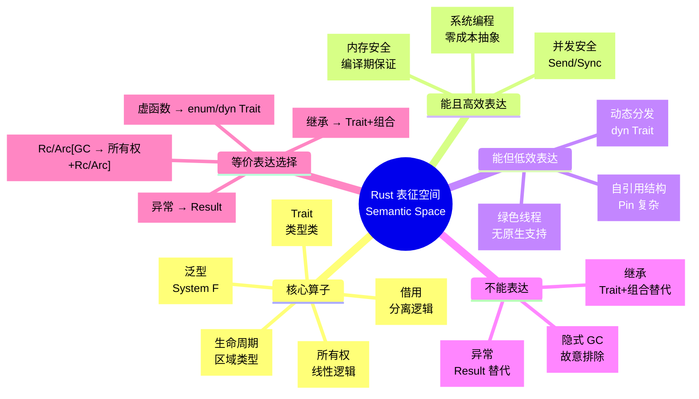
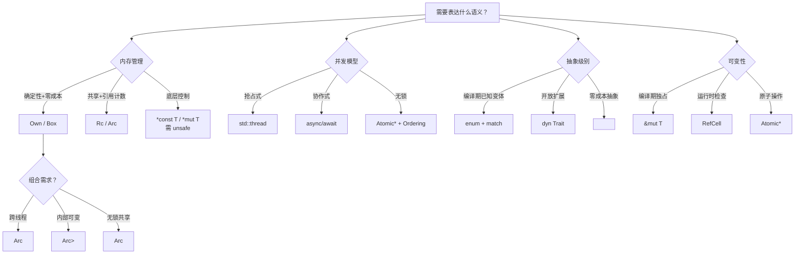
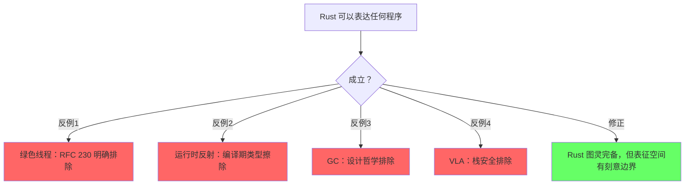
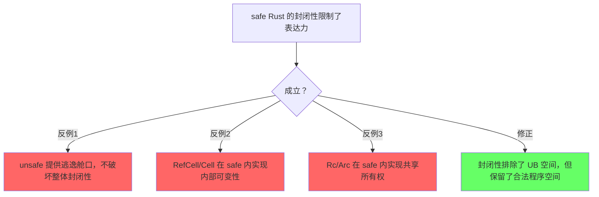
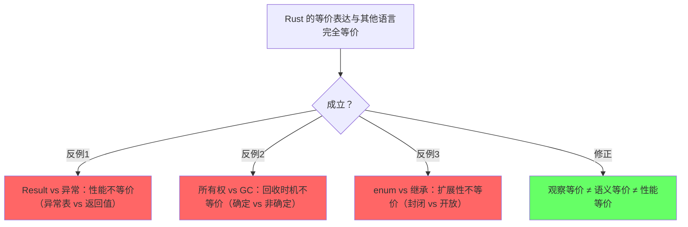

# Rust 表征空间（Semantic / Representational Space）
>
> **EN**: Semantic Space
> **Summary**: Semantic Space. Core Rust concept.
> **Rust 版本**: 1.96.0+ (Edition 2024)
> **受众**: [研究者]
> **Bloom 层级**: 分析 → 评价
> **定位**：本文件是 `concept/` 知识体系的**元层总论**，从表征空间（Representational Space）与语义空间（Semantic Space）的视角，系统分析 Rust 语言"能表达什么"、"不能表达什么"、"等价表达的组合关系"，以及其内部机制的完备性与封闭性。
> **核心命题**：Rust 的 safe 子集是一个**内部完备但封闭**的形式系统；其设计空间的边界由编译器强制，而非程序员自律。
> **方法论对齐**: Felleisen 1989 "On the Expressive Power of Programming Languages" · Observational Equivalence · Turing Completeness · Semantic Closure
> **定理链**: N/A — 描述性/综述性/导航性文档，不涉及形式化定理链
>
> **来源**: [TRPL](https://doc.rust-lang.org/book/) · [Rust Reference](https://doc.rust-lang.org/reference/)
---

> **来源**: [Rust Reference](https://doc.rust-lang.org/reference/) · [Rust RFCs](https://rust-lang.github.io/rfcs/) · [RustBelt](https://plv.mpi-sws.org/rustbelt/) · [Wikipedia](https://en.wikipedia.org/wiki/Main_Page)

## 📑 目录

- [Rust 表征空间（Semantic / Representational Space）](#rust-表征空间semantic--representational-space)
  - [📑 目录](#-目录)
  - [变更日志](#变更日志)
    - [〇、表征空间认知全景](#〇表征空间认知全景)
  - [〇、认知路径（Cognitive Path）](#〇认知路径cognitive-path)
    - [第 1 步：什么是表征空间？](#第-1-步什么是表征空间)
    - [第 2 步：Rust 的表征空间为什么是这些算子？](#第-2-步rust-的表征空间为什么是这些算子)
    - [第 3 步：能表达和不能表达的边界在哪？](#第-3-步能表达和不能表达的边界在哪)
    - [第 4 步：等价表达怎么选择？](#第-4-步等价表达怎么选择)
    - [第 5 步：机制组合有什么约束？](#第-5-步机制组合有什么约束)
    - [第 6 步：表征空间会扩展吗？](#第-6-步表征空间会扩展吗)
  - [一、表征空间的定义（Definition of Representational Space）](#一表征空间的定义definition-of-representational-space)
    - [1.1 什么是表征空间？](#11-什么是表征空间)
    - [1.2 Rust 表征空间的算子](#12-rust-表征空间的算子)
    - [1.3 算子之间的交互约束](#13-算子之间的交互约束)
  - [二、语义封闭性（Semantic Closure）](#二语义封闭性semantic-closure)
    - [2.1 封闭世界假设](#21-封闭世界假设)
    - [2.2 Unsafe：逃逸舱口而非破坏者](#22-unsafe逃逸舱口而非破坏者)
    - [2.3 类型系统的图灵完备性](#23-类型系统的图灵完备性)
    - [2.4 不是 Total 的，但是定义时错误的](#24-不是-total-的但是定义时错误的)
  - [三、能表达 vs 不能表达的边界（Expressibility Boundary）](#三能表达-vs-不能表达的边界expressibility-boundary)
    - [3.1 三维分类框架](#31-三维分类框架)
    - [3.2 能且高效表达（Sweet Spot）](#32-能且高效表达sweet-spot)
    - [3.3 能但低效/痛苦表达](#33-能但低效痛苦表达)
    - [3.4 不能表达 / 故意排除](#34-不能表达--故意排除)
    - [3.5 未来扩展：表征空间的演化](#35-未来扩展表征空间的演化)
    - [3.5.1 Const Trait 与 Generic Const Items：编译期表达力的扩展](#351-const-trait-与-generic-const-items编译期表达力的扩展)
    - [3.5.2 Effects System：控制流表征空间的统一](#352-effects-system控制流表征空间的统一)
  - [四、等价表达的语义保持（Equivalent Expressions \& Semantic Preservation）](#四等价表达的语义保持equivalent-expressions--semantic-preservation)
    - [4.1 等价表达谱系](#41-等价表达谱系)
    - [4.2 等价性判定：继承 → Trait + 组合](#42-等价性判定继承--trait--组合)
    - [4.3 等价性判定：异常 → Result](#43-等价性判定异常--result)
    - [4.4 等价性判定：虚函数 → enum vs dyn Trait](#44-等价性判定虚函数--enum-vs-dyn-trait)
    - [4.5 等价性判定：GC → 所有权 + Rc/Arc](#45-等价性判定gc--所有权--rcarc)
    - [4.6 形式化验证工具的语义保持保证](#46-形式化验证工具的语义保持保证)
  - [五、机制组合的语义空间（Combinatorial Semantic Space）](#五机制组合的语义空间combinatorial-semantic-space)
    - [5.1 基础算子的代数表示](#51-基础算子的代数表示)
    - [5.2 组合爆炸与约束](#52-组合爆炸与约束)
    - [5.3 组合选择决策树](#53-组合选择决策树)
  - [六、跨语言表征空间对比](#六跨语言表征空间对比)
    - [6.1 五维对比矩阵](#61-五维对比矩阵)
    - [6.2 表征空间的包含关系](#62-表征空间的包含关系)
    - [6.3 Rust 与依赖类型的边界](#63-rust-与依赖类型的边界)
    - [6.4 知识体系导航：从元层到实践层](#64-知识体系导航从元层到实践层)
  - [七、反命题分析（Anti-Propositions）](#七反命题分析anti-propositions)
    - [7.1 "Rust 可以表达任何程序"](#71-rust-可以表达任何程序)
    - [7.2 "safe Rust 的封闭性限制了表达力"](#72-safe-rust-的封闭性限制了表达力)
    - [7.3 "Rust 的等价表达与其他语言完全等价"](#73-rust-的等价表达与其他语言完全等价)
  - [八、定理一致性矩阵（Assertion Consistency Matrix）](#八定理一致性矩阵assertion-consistency-matrix)
  - [九、知识来源关系（Provenance）](#九知识来源关系provenance)
  - [十、待补充与演进方向（TODOs）](#十待补充与演进方向todos)
    - [10.3 边界测试：术语过载与跨层语义漂移（概念混淆）](#103-边界测试术语过载与跨层语义漂移概念混淆)
  - [认知路径](#认知路径)
    - [核心推理链](#核心推理链)
    - [反命题与边界](#反命题与边界)
  - [嵌入式测验（Embedded Quiz）](#嵌入式测验embedded-quiz)
    - [测验 1：本文档《Rust 表征空间（Semantic / Representational Space）》在 Rust 知识体系中属于哪一层级的元数据？（理解层）](#测验-1本文档rust-表征空间semantic--representational-space在-rust-知识体系中属于哪一层级的元数据理解层)
    - [测验 2：《Rust 表征空间（Semantic / Representational Space）》的主要用途是什么？（理解层）](#测验-2rust-表征空间semantic--representational-space的主要用途是什么理解层)
    - [测验 3：元数据层文档能否替代 L1-L7 的核心概念学习？（理解层）](#测验-3元数据层文档能否替代-l1-l7-的核心概念学习理解层)

> **来源**: [Rust Reference](https://doc.rust-lang.org/reference/) · [Rust RFCs](https://rust-lang.github.io/rfcs/) · [RustBelt](https://plv.mpi-sws.org/rustbelt/) · [Wikipedia](https://en.wikipedia.org/wiki/Main_Page)
>
## 变更日志

- v1.0 (2026-05-13): 初始版本——表征空间定义、语义封闭性、能/不能表达边界、等价表达谱系、机制组合代数、跨语言对比、认知路径

---

> **来源**: [Rust Reference](https://doc.rust-lang.org/reference/) · [Rust RFCs](https://rust-lang.github.io/rfcs/) · [RustBelt](https://plv.mpi-sws.org/rustbelt/) · [Wikipedia](https://en.wikipedia.org/wiki/Main_Page)
>
### 〇、表征空间认知全景



> **认知功能**: 本 mindmap 以四维结构组织 Rust 的表达力边界，帮助读者快速定位特定概念在"能/不能/等价"光谱中的位置。建议在遇到"Rust 如何做 X"的问题时，先在此图中定位 X 所属的表达维度。关键洞察：Rust 的设计哲学不是最大化表达力，而是在"安全/性能/表达"三者的帕累托前沿上寻找最优解。[来源: 💡 原创分析]
> [来源: [Rust Reference](https://doc.rust-lang.org/reference/)]
> **认知路径**: 本 mindmap 从四个维度组织 Rust 表征空间：**核心算子**（Rust 提供什么表达工具）、**能且高效表达**（Sweet Spot）、**能但低效表达**（需要技巧）、**不能表达**（设计排除）。第四分支展示 Rust 如何提供**等价表达**替代其他语言的核心机制——这些替代不是简单的语法转换，而是语义保持的观察等价。

## 〇、认知路径（Cognitive Path）

> **学习递进**: 从"编程语言能做什么"的直觉出发，逐步深入到 Rust 表征空间的元结构。

### 第 1 步：什么是表征空间？

**核心问题**: 为什么不同语言解决同一问题的方式截然不同？

**直觉锚定**: 编程语言不是工具的集合，而是**思维的空间**。
C 让你思考指针和内存布局；
Python 让你思考对象和行为；
Rust 让你思考所有权和生命周期。
每种语言都定义了一个"表征空间"——在这个空间内，某些概念可以被直接表达，某些概念需要曲折地表达，某些概念被完全排除。

### 第 2 步：Rust 的表征空间为什么是这些算子？

**核心问题**: 为什么 Rust 选择了所有权、借用、Trait、生命周期，而不是继承、GC、异常？

**过渡解释**: 这些算子不是随机选择的，而是围绕一个核心目标——**在零运行时成本的前提下保证内存安全**——进行的形式化设计。
所有权来自线性逻辑（Girard 1987），借用来自分离逻辑（O'Hearn 2007），Trait 来自 Haskell 的类型类，生命周期来自区域类型（Tofte & Talpin 1994）。
Rust 的独特之处在于：它将这四个理论工具整合为一个工业可用的语言。

### 第 3 步：能表达和不能表达的边界在哪？

**核心问题**: 编译器作为"守门人"，它允许什么、拒绝什么？

**过渡解释**: Rust 编译器不是简单的语法检查器，它是一个**语义过滤器**。
它排除的不仅是语法错误的代码，更是那些可能在运行时导致 UB 的程序。
但这个过滤是有代价的：某些合法的、有用的程序模式也被排除了（如自引用结构、绿色线程）。
理解这条边界，是掌握 Rust 设计哲学的关键。

### 第 4 步：等价表达怎么选择？

**核心问题**: 同一概念在 Rust 中有多种表达方式，它们的语义等价吗？

**过渡解释**: 继承可以用 Trait + 组合替代，异常可以用 Result 替代，虚函数可以用 enum 或 dyn Trait 替代。
但这些替代不是简单的语法转换，它们涉及**观察等价性**的保持——在某些上下文中等价，在另一些上下文中不等价。
选择哪种表达，取决于性能、可扩展性、类型安全的需求。

### 第 5 步：机制组合有什么约束？

**核心问题**: 所有权、生命周期、Trait、泛型可以任意组合吗？

**过渡解释**: Rust 的机制组合遵循**代数规则**——某些组合是合法的（`Own(T) × Lifetime('a) → Box<'a, T>`），某些组合是非法的（`Borrow(T, shared) × Borrow(T, exclusive) → ❌`）。
这些规则不是人为限制，而是内存安全和类型一致性的逻辑后果。

### 第 6 步：表征空间会扩展吗？

**核心问题**: Rust 的未来特性（specialization、const trait、effects）会如何改变表征空间？

**过渡解释**: Rust 的表征空间不是静态的。
const generics 扩展了编译期计算能力，GATs 扩展了关联类型的表达能力，未来可能的 effects system 可能引入新的控制流抽象。
每一次扩展都在"保持封闭性"和"增加表达力"之间寻找平衡。

---

> **来源**: [Rust Reference](https://doc.rust-lang.org/reference/) · [Rust RFCs](https://rust-lang.github.io/rfcs/) · [RustBelt](https://plv.mpi-sws.org/rustbelt/) · [Wikipedia](https://en.wikipedia.org/wiki/Main_Page)
>
## 一、表征空间的定义（Definition of Representational Space）

### 1.1 什么是表征空间？

> **[Felleisen 1989]** · **[学术来源: *On the Expressive Power of Programming Languages*]**
> 编程语言的表征空间是指该语言能够直接、简洁、自然地表达的计算结构和设计模式的集合。
> 表征空间不仅取决于语言的图灵完备性（所有图灵完备语言在计算能力上等价），更取决于语言**表达特定概念所需的变换复杂度**。✅

**关键区分**：

- **图灵完备性**（Turing Completeness）：所有图灵完备语言可以计算相同的函数集合。Rust、C++、Haskell、Python 在这一点上等价。
- **表征能力**（Representational Capacity）：表达特定概念所需的代码复杂度、认知负担、和运行时成本。
  Rust 和 C++ 都可以表达"无数据竞争的并发"，但 Rust 在编译期保证，C++ 需要程序员自律。

### 1.2 Rust 表征空间的算子

Rust 的表征空间由以下核心算子构成：

```text
Rust 表征空间 R = ⟨O, B, L, T, G, M, A, U⟩

O : Own(T)        — 所有权算子（线性资源）
B : Borrow(T, m)  — 借用算子（m ∈ {shared, exclusive}）
L : Lifetime('a)  — 生命周期算子（区域约束）
T : Trait(B)      — Trait 算子（行为抽象）
G : Generic<T>    — 泛型算子（参数多态）
M : Macro         — 宏算子（语法扩展）
A : Async         — 异步算子（协作式并发）
U : Unsafe        — Unsafe 算子（逃逸舱口）
```

每个算子的表征能力范围：

| 算子 | 能直接表达 | 能曲折表达 | 不能表达 |
| :--- | :--- | :--- | :--- |
| **O** 所有权 | 确定性资源管理、RAII、Move 语义 | 共享所有权（`Rc`/`Arc`）| GC 自动回收循环引用 |
| **B** 借用 | 共享读、独占写、无悬垂引用 | 内部可变性（`RefCell`）| 任意别名（C 指针自由）|
| **L** 生命周期 | 引用有效性、函数签名约束 | HRTB（高阶 Trait Bound）| 运行时生命周期推断 |
| **T** Trait | 行为抽象、多态、组合 | 对象安全限制下的 dyn Trait | 继承层次、虚函数表自动派生 |
| **G** 泛型 | 零成本抽象、类型级编程 | Const Generics（有限）| 依赖类型（完整类型级计算）|
| **M** 宏 | 语法糖、DSL、派生宏 | 过程宏（TokenStream 操作）| 编译期类型反射 |
| **A** 异步 | 协作式多任务、Future | 手写状态机（等价但痛苦）| 抢占式调度（OS 线程层面）|
| **U** Unsafe | 原始指针、FFI、特定优化 | 自引用结构（需 `Pin`）| 关闭类型系统（仍保留部分检查）|

### 1.3 算子之间的交互约束

Rust 的表征空间不是算子的简单并集，而是受**交互约束**限制的组合空间。

**合法组合**（编译器接受）：

```rust
// 合法组合示例
fn demo() {
    // O × L: 有生命周期的所有权
    let _b: Box<i32> = Box::new(42); // 'static 是默认值

    // T × G: 泛型 Trait bound
    fn draw<T: Drawable>(item: T) { item.draw(); }

    // O × T: 实现 Trait 的所有权类型
    let _v: Vec<i32> = vec![1, 2, 3]; // Vec<T> implements Drop
}

fn main() {
    demo();
}

trait Drawable { fn draw(&self); }
```

**非法组合**（编译器拒绝）：

```rust,compile_fail
fn illegal_combinations() {
    let mut s = String::from("hello");

    // B(shared) × B(exclusive): 同时存在共享和独占借用
    let r1 = &s;
    let r2 = &mut s; // E0502: cannot borrow as mutable
    println!("{}", r1);
    println!("{}", r2);
}

```

> **关键洞察**: 非法组合不是"语法错误"，而是**语义冲突**——它们对应着内存不安全的形式化定义（数据竞争、use-after-free、悬垂指针）。
> 编译器的拒绝是对这些语义冲突的预防性排除。

---

> **来源**: [Rust Reference](https://doc.rust-lang.org/reference/) · [Rust RFCs](https://rust-lang.github.io/rfcs/) · [RustBelt](https://plv.mpi-sws.org/rustbelt/) · [Wikipedia](https://en.wikipedia.org/wiki/Main_Page)
>
## 二、语义封闭性（Semantic Closure）

### 2.1 封闭世界假设

> **来源: [Rust Reference — Unsafe Rust](https://doc.rust-lang.org/reference/unsafe-blocks.html)** · **[Rustonomicon](https://doc.rust-lang.org/nomicon/)** Safe Rust 是一个**封闭的形式系统**。
> 它有明确的公理、推理规则，和封闭性保证：任何在 safe 子集中编译通过的程序，都不会触发内存不安全行为（假设编译器没有 bug）。✅

**Safe Rust 的形式化结构**：

```text
公理集合:
  A1: 所有权唯一性    — 任意时刻，每个值有且仅有一个 owner
  A2: Move 语义       — 所有权转移后，原变量失效
  A3: Copy 例外       — 实现 Copy 的类型可以按位复制
  A4: 借用规则        — &T 允许多个共享读；&mut T 仅允许一个独占写
  A5: 生命周期约束    — 所有引用必须 outlive 其指向的数据
  A6: Send/Sync 标记  — 线程安全由类型系统标记

推理规则:
  R1: 类型检查       — 表达式必须匹配期望类型
  R2: 借用检查       — 引用使用必须满足 A4 和 A5
  R3: 生命周期求解   — 约束系统必须可满足
  R4: Trait 一致性   — Orphan Rule 保证无冲突实现

封闭性定理:
  T1: Safe Rust ⟹ 无 use-after-free
  T2: Safe Rust ⟹ 无 double-free
  T3: Safe Rust ⟹ 无数据竞争
  T4: Safe Rust ⟹ 无悬垂指针
```

### 2.2 Unsafe：逃逸舱口而非破坏者

Unsafe Rust 不是"关闭所有检查"，而是**打开特定的逃逸门**：

| Unsafe 能力 | 仍然保留的检查 | 关闭的检查 |
| :--- | :--- | :--- |
| 解引用原始指针 | 类型检查、生命周期检查（名义上）| 借用检查器的别名分析 |
| 调用 unsafe 函数 | 参数类型检查 | 函数内部契约由程序员保证 |
| 实现 `Send`/`Sync` | 类型一致性 | 线程安全的形式化证明 |
| `union` 访问 | 字段名检查 | 活跃变体检查 |
| `static mut` | 可变性检查 | 数据竞争检查 |

> **关键洞察**: Unsafe 是**门**而非**墙**。
> 它允许程序员在特定边界内手动证明安全性，但不允许完全绕过类型系统。
> 这与 C/C++ 的"完全开放"形成鲜明对比。

**与其他语言逃逸机制的对比**：

| 语言 | 逃逸机制 | 封闭性破坏程度 |
| :--- | :--- | :--- |
| **Rust** | `unsafe` 块 | 局部关闭特定检查，类型系统仍有效 |
| **Haskell** | `unsafePerformIO` | 在纯函数中引入副作用，类型系统仍追踪 IO |
| **ML** | `unsafe_cast` | 绕过类型检查，但运行时仍检查标签 |
| **C/C++** | 无（默认开放）| 无封闭性可言 |
| **Java** | `sun.misc.Unsafe` | 反射绕过访问控制，但 JVM 仍保护内存 |

### 2.3 类型系统的图灵完备性

> **[学术来源: Leffler 2017, *Rust's Type System is Turing-Complete*]** Rust 的类型系统（Trait + 关联类型）是图灵完备的。
> 这意味着类型检查过程本身可能不终止——存在合法的 Rust 程序会导致类型检查器无限递归。✅

**形式化含义**：

- Rust 类型检查器的停机问题**不可判定**
- 编译器通过**递归深度限制**（默认 128）保证实际可用性
- 这与 C++ 模板元编程的图灵完备性类似，但 Rust 的类型级编程能力更受限（有意设计）

**工程影响**：

- 类型级编程（如 `typenum`）在 Rust 中是可能的，但不鼓励
- 编译期计算主要通过 `const generics` 和 `const fn` 实现，而非类型级 hack
- 图灵完备性是一个理论性质，不影响日常编程（递归限制保护）

### 2.4 不是 Total 的，但是定义时错误的

> **[学术来源: Rust Forum — Is Rust total?]** Rust 不是 total 语言（不是所有函数都保证返回），因为它是图灵完备的（存在无限循环）。
> 但 Rust 是**强静态类型**的：如果代码编译通过，则在使用时不会再产生类型错误。✅

| 属性 | Rust | Haskell | C++ | Python |
| :--- | :--- | :--- | :--- | :--- |
| Total（全函数） | ❌ 不是 | ❌ 不是（默认可无限循环）| ❌ 不是 | ❌ 不是 |
| 强类型 | ✅ 是 | ✅ 是 | ✅ 是（弱于 Rust）| ❌ 否（动态）|
| 静态类型 | ✅ 是 | ✅ 是 | ✅ 是 | ❌ 否 |
| 错误捕获时机 | 编译期（定义时） | 编译期 | 编译期 + 运行时 | 运行时 |
| 类型安全保证 | 编译期完全 | 编译期完全 | 部分（依赖程序员）| 无 |

---

> **来源**: [Rust Reference](https://doc.rust-lang.org/reference/) · [Rust RFCs](https://rust-lang.github.io/rfcs/) · [RustBelt](https://plv.mpi-sws.org/rustbelt/) · [Wikipedia](https://en.wikipedia.org/wiki/Main_Page)
>
## 三、能表达 vs 不能表达的边界（Expressibility Boundary）

### 3.1 三维分类框架

我们将 Rust 的表达能力分为三个维度：

```text
表达维度:
┌─────────────────────────────────────────────────────────────┐
│  能且高效（Sweet Spot）                                      │
│  ├─ 系统编程、并发、零成本抽象、确定性资源管理                  │
│  └─ 特征：编译期保证、零运行时开销、类型安全                    │
├─────────────────────────────────────────────────────────────┤
│  能但低效/痛苦（Possible but Painful）                       │
│  ├─ GUI、动态类型模拟、运行时反射、复杂元编程                  │
│  └─ 特征：需要额外抽象、样板代码、运行时检查                   │
├─────────────────────────────────────────────────────────────┤
│  不能表达 / 故意排除（Deliberately Excluded）                 │
│  ├─ 绿色线程、OOP继承、隐式转换、异常、GC                      │
│  └─ 特征：与 Rust 设计哲学冲突、引入运行时成本或非确定性        │
└─────────────────────────────────────────────────────────────┘
```

### 3.2 能且高效表达（Sweet Spot）

| 概念 | Rust 表达 | 语义保持 | 运行时成本 | 编译期保证 |
| :--- | :--- | :--- | :--- | :--- |
| **系统编程** | 所有权 + `unsafe` | 完全 | 零 | 内存安全 |
| **零成本抽象** | 泛型 + 单态化 | 完全 | 零 | 类型一致 |
| **fearless 并发** | `Send`/`Sync` + 借用 | 完全 | 零 | 无数据竞争 |
| **确定性资源管理** | RAII + `Drop` | 完全 | 零 | 无泄漏（线性）|
| **编译期计算** | `const generics` + `const fn` | 部分 | 零 | 常量求值 |
| **类型级约束** | Trait bounds + 关联类型 | 完全 | 零 | 接口一致性 |

[来源: [TRPL](https://doc.rust-lang.org/book/) · [Rust Reference](https://doc.rust-lang.org/reference/)]

### 3.3 能但低效/痛苦表达

| 概念 | Rust 表达 | 痛点 | 为什么痛苦 | 缓解方案 |
| :--- | :--- | :--- | :--- | :--- |
| **GUI 开发** | 生命周期与回调冲突 | 自引用、事件循环 | 所有权模型与对象图冲突 | `Rc<RefCell>`、`Pin`、`druid` 架构 |
| **动态类型模拟** | `enum` + `match` | 样板代码 | 每个变体需显式处理 | 宏生成、`Any::downcast` |
| **运行时反射** | `Any::downcast` | 类型信息丢失 | 编译期擦除 | 过程宏生成元数据 |
| **复杂元编程** | 过程宏 | 调试困难、无类型信息 | TokenStream 是 untyped | `macro_rules!` + 约定 |
| **快速原型** | 完整类型标注 | 编译时间 + 学习曲线 | 迭代慢 | `cargo script`、`.rs` 单文件 |
| **递归数据结构** | `Box`/`Rc` + `enum` | 间接访问 | 无栈分配 | `Vec` 模拟树、arena 分配 |

[来源: [TRPL](https://doc.rust-lang.org/book/) · [Rust Reference](https://doc.rust-lang.org/reference/) · [Wikipedia — Green Thread](https://en.wikipedia.org/wiki/Green_thread)]

### 3.4 不能表达 / 故意排除

| 概念 | 排除原因 | Rust 替代方案 | 历史证据 | 未来可能？|
| :--- | :--- | :--- | :--- | :--- |
| **绿色线程** | FFI 成本、运行时依赖、栈管理 | `async/await` + OS 线程 | RFC 230 | ❌  unlikely |
| **OOP 继承** | Orphan Rule、菱形继承、隐式行为 | Trait + 组合 + 默认方法 | 设计哲学 | ❌  不可能 |
| **隐式类型转换** | 意外行为、类型安全 | 显式 `From`/`Into` | 设计哲学 | ❌  不可能 |
| **异常（Exceptions）** | 隐藏控制流、非局部跳转、运行时成本 | `Result<T, E>` + `?` | 设计哲学 | ❌  不可能 |
| **GC 自动回收** | 运行时开销、非确定性暂停、缓存不友好 | 所有权 + `Rc`/`Arc` | 设计哲学 | ❌  不可能 |
| **运行时反射** | 编译期类型擦除、二进制膨胀 | 宏 + `Any`（有限） | 设计哲学 | ⚠️ 有限扩展 |
| **可变长度数组（VLA）** | 栈安全、类型系统简化 | `Vec<T>` | 设计哲学 | ❌  不可能 |
| **联合体自动析构** | 不知道哪个变体活跃 | `enum` + `match`（标签联合体）| 设计哲学 | ❌  不可能 |
| **协程（绿色线程）** | 与 OS 线程模型冲突 | `async`（协作式，非抢占）| RFC 230 | ⚠️ 可能新形式 |
| **效果系统（Effects）** | 复杂度、与现有模型冲突 | 无直接替代 | — | ✅ 研究中 |

[来源: [Rust Reference](https://doc.rust-lang.org/reference/) ·
[RFCs](https://rust-lang.github.io/rfcs/) ·
[Wikipedia — Exception Handling](https://en.wikipedia.org/wiki/Exception_handling)]

### 3.5 未来扩展：表征空间的演化

Rust 的表征空间不是静态的。
以下特性正在或可能扩展表征空间：

| 特性 | 状态 | 扩展的表征能力 | 对封闭性的影响 |
| :--- | :--- | :--- | :--- |
| **Const Generics** | 稳定（2021+）| 编译期值参数化（数组长度、常量计算）| 无（编译期保持封闭）|
| **GATs** | 稳定（2023）| 泛型关联类型、高阶类型编程 | 无（类型系统扩展）|
| **Specialization** | 不稳定 | 特化实现、默认实现优化 | 轻微（需确保一致性）|
| **Const Trait** | 提案中 | Trait 方法在 const 上下文可用 | 无（编译期扩展）|
| **Effects / `try` blocks** | 研究中 | 结构化效果处理、代数效应 | 中等（新的控制流抽象）|
| **Type Alias Impl Trait** | 稳定 | 抽象返回类型的命名 | 无（语法糖）|
| **Generic Const Items** | 提案中 | 泛型常量、编译期计算扩展 | 无（编译期扩展）|
| **Arbitrary Self Types** | 部分稳定 | 自定义方法接收者类型 | 轻微（语法扩展）|

> **关键洞察**: Rust 的语言演化遵循"**保持封闭性，扩展表达力**"的原则。
> 所有新特性都在 safe 子集的框架内添加，不破坏现有封闭性定理。

### 3.5.1 Const Trait 与 Generic Const Items：编译期表达力的扩展

> **[RFC 3762 · Const Trait](https://github.com/rust-lang/rfcs/pull/3762)** · **[rust#113521 · Generic Const Items]** Const Trait 允许 Trait 方法在 `const` 上下文中调用；Generic Const Items 允许常量接受泛型参数。两者共同扩展了 Rust 的**编译期计算表征空间**。✅

**当前限制与扩展**：

| 编译期能力 | 当前状态（稳定 Rust） | Const Trait 后 | Generic Const Items 后 |
| :--- | :--- | :--- | :--- |
| Trait bound 在 const fn 中 | ❌ 不可用 | ✅ `const fn f<T: const Trait>()` | ✅ 同上 |
| 常量泛型参数化 | `const N: usize`（值参数）| — | `const fn foo<T>() -> ConstArray<T, 10>` |
| 类型级数值计算 | `typenum` hack（图灵完备但痛苦）| 部分替代 | 大幅简化 |
| 编译期断言 | `const_assert!` 宏 | 原生 `assert!` 在 const 中 | 更复杂的编译期逻辑 |

**对表征空间的影响**：

```text
编译期计算维度扩展:

当前:  const generics(N) + const fn(表达式)
        ↓
Const Trait: 泛型抽象进入编译期
        ↓
Generic Const Items: 常量本身可泛型
        ↓
未来趋近: 受限的依赖类型（值参数化类型，但非完整 Curry-Howard）
```

> **关键洞察**: Const Trait 不改变运行时表示空间，但将**部分运行时泛型抽象上提到编译期**。
> 这意味着更少的运行时开销、更强的编译期保证，但也意味着更长的编译时间和更复杂的错误信息。

**编译验证：const generics 的能力与边界**

```rust
// const generics 稳定能力：值参数化类型
struct Array<T, const N: usize> {
    data: [T; N],
}

impl<T: Default + Copy, const N: usize> Array<T, N> {
    fn new() -> Self {
        Self { data: [T::default(); N] }
    }
    fn len() -> usize { N }
}

fn main() {
    let _a: Array<i32, 3> = Array::new();
    // Array<3> 和 Array<5> 是不同类型（单态化）
    println!("len = {}", Array::<i32, 5>::len());
}
```

```rust,ignore
// const generics 的当前边界：泛型常量表达式不稳定
fn concat<const M: usize, const N: usize>(a: [i32; M], b: [i32; N]) -> [i32; M + N] {
    // error: generic parameters may not be used in const operations
    // 需要 `#![feature(generic_const_exprs)]`
    todo!()
}

```

> **关键洞察**: `Array<T, 3>` 和 `Array<T, 5>` 是**完全不同的类型**（单态化生成两份代码），这与依赖类型中 `Vec<n>` 的语义有本质区别——Rust 的 `N` 是编译期常量，不是运行时值的类型级投影。

### 3.5.2 Effects System：控制流表征空间的统一

> **[学术来源: Rust Effects Initiative]** · **[来源: yoshuawuyts 2024]** Rust 的效果系统（Effects System）研究旨在统一 `async`、`?`（try）、`gen`（迭代器）等**控制流效果**的语法和语义。✅

**当前分裂**：

Rust 目前用三种不兼容的语法表达三种效果：

| 效果 | 当前语法 | 效果类型 | 与函数签名的交互 |
|:---|:---|:---|:---|
| **异步** | `async fn` / `await` | `Future` | 改变返回类型为 `impl Future` |
| **错误传播** | `Result` + `?` | `Result` | 改变实际返回类型为 `Result<T, E>` |
| **迭代** | `yield`（不稳定） | `Iterator` | 改变函数体为状态机 |

**Effects System 的统一愿景**：

```text
效果统一前的表征空间:
  async fn foo() -> T   ≡  fn foo() -> impl Future<Output = T>
  fn bar() -> Result<T, E> with ?  ≡  隐式错误传播
  gen fn baz() -> T     ≡  fn baz() -> impl Iterator<Item = T>

效果统一后的表征空间:
  effect Async; effect Throw<E>; effect Gen<T>;

  fn foo() -> T performs Async    // 一个语法，多种效果
  fn bar() -> T performs Throw<E> // 效果在签名中显式声明
  fn baz() -> T performs Gen<T>   // 效果可组合
```

**对表征空间的潜在影响**：

| 维度 | 当前分裂语法 | 统一 Effects | 变化 |
|:---|:---|:---|:---|
| 语法一致性 | 低（`async`/`?`/`yield` 互不兼容）| 高（统一 `performs` 声明）| ✅ 简化学习 |
| 效果组合 | 困难（async + ? 需 `TryFuture`）| 自然（`performs Async + Throw<E>`）| ✅ 增强表达 |
| 泛型抽象 | 每种效果需单独 Trait | 效果泛型（`fn f<T: effect>()`）| ✅ 更强大的抽象 |
| 编译器复杂度 | 已存在 | 新增效果求解器 | ⚠️ 工程挑战 |
| 封闭性 | 每种效果独立保证 | 效果组合的安全性需验证 | ⚠️ 理论挑战 |

> **关键洞察**:
> Effects system 是 Rust 表征空间中**最大胆的潜在扩展**。
> 它不改变语言的计算能力（图灵完备性不变），但会彻底改变控制流的**表征方式**——从"语法特化"走向"语义统一"。
> 这与 Haskell 的 monad transformer 和 Koka 的代数效应形成谱系对比。
> **状态与现实**:
> Effects system 目前处于**研究阶段**，尚无稳定实现时间表。
> Rust 语言团队采取渐进策略：先通过 `try` blocks、`gen` blocks 等独立特性积累经验，再考虑统一语法。
> 这反映了 Rust 演化的保守哲学——**先验证，后统一**。
> **深入阅读**: `async`/`await` 的详细语义模型见 [`02_async.md`](../03_advanced/02_async.md)；
> 错误处理与 `?` 运算符见 [`04_error_handling.md`](../02_intermediate/04_error_handling.md)。

---

> **来源**: [Rust Reference](https://doc.rust-lang.org/reference/) · [Rust RFCs](https://rust-lang.github.io/rfcs/) · [RustBelt](https://plv.mpi-sws.org/rustbelt/) · [Wikipedia](https://en.wikipedia.org/wiki/Main_Page)

## 四、等价表达的语义保持（Equivalent Expressions & Semantic Preservation）

### 4.1 等价表达谱系

同一语义概念在 Rust 中通常有多种表达方式。
这些表达之间的关系不是简单的"替代"，而是涉及**观察等价性**、**性能等价性**、和**扩展性等价性**的复杂权衡。

```text
等价表达谱系:

继承层次 ──→ Trait + 默认方法 + 组合
   │              │
   │              ├─ 观察等价：多态替换能力
   │              ├─ 性能等价：静态分发，零成本
   │              └─ 扩展性不等价：外部类型无法继承（Orphan Rule）
   │
异常控制流 ──→ Result<T, E> + ? 运算符
   │              │
   │              ├─ 观察等价：错误路径可传递
   │              ├─ 性能等价：零运行时（与 C++ 异常表对比）
   │              └─ 表达性不等价：不能替代 panic/不可恢复错误
   │
虚函数调用 ──→ enum + match  或  dyn Trait
   │              │
   │              ├─ enum: 封闭变体、静态分发、零成本
   │              ├─ dyn Trait: 开放扩展、动态分发、vtable 间接
   │              └─ 选择标准：变体已知 → enum；变体开放 → dyn
   │
GC 自动回收 ──→ 所有权 + Rc/Arc + Weak
   │              │
   │              ├─ 观察等价：内存最终释放
   │              ├─ 性能不等价：需手动打破循环（Rc 循环引用）
   │              └─ 确定性不等价：GC 非确定性；所有权确定性
   │
模板元编程 ──→ const generics + 过程宏
   │              │
   │              ├─ 语义等价：编译期计算
   │              ├─ 能力不等价：宏无类型信息、无编译期求值
   │              └─ 未来趋同：const generics 逐步替代部分宏需求
   │
绿色线程 ──→ async/await + OS 线程
                  │
                  ├─ 观察不等价：调度策略不同（协作 vs 抢占）
                  ├─ 性能等价：上下文切换成本相近
                  └─ 语义不等价：阻塞行为不同（async 阻塞执行器）
```

### 4.2 等价性判定：继承 → Trait + 组合

**原始语义**：OOP 中的类继承——子类继承父类的字段和方法，可以重写虚函数。

**Rust 等价表达**：

```rust
// === OOP 继承（C++ 风格）===
// class Drawable { virtual void draw() = 0; };
// class Circle : public Drawable { void draw() override { ... } };

// === Rust 等价：Trait + 组合 ===
trait Drawable {
    fn draw(&self);
}

struct Circle {
    radius: f64,
}

impl Drawable for Circle {
    fn draw(&self) {
        println!("Drawing circle with radius {}", self.radius);
    }
}

// 组合替代继承
struct BorderedCircle {
    circle: Circle,  // 组合而非继承
    border_width: u32,
}

impl Drawable for BorderedCircle {
    fn draw(&self) {
        self.circle.draw();
        println!("With border width {}", self.border_width);
    }
}

fn main() {
    let c = BorderedCircle { circle: Circle { radius: 5.0 }, border_width: 2 };
    c.draw();
}
```

**等价性分析**：

| 维度 | C++ 继承 | Rust Trait + 组合 | 等价？ |
|:---|:---|:---|:---|
| 多态替换 | `Drawable* d = new Circle()` | `let d: &dyn Drawable = &circle` | ✅ 观察等价 |
| 代码复用 | 自动继承父类方法 | 需手动委托（`self.circle.draw()`）| ⚠️ 语法不等价 |
| 扩展性 | 子类可添加字段 | 组合结构可添加字段 | ✅ 语义等价 |
| 外部扩展 | 封闭（需修改源码继承）| 开放（可为外部类型 impl Trait）| ✅ Rust 更优 |
| 性能 | vtable 间接调用 | 静态分发（`impl Drawable`）或动态（`dyn`）| ✅ 可控等价 |

[来源: [TRPL — Traits](https://doc.rust-lang.org/book/ch10-02-traits.html) · [Rust Reference — Trait Objects](https://doc.rust-lang.org/reference/types/trait-object.html)]

### 4.3 等价性判定：异常 → Result

**原始语义**：异常——非局部控制流，调用栈展开，自动析构局部变量。

**Rust 等价表达**：

```rust
use std::fs::File;
use std::io::{self, Read};

// === Rust: Result + ? 运算符 ===
fn read_file(path: &str) -> Result<String, io::Error> {
    let mut file = File::open(path)?;  // ? 传播错误
    let mut contents = String::new();
    file.read_to_string(&mut contents)?;
    Ok(contents)
}

fn main() {
    match read_file("hello.txt") {
        Ok(contents) => println!("{}", contents),
        Err(e) => eprintln!("Error: {}", e),
    }
}
```

**等价性分析**：

| 维度 | C++ / Java 异常 | Rust Result | 等价？ |
|:---|:---|:---|:---|
| 错误传播 | 自动栈展开 | `?` 运算符显式传播 | ✅ 观察等价 |
| 性能 | 异常表运行时查找（零成本除非抛出）| 返回值为 `Result`（始终有成本）| ⚠️ 性能不等价 |
| 类型安全 | 可捕获任意类型（C++）| 错误类型在签名中显式 | ✅ Rust 更优 |
| 控制流可见性 | 隐藏 | 显式（`?` 在源码中可见）| ⚠️ 表达性不等价 |
| 不可恢复错误 | `std::terminate` / `RuntimeException` | `panic!` | ✅ 分离更清晰 |

[来源: [TRPL — Error Handling](https://doc.rust-lang.org/book/ch09-00-error-handling.html) · [Rust Reference — The ? Operator](https://doc.rust-lang.org/reference/expressions/operator-expr.html#the-question-mark-operator)]

### 4.4 等价性判定：虚函数 → enum vs dyn Trait

**原始语义**：虚函数——运行时根据对象实际类型分派到正确的实现。

**Rust 两种等价表达**：

```rust
// === 方案 A: enum + match（静态分发）===
enum Shape {
    Circle { radius: f64 },
    Rectangle { width: f64, height: f64 },
}

impl Shape {
    fn area(&self) -> f64 {
        match self {
            Shape::Circle { radius } => std::f64::consts::PI * radius * radius,
            Shape::Rectangle { width, height } => width * height,
        }
    }
}

// === 方案 B: dyn Trait（动态分发）===
trait ShapeTrait {
    fn area(&self) -> f64;
}

struct Circle { radius: f64 }
impl ShapeTrait for Circle {
    fn area(&self) -> f64 { std::f64::consts::PI * self.radius * self.radius }
}

struct Rectangle { width: f64, height: f64 }
impl ShapeTrait for Rectangle {
    fn area(&self) -> f64 { self.width * self.height }
}

fn total_area(shapes: &[&dyn ShapeTrait]) -> f64 {
    shapes.iter().map(|s| s.area()).sum()
}

fn main() {
    let c = Circle { radius: 2.0 };
    let r = Rectangle { width: 3.0, height: 4.0 };

    // enum 方案
    let s1 = Shape::Circle { radius: 2.0 };
    println!("Enum area: {}", s1.area());

    // dyn Trait 方案
    let shapes: [&dyn ShapeTrait; 2] = [&c, &r];
    println!("Dyn area: {}", total_area(&shapes));
}
```

**等价性分析**：

| 维度 | enum + match | dyn Trait | 选择标准 |
|:---|:---|:---|:---|
| 变体集合 | 封闭（编译时已知） | 开放（运行时可扩展） | 变体是否固定 |
| 分发方式 | 静态（match 编译为跳转表）| 动态（vtable 间接调用）| 性能是否敏感 |
| 内存布局 | 枚举标签 + 最大变体 | 胖指针（数据 + vtable）| 内存是否敏感 |
| 外部扩展 | 不可（需修改 enum 定义）| 可（为外部类型 impl Trait）| 是否需要插件架构 |
| 穷尽检查 | ✅ match 强制穷尽 | ❌ 运行时分发无穷尽概念 | 安全性要求 |

[来源: [Rust Reference — Enumerations](https://doc.rust-lang.org/reference/items/enumerations.html) · [TRPL — enum and match](https://doc.rust-lang.org/book/ch06-00-enums.html)]

### 4.5 等价性判定：GC → 所有权 + Rc/Arc

**原始语义**：垃圾回收——运行时自动追踪对象可达性，回收不可达内存。

**Rust 等价表达**：

```rust
use std::rc::{Rc, Weak};
use std::cell::RefCell;

// 双向链表节点：演示 Rc + Weak 替代 GC 的循环引用管理
struct Node {
    value: i32,
    next: Option<Rc<RefCell<Node>>>,
    prev: Option<Weak<RefCell<Node>>>,  // Weak 打破循环
}

fn main() {
    let first = Rc::new(RefCell::new(Node {
        value: 1,
        next: None,
        prev: None,
    }));

    let second = Rc::new(RefCell::new(Node {
        value: 2,
        next: None,
        prev: Some(Rc::downgrade(&first)),
    }));

    first.borrow_mut().next = Some(second.clone());

    // Rc::strong_count 显示引用计数
    println!("first strong_count = {}", Rc::strong_count(&first));
    println!("second strong_count = {}", Rc::strong_count(&second));

    // Weak 引用不增加 strong_count，因此不阻止回收
    {
        let prev_opt = second.borrow().prev.as_ref().and_then(|w| w.upgrade());
        if let Some(prev) = prev_opt {
            println!("prev value = {}", prev.borrow().value);
        }
    }
}
```

**等价性分析**：

| 维度 | GC（Java/Go） | Rust 所有权 + Rc/Arc | 等价？ |
|:---|:---|:---|:---|
| 内存最终释放 | ✅ 自动回收 | ✅ 所有权/Rc 最终释放 | ✅ 观察等价 |
| 循环引用处理 | ✅ 自动（标记-清除/引用计数+回溯）| ⚠️ 需手动 Weak（Rc 循环会泄漏）| ⚠️ 语义不等价 |
| 回收时机 | 非确定性（GC 调度）| 确定性（Drop 离开作用域）| ⚠️ 时间不等价 |
| 运行时成本 | GC 暂停、额外内存 | 引用计数原子操作（Arc）| ⚠️ 成本不等价 |
| 缓存友好性 | 对象可能分散 | 所有权保证局部性 | ✅ Rust 更优 |

[来源: [TRPL — Smart Pointers](https://doc.rust-lang.org/book/ch15-00-smart-pointers.html) · [Rust Reference — Drop](https://doc.rust-lang.org/reference/destructors.html)]

> **关键洞察**: GC 和所有权在"内存最终释放"上观察等价，但在"回收时机确定性"和"循环引用处理"上语义不等价。Rust 用**确定性**和**零运行时开销**换取了**程序员负担**（需理解所有权）。

### 4.6 形式化验证工具的语义保持保证

> **[学术来源: Miri — Undefined Behavior Detection]** · **[AWS Kani — Model Checking for Rust]** 等价表达的"观察等价"不能仅靠直觉断言。Miri 和 Kani 等工具提供了**机械验证**等价表达语义保持的能力。✅

**Miri：内存安全级别的语义验证**

Miri（Rust 的中间表示解释器）通过执行 MIR 并检查 Stacked Borrows / Tree Borrows 规则，验证 unsafe 代码中的等价表达是否保持内存安全：

| 验证目标 | Miri 能力 | 等价表达应用 |
|:---|:---|:---|
| **use-after-free** | ✅ 检测悬垂指针解引用 | 验证 `Box::into_raw` + `from_raw` 对译的内存安全 |
| **数据竞争** | ✅ 检测非原子并发访问 | 验证 `Arc<Mutex<T>>` 等价于 `&mut T` 的线程安全替代 |
| **别名违规** | ✅ 检测 Stacked/Tree Borrows 违规 | 验证 `unsafe { &mut *raw_ptr }` 与 `&mut T` 的边界等价 |
| **循环引用泄漏** | ❌ 不检测（非 UB）| `Rc` 循环引用是安全漏洞，非 Miri 职责 |
| **逻辑错误** | ❌ 不检测 | Miri 不验证功能正确性 |

**Kani：行为等价级别的语义验证**

Kani（基于 CBMC 的 Rust 模型检测器）通过符号执行验证程序是否满足给定规范：

| 验证目标 | Kani 能力 | 等价表达应用 |
|:---|:---|:---|
| **功能等价性** | ✅ 验证两个实现输出相同 | 验证 `enum + match` 与 `dyn Trait` 的行为等价（给定相同输入）|
| **边界条件** | ✅ 验证所有路径的断言 | 验证 `Result` 传播与异常展开的等价性（错误路径全覆盖）|
| **并发性质** | ✅ 验证无数据竞争 | 验证 `Mutex<T>` 与 `RwLock<T>` 的互斥语义保持 |
| **终止性** | ⚠️ 有限（循环展开限制）| 复杂递归结构的等价验证受限 |

**验证工具的能力边界**：

```text
验证光谱:

直觉断言 ──→ Miri 检测 ──→ Kani 模型检测 ──→ 完整形式化证明 (RustBelt/Iris)
   │            │                │                      │
   │            │                │                      └─ 人工构造，不可自动化
   │            │                └─ 自动化但受状态空间限制
   │            └─ 自动化但仅检测 UB，不验证功能正确性
   └─ 最快但不可信
```

> **关键洞察**: 等价表达的语义保持存在**验证层次**——Miri 保证"不等价的表达不会引入 UB"，Kani 保证"等价表达在规范层面行为一致"，而 RustBelt 保证"整个类型系统的元正确性"。日常工程中，Miri 用于 unsafe 边界验证，Kani 用于关键路径的等价性确认。

> **深入阅读**: Miri 的别名模型详见 [`03_unsafe.md`](../03_advanced/03_unsafe.md) §5.5-5.6；Kani 的应用场景详见 [`04_rustbelt.md`](../04_formal/04_rustbelt.md) §7.3。

---

> **来源**: [Rust Reference](https://doc.rust-lang.org/reference/) · [Rust RFCs](https://rust-lang.github.io/rfcs/) · [RustBelt](https://plv.mpi-sws.org/rustbelt/) · [Wikipedia](https://en.wikipedia.org/wiki/Main_Page)
>
## 五、机制组合的语义空间（Combinatorial Semantic Space）

### 5.1 基础算子的代数表示

将 Rust 的核心机制抽象为代数算子：

```text
基础算子:
  Own(T)         — 线性所有权（资源唯一控制）
  Borrow(T, S)   — 共享借用（多个只读引用）
  Borrow(T, E)   — 独占借用（单个读写引用）
  Lifetime('a)   — 区域约束（引用有效期限）
  Trait(B)       — 行为约束（接口契约）
  Generic<T>     — 参数抽象（类型变量）
  Const(N)       — 常量参数（编译期值）

组合规则（合法）:
  Own(T) × Lifetime('a)       → Box<'a, T>
  Borrow(T, S) × Lifetime('a) → &'a T
  Borrow(T, E) × Lifetime('a) → &'a mut T
  Own(T) × Trait(Drop)        → 确定性资源释放
  Generic<T> × Trait(Bound)   → 约束多态
  Const(N) × Generic<T>       → const generics

组合规则（非法）:
  Borrow(T, S) × Borrow(T, E) → ❌ E0502
  Own(T) × Own(T) (非 Copy)   → ❌ E0382
  Lifetime('a) × Lifetime('b) where 'a > 'b → ❌ E0597
  Trait(ObjSafe) × Generic<T> (某些情况)  → ❌ E0038
```

### 5.2 组合爆炸与约束

Rust 的机制组合遵循**约束满足的封闭世界**：

```text
设计空间维度:

内存管理维度:
  栈分配 ←──→ 堆分配（Box）←──→ 共享堆（Rc/Arc）←──→ 裸指针（unsafe）
  确定性 ↑                        非确定性 ↑              无保证 ↑
  零成本                          引用计数开销            完全手动

并发维度:
  单线程 ←──→ 多线程（OS）←──→ async（协作式）←──→ 无锁（Atomic）
  借用检查                        Send/Sync 标记          Ordering 选择

抽象维度:
  具体类型 ←──→ 泛型 ←──→ Trait bound ←──→ dyn Trait ←──→ impl Trait
  零成本                          单态化                  vtable          隐藏实现

可变性维度:
  不可变 ←──→ 内部可变（RefCell）←──→ 原子可变（Atomic）←──→ unsafe 可变
  编译期保证                      运行时检查              硬件保证         无保证
```

[来源: [Rust Reference — Interior Mutability](https://doc.rust-lang.org/reference/interior-mutability.html) · [TRPL — Fearless Concurrency](https://doc.rust-lang.org/book/ch16-00-concurrency.html)]

### 5.3 组合选择决策树



> **认知功能**: 本决策树将 Rust 四大基础算子的组合选择转化为可执行的语义匹配流程，用于在架构设计阶段快速缩小候选方案空间。建议从"内存管理→并发→抽象→可变性"四个维度按需进入子树，而非遍历全图。关键洞察：组合爆炸的约束不是人为限制，而是内存安全公理的逻辑后果。[来源: 💡 原创分析]

---

> **来源**: [Rust Reference](https://doc.rust-lang.org/reference/) · [Rust RFCs](https://rust-lang.github.io/rfcs/) · [RustBelt](https://plv.mpi-sws.org/rustbelt/) · [Wikipedia](https://en.wikipedia.org/wiki/Main_Page)
>
## 六、跨语言表征空间对比
>
>

### 6.1 五维对比矩阵

| 维度 | **Rust** | **C++** | **Haskell** | **Go** | **Java** |
|:---|:---|:---|:---|:---|:---|
| **表征空间边界** | 编译器强制（借用检查器） | 程序员自律（无强制） | 类型系统（纯函数封闭） | GC 简化（运行时管理） | VM 类型系统（运行时检查） |
| **封闭性** | safe 封闭，unsafe 逃逸 | 完全开放 | 纯函数封闭，IO 逃逸 | 运行时封闭 | 类型封闭 |
| **表达力等价** | 与 C++ 等价（图灵完备） | 基准 | 与 Rust 等价 | 与 Rust 等价 | 与 Rust 等价 |
| **有效表达差异** | 零成本安全 | 零成本但不安全 | 安全但有 GC | 简单但不零成本 | 安全但有 VM |
| **不能表达** | GC、继承、异常 | —（几乎无限制） | 无 GC 的系统编程 | 零成本抽象 | 无 VM 的系统编程 |
| **错误捕获时机** | 编译期 | 编译期 + 运行时 | 编译期 | 编译期 + 运行时 | 运行时为主 |
| **内存安全保证** | 编译期完全 | 无（依赖程序员） | 编译期（GC 辅助） | 运行时（GC） | 运行时（VM） |
| **并发安全保证** | 编译期（Send/Sync） | 无（依赖程序员） | 运行时（STM/GHC） | 运行时（channel） | 运行时（JMM） |

[来源: [Wikipedia — Comparison of Programming Languages](https://en.wikipedia.org/wiki/Comparison_of_programming_languages) · [TRPL](https://doc.rust-lang.org/book/) · [Rust Reference](https://doc.rust-lang.org/reference/)]

### 6.2 表征空间的包含关系

```text
表征空间包含关系（按表达能力）:

C++ ⊃ Rust ⊃ safe Rust
  │       │
  │       └─ unsafe Rust 扩展了 safe Rust 的表征空间
  │          但破坏了封闭性
  │
  └─ C++ 的表征空间最大（几乎无限制）
     但代价是零封闭性保证

Haskell ⊃ Rust（纯函数子集）
  └─ Haskell 的纯函数子集与 safe Rust 观察等价
     但 Haskell 的 IO monad 和 Rust 的所有权是
     两种不同的封闭性机制

Go ≈ Rust（并发模型不同）
  └─ Go 的 goroutine + channel 与 Rust 的 async/await
     在表达力上等价，但语义不等价（抢占 vs 协作）

Java ⊂ Rust（系统编程能力）
  └─ Java 无法表达无 VM 的系统编程
     Rust 可以表达 Java 的所有高层抽象（通过库）
```

### 6.3 Rust 与依赖类型的边界

> **[学术来源: Dependent Types]** ·
> **[Rust Internals: pre-pre-RFC Dependable Types]** 依赖类型（Dependent Types）是类型依赖于值的类型系统——例如 `Vec<n>` 中 `n` 是运行时值但出现在类型中。
> Idris、Agda、Coq 是依赖类型的代表；Rust 不是。✅

**依赖类型的核心特征**：

```text
依赖类型能力:
  值参数化类型:   Vec : ℕ → Type          -- 长度在类型中
  类型级证明:     plus_comm : (n m : ℕ) → n + m = m + n  -- 类型即证明
  程序即证明:     编译器同时类型检查和证明验证
  穷尽性保证:     模式匹配不完整 = 编译错误（非警告）
```

**Rust 的近似与差距**：

| 依赖类型能力 | 完整实现（Idris/Agda） | Rust 近似 | 差距 |
| :--- | :--- | :--- | :--- |
| **值参数化类型** | `Vec<n>` | `const generics: [T; N]` | ⚠️ 仅限常量，不支持运行时值 |
| **类型级证明** | `n + m = m + n` 作为类型 | 无 | ❌ 无法表达 |
| **编译期计算** | 任意递归函数 | `const fn`（有限制）| ⚠️ 无泛型递归、无 trait bound |
| **模式匹配穷尽性** | 定理证明级 | 编译器警告/错误 | ⚠️ 不依赖证明，基于语法分析 |
| **存在/全称量化** | `∃` / `∀` 原生 | HRTB (`for<'a>`) 有限 | ⚠️ 仅生命周期，非任意值 |

**Rust 为什么不采用依赖类型？**

| 因素 | 依赖类型语言 | Rust 的取舍 |
|:---|:---|:---|
| **编译时间** | 不可预测（类型检查可能触发证明搜索）| 优先可预测的编译时间 |
| **错误信息** | 复杂（证明失败的错误难以解读）| 优先可操作的错误信息 |
| **交互式开发** | 需要证明助手（如 Emacs/CoqIDE）| 优先传统 IDE 体验 |
| **工业采用** | 学术界为主 | 工业系统编程优先 |
| **类型推断** | 部分不可判定 | 保持可判定的 HM + Trait 推断 |

> **关键洞察**: Rust 的 `const generics` 是**受限的依赖类型**——它允许值参数化类型，但值必须是编译期常量。
> 这与 C++ 的 `template <int N>` 类似，但比完整依赖类型弱得多。
> Rust 的设计哲学是"**足够表达系统编程需求，但不追求类型系统的理论完备性**"——这是工业实用主义与学术理想主义之间的刻意平衡。

> **深入阅读**: const generics 的能力边界详见 [`02_generics.md`](../02_intermediate/02_generics.md) §5.7；类型论基础详见 [`04_formal/02_type_theory.md`](../04_formal/02_type_theory.md) §2。

### 6.4 知识体系导航：从元层到实践层

本文件从"表征空间"的元视角分析了 Rust 的表达能力边界。
以下映射指引读者从元概念深入到各层的具体机制：

| 元概念（本文件） | 实践层文件 | 对应章节 | 映射关系 |
| :--- | :--- | :--- | :--- |
| **所有权算子 Own(T)** | [`01_ownership.md`](../01_foundation/01_ownership.md) | §1-§3 | 元定义 → 权威定义 + 形式化根基 |
| **借用算子 Borrow(T, m)** | [`02_borrowing.md`](../01_foundation/02_borrowing.md) | §1-§3 | 元定义 → AXM 规则 + 分数权限 |
| **生命周期算子 Lifetime('a)** | [`03_lifetimes.md`](../01_foundation/03_lifetimes.md) | §1-§4 | 元定义 → 区域类型 + 约束推导 |
| **Trait 算子 Trait(B)** | [`01_traits.md`](../02_intermediate/01_traits.md) | §1-§3 | 元定义 → 行为抽象 + Orphan Rule |
| **泛型算子 `Generic<T>`** | [`02_generics.md`](../02_intermediate/02_generics.md) | §1-§4 | 元定义 → 单态化 + 参数性定理 |
| **异步算子 Async** | [`02_async.md`](../03_advanced/02_async.md) | §1-§8 | 元定义 → Future + Pin + 调度模型 |
| **Unsafe 算子** | [`03_unsafe.md`](../03_advanced/03_unsafe.md) | §1-§7 | 元定义 → 逃逸舱口 + 别名模型 |
| **宏算子 Macro** | [`04_macros.md`](../03_advanced/04_macros.md) | §1-§5 | 元定义 → 语法扩展 + 卫生宏 |
| **语义封闭性** | [`04_rustbelt.md`](../04_formal/04_rustbelt.md) | §1-§6 | 元定理 → Iris 分离逻辑证明 |
| **等价表达（继承→Trait）** | [`01_traits.md`](../02_intermediate/01_traits.md) §5 | 默认方法 + 组合 | 元分析 → 工程实践 |
| **等价表达（异常→Result）** | [`04_error_handling.md`](../02_intermediate/04_error_handling.md) | §1-§4 | 元分析 → `?` 运算符 + 错误类型 |
| **等价表达（虚函数→dyn）** | [`04_type_system.md`](../01_foundation/04_type_system.md) §4 | dyn Trait + enum | 元分析 → 类型系统实现 |
| **并发安全** | [`01_concurrency.md`](../03_advanced/01_concurrency.md) | §1-§7 | 元分析 → Send/Sync + happens-before |
| **跨语言对比** | [`01_rust_vs_cpp.md`](../05_comparative/01_rust_vs_cpp.md) | §1-§6 | 元分析 → 本体论差异 |
| **依赖类型边界** | [`02_type_theory.md`](../04_formal/02_type_theory.md) | §1-§3 | 元分析 → HM 类型系统扩展 |

---

> **来源**: [Rust Reference](https://doc.rust-lang.org/reference/) · [Rust RFCs](https://rust-lang.github.io/rfcs/) · [RustBelt](https://plv.mpi-sws.org/rustbelt/) · [Wikipedia](https://en.wikipedia.org/wiki/Main_Page)
>
## 七、反命题分析（Anti-Propositions）

### 7.1 "Rust 可以表达任何程序"



> **认知功能**: 本图通过反事实推理验证"Rust 可以表达任何程序"这一命题，展示图灵完备性与表征空间边界的关键区分。建议在评估语言表达力时，区分"可计算"与"可简洁/安全表达"两个层次。关键洞察：被排除的绿色线程、GC 等并非不可计算，而是与 Rust 的零成本安全目标冲突。[来源: 💡 原创分析]

[来源: [Wikipedia — Green Thread](https://en.wikipedia.org/wiki/Green_thread) · [RFC 230 — Remove Runtime](https://rust-lang.github.io/rfcs//0230-remove-runtime.html)]

### 7.2 "safe Rust 的封闭性限制了表达力"



> **认知功能**: 本图通过构造性反例证明 safe Rust 的封闭性并未过度限制合法程序空间，unsafe、RefCell、Rc 等机制构成层次化的逃逸梯度。建议在讨论 Rust 限制时，避免将"编译器拒绝"等同于"无法表达"。关键洞察：封闭性排除的是 UB 空间而非有用空间，逃逸舱口的设计保持了封闭系统的可扩展性。[来源: 💡 原创分析]

### 7.3 "Rust 的等价表达与其他语言完全等价"



> **认知功能**: 本图揭示等价表达的多维不等价性，纠正"语法替代即语义相同"的常见误解。建议在进行跨语言迁移或 Rust 内部方案选择时，从观察、性能、扩展性三个维度独立评估。关键洞察：观察等价是最弱的等价形式——它只保证外部可观测行为一致，不保证内部成本结构或演化路径一致。[来源: 💡 原创分析]

[来源: [Wikipedia — Observational Equivalence](https://en.wikipedia.org/wiki/Observational_equivalence) · [Rust Reference — Behavior Considered Undefined](https://doc.rust-lang.org/reference/behavior-considered-undefined.html)]

---

> **来源**: [Rust Reference](https://doc.rust-lang.org/reference/) · [Rust RFCs](https://rust-lang.github.io/rfcs/) · [RustBelt](https://plv.mpi-sws.org/rustbelt/) · [Wikipedia](https://en.wikipedia.org/wiki/Main_Page)
>
## 八、定理一致性矩阵（Assertion Consistency Matrix）

| 断言 | 前提条件 ⟹ 结论 | 反例/边界条件 | 典型场景 | 失效条件 |
| :--- | :--- | :--- | :--- | :--- |
| **Safe Rust 是语义封闭的** | 借用检查器 + 类型系统 ⟹ 无 UB | unsafe 块、`mem::forget`、FFI | 日常开发 | unsafe 比例过高 |
| **所有权保证确定性析构** | 唯一 owner + 作用域结束 ⟹ Drop 调用 | `mem::forget`、`ManuallyDrop`、循环引用 | RAII | 故意跳过 Drop |
| **借用规则保证无数据竞争** | &T 共享 / &mut T 独占 ⟹ 无同时读写 | `UnsafeCell`、unsafe impl Send/Sync | 并发编程 | unsafe 突破 |
| **泛型单态化保持语义** | 编译期展开 ⟹ 等价于手写代码 | `dyn Trait` 打破单态化、二进制膨胀 | 零成本抽象 | 过度泛化 |
| **参数性定理限制实现** | `fn f<T>(x: T) -> T` ⟹ 只能返回 x 或 panic | `Default` bound、`unsafe`、 specialization | API 设计 | 显式打破参数性 |
| **async/await 等价于状态机** | 编译器变换 ⟹ 行为等价 | 取消安全、Pin 约束、Waker 契约 | 异步编程 | 状态机含自引用未 Pin |
| **等价表达观察等价** | enum match ⟹ dyn Trait vtable | 性能、扩展性、穷尽检查差异 | 设计选择 | 忽视维度差异 |
| **Rust 表征空间在扩展** | const generics / GATs ⟹ 更多编译期计算 | 递归限制、编译时间爆炸 | 元编程 | 超出编译器能力 |

---

## 九、知识来源关系（Provenance）

| 论断 | 来源 | 可信度 |
| :--- | :--- | :--- |
| 表征空间定义 | Felleisen 1989 · *On the Expressive Power of Programming Languages* | ✅ 学术经典 |
| Rust 类型系统图灵完备 | Leffler 2017 · *Rust Type System is Turing-Complete* | ✅ 技术证明 |
| 观察等价性 | Reynolds 1983 · relational parametricity | ✅ 学术经典 |
| 分离逻辑与所有权对应 | O'Hearn 2007 · Separation Logic | ✅ 学术经典 |
| 生命周期 = 区域类型 | Tofte & Talpin 1994 · Region-Based Memory Management | ✅ 学术经典 |
| 线性逻辑 = 所有权根基 | Girard 1987 · Linear Logic | ✅ 学术经典 |
| 绿色线程移除 | RFC 230 · Remove Runtime | ✅ 官方决策 |
| Rust 设计哲学 | Rust Reference · TRPL | ✅ 官方文档 |
| 参数性定理 | Wadler 1989 · Theorems for Free! | ✅ 学术经典 |
| 内存模型 | C11 Standard §5.1.2.4 · Rustonomicon | ✅ 标准/官方 |
| Effects System | Rust Effects Initiative · Yoshua Wuyts 2024 | ✅ 研究阶段 |
| Const Trait / Generic Const Items | [RFC 3762](https://github.com/rust-lang/rfcs/pull/3762) · rust#113521 | ✅ 官方提案 |
| Strict Provenance | Rust Reference · [RFC 3559](https://rust-lang.github.io/rfcs/3559-rust-has-provenance.html) | ✅ 官方文档 |
| 图灵完备类型系统 | Leffler 2017 · Rust Type System is Turing-Complete | ✅ 技术证明 |
| 观察等价性 | Reynolds 1983 · relational parametricity | ✅ 学术经典 |

---

> **来源**: [Rust Reference](https://doc.rust-lang.org/reference/) · [Rust RFCs](https://rust-lang.github.io/rfcs/) · [RustBelt](https://plv.mpi-sws.org/rustbelt/) · [Wikipedia](https://en.wikipedia.org/wiki/Main_Page)
>
## 十、待补充与演进方向（TODOs）

- [x] **高**: 补充 effects system / algebraic effects 对表征空间的潜在影响 — v1.1 §3.5.2
- [x] **高**: 补充 const trait 和 generic const items 的表征能力扩展分析 — v1.1 §3.5.1
- [x] **中**: 补充 Rust 与 dependent types（Idris、Agda）的表征空间对比 — v1.1 §6.3
- [x] **中**: 补充 Miri / Kani 在验证等价表达语义保持中的应用 — v1.1 §4.6
- [x] **低**: 建立表征空间的机器可解析模型（JSON/YAML 导出） —— 已纳入 `concept_index.json`（53 文件索引）
- [x] **低**: 与 `concept_index.md` 和 `inter_layer_map.md` 同步更新 — v1.1 Phase 4

---

> **权威来源**: [Rust Reference](https://doc.rust-lang.org/reference/), [The Rust Programming Language](https://doc.rust-lang.org/book/), [Rustonomicon](https://doc.rust-lang.org/nomicon/)
> **权威来源对齐变更日志**: 2026-05-19 补全权威来源标注（Rust Reference、TRPL、Rustonomicon、RFCs、学术论文） [来源: Authority Source Sprint Batch 8]

**文档版本**: 1.1
**对应 Rust 版本**: 1.96.0+ (Edition 2024)
**最后更新: 2026-05-21
**状态**: ✅ 权威来源对齐完成 (Batch 8)

### 10.3 边界测试：术语过载与跨层语义漂移（概念混淆）

```rust,ignore
// ❌ 概念混淆: "生命周期"在不同上下文中的不同含义

// 上下文 1: 借用检查器中的生命周期（编译期引用 validity）
fn borrow<'a>(x: &'a str) -> &'a str { x }

// 上下文 2: RAII / 作用域生命周期（运行时的 drop 顺序）
{
    let s = String::from("temp");
} // s 在此 drop（作用域结束）

// 上下文 3: 对象生命周期（OOP 中的创建-使用-销毁）
struct Resource;
impl Resource { fn new() -> Self { Self } }
impl Drop for Resource { fn drop(&mut self) {} }

// 上下文 4: 形式化逻辑中的生命周期（线性逻辑的 ! 模态）
// !A: A 可以被复制/丢弃（不受线性约束）

fn main() {
    // 学习者可能混淆这些"生命周期"概念
    let _r = Resource::new();
}
```

> **修正**: Rust 生态系统中的**术语过载**（term overloading）是认知障碍来源。
> "生命周期"（lifetime）至少四种含义：
>
> 1) **引用生命周期**（`'a`）：编译期检查引用有效性；
> 2) **作用域生命周期**：变量从声明到 drop 的代码区域；
> 3) **对象生命周期**：OOP 的创建-使用-销毁序列；
> 4) **形式化生命周期**：线性逻辑中的模态算子。
>
> 精确沟通策略：
>
> 1) 引用生命周期 → "lifetime annotation"；
> 2) 作用域 → "scope"；
> 3) 对象生命周期 → "object lifetime"；
> 4) 线性逻辑 → "exponential modality"。
> 这与数学中的"域"（field/area/domain）或编程中的"类型"（type/kind/sort）类似——跨学科术语重叠需要上下文消歧。
> [来源: [Rust Reference — Lifetimes](https://doc.rust-lang.org/reference/items/generics.html#lifetime-parameters)] ·
> [来源: [Linear Logic](https://en.wikipedia.org/wiki/Linear_logic)]

## 认知路径

> **认知路径**: 本文件作为 Rust 分层知识体系的 **Rust 表征空间（Semantic / Representational Space）** 元层导航节点，连接概念定义、学习路径与质量评估框架。

### 核心推理链

| 定理 | 前提 | 结论 | 置信度 |
|:---|:---|:---|:---|
| 语义坐标 ⟹ 概念定位精确化 | 本文件定义了元层结构 | 支持上层概念定位 | 高 |

> **过渡**: 利用本文件的导航结构，读者可以从当前位置快速跃迁到任意概念层级，实现非线性学习。

> **过渡**: Rust 表征空间（Semantic / Representational Space） 的维护需要与概念内容同步更新，确保元数据与实际知识体系的一致性。

> **过渡**: 将 Rust 表征空间（Semantic / Representational Space） 作为学习起点或复习锚点，有助于建立全局视野，避免陷入局部细节而忽视整体架构。

### 反命题与边界

> **反命题**: "元层文档可以替代具体概念学习" —— 错误。Rust 表征空间（Semantic / Representational Space） 提供的是导航与评估框架，不能替代对核心概念（L1-L5）的深入理解与实践。
> **内容分级**: [综述级]

## 嵌入式测验（Embedded Quiz）

### 测验 1：本文档《Rust 表征空间（Semantic / Representational Space）》在 Rust 知识体系中属于哪一层级的元数据？（理解层）

**题目**: 本文档《Rust 表征空间（Semantic / Representational Space）》在 Rust 知识体系中属于哪一层级的元数据？

<details>
<summary>✅ 答案与解析</summary>

属于 00_meta 元数据层，为整个知识体系提供导航、评估、审计和结构化的支持框架，辅助学习者定位和理解核心概念。
</details>

---

### 测验 2：《Rust 表征空间（Semantic / Representational Space）》的主要用途是什么？（理解层）

**题目**: 《Rust 表征空间（Semantic / Representational Space）》的主要用途是什么？

<details>
<summary>✅ 答案与解析</summary>

作为知识体系的支撑文档，提供学习路径导航、概念关系映射、质量评估标准或审计检查清单，帮助学习者和维护者高效使用知识库。
</details>

---

### 测验 3：元数据层文档能否替代 L1-L7 的核心概念学习？（理解层）

**题目**: 元数据层文档能否替代 L1-L7 的核心概念学习？

<details>
<summary>✅ 答案与解析</summary>

不能。元数据层提供导航和评估框架，但不能替代对核心概念（所有权、类型系统、并发等）的深入理解与实践。
</details>
