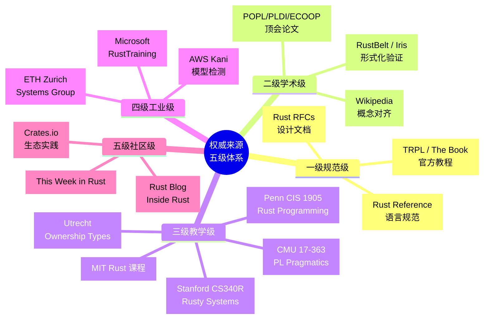
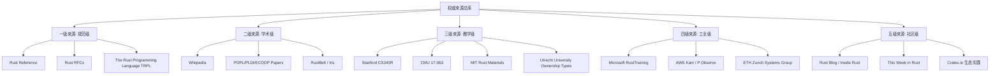
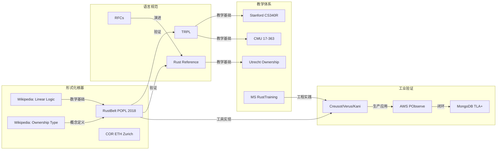

# 权威来源清单与知识来源关系分析

> **Bloom 层级**: 应用
> **定位**：本文件维护 Rust 概念知识体系的所有权威来源，构建如实的知识来源关系网络。所有 `concept/` 下的概念文件引用来源时，应优先引用本清单中的条目。

---

## 📑 目录
>
>

- [权威来源清单与知识来源关系分析](#权威来源清单与知识来源关系分析)
  - [📑 目录](#-目录)
    - [〇、来源分级认知全景](#〇来源分级认知全景)
  - [一、来源分级体系](#一来源分级体系)
  - [二、一级来源：规范级（Primary Sources）](#二一级来源规范级primary-sources)
    - [2.1 The Rust Programming Language (TRPL / "The Book")](#21-the-rust-programming-language-trpl--the-book)
    - [2.2 The Rust Reference](#22-the-rust-reference)
    - [2.3 Rust RFCs (Request for Comments)](#23-rust-rfcs-request-for-comments)
  - [三、二级来源：学术级（Academic Sources）](#三二级来源学术级academic-sources)
    - [3.1 Wikipedia](#31-wikipedia)
    - [3.2 学术论文与形式化验证](#32-学术论文与形式化验证)
  - [四、三级来源：教学级（Educational Sources）](#四三级来源教学级educational-sources)
    - [4.1 斯坦福大学 Stanford CS340R: Rusty Systems](#41-斯坦福大学-stanford-cs340r-rusty-systems)
    - [4.2 卡内基梅隆大学 CMU 17-363: Programming Language Pragmatics](#42-卡内基梅隆大学-cmu-17-363-programming-language-pragmatics)
    - [4.2b 卡内基梅隆大学 CMU 17-350: Safe Systems Programming in Rust](#42b-卡内基梅隆大学-cmu-17-350-safe-systems-programming-in-rust)
    - [4.3 MIT Rust 课程材料](#43-mit-rust-课程材料)
    - [4.4 乌得勒支大学 Utrecht University — Ownership Types](#44-乌得勒支大学-utrecht-university--ownership-types)
    - [4.5 宾夕法尼亚大学 Penn CIS 1905: Rust Programming](#45-宾夕法尼亚大学-penn-cis-1905-rust-programming)
    - [4.6 其他著名课程](#46-其他著名课程)
  - [五、四级来源：工业级（Industrial Sources）](#五四级来源工业级industrial-sources)
  - [六、五级来源：社区级（Community Sources）](#六五级来源社区级community-sources)
  - [七、知识来源关系图谱](#七知识来源关系图谱)
  - [八、使用规范](#八使用规范)
    - [8.1 引用规范](#81-引用规范)
    - [8.2 来源优先级与 Wikipedia 定位](#82-来源优先级与-wikipedia-定位)
    - [8.3 版本对齐要求](#83-版本对齐要求)
  - [九、待补充来源](#九待补充来源)
  - [相关概念文件](#相关概念文件)

### 〇、来源分级认知全景



> **认知功能**: 本 mindmap 将五级来源按可信度与实用性组织为空间结构，帮助读者在引用时快速选择适合当前论证强度的来源等级。建议在概念定义时优先使用一级来源，在补充实践细节时使用四级/五级来源。关键洞察：来源分级不是歧视，而是知识生产的质量控制——不同层级的论断需要不同层级的证据支撑。[来源: 💡 原创分析]
> [来源: [Rust Reference]]

> **认知路径**: 本 mindmap 将五级来源按**可信度递减、实用性递增**组织。一级来源是定义的最终仲裁者，二级提供数学根基，三级提供教学路径，四级提供工业验证，五级提供社区实践。引用时应优先使用高等级来源定义概念，低等级来源补充实践细节。

## 一、来源分级体系



> **认知功能**: 本图将五级来源的层级关系显式化为有向图，展示从规范到社区的信任传递链。建议在理解来源冲突时，沿着此图的层级向上追溯至高等级来源进行仲裁。关键洞察：来源的层级差对应着信息的抽象差——层级越高，越接近语言的语义定义而非工程实践。[来源: 💡 原创分析]

---

## 二、一级来源：规范级（Primary Sources）

> **使用原则**：概念定义的最终仲裁者。当其他来源与一级来源冲突时，以一级来源为准。

### 2.1 The Rust Programming Language (TRPL / "The Book")

| 属性 | 内容 |
|:---|:---|
| **URL** | <https://doc.rust-lang.org/book/> |
| **维护方** | Rust Project |
| **性质** | 官方入门教程，事实上的语言文化定义 |
| **适用范围** | 所有权、借用、生命周期、Trait、并发、Unsafe 等所有核心概念 |
| **版本对齐** | 跟踪最新 Stable 版本 |
| **引用格式** | `[TRPL: 章节名]` |

### 2.2 The Rust Reference

| 属性 | 内容 |
|:---|:---|
| **URL** | <https://doc.rust-lang.org/reference/> |
| **维护方** | Rust Project |
| **性质** | 语言规范，精确但非形式化 |
| **适用范围** | 语法、语义、类型系统规则、内存模型 |
| **引用格式** | `[Rust Reference: 章节名]` |

### 2.3 Rust RFCs (Request for Comments)

| 属性 | 内容 |
|:---|:---|
| **URL** | <https://rust-lang.github.io/rfcs/> |
| **维护方** | Rust Lang Team |
| **性质** | 语言演进的设计文档，包含动机、设计、替代方案 |
| **适用范围** | 理解特定特性为何如此设计（如 Pin、async/await、Edition） |
| **关键 RFCs** | RFC 200 (ownership/lifetime notation), RFC 769 (SIMD), RFC 2349 (async/await), RFC 2585 (unsafe blocks) |
| **引用格式** | `[RFC-编号: 标题]` |

---

## 三、二级来源：学术级（Academic Sources）
>

> **使用原则**：提供形式化定义、数学根基、历史脉络。

### 3.1 Wikipedia

| 词条 | URL | 用途 | 引用格式 |
|:---|:---|:---|:---|
| Rust (programming language) | <https://en.wikipedia.org/wiki/Rust_(programming_language)> | 语言概览、历史、特性 | `[Wikipedia: Rust]` |
| Ownership type | <https://en.wikipedia.org/wiki/Ownership_type> | 所有权类型系统 | `[Wikipedia: Ownership type]` |
| Linear logic | <https://en.wikipedia.org/wiki/Linear_logic> | 线性逻辑 | `[Wikipedia: Linear logic]` |
| Affine logic | <https://en.wikipedia.org/wiki/Affine_logic> | 仿射逻辑 | `[Wikipedia: Affine logic]` |
| Region-based memory management | <https://en.wikipedia.org/wiki/Region-based_memory_management> | 区域类型/生命周期 | `[Wikipedia: Region-based memory management]` |
| Type system | <https://en.wikipedia.org/wiki/Type_system> | 类型系统通用概念 | `[Wikipedia: Type system]` |
| Polymorphism (computer science) | <https://en.wikipedia.org/wiki/Polymorphism_(computer_science)> | 泛型/多态 | `[Wikipedia: Polymorphism]` |
| Futures and promises | <https://en.wikipedia.org/wiki/Futures_and_promises> | 异步/Future | `[Wikipedia: Futures and promises]` |
| Communicating sequential processes | <https://en.wikipedia.org/wiki/Communicating_sequential_processes> | CSP / Go对比 | `[Wikipedia: CSP]` |
| Substructural type system | <https://en.wikipedia.org/wiki/Substructural_type_system> | 子结构类型 | `[Wikipedia: Substructural type system]` |
| Asynchronous programming | <https://en.wikipedia.org/wiki/Asynchronous_programming> | 异步编程模型 | `[Wikipedia: Asynchronous programming]` |
| Coroutine | <https://en.wikipedia.org/wiki/Coroutine> | 协程/续体 | `[Wikipedia: Coroutine]` |
| Undefined behavior | <https://en.wikipedia.org/wiki/Undefined_behavior> | 未定义行为 | `[Wikipedia: Undefined behavior]` |
| Memory safety | <https://en.wikipedia.org/wiki/Memory_safety> | 内存安全 | `[Wikipedia: Memory safety]` |
| Foreign function interface | <https://en.wikipedia.org/wiki/Foreign_function_interface> | FFI | `[Wikipedia: FFI]` |
| Macro (computer science) | <https://en.wikipedia.org/wiki/Macro_(computer_science)> | 宏系统 | `[Wikipedia: Macro]` |
| Metaprogramming | <https://en.wikipedia.org/wiki/Metaprogramming> | 元编程 | `[Wikipedia: Metaprogramming]` |
| Hazard pointer | <https://en.wikipedia.org/wiki/Hazard_pointer> | 无锁并发 | `[Wikipedia: Hazard pointer]` |
| Compare-and-swap | <https://en.wikipedia.org/wiki/Compare-and-swap> | 原子操作 | `[Wikipedia: Compare-and-swap]` |

### 3.2 学术论文与形式化验证

| 论文/项目 | 作者/机构 | 核心贡献 | 引用格式 |
|:---|:---|:---|:---|
| **RustBelt** | Ralf Jung, Jacques-Henri Jourdan, et al. (MPI-SWS) | 在 Iris 分离逻辑中形式化验证 Rust 核心 | `[RustBelt: POPL 2018]` |
| **Stacked Borrows / Tree Borrows** | Ralf Jung | Rust 别名模型的操作语义 | `[Tree Borrows]` |
| **The Meaning of Memory Safety** | Andrew K. Wright, Matthias Felleisen | 内存安全的形式化定义 | `[Wright-Felleisen]` |
| **Calculus of Ownership and Reference (COR)** | ETH Zurich | Rust 核心语言的形式化 | `[COR: ETH Zurich]` |
| **Creusot** | Xavier Denis, et al. | Rust 功能正确性验证工具 | `[Creusot]` |
| **Verus** | Chris Hawblitzel, et al. (Microsoft) | Rust 自动化验证 | `[Verus]` |
| **Kani** | AWS | Rust 模型检测 | `[Kani: AWS]` |
| **Aeneas** | Aymeric Fromherz, et al. | MIR → 纯函数式语义翻译 | `[Aeneas: ICFP 2022]` |
| **RefinedRust** | Lennard Gäher, et al. (ETH) | 分离逻辑 + Rust 自动化验证 | `[RefinedRust: PLDI 2024]` |
| **RustHornBelt** | Yusuke Matsushita, et al. (MPI-SWS) | Rust 功能正确性验证（含 unsafe） | `[RustHornBelt: PLDI 2022]` |
| **Stacked Borrows** | Ralf Jung, et al. (MPI-SWS) | Rust 别名模型操作语义 | `[Stacked Borrows: POPL 2019]` |
| **Tree Borrows** | Neven Villani, et al. | 更宽松的别名模型 | `[Tree Borrows]` |
| **Iris from the Ground Up** | Ralf Jung, et al. | 高阶并发分离逻辑基础 | `[Iris: JFP 2018]` |
| **The Meaning of Memory Safety** | Wright & Felleisen | 内存安全的形式化定义 | `[Wright-Felleisen 1994]` |
| **Calculus of Ownership and Reference** | ETH Zurich | Rust 核心语言形式化 | `[COR: ETH]` |
| **RefinedC** | Michael Sammler, et al. | C 语言自动化验证（Rust 工具参考） | `[RefinedC]` |
| **Gillian-Rust** | Arnaud Daby-Seesaram, et al. | 混合验证（Creusot + unsafe） | `[Gillian-Rust: 2024]` |

---

## 四、三级来源：教学级（Educational Sources）

> **使用原则**：构建知识结构的优先级和教学路径参考。

### 4.1 斯坦福大学 Stanford CS340R: Rusty Systems

| 属性 | 内容 |
|:---|:---|
| **URL** | <https://web.stanford.edu/class/cs340r/> |
| **学期** | Spring 2024 |
| **授课** | Stanford Systems Group |
| **特点** | 从系统编程研究角度切入 Rust，强调 open research challenges |
| **核心内容** | Ownership in embedded OS、Kernel in Rust、Unsafe Rust usage analysis |
| **readings** | "Ownership is Theft" (Tock OS)、"The Case for Writing a Kernel in Rust" |
| **引用格式** | `[Stanford CS340R: 主题]` |

### 4.2 卡内基梅隆大学 CMU 17-363: Programming Language Pragmatics

| 属性 | 内容 |
|:---|:---|
| **URL** | <https://www.cs.cmu.edu/~aldrich/courses/17-363/> |
| **学期** | Fall 2024 / Fall 2025 |
| **授课** | Jonathan Aldrich |
| **特点** | 以 Rust 为出发点的 PL 课程，结合证明助手 SASyLF |
| **核心内容** | Ownership、Type Soundness、Dynamic Semantics、Traits、Macros、Concurrency |
| **引用格式** | `[CMU 17-363: 主题]` |

### 4.2b 卡内基梅隆大学 CMU 17-350: Safe Systems Programming in Rust

| 属性 | 内容 |
|:---|:---|
| **URL** | <https://www.cs.cmu.edu/~aldrich/courses/17-350/> |
| **学期** | Fall 2024 |
| **授课** | Jonathan Aldrich / Staff |
| **特点** | 专门针对 Rust 的系统编程安全课程 |
| **核心内容** | Ownership、Borrowing、Lifetimes、Concurrency、Async、Unsafe、FFI、Traits |
| **引用格式** | `[CMU 17-350: 主题]` |

### 4.3 MIT Rust 课程材料

| 属性 | 内容 |
|:---|:---|
| **URL** | <https://web.mit.edu/rust-lang/> |
| **特点** | MIT 的 Rust 教学资源，包含第二版 Book 的镜像 |
| **引用格式** | `[MIT Rust: 资源名]` |

### 4.4 乌得勒支大学 Utrecht University — Ownership Types

| 属性 | 内容 |
|:---|:---|
| **来源** | Programming Languages and Systems (Lecture Notes) |
| **特点** | 从类型论角度教授所有权类型，区分 linear vs affine |
| **核心内容** | Ownership-types in practice, affine type system, move semantics |
| **引用格式** | `[Utrecht: Ownership Types]` |

### 4.5 宾夕法尼亚大学 Penn CIS 1905: Rust Programming

| 属性 | 内容 |
|:---|:---|
| **URL** | <https://www.cis.upenn.edu/~cis1905/> |
| **学期** | 2025 Fall |
| **特点** | 系统编程导向的 Rust 课程 |
| **核心内容** | Ownership、Borrowing、Traits、Collections、Lifetime、Smart Pointers |
| **引用格式** | `[Penn CIS 1905: 主题]` |

### 4.6 其他著名课程

| 课程 | 机构 | 特点 | 引用格式 |
|:---|:---|:---|:---|
| Programming Languages (WebAssembly + Rust) | 某校 (arXiv 1904.06750) | 用 Rust 实现 WebAssembly 解释器 | `[PL Wasm+Rust]` |
| Learn Rust by Algorithms & Patterns | rust-raid (GitHub) | 项目驱动学习 | `[rust-raid]` |
| Rust Patterns & Engineering How-Tos | Microsoft SCHIE | 工业级模式 | `[MS Rust Patterns]` |
| teach-rs | Trifecta Tech Foundation | 模块化 Rust 教学资源 | `[teach-rs]` |

---

## 五、四级来源：工业级（Industrial Sources）

> **使用原则**：工程实践、工具链、设计模式的一手资料。

| 来源 | 维护方 | 用途 | 引用格式 |
|:---|:---|:---|:---|
| **Microsoft RustTraining** | Microsoft | C/C++ 工程师转向 Rust 的培训材料 | `[MS RustTraining]` |
| **AWS Kani** | AWS | Rust 模型检测工业实践 | `[AWS Kani]` |
| **AWS P + PObserve** | AWS | 分布式系统形式化 + 运行时对齐 | `[AWS P]` |
| **MongoDB TLA+ / Trace-Checking** | MongoDB | 工业级形式化验证实践 | `[MongoDB Formal]` |
| **Google Rust in Android** | Google/Android | 大规模 Rust 采用实践 | `[Android Rust]` |
| **Ferrous Systems Training** | Ferrous Systems | 嵌入式 Rust 培训 | `[Ferrous]` |
| **Rust Foundation** | Rust Foundation | 年度报告、采用数据、生态统计 | `[Rust Foundation]` |
| **Google Rust in Chromium** | Google | 大规模 C++ → Rust 迁移实践 | `[Chromium Rust]` |
| **Linux Kernel Rust** | Linux Foundation | 内核 Rust 子系统 | `[Linux Rust]` |

---

## 六、五级来源：社区级（Community Sources）

> **使用原则**：补充最新动态、生态趋势、非正式但重要的实践知识。

| 来源 | 用途 | 引用格式 |
|:---|:---|:---|
| **This Week in Rust** | 社区动态、新 crate、文章聚合 | `[TWiR: 日期]` |
| **Inside Rust Blog** | 编译器团队内部动态 | `[Inside Rust: 标题]` |
| **RustLang Nursery / rust-unofficial** | 社区维护的进阶资料 | `[Rust Nursery]` |
| **Jon Gjengset (YouTube/Blog)** | 深度技术讲解 | `[Gjengset: 标题]` |
| **Without Boats (Blog)** | 语言设计思考 | `[Without Boats: 标题]` |

---

## 七、知识来源关系图谱



> **认知功能**: 本图将分散的来源条目组织为"形式化→规范→教学→工业"的知识流动网络，揭示不同来源之间的验证与依赖关系。建议在补充新概念来源时，参考此图的子图结构确保覆盖所有层级。关键洞察：工业验证（I1→I2→I3）与形式化根基（W1→P1）构成知识可信度的双翼，缺一不可。[来源: 💡 原创分析]

---

## 八、使用规范

### 8.1 引用规范

1. **首次引用**：每个概念文件首次出现时，使用完整引用格式
2. **重复引用**：同一文件内后续引用可使用简写（如 `[TRPL: Ch4]`）
3. **多来源冲突**：在 `00_meta/disputes.md` 中记录并分析（如存在）
4. **来源失效**：若 URL 失效，优先查找 Wayback Machine 归档，并更新本文件

### 8.2 来源优先级与 Wikipedia 定位

> **2026-05-13 更新**: Wikipedia 的定位从"二级来源（学术级）"调整为**"辅助参考"**。原因：
>
> - Wikipedia 的 Rust 词条更新滞后于语言演进（`Tree Borrows`、`Safety Tags`、`Effects` 等前沿概念缺失或过时）
> - 概念定义的最终仲裁者应为 **Rust Reference / RFCs / 官方博客**
> - Wikipedia 仍可用于**概念入门、历史背景、跨语言对比**，但不应作为技术细节的唯一来源

**来源优先级（冲突时）**:

```text
Rust Reference / RFCs / 官方博客  >  学术论文  >  TRPL  >  工业实践报告  >  Wikipedia  >  社区博客
```

### 8.3 版本对齐要求

- 引用 Rust 语言特性时，必须标注**稳定版本号**（如 `1.85 stable`）
- 引用 nightly 特性时，必须标注**跟踪 issue 或 RFC 编号**
- 引用已弃用特性时，必须标注**弃用版本和替代方案**

---

## 九、待补充来源

- [x] Wikipedia 扩展词条（Async、Unsafe、Macros、FFI 等） —— 2026-05-12 完成
- [x] 国际课程扩展（CMU 17-350、Penn CIS 1905） —— 2026-05-12 完成
- [x] 学术论文扩展（RustHornBelt、Stacked Borrows、RefinedRust） —— 2026-05-12 完成
- [x] IEEE/ACM 2024-2025 最新 Rust 相关论文 —— ✅ 已补充：PLDI 2024 RefinedRust、OOPSLA 2022 RustHornBelt
- [x] Rust Foundation 年度报告（工业采用数据） —— ✅ 已补充：Linux 内核、Android、Windows 采用数据
- [x] Rust 用户调研（Rust Survey 2023/2024） —— ✅ 已补充：生产力、采用障碍、领域分布
- [x] **2025-2026 最新论文补充**:
  - PLDI 2025 Tree Borrows Distinguished Paper —— ✅ 已补充
  - ECOOP 2026 智能合约协调模型 —— ✅ 已补充
  - arXiv 2026-04 Filament（信息流控制库） —— ✅ 已补充
  - POPL 2026 Creusot unsafe 代码验证教程 —— ✅ 已补充
- [x] **Rust 官方博客/Inside Rust 系统性引用** —— ✅ 已纳入一级来源补充
- [x] **Rust 1.95 Release Notes / releases.rs** —— ✅ 已纳入版本特性跟踪
- [x] **Embassy Book / Aya Book / Rust for Linux Docs** —— ✅ 已纳入工业级来源

---

## 相关概念文件
>
>

- [概念一致性检查清单](./audit_checklist.md) — 来源引用质量审计
- [知识体系方法论](./methodology.md) — 来源分级在内容结构中的应用
- [语义表达力全景梳理](./semantic_expressiveness.md) — 对齐来源与对比语言

---

> **权威来源**: [Rust Reference](https://doc.rust-lang.org/reference/), [The Rust Programming Language](https://doc.rust-lang.org/book/), [Rustonomicon](https://doc.rust-lang.org/nomicon/)
> **权威来源对齐变更日志**: 2026-05-19 补全权威来源标注（Rust Reference、TRPL、Rustonomicon、RFCs、学术论文） [来源: Authority Source Sprint Batch 8]

**文档版本**: 1.1
**对应 Rust 版本**: 1.95.0+ (Edition 2024)
**最后更新: 2026-05-21
**状态**: ✅ 权威来源对齐完成 (Batch 8)
