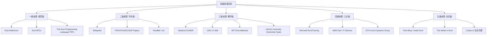
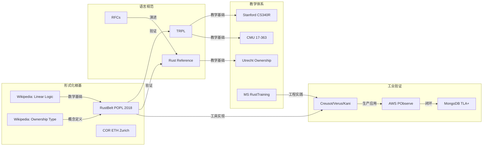

# 权威来源清单与知识来源关系分析

> **定位**：本文件维护 Rust 概念知识体系的所有权威来源，构建如实的知识来源关系网络。所有 `concept/` 下的概念文件引用来源时，应优先引用本清单中的条目。

---

## 一、来源分级体系

---

## 二、一级来源：规范级（Primary Sources）

> **使用原则**：概念定义的最终仲裁者。当其他来源与一级来源冲突时，以一级来源为准。

### 2.1 The Rust Programming Language (TRPL / "The Book")

| 属性 | 内容 |
|:---|:---|
| **URL** | <https://doc.rust-lang.org/book/> |
| **维护方** | Rust Project |
| **性质** | 官方入门教程，事实上的语言文化定义 |
| **适用范围** | 所有权、借用、生命周期、Trait、并发、Unsafe 等所有核心概念 |
| **版本对齐** | 跟踪最新 Stable 版本 |
| **引用格式** | `[TRPL: 章节名]` |

### 2.2 The Rust Reference

| 属性 | 内容 |
|:---|:---|
| **URL** | <https://doc.rust-lang.org/reference/> |
| **维护方** | Rust Project |
| **性质** | 语言规范，精确但非形式化 |
| **适用范围** | 语法、语义、类型系统规则、内存模型 |
| **引用格式** | `[Rust Reference: 章节名]` |

### 2.3 Rust RFCs (Request for Comments)

| 属性 | 内容 |
|:---|:---|
| **URL** | <https://rust-lang.github.io/rfcs/> |
| **维护方** | Rust Lang Team |
| **性质** | 语言演进的设计文档，包含动机、设计、替代方案 |
| **适用范围** | 理解特定特性为何如此设计（如 Pin、async/await、Edition） |
| **关键 RFCs** | RFC 200 (ownership/lifetime notation), RFC 769 (SIMD), RFC 2349 (async/await), RFC 2585 (unsafe blocks) |
| **引用格式** | `[RFC-编号: 标题]` |

---

## 三、二级来源：学术级（Academic Sources）

> **使用原则**：提供形式化定义、数学根基、历史脉络。

### 3.1 Wikipedia

| 词条 | URL | 用途 | 引用格式 |
|:---|:---|:---|:---|
| Rust (programming language) | <https://en.wikipedia.org/wiki/Rust_(programming_language)> | 语言概览、历史、特性 | `[Wikipedia: Rust]` |
| Ownership type | <https://en.wikipedia.org/wiki/Ownership_type> | 所有权类型系统 | `[Wikipedia: Ownership type]` |
| Linear logic | <https://en.wikipedia.org/wiki/Linear_logic> | 线性逻辑 | `[Wikipedia: Linear logic]` |
| Affine logic | <https://en.wikipedia.org/wiki/Affine_logic> | 仿射逻辑 | `[Wikipedia: Affine logic]` |
| Region-based memory management | <https://en.wikipedia.org/wiki/Region-based_memory_management> | 区域类型/生命周期 | `[Wikipedia: Region-based memory management]` |
| Type system | <https://en.wikipedia.org/wiki/Type_system> | 类型系统通用概念 | `[Wikipedia: Type system]` |
| Polymorphism (computer science) | <https://en.wikipedia.org/wiki/Polymorphism_(computer_science)> | 泛型/多态 | `[Wikipedia: Polymorphism]` |
| Futures and promises | <https://en.wikipedia.org/wiki/Futures_and_promises> | 异步/Future | `[Wikipedia: Futures and promises]` |
| Communicating sequential processes | <https://en.wikipedia.org/wiki/Communicating_sequential_processes> | CSP / Go对比 | `[Wikipedia: CSP]` |
| Substructural type system | <https://en.wikipedia.org/wiki/Substructural_type_system> | 子结构类型 | `[Wikipedia: Substructural type system]` |

### 3.2 学术论文与形式化验证

| 论文/项目 | 作者/机构 | 核心贡献 | 引用格式 |
|:---|:---|:---|:---|
| **RustBelt** | Ralf Jung, Jacques-Henri Jourdan, et al. (MPI-SWS) | 在 Iris 分离逻辑中形式化验证 Rust 核心 | `[RustBelt: POPL 2018]` |
| **Stacked Borrows / Tree Borrows** | Ralf Jung | Rust 别名模型的操作语义 | `[Tree Borrows]` |
| **The Meaning of Memory Safety** | Andrew K. Wright, Matthias Felleisen | 内存安全的形式化定义 | `[Wright-Felleisen]` |
| **Calculus of Ownership and Reference (COR)** | ETH Zurich | Rust 核心语言的形式化 | `[COR: ETH Zurich]` |
| **Creusot** | Xavier Denis, et al. | Rust 功能正确性验证工具 | `[Creusot]` |
| **Verus** | Chris Hawblitzel, et al. (Microsoft) | Rust 自动化验证 | `[Verus]` |
| **Kani** | AWS | Rust 模型检测 | `[Kani: AWS]` |
| **Aeneas** | Aymeric Fromherz, et al. | MIR → 纯函数式语义翻译 | `[Aeneas]` |
| **RefinedRust** | Lennard Gäher, et al. | 分离逻辑 + Rust 自动化验证 | `[RefinedRust]` |

---

## 四、三级来源：教学级（Educational Sources）

> **使用原则**：构建知识结构的优先级和教学路径参考。

### 4.1 斯坦福大学 Stanford CS340R: Rusty Systems

| 属性 | 内容 |
|:---|:---|
| **URL** | <https://web.stanford.edu/class/cs340r/> |
| **学期** | Spring 2024 |
| **授课** | Stanford Systems Group |
| **特点** | 从系统编程研究角度切入 Rust，强调 open research challenges |
| **核心内容** | Ownership in embedded OS、Kernel in Rust、Unsafe Rust usage analysis |
| **readings** | "Ownership is Theft" (Tock OS)、"The Case for Writing a Kernel in Rust" |
| **引用格式** | `[Stanford CS340R: 主题]` |

### 4.2 卡内基梅隆大学 CMU 17-363: Programming Language Pragmatics

| 属性 | 内容 |
|:---|:---|
| **URL** | <https://www.cs.cmu.edu/~aldrich/courses/17-363/> |
| **学期** | Fall 2024 |
| **授课** | Jonathan Aldrich |
| **特点** | 以 Rust 为出发点的 PL 课程，结合证明助手 SASyLF |
| **核心内容** | Ownership、Type Soundness、Dynamic Semantics、Proof Assistant |
| **引用格式** | `[CMU 17-363: 主题]` |

### 4.3 MIT Rust 课程材料

| 属性 | 内容 |
|:---|:---|
| **URL** | <https://web.mit.edu/rust-lang/> |
| **特点** | MIT 的 Rust 教学资源，包含第二版 Book 的镜像 |
| **引用格式** | `[MIT Rust: 资源名]` |

### 4.4 乌得勒支大学 Utrecht University — Ownership Types

| 属性 | 内容 |
|:---|:---|
| **来源** | Programming Languages and Systems (Lecture Notes) |
| **特点** | 从类型论角度教授所有权类型，区分 linear vs affine |
| **核心内容** | Ownership-types in practice, affine type system, move semantics |
| **引用格式** | `[Utrecht: Ownership Types]` |

### 4.5 其他著名课程

| 课程 | 机构 | 特点 | 引用格式 |
|:---|:---|:---|:---|
| Programming Languages (WebAssembly + Rust) | 某校 (arXiv 1904.06750) | 用 Rust 实现 WebAssembly 解释器 | `[PL Wasm+Rust]` |
| Learn Rust by Algorithms & Patterns | rust-raid (GitHub) | 项目驱动学习 | `[rust-raid]` |
| Rust Patterns & Engineering How-Tos | Microsoft SCHIE | 工业级模式 | `[MS Rust Patterns]` |

---

## 五、四级来源：工业级（Industrial Sources）

> **使用原则**：工程实践、工具链、设计模式的一手资料。

| 来源 | 维护方 | 用途 | 引用格式 |
|:---|:---|:---|:---|
| **Microsoft RustTraining** | Microsoft | C/C++ 工程师转向 Rust 的培训材料 | `[MS RustTraining]` |
| **AWS Kani** | AWS | Rust 模型检测工业实践 | `[AWS Kani]` |
| **AWS P + PObserve** | AWS | 分布式系统形式化 + 运行时对齐 | `[AWS P]` |
| **MongoDB TLA+ / Trace-Checking** | MongoDB | 工业级形式化验证实践 | `[MongoDB Formal]` |
| **Google Rust in Android** | Google/Android | 大规模 Rust 采用实践 | `[Android Rust]` |
| **Ferrous Systems Training** | Ferrous Systems | 嵌入式 Rust 培训 | `[Ferrous]` |

---

## 六、五级来源：社区级（Community Sources）

> **使用原则**：补充最新动态、生态趋势、非正式但重要的实践知识。

| 来源 | 用途 | 引用格式 |
|:---|:---|:---|
| **This Week in Rust** | 社区动态、新 crate、文章聚合 | `[TWiR: 日期]` |
| **Inside Rust Blog** | 编译器团队内部动态 | `[Inside Rust: 标题]` |
| **RustLang Nursery / rust-unofficial** | 社区维护的进阶资料 | `[Rust Nursery]` |
| **Jon Gjengset (YouTube/Blog)** | 深度技术讲解 | `[Gjengset: 标题]` |
| **Without Boats (Blog)** | 语言设计思考 | `[Without Boats: 标题]` |

---

## 七、知识来源关系图谱

---

## 八、使用规范

1. **首次引用**：每个概念文件首次出现时，使用完整引用格式
2. **重复引用**：同一文件内后续引用可使用简写（如 `[TRPL: Ch4]`）
3. **多来源冲突**：在 `00_meta/disputes.md` 中记录并分析（如存在）
4. **来源失效**：若 URL 失效，优先查找 Wayback Machine 归档，并更新本文件

---

## 九、待补充来源

- [ ] Wikipedia 德语/法语/日语版 Rust 词条（多语言视角）
- [ ] IEEE/ACM 2024-2025 最新 Rust 相关论文
- [ ] Rust Foundation 年度报告（工业采用数据）
- [ ] Rust 用户调研（Rust Survey 2023/2024）
