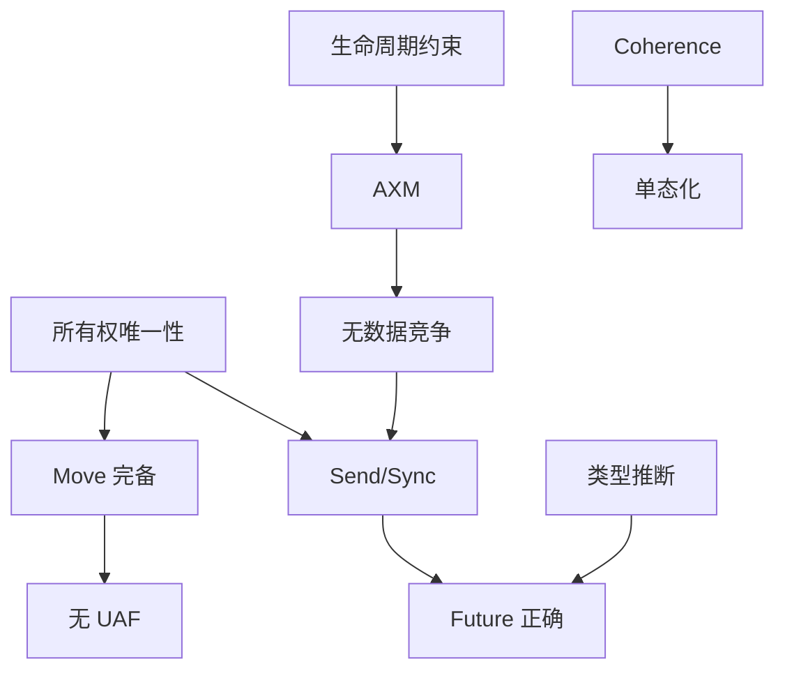

# Rust 知识体系定理推理森林

> **定位**: 本文件建立 L1-L4 核心模型内的「公理 → 引理 → 定理 → 推论」推理链，形成跨模型的定理森林，标注每条推理链的前提、规则、失效条件和反例路径。
> **原则**: 每条定理链必须可追溯至 L4 形式化公理，并标注失效条件（什么情况下定理不成立）。
> **符号约定**: `⊢` 推导 / `⟹` 蕴含 / `⇐` 依赖 / `⊘` 反例 / `≡` 等价

---

> **Bloom 层级**: 元（Meta）

**变更日志**:

- v1.0 (2026-05-21): 初始版本——L1-L4 六棵定理树 + 跨树关联 + 失效条件矩阵

---

## 📑 目录

- [Rust 知识体系定理推理森林](#rust-知识体系定理推理森林)
  - [📑 目录](#-目录)
  - [一、推理森林总览](#一推理森林总览)
  - [二、所有权定理树](#二所有权定理树)
    - [2.1 推理链](#21-推理链)
    - [2.2 失效条件与反例](#22-失效条件与反例)
  - [三、借用定理树](#三借用定理树)
    - [3.1 推理链](#31-推理链)
    - [3.2 失效条件与反例](#32-失效条件与反例)
  - [四、生命周期定理树](#四生命周期定理树)
    - [4.1 推理链](#41-推理链)
    - [4.2 失效条件与反例](#42-失效条件与反例)
  - [五、类型系统定理树](#五类型系统定理树)
    - [5.1 推理链](#51-推理链)
    - [5.2 失效条件与反例](#52-失效条件与反例)
  - [六、并发定理树](#六并发定理树)
    - [6.1 推理链](#61-推理链)
    - [6.2 失效条件与反例](#62-失效条件与反例)
  - [七、异步定理树](#七异步定理树)
    - [7.1 推理链](#71-推理链)
    - [7.2 失效条件与反例](#72-失效条件与反例)
  - [八、跨树关联与一致性](#八跨树关联与一致性)
    - [8.1 核心定理依赖图](#81-核心定理依赖图)
    - [8.2 一致性检查清单](#82-一致性检查清单)
  - [九、定理一致性矩阵（全局）](#九定理一致性矩阵全局)
  - [十、相关概念链接](#十相关概念链接)

## 一、推理森林总览

```mermaid
graph TD
    subgraph AXIOMS[形式化公理层 L4]
        A1[仿射逻辑: !A ↔ Copy]
        A2[分离逻辑: P * Q ↔ struct]
        A3[区域类型: κ ⊑ κ' ↔ 生命周期约束]
        A4[System F: ∀T.λx:T ↔ 泛型]
        A5[Iris: own + shr ↔ 所有权+借用]
        A6[进程代数: P|Q ↔ 线程并发]
    end

    subgraph L1[L1 基础层]
        T1[所有权唯一性]
        T2[Move 语义完备性]
        T3[无 UAF]
        T4[AXM 借用唯一性]
        T5[无数据竞争]
        T6[生命周期偏序]
        T7[Elision 完备性]
    end

    subgraph L2[L2 进阶层]
        T8[Orphan Rule ⟹ Coherence]
        T9[Trait 对象安全]
        T10[单态化零成本]
        T11[Const Generics 有界]
        T12[Result 代数完备]
    end

    subgraph L3[L3 高级层]
        T13[Send/Sync 无竞争]
        T14[Future 状态机正确]
        T15[Pin 内存稳定]
        T16[Unsafe Contract]
    end

    A1 --> T1
    A1 --> T2
    A2 --> T4
    A3 --> T6
    A3 --> T7
    A5 --> T3
    A5 --> T5
    A5 --> T13
    A4 --> T10
    A6 --> T13

    T1 --> T2
    T2 --> T3
    T4 --> T5
    T6 --> T7
    T8 --> T9
    T10 --> T11
    T13 --> T14
    T14 --> T15
```

---

## 二、所有权定理树

### 2.1 推理链

```
公理 A1: 仿射逻辑允许资源丢弃（weakening）
    ↓
引理 L1-1: Rust 值可被安全遗忘（mem::forget 不触发 UB）
    ↓
定理 T-001: 所有权唯一性 [来源: 01_ownership.md T-001, RustBelt POPL 2018]
    「每个值在任意时刻有且只有一个所有者」
    ↓
定理 T-002: Move 语义完备性 [来源: 01_ownership.md T-002, Oxide arXiv 2019]
    「所有权转移后，原变量不可访问」
    ↓
推论 C-001: Safe Rust 无 Use-After-Free [来源: RustBelt Soundness Theorem]
    「well-typed Safe Rust 程序不存在 UAF」
    ↓
推论 C-002: Safe Rust 无双重释放 [来源: RustBelt Soundness Theorem]
    「Drop 只由唯一所有者执行一次」
```

### 2.2 失效条件与反例

| 定理 | 失效条件 | 反例路径 |
|:---|:---|:---|
| T-001 所有权唯一性 | `Rc<T>` / `Arc<T>`（共享所有权） | `Rc::clone` 产生多个所有者 → 循环引用 → 内存泄漏 |
| T-002 Move 完备性 | `Copy` trait（隐式复制替代移动） | `let y = x;` 若 `x: Copy`，则 `x` 仍可用 |
| C-001 无 UAF | `unsafe` 裸指针解引用 | `let r = &x as *const _; drop(x); *r` |
| C-002 无双重释放 | `mem::forget` + 手动 `drop` | `mem::forget(x); drop(x)`（unsafe） |

---

## 三、借用定理树

### 3.1 推理链

```
公理 A2: 分离逻辑分数权限 borrow(x, q)，q ∈ (0,1]
    ↓
引理 L2-1: &T 对应 q = ∞（无限共享，只读）
引理 L2-2: &mut T 对应 q = 1（独占，可写）
    ↓
定理 T-010: AXM（Alias XOR Mutation） [来源: 02_borrowing.md T-010, Reynolds Separation Logic]
    「同一时间，一个值要么被多个 &T 共享访问，要么被一个 &mut T 独占访问」
    ↓
推论 C-010: 无数据竞争（Safe Rust） [来源: RustBelt POPL 2018, CACM 2021]
    「well-typed Safe Rust 不存在数据竞争」
    ↓
推论 C-011: 迭代器失效排除 [来源: Rust Reference §11]
    「在 &mut Vec<T> 存活期间，不能通过其他引用修改 Vec」
```

### 3.2 失效条件与反例

| 定理 | 失效条件 | 反例路径 |
|:---|:---|:---|
| T-010 AXM | `unsafe` 同时创建 `&T` 和 `&mut T` | `let r1 = &x; let r2 = &mut x;`（unsafe） |
| C-010 无数据竞争 | `unsafe` 跨线程共享非 Sync 数据 | `thread::spawn(|| { unsafe { *ptr } })` |
| C-011 迭代器失效 | `unsafe` 在迭代时修改集合 | `for x in &v { unsafe { v.push(1) } }` |

---

## 四、生命周期定理树

### 4.1 推理链

```
公理 A3: 区域类型 Tofte-Talpin，区域 κ 构成偏序集
    ↓
引理 L3-1: 生命周期 'a 是编译期区域变量
引理 L3-2: 'a: 'b 表示区域包含关系（'a 至少和 'b 一样长）
    ↓
定理 T-020: 生命周期偏序约束可满足性 [来源: 03_lifetimes.md T-020, Tofte-Talpin 1994]
    「有限生命周期变量集上的约束图无环 ⟺ 约束可满足」
    ↓
定理 T-021: NLL 流敏感安全 [来源: RFC 2094, Oxide 2019]
    「基于 CFG 的活跃性分析保证引用只在有效期间使用」
    ↓
推论 C-020: 悬垂引用不可达 [来源: 03_lifetimes.md T-022]
    「引用指向的值被释放后，引用不可再被使用」
```

### 4.2 失效条件与反例

| 定理 | 失效条件 | 反例路径 |
|:---|:---|:---|
| T-020 可满足性 | 自引用结构（生命周期递归） | `struct SelfRef { s: String, r: &str }` |
| T-021 NLL 安全 | Polonius 未解决的问题案例 #3 | `get_or_insert` 模式（NLL 拒绝合法程序） |
| C-020 无悬垂引用 | `unsafe` 延长引用超过值生命周期 | `let r = unsafe { &*Box::new(1) };` |

---

## 五、类型系统定理树

### 5.1 推理链

```
公理 A4: System F_ω —— 参数多态 + 类型构造子
    ↓
引理 L4-1: Rust 泛型是 System F 的工程实现（受限子集）
引理 L4-2: Rust Trait 是约束多态（qualified types）
    ↓
定理 T-030: 局部类型推断可判定性 [来源: 04_type_system.md T-030, Pierce TAPL §22]
    「函数签名显式注解 + 无 HKT ⟹ 函数体内推断可判定」
    ↓
定理 T-031: Trait 约束求解受限可判定性 [来源: 02_generics.md T-032, RFC 1665]
    「孤儿规则 + 一致性检查 ⟹ Trait 求解可判定」
    ↓
推论 C-030: 全局类型一致性 [来源: Rust Reference §6]
    「任意 well-typed 程序中，每个表达式有唯一确定的类型」
```

### 5.2 失效条件与反例

| 定理 | 失效条件 | 反例路径 |
|:---|:---|:---|
| T-030 推断可判定 | 递归类型无 indirection | `enum List { Cons(i32, List), Nil }` |
| T-031 Trait 可判定 | 重叠 impl（无 coherence） | `impl<T> Trait for T` + `impl Trait for i32` |
| C-030 类型一致性 | `unsafe` 类型转换 | `mem::transmute` 绕过类型系统 |

---

## 六、并发定理树

### 6.1 推理链

```
公理 A5: Iris 高阶并发分离逻辑
    ↓
引理 L5-1: own(x) 表示独占所有权
引理 L5-2: shr(x, κ, P) 表示在 κ 期间共享权限 P
    ↓
定理 T-040: Send/Sync 编码线程安全 [来源: 03_concurrency.md T-040, RustBelt]
    「T: Send ⟺ T 的所有权可跨线程转移」
    「T: Sync ⟺ &T: Send」
    ↓
定理 T-041: fearless concurrency [来源: TRPL §16, RustBelt]
    「Safe Rust + Send/Sync ⟹ 无数据竞争」
    ↓
推论 C-040: MutexGuard 自动释放 [来源: RAII 原则, Rust std docs]
    「锁守卫在作用域结束时自动释放（RAII）」
```

### 6.2 失效条件与反例

| 定理 | 失效条件 | 反例路径 |
|:---|:---|:---|
| T-040 Send/Sync | `unsafe impl Send` 错误 | `unsafe impl Send for Rc<T> {}` |
| T-041 无数据竞争 | `unsafe` 裸指针跨线程 | `thread::spawn(|| unsafe { *GLOBAL_PTR })` |
| C-040 自动释放 | `mem::forget(MutexGuard)` | 锁永不释放 → 死锁 |

---

## 七、异步定理树

### 7.1 推理链

```
公理 A6: 进程代数 + CPS 续体理论
    ↓
引理 L6-1: async fn 是无栈协程（stackless coroutine）
引理 L6-2: .await 点是续体边界
    ↓
定理 T-050: Future 状态机变换正确性 [来源: RFC 2394, Async Book]
    「编译器将 async fn 变换为等价的 Future 状态机」
    ↓
定理 T-051: Pin 内存稳定性 [来源: RFC 2349, Pin API docs]
    「Pin<&mut T> 保证 T 在内存中不被移动」
    ↓
推论 C-050: 自引用结构安全 [来源: Rustonomicon §4.8]
    「自引用字段的指针在 Pin 下保持有效」
```

### 7.2 失效条件与反例

| 定理 | 失效条件 | 反例路径 |
|:---|:---|:---|
| T-050 状态机正确 | `unsafe` 修改状态机内部 | 手动构造非法 Future enum 状态 |
| T-051 Pin 稳定 | `Pin::new_unchecked` 误用 | `Pin::new_unchecked(&mut !Unpin)` |
| C-050 自引用安全 | `mem::swap` Pin 后的值 | `mem::swap(pinned_a, pinned_b)` |

---

## 八、跨树关联与一致性

### 8.1 核心定理依赖图



### 8.2 一致性检查清单

| 检查项 | 状态 | 验证方式 |
|:---|:---:|:---|
| 所有权树 → 借用树：T-001 ⟹ T-010 | ✅ | 所有者有权决定借用方式 |
| 借用树 → 生命周期树：T-010 ← T-020 | ✅ | 借用合法性依赖生命周期约束 |
| 类型树 → 所有权树：T-030 → T-001 | ✅ | 类型系统的 Drop/Copy 决定所有权语义 |
| 并发树 → 借用树：T-041 ⟹ T-010 | ✅ | 无数据竞争是 AXM 的并发扩展 |
| 异步树 → 并发树：T-050 → T-041 | ✅ | async 任务安全依赖 Send/Sync |
| 所有权树 → 异步树：T-002 → T-051 | ✅ | Pin 依赖所有权的不可移动性 |

---

## 九、定理一致性矩阵（全局）

| 编号 | 定理 | 前提 | 结论 | L4 公理 | 失效条件 | 所在文件 |
|:---|:---|:---|:---|:---|:---|:---|
| T-001 | 所有权唯一性 | 仿射逻辑 weakening | 每个值有唯一所有者 | A1 | `Rc` / `Arc` | `01_ownership.md` |
| T-002 | Move 完备性 | 所有权唯一性 | 转移后原变量失效 | A1 | `Copy` trait | `01_ownership.md` |
| T-010 | AXM | 分离逻辑分数权限 | &T 和 &mut T 互斥 | A2 | `unsafe` 重叠借用 | `02_borrowing.md` |
| T-020 | 生命周期可满足 | 区域类型偏序 | 约束图无环 ⟺ 可满足 | A3 | 自引用结构 | `03_lifetimes.md` |
| T-030 | 类型推断可判定 | System F 子集 | 局部推断可判定 | A4 | 递归类型无 indirection | `04_type_system.md` |
| T-040 | Send/Sync 编码 | Iris 资源语义 | 编译期线程安全 | A5 | `unsafe impl` | `03_concurrency.md` |
| T-050 | 状态机正确 | CPS + 进程代数 | async 等价于 Future | A6 | `unsafe` 状态破坏 | `03_async.md` |

---

## 十、相关概念链接

- [跨层依赖拓扑](inter_layer_topology.md) —— L0-L7 纵向关系
- [层次内模型映射](intra_layer_model_map.md) —— 同层模型横向关系
- [边界扩展树](boundary_extension_tree.md) —— 安全边界推演
- [可判定性谱系](decidability_spectrum.md) —— 定理的判定性边界
- [表达力多视角](expressiveness_multiview.md) —— 表达力与定理的关系
- [L1 所有权](../01_foundation/01_ownership.md) —— T-001 / T-002 / T-003
- [L1 借用](../01_foundation/02_borrowing.md) —— T-010 / T-011 / T-012
- [L3 并发](../03_advanced/01_concurrency.md) —— T-040 / T-041 / T-042

---

> **文档版本**: 1.0
> **最后更新**: 2026-05-21
> **状态**: ✅ 定理推理森林 v1.0
