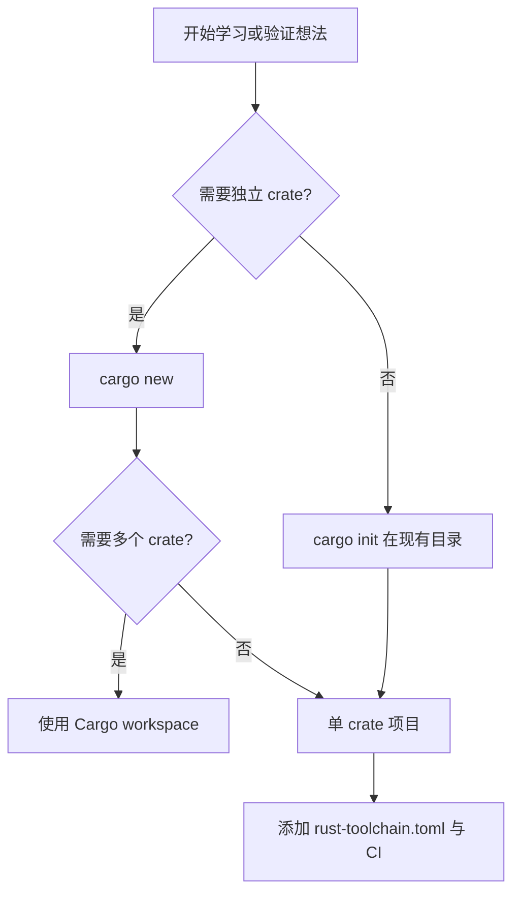

> **内容分级**: [初学者]

# Rust 起步指南

> **EN**: Getting Started with Rust
> **Summary**: A practical starting guide for Rust beginners: installation, toolchain setup, first Cargo project, essential commands, editor configuration, and the learning path into ownership, types, modules, error handling, and testing.
> **受众**: [初学者]
> **Bloom 层级**: 记忆 → 理解
> **定位**: Rust 学习路径的起点。本文档假设你没有任何 Rust 背景，只需基本的命令行操作经验。
> **预计阅读时间**: 25 分钟
> **对应练习**: [exercises/src/ownership_borrowing/ex01_hello_move.rs](../../exercises/src/ownership_borrowing)
>
> **来源**: [TRPL — Getting Started](https://doc.rust-lang.org/book/ch01-00-getting-started.html) · [Rust Installation](https://www.rust-lang.org/tools/install) · [学习指南](../../00_meta/04_navigation/learning_guide.md) · [RustBelt — POPL 2018](https://plv.mpi-sws.org/rustbelt/popl18/) · [Brown University — Concepts in Rust Programming](https://cel.cs.brown.edu/crp/)
> **前置概念**: N/A
> **后置概念**: [所有权](../01_ownership_borrow_lifetime/01_ownership.md) · [借用](../01_ownership_borrow_lifetime/02_borrowing.md) · [类型系统](../02_type_system/04_type_system.md) · [模块与路径](../07_modules_and_items/11_modules_and_paths.md) · [错误处理基础](../08_error_handling/32_error_handling_basics.md) · [测试基础](../10_testing_basics/16_testing_basics.md)
---

---

## 认知路径

> **认知路径**: 本节从 "Rust 起步指南" 的核心问题出发，依次建立直观理解、形式化模型与工程实践之间的联系。

1. **问题识别**: 为什么 Rust 需要一套专门的起步流程？它与编译型、垃圾回收型语言在项目结构和工具链上有何不同？
2. **概念建立**: 掌握 `rustup`、`cargo`、`rustc` 的角色，理解 crate、模块、依赖与版本控制的基本关系。
3. **机制推理**: 通过 ⟹ 定理链将安装、构建、测试、文档生成串联为可重复的开发工作流。
4. **边界辨析**: 借助反命题/反例理解 `stable`/`nightly` 通道、单 crate 与 workspace 等常见选择误区。
5. **迁移应用**: 将起步知识与 [所有权](../01_ownership_borrow_lifetime/01_ownership.md)、[类型系统](../02_type_system/04_type_system.md)、[错误处理](../08_error_handling/32_error_handling_basics.md) 等后置概念链接。

---

## 反命题决策树

> **反命题 1**: "Rust 起步只需要安装一个编译器即可" ⟹ 不成立。`rustup` 管理工具链版本，`cargo` 管理项目生命周期，二者缺一不可。

> **反命题 2**: "任何 Rust 项目都必须从 `cargo new` 开始" ⟹ 不成立。单文件脚本、workspace、已有代码库都可以作为起点，选择取决于交付形态。

> **反命题 3**: "初学者应该直接 nightly 以获取最新特性" ⟹ 不成立。Stable 通道提供最佳兼容性与学习资料，nightly 仅在学习高级/实验特性时使用。

---

## 安装 Rust

Rust 通过 [rustup](https://rustup.rs/) 管理工具链和版本。

```bash
# Windows (PowerShell)
irm https://rustup.rs | iex

# macOS / Linux
 curl --proto '=https' --tlsv1.2 -sSf https://rustup.rs | sh
```

验证安装：

```bash
rustc --version   # 应输出 1.96.1 或更高
cargo --version
rustup show
```

---

## 配置工具链

对于团队项目，建议在仓库根目录放置 `rust-toolchain.toml`：

```toml
[toolchain]
channel = "stable"
components = ["rustfmt", "clippy", "rust-src"]
profile = "default"
```

| 字段 | 作用 |
|:---|:---|
| `channel` | 工具链通道：`stable`、`beta`、`nightly` 或具体版本号 |
| `components` | 额外组件：格式化、lint、源码、文档生成等 |
| `profile` | 预置组件集合：`minimal`、`default`、`complete` |

---

## 第一个 Cargo 项目

```bash
cargo new hello --bin
cd hello
cargo run
```

`cargo new` 生成的项目结构：

```text
hello/
├── Cargo.toml      # 项目配置：元数据、依赖、编译选项
├── Cargo.lock      # 依赖精确版本（可提交）
└── src/
    └── main.rs     # 可执行文件入口
```

典型的 `Cargo.toml`：

```toml
[package]
name = "hello"
version = "0.1.0"
edition = "2024"
rust-version = "1.85"

[dependencies]
```

| 字段 | 说明 |
|:---|:---|
| `name` | crate 名称，用于发布与依赖引用 |
| `version` | 遵循 SemVer 的项目版本 |
| `edition` | Rust 语言版本：2015/2018/2021/2024 |
| `rust-version` | 最低支持的 `rustc` 版本 |

---

## Cargo 基本操作

| 命令 | 作用 |
|:---|:---|
| `cargo new <name>` | 创建新项目 |
| `cargo init` | 在现有目录初始化 Cargo 项目 |
| `cargo build` | 编译项目（`target/debug/`）|
| `cargo run` | 编译并运行默认可执行文件 |
| `cargo test` | 运行单元测试、集成测试与文档测试 |
| `cargo check` | 快速类型检查（不生成二进制，速度最快）|
| `cargo fmt` | 自动格式化代码 |
| `cargo clippy` | 运行 lint 与静态分析 |
| `cargo doc --open` | 生成并打开本地文档 |
| `cargo add <crate>` | 添加依赖 |

---

## 第一个程序：Hello World

```rust
// src/main.rs
fn main() {
    println!("Hello, Rust!");
}
```

`cargo run` 会先编译再执行；`cargo build --release` 生成优化后的二进制，位于 `target/release/`。

---

## 如何选择项目起点



| 场景 | 推荐命令 | 说明 |
|:---|:---|:---|
| 从零开始的新项目 | `cargo new` | 生成标准目录结构 |
| 已有源码目录 | `cargo init` | 原地生成 `Cargo.toml` |
| 多个相关 crate | workspace | 统一依赖、统一构建 |
| 临时脚本 | `cargo script` / `.rs` 单文件 | 快速验证小片段 |

---

## VS Code 配置建议

- 安装 [rust-analyzer](https://marketplace.visualstudio.com/items?itemName=rust-lang.rust-analyzer) 扩展。
- 推荐在 `.vscode/settings.json` 中启用 Clippy：

```json
{
    "rust-analyzer.checkOnSave.command": "clippy",
    "rust-analyzer.cargo.features": "all"
}
```

- 使用 `Even Better TOML` 扩展编辑 `Cargo.toml`。

---

## 下一步

完成安装后，进入 Rust 最核心的概念：

1. [所有权与移动语义](../01_ownership_borrow_lifetime/01_ownership.md)
2. [借用与引用](../01_ownership_borrow_lifetime/02_borrowing.md)
3. [类型系统](../02_type_system/04_type_system.md)

随后再学习 [模块系统](../07_modules_and_items/11_modules_and_paths.md)、[错误处理](../08_error_handling/32_error_handling_basics.md) 与 [测试](../10_testing_basics/16_testing_basics.md)。

---

## 关联概念

| 概念 | 关系 |
|:---|:---|
| [所有权](../01_ownership_borrow_lifetime/01_ownership.md) | Rust 最核心的内存管理规则 |
| [类型系统](../02_type_system/04_type_system.md) | 编译期保证程序行为的基础 |
| [Cargo 入门](../../06_ecosystem/01_cargo/80_cargo_getting_started.md) | 更完整的包管理与发布指南 |
| [模块与路径](../07_modules_and_items/11_modules_and_paths.md) | 组织 crate 内部代码的方式 |
| [错误处理基础](../08_error_handling/32_error_handling_basics.md) | 学习 `Result` 与 `?` 的起点 |
| [测试基础](../10_testing_basics/16_testing_basics.md) | `cargo test` 的详细用法 |

---

## 嵌入式测验

### 测验 1：本知识体系将 Rust 学习路径分为几个层级？（理解层）

**题目**: 本知识体系将 Rust 学习路径分为几个层级？

<details>
<summary>✅ 答案与解析</summary>

分为 L0-L7 共 8 个层级：L0 前置知识、L1 基础、L2 进阶、L3 高级、L4 形式化、L5 比较、L6 生态、L7 未来。
</details>

---

### 测验 2：在开始学习 Rust 之前，建议先掌握哪些前置技能？（理解层）

**题目**: 在开始学习 Rust 之前，建议先掌握哪些前置技能？

<details>
<summary>✅ 答案与解析</summary>

建议具备：1) 至少一门编程语言基础；2) 基本命令行操作；3) 理解程序编译和运行的基本概念。无需预先掌握系统编程或函数式编程经验。
</details>

---

### 测验 3：`cargo check` 与 `cargo build` 的主要区别是什么？（应用层）

**题目**: 为什么日常开发中更推荐频繁使用 `cargo check`？

<details>
<summary>✅ 答案与解析</summary>

`cargo check` 只进行类型检查与借用检查，不生成机器码，因此比 `cargo build` 快得多，适合快速发现编译错误。`cargo build` 会生成可执行文件或库，用于运行与发布。
</details>
