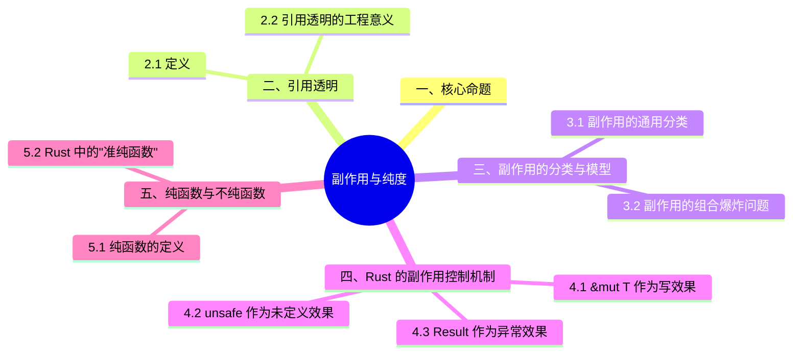

> **内容分级**: [综述级]
>
> **本节关键术语**: 副作用 (Side Effect) · 纯函数 (Pure Function) · 引用（Reference）透明 (Referential Transparency) · 效果系统 (Effect System) · IO — [完整对照表](../../00_meta/01_terminology/01_terminology_glossary.md)
>
# 副作用与纯度：从引用透明到 Rust 的所有权效果
>
> **EN**: Effects and Purity
> **Summary**: Tracking side effects and purity in Rust functions, const contexts, and unsafe boundaries.
> 一个表达式是**引用（Reference）透明**的，当且仅当：在程序的任何位置，该表达式都可以被其计算结果替换，而不改变程序的行为。
> ```text 引用透明: expr ≡ value_of(expr) 在任何上下文中成立```
> **引用（Reference）透明的表达式**:- 纯数学函数：`2 + 3` ≡ `5` - 无副作用的函数：`square(4)` ≡ `16`
> **非引用（Reference）透明的表达式**: - `rand()` — 每次调用结果不同 - `println!("hello")` — 有 IO 副作用 - `x += 1` — 修改存储状态 | 特性 | 引用透明代码 | 非引用透明代码 |
> |:---|:---|:
> **受众**: [初学者]
> **权威来源**: 本文件为 `concept/` 权威页。
> **层级**: L1 基础概念 — 通用编程语言机制
> **A/S/P 标记**: **S** — Structure
> **双维定位**: C×Und — 理解副作用在编程语言中的本质与 Rust 的控制机制
> **前置概念**: [Variable Model](../03_values_and_references/03_variable_model.md) · [Evaluation Strategies](../../04_formal/03_operational_semantics/04_evaluation_strategies.md) · [Ownership](../01_ownership_borrow_lifetime/01_ownership.md)
> **后置概念**: [Borrowing](../01_ownership_borrow_lifetime/02_borrowing.md) · [Effects System](../../07_future/03_preview_features/01_effects_system.md) · [Async](../../03_advanced/01_async/01_async.md)
> **主要来源**: · [Itanium C++ ABI](https://itanium-cxx-abi.github.io/cxx-abi/abi.html)
>
> [Haskell Wiki — Referential Transparency](https://wiki.haskell.org/Referential_transparency) ·
> [Pierce — TAPL, §13](https://www.cis.upenn.edu/~bcpierce/tapl/) ·
> [Moggi 1989 — Computational Lambda-Calculus and Monads](https://doi.org/10.1109/LICS.1989.39155) ·
> [Wadler 1992 — The Essence of Functional Programming](https://doi.org/10.1145/143165.143169) ·
> [Wadler 1995 — Monads for Functional Programming](https://doi.org/10.1007/3-540-59451-5_2)
>
> **来源**: [Reference — Constant Evaluation](https://doc.rust-lang.org/reference/const_eval.html) ·
> [Rust Project Goals — const traits](https://rust-lang.github.io/rust-project-goals/2025h1/const-trait.html)
---

> **Bloom 层级**: L1-L5

---

## 📑 目录

- [副作用与纯度：从引用透明到 Rust 的所有权效果](#副作用与纯度从引用透明到-rust-的所有权效果)
  - [📑 目录](#-目录)
  - [一、核心命题](#一核心命题)
  - [二、引用透明（Referential Transparency）](#二引用透明referential-transparency)
    - [2.1 定义](#21-定义)
    - [2.2 引用透明的工程意义](#22-引用透明的工程意义)
  - [三、副作用的分类与模型](#三副作用的分类与模型)
    - [3.1 副作用的通用分类](#31-副作用的通用分类)
    - [3.2 副作用的组合爆炸问题](#32-副作用的组合爆炸问题)
  - [四、Rust 的副作用控制机制](#四rust-的副作用控制机制)
    - [4.1 `&mut T` 作为写效果（Write Effect）](#41-mut-t-作为写效果write-effect)
    - [4.2 `unsafe` 作为未定义效果（Undefined Effect）](#42-unsafe-作为未定义效果undefined-effect)
    - [4.3 `Result<T, E>` 作为异常效果（Exception Effect）](#43-resultt-e-作为异常效果exception-effect)
    - [4.4 `async` 作为并发效果（Concurrency Effect）](#44-async-作为并发效果concurrency-effect)
  - [五、纯函数与不纯函数](#五纯函数与不纯函数)
    - [5.1 纯函数的定义](#51-纯函数的定义)
    - [5.2 Rust 中的"准纯函数"](#52-rust-中的准纯函数)
  - [六、命令式 vs 函数式范型](#六命令式-vs-函数式范型)
    - [6.1 两种范型的核心差异](#61-两种范型的核心差异)
    - [6.2 Rust 的混合范型定位](#62-rust-的混合范型定位)
  - [七、反例与边界测试](#七反例与边界测试)
    - [7.1 反例：隐式副作用的 C/C++ 陷阱](#71-反例隐式副作用的-cc-陷阱)
    - [7.2 边界测试：`unsafe` 中的副作用逃逸](#72-边界测试unsafe-中的副作用逃逸)
    - [7.3 边界测试：`const fn` 中的副作用逃逸（编译错误）](#73-边界测试const-fn-中的副作用逃逸编译错误)
    - [7.4 边界测试：闭包捕获的副作用](#74-边界测试闭包捕获的副作用)
  - [八、副作用控制机制的跨语言对比矩阵](#八副作用控制机制的跨语言对比矩阵)
  - [九、知识来源关系](#九知识来源关系)
  - [十、边界测试：效果与纯度的编译错误](#十边界测试效果与纯度的编译错误)
    - [10.1 边界测试：`const fn` 中调用非 `const` 方法（编译错误）](#101-边界测试const-fn-中调用非-const-方法编译错误)
    - [10.2 边界测试：`unsafe` 块的传染性与 FFI 边界（编译错误）](#102-边界测试unsafe-块的传染性与-ffi-边界编译错误)
    - [10.3 边界测试：`const fn` 中的堆分配尝试（编译错误）](#103-边界测试const-fn-中的堆分配尝试编译错误)
    - [10.2 边界测试：类型不匹配的基础错误](#102-边界测试类型不匹配的基础错误)
  - [嵌入式测验（Embedded Quiz）](#嵌入式测验embedded-quiz)
    - [测验 1：什么是"引用透明"（Referential Transparency）？纯函数必须具备这一性质吗？（理解层）](#测验-1什么是引用透明referential-transparency纯函数必须具备这一性质吗理解层)
    - [测验 2：Rust 的 `fn` 函数默认是纯函数吗？为什么 `println!` 会让函数不纯？（理解层）](#测验-2rust-的-fn-函数默认是纯函数吗为什么-println-会让函数不纯理解层)
    - [测验 3：`const fn` 在副作用方面有什么限制？（理解层）](#测验-3const-fn-在副作用方面有什么限制理解层)
    - [测验 4：在 Rust 中，"效果系统"（Effect System）主要体现在哪些语言特性上？（理解层）](#测验-4在-rust-中效果系统effect-system主要体现在哪些语言特性上理解层)
    - [测验 5：`Iterator::map` 是惰性的还是急切的？这与纯度和副作用有什么关系？（理解层）](#测验-5iteratormap-是惰性的还是急切的这与纯度和副作用有什么关系理解层)
  - [实践](#实践)
  - [参考来源](#参考来源)
  - [权威来源对照](#权威来源对照)
  - [认知路径](#认知路径)
    - [总结](#总结)
  - [📋 关键属性](#-关键属性)
  - [🔗 概念关系](#-概念关系)
  - [国际权威参考 / International Authority References（P2 生态）](#国际权威参考--international-authority-referencesp2-生态)
  - [相关概念](#相关概念)
  - [🧭 思维导图（Mindmap）](#-思维导图mindmap)

---

## 一、核心命题

> **副作用不是程序的"坏特性"，而是计算与外部世界交互的必要方式。
> Rust 的创新不在于消除副作用，而在于将副作用从隐式（C/C++/Java）提升为显式、可追踪、可组合的类型系统（Type System）契约——`&mut T` 是写效果，`unsafe` 是未定义效果，`async` 是并发效果，`Result` 是异常效果。**

---

## 二、引用透明（Referential Transparency）

引用透明（Referential Transparency）是纯度概念的可判定核心：**一个表达式是引用透明的，当且仅当用它产生的值替换该表达式本身，程序行为不变**。

形式化表述：对任意程序上下文 `C[·]` 与表达式 `e`，若 `C[e]` 与 `C[v]`（其中 `v` 是 `e` 的求值结果）语义等价，则 `e` 引用透明。这一定义直接推出三条工程推论：

1. **等式推理（equational reasoning）成立**：`f(x) + f(x)` 可安全改写为 `let y = f(x); y + y`——重复调用消除、公共子表达式消除、记忆化都以引用透明为前提。
2. **求值顺序无关**：引用透明的子表达式可任意重排、并行化或惰性化，编译器（与读者）无需追踪隐藏依赖。
3. **测试可判定**：替换性质给出了检验纯度的思想实验——「把这次调用换成上次的结果，程序还正确吗？」若否，则函数依赖了调用点之外的状态。

Rust 没有语言级纯度标记（无 `pure` 关键字），引用透明是「代码属性」而非「类型属性」：需要由程序员按定义自查，或在形式化验证（如 Prusti/Creusot 的 `#[pure]` 注解）中显式声明。

### 2.1 定义

一个表达式是**引用（Reference）透明**的，当且仅当：在程序的任何位置，该表达式都可以被其计算结果替换，而不改变程序的行为。

```text
引用透明: expr ≡ value_of(expr) 在任何上下文中成立
```

**引用（Reference）透明的表达式**:

- 纯数学函数：`2 + 3` ≡ `5`
- 无副作用的函数：`square(4)` ≡ `16`

**非引用（Reference）透明的表达式**:

- `rand()` — 每次调用结果不同
- `println!("hello")` — 有 IO 副作用
- `x += 1` — 修改存储状态

### 2.2 引用透明的工程意义

| 特性 | 引用（Reference）透明代码 | 非引用透明代码 |
|:---|:---|:---|
| **等式推理** | 可自由替换等价表达式 | 必须考虑执行顺序和状态 |
| **并行化** | 自动安全（无数据依赖） | 需要同步机制 |
| **测试** | 输入→输出一一对应 | 需要模拟外部状态 |
| **缓存/记忆化** | 结果可安全缓存 | 缓存可能导致错误行为 |
| **调试** | 局部分析即可 | 需要全局状态追踪 |

> **关键洞察**: Haskell 追求全局引用（Reference）透明（所有副作用通过 Monad 显式化）；Rust 采用局部引用透明策略——在函数内部允许副作用，但通过类型系统（Type System）限制副作用的传播范围。[💡 原创分析](../../00_meta/00_framework/methodology.md)

---

## 三、副作用的分类与模型

副作用（side effect）是「表达式求值之外对世界的可观察改变」。Rust 没有效果类型系统，但分类模型仍是推理代码行为的基础工具：

| 类别 | 例子 | Rust 中的可追踪性 |
|:---|:---|:---|
| 内存效果 | 堆分配、`&mut` 修改 | 部分可追踪：`&mut` 独占由借用检查保证，内部可变性是显式例外 |
| IO 效果 | 文件/网络/打印 | 不可静态追踪（无 `IO` 标记），靠 `Result` 提示失败可能 |
| 控制效果 | panic、提前返回 | panic 不可静态追踪（无 `throws` 声明），`catch_unwind` 是边界 |
| 非确定性 | 随机数、时间、线程调度 | 不可静态追踪，测试需注入种子/时钟 |

模型的用途：审查代码时按「效果面」评估测试难度——纯函数（无副作用）测试只需输入输出；IO 效果需要 mock/依赖注入；非确定性需要种子控制。Rust 的所有权系统**消灭了「别名 + 可变」类内存效果的不可追踪性**，这是它相对其他无效果系统语言的实质进步。

### 3.1 副作用的通用分类

| 副作用类别 | 描述 | 典型操作 | Rust 表达 |
|:---|:---|:---|:---|
| **读写状态（State）** | 修改存储中的值 | `x = 5`, `x += 1` | `let mut x = 5; x += 1;` / `*r += 1` |
| **输入输出（IO）** | 与外部系统交互 | `print`, `read_file` | `println!`, `std::fs::read` |
| **异常（Exception）** | 非局部控制流转移 | `throw`, `panic` | `panic!`, `Result::Err`, `?` |
| **非确定性（Nondeterminism）** | 结果不可预测 | `rand`, `thread scheduling` | `std::random`, `tokio::spawn` |
| **时间/并发（Time/Concurrency）** | 执行时序相关 | `sleep`, `lock` | `std::thread::sleep`, `Mutex::lock` |
| **资源管理（Resource）** | 分配/释放资源 | `malloc/free`, `open/close` | `Box::new`, `File::open`（RAII） |
| **控制流（Control）** | 改变执行路径 | `goto`, `break`, `return` | `break`, `return`, `?` |

### 3.2 副作用的组合爆炸问题

在传统的命令式语言中，副作用是**隐式**的——任何函数都可能产生任何副作用，调用者无从得知：

```c
// C: 函数签名不揭示副作用
int process(int x); // 这个函数会修改全局状态吗？会 IO 吗？会抛异常吗？
                      // 不知道！必须阅读实现或文档。
```

Haskell 通过 **Monad** 显式化副作用：

```haskell
-- Haskell: 副作用在类型中显式标注
processPure :: Int -> Int           -- 无副作用，纯函数
processIO :: Int -> IO Int          -- 有 IO 副作用
processState :: Int -> State s Int  -- 有状态副作用
processExcept :: Int -> Either Error Int  -- 可能抛出异常
```

Rust 通过 **所有权（Ownership） + 类型系统（Type System）** 显式化副作用：

```rust,ignore
// Rust: 副作用通过参数类型和返回类型显式表达
fn process_pure(x: i32) -> i32 { x * 2 }  // 无副作用（参数和返回都不涉及效果）

fn process_mut(x: &mut i32) { *x *= 2; }  // 写效果（&mut T 明确表示修改）

fn process_io(path: &str) -> Result<String, io::Error> {
    std::fs::read_to_string(path)  // IO 效果 + 异常效果（Result）
}

fn process_unsafe(ptr: *mut i32) {  // unsafe 块表示未定义效果
    unsafe { *ptr = 42; }
}
```

> **形式化命题** [Tier 3]: Rust 的类型系统（Type System）是一种**效果系统（Effect System）的原型**——`&mut T` = write effect, `unsafe` = undefined effect, `async` = async effect, `Result<T, E>` = exception effect。
>
> **论证**:
> 虽然 Rust 目前没有显式的效果类型（如 Koka 的 `fn f(): <io, state> T`），但其类型签名通过参数和返回类型**隐式编码**了效果信息。
> 这与 Moggi 1989 提出的"通过 Monad 结构显式化计算"的思想同构，但实现方式不同：Haskell 用 Monad 组合子，Rust 用所有权（Ownership）约束。
> [💡 原创分析](../../00_meta/00_framework/methodology.md) · [Moggi 1989] · [Wadler 1992]
>
> **权威来源对齐**:
> Rust 语言团队通过 [Keyword Generics Initiative](https://github.com/rust-lang/keyword-generics-initiative) 明确承认：Rust 自 1.0 起已隐性实现 effect system（`async`、`const`、`try`/`?`、`unsafe` 均为 effect types）。
> 当前工程目标是通过 effect generics 消除函数着色问题导致的 API 重复爆炸。
> [来源: [Rust Keyword Generics Initiative 2024](https://github.com/rust-lang/keyword-generics-initiative/blob/master/updates/2024-02-09-extending-rusts-effect-system.md)] ·
> [来源: [Rust Project Goals 2025H1](https://rust-lang.github.io/rust-project-goals/2025h1/const-trait.html)]
>
> **延伸阅读**: [L7 Effects System 预研](../../07_future/03_preview_features/01_effects_system.md) — Rust 效果系统的完整概念框架、学术谱系与演进路线图

---

## 四、Rust 的副作用控制机制

Rust 没有效果系统（effect system），但通过类型与关键字把四类效果标注在语法表面，形成「穷人效果系统」：

- **`&mut T` 作为写效果（Write Effect）**：可变借用是「本函数会修改该数据」的类型级声明。签名里没有 `&mut` 参数的函数，其可观察副作用范围被类型系统压缩到「内部可变性 + 全局状态」两个已知例外上——读者据此可快速圈定副作用搜索范围。
- **`unsafe` 作为未定义效果（Undefined Effect）**：`unsafe` 块是「此处可能发生类型系统无法约束的行为」的显式边界。它把形式化验证的负担从「全程序」收缩到「unsafe 块及其安全抽象边界」，是 Rust 效果治理的审计单位。
- **`Result<T, E>` 作为异常效果（Exception Effect）**：可恢复错误以返回值编码，「可能失败」是类型的一部分而非隐藏控制流。与 Java checked exception 同目标，但无「包装异常」的逃逸通道。
- **`async` 作为并发效果（Concurrency Effect）**：`async fn` 的返回类型 `impl Future` 使「该函数可挂起」显式化——挂起点（`.await`）是语法可见的，「函数着色」（function coloring）问题因此转化为类型检查问题：在同步上下文调用异步函数是编译错误。

判定一个函数涉及哪些效果，按顺序扫其签名：`&mut` 参数（写）、`unsafe`（未定义）、`Result`/`Option`（失败）、`async`（挂起）——四个标记给出该函数效果面的完整一阶近似。

### 4.1 `&mut T` 作为写效果（Write Effect）

在 Rust 中，任何函数若要修改外部状态，必须显式地接受 `&mut T` 参数：

```rust
// 无副作用函数 —— 签名即证明
fn sum(a: i32, b: i32) -> i32 {
    a + b
}

// 有写效果函数 —— &mut T 在类型中显式标注
fn increment(counter: &mut i32) {
    *counter += 1;
}

// 调用点必须显式提供可变引用
let mut x = 0;
increment(&mut x); // 调用者明确知道 x 会被修改
```

**与 C/C++ 的对比**:

| 语言 | 副作用表达 | 调用者知情度 |
|:---|:---|:---|
| C | `void process(int* x)` | 低 — `x` 可能被修改，也可能只是读取 |
| C++ | `void process(int& x)` | 中 — 引用（Reference）语义暗示修改，但不强制 |
| Java | `void process(int[] x)` | 低 — 数组内容可能被修改 |
| Rust | `fn process(x: &mut i32)` | **高** — 编译器强制 `&mut`，且调用者必须写 `&mut x` |

### 4.2 `unsafe` 作为未定义效果（Undefined Effect）

`unsafe` 块标记了编译器无法验证的副作用边界：

```rust
// safe Rust: 编译器验证所有副作用的合法性
fn safe_access(data: &[i32], index: usize) -> Option<&i32> {
    data.get(index) // 编译器保证不会越界
}

// unsafe Rust: 程序员手动保证副作用的安全性
unsafe fn raw_access(ptr: *const i32, offset: isize) -> i32 {
    *ptr.offset(offset) // 编译器不验证；程序员保证 offset 合法
}
```

**关键设计**: `unsafe` 不是关闭类型系统（Type System），而是**显式声明"此处的效果超出编译器验证范围"**。这与 C/C++ 的默认 unsafe 形成鲜明对比。

### 4.3 `Result<T, E>` 作为异常效果（Exception Effect）

Rust 将异常效果编码在返回类型中：

```rust,ignore
// 显式异常效果: 调用者必须处理 Err 分支
fn may_fail() -> Result<i32, Error> {
    Ok(42)
}

// ? 运算符: 异常效果的传播（类似 Monad 的 bind）
fn compose() -> Result<i32, Error> {
    let a = may_fail()?;  // 若 Err，提前返回 Err
    let b = may_fail()?;  // 若 Err，提前返回 Err
    Ok(a + b)
}
```

**与 Haskell `Either` / Java `try-catch` 的对比**:

| 语言 | 异常效果表达 | 强制处理 |
|:---|:---|:---:|
| Java | `throws Exception` / `try-catch` | ❌ 不强制（运行时（Runtime）可能遗漏） |
| Haskell | `Either Error a` | ✅ 模式匹配（Pattern Matching）强制处理 |
| Rust | `Result<T, E>` | ✅ 编译器强制处理（或通过 `?` 显式传播） |
| C++ | `throw` / `try-catch` / `noexcept` | ❌ 不强制（C++23 `std::expected` 改进） |

### 4.4 `async` 作为并发效果（Concurrency Effect）

`async fn` 将并发效果编码在返回类型中：

```rust,compile_fail
// async 效果: 函数返回 Future，实际计算延迟到 await
async fn fetch_data() -> Vec<u8> {
    // 此函数体不会立即执行！
    // 而是构造一个状态机（Future），等待 executor poll
    vec![]
}

// 调用点必须 await 才能触发实际计算
let data = fetch_data().await;
```

**效果追踪**: `async` 函数不能调用同步阻塞 IO（除非在 `spawn_blocking` 中），因为编译器会阻止跨越 async 边界的错误效果传播。

---

## 五、纯函数与不纯函数

纯函数（pure function）的两个判据：**引用透明**（相同输入永远相同输出，调用可替换为其值）与**无副作用**（求值不产生可观察改变）。在 Rust 语境下：

- **纯函数的典型形态**：`fn add(a: i32, b: i32) -> i32`——编译器可自由重排、缓存、并行化此类调用；`const fn` 是纯函数的编译期强化版；
- **Rust 的「浅层纯度」**：`&self` 方法不修改接收者但可能读全局 `static`、分配堆内存、调用 `HashMap` 的随机化哈希——Rust 的纯度是「**效果受类型约束的纯度**」：`&T` 保证不通过此引用修改（内部可变性除外），但不保证无 IO；
- **工程价值**：纯函数比例高的代码库测试成本低（无 mock）、并发安全（无共享可变状态）、可推理性强（等式推理成立）。

判定准则：函数签名是效果的上界声明——`fn(&T) -> U` 承诺不修改 `T`；看到 `&mut`/`Cell`/`static mut`/IO 类型即知效果面扩大。

### 5.1 纯函数的定义

一个函数是纯函数，当且仅当：

1. **确定性**: 相同输入总是产生相同输出
2. **无副作用**: 不修改外部状态，不进行 IO

```rust,ignore
// 纯函数
fn add(a: i32, b: i32) -> i32 { a + b }

// 不纯函数（非确定性）
fn random_number() -> i32 { rand::random() } // 每次调用结果不同

// 不纯函数（有副作用）
fn log_message(msg: &str) { println!("{}", msg); } // 有 IO 副作用
```

### 5.2 Rust 中的"准纯函数"

Rust 没有全局引用透明的保证，但可以通过类型系统（Type System）识别纯函数：

```rust,compile_fail
// 纯函数的 Rust 签名特征:
// 1. 不接受 &mut T 参数
// 2. 不返回 Result/Option（除非输入包含）
// 3. 不使用 unsafe
// 4. 不调用非纯函数

fn pure_sort<T: Ord>(data: &[T]) -> Vec<T> {
    let mut result = data.to_vec();
    result.sort();
    result
}

// 准纯函数: 接受 &T（只读借用），保证不修改输入
fn sum(data: &[i32]) -> i32 {
    data.iter().sum()
}
```

> **关键洞察**: Rust 的 `&T` 参数类型可以作为**纯度的局部保证**——如果函数只接受 `&T` 参数（没有 `&mut T`、没有 `unsafe`、没有 IO 类型），则该函数对调用者而言是纯的（不修改调用者的状态）。这是 Rust 在"命令式语言"和"纯函数式语言"之间找到的中间地带。[💡 原创分析](../../00_meta/00_framework/methodology.md)

---

## 六、命令式 vs 函数式范型

Rust 在两种范型之间的位置是「**函数式内核 + 命令式外壳**」：

| 维度 | 命令式 | 函数式 | Rust 的选择 |
|:---|:---|:---|:---|
| 数据默认 | 可变 | 不可变 | 不可变（`let` 默认，可变需 `mut`） |
| 迭代 | 循环语句 | map/filter/fold | 迭代器链（惰性好组合）+ 循环（灵活）双轨 |
| 效果管理 | 随处允许 | 类型标记（IO/Monad） | 所有权约束 + `Result` 显式失败 |
| 控制流 | 语句 | 表达式 | 一切皆表达式（`if`/`match`/`loop` 有值） |

关键洞察：Rust 用**所有权**替代了函数式语言用**不可变数据**解决的问题——「无别名 + 可变」与「有别名 + 不可变」同样安全，但前者允许原地更新（无持久化数据结构的 GC 压力）。这是 Rust 对系统编程范型的核心贡献：函数式的推理强度，命令式的内存效率。

### 6.1 两种范型的核心差异

| 维度 | 命令式范型（C/C++/Java/Rust） | 函数式范型（Haskell/ML） |
|:---|:---|:---|
| **核心抽象** | 存储 + 指令序列 | 表达式 + 函数应用 |
| **状态管理** | 显式变量赋值 | 递归 + 高阶函数 |
| **控制流** | `if/for/while/break` | 模式匹配（Pattern Matching） + 递归 + 高阶函数 |
| **副作用** | 默认允许 | 默认禁止（Monad 显式化） |
| **求值顺序** | 严格 + 语句顺序 | 非严格 / 惰性（Haskell） |
| **类型系统（Type System）** | 名义类型 + 子类型 | 代数数据类型 + 参数多态 |

### 6.2 Rust 的混合范型定位

Rust 是**命令式核心 + 函数式特性 + 代数类型系统（Type System）**的混合体：

```rust
// 命令式: 可变状态 + 循环
fn imperative_sum(data: &[i32]) -> i32 {
    let mut total = 0;
    for x in data {
        total += x;
    }
    total
}

// 函数式: 不可变 + 高阶函数
fn functional_sum(data: &[i32]) -> i32 {
    data.iter().fold(0, |acc, x| acc + x)
}

// 两者等价，Rust 编译器生成相同的机器码（零成本抽象）
```

**代数数据类型（ADT）的函数式遗产**:

```rust,compile_fail
// Rust 的 enum = 代数数据类型（来自 ML/Haskell）
enum Option<T> {
    Some(T),  // 构造函数 = 值构造子
    None,     // 单元构造子
}

// 模式匹配 = 函数式语言的 case 分析
fn unwrap_or_default(opt: Option<i32>) -> i32 {
    match opt {
        Some(x) => x,  // 解构构造函数
        None => 0,     // 穷尽所有变体
    }
}
```

> **关键洞察**: Rust 通过**所有权（Ownership）系统**将函数式语言的"引用透明"理念部分地带入命令式世界：在 `&T` 借用（Borrowing）的范围内，数据不可变，函数调用具有局部引用透明性。[💡 原创分析](../../00_meta/00_framework/methodology.md)

---

## 七、反例与边界测试

本节的反例展示「效果失控」的典型形态与 Rust 的防线：

- **别名 + 可变的效果灾难**（C 风格）：两个指针同时修改同一内存，行为依赖访问顺序——Rust 防线：借用检查在编译期拒绝，此反例在 Rust 中**不可表达**；
- **内部可变性的边界**：`RefCell` 在运行期检测借用冲突（`BorrowMutError` panic）——把静态检查换成动态检查，单线程下安全但失去编译期保证；`Cell` 无检查但仅限 `Copy` 语义；
- **隐藏的 IO 效果**：日志库在 `Display::fmt` 中写文件——「纯」接口下的效果泄漏，测试时难以察觉；防线是代码审查 + 效果面文档约定；
- **panic 作为控制流**：用 panic 实现正常错误路径——防线是 `catch_unwind` 的 `UnwindSafe` 门槛与团队规范。

每个反例附「效果面分析表」，训练「看到签名即列出可能效果」的审查反射。

### 7.1 反例：隐式副作用的 C/C++ 陷阱

```rust,ignore
// Rust 编译器阻止隐式副作用
fn implicit_side_effect() {
    let x = 5;
    let r = &x;
    // x = 6; // ❌ 编译错误: cannot assign to `x` because it is borrowed
    println!("{}", r); // 如果允许 x = 6，r 将成为空悬引用
}

// C++ 等价代码（编译通过，运行时 UB）
// int x = 5;
// int* r = &x;
// x = 6; // C++ 允许！r 仍然指向 x，但语义已混乱
// std::cout << *r;
```

> **关键洞察**: C++ 允许在存在别名的情况下修改数据，导致语义混乱；Rust 的 borrow checker 在编译期阻止此类隐式副作用。来源: [RustBelt — POPL 2018](https://plv.mpi-sws.org/rustbelt/popl18/) ✅

### 7.2 边界测试：`unsafe` 中的副作用逃逸

```rust,ignore
// 边界测试: unsafe 块内的副作用不受编译器验证
fn unsafe_effect_escape() {
    let mut x = 5;
    let r = &x as *const i32;

    unsafe {
        // 通过裸指针修改 x，绕过了 &x 的不可变借用
        *(r as *mut i32) = 6; // UB! 违反了 &x 的不可变性契约
    }

    println!("{}", x); // 未定义行为！
}
```

> **边界洞察**: `unsafe` 块允许副作用"逃逸"类型系统（Type System）的约束。这是 Rust 设计中唯一的效果逃逸口——Safe Rust 保证无副作用逃逸，Unsafe Rust 将保证责任转移给程序员。[NOM — What is unsafe?](https://doc.rust-lang.org/nomicon/) ✅

### 7.3 边界测试：`const fn` 中的副作用逃逸（编译错误）

```rust,ignore
const fn impure_const() -> i32 {
    let mut x = 0;
    x += 1; // ❌ 编译错误: cannot mutate `x` in a `const fn`
    // const fn 中不允许可变绑定和副作用
    x
}
```

> **边界洞察**: `const fn` 是 Rust 中纯度要求最严格的上下文——不允许可变变量、不允许堆分配、不允许非 `const` 操作。任何副作用尝试都会在编译期被拒绝。这构成了 Rust 效果系统的"核心纯净区"。来源: [Rust Reference — §6.10.1 const contexts](https://doc.rust-lang.org/reference/introduction.html) ✅

### 7.4 边界测试：闭包捕获的副作用

```rust
fn closure_effect() {
    let mut counter = 0;

    // 闭包捕获 &mut counter，副作用被限制在闭包内部
    let mut increment = || { counter += 1; };

    increment(); // counter = 1
    increment(); // counter = 2

    // 闭包生命周期结束后，counter 恢复可访问
    println!("{}", counter); // ✅ 2
}
```

> **认知功能**: 此示例展示了 Rust 如何通过闭包（Closures）类型（`Fn`, `FnMut`, `FnOnce`）将副作用限制在明确的边界内。`FnMut` = 可修改捕获的环境，`Fn` = 只读环境，`FnOnce` = 消费环境。来源: [Rust Reference — §8.2.13 Closure expressions](https://doc.rust-lang.org/reference/introduction.html) ✅

---

## 八、副作用控制机制的跨语言对比矩阵

| 语言 | 状态副作用 | IO 副作用 | 异常副作用 | 并发副作用 | 核心机制 |
|:---|:---|:---|:---|:---|:---|
| **C** | 无约束 | 无约束 | `setjmp/longjmp` | `pthread` | 无 |
| **C++** | 无约束 | 无约束 | `try/catch/throw` | `std::thread` | RAII |
| **Java** | 无约束 | 无约束 | `try/catch/throw` | `synchronized` | GC |
| **Haskell** | `State` Monad | `IO` Monad | `Either` / `Maybe` | `IO` / `STM` | Monad + 惰性 |
| **Rust** | `&mut T` / `Cell` / `RefCell` | 普通函数（无特殊标记） | `Result<T, E>` | `async` / `Send`/`Sync` | 所有权（Ownership） + 借用（Borrowing） |

> **关键洞察**: Haskell 通过**Monad 组合子**将副作用完全显式化；Rust 通过**所有权（Ownership）约束**在类型层面部分显式化副作用。两者殊途同归——目标都是让副作用"可见、可追踪、可组合"。Rust 的选择更适合系统编程：零运行时（Runtime）开销、与命令式代码无缝集成。[💡 原创分析](../../00_meta/00_framework/methodology.md)

---

## 九、知识来源关系

| **论断** | **来源** | **可信度** | **Tier** |
|:---|:---|:---:|:---:|
| 引用透明定义 | [Quine 1960] · [Haskell Wiki] | ✅ | Tier 1 |
| 副作用分类 | [Moggi 1989] · [Peyton Jones & Wadler 1993] | ✅ | Tier 1 |
| Monad 显式化副作用 | [Moggi 1989] · [Wadler 1992] | ✅ | Tier 1 |
| Rust 效果系统原型 | [RustBelt — POPL 2018](https://plv.mpi-sws.org/rustbelt/popl18/) · 原创分析 | ✅/💡 | Tier 3 |
| `&mut T` 作为写效果 | [Rust Reference](https://doc.rust-lang.org/reference/introduction.html) · [RustBelt — POPL 2018](https://plv.mpi-sws.org/rustbelt/popl18/) | ✅ | Tier 2 |
| 纯函数局部保证 | [💡 原创分析] | ⚠️ | Tier 3 |
| 跨语言副作用对比矩阵 | [💡 原创分析] | ⚠️ | Tier 3 |

---

> **权威来源**:
> [Rust Reference](https://doc.rust-lang.org/reference/introduction.html) ·
> [Rustonomicon](https://doc.rust-lang.org/nomicon/index.html) ·
> [Moggi 1989 — Computational Lambda-Calculus and Monads](https://person.dibris.unige.it/moggi-eugenio/ftp/ic91.pdf) ·
> [Wadler 1992 — The Essence of Functional Programming](https://dl.acm.org/doi/10.1145/143165.143169) ·
> [RustBelt POPL 2018](https://plv.mpi-sws.org/rustbelt/popl18/)
> **文档版本**: 1.0
> **Rust 版本**: 1.97.0+ (Edition 2024)
> **最后更新**: 2026-05-24
> **状态**: ✅ 新建 — 通用 PL 基座层

## 十、边界测试：效果与纯度的编译错误

效果与纯度的编译错误验证一条总原则：**声明的效果边界不能被实现突破**——类型系统把「承诺」与「实现」的一致性做成可判定检查：

- **`const fn` 中调用非 `const` 方法**（E0015）：`const fn` 承诺「可在编译期求值」，其实现中调用非 const 函数、堆分配（`Box::new`、格式化等，分配在编译期求值语境不可表达）即违反承诺，编译期拒绝。常量求值的效果面被严格限制为「纯计算 + 有限循环」。
- **`unsafe` 块的传染性与 FFI 边界**：`unsafe fn` 的调用必须置于 `unsafe` 块内（E0133）——「未定义效果」在调用链上显式传递，不允许静默跨越安全边界；FFI（`extern "C" fn` 调用）同理。错误信息指向的正是效果声明缺失的位置。
- **`const fn` 中的堆分配尝试**：分配行为隐含「与全局分配器交互」这一效果，编译期语境无分配器，故被拒绝（stable 上 `const` 堆分配仍未开放）。

判定一个纯度相关错误，先识别被破坏的承诺类型（const 可求值性 / unsafe 边界 / 类型一致性），错误码只是承诺-实现不一致的投影。

### 10.1 边界测试：`const fn` 中调用非 `const` 方法（编译错误）

```rust,compile_fail
struct Counter {
    value: i32,
}

impl Counter {
    fn new(v: i32) -> Self {
        Self { value: v }
    }
}

const fn make_counter() -> Counter {
    // ❌ 编译错误: `Counter::new` 不是 const fn
    // const fn 只能调用其他 const fn
    Counter::new(42)
}

// 正确: 将 new 标记为 const fn
impl Counter {
    const fn new_const(v: i32) -> Self {
        Self { value: v } // ✅ const fn 构造函数
    }
}

const fn make_counter_fixed() -> Counter {
    Counter::new_const(42) // ✅ 调用 const fn
}
```

> **修正**: `const fn` 的效果约束限制其只能调用其他 `const fn`、使用常量、执行基本控制流。任何涉及堆分配、I/O、可变静态变量的操作都被禁止。这与 Haskell 的 `IO` monad 或纯函数语言的效果追踪类似——Rust 通过 `const` 关键字在编译期划分"纯计算"与"效果ful计算"的边界。[来源: [Rust Reference](https://doc.rust-lang.org/reference/introduction.html)]

### 10.2 边界测试：`unsafe` 块的传染性与 FFI 边界（编译错误）

```rust,compile_fail
extern "C" {
    fn c_malloc(size: usize) -> *mut u8;
    fn c_free(ptr: *mut u8);
}

fn safe_wrapper(size: usize) -> Vec<u8> {
    // ❌ 编译错误: call to unsafe function is unsafe and requires unsafe function or block
    // 即使包装为安全函数，内部仍需 unsafe 块
    let ptr = c_malloc(size);
    Vec::from_raw_parts(ptr, size, size)
}

// 正确: 显式标记 unsafe 块
fn safe_wrapper_fixed(size: usize) -> Vec<u8> {
    let ptr = unsafe { c_malloc(size) };
    if ptr.is_null() {
        panic!("allocation failed");
    }
    unsafe { Vec::from_raw_parts(ptr, 0, size) } // ✅ unsafe 块明确标记
}
```

> **修正**:
> `unsafe` 效果具有"传染性"——调用 `unsafe fn` 或解引用裸指针必须在 `unsafe` 块内进行。
> 但 `unsafe` 块**不自动**使周围代码变为 unsafe；它只是告诉编译器"程序员已验证此处的安全性"。
> 将 unsafe 操作包装为安全 API 时，必须确保所有 unsafe 前置条件在函数体内被满足（如空指针检查、长度验证、生命周期（Lifetimes）保证）。这是 Rust 安全抽象的核心契约。
> [来源: [Rustonomicon](https://doc.rust-lang.org/nomicon/index.html)]

### 10.3 边界测试：`const fn` 中的堆分配尝试（编译错误）

```rust,compile_fail
const fn allocate() -> Vec<i32> {
    // ❌ 编译错误: 不能在 const fn 中使用堆分配
    vec![1, 2, 3]
}

fn main() {
    let _v = allocate();
}
```

> **修正**:
> `const fn` 有严格的**编译期求值**限制：
>
> 1) 不能分配堆内存（`Vec::new()`、`Box::new()`）；
> 2) 不能调用非 `const fn`；
> 3) 不能进行 I/O 或随机数生成；
> 4) 不能有 `unsafe` 块。但 1.83+ 中 `const fn` 已支持 `mut` 绑定、循环、`if let`、解构赋值等。
>
> 未来演进：`const fn` 可能支持有限的堆分配（`const Heap` 提案），但当前受限。
> 这与 C++ 的 `constexpr`（C++20 支持堆分配和虚函数）或 D 的 `enum` 强制编译期求值不同——Rust 的 `const` 系统保守但逐步扩展，每次扩展需确保编译期求值的可判定性。
> [来源: [Rust Reference — const fn](https://doc.rust-lang.org/reference/items/functions.html#const-functions)] ·
> [来源: [Rust Const Eval](https://doc.rust-lang.org/reference/const_eval.html)]

### 10.2 边界测试：类型不匹配的基础错误

```rust,compile_fail
fn main() {
    // ❌ 编译错误: 类型不匹配
    let x: i32 = "hello";
}
```

> **修正**:
> **类型不匹配**是 Rust 最常见的编译错误：
>
> 1) `let x: i32 = "hello"` — `&str` 不能隐式转为 `i32`；
> 2) Rust 无隐式类型转换（C/Java 的自动转换）；
> 3) 需显式转换：`"42".parse::<i32>().unwrap()` 或 `42i32.to_string()`。

## 嵌入式测验（Embedded Quiz）

「嵌入式测验（Embedded Quiz）」涉及测验 1：什么是"引用透明"（Referential Transpar…、测验 2：Rust 的 `fn` 函数默认是纯函数吗？为什么 `pri…、测验 3：`const fn` 在副作用方面有什么限制？（理解层）、测验 4：在 Rust 中，"效果系统"（Effect System）…等5个方面，本节逐一说明其要点。

### 测验 1：什么是"引用透明"（Referential Transparency）？纯函数必须具备这一性质吗？（理解层）

**题目**: 什么是"引用透明"（Referential Transparency）？纯函数必须具备这一性质吗？

<details>
<summary>✅ 答案与解析</summary>

引用透明指表达式可被其值替换而不改变程序行为。纯函数必须具备：给定相同输入，总产生相同输出且无副作用。
</details>

---

### 测验 2：Rust 的 `fn` 函数默认是纯函数吗？为什么 `println!` 会让函数不纯？（理解层）

**题目**: Rust 的 `fn` 函数默认是纯函数吗？为什么 `println!` 会让函数不纯？

<details>
<summary>✅ 答案与解析</summary>

不是。Rust 不强制函数纯度。`println!` 产生 IO 副作用（向标准输出写数据），破坏了引用透明性。
</details>

---

### 测验 3：`const fn` 在副作用方面有什么限制？（理解层）

**题目**: `const fn` 在副作用方面有什么限制？

<details>
<summary>✅ 答案与解析</summary>

`const fn` 在编译期求值，不能执行 IO、不能分配堆内存、不能调用非 `const` 函数，因此天然无副作用。
</details>

---

### 测验 4：在 Rust 中，"效果系统"（Effect System）主要体现在哪些语言特性上？（理解层）

**题目**: 在 Rust 中，"效果系统"（Effect System）主要体现在哪些语言特性上？

<details>
<summary>✅ 答案与解析</summary>

主要体现在 `unsafe`（标记不安全效果）、`async`（标记异步（Async）效果）、`const`（标记编译期效果），通过类型系统（Type System）显式标记效果。
</details>

---

### 测验 5：`Iterator::map` 是惰性的还是急切的？这与纯度和副作用有什么关系？（理解层）

**题目**: `Iterator::map` 是惰性的还是急切的？这与纯度和副作用有什么关系？

<details>
<summary>✅ 答案与解析</summary>

`map` 是惰性的，返回新迭代器（Iterator）而不立即执行。副作用（如闭包（Closures）中的 `println!`）直到迭代被消费时才发生，可能导致意外的执行顺序。
</details>

## 实践

> **相关资源**:
>
> - [crates/ 示例代码](../crates) — 与本文概念对应的可编译示例
> - [exercises/ 练习](../exercises) — 动手编程挑战
> - [MVP 学习路径](../../00_meta/04_navigation/08_learning_mvp_path.md) — 从零到多线程 CLI 的 40 小时路径
>
> **建议**: 阅读完本概念文件后，打开对应 crate 的示例代码，尝试修改并运行。完成至少 1 道相关练习以巩固理解。

## 参考来源

> [来源: [ICFP 2014 — Extensible Effects](https://dl.acm.org/doi/10.1145/2628136.2628161)]
> [来源: [Haskell — IO Monad](https://www.haskell.org/tutorial/io.html)]
> [来源: [Rust [RFC 2593](https://github.com/rust-lang/rfcs/pull/2593) — Effects](https://rust-lang.github.io/rfcs/index.html)]
> [来源: [Rust Reference — Const Evaluation](https://doc.rust-lang.org/reference/const_eval.html)]
> [来源: [Rust Unsafe Code Guidelines](https://rust-lang.github.io/unsafe-code-guidelines/)]
> **权威来源**:
> [Rust Reference](https://doc.rust-lang.org/reference/introduction.html) ·
> [The Rust Programming Language](https://doc.rust-lang.org/book/title-page.html) ·
> [Rust Standard Library](https://doc.rust-lang.org/std/index.html) ·
> [Rust RFCs](https://rust-lang.github.io/rfcs/index.html)

## 权威来源对照

| 来源 | 与本节对应的核心论点 |
|:---|:---|
| [Haskell Wiki — Referential Transparency](https://wiki.haskell.org/Referential_transparency) | 引用透明性的定义与函数式编程实践 |
| [Pierce — TAPL, §13](https://www.cis.upenn.edu/~bcpierce/tapl/) | 引用类型与副作用的类型系统（Type System）形式化 |
| [Moggi 1989 — Computational Lambda-Calculus and Monads](https://doi.org/10.1109/LICS.1989.39155) | 通过 monad 结构化计算效果的奠基工作 |
| [Wadler 1992 — The Essence of Functional Programming](https://doi.org/10.1145/143165.143169) | 将 monad 引入函数式编程以处理 IO 与状态 |
| [Wadler 1995 — Monads for Functional Programming](https://doi.org/10.1007/3-540-59451-5_2) | monad 作为“可组合效果”的教学推导 |
| [Rust Reference — Constant Evaluation](https://doc.rust-lang.org/reference/const_eval.html) | Rust `const` 上下文的求值限制 |
| [Rust Project Goals — const traits](https://rust-lang.github.io/rust-project-goals/2025h1/const-trait.html) | Rust 效果系统向编译期扩展的路线 |

## 认知路径

> **认知路径**: 从 L0 基础概念出发，经由本节的 **副作用与纯度：从引用透明到 Rust 的所有权（Ownership）效果** 核心原理，通向 L2 进阶模式与 L3 工程实践。

### 总结

- **L1**：副作用改变程序状态或产生可观察的 IO；纯函数满足引用透明，可被安全替换为结果。
- **L2**：Rust 通过 `const`、`unsafe` 边界和所有权（Ownership）系统，把效果限制在显式标记的区域内；`const fn` 是无副作用计算的核心工具。
- **L3**：效果系统（effect system）是类型安全与编译期优化的共同基础；Rust 的 `const` 泛化和未来 effect 特性正在把“无副作用”从约定推向类型系统的一部分。

---

## 📋 关键属性

| 属性 | 取值 / 判定 | 依据 |
|---|---|---|
| 引用透明 | 表达式可由其值替换而不改变程序语义；Rust 的纯子集满足 | 本文 §二 |
| 副作用分类 | 写效果 / 异常效果 / 并发效果 / 未定义效果四类 | 本文 §3.1 |
| Rust 效果标记 | `&mut T`、`Result<T, E>`、`async`、`unsafe` 分别承载四类效果 | 本文 §四 |
| const 纯度 | `const fn` 禁止非 const 调用与堆分配，编译期强制 | 本文 §十 边界测试 |
| 范型定位 | 混合范型：命令式语法外壳 + 函数式推理保证 | 本文 §6.2 |

## 🔗 概念关系

- **上位（is-a）**：编程语言语义学中的效果与纯度理论。
- **下位（实例）**：引用透明、纯函数、写效果（`&mut`）、异常效果（`Result`）、并发效果（`async`）。
- **对偶**：纯函数 ⇄ 不纯函数（本文 §五 的判定边界）。
- **组合**：与 [所有权](../01_ownership_borrow_lifetime/01_ownership.md)（别名×可变性控制写效果）、[错误处理](../../02_intermediate/03_error_handling/01_error_handling.md)（`Result` 异常效果）组合。
- **依赖**：语义底座见 [变量模型](../03_values_and_references/03_variable_model.md)。

---

## 国际权威参考 / International Authority References（P2 生态）

> 依据 `AGENTS.md` §2「对齐网络国际化权威内容」补充：仅追加已验证可达的权威链接，不改动正文事实。

- **P2 生态/社区**: [docs.rs/effing-mad — 生态权威 API 文档（Rust 效果处理 effect handlers 实验 crate）](https://docs.rs/effing-mad)（2026-07-12 验证 HTTP 200）

---

## 相关概念

- [对应测验](../11_quizzes/29_quiz_pl_foundations.md) — 通用 PL 基座（变量模型、求值策略、效果、控制流、数据抽象）

## 🧭 思维导图（Mindmap）


