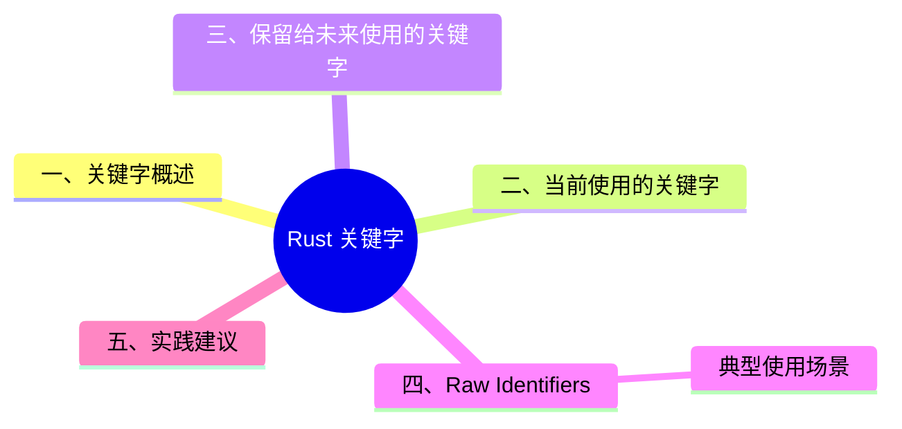

> **内容分级**: [综述级]
>
# Rust 关键字（Keywords）

> **EN**: Keywords
> **Summary**: Rust 中保留给当前或未来语言使用的关键字列表，以及 raw identifier（原始标识符）用法。 List of keywords reserved for current or future use in Rust, plus raw identifier usage.
> **Rust 版本**: 1.97.0+ (Edition 2024)
>
> **受众**: [初学者]
> **Bloom 层级**: L1-L2
> **权威来源**: 本文件为 `concept/` 权威页。
> **A/S/P 标记**: **S** — Specification / Language syntax
> **双维定位**: S×Lang — 语言词法与语法
> **前置依赖**: [Identifiers and Names](../03_values_and_references/03_variable_model.md) · [Terminology Glossary](../../00_meta/01_terminology/01_terminology_glossary.md)
> **后置概念**: [Attributes and Macros](../09_macros_basics/01_attributes_and_macros.md) · [Modules and Paths](../07_modules_and_items/01_modules_and_paths.md)
> **定理链**: N/A — 参考级文档
> **主要来源**: [Rust Reference — Keywords](https://doc.rust-lang.org/reference/keywords.html) · [Kohlbecker et al. — Hygienic Macro Expansion](https://doi.org/10.1145/41625.41632) · [Flatt — Binding as Sets of Scopes](https://doi.org/10.1145/2814304.2814305) · [Brown University — Concepts in Rust Programming](https://cel.cs.brown.edu/crp/) · [Unicode UAX #31 — Identifier and Pattern Syntax](https://www.unicode.org/reports/tr31/) · [Jung et al. — RustBelt: Securing the Foundations of Rust](https://plv.mpi-sws.org/rustbelt/popl18/)

>
> **来源**: [TRPL — Appendix A: Keywords](https://doc.rust-lang.org/book/appendix-01-keywords.html) · [Rust Reference — Keywords](https://doc.rust-lang.org/reference/keywords.html)

---
> **权威来源**: [Rust Reference — Keywords](https://doc.rust-lang.org/reference/keywords.html) · [TRPL — Appendix A: Keywords](https://doc.rust-lang.org/book/appendix-01-keywords.html)
>
> **权威来源对齐变更日志**: 2026-07-10 补充权威来源标注（Rust Reference、TRPL）

---

## 📑 目录

- [Rust 关键字（Keywords）](#rust-关键字keywords)
  - [📑 目录](#-目录)
  - [一、关键字概述](#一关键字概述)
  - [二、当前使用的关键字](#二当前使用的关键字)
  - [三、保留给未来使用的关键字](#三保留给未来使用的关键字)
  - [四、Raw Identifiers](#四raw-identifiers)
    - [典型使用场景](#典型使用场景)
  - [五、实践建议](#五实践建议)
  - [六、相关概念](#六相关概念)
  - [📋 关键属性](#-关键属性)
  - [🔗 概念关系](#-概念关系)
  - [国际权威参考 / International Authority References（P1 学术 · P2 生态）](#国际权威参考--international-authority-referencesp1-学术--p2-生态)
  - [嵌入式测验（Embedded Quiz）](#嵌入式测验embedded-quiz)
    - [测验 1：保留关键字（🟢 基础）](#测验-1保留关键字-基础)
    - [测验 2：Raw Identifier 与跨 Edition 调用（🟡 进阶）](#测验-2raw-identifier-与跨-edition-调用-进阶)
    - [测验 3：Raw Identifier 的使用边界（🔴 专家，联动「实践建议」）](#测验-3raw-identifier-的使用边界-专家联动实践建议)
  - [⚠️ 反例与陷阱：关键字用作标识符](#️-反例与陷阱关键字用作标识符)
  - [🧭 思维导图（Mindmap）](#-思维导图mindmap)

---

## 一、关键字概述

关键字（keywords）是 Rust 保留给语言本身使用的词，**不能用作标识符**（变量名、函数名、类型名等），除非使用 **raw identifier** 语法 `r#`。

标识符包括：函数、变量、参数、struct 字段、模块（Module）、crate、常量、宏（Macro）、静态值、属性、类型、trait、生命周期（Lifetimes）的名字。

---

## 二、当前使用的关键字

| 关键字 | 作用 |
|:---|:---|
| `as` | 原始类型转换、trait 消歧、`use` 重命名 |
| `async` | 返回 `Future` 而非阻塞当前线程 |
| `await` | 挂起执行直到 `Future` 就绪 |
| `break` | 立即退出循环 |
| `const` | 定义常量或常量原始指针（Raw Pointer） |
| `continue` | 跳到下一次循环迭代 |
| `crate` | 模块（Module）路径中指代 crate root |
| `dyn` | trait object 动态分发 |
| `else` | `if` / `if let` 的 fallback 分支 |
| `enum` | 定义枚举（Enum） |
| `extern` | 链接外部函数或变量 |
| `false` | 布尔假字面量 |
| `fn` | 定义函数或函数指针类型 |
| `for` | 迭代循环、trait 实现、高阶生命周期（Lifetimes） |
| `if` | 条件分支 |
| `impl` | 实现 inherent 或 trait 功能 |
| `in` | `for` 循环语法的一部分 |
| `let` | 绑定变量 |
| `loop` | 无条件循环 |
| `match` | 模式匹配（Pattern Matching） |
| `mod` | 定义模块（Module） |
| `move` | 使闭包（Closures）获取所有捕获变量的所有权（Ownership） |
| `mut` | 标注引用（Reference）、原始指针（Raw Pointer）或模式绑定的可变性 |
| `pub` | 标注 struct 字段、`impl` 块或模块（Module）的公开可见性 |
| `ref` | 按引用（Reference）绑定 |
| `return` | 从函数返回 |
| `Self` | 正在定义或实现的类型的别名 |
| `self` | 方法接收者或当前模块（Module） |
| `static` | 全局变量或贯穿整个程序执行的生命周期（Lifetimes） |
| `struct` | 定义结构体（Struct） |
| `super` | 当前模块（Module）的父模块 |
| `trait` | 定义 trait |
| `true` | 布尔真字面量 |
| `type` | 定义类型别名或关联类型 |
| `union` | 定义 union（仅在 union 声明中是关键字） |
| `unsafe` | 标注 unsafe 代码、函数、trait 或实现 |
| `use` | 将符号引入作用域 |
| `where` | 标注类型约束从句 |
| `while` | 条件循环 |

---

## 三、保留给未来使用的关键字

以下关键字目前没有功能，但被 Rust 保留以备将来使用：

| 关键字 | 备注 |
|:---|:---|
| `abstract` | 潜在用于抽象类型 |
| `become` | 潜在用于尾调用/转换语义 |
| `box` | 与堆分配相关的历史保留 |
| `do` | 潜在用于 do-notation |
| `final` | 潜在用于不可覆写 |
| `gen` | 潜在用于生成器语法 |
| `macro` | 潜在用于宏（Macro）相关保留 |
| `override` | 潜在用于覆写标记 |
| `priv` | 潜在用于私有性 |
| `try` | 2018+ 版本中为保留关键字 |
| `typeof` | 潜在用于类型查询 |
| `unsized` | 潜在用于 unsized 类型标记 |
| `virtual` | 潜在用于虚方法 |
| `yield` | 潜在用于生成器 yield |

---

## 四、Raw Identifiers

> (Source: [TRPL — Appendix A: Keywords](https://doc.rust-lang.org/book/appendix-01-keywords.html))
（原始标识符）

使用 `r#` 前缀可以将关键字当作普通标识符使用。

```rust
fn r#match(needle: &str, haystack: &str) -> bool {
    haystack.contains(needle)
}

fn main() {
    assert!(r#match("foo", "foobar"));
}
```

### 典型使用场景

1. **与使用关键字作为名称的代码集成**：例如旧版库使用了 `try` 作为函数名。
2. **跨 Edition 调用**：`try` 在 2015 Edition 不是关键字，但在 2018/2021/2024 中是保留关键字。调用 2015 Edition 库中的 `try` 函数时需要 `r#try`。

> **注意**：raw identifier 只影响词法层面，类型/函数名在编译后不再带有 `r#`。

---

## 五、实践建议

1. **避免使用关键字作为标识符**，即使 raw identifier 允许。
2. **跨 edition 依赖时留意保留关键字变化**：2015 → 2018 的 `try`、`async`、`await` 等。
3. **宏（Macro）生成代码中可能需要 raw identifier**：当宏接收用户输入并需要生成以关键字命名的字段/变量时。

---

## 六、相关概念

| 概念 | 关系 |
|:---|:---|
| [Modules and Paths](../07_modules_and_items/01_modules_and_paths.md) | `crate`、`self`、`super` 用于路径 |
| [Attributes and Macros](../09_macros_basics/01_attributes_and_macros.md) | 宏（Macro）可能生成以关键字命名的标识符 |
| [Control Flow](../04_control_flow/01_control_flow.md) | `if`、`else`、`match`、`loop`、`while`、`for`、`break`、`continue` 控制流关键字 |

---

## 📋 关键属性

| 属性 | 取值 / 判定 | 依据 |
|---|---|---|
| 关键字分档 | 当前使用关键字 / 保留关键字 / 弱关键字三档 | 本文 §二–§三 |
| 转义机制 | `r#` raw identifier 允许把关键字用作标识符 | 本文 §四 |
| Edition 演化 | 新关键字按 edition 引入（如 `gen` 保留），raw id 保证跨 edition 互操作 | 本文 §三–§四 |
| 语法地位 | 关键字不可作为普通标识符，宏（Macro）卫生需特殊处理 | Rust Reference 词法章 |

## 🔗 概念关系

- **上位（is-a）**：Rust 词法与语法表层（lexical layer）的保留词集合。
- **下位（实例）**：`fn` / `let` / `match` / `async` / `unsafe` 等现行关键字，`gen` 等保留关键字。
- **组合**：与 [运算符与符号](07_operators_and_symbols.md) 共同构成 Rust 词法表层全貌。
- **依赖**：宏展开需区分关键字与标识符，见 [宏卫生](../../03_advanced/03_proc_macros/09_macro_hygiene.md)。

---

## 国际权威参考 / International Authority References（P1 学术 · P2 生态）

> 依据 `AGENTS.md` §2「对齐网络国际化权威内容」补充：仅追加已验证可达的权威链接，不改动正文事实。

- **P2 生态/社区**: [docs.rs/regex — 生态权威 API 文档](https://docs.rs/regex) · [docs.rs/serde_json — 生态权威 API 文档](https://docs.rs/serde_json)

---

## 嵌入式测验（Embedded Quiz）

> W3-b 补充（2026-07-13）：本页原无嵌入式测验，按四级题型规范补 3 题（🟢🟡🔴 各 1 题，`<details>` 折叠答案），内容与本页正文严格一致；测验 3 与本页「实践建议」反例（raw identifier 误用）联动。

### 测验 1：保留关键字（🟢 基础）

下列哪个关键字属于"保留给未来使用"（当前无功能）？

- A. `match`
- B. `gen`
- C. `async`
- D. `use`

<details>
<summary>✅ 答案</summary>

**B 正确**。按本页「保留给未来使用的关键字」表，`gen` 被保留、潜在用于生成器语法（Edition 2024 起 `gen` 成为保留关键字）；`abstract`、`become`、`box`、`do`、`final`、`macro`、`try`、`yield` 等同属保留表。A/C/D 均为现行有效关键字。

</details>

---

### 测验 2：Raw Identifier 与跨 Edition 调用（🟡 进阶）

以下代码的编译判断，哪项正确？

```rust,ignore
// 当前 crate 为 Edition 2021，调用某 2015 Edition 旧库中的函数 `try`
let ok = r#try(input);
```

- A. 编译错误：`try` 不是合法标识符，任何写法都不能调用
- B. 可编译：`try` 在 2015 Edition 不是关键字、在 2018/2021/2024 中是保留关键字，跨 Edition 调用时需用 raw identifier `r#try`
- C. 可编译，但 `r#` 会改变编译后的函数名
- D. 应改用 `unsafe { try(input) }`

<details>
<summary>✅ 答案</summary>

**B 正确**。按本页「Raw Identifiers」：`r#` 前缀允许把关键字当普通标识符使用，典型场景即跨 Edition 调用——`try` 在 2015 Edition 不是关键字，在 2018+ 是保留关键字，调用 2015 旧库的 `try` 函数时必须写 `r#try`。C 错：raw identifier **只影响词法层面**，类型/函数名编译后不再带有 `r#`。

</details>

---

### 测验 3：Raw Identifier 的使用边界（🔴 专家，联动「实践建议」）

按本页「实践建议」，下列关于 raw identifier 的判断哪项正确？

- A. 既然 `r#` 允许，项目内应优先用关键字命名标识符以节省词汇
- B. 宏（Macro）接收用户输入并需生成以关键字命名的字段/变量时，可能需要 raw identifier；但常规代码应避免用关键字作标识符
- C. raw identifier 可以在运行时（Runtime）动态生成
- D. 跨 edition 依赖无需关心保留关键字变化

<details>
<summary>✅ 答案</summary>

**B 正确**。按本页「实践建议」三条：①**避免**用关键字作标识符（即使 raw identifier 允许）——A 正是要规避的反例；②跨 edition 依赖时留意保留关键字变化（2015→2018 的 `try`/`async`/`await`）——D 错；③宏生成代码中可能需要 raw identifier（用户输入生成关键字命名字段/变量）。C 错：`r#` 是词法前缀，不是运行时机制。

</details>

---

## ⚠️ 反例与陷阱：关键字用作标识符

**反例**（rustc 1.97 实测编译失败，无错误码，解析错误））：

```rust,compile_fail
fn match() {}
fn main() { match(); }
```

Rust 关键字不能直接用做标识符；需要原义标识符时加 `r#` 前缀。

**修正**：

```rust
fn r#match() {}
fn main() { r#match(); }
```

## 🧭 思维导图（Mindmap）


