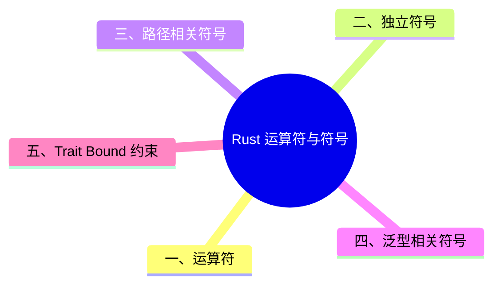

> **内容分级**: [综述级]
>
# Rust 运算符与符号（Operators and Symbols）

> **EN**: Operators and Symbols
> **Summary**: Rust 语法中运算符与各类符号的速查参考，包括可重载运算符对应的 trait、路径/泛型/trait bound/宏（Macro）/注释/括号等上下文中的符号含义。 Quick reference of Rust operators and symbols, including overloadable traits and meanings in paths, generics, trait bounds, macros, comments, and brackets.
> **Rust 版本**: 1.97.0+ (Edition 2024)
>
> **受众**: [初学者]
> **Bloom 层级**: L1-L2
> **权威来源**: 本文件为 `concept/` 权威页。
> **A/S/P 标记**: **S** — Specification / Language syntax
> **双维定位**: S×Lang — 语言词法与语法
> **前置依赖**: [Keywords](06_keywords.md) · [Type System](../02_type_system/01_type_system.md) · [Terminology Glossary](../../00_meta/01_terminology/01_terminology_glossary.md)
> **后置概念**: [Traits](../02_type_system/01_type_system.md) · [Generics](../../02_intermediate/01_generics/01_generics.md) · [Macros](../../03_advanced/03_proc_macros/01_macros.md)
> **定理链**: N/A — 参考级文档
> **主要来源**: [Rust Reference — Tokens](https://doc.rust-lang.org/reference/tokens.html) · [TRPL — Appendix B](https://doc.rust-lang.org/book/appendix-02-operators.html) · [Pierce — Types and Programming Languages](https://www.cis.upenn.edu/~bcpierce/tapl/) · [System F](https://en.wikipedia.org/wiki/System_F) · [Brown University — Concepts in Rust Programming](https://cel.cs.brown.edu/crp/) · [Brown Interactive Rust Book](https://rust-book.cs.brown.edu/) · [Unicode UAX #31 — Identifier and Pattern Syntax](https://www.unicode.org/reports/tr31/) · [Jung et al. — RustBelt: Securing the Foundations of Rust](https://plv.mpi-sws.org/rustbelt/popl18/)

>
> **来源**: [TRPL — Appendix B: Operators and Symbols](https://doc.rust-lang.org/book/appendix-02-operators.html)

---
> **权威来源**: [Rust Reference — Tokens](https://doc.rust-lang.org/reference/tokens.html) · [TRPL — Appendix B: Operators and Symbols](https://doc.rust-lang.org/book/appendix-02-operators.html)
>
> **权威来源对齐变更日志**: 2026-07-10 补充权威来源标注（Rust Reference、TRPL）

---

## 一、运算符

> (Source: [Rust Reference — Tokens](https://doc.rust-lang.org/reference/tokens.html))

| 运算符 | 示例 | 说明 | 可重载？ |
|:---|:---|:---|:---:|
| `!` | `ident!(...)` / `ident!{...}` / `ident![...]` | 宏（Macro）展开 | — |
| `!` | `!expr` | 按位/逻辑取反 | `Not` |
| `!=` | `expr != expr` | 不等比较 | `PartialEq` |
| `%` | `expr % expr` | 算术取余 | `Rem` |
| `%=` | `var %= expr` | 取余并赋值 | `RemAssign` |
| `&` | `&expr` / `&mut expr` | 借用（Borrowing） | — |
| `&` | `&type` / `&mut type` / `&'a type` | 借用（Borrowing）指针类型 | — |
| `&` | `expr & expr` | 按位与 | `BitAnd` |
| `&=` | `var &= expr` | 按位与并赋值 | `BitAndAssign` |
| `&&` | `expr && expr` | 短路逻辑与 | — |
| `*` | `expr * expr` | 算术乘法 | `Mul` |
| `*=` | `var *= expr` | 乘法并赋值 | `MulAssign` |
| `*` | `*expr` | 解引用（Reference） | `Deref` |
| `*` | `*const type` / `*mut type` | 原始指针（Raw Pointer）类型 | — |
| `+` | `trait + trait` / `'a + trait` | 复合类型约束 | — |
| `+` | `expr + expr` | 算术加法 | `Add` |
| `+=` | `var += expr` | 加法并赋值 | `AddAssign` |
| `,` | `expr, expr` | 参数/元素分隔符 | — |
| `-` | `-expr` | 算术取负 | `Neg` |
| `-` | `expr - expr` | 算术减法 | `Sub` |
| `-=` | `var -= expr` | 减法并赋值 | `SubAssign` |
| `->` | `fn(...) -> type` / `|…| -> type` | 函数/闭包（Closures）返回类型 | — |
| `.` | `expr.ident` | 字段访问 | — |
| `.` | `expr.ident(...)` | 方法调用 | — |
| `.` | `expr.0` / `expr.1` | 元组索引 | — |
| `..` | `..` / `expr..` / `..expr` / `expr..expr` | 右开区间 | `PartialOrd` |
| `..=` | `..=expr` / `expr..=expr` | 右闭区间 | `PartialOrd` |
| `..` | `..expr` | struct update 语法 | — |
| `..` | `variant(x, ..)` / `struct { x, .. }` | “其余部分”模式绑定 | — |
| `...` | `expr...expr` | 已废弃，改用 `..=` | — |
| `/` | `expr / expr` | 算术除法 | `Div` |
| `/=` | `var /= expr` | 除法并赋值 | `DivAssign` |
| `:` | `pat: type` / `ident: type` | 类型约束 | — |
| `:` | `ident: expr` | struct 字段初始化 | — |
| `:` | `'a: loop { ... }` | 循环标签 | — |
| `;` | `expr;` | 语句/项结束符 | — |
| `;` | `[...; len]` | 定长数组语法的一部分 | — |
| `<<` | `expr << expr` | 左移 | `Shl` |
| `<<=` | `var <<= expr` | 左移并赋值 | `ShlAssign` |
| `<` | `expr < expr` | 小于 | `PartialOrd` |
| `<=` | `expr <= expr` | 小于等于 | `PartialOrd` |
| `=` | `var = expr` / `ident = type` | 赋值/等价 | — |
| `==` | `expr == expr` | 等于 | `PartialEq` |
| `=>` | `pat => expr` | match arm 语法 | — |
| `>` | `expr > expr` | 大于 | `PartialOrd` |
| `>=` | `expr >= expr` | 大于等于 | `PartialOrd` |
| `>>` | `expr >> expr` | 右移 | `Shr` |
| `>>=` | `var >>= expr` | 右移并赋值 | `ShrAssign` |
| `@` | `ident @ pat` | 模式绑定 | — |
| `^` | `expr ^ expr` | 按位异或 | `BitXor` |
| `^=` | `var ^= expr` | 按位异或并赋值 | `BitXorAssign` |
| `\|` | `pat \| pat` | 模式备选 | — |
| `\|` | `expr \| expr` | 按位或 | `BitOr` |
| `\|=` | `var \|= expr` | 按位或并赋值 | `BitOrAssign` |
| `\|\|` | `expr \|\| expr` | 短路逻辑或 | — |
| `?` | `expr?` | 错误传播 | `Try` |

---

## 二、独立符号

| 符号 | 说明 |
|:---|:---|
| `'ident` | 命名生命周期（Lifetimes）或循环标签 |
| `123i32` / `3.14f64` / `0xFFu8` | 带类型后缀的数字字面量 |
| `"..."` | 字符串字面量 |
| `r"..."` / `r#"..."#` | 原始字符串字面量（不处理转义） |
| `b"..."` | 字节字符串字面量（`&[u8]`） |
| `br"..."` / `br#"..."#` | 原始字节字符串字面量 |
| `'a'` | 字符字面量 |
| `b'a'` | ASCII 字节字面量 |
| `\|…\| expr` | 闭包（Closures） |
| `!` | 发散函数/ never type |
| `_` | 忽略的模式绑定；也用于数字可读性分隔 |

---

## 三、路径相关符号

| 符号 | 说明 |
|:---|:---|
| `ident::ident` | 命名空间路径 |
| `::path` | 相对于 crate root 的绝对路径 |
| `self::path` | 相对于当前模块（Module）的路径 |
| `super::path` | 相对于父模块（Module）的路径 |
| `type::ident` / `<type as trait>::ident` | 关联常量、函数、类型 |
| `<type>::...` | 不能直接命名的类型的关联项，如 `<&T>::...`、`<[T]>::...` |
| `trait::method(...)` | 通过 trait 名消除方法调用歧义 |
| `type::method(...)` | 通过类型名消除方法调用歧义 |
| `<type as trait>::method(...)` | 通过 trait 和类型同时消除歧义 |

---

## 四、泛型相关符号

> (Source: [Rust Reference — Generics](https://doc.rust-lang.org/reference/items/generics.html))

| 符号 | 说明 |
|:---|:---|
| `path<...>` | 为泛型（Generics）类型指定参数，如 `Vec<u8>` |
| `path::<...>` / `method::<...>` | 表达式中为泛型（Generics）指定参数（turbofish），如 `"42".parse::<i32>()` |
| `fn ident<...> ...` | 定义泛型（Generics）函数 |
| `struct ident<...> ...` | 定义泛型（Generics）结构体（Struct） |
| `enum ident<...> ...` | 定义泛型（Generics）枚举（Enum） |
| `impl<...> ...` | 定义泛型（Generics）实现 |
| `for<...> type` | 高阶生命周期（Lifetimes）约束 |
| `type<ident=type>` | 为关联类型赋值，如 `Iterator<Item=T>` |

---

## 五、Trait Bound 约束

> (Source: [Rust Reference — Trait Bounds](https://doc.rust-lang.org/reference/trait-bounds.html))

| 符号 | 说明 |
|:---|:---|
| `T: U` | 泛型（Generics）参数 `T` 必须实现 `U` |
| `T: 'a` | `T` 必须 outlive 生命周期（Lifetimes） `'a` |
| `T: 'static` | `T` 不包含非 `'static` 的借用（Borrowing） |
| `'b: 'a` | 生命周期（Lifetimes） `'b` 必须 outlive `'a` |
| `T: ?Sized` | 允许 `T` 为动态大小类型 |
| `'a + trait` / `trait + trait` | 复合约束 |

---

## 六、宏与属性

| 符号 | 说明 |
|:---|:---|
| `#[meta]` | 外部属性 |
| `#![meta]` | 内部属性 |
| `$ident` | 宏（Macro）替换 |
| `$ident:kind` | 宏（Macro）元变量 |
| `$(...)...` | 宏（Macro）重复 |
| `ident!(...)` / `ident!{...}` / `ident![...]` | 宏（Macro）调用 |

---

## 七、注释

| 符号 | 说明 |
|:---|:---|
| `//` | 行注释 |
| `///` | 外部行文档注释 |
| `//!` | 内部行文档注释 |
| `/* ... */` | 块注释 |
| `/** ... */` | 外部块文档注释 |
| `/*! ... */` | 内部块文档注释 |

---

## 八、括号

Rust 的三种括号各有明确的语法职责，理解其分工可避免「括号选错」类解析错误：

- **圆括号 `()`**：函数调用与定义参数、元组构造、表达式分组（优先级覆盖）、元组结构体（Struct）/变体。`()` 单独出现是单元类型/单元值；
- **花括号 `{}`**：块表达式（产生值，尾部表达式规则）、结构体（Struct）字面量、`match` 臂体、`unsafe`/trait/impl 体。`{}` 单独出现在格式串中是占位符；
- **方括号 `[]`**：数组/切片（Slice）类型与字面量、索引操作（`Index` trait 脱糖）、属性参数（`#[cfg(...)]` 内部分语法）。

常见混淆：`Foo {}` 是结构体字面量而 `foo {}`（小写）在表达式位置是块——命名约定（类型大写）在此承担语法消歧功能；`match` 臂的 `,` 在臂体为块时可省略（块本身已是完整表达式）。

### 圆括号 `()`

| 符号 | 说明 |
|:---|:---|
| `()` | 空元组 / unit 类型 |
| `(expr)` | 括号表达式 |
| `(expr,)` | 单元素元组表达式 |
| `(type,)` | 单元素元组类型 |
| `(expr, ...)` | 元组表达式 |
| `(type, ...)` | 元组类型 |
| `expr(expr, ...)` | 函数调用；也用于初始化元组 struct/enum 变体 |

### 花括号 `{}`

| 符号 | 说明 |
|:---|:---|
| `{ ... }` | 块表达式 |
| `Type { ... }` | struct 字面量 |

### 方括号 `[]`

| 符号 | 说明 |
|:---|:---|
| `[...]` | 数组字面量 |
| `[expr; len]` | 包含 `len` 个 `expr` 的数组 |
| `[type; len]` | 包含 `len` 个 `type` 的数组类型 |
| `expr[expr]` | 集合索引（可重载：`Index`、`IndexMut`） |
| `expr[..]` / `expr[a..]` / `expr[..b]` / `expr[a..b]` | 使用 range 类型的切片（Slice）索引 |

---

## 九、相关概念

| 概念 | 关系 |
|:---|:---|
| [Keywords](06_keywords.md) | 运算符与符号共同构成 Rust 词法 |
| [Traits](../02_type_system/01_type_system.md) | 多数运算符通过 trait 重载 |
| [Generics](../../02_intermediate/01_generics/01_generics.md) | `<>`、`:`、`where` 用于泛型约束 |
| [Macros](../../03_advanced/03_proc_macros/01_macros.md) | `!`、`$`、`$(...)` 用于宏（Macro）系统 |

---

## 国际权威参考 / International Authority References（P2 生态）

> 依据 `AGENTS.md` §2「对齐网络国际化权威内容」补充：仅追加已验证可达的权威链接，不改动正文事实。

- **P2 生态/社区**: [docs.rs/derive_more — 生态权威 API 文档（运算符 trait 的 derive 宏（Macro）实践）](https://docs.rs/derive_more)（2026-07-12 验证 HTTP 200）

---

## ⚠️ 反例与陷阱：链式比较 `a == b == c`

**反例**（rustc 1.97 实测编译失败，无错误码：comparison operators cannot be chained）：

```rust,compile_fail
fn main() {
    let x = 1 == 2 == 3;
    println!("{x}");
}
```

Rust 不支持 Python 式链式比较，rustc 直接给出 `comparison operators cannot be chained` 错误并建议拆成两个比较。

**修正**：

```rust
fn main() {
    let x = 1 == 2 && 2 == 3;
    println!("{x}");
}
```

## 🧭 思维导图（Mindmap）



---

## 认知路径

> **认知路径**: 从 Rust 词法层的运算符与符号出发，理解它们如何同时承担语法角色、类型角色（trait）和宏角色，再映射到表达式求值与泛型约束。

### 核心推理链

| 定理 | 前提 | 结论 | 置信度 |
|:---|:---|:---|:---|
| 运算符重载 via trait ⟹ 一致语义 | 理解 `Add`、`Deref` 等 trait | 预测自定义类型的运算符行为 | 高 |
| 符号位置决定语法角色 ⟹ 正确解析 | 区分 `|>`、`::`、`<>` 上下文 | 避免解析歧义与编译错误 | 高 |
| 宏符号 `!`/`$` 与运算符符号分离 ⟹ 安全扩展 | 区分求值期与宏展开期 | 理解宏与代码生成边界 | 高 |

> **过渡**: 掌握运算符优先级后，可进一步学习表达式求值顺序与短路语义，理解 `&&`/`||` 与 `if let` 链的边界。
> **过渡**: 熟悉 trait bound 符号（`:`、`where`、`<>`）后，可进入泛型与生命周期约束的深入学习。
> **过渡**: 区分 `&`/`&mut` 作为引用运算符与作为模式绑定修饰符，是从表达式层进入借用语义的关键。

> 自定义运算符行为可预测 ⟸ 实现对应 trait ⟸ 编译器按 trait 表调度
> 解析歧义减少 ⟸ 明确符号的语法位置 ⟸ 词法与语法规则一致

---

## 反命题与边界

> **反命题**: "Rust 运算符与 C/C++/Java 完全相同，只是语法细节不同。" —— 错误。Rust 运算符大多通过 trait 重载，自定义类型行为由 trait 实现决定；`==` 默认不比较内容而需要 `PartialEq`，`=` 是 move 而非拷贝。
> **边界**: 运算符优先级和结合性固定，不能通过用户代码改变；复杂表达式应显式加括号，避免依赖记忆。
