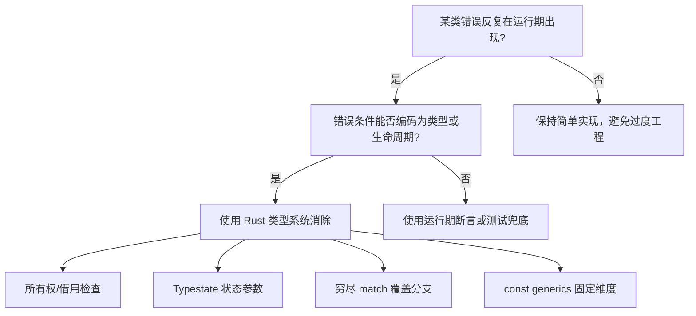
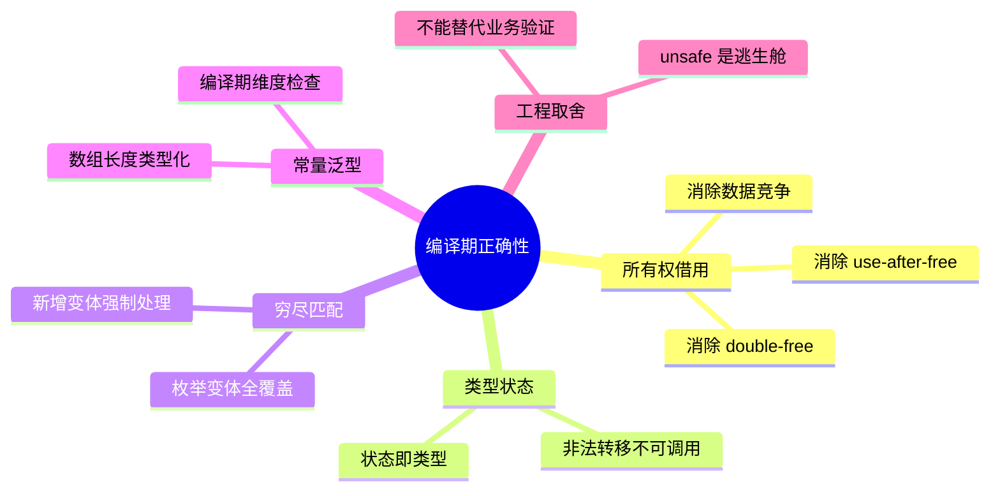

> **内容分级**: [综述级]

# 编译期正确性综合哲学

> **EN**: Compile-Time Correctness
> **Summary**: A unifying view of how Rust's type system, ownership, borrow checker, typestate, const generics, and exhaustive pattern matching move classes of runtime errors to compile-time.
> **Rust 版本**: 1.97.0+ (Edition 2024)
> **受众**: [初学者]
> **Bloom 层级**: L1-L2
> **权威来源**: 本文件为 `concept/` 权威页。
> **定位**: 将 Rust 多个核心机制统一在「编译期正确性」框架下，帮助学习者理解「为什么 Rust 编译器如此严格」以及这种严格性带来的工程价值。
> **预计阅读时间**: 20 分钟
>
> **来源**:
> [RFC 2000 — Const Generics](https://rust-lang.github.io/rfcs/2000-const-generics.html) ·
> [Strom & Yemini 1986 — Typestate](https://doi.org/10.1145/512644.512659) ·
> [Jung et al. — RustBelt: Securing the Foundations of Rust](https://plv.mpi-sws.org/rustbelt/popl18/) ·
> [Rust Reference](https://doc.rust-lang.org/reference/introduction.html) ·
> [TRPL — What is Ownership?](https://doc.rust-lang.org/book/ch04-00-ownership.html)
>
> **前置概念**: [所有权（Ownership）](../01_ownership_borrow_lifetime/01_ownership.md) · [借用（Borrowing）](../01_ownership_borrow_lifetime/02_borrowing.md)
> **后置概念**:
> [类型状态模式（Typestate）](../../06_ecosystem/03_design_patterns/32_typestate_deep_dive.md) ·
> [常量泛型（Const Generics）](../../02_intermediate/01_generics/02_const_generics.md) ·
> [错误处理进阶](../../02_intermediate/03_error_handling/01_error_handling.md) ·
> [Unsafe Rust](../../03_advanced/02_unsafe/01_unsafe.md)

---

## 一、权威定义

**编译期正确性（Compile-Time Correctness）** 是一种软件工程哲学：将本可能在运行期暴露的错误（use-after-free、数据竞争、未处理分支、越界访问、协议状态违规等）前移到编译期，通过类型系统、控制流分析与静态约束使其不可表示。

形式化地说，Rust 把程序合法运行时的不变量编码为**类型与生命周期约束** Γ ⊢ e : τ，编译器在类型检查阶段拒绝任何不满足 Γ 的程序。这意味着大量 bug 在代码提交前就被消除，而非在测试或生产环境中暴露。

> **来源**: [Jung et al. — RustBelt](https://plv.mpi-sws.org/rustbelt/popl18/) · [Rust Reference — Type System](https://doc.rust-lang.org/reference/type-system.html)

---

## 二、Rust 的四根编译期支柱

Rust 的编译期正确性不是单一机制，而是四个相互协作的支柱：

| 支柱 | 运行时错误类型 | 编译期拒绝方式 |
|:---|:---|:---|
| **所有权与借用检查** | use-after-free、double-free、数据竞争 | 所有权转移规则 + 可变/不可变引用互斥 |
| **类型状态（Typestate）** | 协议状态非法转移 | 将状态编码为类型，未定义方法不可调用 |
| **穷尽模式匹配** | 未处理枚举变体 | `match` 必须覆盖所有变体，否则 `E0004` |
| **常量泛型 + const 求值** | 数组越界、维度不匹配 | 在类型层面固定长度与常量约束 |

> **来源**: [Strom & Yemini 1986](https://doi.org/10.1145/512644.512659) · [RFC 2000](https://rust-lang.github.io/rfcs/2000-const-generics.html)

---

## 三、正例：运行期错误如何变成编译期错误

### 3.1 借用检查消除 use-after-free

```rust,compile_fail
fn main() {
    let r;
    {
        let x = 5;
        r = &x;          // ❌ x 的作用域即将结束
    }
    println!("{r}");     // error: borrowed value does not live long enough
}
```

编译器通过生命周期检查，直接拒绝悬垂引用。修正方案是拥有数据：

```rust
fn main() {
    let x = 5;
    let r = &x;
    println!("{r}");     // ✅ x 的生命周期覆盖 r 的使用
}
```

> 详见 [借用（Borrowing）](../01_ownership_borrow_lifetime/02_borrowing.md)。

### 3.2 穷尽匹配消除未处理分支

```rust,compile_fail
enum Color {
    Red,
    Green,
    Blue,
}

fn rgb(c: Color) -> &'static str {
    match c {
        Color::Red => "FF0000",
        Color::Green => "00FF00",
        // ❌ 遗漏 Blue 会导致编译错误 E0004
    }
}
```

新增枚举变体时，所有 `match` 站点都会报错，迫使开发者显式处理。

### 3.3 Typestate 消除非法协议转移

```rust
struct Disconnected;
struct Connected;

struct TcpClient<State> {
    _state: std::marker::PhantomData<State>,
}

impl TcpClient<Disconnected> {
    fn connect(self) -> TcpClient<Connected> {
        TcpClient { _state: std::marker::PhantomData }
    }
}

impl TcpClient<Connected> {
    fn send(&self, msg: &[u8]) {
        // 只有 Connected 状态才能发送
    }
}

fn main() {
    let client = TcpClient::<Disconnected> { _state: std::marker::PhantomData };
    let client = client.connect();
    client.send(b"hello");
    // client.connect(); // ❌ Disconnected 状态的方法已不可用
}
```

> 详见 [类型状态模式深度剖析](../../06_ecosystem/03_design_patterns/32_typestate_deep_dive.md)。

### 3.4 常量泛型把数组维度编码进类型

```rust
struct Matrix<const N: usize, const M: usize> {
    data: [[f64; M]; N],
}

impl<const N: usize, const M: usize> Matrix<N, M> {
    fn shape(&self) -> (usize, usize) {
        (N, M)
    }
}

fn main() {
    let a = Matrix::<2, 3> { data: [[0.0; 3]; 2] };
    let b = Matrix::<3, 2> { data: [[0.0; 2]; 3] };
    // 若把 a 与 b 当作同形状矩阵使用，编译器会拒绝维度不匹配
    assert_eq!(a.shape(), (2, 3));
    assert_eq!(b.shape(), (3, 2));
}
```

常量泛型使「维度一致」从运行期断言前移到类型约束；矩阵乘法的合法性可以在函数签名层面表达。

> 详见 [常量泛型（Const Generics）](../../02_intermediate/01_generics/02_const_generics.md)。

---

## 四、与动态语言及 C/C++ 的对比

| 维度 | 动态语言（Python/JS） | C/C++ | Rust |
|:---|:---|:---|:---|
| **类型错误** | 运行期 `TypeError` | 部分编译期，大量依赖 UB | 编译期类型检查 + 借用检查 |
| **内存安全** | GC 兜底，但可能出现悬垂引用 | 手动管理，UB 风险高 | 所有权 + 借用检查 |
| **并发安全** | GIL/事件循环，难以发现 race | 依赖约定与工具 | `Send`/`Sync` 编译期约束 |
| **协议状态** | 运行期断言或异常 | 枚举 + 手动检查 | Typestate 编译期不可调用 |
| **未处理分支** | 运行期可能遗漏 | 编译器通常不检查 switch | 穷尽 match 强制处理 |

C/C++ 也能在编译期捕获很多错误，但缺乏对**生命周期别名**和**数据竞争**的系统性静态约束；Rust 通过 ownership + lifetimes 把这两类问题的很大一部分转化为编译期错误。

---

## 五、反例：过度依赖 `unsafe` 绕过编译期检查

`unsafe` 不是错误，但用它绕过编译器保护会重新引入运行期风险：

```rust,unsafe
use std::slice;

fn buggy_split(data: &mut [u8]) -> (&mut [u8], &mut [u8]) {
    let ptr = data.as_mut_ptr();
    let len = data.len();
    unsafe {
        // 如果 len 为奇数，第二段长度计算错误，导致越界
        let mid = len / 2;
        (
            slice::from_raw_parts_mut(ptr, mid),
            slice::from_raw_parts_mut(ptr.add(mid), len - mid + 1),
        )
    }
}
```

这段代码在编译期通过了，但运行期可能越界。正确做法是优先使用标准库的安全抽象：

```rust
fn safe_split(data: &mut [u8]) -> (&mut [u8], &mut [u8]) {
    let mid = data.len() / 2;
    data.split_at_mut(mid) // ✅ 编译期与运行期都安全
}
```

> 详见 [Unsafe Rust](../../03_advanced/02_unsafe/01_unsafe.md)。

---

## 六、编译期正确性的工程收益与边界

### 6.1 工程收益

将错误前移到编译期的直接收益包括：

- **缩短反馈周期**：开发者在本地即可获得精确错误，无需等待测试运行或生产事故。
- **降低回归成本**：类型系统充当回归测试的「免费」补充，修改 API 后所有调用点自动失效。
- **增强重构信心**：大规模代码库调整时，编译错误清单相当于「待办事项」，避免遗漏。
- **文档化不变量**：类型签名、生命周期参数、`must_use` 等本身就是机器可检查的文档。

### 6.2 边界：编译期正确性不能替代什么

编译期正确性并非万能。以下问题仍需运行期处理：

- **业务规则验证**：金额非负、用户存在、密码强度等运行时事实无法仅通过类型表达。
- **算法正确性**：死锁自由、终止性、性能边界通常需要测试、模型检查或形式化证明。
- **外部世界不确定性**：文件系统状态、网络延迟、用户输入仍需 `Result` 与错误处理。
- **表达能力限制**：某些安全属性（如数组索引依赖动态值）在运行期仍需边界检查。

因此，Rust 的工程策略是「能静态化的静态化，不能静态化的显式化」：

- 能编码进类型的，用类型消除。
- 不能编码的，用 `Result`/`Option`/`panic` 显式表达。

> 详见 [错误处理进阶](../../02_intermediate/03_error_handling/01_error_handling.md)。

---

## 七、决策树：何时能把错误前移到编译期



---

## 八、思维导图



---

## 九、相关概念

| 概念 | 关系 |
|:---|:---|
| [所有权（Ownership）](../01_ownership_borrow_lifetime/01_ownership.md) | 编译期内存安全的基石 |
| [借用（Borrowing）](../01_ownership_borrow_lifetime/02_borrowing.md) | 通过生命周期检查消除悬垂引用 |
| [类型状态模式（Typestate）](../../06_ecosystem/03_design_patterns/32_typestate_deep_dive.md) | 将协议状态编码进类型参数 |
| [常量泛型（Const Generics）](../../02_intermediate/01_generics/02_const_generics.md) | 把数值常量纳入类型系统 |
| [错误处理进阶](../../02_intermediate/03_error_handling/01_error_handling.md) | 将可恢复错误显式化 |
| [Unsafe Rust](../../03_advanced/02_unsafe/01_unsafe.md) | 编译期保证的边界与代价 |

---

## 十、权威来源索引

- Strom, R. E. & Yemini, S. "Typestate: A Programming Language Concept for Enhancing Software Reliability." *IEEE TSE 1986*. [https://doi.org/10.1145/512644.512659](https://doi.org/10.1145/512644.512659)
- Jung, R., Jourdan, J.-H., Krebbers, R., & Dreyer, D. "RustBelt: Securing the Foundations of Rust." *POPL 2018*. [https://plv.mpi-sws.org/rustbelt/popl18/](https://plv.mpi-sws.org/rustbelt/popl18/)
- [RFC 2000 — Const Generics](https://rust-lang.github.io/rfcs/2000-const-generics.html)
- [Rust Reference — Type System](https://doc.rust-lang.org/reference/type-system.html)
- [TRPL — What is Ownership?](https://doc.rust-lang.org/book/ch04-00-ownership.html)

> **文档版本**: 1.0 ｜ **最后更新**: 2026-07-31 ｜ **状态**: ✅ 新建权威页
