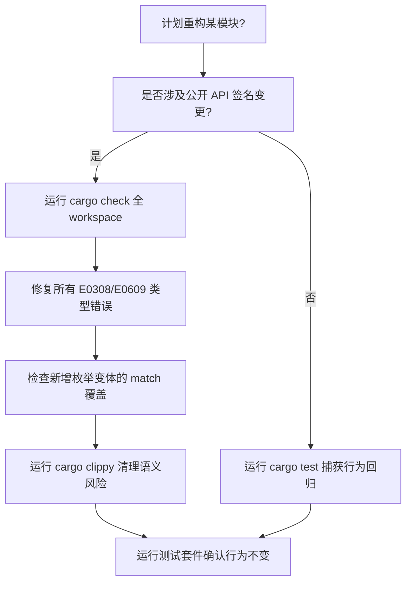
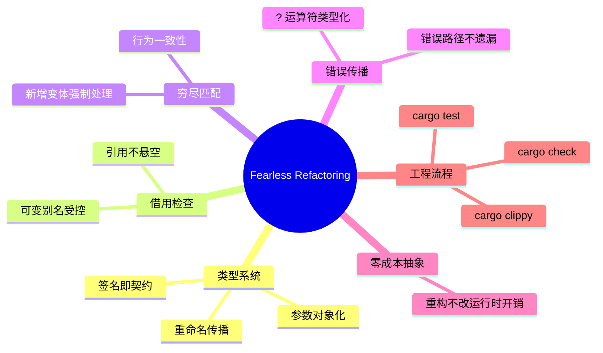

> **内容分级**: [综述级]

# Fearless Refactoring 工程指南

> **EN**: Fearless Refactoring
> **Summary**: How Rust's exhaustive pattern matching, type system, borrow checker, ? operator, and zero-cost abstractions form a safety net that makes large-scale refactoring reliable and error-driven.
> **Rust 版本**: 1.97.0+ (Edition 2024)
> **受众**: [初学者]
> **Bloom 层级**: L1-L2
> **权威来源**: 本文件为 `concept/` 权威页。
> **定位**: 从工程实践角度说明 Rust 为什么能支持「大胆重构」：把重构风险从「运行期未知」转化为「编译器可枚举的错误清单」。
> **预计阅读时间**: 20 分钟
>
> **来源**:
> [TRPL — Recoverable Errors with Result](https://doc.rust-lang.org/book/ch09-02-recoverable-errors-with-result.html) ·
> [Rust Reference — Patterns](https://doc.rust-lang.org/reference/patterns.html) ·
> [Martin Fowler — Refactoring: Improving the Design of Existing Code](https://martinfowler.com/books/refactoring.html) ·
> [Rust API Guidelines](https://rust-lang.github.io/api-guidelines/)
>
> **前置概念**: [所有权（Ownership）](../01_ownership_borrow_lifetime/01_ownership.md) · [借用（Borrowing）](../01_ownership_borrow_lifetime/02_borrowing.md) · [错误处理基础](../08_error_handling/01_error_handling_basics.md)
> **后置概念**:
> [错误处理进阶](../../02_intermediate/03_error_handling/01_error_handling.md) ·
> [类型系统基础](../02_type_system/01_type_system.md) ·
> [Trait 与泛型](../../02_intermediate/01_generics/01_generics.md)

---

## 一、权威定义

**Fearless Refactoring（ fearless 重构）** 是指在修改大型代码库时，编译器能够提供足够精确的反馈，使开发者敢于进行结构性调整而不必担心引入隐式运行期错误。

Martin Fowler 将重构定义为「在不改变外部行为的前提下改善代码内部结构」。Rust 通过静态类型系统把「外部行为不变」的一部分约束提前到编译阶段：如果修改破坏了类型契约、借用规则或穷尽匹配，编译器会立即以具体错误（error code + span）指出所有受影响位置。

> **来源**: [Martin Fowler — Refactoring](https://martinfowler.com/books/refactoring.html) · [TRPL — Error Handling](https://doc.rust-lang.org/book/ch09-00-error-handling.html)

---

## 二、重构安全网的五大机制

| 机制 | 重构中提供的保护 | 典型错误码 |
|:---|:---|:---|
| **穷尽模式匹配** | 新增枚举变体后，所有未覆盖的 `match` 站点报错 | `E0004` |
| **借用检查** | 修改数据流后，悬垂引用/可变别名立即被捕获 | `E0382`, `E0502` |
| **类型系统** | 重命名字段/方法、修改签名后，调用点全部报错 | `E0609`, `E0308` |
| **`?` 运算符** | 错误传播路径类型化，修改错误类型后调用链显式失败 | `E0277` |
| **零成本抽象** | 重构不改变运行时开销，性能回归风险低 | N/A |

---

## 三、正例：错误驱动重构流程

### 3.1 新增枚举变体后的重构

假设一个事件系统最初只有两种事件：

```rust
enum Event {
    Click(i32, i32),
    Key(char),
}

fn handle(e: Event) -> &'static str {
    match e {
        Event::Click(_, _) => "click",
        Event::Key(_) => "key",
    }
}
```

新增 `Event::Scroll` 后，所有 `match` 都会收到 `E0004`：

```rust,compile_fail
enum Event {
    Click(i32, i32),
    Key(char),
    Scroll(i32), // 新增变体
}

fn handle(e: Event) -> &'static str {
    match e {
        Event::Click(_, _) => "click",
        Event::Key(_) => "key",
        // ❌ error[E0004]: non-exhaustive patterns: `Scroll(_)` not covered
    }
}
```

修复方式明确：补全分支即可保证行为一致。

### 3.2 类型签名驱动的函数重命名重构

```rust,compile_fail
struct Config {
    timeout_ms: u64,
}

impl Config {
    fn connect_timeout(&self) -> u64 { self.timeout_ms }
}

fn render(cfg: &Config) -> String {
    format!("timeout={}", cfg.connect_timeout())
}

fn main() {
    let cfg = Config { timeout_ms: 1000 };
    // ❌ 旧调用点未同步重命名：error[E0599]: no method named `timeout`
    println!("{}", cfg.timeout());
}
```

类型签名是编译期契约，重命名后所有调用点必须同步更新。

### 3.3 `?` 运算符保证错误传播路径完整

```rust
use std::fs::File;
use std::io::{self, Read};

fn read_config(path: &str) -> Result<String, io::Error> {
    let mut file = File::open(path)?; // 错误自动传播
    let mut contents = String::new();
    file.read_to_string(&mut contents)?;
    Ok(contents)
}
```

如果将 `read_config` 返回的错误类型改为自定义错误，所有 `?` 调用点会立即提示转换约束缺失，避免遗漏错误处理路径。

> 详见 [错误处理进阶](../../02_intermediate/03_error_handling/01_error_handling.md)。

---

## 四、大型代码库重构案例：把 `String` 改为结构化类型

假设某项目用 `String` 传递用户 ID，重构目标是引入强类型 `UserId`：

```rust
// 重构前
fn authorize(user_id: String) -> bool {
    !user_id.is_empty()
}

fn main() {
    authorize("alice".to_string());
}
```

重构后（旧调用点被编译器捕获）：

```rust,compile_fail
#[derive(Debug, Clone, PartialEq, Eq)]
struct UserId(String);

impl UserId {
    fn new(raw: &str) -> Option<Self> {
        if raw.is_empty() { None } else { Some(Self(raw.to_string())) }
    }
}

fn authorize(user_id: UserId) -> bool {
    !user_id.0.is_empty()
}

fn main() {
    // ❌ 旧调用点会报 E0308：期望 UserId，找到 String
    authorize("alice".to_string());

    // ✅ 必须显式构造
    // let id = UserId::new("alice").expect("valid user id");
    // authorize(id);
}
```

编译器会列出所有仍在传 `String` 的调用点，开发者按错误清单逐处修复，不会遗漏。

---

## 五、与 Martin Fowler 重构目录的对接

| Fowler 重构手法 | Rust 中的 fearless 体现 |
|:---|:---|
| **Rename Method** | 重命名后所有调用点编译报错，rust-analyzer 可一键重命名 |
| **Introduce Parameter Object** | 类型签名变化使调用点显式失败 |
| **Replace Conditional with Polymorphism** | `enum` + `match` 保证新增变体必须处理 |
| **Extract Method** | 借用检查确保提取后引用关系仍然合法 |
| **Move Method** | 类型系统跟踪 self 与字段访问的合法性 |

Rust 不是自动重构工具，但其类型系统让重构结果的可验证性远高于动态类型语言。

---

## 六、重构工作流与工具链

一次典型的 fearless 重构工作流如下：

1. **识别重构目标**：重复代码、过长函数、魔法值、弱类型接口等。
2. **添加/运行测试**：在修改前确保已有测试覆盖关键路径；如无测试，先补测试。
3. **小步修改**：每次只做一个签名或结构变更，立即运行 `cargo check`。
4. **按编译错误清单修复**：将错误视为「重构待办事项」，逐条处理。
5. **运行 `cargo clippy`**：捕获 `unwrap` 滥用、`clone` 冗余等语义风险。
6. **运行 `cargo test`**：验证行为未变。
7. **代码审查**：重点检查 `unsafe`、新引入的 `unwrap`、以及错误转换。

常用工具：

| 工具/命令 | 作用 |
|:---|:---|
| `cargo check` | 最快类型检查，适合重构循环 |
| `cargo test` | 行为回归验证 |
| `cargo clippy` | 语义级 lint |
| `cargo fmt` | 保持格式一致 |
| rust-analyzer | IDE 内重命名、跳转、内联提示 |

### 6.1 小步重构示例：提取函数

```rust
fn calculate_total(prices: &[f64]) -> f64 {
    let mut total = 0.0;
    for p in prices {
        total += p;
    }
    total
}
```

提取函数后，签名不变但内部结构更清晰；编译器会验证所有调用点仍兼容。

---

## 七、重构中的心理模型与团队协作

Fearless refactoring 不仅依赖工具，也依赖正确的心理模型：

- **把编译错误当作盟友**：Rust 的报错不是阻碍，而是「变更影响范围」的自动清单。与其压抑错误，不如按清单逐项修复。
- **小步快跑**：每次只做一种变更（重命名、提取、改签名、改类型），避免一次性引入多种语义变化。
- **测试是最后防线**：类型系统能捕获结构性错误，但无法验证业务语义。重构后必须运行测试确认行为不变。
- **代码审查聚焦 unsafe 与 unwrap**：类型系统已处理大部分机械错误，审查时应把注意力放在业务边界、panic 路径和 unsafe 块上。

在团队协作中，建议为频繁重构的模块制定「重构契约」：

- 公开 API 变更需同步更新调用方与文档测试。
- 新增枚举变体必须提供迁移示例。
- 重构 PR 应单独提交，不与功能改动混在一个 commit 中，便于回滚与审查。

---

## 八、反例：忽视编译器警告导致重构回退

```rust
fn process(items: Vec<i32>) -> i32 {
    let mut sum = 0;
    for i in items {
        sum += i;
    }
    sum
}
```

若重构时把 `items` 改为引用但忘记调整调用方，借用检查会报错；若用 `unsafe` 或 `mem::transmute` 强行压制，则会重新引入运行期风险。

---

## 八、决策树：重构前需要检查什么



---

## 九、思维导图



---

## 十、相关概念

| 概念 | 关系 |
|:---|:---|
| [所有权（Ownership）](../01_ownership_borrow_lifetime/01_ownership.md) | 重构时数据流合法性的基础 |
| [借用（Borrowing）](../01_ownership_borrow_lifetime/02_borrowing.md) | 引用关系在重构后仍被检查 |
| [错误处理进阶](../../02_intermediate/03_error_handling/01_error_handling.md) | `?` 与自定义错误类型的工程实践 |
| [类型系统基础](../02_type_system/01_type_system.md) | 签名变更的传播机制 |
| [Trait 与泛型](../../02_intermediate/01_generics/01_generics.md) | 抽象化重构的类型约束 |

---

## 十一、权威来源索引

- Fowler, M. *Refactoring: Improving the Design of Existing Code*. 2nd ed. Addison-Wesley. [https://martinfowler.com/books/refactoring.html](https://martinfowler.com/books/refactoring.html)
- Klabnik, S. & Nichols, C. *The Rust Programming Language*, Ch. 9. [https://doc.rust-lang.org/book/ch09-00-error-handling.html](https://doc.rust-lang.org/book/ch09-00-error-handling.html)
- [Rust Reference — Patterns](https://doc.rust-lang.org/reference/patterns.html)
- [Rust API Guidelines](https://rust-lang.github.io/api-guidelines/)

> **文档版本**: 1.0 ｜ **最后更新**: 2026-07-31 ｜ **状态**: ✅ 新建权威页
