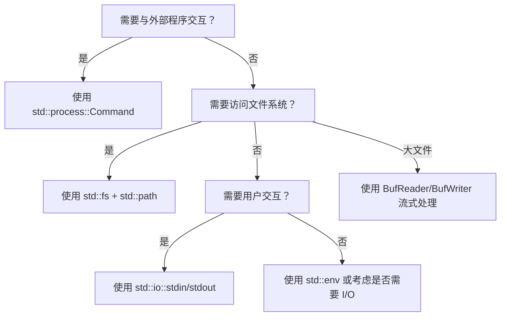

> **内容分级**: [基础级]
> **Rust 版本**: 1.97.0+ (Edition 2024)
> **本节关键术语**: 标准输入输出（Standard I/O） · `std::io` · `std::fs` · `std::path` · `std::process` · `std::env` · 错误处理（Error Handling）

# 标准 I/O 与进程（std I/O and Process）
>
> **EN**: Standard I/O and Process
> **Summary**: Rust's standard library provides platform-agnostic I/O, filesystem, process, environment, and path manipulation modules under `std::io`, `std::fs`, `std::path`, `std::process`, and `std::env`. These APIs are synchronous, return `Result`, and compose with the ownership and error-handling model.
>
> **受众**: [初学者]
> **层级**: L1 基础概念
> **Bloom 层级**: L2-L3
> **A/S/P 标记**: **A** — Application
> **双维定位**: C×App
> **前置概念**: [Error Handling Basics](../08_error_handling/32_error_handling_basics.md) · [Ownership](../01_ownership_borrow_lifetime/01_ownership.md) · [Strings and Text](../06_strings_and_text/09_strings_and_text.md)
> **后置概念**: [Async I/O](../../03_advanced/01_async/02_async.md) · [Command Line Apps](../../06_ecosystem/06_data_and_distributed/04_application_domains.md) · [Testing Basics](../10_testing_basics/16_testing_basics.md)
>
> **主要来源**: [std::io](https://doc.rust-lang.org/std/io/index.html) ·
> [std::fs](https://doc.rust-lang.org/std/fs/index.html) ·
> [std::process](https://doc.rust-lang.org/std/process/index.html) ·
> [Rust By Example — Std I/O](https://doc.rust-lang.org/rust-by-example/std.html) ·
> [Rust By Example — Filesystem](https://doc.rust-lang.org/rust-by-example/std_misc/file.html)
>
> **Rust 版本**: 1.97.0+ (Edition 2024)
> **权威来源**: 本文件为 `concept/` 权威页。

---

> **Bloom 层级**: L2-L3
> **变更日志**:
>
> - v1.0 (2026-07-04): 初始创建

## 📑 目录

---

> **过渡**: 从 std IO 与进程 的直观描述转向其形式化定义，需要先把日常经验中的模糊直觉转化为可验证的术语与规则。

> **过渡**: 在建立 std IO 与进程 的核心命题之后，下一步是审视这些命题在边界条件下的稳定性——这正是反命题与反例的价值所在。

> **过渡**: 最后，将 std IO 与进程 与相邻概念连接，形成从 L1 到 L7 的纵向认知路径，避免孤立记忆。

---

- [标准 I/O 与进程（std I/O and Process）](#标准-io-与进程std-io-and-process)
  - [📑 目录](#-目录)
  - [一、权威定义（Definition）](#一权威定义definition)
    - [1.1 形式化定义](#11-形式化定义)
    - [1.2 直觉解释](#12-直觉解释)
  - [二、概念属性矩阵](#二概念属性矩阵)
  - [三、技术细节与示例](#三技术细节与示例)
    - [3.1 标准输入输出](#31-标准输入输出)
    - [3.2 文件读写](#32-文件读写)
    - [3.3 路径处理](#33-路径处理)
    - [3.4 子进程](#34-子进程)
    - [3.5 环境变量](#35-环境变量)
  - [四、示例与反例](#四示例与反例)
    - [4.1 正确示例：安全复制文件](#41-正确示例安全复制文件)
    - [4.2 反例：忽略 Result](#42-反例忽略-result)
    - [4.3 反例：使用字符串拼接路径](#43-反例使用字符串拼接路径)
  - [五、反命题与边界分析](#五反命题与边界分析)
    - [5.1 反命题树](#51-反命题树)
    - [5.2 边界极限](#52-边界极限)
  - [六、边界测试](#六边界测试)
    - [6.1 边界测试：逐行读取大文件](#61-边界测试逐行读取大文件)
    - [6.2 边界测试：当前工作目录](#62-边界测试当前工作目录)
  - [七、判断推理与决策树](#七判断推理与决策树)
    - [7.1 选择哪个 I/O API？](#71-选择哪个-io-api)
    - [7.2 与其他概念的辨析](#72-与其他概念的辨析)
  - [八、逆向推理链（Backward Reasoning）](#八逆向推理链backward-reasoning)
  - [九、来源与延伸阅读](#九来源与延伸阅读)
  - [嵌入式测验（Embedded Quiz）](#嵌入式测验embedded-quiz)
    - [测验 1：路径拼接](#测验-1路径拼接)
    - [测验 2：I/O 错误处理](#测验-2io-错误处理)
  - [认知路径](#认知路径)

---

## 一、权威定义（Definition）

> Rust 标准库通过以下模块（Module）提供与操作系统交互的基础能力：
>
> - `std::io`：标准输入输出、读写 trait（`Read`、`Write`、`BufRead`、`Seek`）。
> - `std::fs`：文件系统操作（创建、读取、写入、删除文件和目录）。
> - `std::path`：跨平台路径处理（`Path`、`PathBuf`）。
> - `std::process`：子进程管理（`Command`、`Child`、`Output`）。
> - `std::env`：环境变量、命令行参数、当前目录。
>
> [来源: [std::io](https://doc.rust-lang.org/std/io/index.html)]

### 1.1 形式化定义

```text
标准输入:  io::stdin()
标准输出:  io::stdout()
标准错误:  io::stderr()
读 trait:  std::io::Read
写 trait:  std::io::Write
缓冲读:   std::io::BufRead
文件操作: std::fs::File / std::fs::read / std::fs::write
进程创建: std::process::Command
路径类型: std::path::Path / std::path::PathBuf
```

### 1.2 直觉解释

标准 I/O 和进程模块（Module）是 Rust 与“外部世界”交互的门户。无论是读取键盘输入、写入文件、启动子进程，还是获取环境变量，都通过这些模块完成。它们遵循 Rust 的核心原则：所有权（Ownership）、借用（Borrowing）、`Result` 错误处理。

> [💡 原创分析](../../00_meta/00_framework/methodology.md)

---

## 二、概念属性矩阵

| 属性 | 说明 | Rust 表达 | 权威来源 |
|:---|:---|:---|:---|
| 同步 I/O | 阻塞式读写 | `std::io::Read::read_to_end` | std::io |
| 缓冲 I/O | 减少系统调用 | `BufReader::new(file)` | std::io |
| 错误处理 | 所有操作返回 `Result` | `fs::read_to_string(path)?` | std::io |
| 跨平台路径 | `Path`/`PathBuf` 抽象 | `Path::new("foo/bar")` | std::path |
| 子进程 | 创建并管理外部程序 | `Command::new("ls").output()` | std::process |
| 环境访问 | 读取/设置环境变量 | `env::var("HOME")` | std::env |

---

## 三、技术细节与示例

### 3.1 标准输入输出

```rust
use std::io::{self, BufRead, Write};

fn main() -> io::Result<()> {
    print!("Enter your name: ");
    io::stdout().flush()?;

    let stdin = io::stdin();
    let mut lines = stdin.lock().lines();
    if let Some(Ok(name)) = lines.next() {
        println!("Hello, {}!", name);
    }
    Ok(())
}
```

> **关键洞察**: `stdin().lock()` 获取锁以避免多次锁定的开销；`flush()` 确保提示符在读取前显示。
> [来源: [std::io::stdin](https://doc.rust-lang.org/std/io/fn.stdin.html)]

### 3.2 文件读写

```rust
use std::fs;
use std::io::Write;

fn main() -> std::io::Result<()> {
    let path = "hello.txt";
    let mut file = fs::File::create(path)?;
    file.write_all(b"Hello, Rust!\n")?;

    let content = fs::read_to_string(path)?;
    println!("{}", content);

    fs::remove_file(path)?;
    Ok(())
}
```

> **关键洞察**: `fs::read_to_string` 是读取整个文本文件的便捷函数；`?` 传播 I/O 错误。
> [来源: [std::fs](https://doc.rust-lang.org/std/fs/index.html)]

### 3.3 路径处理

```rust
use std::path::PathBuf;

fn main() {
    let mut path = PathBuf::from("/tmp");
    path.push("my_app");
    path.push("config.toml");

    println!("{}", path.display());
    println!("file name: {:?}", path.file_name());
    println!("extension: {:?}", path.extension());
}
```

> **关键洞察**: `PathBuf` 是可拥有的、可变的路径；`Path` 是借用（Borrowing）的切片（Slice）式路径。两者都正确处理 Windows 和 Unix 路径分隔符。
> [来源: [std::path](https://doc.rust-lang.org/std/path/index.html)]

### 3.4 子进程

```rust
use std::process::Command;

fn main() -> std::io::Result<()> {
    let output = Command::new("echo")
        .arg("Hello from child process")
        .output()?;

    println!("status: {}", output.status);
    println!("stdout: {}", String::from_utf8_lossy(&output.stdout));
    Ok(())
}
```

> **关键洞察**: `Command::output()` 等待子进程结束并捕获 stdout/stderr；`spawn()` 则立即返回 `Child` 句柄。
> [来源: [std::process::Command](https://doc.rust-lang.org/std/process/struct.Command.html)]

### 3.5 环境变量

```rust
use std::env;

fn main() {
    for arg in env::args() {
        println!("arg: {}", arg);
    }

    match env::var("HOME") {
        Ok(home) => println!("HOME: {}", home),
        Err(e) => println!("could not read HOME: {}", e),
    }
}
```

> [来源: [std::env](https://doc.rust-lang.org/std/env/index.html)]

---

## 四、示例与反例

### 4.1 正确示例：安全复制文件

```rust
use std::fs;
use std::io;

fn copy_file(src: &str, dst: &str) -> io::Result<u64> {
    fs::copy(src, dst)
}

fn main() -> io::Result<()> {
    fs::write("source.txt", "data")?;
    let bytes = copy_file("source.txt", "dest.txt")?;
    println!("copied {} bytes", bytes);
    fs::remove_file("source.txt")?;
    fs::remove_file("dest.txt")?;
    Ok(())
}
```

### 4.2 反例：忽略 Result

```rust,compile_fail
use std::fs::File;
use std::io::Write;

fn main() {
    let mut file = File::create("log.txt").unwrap();
    file.write_all(b"entry\n"); // 错误：未处理 Result
}
```

> **错误诊断**: `error[E0282]: type annotations needed` 或 `must_use` 警告。
> **修正**: `file.write_all(b"entry\n")?;` 或显式处理错误。
> [来源: [std::io::Write](https://doc.rust-lang.org/std/io/trait.Write.html)]

### 4.3 反例：使用字符串拼接路径

```rust
fn main() {
    let path = "/tmp/" + "file.txt"; // 错误：String 不能用 + 与 &str 这样拼接
    println!("{}", path);
}
```

> **错误诊断**: `error[E0369]: cannot add ...`
> **修正**: 使用 `PathBuf`：`let path = PathBuf::from("/tmp").join("file.txt");`
> [来源: [std::path::PathBuf](https://doc.rust-lang.org/std/path/struct.PathBuf.html)]

---

## 五、反命题与边界分析

### 5.1 反命题树

> **反命题 1**: "`std::io` 是异步（Async）的" ⟹ 不成立。`std::io` 是同步阻塞 I/O；异步 I/O 使用 `tokio::io` 等。
> **反命题 2**: "路径字符串可以直接用 `String` 操作" ⟹ 不成立。应使用 `Path`/`PathBuf` 以保证跨平台正确性。
> **反命题 3**: "`Command::output()` 会继承所有父进程环境" ⟹ 部分成立，但可通过 `.env()` 覆盖；默认继承。
> **反命题 4**: "`unwrap()` 适合所有 I/O 错误处理" ⟹ 不成立。生产代码应使用 `?` 或显式匹配。

### 5.2 边界极限

| 边界 | 现状 | 理论极限 | 工程意义 |
|:---|:---|:---|:---|
| 异步 | 不支持 | 需 async runtime | 高并发用 tokio/async-std |
| 路径编码 | OS 原生 | 跨平台抽象 | `Path` 处理编码细节 |
| 进程通信 | stdin/stdout/pipe | 共享内存等 | 复杂 IPC 用专用 crate |
| 大文件 | 一次性读取可能 OOM | 流式/分块读取 | 使用 `BufReader` |

---

## 六、边界测试

### 6.1 边界测试：逐行读取大文件

```rust
use std::fs::File;
use std::io::{self, BufRead};

fn count_lines(path: &str) -> io::Result<usize> {
    let file = File::open(path)?;
    let reader = io::BufReader::new(file);
    Ok(reader.lines().count())
}

fn main() -> io::Result<()> {
    let n = count_lines("Cargo.toml")?;
    println!("lines: {}", n);
    Ok(())
}
```

### 6.2 边界测试：当前工作目录

```rust
use std::env;

fn main() -> std::io::Result<()> {
    let current = env::current_dir()?;
    println!("current dir: {}", current.display());
    Ok(())
}
```

---

## 七、判断推理与决策树

### 7.1 选择哪个 I/O API？



### 7.2 与其他概念的辨析

| 场景 | 推荐选择 | 不推荐 | 理由 |
|:---|:---|:---|:---|
| 读取配置文件 | `fs::read_to_string` | 手动 `File::open` + 循环 | 简洁且错误处理清晰 |
| 构建路径 | `PathBuf::from(...).join(...)` | 字符串拼接 | 跨平台正确 |
| 启动后台任务 | `Command::spawn` | `Command::output` | spawn 不阻塞父进程 |
| 高并发网络 I/O | `tokio::fs` / `tokio::process` | `std::fs` | 避免阻塞 async runtime |

---

## 八、逆向推理链（Backward Reasoning）

> **从编译错误/运行时（Runtime）症状反推定理链**:
>
> ```text
> error[E0277] Result 未处理 ⟸ I/O 操作返回 Result 但未 unwrap/? ⟸ 使用 ? 或显式 match
> error[E0308] 路径类型不匹配 ⟸ 使用 String 而非 Path/PathBuf ⟸ 改用 PathBuf
> 运行时（Runtime） panic ⟸ I/O 错误用 unwrap 处理 ⟸ 改为 ? 传播或错误恢复
> 子进程无输出 ⟸ 未正确等待或读取 stdout ⟸ 使用 output() 或读取 Child stdout
> ```
>
> **诊断映射**:
>
> - `error[E0277]: the ? operator can only be used in ...` → `?` 需要函数返回 `Result`。
> - `IoError(Os { ... })` → 文件不存在、权限不足等。
> - 输出乱码 → 子进程输出非 UTF-8，使用 `String::from_utf8_lossy`。

---

## 九、来源与延伸阅读

- [Rust 核心术语英中对照表](../../00_meta/01_terminology/terminology_glossary.md)
- [std::io](https://doc.rust-lang.org/std/io/index.html)
- [std::fs](https://doc.rust-lang.org/std/fs/index.html)
- [std::path](https://doc.rust-lang.org/std/path/index.html)
- [std::process](https://doc.rust-lang.org/std/process/index.html)
- [std::env](https://doc.rust-lang.org/std/env/index.html)
- [Rust By Example — Std I/O](https://doc.rust-lang.org/rust-by-example/std.html)

---

## 嵌入式测验（Embedded Quiz）

### 测验 1：路径拼接

**题目**: 在 Rust 中跨平台地拼接路径 `"/tmp"` 和 `"config.toml"`，最佳方式是？

A. `"/tmp/" + "config.toml"`
B. `format!("{}/{}", "/tmp", "config.toml")`
C. `PathBuf::from("/tmp").join("config.toml")`
D. `"/tmp".to_string() + "/config.toml"`

<details>
<summary>✅ 答案与解析</summary>

**答案**: C

**解析**: `PathBuf::join` 会根据当前操作系统使用正确的路径分隔符，并处理 `.`、`..` 等。字符串拼接在 Windows 上会产生错误路径。

</details>

### 测验 2：I/O 错误处理

**题目**: 以下哪种方式最适合在函数中传播 I/O 错误？

A. `file.read_to_string(&mut s).unwrap();`
B. `file.read_to_string(&mut s)?;`
C. `file.read_to_string(&mut s).ok();`
D. `let _ = file.read_to_string(&mut s);`

<details>
<summary>✅ 答案与解析</summary>

**答案**: B

**解析**: `?` 操作符将错误返回给调用者，是生产代码处理 I/O 错误的标准方式。`unwrap` 会在错误时 panic；`ok()` 和 `let _` 会静默忽略错误。

</details>

---

## 认知路径

> **认知路径**: 本节从“程序如何与操作系统交互”的需求出发，介绍标准库中 I/O、文件系统、路径、进程、环境等模块，强调 `Result` 错误处理和跨平台路径抽象，最终形成编写健壮命令行程序的能力。
>
> 1. **问题识别**: 需要读取输入、写入文件、启动进程或获取环境信息。
> 2. **概念建立**: `std::io`、`std::fs`、`std::path`、`std::process`、`std::env` 各司其职。
> 3. **机制推理**: I/O 操作返回 `Result`，需用 `?` 或匹配处理；路径用 `PathBuf` 抽象。
> 4. **边界辨析**: 同步 vs 异步（Async） I/O；小文件 vs 大文件处理；跨平台路径。
> 5. **迁移应用**: 在 CLI 工具、配置文件读取、子进程调用中使用标准 I/O API。

---

> **权威来源**: [std::io](https://doc.rust-lang.org/std/io/index.html), [std::fs](https://doc.rust-lang.org/std/fs/index.html), [std::path](https://doc.rust-lang.org/std/path/index.html), [std::process](https://doc.rust-lang.org/std/process/index.html), [Rust By Example](https://doc.rust-lang.org/rust-by-example/index.html)
> **权威来源对齐变更日志**: 2026-07-04 创建 [Rust 1.97.0 std 文档与 Rust By Example 对齐](https://doc.rust-lang.org/std/index.html)
> **状态**: ✅ 权威来源对齐完成
