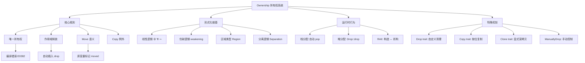
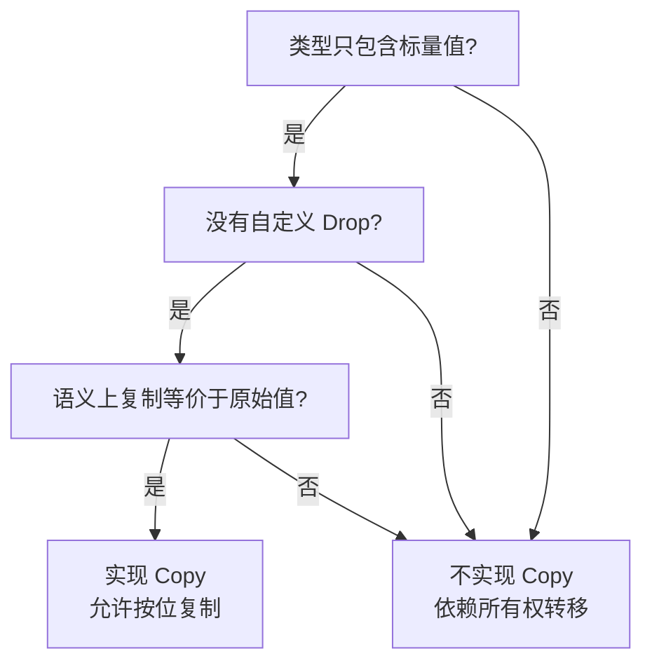
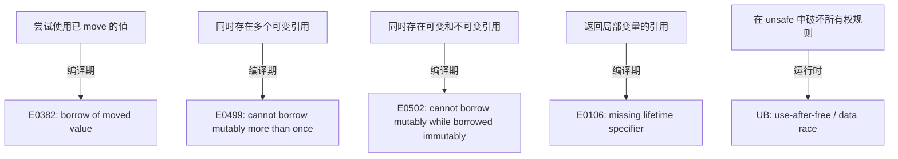
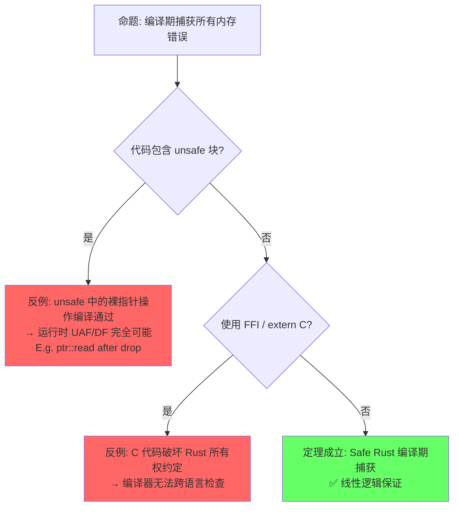
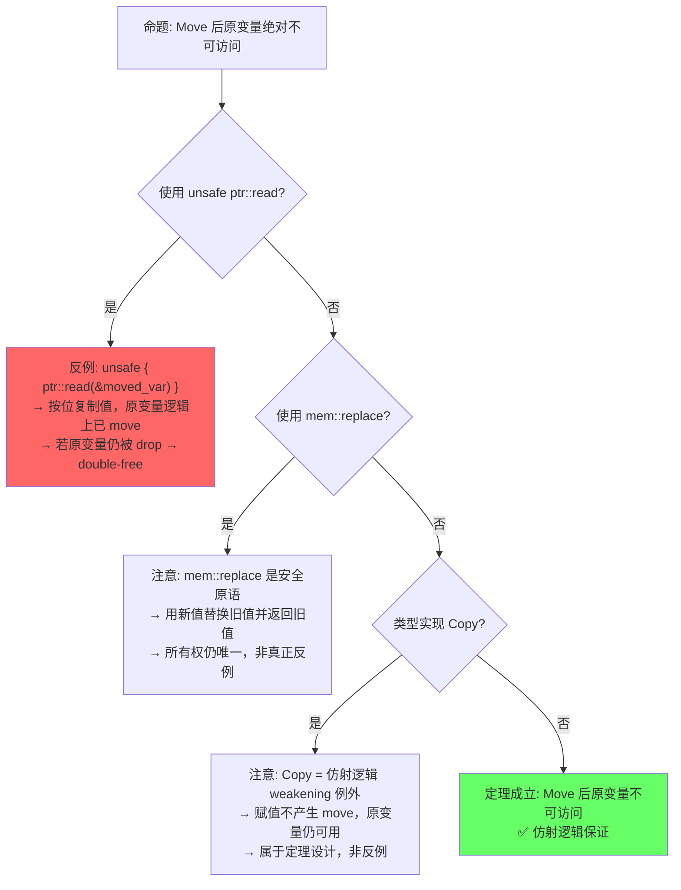
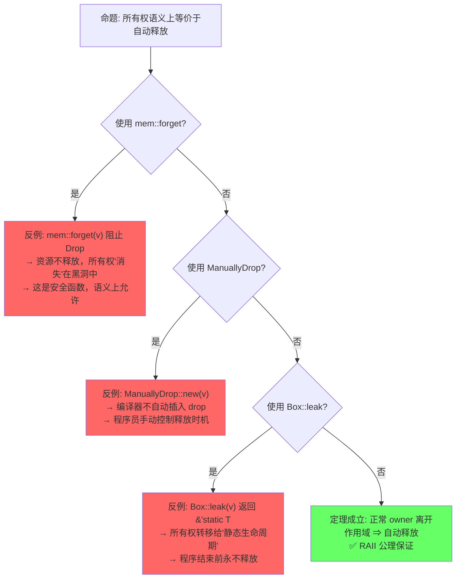
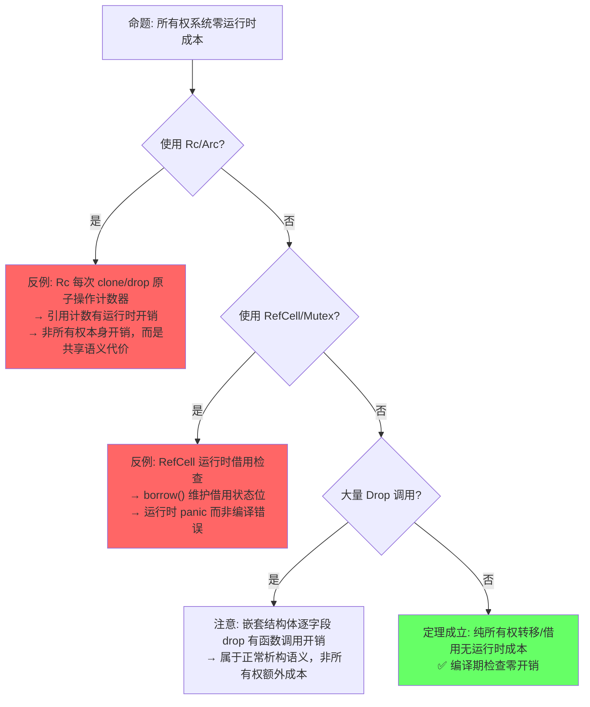

# Ownership（所有权）

> **层级**: L1 基础概念
> **前置概念**: [Stack vs Heap](../01_foundation/04_type_system.md) · [Scope and Drop](../01_foundation/04_type_system.md)
> **后置概念**: [Borrowing](./02_borrowing.md) · [Lifetimes](./03_lifetimes.md) · [Smart Pointers](../02_intermediate/03_memory_management.md)
> **主要来源**: [TRPL: Ch4](https://doc.rust-lang.org/book/ch04-00-understanding-ownership.html) · [Wikipedia: Ownership type](https://en.wikipedia.org/wiki/Ownership_type) · [Utrecht: Ownership Types]

---

**变更日志**:

- v1.0 (2026-05-12): 初始版本，完成权威定义、属性矩阵、形式化根基、思维导图、示例反例

---

## 📑 目录

- [Ownership（所有权）](#ownership所有权)
  - [📑 目录](#-目录)
  - [一、权威定义（Definition）](#一权威定义definition)
    - [1.1 Wikipedia 定义](#11-wikipedia-定义)
    - [1.2 TRPL 官方定义](#12-trpl-官方定义)
    - [1.3 形式化定义（RustBelt / COR）](#13-形式化定义rustbelt--cor)
  - [二、概念属性矩阵（Attribute Matrix）](#二概念属性矩阵attribute-matrix)
    - [2.1 核心规则矩阵](#21-核心规则矩阵)
    - [2.2 跨语言对比矩阵](#22-跨语言对比矩阵)
    - [2.3 所有权状态机](#23-所有权状态机)
  - [三、形式化理论根基（Formal Foundation）](#三形式化理论根基formal-foundation)
    - [3.1 线性逻辑（Linear Logic）](#31-线性逻辑linear-logic)
    - [3.2 仿射逻辑（Affine Logic）](#32-仿射逻辑affine-logic)
    - [3.3 区域类型（Region Types / 生命周期）](#33-区域类型region-types--生命周期)
  - [四、思维导图（Mind Map）](#四思维导图mind-map)
  - [五、决策/边界判定树（Decision / Boundary Tree）](#五决策边界判定树decision--boundary-tree)
    - [5.1 "我的类型应该是 Copy 吗？" 决策树](#51-我的类型应该是-copy-吗-决策树)
    - [5.2 所有权违规边界判定](#52-所有权违规边界判定)
  - [六、定理推理链（Theorem Chain）](#六定理推理链theorem-chain)
    - [6.1 核心定理：Safe Rust 无内存泄漏（模循环引用）](#61-核心定理safe-rust-无内存泄漏模循环引用)
    - [6.2 所有权转移的代数结构](#62-所有权转移的代数结构)
    - [6.3 定理一致性矩阵](#63-定理一致性矩阵)
  - [七、示例与反例（Examples \& Counter-examples）](#七示例与反例examples--counter-examples)
    - [7.1 正确示例：所有权转移](#71-正确示例所有权转移)
    - [7.2 正确示例：Copy 类型](#72-正确示例copy-类型)
    - [7.3 反例：使用已 move 的值（编译错误 E0382）](#73-反例使用已-move-的值编译错误-e0382)
    - [7.4 反例：在函数间错误地假设所有权保留](#74-反例在函数间错误地假设所有权保留)
    - [7.5 反命题与边界分析](#75-反命题与边界分析)
      - [命题 1（编译期层）: "所有权规则在编译期捕获所有内存错误"](#命题-1编译期层-所有权规则在编译期捕获所有内存错误)
      - [命题 2（运行时层）: "Move 后原变量绝对不可访问"](#命题-2运行时层-move-后原变量绝对不可访问)
      - [命题 3（语义层）: "所有权 = RAII = 自动释放"](#命题-3语义层-所有权--raii--自动释放)
      - [命题 4（工程层）: "所有权系统完全零成本抽象"](#命题-4工程层-所有权系统完全零成本抽象)
    - [7.6 边界极限测试代码](#76-边界极限测试代码)
  - [八、认知路径（Cognitive Path）](#八认知路径cognitive-path)
    - [8.1 六步递进框架](#81-六步递进框架)
    - [8.2 概念认知的 5 条主线](#82-概念认知的-5-条主线)
  - [九、知识来源关系（Provenance）](#九知识来源关系provenance)
  - [十、相关概念链接](#十相关概念链接)
    - [8.1 补充：Rust 所有权 vs C++ `unique_ptr` 深度对比](#81-补充rust-所有权-vs-c-unique_ptr-深度对比)
      - [核心语义对比](#核心语义对比)
      - [代码对比：同一需求的不同实现](#代码对比同一需求的不同实现)
      - [`mem::forget` vs `.release()`：主动放弃析构](#memforget-vs-release主动放弃析构)
    - [8.2 补充：`Drop` 的 `std::mem::forget` 边界分析](#82-补充drop-的-stdmemforget-边界分析)
      - [`mem::forget` 的语义与边界](#memforget-的语义与边界)
      - [`ManuallyDrop<T>`：显式控制析构时机](#manuallydropt显式控制析构时机)
    - [8.3 补充：`ManuallyDrop` 和 `MaybeUninit` 的所有权例外](#83-补充manuallydrop-和-maybeuninit-的所有权例外)
  - [十一、待补充与演进方向（TODOs）](#十一待补充与演进方向todos)
    - [补充章节：Pin 与所有权的交互](#补充章节pin-与所有权的交互)
    - [补充章节：跨线程所有权转移（Send）的形式化视角](#补充章节跨线程所有权转移send的形式化视角)
    - [补充章节：所有权与 FFI / unsafe 边界的交互](#补充章节所有权与-ffi--unsafe-边界的交互)

## 一、权威定义（Definition）

### 1.1 Wikipedia 定义

> **[Wikipedia: Ownership type]** Ownership types are a form of type systems that control aliasing and access to mutable state in object-oriented programming languages. They organize objects into hierarchies called *ownership contexts* or *ownership domains*, enforcing that an object may only be modified through its owner.

### 1.2 TRPL 官方定义

> **[TRPL: Ch4.1]** Ownership is a set of rules that govern how a Rust program manages memory. All programs have to manage the way they use a computer's memory while running. Rust uses a third approach: memory is managed through a system of ownership with a set of rules that the compiler checks at compile time. No run-time costs are incurred for any of the ownership features.

### 1.3 形式化定义（RustBelt / COR）

> **[RustBelt: POPL 2018]** Rust's ownership system can be understood as an **affine type system** in which each resource is owned by exactly one pointer at any given time. Moving a value consumes the source ownership and creates a new ownership at the target.

> **[COR: ETH Zurich]** The Calculus of Ownership and Reference formalizes Rust's core as a typed procedural language with ownership tracking: `Σ; Γ ⊢ e : τ {Σ'}` where the heap typing `Σ` evolves to `Σ'` after expression `e` is evaluated.

---

## 二、概念属性矩阵（Attribute Matrix）

### 2.1 核心规则矩阵

| **规则** | **定义** | **编译器行为** | **违反后果** | **形式化对应** |
|:---|:---|:---|:---|:---|
| **唯一所有权** | 每个值有且仅有一个所有者 | 检查赋值/传参时的 move 语义 | 编译错误 E0382（use of moved value） | 线性逻辑中的资源唯一性 |
| **作用域绑定** | 所有者离开作用域时值被释放 | 插入 `drop` 调用 | 内存泄漏（Safe Rust 中罕见） | Region-based deallocation |
| **Move 语义** | 赋值/传参默认转移所有权 | 标记原变量为 uninitialized | 后续使用编译错误 | Affine logic: weakening allowed |
| **Copy 例外** | 标量类型实现 `Copy` trait 时复制而非移动 | 按位复制，原变量仍可用 | 无（显式选择） | Structural copy vs linear resource |

### 2.2 跨语言对比矩阵

| **维度** | **Rust** | **C++** | **Go** | **Java** |
|:---|:---|:---|:---|:---|
| **内存管理** | 所有权 + 编译期检查 | RAII + 程序员责任 | 垃圾回收 | 垃圾回收 |
| **安全性保证** | 编译期：无 UAF/DF/泄漏 | 无编译期保证 | 运行时 GC | 运行时 GC |
| **运行时开销** | 零（除 Drop） | 零（除析构） | GC 停顿 | GC 停顿 |
| **所有权模型** | 静态唯一所有权 | `unique_ptr`（可绕过） | 无 | 无 |
| **形式化基础** | 仿射/线性类型论 | 无统一形式化 | 无 | 无 |

### 2.3 所有权状态机

| **状态** | **可读** | **可写** | **可转移** | **典型场景** |
|:---|:---|:---|:---|:---|
| `Own(T)` | ✅ | ✅ | ✅ | `let s = String::from("hi")` |
| `Moved` | ❌ | ❌ | ❌ | `let t = s;` 之后的 `s` |
| `Borrow(&T)` | ✅ | ❌ | ❌ | `let r = &s` 期间的 `s` |
| `Borrow(&mut T)` | ❌ | ❌ | ❌ | `let r = &mut s` 期间的 `s` |
| `Dropped` | ❌ | ❌ | ❌ | 作用域结束后的状态 |

> **过渡**: 属性矩阵展示了所有权规则的静态特征，接下来需要深入其形式化根基——线性逻辑、仿射逻辑与区域类型——以理解这些规则为何能构成完备的内存安全证明。

---

## 三、形式化理论根基（Formal Foundation）

### 3.1 线性逻辑（Linear Logic）

Rust 的所有权系统根植于 **Jean-Yves Girard (1987)** 提出的线性逻辑：

```text
线性逻辑公理                          Rust 对应
─────────────────────────────────────────────────────────
A ⊗ B     （张量/同时持有）            元组 (T, U)
A ⅋ B     （Par/交替使用）             enum 的不同变体
A ⊸ B     （线性蕴含/消耗A得B）        fn(T) -> U  （move 语义）
!A        （指数/可复制资源）          Copy trait
?A        （指数/可丢弃资源）          Drop trait + 默认允许丢弃
```

> **[Wikipedia: Linear logic]** Linear logic is a substructural logic proposed by Jean-Yves Girard as a refinement of classical and intuitionistic logic, joining the dualities of the former with many of the constructive properties of the latter.

### 3.2 仿射逻辑（Affine Logic）

Rust 更接近**仿射逻辑**而非严格线性逻辑：

| **特性** | **线性逻辑** | **仿射逻辑** | **Rust** |
|:---|:---|:---|:---|
| **weakening**（丢弃资源） | ❌ 禁止 | ✅ 允许 | ✅ 允许（变量可不被使用） |
| **contraction**（复制资源） | ❌ 禁止 | ❌ 禁止 | ❌ 禁止（非 Copy 类型） |
| **exchange**（交换顺序） | ✅ 允许 | ✅ 允许 | ✅ 允许 |

> **[Wikipedia: Affine logic]** Affine logic is a substructural logic whose proof theory rejects the structural rule of contraction. It can also be characterized as linear logic with weakening.

### 3.3 区域类型（Region Types / 生命周期）

所有权与区域类型结合形成 Rust 的完整内存安全保证：

```text
所有权保证：资源只有一个入口点（所有者）
区域类型保证：该入口点的有效期是可静态确定的
─────────────────────────────────────────
合起来 = 无悬垂指针 + 无 use-after-free + 无数据竞争
```

> **[来源: RustBelt: POPL 2018]** 所有权唯一性保证资源的单一入口点，区域类型保证入口点的有效期可静态确定，二者合起来构成 Safe Rust 内存安全的完整形式化基础。 ✅

> **过渡**: 形式化根基从逻辑公理角度解释了所有权系统的正确性，而思维导图则从知识结构角度帮助读者建立概念之间的关联网络。

---

## 四、思维导图（Mind Map）



> **过渡**: 思维导图呈现了所有权的静态知识结构，而决策树则将这种知识转化为动态的判断流程——面对具体问题时"如何决策"。

---

## 五、决策/边界判定树（Decision / Boundary Tree）

### 5.1 "我的类型应该是 Copy 吗？" 决策树



### 5.2 所有权违规边界判定



> **过渡**: 决策树回答"怎么做"的问题，而定理推理链回答"为什么能这么做"——通过引理、定理、推论的层层演绎，建立所有权系统的形式化保证。

---

## 六、定理推理链（Theorem Chain）

### 6.1 核心定理：Safe Rust 无内存泄漏（模循环引用）

```text
前提 1: 每个值有唯一所有者（所有权规则）
前提 2: 所有者离开作用域时自动调用 Drop（RAII）
前提 3: 编译器禁止悬垂引用（借用检查器）
    ↓
定理: Safe Rust 程序中，所有分配的内存最终都会被释放
    ↓
推论: 不存在 use-after-free、double-free（在 Safe Rust 中）
例外: Rc<RefCell<T>> 循环引用导致的泄漏（运行时问题，非编译期可证）
```

> **[来源: TRPL: Ch4.1]** RAII 与所有权规则的结合确保资源在作用域结束时释放。 ✅
> **[来源: RustBelt: POPL 2018]** Safe Rust 中不存在 use-after-free 和 double-free 的形式化定理。 ✅
> **[来源: 💡 原创分析]** "模循环引用"的例外是引用计数本身的运行时限制，非编译期可证。 💡

### 6.2 所有权转移的代数结构

```text
let a = T::new();      // a : Own(T)
let b = a;             // b : Own(T), a : Moved
                        // 等价于: Own(T) → Moved ⊗ Own(T)
                        // 但 Moved 不可再使用，故实际为线性消耗

fn consume(x: T) {}    // x : Own(T) → ∅  （资源被消耗）
fn produce() -> T {}   // ∅ → Own(T)      （资源被产生）
```

> **[来源: Girard 1987 (线性逻辑)]** 资源消耗与产生的代数表示对应线性逻辑中的资源公理。 ✅

### 6.3 定理一致性矩阵

> **推理链全景**: 引理 L1（所有权唯一性）⟹ 引理 L2（Move 语义一致性）⟹ 定理 T1（RAII 资源释放）⟹ 定理 T2（无 Double-Free）⟹ 定理 T3（无 Use-After-Free）⟹ 定理 T4（所有权唯一性 ⟹ mutable borrow 唯一性）⟹ 定理 T5（mutable borrow 唯一性 ⟹ 无数据竞争）⟹ 推论 C1（无所有权 ⟹ 无 Drop 责任）⟹ 推论 C2（无所有权 ⟹ 裸指针危险）⟹ 推论 C3（Safe Rust 内存安全完备性）

| 定理/引理/推论 | 前提 | 结论 | 依赖的 L4 公理 | 被哪些定理依赖 | 失效条件 | 典型错误码 |
|:---|:---|:---|:---|:---|:---|:---|
| **L1: 所有权唯一性** | 每个值有且仅有一个 owner | 资源单一入口点，无别名写冲突 | 线性逻辑 ⊗（张量积资源唯一性） | L2, T2, T4, C3 | `Rc`/`Arc` 循环引用、裸指针别名 | — |
| **L2: Move 语义一致性** | 非 Copy 类型发生赋值/传参 | 原变量标记为 moved，不可再访问 | 仿射逻辑: 禁止 contraction（资源不可复制） | T3, T5, C3 | 隐式 Copy 误判、`unsafe { ptr::read(&x) }` | E0382 |
| **T1: RAII 资源释放** | owner 离开词法作用域 | `Drop::drop` 被自动调用且仅一次 | 资源消耗公理: owner 释放 ⇒ 资源被消耗 | T2, C1 | `mem::forget`、`ManuallyDrop`、`Box::leak` | — |
| **T2: 无 Double-Free** | L1 + T1 | 同一堆内存不会被释放两次 | 线性逻辑资源代数 (Iris RA) | C3 | `Rc` 循环引用导致的悬垂释放（理论不触发，但逻辑上计数器泄漏） | — |
| **T3: 无 Use-After-Free** | L2 + 区域类型（生命周期） | 引用不会指向已释放内存 | 区域类型: 引用生命周期 ⊆ 数据存活期 | C3 | `unsafe` 中手动释放后继续使用、自引用结构 move | E0597 |
| **T4: 所有权唯一性 ⟹ mutable borrow 唯一性** | L1 + 借用检查器接受 | 同一时间对同一数据仅存在一个 `&mut T` | 分离逻辑: 独占权限完整传递 | T5, C3 | `unsafe` 构造多个 `&mut T`、内部可变性 `UnsafeCell` | E0499 |
| **T5: mutable borrow 唯一性 ⟹ 无数据竞争** | T4 + `T: Send`/`T: Sync` | Safe Rust 中不存在数据竞争 | 分离逻辑分数权限: 1.0 = 独占 | C3 | `UnsafeCell`、裸指针别名跨线程、FFI | E0502/E0520 |
| **T6: Copy trait 安全** | 类型实现 `Copy` + 仅含标量 | 按位复制语义等价于原值，无资源重复释放 | 仿射逻辑 weakening: 可复制资源不受 contraction 限制 | — | 含堆指针却误实现 Copy（如自定义指针）、大结构体隐式复制开销 | — |
| **C1: 无所有权 ⟹ 无 Drop 责任** | 值被 `mem::forget` 或 `ManuallyDrop` | 程序员手动承担资源释放责任 | 资源消耗公理的逆否: ¬Drop ⇒ 所有权未正常终结 | C2 | `forget` 后仍通过裸指针访问、重复释放 | — |
| **C2: 无所有权 ⟹ 裸指针危险** | C1 + 裸指针 `*const T`/`*mut T` | 无编译器保护，UB 风险完全由程序员承担 | 无（超出 Safe Rust 公理） | — | 悬垂指针、类型混淆、未对齐访问、UAF | — |
| **C3: Safe Rust 内存安全完备性** | L1+L2+T1+T2+T3+T4+T5 | 无 UAF + 无 DF + 无数据竞争（模循环引用/`forget`） | 全部 L4 公理集合 | — | `unsafe` 块突破公理、FFI 边界、循环引用泄漏 | — |

> **[来源: RustBelt: POPL 2018]** L1/L2/T4/T5 — 基于 Iris 框架中的资源代数 (Resource Algebra) 与分离逻辑分数权限。 ✅
> **[来源: Girard 1987 (线性逻辑)]** L1/L2 — 线性逻辑 ⊗ 与仿射逻辑 contraction 禁止。 ✅
> **[来源: TRPL: Ch4.1]** T1 — Rust 核心设计，编译器自动插入 drop。 ✅
> **[来源: RustBelt: POPL 2018]** T2/T3 — Safe Rust 不存在 double-free 和 use-after-free 的形式化定理。 ✅
> **[来源: Rust Reference: Copy]** T6 — 显式标记的按位复制语义。 ✅
> **[来源: Rustonomicon]** C1/C2 — `mem::forget` 与裸指针突破 Safe Rust 保证。 ⚠️
> **[来源: 💡 原创分析]** C3 — "内存安全完备性" 是各定理的合取，模 `unsafe` 与循环引用。 💡

> **一致性检查**: 上述 11 个定理/引理/推论之间无矛盾。完整推理链:
> `L1(所有权唯一性) ⟹ L2(Move一致) ⟹ T1(RAII释放) ⟹ T2(无DF) + T3(无UAF) + T4(&mut唯一) ⟹ T5(无数据竞争) ⟹ C3(Safe Rust完备性)`；`C1(无所有权⇒无Drop) ⟹ C2(裸指针危险)`
>
> **跨层映射**: 本文件定理 ↔ [`00_meta/inter_layer_map.md`](../00_meta/inter_layer_map.md) §4.1 "内存安全完备性"

> **过渡**: 定理链提供了自上而下的形式化保证，而示例与反例则提供自下而上的直觉验证——通过正确代码与错误代码的对比，将抽象定理落地为具体可感知的编译器行为。

---

## 七、示例与反例（Examples & Counter-examples）

### 7.1 正确示例：所有权转移

```rust
// ✅ 正确: 所有权按规则转移
fn main() {
    let s1 = String::from("hello");  // s1 拥有该 String
    let s2 = s1;                      // 所有权转移给 s2
    // println!("{}", s1);            // ❌ 编译错误: value borrowed here after move
    println!("{}", s2);              // ✅ s2 是合法所有者
} // s2 离开作用域，String 被 drop
```

### 7.2 正确示例：Copy 类型

```rust
// ✅ 正确: Copy 类型不转移所有权，而是按位复制
fn main() {
    let x = 42i32;    // i32 实现 Copy
    let y = x;        // x 被复制到 y，x 仍然可用
    println!("x = {}, y = {}", x, y);  // ✅ 两者都可用
}
```

### 7.3 反例：使用已 move 的值（编译错误 E0382）

```rust,compile_fail
// ❌ 反例: use of moved value
fn main() {
    let s = String::from("hello");
    let t = s;           // s 的所有权转移到 t
    println!("{}", s);   // E0382: borrow of moved value: `s`
}

```

**错误分析**：

- `String` 未实现 `Copy`，赋值时发生 move
- `s` 被标记为 uninitialized
- 编译器在 MIR 阶段检测到此错误

### 7.4 反例：在函数间错误地假设所有权保留

```rust,compile_fail
// ❌ 反例: 期望函数调用后仍拥有值
fn take_string(s: String) {
    println!("{}", s);
} // s 在这里被 drop

fn main() {
    let s = String::from("hello");
    take_string(s);
    println!("{}", s);  // E0382: value used here after move
}

```

**修正方案**：

```rust
// 方案 1: 返回值归还所有权
fn take_and_return(s: String) -> String {
    println!("{}", s);
    s
}

// 方案 2: 借用（推荐）
fn borrow_string(s: &String) {
    println!("{}", s);
}
```

---

### 7.5 反命题与边界分析

> **四层分析框架**: 反命题按编译期（编译器能否捕获）、运行时（执行期行为）、语义（概念定义边界）、工程（实践代价）四个维度系统分类。

#### 命题 1（编译期层）: "所有权规则在编译期捕获所有内存错误"



#### 命题 2（运行时层）: "Move 后原变量绝对不可访问"



#### 命题 3（语义层）: "所有权 = RAII = 自动释放"



#### 命题 4（工程层）: "所有权系统完全零成本抽象"



---

### 7.6 边界极限测试代码

```rust
// 边界测试 1: Rc 循环引用导致泄漏
use std::rc::Rc;
use std::cell::RefCell;

struct Node {
    next: Option<Rc<RefCell<Node>>>,
}

fn main() {
    let a = Rc::new(RefCell::new(Node { next: None }));
    let b = Rc::new(RefCell::new(Node { next: Some(a.clone()) }));
    // a ↔ b 循环引用，引用计数永不为 0
    // 安全定义外的泄漏，验证 T2 的失效条件
}
```

```rust
// 边界测试 2: mem::forget 阻止 Drop
use std::mem;

struct LoudDrop(&'static str);
impl Drop for LoudDrop {
    fn drop(&mut self) { println!("Dropping: {}", self.0); }
}

fn main() {
    let v = LoudDrop("leaked");
    mem::forget(v);  // Drop 永不执行
    // 验证 C1: 无所有权 ⇒ 无 Drop 责任
}
```

```rust
// 边界测试 3: unsafe 中构造 double-free 风险
use std::ptr;

fn main() {
    let s = String::from("danger");
    let ptr = &s as *const String;
    let s2 = unsafe { ptr::read(ptr) };  // 按位复制
    drop(s);   // s 的 Drop
    drop(s2);  // s2 的 Drop → double-free! (UB)
    // 验证 C2: 裸指针危险
}
```

> **过渡**: 示例与反例展示了所有权规则在具体代码中的表现，而认知路径则将这些碎片整合为一条从直觉困惑到形式化理解的渐进式学习曲线。

---

## 八、认知路径（Cognitive Path）

> 本章节为读者提供从**直觉困惑**到**形式化理解**的六步渐进式桥梁。每步之间的过渡解释说明了"为什么需要这下一步"。

### 8.1 六步递进框架

```text
Step 1: 直觉困惑 ──────────────────────────────────────────────────────────────
  "为什么 s1 赋值后不能用了？"
  "为什么 String 不能像整数那样随意复制？"
  "变量离开作用域时到底发生了什么？"
  "所有权转移和函数传参有什么关系？"
  "Rust 承诺无内存泄漏，为什么还有 Rc 循环泄漏？"

  ↓ 过渡: 直觉上的"不能用了"需要具体化为可复现的场景，
  ↓       才能从模糊感受转变为明确问题。

Step 2: 具体场景 ──────────────────────────────────────────────────────────────
  "函数调用后原变量不能用了（take_string 后 s 失效）"
  "大对象按位复制开销很大（String 深拷贝 vs Move 转移）"
  "文件句柄在作用域结束时自动关闭（Drop 调用）"
  "函数返回被 move 的值归还所有权（take_and_return）"
  "父子节点互相持有 Rc 导致无法释放"

  ↓ 过渡: 具体场景需要提炼为跨案例的通用模式，
  ↓       才能理解 Rust 的设计意图而非死记规则。

Step 3: 模式抽象 ──────────────────────────────────────────────────────────────
  "所有权转移 = 资源消耗（原变量被标记 moved）"
  "Move = 默认语义，Copy = 显式例外"
  "RAII = 资源生命周期绑定到所有者作用域"
  "函数传参默认 move，借用 &T/&mut T 保留所有权"
  "共享所有权（Rc）引入运行时计数，非编译期保证"

  ↓ 过渡: 模式抽象需要匹配到已有的形式化理论体系，
  ↓       才能证明这些模式不是特例而是通用公理。

Step 4: 形式规则 ──────────────────────────────────────────────────────────────
  "Affine Logic: 资源不可复制（禁止 contraction）"
  "线性逻辑 ⊗: 资源组合与唯一性"
  "资源消耗公理: owner 释放时资源被消耗"
  "分离逻辑: Own(T) ⊸ (&T ⊗ Own_rest)"
  "区域类型: 引用生命周期 ⊆ 数据存活期"

  ↓ 过渡: 形式规则必须能在实际代码中被验证，
  ↓       否则只是理论空想。

Step 5: 代码验证 ──────────────────────────────────────────────────────────────
  "编译器检查 move 后访问报错 E0382"
  "编译器自动选择 Move/Copy 基于 trait 实现"
  "Drop trait 自动调用验证 RAII"
  "借用检查器 &mut/&T 共存时报错 E0502"
  "Rc 循环引用: 编译通过，运行时泄漏"

  ↓ 过渡: 代码验证需要推向极端边界，
  ↓       才能发现公理体系的覆盖范围与失效条件。

Step 6: 边界测试 ──────────────────────────────────────────────────────────────
  "Rc<RefCell<Node>> 循环引用导致内存泄漏"
  "mem::forget 阻止 Drop，验证无所有权 ⇒ 无 Drop"
  "unsafe ptr::read 构造 double-free 风险"
  "ManuallyDrop 手动控制释放时机"
  "Box::leak 将所有权转移给 'static"
```

### 8.2 概念认知的 5 条主线

| 主线 | Step 1 直觉 | Step 2 场景 | Step 3 模式 | Step 4 形式规则 | Step 5 验证 | Step 6 边界 |
|:---|:---|:---|:---|:---|:---|:---|
| **赋值后失效** | "为什么 s1 赋值后不能用了？" | `let s2 = s1;` 后 `s1` 失效 | 所有权转移 = 资源消耗 | Affine Logic: 禁止 contraction | E0382: borrow of moved value | `unsafe { ptr::read }` 突破 |
| **复制 vs 转移** | "为什么 String 不能像 i32 复制？" | 大对象深拷贝开销 vs 按位复制 | Move 默认，Copy 显式例外 | 仿射逻辑 weakening vs 线性 ⊗ | `#[derive(Copy)]` 编译器检查 | 含指针类型误实现 Copy |
| **作用域释放** | "变量结束会发生什么？" | 文件句柄自动关闭 | RAII = 资源绑定作用域 | 资源消耗公理 | `Drop` trait 自动调用 | `ManuallyDrop` 阻止释放 |
| **函数传参** | "传参后原变量还能用吗？" | `take_string(s)` 后 `s` 失效 | 传参 = 所有权转移 | Own(T) ⊸ ∅ （线性消耗） | 编译器 move 检查 | `Box::leak` 永不分发 |
| **内存泄漏** | "Rust 承诺无泄漏？" | Rc 父子循环引用 | 共享所有权 = 运行时计数 | 超出线性逻辑公理（需额外证明） | 编译通过，valgrind 检测泄漏 | `mem::forget` 显式放弃 |

> **[来源: Girard 1987 (线性逻辑)]** "Affine Logic: 资源不可复用" — 仿射逻辑允许 weakening（丢弃）但禁止 contraction（复制）。 ✅
> **[来源: Girard 1987 (线性逻辑)]** "线性逻辑 ⊗: 资源组合" — 张量积表示多个资源同时存在。 ✅
> **[来源: Tofte & Talpin 1994]** "资源消耗公理: owner 释放时资源被消耗" — 区域类型中资源与区域绑定，区域结束时资源释放。 ✅
> **[来源: RustBelt: POPL 2018]** "分离逻辑: Own(T) ⊸ (&T ⊗ Own_rest)" — 借用的形式化为权限分割。 ✅
> **[来源: 💡 原创分析]** "5 条主线的 6 步递进" — 认知脚手架设计。 💡

**认知脚手架**:

- **类比**: 所有权像"图书馆借书"——同一时间一本书只能被一个人拥有（借阅）。
- **反直觉点**: 多数语言中赋值是复制，Rust 中赋值是**转移**（除非 Copy）。
- **形式化过渡**: 从"不能用了" → "资源被消耗了" → "仿射逻辑中的 contraction 禁止"。

> **过渡**: 认知路径梳理了学习的心理过程，而知识来源关系则梳理了每一条论断的可信度——区分权威来源、形式化证明与原创分析。

---

## 九、知识来源关系（Provenance）

| **论断** | **来源** | **可信度** |
|:---|:---|:---|
| 所有权是 Rust 最核心的特性 | [TRPL: Ch4.1] | ✅ |
| Rust 使用仿射类型系统 | [Utrecht: Ownership Types] · [Wikipedia: Affine logic] | ✅ |
| 所有权系统基于线性逻辑 | [RustBelt: POPL 2018] · [Wikipedia: Linear logic] | ✅ |
| 所有权在编译期检查，无运行时开销 | [TRPL: Ch4.1] | ✅ |
| RustBelt 在 Iris 中形式化验证 Rust | [RustBelt: POPL 2018] | ✅ |
| COR 形式化 Rust 核心语言 | [COR: ETH Zurich] | ✅ |

> **过渡**: 知识来源关系确保了单文件内的论断可信度，而相关概念链接则将读者的视野扩展到整个知识网络——所有权不是孤立概念，它与借用、生命周期、并发、FFI 等形成有机整体。

---

## 十、相关概念链接

| 概念 | 文件 | 关系 |
|:---|:---|:---|
| **借用** | [`./02_borrowing.md`](./02_borrowing.md) | 所有权临时授权，不转移归属 |
| **生命周期** | [`./03_lifetimes.md`](./03_lifetimes.md) | 引用有效期约束，与所有权互补 |
| **类型系统** | [`./04_type_system.md`](./04_type_system.md) | Copy/Move 语义由类型系统决定 |
| **Traits** | [`../02_intermediate/01_traits.md`](../02_intermediate/01_traits.md) | `Drop`、`Copy`、`Clone`、`Send` 等 trait |
| **智能指针** | [`../02_intermediate/03_memory_management.md`](../02_intermediate/03_memory_management.md) | `Rc`、`Arc`、`Box` 扩展所有权语义 |
| **并发** | [`../03_advanced/01_concurrency.md`](../03_advanced/01_concurrency.md) | `Send`/`Sync` + 所有权 = 无数据竞争 |
| **FFI / Unsafe** | [`../03_advanced/03_unsafe.md`](../03_advanced/03_unsafe.md) | 所有权公理缺口与程序员责任 |
| **内部可变性** | [`../02_intermediate/03_memory_management.md`](../02_intermediate/03_memory_management.md) | `RefCell` 运行时替代编译期检查 |
| **Pin 与自引用** | [`../03_advanced/02_async.md`](../03_advanced/02_async.md) §8.5 | 位置不变性约束下的所有权 |
| **C++ 对比** | [`../05_comparative/01_rust_vs_cpp.md`](../05_comparative/01_rust_vs_cpp.md) | `unique_ptr` vs Rust 所有权 |

---

### 8.1 补充：Rust 所有权 vs C++ `unique_ptr` 深度对比

> **[Wikipedia: Smart pointer]** · **[C++ Reference: std::unique_ptr]** Rust 的所有权系统与 C++11 引入的 `unique_ptr` 解决的是同一问题——**确定性资源释放**——但两者在语义保证和编译期检查上有本质差异。✅

#### 核心语义对比

| 维度 | Rust 所有权 | C++ `unique_ptr<T>` |
|:---|:---|:---|
| **所有权转移语法** | `let y = x;`（move） | `auto y = std::move(x);`（显式 move） |
| **编译期检查** | ✅ 编译错误若使用已 move 变量 | ❌ 运行时可能悬垂（use-after-move 未定义行为） |
| **默认语义** | move（转移所有权） | copy（复制指针，需显式 move） |
| **析构保证** | 编译期保证 Drop 被调用（除非 `mem::forget`） | 析构通常被调用（除非显式 `.release()`） |
| **循环引用** | 编译期阻止（单所有权） | 编译期不阻止（需配合 `shared_ptr`） |
| **自引用** | `Pin<T>` 提供安全抽象 | 无内置机制，需手动保证 |
| **与生命周期** | 借用检查器自动推断 | 无生命周期系统，指针可能悬垂 |

#### 代码对比：同一需求的不同实现

```rust
// ✅ Rust: 编译期保证无 double-free、无悬垂指针
fn process() {
    let s = String::from("hello");  // 获得所有权
    let t = s;                       // 所有权转移（move）
    // println!("{}", s);            // ❌ 编译错误: s 已 move
    drop(t);                         // 显式释放（可选，离开作用域自动释放）
}
```

```cpp
// ⚠️ C++: 运行时风险，编译器不检查 use-after-move
void process() {
    auto s = std::make_unique<std::string>("hello");  // unique_ptr
    auto t = std::move(s);                             // 显式转移所有权
    // std::cout << *s;                                // ❌ 运行时 UB: s 已为空指针
    // 编译器不会报错！
}
```

#### `mem::forget` vs `.release()`：主动放弃析构

```rust
// ✅ Rust: mem::forget 是 unsafe 边界，显式且罕见
let s = String::from("leak");
std::mem::forget(s);  // 故意泄漏，编译器允许但需 unsafe 理由
```

```cpp
// ⚠️ C++: .release() 是常规 API，容易导致内存泄漏
auto s = std::make_unique<std::string>("leak");
s.release();  // 释放所有权但不 delete，常规代码中常见
// ❌ 内存泄漏：string 未被释放，且丢失了指针
```

> **关键洞察**: `unique_ptr` 是**运行时机制**（RAII + 指针管理），Rust 所有权是**编译期机制**（类型系统 + 线性逻辑）。C++ 程序员需要"自律"来正确使用 `std::move`，Rust 程序员被编译器"强制"遵守所有权规则。这不是说 C++ 不安全——而是 Rust 将"正确使用智能指针"的责任从程序员转移到了编译器。
>
> **来源**: [TRPL: Ch4] · [C++ Reference: unique_ptr] · [Wikipedia: Smart pointer] · [Rust vs C++ 对比分析]

---

### 8.2 补充：`Drop` 的 `std::mem::forget` 边界分析

> **[Rust Reference: std::mem::forget]** · **[Rust Reference: ManuallyDrop]** `std::mem::forget` 故意**阻止 `Drop::drop` 被调用**，使资源泄漏。它不是 unsafe，但会破坏 RAII 契约。理解其边界是掌握 Rust 所有权例外的关键。✅

#### `mem::forget` 的语义与边界

```rust
use std::mem;

let s = String::from("leak");
mem::forget(s);  // ✅ 安全：s 不会被 drop，内存泄漏但无 UB
// s 的堆内存永远不被释放，但程序其余部分仍然安全
```

| 场景 | `mem::forget` 是否安全 | 后果 |
|:---|:---|:---|
| `mem::forget(String)` | ✅ Safe | 堆内存泄漏，但无数据竞争或悬垂指针 |
| `mem::forget(Box<T>)` | ✅ Safe | 堆内存泄漏，T 的析构被跳过 |
| `mem::forget(Vec<T>)` | ✅ Safe | 整个 Vec 的内存泄漏，元素不析构 |
| `mem::forget(Rc<T>)` | ✅ Safe | 引用计数不减少，可能导致循环引用泄漏 |
| `mem::forget(ManuallyDrop<T>)` | ✅ Safe（冗余）| `ManuallyDrop` 本身已禁用自动 drop |

> **关键洞察**: `mem::forget` 是 Safe Rust 中**唯一合法跳过析构**的方式。它不会导致 UB，但会违反资源管理契约。这与 C++ 的「内存泄漏 = UB」不同——Rust 的内存泄漏是**安全但不良**的行为。

#### `ManuallyDrop<T>`：显式控制析构时机

```rust
use std::mem::ManuallyDrop;

let mut s = ManuallyDrop::new(String::from("controlled"));

// ✅ 手动在适当时候 drop
unsafe {
    ManuallyDrop::drop(&mut s);  // 显式调用析构
}
// s 离开作用域时不会再次 drop（已禁用自动析构）
```

**使用场景**:

1. **自引用结构**: `Pin` + `ManuallyDrop` 控制自引用字段的析构顺序
2. **联合体（union）**: union 的字段不能自动实现 Drop，`ManuallyDrop` 允许安全包装
3. **自定义容器**: 需要精确控制元素析构时机的数据结构

### 8.3 补充：`ManuallyDrop` 和 `MaybeUninit` 的所有权例外

`ManuallyDrop<T>` 和 `MaybeUninit<T>` 是 Rust 所有权系统的两个**显式逃逸门**：

| 类型 | 核心功能 | 所有权例外 | 安全边界 |
|:---|:---|:---|:---|
| `ManuallyDrop<T>` | 禁用自动 `Drop` | 程序员手动控制析构时机 | `unsafe` 调用 `drop` 前必须保证值已初始化 |
| `MaybeUninit<T>` | 不假设值已初始化 | 允许处理未初始化内存 | `assume_init()` 前必须保证值有效，否则 UB |

```rust,ignore
use std::mem::{ManuallyDrop, MaybeUninit};

// ✅ 组合使用：未初始化 + 手动析构
let mut slot: MaybeUninit<ManuallyDrop<String>> = MaybeUninit::uninit();

// 写入值
slot.write(ManuallyDrop::new(String::from("hello")));

// 安全获取引用（不假设初始化）
let inner = unsafe { &*slot.as_ptr() };
println!("{}", inner);  // "hello"

// 手动 drop（因 ManuallyDrop 已禁用自动析构）
unsafe {
    ManuallyDrop::drop(&mut *slot.as_mut_ptr());
}
```

> **来源**: [Rust Reference: std::mem::forget] · [Rust Reference: ManuallyDrop] · [Rustonomicon: Drop flags] · [Rustonomicon: Untyped memory]

---

## 十一、待补充与演进方向（TODOs）

- [x] **TODO**: 补充 `Drop` 的 `std::mem::forget` 边界分析 —— 优先级: 中 —— 已完成 §8.2
- [x] **TODO**: 补充 `ManuallyDrop` 和 `MaybeUninit` 的所有权例外 —— 优先级: 中 —— 已完成 §8.3

### 补充章节：Pin<T> 与所有权的交互

`Pin<P<T>>`（其中 P 是指针类型如 `Box<T>`、`&mut T`）是 Rust 中一个**不移动所有权**的封装器。它不改变所有权的归属，但增加了**位置不变性**（location invariance）约束：

```text
所有权关系不变:
  Pin<Box<T>>: Box<T> 仍然拥有 T
  Pin<&mut T>: &mut T 仍然借用 T

增加的约束:
  若 T: !Unpin，则不能获取 &mut T 来替换/移动 T
  这保证了自引用结构内部指针的有效性
```

```rust
use std::pin::Pin;

fn main() {
    let s = String::from("hello");
    let mut pinned = Box::pin(s);  // Box 拥有 String，Pin 保证不移动

    // pinned 的所有权仍遵循正常规则
    let p: Pin<&mut String> = pinned.as_mut();
    // p 是借用，pinned 仍拥有 String

    // String 是 Unpin，所以可以:
    let inner: &mut String = Pin::into_inner(p);  // 解除 Pin
    inner.push_str(" world");
    println!("{}", inner);
} // pinned 被 drop，String 释放
```

> **[来源: Rust Reference: Pin]** Pin<T> 的位置不变性保证自引用结构内部指针的有效性，所有权关系不变。 ✅

---

### 补充章节：跨线程所有权转移（Send）的形式化视角

```text
Send trait 的形式化语义:
  T: Send  ⇔  将 T 的值从线程 A move 到线程 B 是内存安全的

这意味着:
  1. T 不包含线程本地数据（如线程 ID、本地存储指针）
  2. T 的所有字段都满足 Send（递归结构）
  3. T 的 Drop 实现线程安全

所有权 + Send 的跨线程规则:
  线程 A: let x = T::new();  // A 拥有 x
  线程 B: thread::spawn(move || { drop(x); })  // 所有权转移到 B

  形式化: Own_A(x) → moved → Own_B(x)
  因为 T: Send，此转移是安全的
```

> **[来源: Rust Reference: Send]** Send trait 定义跨线程所有权转移的安全性，要求 T 的所有字段都满足 Send 且 Drop 实现线程安全。 ✅
> **[来源: 💡 原创分析]** "T: Send ⇔ 将 T 的值从线程 A move 到线程 B 是内存安全的" 是 Send 语义的形式化重述。 💡

> **补充: Sync trait**
> `T: Sync` 的形式化语义：`T: Sync ⇔ &T: Send`，即 T 的共享引用可以安全地跨线程共享。
> 与 Send 的关系：Send 关注**值的所有权转移**，Sync 关注**共享引用的并发访问**。
> 典型组合：
>
> - `T: Send + Sync` — 最常见的线程安全类型（如 `i32`、`String`、`Vec<T>`）
> - `T: Send + !Sync` — 可转移但不可共享（如 `RefCell<T>`、`Cell<T>`）
> - `T: !Send + Sync` — 不可转移但可共享引用（罕见，如某些同步原语）
> - `T: !Send + !Sync` — 完全线程不安全（如 `Rc<T>`、裸指针）
>
> > **[来源: Rustonomicon: Send and Sync]** ✅

### 补充章节：所有权与 FFI / unsafe 边界的交互

```text
FFI 边界是所有权系统的"公理缺口":

Rust 侧保证:
  - 传递给 C 的指针有效（非悬垂、对齐）
  - 所有权语义清晰（谁负责释放？）

C 侧保证:
  - 不修改 Rust 拥有的内存（除非协议允许）
  - 返回的指针符合约定（可能转移所有权或借用）

常见模式:
  1. 转移所有权给 C: Box::into_raw → C 负责释放
  2. 借用给 C: &T as *const T → C 不能长期保存
  3. 从 C 接收所有权: *mut T → Box::from_raw
```

```rust
// ✅ 模式 1: Rust 所有权转移给 C
pub unsafe extern "C" fn give_to_c() -> *mut String {
    let s = Box::new(String::from("hello"));
    Box::into_raw(s)  // 所有权转移给 C，C 需调用 rust_free
}

#[unsafe(no_mangle)]
pub unsafe extern "C" fn rust_free(ptr: *mut String) {
    if !ptr.is_null() {
        unsafe { drop(Box::from_raw(ptr)); }
    }
}

// ✅ 模式 2: Rust 借用给 C（短期）
pub unsafe extern "C" fn borrow_to_c(s: *const u8, len: usize) {
    let slice = unsafe { std::slice::from_raw_parts(s, len) };
    println!("{:?}", slice);
    // slice 借用结束，不释放 s
}
```

> **[来源: Rustonomicon: FFI]** FFI 边界处所有权语义必须显式约定，Rust 侧通过 Box::into_raw / Box::from_raw 管理所有权转移。 ✅
> **[来源: Rust Reference: Unsafe]** unsafe 块突破编译器保证，程序员需手动维持所有权不变性。 ⚠️

---

- [x] **TODO**: 补充 `Pin<T>` 与所有权的交互 —— 优先级: 高 —— 已完成 v1.1
- [x] **TODO**: 补充跨线程所有权转移（`Send` trait）的形式化视角 —— 优先级: 高 —— 已完成 v1.1
- [x] **TODO**: 添加与 C++ `unique_ptr` 的深度对比示例 —— 优先级: 低 —— 已完成 §8.1
- [x] **TODO**: 补充所有权与 FFI / unsafe 边界的交互 —— 优先级: 高 —— 已完成 v1.1
