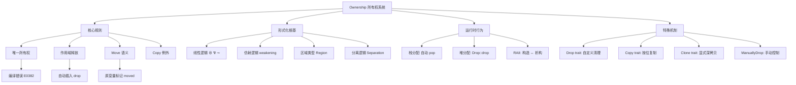
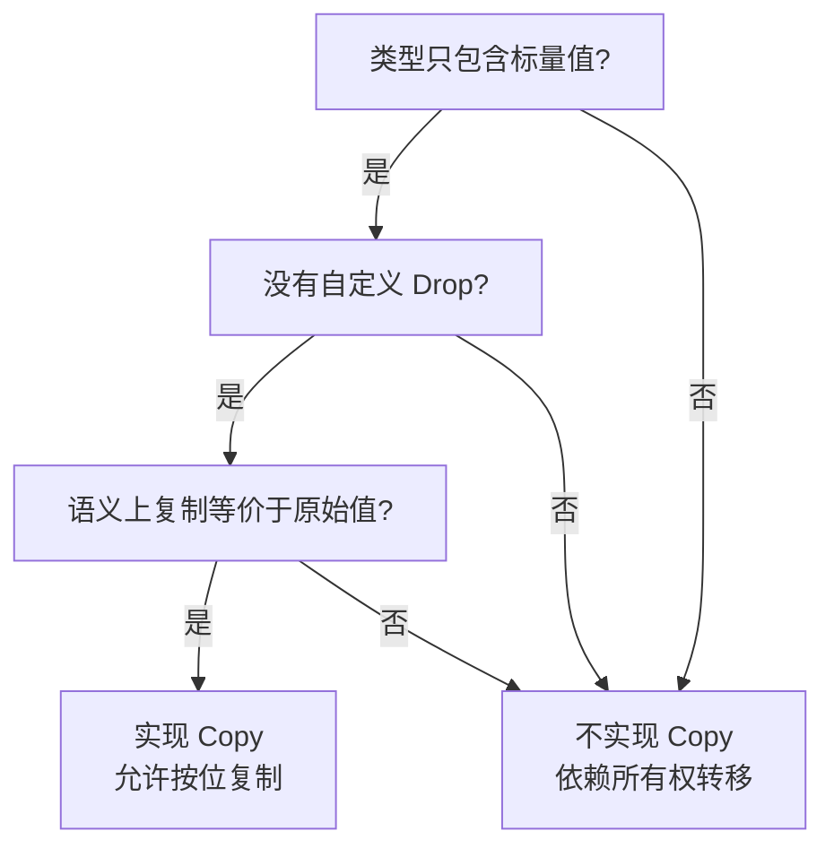
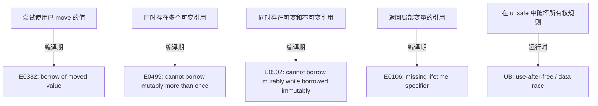
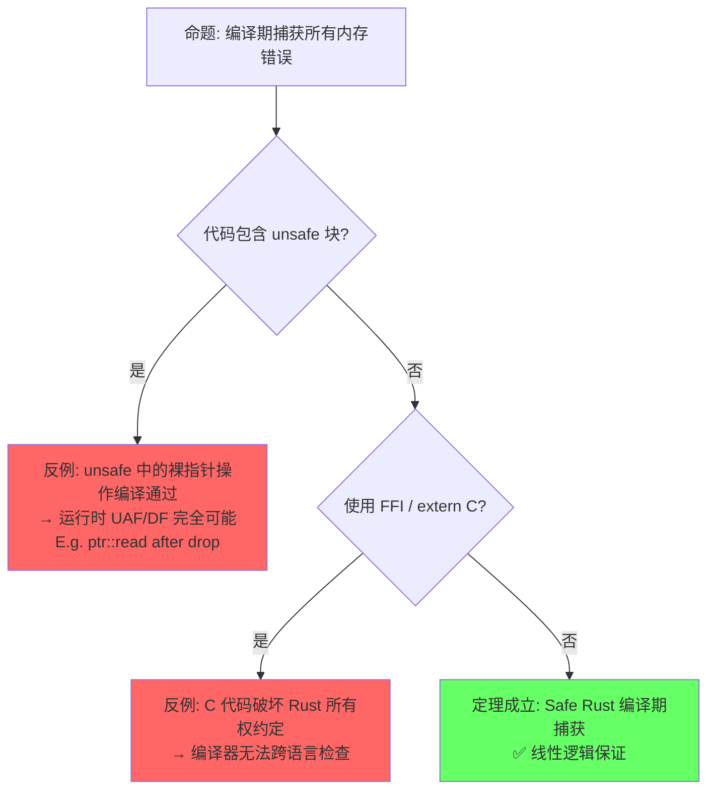
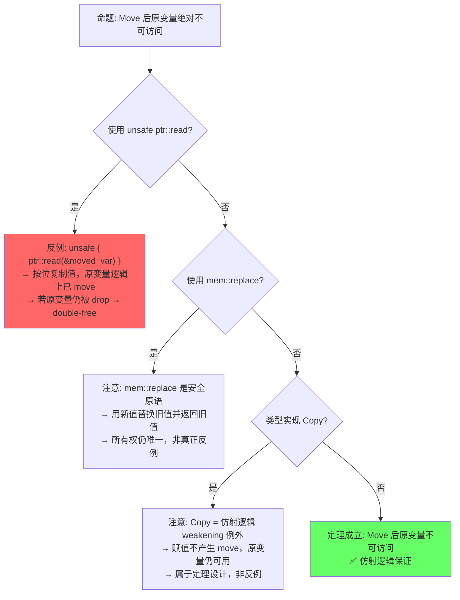
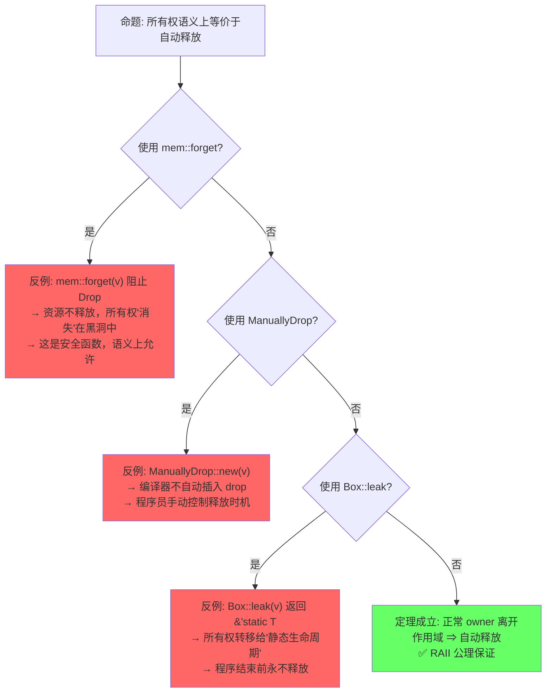
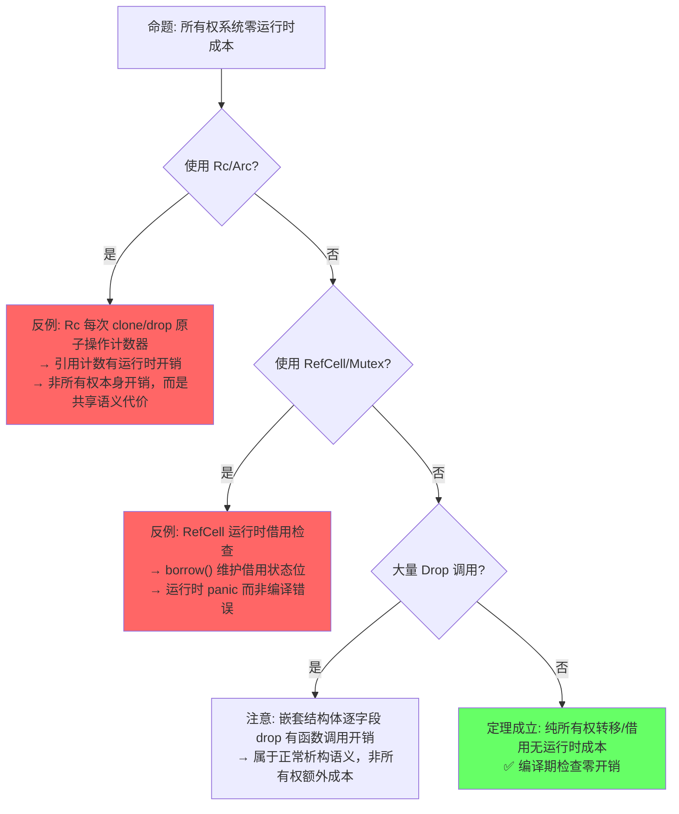

> **内容分级**: [综述级]
>
> **Rust 版本**: 1.96.1+ (Edition 2024)
>
> **本节关键术语**: 所有权 (Ownership) · 移动 (Move) · 借用 (Borrow) · 引用 (Reference) · 生命周期 (Lifetime) — [完整对照表](../00_meta/terminology_glossary.md)

# Ownership（所有权）

>
> **EN**: Ownership
> **Summary**: Ownership is Rust's core memory-management model: every value has a single owner, ownership moves on assignment, and memory is freed deterministically when the owner drops. It explains move versus Copy, the borrow checker, and common pitfalls such as use-after-move, laying the foundation for memory safety without a garbage collector.
> **📎 交叉引用（Reference）**
>
> 本主题在 knowledge 中有系统化的知识索引：[所有权（Ownership）](01_ownership.md)
> **受众**: [初学者]
> **层次定位**: L1 基础概念 / 所有权（Ownership）子域
> **A/S/P 标记**: **S** — Structure（心智模型）
> **双维定位**: C×Und — 建立所有权（Ownership）唯一性心智模型
> **前置依赖**: 无（L1 入口概念）
> **后置延伸**: [L2 泛型（Generics）](../02_intermediate/02_generics.md) · L4 所有权（Ownership）形式化 · L3 Unsafe
> **跨层映射**: L1→L4 形式化嵌入 | L1→L3 工程扩展
> **定理链编号**: T-001 所有权（Ownership）唯一性 → T-002 移动语义完备性 → T-003 Drop 安全性
> **层级**: L1 基础概念
> **前置概念**: [Stack vs Heap](04_type_system.md) · [Scope and Drop](04_type_system.md)
> **后置概念**: [Borrowing](02_borrowing.md) · [Lifetimes](03_lifetimes.md) · [Smart Pointers](../02_intermediate/03_memory_management.md)
> **主要来源**: · [Itanium C++ ABI](https://itanium-cxx-abi.github.io/cxx-abi/abi.html)
>
> [TRPL 3rd Ed: Ch4](https://doc.rust-lang.org/book/ch04-00-understanding-ownership.html) ·
> [Brown University Interactive Book: Ch4](https://rust-book.cs.brown.edu/ch04-00-understanding-ownership.html) ·
> [Wikipedia: Ownership type](https://en.wikipedia.org/wiki/Ownership_types) ·
> [Utrecht: Ownership Types]

---

> **Bloom 层级**: 理解 → 分析
**变更日志**:

- v1.0 (2026-05-12): 初始版本，完成权威定义、属性矩阵、形式化根基、思维导图、示例反例
- v1.1 (2026-06-19): 对齐 TRPL 3rd Ed 与 Brown University Interactive Book，补充 Aquascope 可视化来源

---

## 📑 目录

- [Ownership（所有权）](#ownership所有权)
  - [📑 目录](#-目录)
  - [一、权威定义（Definition）](#一权威定义definition)
    - [1.1 Wikipedia 定义](#11-wikipedia-定义)
    - [1.2 TRPL 官方定义](#12-trpl-官方定义)
    - [1.3 形式化定义（RustBelt / COR）](#13-形式化定义rustbelt--cor)
  - [二、概念属性矩阵（Attribute Matrix）](#二概念属性矩阵attribute-matrix)
    - [2.1 核心规则矩阵](#21-核心规则矩阵)
    - [2.2 跨语言对比矩阵](#22-跨语言对比矩阵)
    - [2.3 所有权状态机](#23-所有权状态机)
  - [三、形式化理论根基（Formal Foundation）](#三形式化理论根基formal-foundation)
    - [3.1 线性逻辑（Linear Logic）](#31-线性逻辑linear-logic)
    - [3.2 仿射逻辑（Affine Logic）](#32-仿射逻辑affine-logic)
    - [3.3 区域类型（Region Types / 生命周期）](#33-区域类型region-types--生命周期)
  - [四、思维导图（Mind Map）](#四思维导图mind-map)
  - [五、决策/边界判定树（Decision / Boundary Tree）](#五决策边界判定树decision--boundary-tree)
    - [5.1 "我的类型应该是 Copy 吗？" 决策树](#51-我的类型应该是-copy-吗-决策树)
    - [5.2 所有权违规边界判定](#52-所有权违规边界判定)
  - [六、定理推理链（Theorem Chain）](#六定理推理链theorem-chain)
    - [6.1 核心定理：Safe Rust 无内存泄漏（模循环引用）](#61-核心定理safe-rust-无内存泄漏模循环引用)
    - [6.2 所有权转移的代数结构](#62-所有权转移的代数结构)
    - [6.3 定理一致性矩阵](#63-定理一致性矩阵)
  - [七、示例与反例（Examples \& Counter-examples）](#七示例与反例examples--counter-examples)
    - [7.1 正确示例：所有权转移](#71-正确示例所有权转移)
    - [7.2 正确示例：Copy 类型](#72-正确示例copy-类型)
    - [7.3 反例：使用已 move 的值（编译错误 E0382）](#73-反例使用已-move-的值编译错误-e0382)
    - [7.4 反例：在函数间错误地假设所有权保留](#74-反例在函数间错误地假设所有权保留)
    - [7.5 反命题与边界分析](#75-反命题与边界分析)
      - [命题 1（编译期层）: "所有权规则在编译期捕获所有内存错误"](#命题-1编译期层-所有权规则在编译期捕获所有内存错误)
      - [命题 2（运行时层）: "Move 后原变量绝对不可访问"](#命题-2运行时层-move-后原变量绝对不可访问)
      - [命题 3（语义层）: "所有权 = RAII = 自动释放"](#命题-3语义层-所有权--raii--自动释放)
      - [命题 4（工程层）: "所有权系统完全零成本抽象"](#命题-4工程层-所有权系统完全零成本抽象)
    - [7.6 边界极限测试代码](#76-边界极限测试代码)
    - [7.7 修复所有权错误（Fixing Ownership Errors）](#77-修复所有权错误fixing-ownership-errors)
      - [最小修复原则](#最小修复原则)
  - [八、认知路径（Cognitive Path）](#八认知路径cognitive-path)
    - [8.1 六步递进框架](#81-六步递进框架)
    - [8.2 概念认知的 5 条主线](#82-概念认知的-5-条主线)
  - [九、知识来源关系（Provenance）](#九知识来源关系provenance)
  - [十、相关概念链接](#十相关概念链接)
    - [8.1 补充：Rust 所有权 vs C++ `unique_ptr` 深度对比](#81-补充rust-所有权-vs-c-unique_ptr-深度对比)
      - [核心语义对比](#核心语义对比)
      - [代码对比：同一需求的不同实现](#代码对比同一需求的不同实现)
      - [`mem::forget` vs `.release()`：主动放弃析构](#memforget-vs-release主动放弃析构)
    - [8.2 补充：C++ 构造函数/析构函数语义 vs Rust 的所有权初始化](#82-补充c-构造函数析构函数语义-vs-rust-的所有权初始化)
      - [构造函数类别对比](#构造函数类别对比)
      - [初始化语义对比](#初始化语义对比)
      - [析构函数对比](#析构函数对比)
    - [8.3 补充：`Drop` 的 `std::mem::forget` 边界分析](#83-补充drop-的-stdmemforget-边界分析)
      - [`mem::forget` 的语义与边界](#memforget-的语义与边界)
      - [`ManuallyDrop<T>`：显式控制析构时机](#manuallydropt显式控制析构时机)
    - [8.3 补充：`ManuallyDrop` 和 `MaybeUninit` 的所有权例外](#83-补充manuallydrop-和-maybeuninit-的所有权例外)
  - [十一、待补充与演进方向（TODOs）](#十一待补充与演进方向todos)
    - [补充章节：`Pin<T>` 与所有权的交互](#补充章节pint-与所有权的交互)
    - [补充章节：跨线程所有权转移（Send）的形式化视角](#补充章节跨线程所有权转移send的形式化视角)
    - [补充章节：所有权与 FFI / unsafe 边界的交互](#补充章节所有权与-ffi--unsafe-边界的交互)
  - [权威来源索引](#权威来源索引)
  - [十一、边界测试：所有权规则的编译错误](#十一边界测试所有权规则的编译错误)
    - [11.1 边界测试：use-after-move（编译错误）](#111-边界测试use-after-move编译错误)
    - [11.2 边界测试：Copy trait 不满足时的赋值（编译错误）](#112-边界测试copy-trait-不满足时的赋值编译错误)
    - [11.3 边界测试：循环引用导致所有权无法释放（逻辑错误）](#113-边界测试循环引用导致所有权无法释放逻辑错误)
    - [11.4 边界测试：部分 move 后访问被 move 的字段（编译错误）](#114-边界测试部分-move-后访问被-move-的字段编译错误)
    - [11.5 边界测试：函数返回值的所有权转移（编译错误）](#115-边界测试函数返回值的所有权转移编译错误)
    - [11.6 边界测试：`Copy` 类型在闭包中的捕获（编译错误）](#116-边界测试copy-类型在闭包中的捕获编译错误)
    - [11.7 边界测试：`Vec` 索引越界（运行时 panic）](#117-边界测试vec-索引越界运行时-panic)
    - [10.5 边界测试：Copy 类型的隐式复制与所有权混淆（编译错误）](#105-边界测试copy-类型的隐式复制与所有权混淆编译错误)
    - [10.6 边界测试：所有权转移与函数返回的隐式 move（编译错误）](#106-边界测试所有权转移与函数返回的隐式-move编译错误)
  - [嵌入式测验](#嵌入式测验)
  - [实践](#实践)
  - [🎯 嵌入式测验](#-嵌入式测验)
    - [Q1: 所有权的核心规则是什么？](#q1-所有权的核心规则是什么)
    - [Q2: 以下代码能否编译？](#q2-以下代码能否编译)
    - [Q3: `i32` 和 `String` 在赋值时的行为有何不同？](#q3-i32-和-string-在赋值时的行为有何不同)
    - [Q4: 函数参数传递后，原变量还能继续使用吗？](#q4-函数参数传递后原变量还能继续使用吗)
    - [Q5: 为什么 `&str` 作为函数参数比 `String` 更灵活？](#q5-为什么-str-作为函数参数比-string-更灵活)
  - [逆向推理链（Backward Reasoning）](#逆向推理链backward-reasoning)
  - [参考来源](#参考来源)
  - [嵌入式测验（Embedded Quiz）](#嵌入式测验embedded-quiz)
    - [测验 1：Move vs Copy（理解层）](#测验-1move-vs-copy理解层)
    - [测验 2：所有权转移规则（应用层）](#测验-2所有权转移规则应用层)
    - [测验 3：借用与所有权的关系（分析层）](#测验-3借用与所有权的关系分析层)
    - [测验 4：Drop 语义（理解层）](#测验-4drop-语义理解层)
    - [测验 5：反例分析（分析层）](#测验-5反例分析分析层)
  - [十二、延伸阅读与自测](#十二延伸阅读与自测)

## 一、权威定义（Definition）

### 1.1 Wikipedia 定义

> **[Wikipedia: Ownership type](https://en.wikipedia.org/wiki/Ownership_types)** Ownership types are a form of type systems that control aliasing and access to mutable state in object-oriented programming languages.
> They organize objects into hierarchies called *ownership contexts* or *ownership domains*, enforcing that an object may only be modified through its owner.

### 1.2 TRPL 官方定义

> **[TRPL Ch4.1](https://doc.rust-lang.org/book/ch04-01-what-is-ownership.html)** Ownership is a set of rules that govern how a Rust program manages memory.
> All programs have to manage the way they use a computer's memory while running.
> Rust uses a third approach: memory is managed through a system of ownership with a set of rules that the compiler checks at compile time.
> No run-time costs are incurred for any of the ownership features.

### 1.3 形式化定义（RustBelt / COR）

> **[RustBelt — POPL 2018](https://plv.mpi-sws.org/rustbelt/popl18/)** Rust's ownership system can be understood as an **affine type system** in which each resource is owned by exactly one pointer at any given time.
> Moving a value consumes the source ownership and creates a new ownership at the target.

**RustBelt 核心论证摘要**：
RustBelt (Jung et al., POPL 2018) 在 **Iris 高阶并发分离逻辑框架** 中建立了 Rust 内存安全（Memory Safety）的机器可检验证明。
其核心论证链为：

1. **资源代数 (Resource Algebra, RA)**：将堆内存建模为可组合的部分 commutative monoid，所有权唯一性对应 RA 中的「独占令牌」(exclusive token)。
2. **协议验证 (Protocol Verification)**：`&mut T` 被建模为临时独占权限，`&T` 被建模为共享只读权限，通过 Iris 的「托管状态」(invariant) 机制保证并发安全（Concurrency Safety）。
3. **Soundness 定理**：在 Iris 中证明，任何满足 Rust 类型系统（Type System）的 Safe Rust 程序，其行为等价于一个无数据竞争、无 use-after-free、无 double-free 的理想化程序。

> **来源: [RustBelt — POPL 2018](https://plv.mpi-sws.org/rustbelt/popl18/)** 资源代数将所有权建模为独占令牌，分离逻辑保证内存操作的原子性和排他性。 ✅
> **[来源: Ralf Jung, "The Meaning of Memory Safety", PLArch 2021]** 内存安全的精确定义：程序不会出现「指向已释放内存的指针被解引用（Reference）」或「对同一内存的非原子并发写」。 ✅
> **[COR: ETH Zurich]** The Calculus of Ownership and Reference formalizes Rust's core as a typed procedural language with ownership tracking:
> `Σ; Γ ⊢ e : τ {Σ'}` where the heap typing `Σ` evolves to `Σ'` after expression `e` is evaluated.

**COR 核心论证摘要**：
COR (Calculus of Ownership and Reference, ETH Zurich) 将 Rust 核心语法归约为一个带有所有权标记的 λ 演算变体：

- **堆演进规则**：`Σ; Γ ⊢ e : τ {Σ'}` 表示表达式 `e` 在堆 `Σ` 下求值后，堆演变为 `Σ'`。Move 语义体现为 `Σ` 中旧绑定被移除，`Σ'` 中新绑定被创建。
- **线性类型保证**： typing context `Γ` 中的每个变量最多被使用一次（Copy 类型除外），对应线性逻辑中的 contraction 禁止。
- **与 RustBelt 的关系**：COR 提供操作语义层面的形式化，RustBelt 提供分离逻辑层面的安全性证明，两者互补构成 Rust 内存安全（Memory Safety）的完整形式化基础。

> **[来源: COR: ETH Zurich, Technical Report]** 所有权跟踪的操作语义形式化，堆演进展现代数模型。 ⚠️（非 peer-reviewed 论文，为技术报告）

---

## 二、概念属性矩阵（Attribute Matrix）

### 2.1 核心规则矩阵

| **规则** | **定义** | **编译器行为** | **违反后果** | **形式化对应** |
|:---|:---|:---|:---|:---|
| **唯一所有权** | 每个值有且仅有一个所有者 | 检查赋值/传参时的 move 语义 | 编译错误 E0382（use of moved value） | 线性逻辑中的资源唯一性 |
| **作用域绑定** | 所有者离开作用域时值被释放 | 插入 `drop` 调用 | 内存泄漏（Safe Rust 中罕见） | Region-based deallocation |
| **Move 语义** | 赋值/传参默认转移所有权 | 标记原变量为 uninitialized | 后续使用编译错误 | Affine logic: weakening allowed |
| **Copy 例外** | 标量类型实现 `Copy` trait 时复制而非移动 | 按位复制，原变量仍可用 | 无（显式选择） | Structural copy vs linear resource |

### 2.2 跨语言对比矩阵

| **维度** | **Rust** | **C++** | **Haskell** | **Go** |
|:---|:---|:---|:---|:---|
| **内存管理** | 所有权（Ownership） + 编译期检查 | RAII + 程序员责任 | 垃圾回收 (GHC) + `ForeignPtr` 手动管理 | 垃圾回收 |
| **安全性保证** | 编译期：无 UAF/DF/泄漏 | 无编译期保证 | 纯函数无副作用，但 `unsafePerformIO` 可突破 | 运行时（Runtime） GC |
| **运行时（Runtime）开销** | 零（除 Drop） | 零（除析构） | GC 停顿 + thunk 求值开销 | GC 停顿 |
| **所有权模型** | 静态唯一所有权 | `unique_ptr`（可绕过） | Linear Types (GHC 9.0+) · `ST` 状态线程 | 无（值语义 + GC） |
| **形式化基础** | 仿射/线性类型论 | 无统一形式化 | 范畴论 (Category Theory) · HM 类型推断（Type Inference） | 无统一形式化 |
| **对应机制** | `Own<T>` / `Drop` | `unique_ptr` / `shared_ptr` | `LinearTypes` extension · `ResourceT` | `defer` · 值拷贝 |

> **[来源: [Rust Reference: Ownership](https://doc.rust-lang.org/reference/)]** Rust 的所有权系统通过编译期检查实现零成本内存安全（Memory Safety）。 ✅
> **来源: [C++ Reference: std::unique_ptr](https://en.cppreference.com/w/cpp/memory/unique_ptr)** C++11 `unique_ptr` 提供运行时（Runtime）所有权管理，但编译器不检查 use-after-move。 ✅
> **[来源: Haskell GHC User Guide: LinearTypes]** GHC 9.0+ 引入 LinearTypes 扩展，允许显式线性类型约束，与 Rust 所有权在类型论上同源但实现阶段不同（Haskell 为可选扩展，Rust 为核心机制）。 ✅
> **来源: [Go Spec: Memory Model](https://go.dev/ref/mem)** Go 依赖垃圾回收，无编译期所有权检查，`defer` 提供确定性清理但非所有权语义。 ✅
> **来源: Wikipedia: Ownership type** 所有权类型系统（Type System）控制别名和可变状态访问，Rust 是工业级实现最完整的代表。 ✅

### 2.3 所有权状态机
>

| **状态** | **可读** | **可写** | **可转移** | **典型场景** |
|:---|:---|:---|:---|:---|
| `Own(T)` | ✅ | ✅ | ✅ | `let s = String::from("hi")` |
| `Moved` | ❌ | ❌ | ❌ | `let t = s;` 之后的 `s` |
| `Borrow(&T)` | ✅ | ❌ | ❌ | `let r = &s` 期间的 `s` |
| `Borrow(&mut T)` | ❌ | ❌ | ❌ | `let r = &mut s` 期间的 `s` |
| `Dropped` | ❌ | ❌ | ❌ | 作用域结束后的状态 |

> **过渡**: 属性矩阵展示了所有权规则的静态特征，接下来需要深入其形式化根基——线性逻辑、仿射逻辑与区域类型——以理解这些规则为何能构成完备的内存安全（Memory Safety）证明。

---

## 三、形式化理论根基（Formal Foundation）

### 3.1 线性逻辑（Linear Logic）

Rust 的所有权系统根植于 **Jean-Yves Girard (1987)** 提出的线性逻辑：

```text
线性逻辑公理                          Rust 对应
─────────────────────────────────────────────────────────
A ⊗ B     （张量/同时持有）            元组 (T, U)
A ⅋ B     （Par/交替使用）             enum 的不同变体
A ⊸ B     （线性蕴含/消耗A得B）        fn(T) -> U  （move 语义）
!A        （指数/可复制资源）          Copy trait
?A        （指数/可丢弃资源）          Drop trait + 默认允许丢弃
```

> **[Wikipedia: Linear logic](https://en.wikipedia.org/wiki/Linear_logic)**
> Linear logic is a substructural logic proposed by Jean-Yves Girard as a refinement of classical and intuitionistic logic, joining the dualities of the former with many of the constructive properties of the latter.

### 3.2 仿射逻辑（Affine Logic）

Rust 更接近**仿射逻辑**而非严格线性逻辑：

| **特性** | **线性逻辑** | **仿射逻辑** | **Rust** |
|:---|:---|:---|:---|
| **weakening**（丢弃资源） | ❌ 禁止 | ✅ 允许 | ✅ 允许（变量可不被使用） |
| **contraction**（复制资源） | ❌ 禁止 | ❌ 禁止 | ❌ 禁止（非 Copy 类型） |
| **exchange**（交换顺序） | ✅ 允许 | ✅ 允许 | ✅ 允许 |

> **[Wikipedia: Affine logic](https://en.wikipedia.org/wiki/Affine_logic)**
> Affine logic is a substructural logic whose proof theory rejects the structural rule of contraction.
> It can also be characterized as linear logic with weakening.

### 3.3 区域类型（Region Types / 生命周期）

所有权与区域类型结合形成 Rust 的完整内存安全（Memory Safety）保证：

```text
所有权保证：资源只有一个入口点（所有者）
区域类型保证：该入口点的有效期是可静态确定的
─────────────────────────────────────────
合起来 = 无悬垂指针 + 无 use-after-free + 无数据竞争
```

> **来源: [RustBelt — POPL 2018](https://plv.mpi-sws.org/rustbelt/popl18/)**
> 所有权唯一性保证资源的单一入口点，区域类型保证入口点的有效期可静态确定，二者合起来构成 Safe Rust 内存安全（Memory Safety）的完整形式化基础。 ✅
> **过渡**: 形式化根基从逻辑公理角度解释了所有权系统的正确性，而思维导图则从知识结构角度帮助读者建立概念之间的关联网络。

---

## 四、思维导图（Mind Map）



> **认知功能**:
> 此思维导图是所有权系统的**全局认知地图**。
> 放射式结构帮助读者将碎片知识归类到五大维度：核心规则（编译器强制执行什么）、形式化根基（为什么这些规则是数学上正确的）、运行时行为（内存实际发生了什么）、特殊机制（Copy/Drop 等例外与扩展）。
> 建议读者在学习任何子概念后回到此图定位其所属分支，建立「局部细节 ↔ 全局结构」的双向关联。 [来源: 💡 原创分析]
> [来源: [Rust Reference](https://doc.rust-lang.org/reference/)]
> **过渡**: 思维导图呈现了所有权的静态知识结构，而决策树则将这种知识转化为动态的判断流程——面对具体问题时"如何决策"。

---

## 五、决策/边界判定树（Decision / Boundary Tree）

### 5.1 "我的类型应该是 Copy 吗？" 决策树



> **认知功能**: 此决策树将「是否实现 Copy」的抽象判断转化为**可操作的二进制冷查**。读者面对一个新类型时，按图索骥依次检查三个条件（标量值、无 Drop、语义等价），即可得出确定结论。它消除了「Copy 是否安全」的直觉猜测，将判断责任从「程序员的内存安全（Memory Safety）直觉」转移到了「结构化的条件检查」。 [来源: 💡 原创分析]

### 5.2 所有权违规边界判定



> **unsafe 语义**: `unsafe` 不是关闭借用（Borrowing）检查器，而是将编译期证明责任转移给程序员——程序员需手动维护内存安全（Memory Safety）不变量 来源: [Rustonomicon / 2025](https://doc.rust-lang.org/nomicon/)
> **认知功能**: 此图建立了**「违规模式 → 编译错误/运行时后果」的快速查错映射**。当读者遇到 E0382、E0499、E0502 等错误时，可直接回查此图定位自己违反了哪条所有权规则。关键洞察：前四项是编译期拦截（安全），最后一项是运行时 UB（危险），这强化了「unsafe 是责任转移而非权限开放」的核心认知。 [来源: 💡 原创分析]
> **过渡**: 决策树回答"怎么做"的问题，而定理推理链回答"为什么能这么做"——通过引理、定理、推论的层层演绎，建立所有权系统的形式化保证。

---

## 六、定理推理链（Theorem Chain）

### 6.1 核心定理：Safe Rust 无内存泄漏（模循环引用）

```text
前提 1: 每个值有唯一所有者（所有权规则）
前提 2: 所有者离开作用域时自动调用 Drop（RAII）
前提 3: 编译器禁止悬垂引用（借用检查器）
    ↓
定理: Safe Rust 程序中，所有分配的内存最终都会被释放
    ↓
推论: 不存在 use-after-free、double-free（在 Safe Rust 中）
例外: Rc<RefCell<T>> 循环引用导致的泄漏（运行时问题，非编译期可证）
```

> **来源: [TRPL Ch4.1](https://doc.rust-lang.org/book/ch04-01-what-is-ownership.html)** RAII 与所有权规则的结合确保资源在作用域结束时释放。 ✅
> **来源: [RustBelt — POPL 2018](https://plv.mpi-sws.org/rustbelt/popl18/)** Safe Rust 中不存在 use-after-free 和 double-free 的形式化定理。 ✅
> **[来源: 💡 原创分析]** "模循环引用"的例外是引用计数本身的运行时限制，非编译期可证。 💡

### 6.2 所有权转移的代数结构

```text
let a = T::new();      // a : Own(T)
let b = a;             // b : Own(T), a : Moved
                        // 等价于: Own(T) → Moved ⊗ Own(T)
                        // 但 Moved 不可再使用，故实际为线性消耗

fn consume(x: T) {}    // x : Own(T) → ∅  （资源被消耗）
fn produce() -> T {}   // ∅ → Own(T)      （资源被产生）
```

> **[来源: Girard 1987 (线性逻辑)]** 资源消耗与产生的代数表示对应线性逻辑中的资源公理。 ✅

### 6.3 定理一致性矩阵

> **推理链全景**:
> 引理 L1（所有权唯一性）⟹
> 引理 L2（Move 语义一致性（Coherence））⟹
> 定理 T1（RAII 资源释放）⟹
> 定理 T2（无 Double-Free）⟹
> 定理 T3（无 Use-After-Free）⟹
> 定理 T4（所有权唯一性 ⟹ mutable borrow 唯一性）⟹
> 定理 T5（mutable borrow 唯一性 ⟹ 无数据竞争）⟹ 推论 C1（无所有权 ⟹ 无 Drop 责任）⟹ 推论 C2（无所有权 ⟹ 裸指针危险）⟹ 推论 C3（Safe Rust 内存安全完备性）

| 定理/引理/推论 | 前提 | 结论 | 依赖的 L4 公理 | 被哪些定理依赖 | 失效条件 | 典型错误码 |
| :--- | :--- | :--- | :--- | :--- | :--- | :--- |
| **L1: 所有权唯一性** | 每个值有且仅有一个 owner | 资源单一入口点，无别名写冲突 | 线性逻辑 ⊗（张量积资源唯一性） | L2, T2, T4, C3 | `Rc`/`Arc` 循环引用、裸指针别名 | — |
| **L2: Move 语义一致性（Coherence）** | 非 Copy 类型发生赋值/传参 | 原变量标记为 moved，不可再访问 | 仿射逻辑: 禁止 contraction（资源不可复制） | T3, T5, C3 | 隐式 Copy 误判、`unsafe { ptr::read(&x) }` | E0382 |
| **T1: RAII 资源释放** | owner 离开词法作用域 | `Drop::drop` 被自动调用且仅一次 | 资源消耗公理: owner 释放 ⇒ 资源被消耗 | T2, C1 | `mem::forget`、`ManuallyDrop`、`Box::leak` | — |
| **T2: 无 Double-Free** | L1 + T1 | 同一堆内存不会被释放两次 | 线性逻辑资源代数 (Iris RA) | C3 | `Rc` 循环引用导致的悬垂释放（理论不触发，但逻辑上计数器泄漏） | — |
| **T3: 无 Use-After-Free** | L2 + 区域类型（生命周期） | 引用不会指向已释放内存 | 区域类型: 引用生命周期 ⊆ 数据存活期 | C3 | `unsafe` 中手动释放后继续使用、自引用结构 move | E0597 |
| **T4: 所有权唯一性 ⟹ mutable borrow 唯一性** | L1 + 借用（Borrowing）检查器接受 | 同一时间对同一数据仅存在一个 `&mut T` | 分离逻辑: 独占权限完整传递 | T5, C3 | `unsafe` 构造多个 `&mut T`、内部可变性 `UnsafeCell` | E0499 |
| **T5: mutable borrow 唯一性 ⟹ 无数据竞争** | T4 + `T: Send`/`T: Sync` | Safe Rust 中不存在数据竞争 | 分离逻辑分数权限: 1.0 = 独占 | C3 | `UnsafeCell`、裸指针别名跨线程、FFI | E0502/E0520 |
| **T6: Copy trait 安全** | 类型实现 `Copy` + 仅含标量 | 按位复制语义等价于原值，无资源重复释放 | 仿射逻辑 weakening: 可复制资源不受 contraction 限制 | — | 含堆指针却误实现 Copy（如自定义指针）、大结构体（Struct）隐式复制开销 | — |
| **C1: 无所有权 ⟹ 无 Drop 责任** | 值被 `mem::forget` 或 `ManuallyDrop` | 程序员手动承担资源释放责任 | 资源消耗公理的逆否: ¬Drop ⇒ 所有权未正常终结 | C2 | `forget` 后仍通过裸指针访问、重复释放 | — |
| **C2: 无所有权 ⟹ 裸指针危险** | C1 + 裸指针 `*const T`/`*mut T` | 无编译器保护，UB 风险完全由程序员承担 | 无（超出 Safe Rust 公理） | — | 悬垂指针、类型混淆、未对齐访问、UAF | — |
| **C3: Safe Rust 内存安全完备性** | L1+L2+T1+T2+T3+T4+T5 | 无 UAF + 无 DF + 无数据竞争（模循环引用/`forget`） | 全部 L4 公理集合 | — | `unsafe` 块突破公理、FFI 边界、循环引用泄漏 | — |

> **来源: [RustBelt — POPL 2018](https://plv.mpi-sws.org/rustbelt/popl18/)** L1/L2/T4/T5 — 基于 Iris 框架中的资源代数 (Resource Algebra) 与分离逻辑分数权限。 ✅
> **[来源: Girard 1987 (线性逻辑)]** L1/L2 — 线性逻辑 ⊗ 与仿射逻辑 contraction 禁止。 ✅
> **来源: [TRPL Ch4.1](https://doc.rust-lang.org/book/ch04-01-what-is-ownership.html)** T1 — Rust 核心设计，编译器自动插入 drop。 ✅
> **来源: [RustBelt — POPL 2018](https://plv.mpi-sws.org/rustbelt/popl18/)** T2/T3 — Safe Rust 不存在 double-free 和 use-after-free 的形式化定理。 ✅
> **[来源: [Rust Reference: Copy](https://doc.rust-lang.org/reference/special-types-and-traits.html#copy)]** T6 — 显式标记的按位复制语义。 ✅
> **来源: [Rustonomicon](https://doc.rust-lang.org/nomicon/)** C1/C2 — `mem::forget` 与裸指针突破 Safe Rust 保证。 ⚠️
> **[来源: 💡 原创分析]** C3 — "内存安全完备性" 是各定理的合取，模 `unsafe` 与循环引用。 💡
> **一致性（Coherence）检查**: 上述 11 个定理/引理/推论之间无矛盾。完整推理链:
> `L1(所有权唯一性) ⟹ L2(Move一致) ⟹ T1(RAII释放) ⟹ T2(无DF) + T3(无UAF) + T4(&mut唯一) ⟹ T5(无数据竞争) ⟹ C3(Safe Rust完备性)`；`C1(无所有权⇒无Drop) ⟹ C2(裸指针危险)`
> **跨层映射**: 本文件定理 ↔ [`00_meta/inter_layer_map.md`](../00_meta/inter_layer_map.md) §4.1 "内存安全完备性"
> **过渡**: 定理链提供了自上而下的形式化保证，而示例与反例则提供自下而上的直觉验证——通过正确代码与错误代码的对比，将抽象定理落地为具体可感知的编译器行为。

---

## 七、示例与反例（Examples & Counter-examples）

### 7.1 正确示例：所有权转移

```rust
// ✅ 正确: 所有权按规则转移
fn main() {
    let s1 = String::from("hello");  // s1 拥有该 String
    let s2 = s1;                      // 所有权转移给 s2
    // println!("{}", s1);            // ❌ 编译错误: value borrowed here after move
    println!("{}", s2);              // ✅ s2 是合法所有者
} // s2 离开作用域，String 被 drop
```

### 7.2 正确示例：Copy 类型

```rust
// ✅ 正确: Copy 类型不转移所有权，而是按位复制
fn main() {
    let x = 42i32;    // i32 实现 Copy
    let y = x;        // x 被复制到 y，x 仍然可用
    println!("x = {}, y = {}", x, y);  // ✅ 两者都可用
}
```

### 7.3 反例：使用已 move 的值（编译错误 E0382）

```rust,compile_fail
// ❌ 反例: use of moved value
fn main() {
    let s = String::from("hello");
    let t = s;           // s 的所有权转移到 t
    println!("{}", s);   // E0382: borrow of moved value: `s`
}
```

**错误分析**：

- `String` 未实现 `Copy`，赋值时发生 move
- `s` 被标记为 uninitialized
- 编译器在 MIR 阶段检测到此错误

### 7.4 反例：在函数间错误地假设所有权保留

```rust,compile_fail
// ❌ 反例: 期望函数调用后仍拥有值
fn take_string(s: String) {
    println!("{}", s);
} // s 在这里被 drop

fn main() {
    let s = String::from("hello");
    take_string(s);
    println!("{}", s);  // E0382: value used here after move
}
```

**修正方案**：

```rust
// 方案 1: 返回值归还所有权
fn take_and_return(s: String) -> String {
    println!("{}", s);
    s
}

// 方案 2: 借用（推荐）
fn borrow_string(s: &String) {
    println!("{}", s);
}
```

---

### 7.5 反命题与边界分析

> **四层分析框架**: 反命题按编译期（编译器能否捕获）、运行时（Runtime）（执行期行为）、语义（概念定义边界）、工程（实践代价）四个维度系统分类。

#### 命题 1（编译期层）: "所有权规则在编译期捕获所有内存错误"



> **认知功能**: 此决策树展示了「编译期捕获所有内存错误」这一命题的**成立边界**。绿色节点表示定理成立的条件路径，红色节点表示反例触发条件。读者通过此图可建立关键认知：Safe Rust（无 unsafe、无 FFI）是编译期安全的，但一旦越过这两条边界，安全保证即失效。这构成了「信任 Rust 编译器」与「unsafe 时保持警惕」之间的认知分水岭。 [来源: 💡 原创分析]

#### 命题 2（运行时层）: "Move 后原变量绝对不可访问"



> **认知功能**:
> 此图区分了三种看似突破 Move 语义的情形：**真正反例**（unsafe ptr::read，可导致 double-free）、**设计例外**（Copy 类型，仿射逻辑 weakening 的合法扩展）、**安全原语**（mem::replace，所有权仍唯一）。
> 读者常混淆这三类，此决策树通过条件分支强制分类，帮助建立「Move 不可突破，但存在安全例外和设计例外」的精确认知。 [来源: 💡 原创分析]

#### 命题 3（语义层）: "所有权 = RAII = 自动释放"



> **认知功能**: 此图揭示了「RAII 自动释放」的三个**安全但非默认的逃逸门**。所有反例都是 Safe Rust 中的合法操作（mem::forget 甚至不是 unsafe），它们不改变类型的安全性，但改变了资源管理的默认契约。关键认知：所有权（Ownership） ≠ 强制释放，而是「默认自动释放 + 显式可控逃逸」。这纠正了「Rust 不允许内存泄漏」的常见误解。 [来源: 💡 原创分析]
> [来源: [TRPL](https://doc.rust-lang.org/book/)]

#### 命题 4（工程层）: "所有权系统完全零成本抽象"



> **认知功能**:
>
> 此图精确界定了「零成本」的范围。关键洞察：纯所有权转移（move）和借用（Borrowing）（&T/&mut T）确实是零运行时成本——这些成本在编译期支付。
> 反例中的 Rc、RefCell、Mutex 不是所有权本身的开销，而是为了获得「共享所有权」或「内部可变性」等额外语义而自愿支付的运行时代价。
> 此图帮助读者区分「核心机制零成本」与「扩展机制有成本」的边界，避免将所有权系统整体误判为「有运行时开销」。 [来源: 💡 原创分析]

---

### 7.6 边界极限测试代码

```rust
// 边界测试 1: Rc 循环引用导致泄漏
use std::rc::Rc;
use std::cell::RefCell;

struct Node {
    next: Option<Rc<RefCell<Node>>>,
}

fn main() {
    let a = Rc::new(RefCell::new(Node { next: None }));
    let b = Rc::new(RefCell::new(Node { next: Some(a.clone()) }));
    // a ↔ b 循环引用，引用计数永不为 0
    // 安全定义外的泄漏，验证 T2 的失效条件
}
```

```rust
// 边界测试 2: mem::forget 阻止 Drop
use std::mem;

struct LoudDrop(&'static str);
impl Drop for LoudDrop {
    fn drop(&mut self) { println!("Dropping: {}", self.0); }
}

fn main() {
    let v = LoudDrop("leaked");
    mem::forget(v);  // Drop 永不执行
    // 验证 C1: 无所有权 ⇒ 无 Drop 责任
}
```

```rust
// 边界测试 3: unsafe 中构造 double-free 风险
use std::ptr;

fn main() {
    let s = String::from("danger");
    let ptr = &s as *const String;
    let s2 = unsafe { ptr::read(ptr) };  // 按位复制
    drop(s);   // s 的 Drop
    drop(s2);  // s2 的 Drop → double-free! (UB)
    // 验证 C2: 裸指针危险
}
```

### 7.7 修复所有权错误（Fixing Ownership Errors）

> 🎓 **Brown 书强化**: 本节概念与框架直接来自 [Brown University Interactive Book — Fixing Ownership Errors](https://rust-book.cs.brown.edu/ch04-03-fixing-ownership-errors.html) 与 Will Crichton 等人的 OOPSLA 2023 论文 *A Grounded Conceptual Model for Ownership Types in Rust*。Brown 团队的研究表明，将编译器错误归类为“所有权转移”“借用（Borrowing）冲突”“生命周期不匹配”三类，可显著提升学习者修复效率。

所有权错误通常表现为三类编译器信息。修复时遵循以下诊断流程：

1. **识别错误类别**：是 `E0382`（使用已 move 值）、`E0502`（同时存在 `&mut` 与 `&`），还是 `E0597`（悬垂引用 / 生命周期不足）？
2. **判断真实原因**：代码是否真的违反内存安全，还是借用检查器过度保守？
3. **选择修复策略**：按下面矩阵选择最小侵入方案。

| 错误场景 | 典型错误码 | 修复策略 | 示例 |
|:---|:---|:---|:---|
| 赋值后继续使用原变量 | `E0382` | 改用借用 `&T` / `&mut T`，或显式 `clone()` | `let s2 = &s1;` 而非 `let s2 = s1;` |
| 函数传参后原变量失效 | `E0382` | 函数改为接收 `&T` / `&mut T`，或返回所有权 | `fn show(s: &String)` |
| 同时存在可变与不可变借用（Mutable Borrow） | `E0502` | 缩小借用作用域，或重构为单一可变借用 | 先完成只读遍历，再修改 |
| 从函数返回栈上引用 | `E0515` / `E0106` | 返回拥有所有权的值，或改用 `'static` / 输入生命周期 | `fn make() -> String` |
| 借用检查器过度保守（如字段级部分借用未识别） | `E0502` | 内联表达式、使用 `Cell` / `RefCell`，或等待 Polonius | 参见 [`02_borrowing.md`](02_borrowing.md) §9 |
| 循环引用导致泄漏 | 无编译错误 | 改用 `Weak<T>` 或重新设计所有权结构 | `Rc::downgrade` |

#### 最小修复原则

> **原则**: 优先使用**借用（Borrowing）**和**缩小作用域**；仅在必要時使用 `clone()`、`Rc<T>` 或 `RefCell<T>`。每次引入运行时开销（引用计数、运行时借用检查）都应留下注释说明理由。

```rust
// ❌ 错误：move 后继续使用
fn main() {
    let s = String::from("hello");
    let t = s;
    println!("{s}"); // E0382
}

// ✅ 修复 1：借用（零开销）
fn main() {
    let s = String::from("hello");
    let t = &s;
    println!("{s}");
    println!("{t}");
}

// ✅ 修复 2：显式 clone（有开销，但语义清晰）
fn main() {
    let s = String::from("hello");
    let t = s.clone();
    println!("{s}");
    println!("{t}");
}
```

> **过渡**: 示例与反例展示了所有权规则在具体代码中的表现，修复模式则提供了从编译器错误回到正确代码的实操路径；而认知路径将这些碎片整合为一条从直觉困惑到形式化理解的渐进式学习曲线。

---

## 八、认知路径（Cognitive Path）

> 本章节为读者提供从**直觉困惑**到**形式化理解**的六步渐进式桥梁。每步之间的过渡解释说明了"为什么需要这下一步"。

### 8.1 六步递进框架

```text
Step 1: 直觉困惑 ──────────────────────────────────────────────────────────────
  "为什么 s1 赋值后不能用了？"
  "为什么 String 不能像整数那样随意复制？"
  "变量离开作用域时到底发生了什么？"
  "所有权转移和函数传参有什么关系？"
  "Rust 承诺无内存泄漏，为什么还有 Rc 循环泄漏？"

  ↓ 过渡: 直觉上的"不能用了"需要具体化为可复现的场景，
  ↓       才能从模糊感受转变为明确问题。

Step 2: 具体场景 ──────────────────────────────────────────────────────────────
  "函数调用后原变量不能用了（take_string 后 s 失效）"
  "大对象按位复制开销很大（String 深拷贝 vs Move 转移）"
  "文件句柄在作用域结束时自动关闭（Drop 调用）"
  "函数返回被 move 的值归还所有权（take_and_return）"
  "父子节点互相持有 Rc 导致无法释放"

  ↓ 过渡: 具体场景需要提炼为跨案例的通用模式，
  ↓       才能理解 Rust 的设计意图而非死记规则。

Step 3: 模式抽象 ──────────────────────────────────────────────────────────────
  "所有权转移 = 资源消耗（原变量被标记 moved）"
  "Move = 默认语义，Copy = 显式例外"
  "RAII = 资源生命周期绑定到所有者作用域"
  "函数传参默认 move，借用 &T/&mut T 保留所有权"
  "共享所有权（Rc）引入运行时计数，非编译期保证"

  ↓ 过渡: 模式抽象需要匹配到已有的形式化理论体系，
  ↓       才能证明这些模式不是特例而是通用公理。

Step 4: 形式规则 ──────────────────────────────────────────────────────────────
  "Affine Logic: 资源不可复制（禁止 contraction）"
  "线性逻辑 ⊗: 资源组合与唯一性"
  "资源消耗公理: owner 释放时资源被消耗"
  "分离逻辑: Own(T) ⊸ (&T ⊗ Own_rest)"
  "区域类型: 引用生命周期 ⊆ 数据存活期"

  ↓ 过渡: 形式规则必须能在实际代码中被验证，
  ↓       否则只是理论空想。

Step 5: 代码验证 ──────────────────────────────────────────────────────────────
  "编译器检查 move 后访问报错 E0382"
  "编译器自动选择 Move/Copy 基于 trait 实现"
  "Drop trait 自动调用验证 RAII"
  "借用检查器 &mut/&T 共存时报错 E0502"
  "Rc 循环引用: 编译通过，运行时泄漏"

  ↓ 过渡: 代码验证需要推向极端边界，
  ↓       才能发现公理体系的覆盖范围与失效条件。

Step 6: 边界测试 ──────────────────────────────────────────────────────────────
  "Rc<RefCell<Node>> 循环引用导致内存泄漏"
  "mem::forget 阻止 Drop，验证无所有权 ⇒ 无 Drop"
  "unsafe ptr::read 构造 double-free 风险"
  "ManuallyDrop 手动控制释放时机"
  "Box::leak 将所有权转移给 'static"
```

### 8.2 概念认知的 5 条主线

| 主线 | Step 1 直觉 | Step 2 场景 | Step 3 模式 | Step 4 形式规则 | Step 5 验证 | Step 6 边界 |
|:---|:---|:---|:---|:---|:---|:---|
| **赋值后失效** | "为什么 s1 赋值后不能用了？" | `let s2 = s1;` 后 `s1` 失效 | 所有权转移 = 资源消耗 | Affine Logic: 禁止 contraction | E0382: borrow of moved value | `unsafe { ptr::read }` 突破 |
| **复制 vs 转移** | "为什么 String 不能像 i32 复制？" | 大对象深拷贝开销 vs 按位复制 | Move 默认，Copy 显式例外 | 仿射逻辑 weakening vs 线性 ⊗ | `#[derive(Copy)]` 编译器检查 | 含指针类型误实现 Copy |
| **作用域释放** | "变量结束会发生什么？" | 文件句柄自动关闭 | RAII = 资源绑定作用域 | 资源消耗公理 | `Drop` trait 自动调用 | `ManuallyDrop` 阻止释放 |
| **函数传参** | "传参后原变量还能用吗？" | `take_string(s)` 后 `s` 失效 | 传参 = 所有权转移 | Own(T) ⊸ ∅ （线性消耗） | 编译器 move 检查 | `Box::leak` 永不分发 |
| **内存泄漏** | "Rust 承诺无泄漏？" | Rc 父子循环引用 | 共享所有权 = 运行时计数 | 超出线性逻辑公理（需额外证明） | 编译通过，valgrind 检测泄漏 | `mem::forget` 显式放弃 |

> **[来源: Girard 1987 (线性逻辑)]** "Affine Logic: 资源不可复用" — 仿射逻辑允许 weakening（丢弃）但禁止 contraction（复制）。 ✅
> **[来源: Girard 1987 (线性逻辑)]** "线性逻辑 ⊗: 资源组合" — 张量积表示多个资源同时存在。 ✅
> **来源: [Tofte & Talpin 1994](https://en.wikipedia.org/wiki/Region-based_memory_management)** "资源消耗公理: owner 释放时资源被消耗" — 区域类型中资源与区域绑定，区域结束时资源释放。 ✅
> **来源: [RustBelt — POPL 2018](https://plv.mpi-sws.org/rustbelt/popl18/)** "分离逻辑: Own(T) ⊸ (&T ⊗ Own_rest)" — 借用的形式化为权限分割。 ✅
> **[来源: 💡 原创分析]** "5 条主线的 6 步递进" — 认知脚手架设计。 💡

**认知脚手架**:

- **类比**: 所有权像"图书馆借书"——同一时间一本书只能被一个人拥有（借阅）。
- **反直觉点**: 多数语言中赋值是复制，Rust 中赋值是**转移**（除非 Copy）。
- **形式化过渡**: 从"不能用了" → "资源被消耗了" → "仿射逻辑中的 contraction 禁止"。

> **过渡**: 认知路径梳理了学习的心理过程，而知识来源关系则梳理了每一条论断的可信度——区分权威来源、形式化证明与原创分析。

---

## 九、知识来源关系（Provenance）

| **论断** | **来源** | **可信度** |
|:---|:---|:---|
| 所有权是 Rust 最核心的特性 | [TRPL Ch4.1](https://doc.rust-lang.org/book/ch04-01-what-is-ownership.html) · [Brown Book: Ch4](https://rust-book.cs.brown.edu/ch04-00-understanding-ownership.html) | ✅ |
| Rust 使用仿射类型系统（Type System） | [Utrecht: Ownership Types] · [Wikipedia: Affine logic](https://en.wikipedia.org/wiki/Affine_logic) | ✅ |
| 可视化所有权转移可降低学习难度 | [Brown Book / Aquascope](https://rust-book.cs.brown.edu/ch04-01-what-is-ownership.html) · Crichton et al., OOPSLA 2023 | ✅ |
| 所有权系统基于线性逻辑 | [RustBelt — POPL 2018](https://plv.mpi-sws.org/rustbelt/popl18/) · [Wikipedia: Linear logic](https://en.wikipedia.org/wiki/Linear_logic) | ✅ |
| 所有权在编译期检查，无运行时开销 | [TRPL Ch4.1](https://doc.rust-lang.org/book/ch04-01-what-is-ownership.html) | ✅ |
| RustBelt 在 Iris 中形式化验证 Rust | [RustBelt — POPL 2018](https://plv.mpi-sws.org/rustbelt/popl18/) | ✅ |
| COR 形式化 Rust 核心语言 | [COR: ETH Zurich] | ✅ |

> **过渡**: 知识来源关系确保了单文件内的论断可信度，而相关概念链接则将读者的视野扩展到整个知识网络——所有权不是孤立概念，它与借用、生命周期、并发、FFI 等形成有机整体。

---

## 十、相关概念链接

| 概念 | 文件 | 关系 |
|:---|:---|:---|
| **借用（Borrowing）** | [`./02_borrowing.md`](02_borrowing.md) | 所有权临时授权，不转移归属 |
| **生命周期** | [`./03_lifetimes.md`](03_lifetimes.md) | 引用有效期约束，与所有权互补 |
| **类型系统（Type System）** | [`./04_type_system.md`](04_type_system.md) | Copy/Move 语义由类型系统决定 |
| **Traits** | [`../02_intermediate/01_traits.md`](../02_intermediate/01_traits.md) | `Drop`、`Copy`、`Clone`、`Send` 等 trait |
| **智能指针（Smart Pointer）** | [`../02_intermediate/03_memory_management.md`](../02_intermediate/03_memory_management.md) | `Rc`、`Arc`、`Box` 扩展所有权语义 |
| **并发** | [`../03_advanced/01_concurrency.md`](../03_advanced/01_concurrency.md) | `Send`/`Sync` + 所有权 = 无数据竞争 |
| **FFI / Unsafe** | [`../03_advanced/03_unsafe.md`](../03_advanced/03_unsafe.md) | 所有权公理缺口与程序员责任 |
| **内部可变性** | [`../02_intermediate/03_memory_management.md`](../02_intermediate/03_memory_management.md) | `RefCell` 运行时替代编译期检查 |
| **Pin 与自引用** | [`../03_advanced/02_async.md`](../03_advanced/02_async.md) §8.5 | 位置不变性约束下的所有权 |
| **C++ 对比** | [`../05_comparative/01_rust_vs_cpp.md`](../05_comparative/01_rust_vs_cpp.md) | `unique_ptr` vs Rust 所有权 |

---

### 8.1 补充：Rust 所有权 vs C++ `unique_ptr` 深度对比

> **[Wikipedia: Smart pointer](https://en.wikipedia.org/wiki/Smart_pointer)** · **[C++ Reference: std::unique_ptr](https://en.cppreference.com/w/cpp/memory/unique_ptr)** Rust 的所有权系统与 C++11 引入的 `unique_ptr` 解决的是同一问题——**确定性资源释放**——但两者在语义保证和编译期检查上有本质差异。✅

#### 核心语义对比

| 维度 | Rust 所有权 | C++ `unique_ptr<T>` |
|:---|:---|:---|
| **所有权转移语法** | `let y = x;`（move） | `auto y = std::move(x);`（显式 move） |
| **编译期检查** | ✅ 编译错误若使用已 move 变量 | ❌ 运行时可能悬垂（use-after-move 未定义行为） |
| **默认语义** | move（转移所有权） | copy（复制指针，需显式 move） |
| **析构保证** | 编译期保证 Drop 被调用（除非 `mem::forget`） | 析构通常被调用（除非显式 `.release()`） |
| **循环引用** | 编译期阻止（单所有权） | 编译期不阻止（需配合 `shared_ptr`） |
| **自引用** | `Pin<T>` 提供安全抽象 | 无内置机制，需手动保证 |
| **与生命周期** | 借用检查器自动推断 | 无生命周期系统，指针可能悬垂 |

#### 代码对比：同一需求的不同实现

```rust
// ✅ Rust: 编译期保证无 double-free、无悬垂指针
fn process() {
    let s = String::from("hello");  // 获得所有权
    let t = s;                       // 所有权转移（move）
    // println!("{}", s);            // ❌ 编译错误: s 已 move
    drop(t);                         // 显式释放（可选，离开作用域自动释放）
}
```

```cpp
// ⚠️ C++: 运行时风险，编译器不检查 use-after-move
void process() {
    auto s = std::make_unique<std::string>("hello");  // unique_ptr
    auto t = std::move(s);                             // 显式转移所有权
    // std::cout << *s;                                // ❌ 运行时 UB: s 已为空指针
    // 编译器不会报错！
}
```

#### `mem::forget` vs `.release()`：主动放弃析构

```rust
// ✅ Rust: mem::forget 是 unsafe 边界，显式且罕见
let s = String::from("leak");
std::mem::forget(s);  // 故意泄漏，编译器允许但需 unsafe 理由
```

```cpp
// ⚠️ C++: .release() 是常规 API，容易导致内存泄漏
auto s = std::make_unique<std::string>("leak");
s.release();  // 释放所有权但不 delete，常规代码中常见
// ❌ 内存泄漏：string 未被释放，且丢失了指针
```

> **关键洞察**: `unique_ptr` 是**运行时机制**（RAII + 指针管理），Rust 所有权是**编译期机制**（类型系统（Type System） + 线性逻辑）。C++ 程序员需要"自律"来正确使用 `std::move`，Rust 程序员被编译器"强制"遵守所有权规则。这不是说 C++ 不安全——而是 Rust 将"正确使用智能指针（Smart Pointer）"的责任从程序员转移到了编译器。
> **来源**: [TRPL Ch4](https://doc.rust-lang.org/book/ch04-01-what-is-ownership.html) · [C++ Reference: unique_ptr] · [Wikipedia: Smart pointer](https://en.wikipedia.org/wiki/Smart_pointer) · [Rust vs C++ 对比分析]

---

### 8.2 补充：C++ 构造函数/析构函数语义 vs Rust 的所有权初始化

#### 构造函数类别对比

| 构造函数类型 | C++ | Rust |
|:---|:---|:---|
| **默认构造** | `T()` / `= default` | `T::new()`（约定）或 `#[derive(Default)]` |
| **拷贝构造** | `T(const T&)` — 自动或显式 | `Clone::clone(&self)` — Trait 显式实现 |
| **移动构造** | `T(T&&)` — C++11 引入 | `Move` 是语言语义，不调用函数 |
| **转换构造** | `T(const U&)` — 隐式/显式 | `From<U> for T` — Trait 显式实现 |
| **委托构造** | `T() : T(0) {}` — C++11 | 无（通过辅助函数或 Default） |
| **初始化列表** | `std::initializer_list<T>` — 语法糖 | 数组/Vec（Vec）字面量 `[1,2,3]` — 编译器内建 |

#### 初始化语义对比

```cpp
// C++: 初始化类别复杂
class Widget {
public:
    Widget() {}              // 默认构造
    Widget(const Widget&) {} // 拷贝构造
    Widget(Widget&&) {}      // 移动构造
    Widget(int x) {}         // 转换构造
};

Widget w1;           // 默认初始化
Widget w2 = w1;      // 拷贝初始化
Widget w3 = std::move(w2); // 移动初始化
Widget w4 = 42;      // 隐式转换构造（若未 explicit）
```

```rust,ignore
// Rust: 初始化 = 所有权获取
let w1 = Widget::new();  // 约定：关联函数作为构造器
let w2 = w1.clone();     // 显式拷贝（Clone trait）
let w3 = w1;             // Move（所有权转移）
let w4 = Widget::from(42); // 显式转换（From trait）
```

#### 析构函数对比

| 维度 | C++ 析构函数 | Rust `Drop` |
|:---|:---|:---|
| **声明** | `~T()` | `impl Drop for T { fn drop(&mut self) }` |
| **调用时机** | 作用域结束 / `delete` | 作用域结束（自动） |
| **可失败** | ❌ 抛异常 → `std::terminate` | ❌ 无返回值，不能失败 |
| **显式调用** | `obj.~T()`（危险，不推荐） | `std::mem::drop(obj)`（安全） |
| **顺序控制** | 成员按声明逆序析构 | 成员按声明逆序析构（相同） |
| **虚析构** | `virtual ~T()`（多态基类必需） | 无继承，无需虚析构 |

> **关键洞察**:
> C++ 的构造函数体系是**语法驱动的**——`T()`、`T(const T&)`、`T(T&&)` 是编译器识别的特殊签名。
> Rust 的初始化是**Trait 驱动的**——`Default`、`Clone`、`From` 是普通 Trait，没有特殊语法地位。
> 这种统一性减少了语言复杂性，但也意味着 Rust 缺少 C++ 的"构造函数"概念（特别是拷贝/移动构造函数的统一语义）。
> [来源: 💡 原创分析] · [Rust Reference — §4.1.8](https://doc.rust-lang.org/reference/) ✅

---

### 8.3 补充：`Drop` 的 `std::mem::forget` 边界分析

> **[Rust Reference: std::mem::forget](https://doc.rust-lang.org/std/mem/fn.forget.html)** · **[Rust Reference: ManuallyDrop](https://doc.rust-lang.org/std/mem/struct.ManuallyDrop.html)** `std::mem::forget` 故意**阻止 `Drop::drop` 被调用**，使资源泄漏。它不是 unsafe，但会破坏 RAII 契约。理解其边界是掌握 Rust 所有权例外的关键。✅

#### `mem::forget` 的语义与边界

```rust
use std::mem;

let s = String::from("leak");
mem::forget(s);  // ✅ 安全：s 不会被 drop，内存泄漏但无 UB
// s 的堆内存永远不被释放，但程序其余部分仍然安全
```

| 场景 | `mem::forget` 是否安全 | 后果 |
|:---|:---|:---|
| `mem::forget(String)` | ✅ Safe | 堆内存泄漏，但无数据竞争或悬垂指针 |
| `mem::forget(Box<T>)` | ✅ Safe | 堆内存泄漏，T 的析构被跳过 |
| `mem::forget(Vec<T>)` | ✅ Safe | 整个 Vec 的内存泄漏，元素不析构 |
| `mem::forget(Rc<T>)` | ✅ Safe | 引用计数不减少，可能导致循环引用泄漏 |
| `mem::forget(ManuallyDrop<T>)` | ✅ Safe（冗余）| `ManuallyDrop` 本身已禁用自动 drop |

> **关键洞察**: `mem::forget` 是 Safe Rust 中**唯一合法跳过析构**的方式。它不会导致 UB，但会违反资源管理契约。这与 C++ 的「内存泄漏 = UB」不同——Rust 的内存泄漏是**安全但不良**的行为。

#### `ManuallyDrop<T>`：显式控制析构时机

```rust
use std::mem::ManuallyDrop;

let mut s = ManuallyDrop::new(String::from("controlled"));

// ✅ 手动在适当时候 drop
unsafe {
    ManuallyDrop::drop(&mut s);  // 显式调用析构
}
// s 离开作用域时不会再次 drop（已禁用自动析构）
```

**使用场景**:

1. **自引用结构**: `Pin` + `ManuallyDrop` 控制自引用字段的析构顺序
2. **联合体（union）**: union 的字段不能自动实现 Drop，`ManuallyDrop` 允许安全包装
3. **自定义容器**: 需要精确控制元素析构时机的数据结构

### 8.3 补充：`ManuallyDrop` 和 `MaybeUninit` 的所有权例外

`ManuallyDrop<T>` 和 `MaybeUninit<T>` 是 Rust 所有权系统的两个**显式逃逸门**：

| 类型 | 核心功能 | 所有权例外 | 安全边界 |
|:---|:---|:---|:---|
| `ManuallyDrop<T>` | 禁用自动 `Drop` | 程序员手动控制析构时机 | `unsafe` 调用 `drop` 前必须保证值已初始化 |
| `MaybeUninit<T>` | 不假设值已初始化 | 允许处理未初始化内存 | `assume_init()` 前必须保证值有效，否则 UB |

```rust,ignore
use std::mem::{ManuallyDrop, MaybeUninit};

// ✅ 组合使用：未初始化 + 手动析构
let mut slot: MaybeUninit<ManuallyDrop<String>> = MaybeUninit::uninit();

// 写入值
slot.write(ManuallyDrop::new(String::from("hello")));

// 安全获取引用（不假设初始化）
let inner = unsafe { &*slot.as_ptr() };
println!("{}", inner);  // "hello"

// 手动 drop（因 ManuallyDrop 已禁用自动析构）
unsafe {
    ManuallyDrop::drop(&mut *slot.as_mut_ptr());
}
```

> **来源**: [Rust Reference: std::mem::forget](https://doc.rust-lang.org/std/mem/fn.forget.html) · [Rust Reference: ManuallyDrop](https://doc.rust-lang.org/std/mem/struct.ManuallyDrop.html) · [Rustonomicon: Drop flags](https://doc.rust-lang.org/nomicon/destructors.html) · [Rustonomicon: Untyped memory](https://doc.rust-lang.org/nomicon/repr-rust.html)

---

## 十一、待补充与演进方向（TODOs）

- [x] **TODO**: 补充 `Drop` 的 `std::mem::forget` 边界分析 —— 优先级: 中 —— 已完成 §8.2
- [x] **TODO**: 补充 `ManuallyDrop` 和 `MaybeUninit` 的所有权例外 —— 优先级: 中 —— 已完成 §8.3

### 补充章节：`Pin<T>` 与所有权的交互

`Pin<P<T>>`（其中 P 是指针类型如 `Box<T>`、`&mut T`）是 Rust 中一个**不移动所有权**的封装器。它不改变所有权的归属，但增加了**位置不变性**（location invariance）约束：

```text
所有权关系不变:
  Pin<Box<T>>: Box<T> 仍然拥有 T
  Pin<&mut T>: &mut T 仍然借用 T

增加的约束:
  若 T: !Unpin，则不能获取 &mut T 来替换/移动 T
  这保证了自引用结构内部指针的有效性
```

```rust
use std::pin::Pin;

fn main() {
    let s = String::from("hello");
    let mut pinned = Box::pin(s);  // Box 拥有 String，Pin 保证不移动

    // pinned 的所有权仍遵循正常规则
    let p: Pin<&mut String> = pinned.as_mut();
    // p 是借用，pinned 仍拥有 String

    // String 是 Unpin，所以可以:
    let inner: &mut String = Pin::into_inner(p);  // 解除 Pin
    inner.push_str(" world");
    println!("{}", inner);
} // pinned 被 drop，String 释放
```

> **[来源: [Rust Reference: Pin](https://doc.rust-lang.org/std/pin/struct.Pin.html)]** `Pin<T>` 的位置不变性保证自引用结构内部指针的有效性，所有权关系不变。 ✅

---

### 补充章节：跨线程所有权转移（Send）的形式化视角

```text
Send trait 的形式化语义:
  T: Send  ⇔  将 T 的值从线程 A move 到线程 B 是内存安全的

这意味着:
  1. T 不包含线程本地数据（如线程 ID、本地存储指针）
  2. T 的所有字段都满足 Send（递归结构）
  3. T 的 Drop 实现线程安全

所有权 + Send 的跨线程规则:
  线程 A: let x = T::new();  // A 拥有 x
  线程 B: thread::spawn(move || { drop(x); })  // 所有权转移到 B

  形式化: Own_A(x) → moved → Own_B(x)
  因为 T: Send，此转移是安全的
```

> **[来源: [Rust Reference: Send](https://doc.rust-lang.org/reference/special-types-and-traits.html#send)]** Send trait 定义跨线程所有权转移的安全性，要求 T 的所有字段都满足 Send 且 Drop 实现线程安全。 ✅
> **[来源: 💡 原创分析]** "T: Send ⇔ 将 T 的值从线程 A move 到线程 B 是内存安全的" 是 Send 语义的形式化重述。 💡
> **补充: Sync trait**
> `T: Sync` 的形式化语义：`T: Sync ⇔ &T: Send`，即 T 的共享引用可以安全地跨线程共享。
> 与 Send 的关系：Send 关注**值的所有权转移**，Sync 关注**共享引用的并发访问**。
> 典型组合：
>
> - `T: Send + Sync` — 最常见的线程安全类型（如 `i32`、`String`、`Vec<T>`）
> - `T: Send + !Sync` — 可转移但不可共享（如 `RefCell<T>`、`Cell<T>`）
> - `T: !Send + Sync` — 不可转移但可共享引用（罕见，如某些同步原语）
> - `T: !Send + !Sync` — 完全线程不安全（如 `Rc<T>`、裸指针）
>
> > **来源: [Rustonomicon: Send and Sync](https://doc.rust-lang.org/nomicon/)** ✅

### 补充章节：所有权与 FFI / unsafe 边界的交互

```text
FFI 边界是所有权系统的"公理缺口":

Rust 侧保证:
  - 传递给 C 的指针有效（非悬垂、对齐）
  - 所有权语义清晰（谁负责释放？）

C 侧保证:
  - 不修改 Rust 拥有的内存（除非协议允许）
  - 返回的指针符合约定（可能转移所有权或借用）

常见模式:
  1. 转移所有权给 C: Box::into_raw → C 负责释放
  2. 借用给 C: &T as *const T → C 不能长期保存
  3. 从 C 接收所有权: *mut T → Box::from_raw
```

```rust
// ✅ 模式 1: Rust 所有权转移给 C
pub unsafe extern "C" fn give_to_c() -> *mut String {
    let s = Box::new(String::from("hello"));
    Box::into_raw(s)  // 所有权转移给 C，C 需调用 rust_free
}

#[unsafe(no_mangle)]
pub unsafe extern "C" fn rust_free(ptr: *mut String) {
    if !ptr.is_null() {
        unsafe { drop(Box::from_raw(ptr)); }
    }
}

// ✅ 模式 2: Rust 借用给 C（短期）
pub unsafe extern "C" fn borrow_to_c(s: *const u8, len: usize) {
    let slice = unsafe { std::slice::from_raw_parts(s, len) };
    println!("{:?}", slice);
    // slice 借用结束，不释放 s
}
```

> **来源: [Rustonomicon: FFI](https://doc.rust-lang.org/nomicon/ffi.html)** FFI 边界处所有权语义必须显式约定，Rust 侧通过 Box::into_raw / Box::from_raw 管理所有权转移。 ✅
> **[来源: [Rust Reference: Unsafe](https://doc.rust-lang.org/reference/unsafe-blocks.html)]** unsafe 块突破编译器保证，程序员需手动维持所有权不变性。 ⚠️

---

- [x] **TODO**: 补充 `Pin<T>` 与所有权的交互 —— 优先级: 高 —— 已完成 v1.1
- [x] **TODO**: 补充跨线程所有权转移（`Send` trait）的形式化视角 —— 优先级: 高 —— 已完成 v1.1
- [x] **TODO**: 添加与 C++ `unique_ptr` 的深度对比示例 —— 优先级: 低 —— 已完成 §8.1
- [x] **TODO**: 补充所有权与 FFI / unsafe 边界的交互 —— 优先级: 高 —— 已完成 v1.1

---

> **权威来源**: [Rust Reference](https://doc.rust-lang.org/reference/), [The Rust Programming Language](https://doc.rust-lang.org/book/), [Rustonomicon](https://doc.rust-lang.org/nomicon/)
> **权威来源对齐变更日志**: 2026-05-19 补全权威来源标注（Rust Reference、TRPL、Rustonomicon、RFCs、学术论文） [来源: Authority Source Sprint Batch 8]

**文档版本**: 1.1
**对应 Rust 版本**: 1.96.1+ (Edition 2024)
**最后更新**: 2026-05-19
**状态**: ✅ 权威来源对齐完成 (Batch 8)

---

## 权威来源索引

>
>
>
>
>

---

---

---

> **补充来源**

---

## 十一、边界测试：所有权规则的编译错误

### 11.1 边界测试：use-after-move（编译错误）

```rust,compile_fail
fn main() {
    let s = String::from("hello");
    let t = s; // Move: s 的所有权转移到 t
    // ❌ 编译错误: borrow of moved value: `s`
    println!("{}", s); // E0382
}
```

> **修正**: Move 后原变量不可访问。如需保留原变量，使用 `s.clone()`（若类型实现 `Clone`）。

### 11.2 边界测试：Copy trait 不满足时的赋值（编译错误）

```rust,compile_fail
struct Point { x: i32, y: i32 }
// Point 未实现 Copy（需要显式 #[derive(Copy, Clone)]）

fn main() {
    let p1 = Point { x: 1, y: 2 };
    let p2 = p1; // Move（因为 Point 不是 Copy）
    // ❌ 编译错误: borrow of moved value: `p1`
    println!("{}", p1.x); // E0382
}
```

> **修正**: 为 Point 添加 `#[derive(Copy, Clone)]`，或在赋值时使用 `p1.clone()`。

### 11.3 边界测试：循环引用导致所有权无法释放（逻辑错误）

```rust
use std::rc::Rc;
use std::cell::RefCell;

struct Node {
    value: i32,
    next: Option<Rc<RefCell<Node>>>, // 循环引用风险
}

fn main() {
    let a = Rc::new(RefCell::new(Node { value: 1, next: None }));
    let b = Rc::new(RefCell::new(Node { value: 2, next: Some(a.clone()) }));
    // 若设置 a.next = Some(b.clone())，则形成循环引用
    // → Rc 引用计数永不为 0 → 内存泄漏
    // 修正: 使用 Weak<T> 打破循环
}
```

> **相关判定树**: [所有权判定树](../00_meta/concept_definition_decision_forest.md#二所有权判定树) · [内存安全 FTA](../00_meta/fault_tree_analysis_collection.md#二内存安全失效树)
> **相关谓词映射**: [own(τ) 谓词](../00_meta/rustbelt_predicate_map.md#二所有权谓词-ownτ-映射)

### 11.4 边界测试：部分 move 后访问被 move 的字段（编译错误）

```rust,compile_fail
struct Person {
    name: String,
    age: i32,
}

fn main() {
    let p = Person { name: String::from("Alice"), age: 30 };
    let name = p.name; // name 被 move
    // ❌ 编译错误: borrow of partially moved value: `p`
    // p.name 已被 move，但 p.age 仍有效
    println!("{} is {}", p.name, p.age); // E0382
}
```

> **修正**: 部分 move 后，被 move 的字段不可访问。如需保留，使用 `p.name.clone()`。

### 11.5 边界测试：函数返回值的所有权转移（编译错误）

```rust,compile_fail
fn take_ownership(s: String) -> String {
    s // 所有权返回给调用者
}

fn main() {
    let s = String::from("hello");
    let t = take_ownership(s); // s 的所有权转移给函数，再转移给 t
    // ❌ 编译错误: borrow of moved value: `s`
    println!("{}", s); // E0382
}
```

> **修正**: 函数参数按值传递时发生 move。如需保留原变量，传递 `s.clone()` 或使用 `&s`。

### 11.6 边界测试：`Copy` 类型在闭包中的捕获（编译错误）

```rust,compile_fail
fn main() {
    let mut x = 5i32;
    let f = || {
        // ❌ 编译错误: cannot borrow `x` as mutable more than once at a time
        // 闭包以可变引用捕获 x，但外部仍持有所有权
        x += 1;
    };
    x += 1; // 外部继续使用 x
    f();
}

// 正确: 使用 move 闭包转移所有权（i32 是 Copy，实际是复制）
fn fixed() {
    let mut x = 5i32;
    let mut f = move || {
        x += 1;
        x
    };
    x += 1; // ✅ x 被复制，外部仍可使用
    let _ = f();
}
```

> **修正**: 闭包（Closures）默认以引用捕获环境变量。可变引用（Mutable Reference）捕获（`FnMut`）与外部可变访问冲突。使用 `move` 闭包转移所有权，或确保闭包执行前不访问被捕获变量。

### 11.7 边界测试：`Vec` 索引越界（运行时 panic）

```rust
fn main() {
    let v = vec![1, 2, 3];
    // ⚠️ 运行时 panic: index out of bounds
    // let x = v[100]; // 越界访问触发 panic
    // 正确: 使用 get() 返回 Option
    let x = v.get(100); // ✅ 返回 None，不 panic
    match x {
        Some(val) => println!("{}", val),
        None => println!("index out of bounds"),
    }
}
```

> **修正**: Rust 的索引操作 `v[i]` 在越界时 panic。如需安全访问，使用 `v.get(i)` 返回 `Option<&T>`。这体现了 Rust"显式错误处理（Error Handling）"的哲学——不静默失败，也不允许未定义行为。[来源: [Rust Standard Library](https://doc.rust-lang.org/std/)]

### 10.5 边界测试：Copy 类型的隐式复制与所有权混淆（编译错误）

```rust,compile_fail
fn main() {
    let x = 42; // i32 实现 Copy
    let y = x;  // 隐式复制，x 仍可用
    println!("{}", x); // ✅ 可以

    let s = String::from("hello"); // String 不实现 Copy
    let s2 = s;   // 移动（move）
    // ❌ 编译错误: s 已移动，不能再次使用
    println!("{}", s);
}
```

> **修正**: `Copy` trait 标记**按位复制语义**的类型：赋值和传参时隐式复制原值，原值仍可用。
> `Copy` 的条件：
>
> 1) 所有字段都实现 `Copy`；
> 2) 不包含 `Drop` 实现；
> 3) 通常是标量类型（整数、浮点、布尔、`char`、元组（若元素都 `Copy`））。
> `String`、`Vec<T>`、`Box<T>` 不实现 `Copy`（它们管理堆内存，复制需深拷贝）。
>
> 常见陷阱：
>
> 1) 给自定义 struct 添加 `#[derive(Copy)]` 忘记检查所有字段；
> 2) 为含 `Drop` 的类型派生 `Copy` → 编译错误；
> 3) `&T` 实现 `Copy`（引用是固定大小的指针），但 `&mut T` 不实现（可变引用（Mutable Reference）需独占）。
> 这与 C 的 `memcpy`（无语义区分）或 C++ 的拷贝构造函数（可自定义行为）不同
> ——Rust 的 `Copy` 是编译期标记，保证复制是简单且无副作用的。
> [来源: [The Rust Programming Language](https://doc.rust-lang.org/book/ch04-01-what-is-ownership.html)] ·
> [来源: [Rust Reference — Copy](https://doc.rust-lang.org/reference/special-types-and-traits.html#copy)]

### 10.6 边界测试：所有权转移与函数返回的隐式 move（编译错误）

```rust,compile_fail
fn take_ownership(s: String) -> String {
    s // move 返回
}

fn main() {
    let s1 = String::from("hello");
    let s2 = take_ownership(s1);
    // ❌ 编译错误: s1 已 move 到函数中，不能再次使用
    println!("{}", s1);
    println!("{}", s2);
}
```

> **修正**:
> 函数参数传递默认是**按值移动**（move）：
> `String` 等不实现 `Copy` 的类型，传入函数后原变量失效。
> 若需保留原变量：
>
> 1) **返回所有权**：`fn process(s: String) -> String`（C++ 的风格，但 Rust 中更常用引用）；
> 2) **借用**：`fn process(s: &String)` 或 `fn process(s: &mut String)`；
> 3) **clone**：`process(s.clone())`（显式深拷贝）。
> Rust 的所有权规则使 API 设计更明确：函数签名即文档——`fn foo(s: String)` 消费 `s`，`fn foo(s: &String)` 只读借用，`fn foo(s: &mut String)` 可变借用（Mutable Borrow）。
> 这与 C++ 的 const 引用参数（`void foo(const string& s)`，类似 Rust 的 `&String`）或 Java 的对象传递（总是引用传递，无所有权概念）不同——Rust 的参数类型直接反映所有权语义。
> [来源: [The Rust Programming Language](https://doc.rust-lang.org/book/ch04-01-what-is-ownership.html)] · [来源: [Rust Reference — Ownership](https://doc.rust-lang.org/book/ch04-00-understanding-ownership.html)]

## 嵌入式测验

<details>
<summary>📝 测验 1：以下代码能否编译？输出什么？</summary>

```rust
fn main() {
    let x = 5;
    let y = x;
    println!("x = {}, y = {}", x, y);
}
```

**答案**：✅ 能编译，输出 `x = 5, y = 5`。`i32` 实现了 `Copy`，赋值时按位复制，`x` 仍可用。
</details>

<details>
<summary>📝 测验 2：以下代码能否编译？</summary>

```rust,compile_fail
fn main() {
    let s = String::from("hello");
    let s2 = s;
    println!("{}", s);
}
```

**答案**：❌ 编译错误。`String` 不实现 `Copy`，`let s2 = s` 是**移动（move）**，`s` 的所有权已转移给 `s2`，之后不能再使用 `s`。修正：使用 `s.clone()` 或借用 `&s`。
</details>

<details>
<summary>📝 测验 3：以下函数签名中，调用后 `s` 是否仍可用？</summary>

```rust
fn process(s: String) { /* ... */ }
fn inspect(s: &String) { /* ... */ }
fn modify(s: &mut String) { /* ... */ }
```

**答案**：

- `process(s)` → ❌ `s` 被**消费（move）**，不可再用
- `inspect(&s)` → ✅ `s` 被**不可变借用（Immutable Borrow）**，仍可用
- `modify(&mut s)` → ✅ `s` 被**可变借用（Mutable Borrow）**，但在借用结束后可用

</details>

<details>
<summary>📝 测验 4：以下代码的 Drop 顺序是什么？</summary>

```rust
struct A;
impl Drop for A {
    fn drop(&mut self) { println!("A dropped"); }
}

fn main() {
    let a = A;
    let b = A;
    {
        let c = A;
    }
    println!("end");
}
```

**答案**：输出顺序为：`A dropped`（c）→ `end` → `A dropped`（b）→ `A dropped`（a）。局部变量按**逆序** Drop（栈的后进先出），`c` 在内部作用域结束时先被 Drop。
</details>

<details>
<summary>📝 测验 5：以下结构体（Struct）能实现 `Copy` 吗？</summary>

```rust
struct Point { x: i32, y: i32 }
struct Label { text: String }
```

**答案**：

- `Point` → ✅ 能。所有字段（`i32`, `i32`）都实现 `Copy`。
- `Label` → ❌ 不能。`String` 不实现 `Copy`，包含 `String` 的类型无法自动实现 `Copy`。

</details>

## 实践

> **对应 Crate**: [`c01_ownership_borrow_scope`](../crates/c01_ownership_borrow_scope)
> **对应练习**: [`exercises/src/ownership_borrowing/`](../exercises/src/ownership_borrowing)
>
> **建议**: 阅读完本概念文件后，打开对应 crate 的示例代码，尝试修改并运行。

## 🎯 嵌入式测验

> 以下测验用于自测理解程度，点击展开查看答案。

### Q1: 所有权的核心规则是什么？

<details>
<summary>点击查看题目</summary>

Rust 所有权系统有哪三条核心规则？

</details>

<details>
<summary>点击查看答案</summary>

1. 每个值有且只有一个所有者（owner）
2. 当所有者离开作用域，值将被丢弃（drop）
3. 所有权可以通过移动（move）转移给新的所有者

> **来源**: [TRPL — Understanding Ownership](https://doc.rust-lang.org/book/ch04-00-understanding-ownership.html)

</details>

### Q2: 以下代码能否编译？

<details>
<summary>点击查看题目</summary>

```rust,compile_fail
fn main() {
    let s = String::from("hello");
    let s2 = s;
    println!("{}", s);
}
```

</details>

<details>
<summary>点击查看答案</summary>

**不能编译**。`String` 没有实现 `Copy`，`let s2 = s` 将 `s` 的所有权**移动**给了 `s2`，此后 `s` 不再有效。

正确做法：使用 `clone()` 或借用。

```rust,ignore
let s2 = s.clone(); // ✅
// 或
let s2 = &s;        // ✅ 借用
```

</details>

### Q3: `i32` 和 `String` 在赋值时的行为有何不同？

<details>
<summary>点击查看题目</summary>

```rust
let x: i32 = 5;
let y = x;      // x 还能用吗？

let s = String::from("hi");
let t = s;      // s 还能用吗？
```

</details>

<details>
<summary>点击查看答案</summary>

- `i32` 实现了 `Copy`，`let y = x` 是**复制**，`x` 仍可用 ✅
- `String` 未实现 `Copy`，`let t = s` 是**移动**，`s` 不可用 ❌

> 简单规则：栈上的标量类型通常可 Copy，堆上的复杂类型通常 move。

</details>

### Q4: 函数参数传递后，原变量还能继续使用吗？

<details>
<summary>点击查看题目</summary>

```rust
fn take(s: String) { }

fn main() {
    let s = String::from("hello");
    take(s);
    // s 还能用吗？
}
```

</details>

<details>
<summary>点击查看答案</summary>

**不能**。函数参数传递默认是**移动**。`s` 的所有权已转移给 `take` 函数的参数，函数结束后被 drop。

如需保留所有权，可：

1. 传递引用：`take(&s)`
2. 函数返回所有权：`let s = take_and_return(s)`
3. 使用 `clone()`：`take(s.clone())`

</details>

### Q5: 为什么 `&str` 作为函数参数比 `String` 更灵活？

<details>
<summary>点击查看题目</summary>

比较以下两个函数签名：

```rust
fn greet_string(s: String) { }
fn greet_str(s: &str) { }
```

第二个签名有什么优势？

</details>

<details>
<summary>点击查看答案</summary>

`&str` 是字符串切片（String Slice）（借用），不获取所有权：

1. 可接受 `String` 的引用：`greet_str(&my_string)`
2. 可接受字符串字面量：`greet_str("hello")`
3. 不转移所有权，调用后原变量仍可用
4. 零拷贝，性能更好

> 这是 Rust 中"接受借用而非所有权"的最佳实践。

</details>

---

## 逆向推理链（Backward Reasoning）

> **从编译错误反推定理链**：
>
> ```text
> C3(Safe Rust 内存安全完备性) ⟸ T5(无数据竞争) ⟸ T4(&mut 唯一性) ⟸ L1(所有权唯一性)
> C2(裸指针危险) ⟸ C1(无所有权) ⟸ T1(RAII 失效)
> ```
>
> **诊断方法**：当编译器报告借用检查错误时，从错误类型定位到失效的定理节点，向上追溯至需要修正的前提。
>
> - E0382 (use of moved value) → L2(Move 语义) 违反 → 检查是否误用已移动变量
> - E0499 (cannot borrow `x` as mutable more than once) → T4(&mut 唯一性) 违反 → L1(所有权唯一性) 约束未满足
> - E0502 (cannot borrow `x` as immutable because it is also borrowed as mutable) → T1(AXM) 违反 → 检查 &mut T 与 &T 的生命周期重叠

## 参考来源

> [来源: [Rust Reference — Ownership](https://doc.rust-lang.org/book/ch04-00-understanding-ownership.html)]
> [来源: [RustBelt: Logical Foundations](https://plv.mpi-sws.org/rustbelt/)]
> [来源: [POPL 2018 — RustBelt](https://dl.acm.org/doi/10.1145/3158154)]

---

## 嵌入式测验（Embedded Quiz）

> **说明**: 以下测验基于 Bloom 认知层级设计，覆盖记忆→理解→应用→分析。建议先独立完成，再展开答案对照。

---

### 测验 1：Move vs Copy（理解层）

**题目**: 以下代码中，哪些变量在赋值后**仍然可用**？

```rust
let a = 5;
let b = a;

let s1 = String::from("hello");
let s2 = s1;
```

- A. `a` 可用，`s1` 可用
- B. `a` 可用，`s1` 不可用
- C. `a` 不可用，`s1` 可用
- D. `a` 不可用，`s1` 不可用

<details>
<summary>✅ 答案与解析</summary>

**正确答案是 B**。

- `a = 5`：`i32` 实现 `Copy` trait，赋值时按位复制，`a` 仍然可用。
- `s1 = String::from("hello")`：`String` 未实现 `Copy`，赋值时发生 **move**（所有权转移），`s1` 被置为未初始化状态，后续使用会导致编译错误 E0382。

**核心规则**: 是否实现 `Copy` 决定了赋值语义是 copy 还是 move。
</details>

---

### 测验 2：所有权转移规则（应用层）

**题目**: 以下代码能否通过编译？如果不能，错误是什么？

```rust,compile_fail
fn take_ownership(s: String) {
    println!("{}", s);
}

fn main() {
    let s = String::from("hello");
    take_ownership(s);
    println!("{}", s);
}
```

- A. 编译通过，输出 "hello" 两次
- B. 编译失败，错误 E0382（use of moved value）
- C. 编译失败，错误 E0499（cannot borrow mutable more than once）
- D. 运行时 panic

<details>
<summary>✅ 答案与解析</summary>

**正确答案是 B**。

- `take_ownership(s)` 将 `s` 的所有权 move 到函数参数中。
- 函数返回后，`s` 在 `main` 中的作用域内已无效。
- `println!("{}", s)` 尝试使用已 move 的变量，触发 **E0382**。

**修复方案**: 改用借用 `take_ownership(s: &String)`，或使用 `.clone()` 保留原变量。
</details>

---

### 测验 3：借用与所有权的关系（分析层）

**题目**: 以下代码中，哪一行违反了 Rust 的借用规则？

```rust,compile_fail
let mut v = vec![1, 2, 3];
let ref1 = &v;
let ref2 = &v;
let ref3 = &mut v;
println!("{}", ref1[0]);
```

- A. `let ref1 = &v;`
- B. `let ref2 = &v;`
- C. `let ref3 = &mut v;`
- D. `println!("{}", ref1[0]);`

<details>
<summary>✅ 答案与解析</summary>

**正确答案是 C（或 D，取决于编译器版本）**。

Rust 借用规则的核心是：

1. 任意时刻，要么有 **一个可变借用**，要么有 **多个不可变借用（Immutable Borrow）**，二者不可共存。
2. 借用的有效期从其声明点开始，到最后一次使用结束（NLL）。

在较旧编译器中，`ref3 = &mut v` 与 `ref1`、`ref2` 的生命周期重叠，直接报错。
在 Rust 1.63+（NLL 优化后），如果 `ref1` 在 `ref3` 之后不再使用，编译器可能允许。但此处 `println!("{}", ref1[0])` 在 `ref3` 之后使用 `ref1`，明确违反了规则。

**正确修复**: 将 `println!` 移到 `ref3` 之前，或删除 `ref3`。
</details>

---

### 测验 4：Drop 语义（理解层）

**题目**: 以下代码的输出顺序是什么？

```rust
struct LoudDrop(&'static str);
impl Drop for LoudDrop {
    fn drop(&mut self) {
        println!("Drop: {}", self.0);
    }
}

fn main() {
    let a = LoudDrop("a");
    {
        let b = LoudDrop("b");
    }
    println!("End");
}
```

- A. `End` → `Drop: b` → `Drop: a`
- B. `Drop: b` → `End` → `Drop: a`
- C. `Drop: a` → `Drop: b` → `End`
- D. `Drop: b` → `Drop: a` → `End`

<details>
<summary>✅ 答案与解析</summary>

**正确答案是 B**。

Rust 的 Drop 遵循 **LIFO（后进先出）** 原则：

1. `b` 在内部作用域中声明，作用域结束时（`}`）立即 drop。
2. `End` 在 `b` 的作用域之后打印。
3. `a` 在 `main` 函数结束时 drop。

**输出顺序**: `Drop: b` → `End` → `Drop: a`

这与栈的析构顺序一致，也是 RAII 的核心机制。
</details>

---

### 测验 5：反例分析（分析层）

**题目**: 以下代码试图实现"从函数返回部分数据"，为什么它无法编译？如何修复？

```rust,compile_fail
fn get_first_word(s: String) -> String {
    let bytes = s.as_bytes();
    for (i, &item) in bytes.iter().enumerate() {
        if item == b' ' {
            return String::from(&s[0..i]);
        }
    }
    s
}

fn main() {
    let s = String::from("hello world");
    let word = get_first_word(s);
    println!("original: {}", s);
}
```

<details>
<summary>✅ 答案与解析</summary>

**问题**: `get_first_word(s)` move 了 `s` 的所有权，函数返回后 `s` 已无效，`println!("{}", s)` 触发 E0382。

**根本原因**: 函数签名 `fn get_first_word(s: String) -> String` 按值接收并返回 `String`，全程转移所有权。

**修复方案 1（借用）**:

```rust,ignore
fn get_first_word(s: &str) -> &str { ... }
let word = get_first_word(&s); // s 仍有效
```

**修复方案 2（Clone）**:

```rust,ignore
let word = get_first_word(s.clone()); // s 仍有效
```

**最佳实践**: 优先使用借用（方案 1），避免不必要的所有权转移和内存分配。
</details>

---

> **测验设计来源**: [Bloom Taxonomy 2001] · [Brown University Interactive Rust Book — Quiz Design](https://rust-book.cs.brown.edu/) · [Cognitive Load Theory — Sweller 1988]

---

## 十二、延伸阅读与自测

> 学完所有权基础后，建议通过 **Ownership Inventory #1** 检验对真实代码场景的理解：
>
> - 本地映射与样题：[所有权清单自测：Brown University Ownership Inventory](28_ownership_inventories_brown_book.md)
> - Brown Book 交互式题目：[Ownership Inventory #1](https://rust-book.cs.brown.edu/ch06-04-inventory.html)
>
> Inventory 题目基于 StackOverflow 真实问题设计，能有效暴露「移动语义、所有权转移、借用边界」等常见误解。
