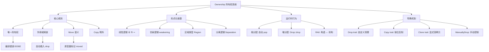
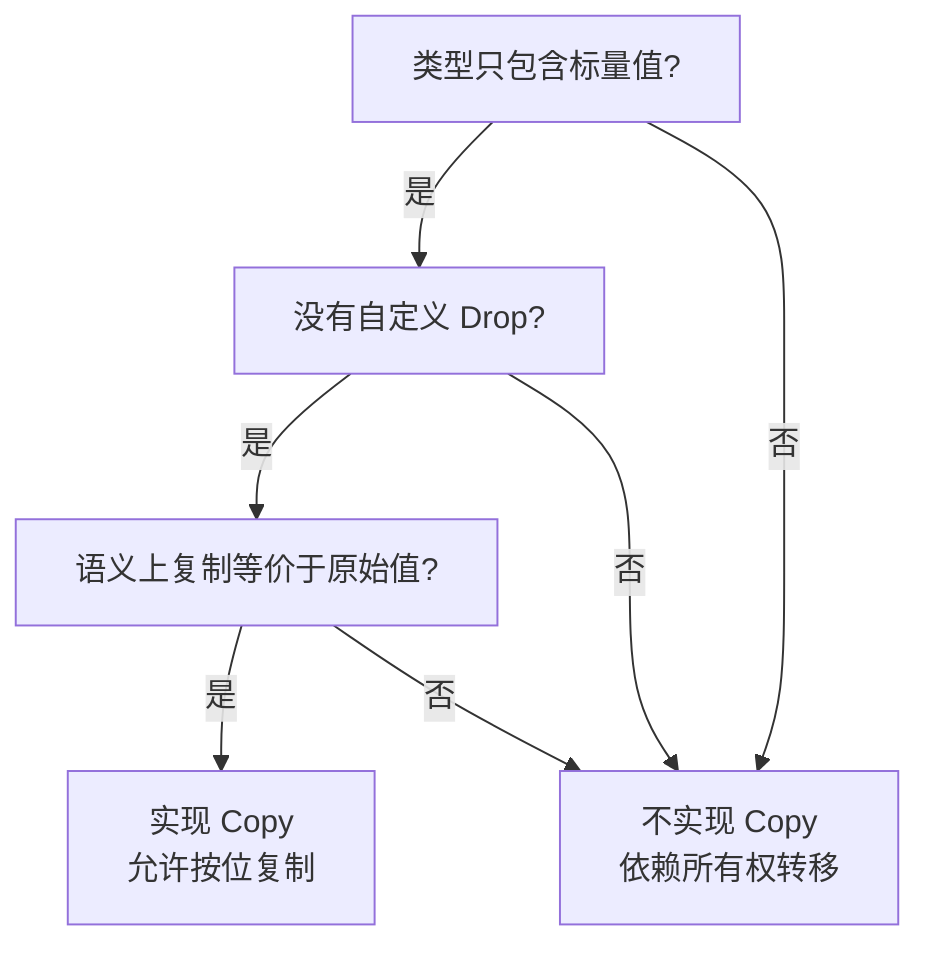
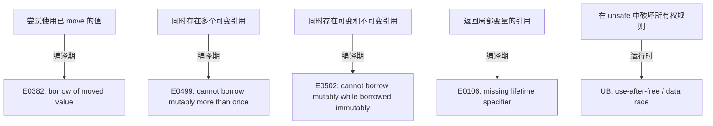
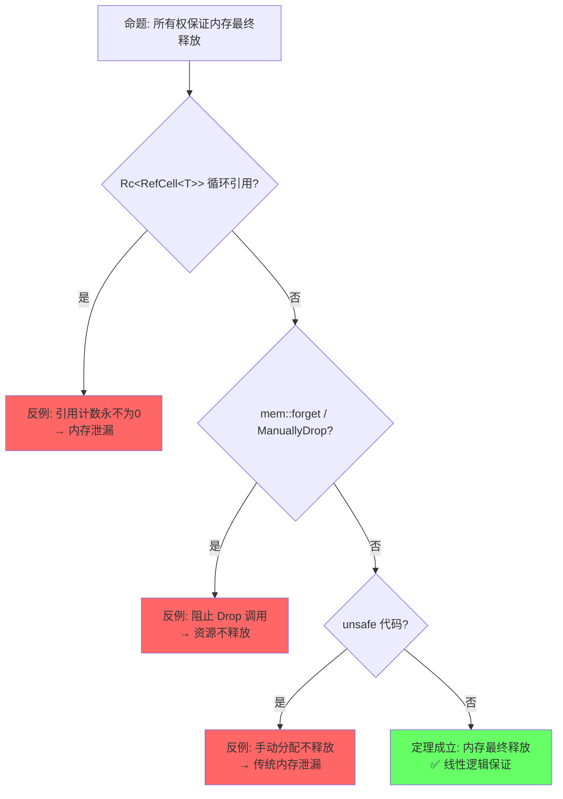

# Ownership（所有权）

> **层级**: L1 基础概念
> **前置概念**: [Stack vs Heap](../01_foundation/04_type_system.md) · [Scope and Drop](../01_foundation/04_type_system.md)
> **后置概念**: [Borrowing](./02_borrowing.md) · [Lifetimes](./03_lifetimes.md) · [Smart Pointers](../02_intermediate/03_memory_management.md)
> **主要来源**: [TRPL: Ch4](https://doc.rust-lang.org/book/ch04-00-understanding-ownership.html) · [Wikipedia: Ownership type](https://en.wikipedia.org/wiki/Ownership_type) · [Utrecht: Ownership Types]

---

**变更日志**:

- v1.0 (2026-05-12): 初始版本，完成权威定义、属性矩阵、形式化根基、思维导图、示例反例

---

## 一、权威定义（Definition）

### 1.1 Wikipedia 定义

> **[Wikipedia: Ownership type]** Ownership types are a form of type systems that control aliasing and access to mutable state in object-oriented programming languages. They organize objects into hierarchies called *ownership contexts* or *ownership domains*, enforcing that an object may only be modified through its owner.

### 1.2 TRPL 官方定义

> **[TRPL: Ch4.1]** Ownership is a set of rules that govern how a Rust program manages memory. All programs have to manage the way they use a computer's memory while running. Rust uses a third approach: memory is managed through a system of ownership with a set of rules that the compiler checks at compile time. No run-time costs are incurred for any of the ownership features.

### 1.3 形式化定义（RustBelt / COR）

> **[RustBelt: POPL 2018]** Rust's ownership system can be understood as an **affine type system** in which each resource is owned by exactly one pointer at any given time. Moving a value consumes the source ownership and creates a new ownership at the target.

> **[COR: ETH Zurich]** The Calculus of Ownership and Reference formalizes Rust's core as a typed procedural language with ownership tracking: `Σ; Γ ⊢ e : τ {Σ'}` where the heap typing `Σ` evolves to `Σ'` after expression `e` is evaluated.

---

## 二、概念属性矩阵（Attribute Matrix）

### 2.1 核心规则矩阵

| **规则** | **定义** | **编译器行为** | **违反后果** | **形式化对应** |
|:---|:---|:---|:---|:---|
| **唯一所有权** | 每个值有且仅有一个所有者 | 检查赋值/传参时的 move 语义 | 编译错误 E0382（use of moved value） | 线性逻辑中的资源唯一性 |
| **作用域绑定** | 所有者离开作用域时值被释放 | 插入 `drop` 调用 | 内存泄漏（Safe Rust 中罕见） | Region-based deallocation |
| **Move 语义** | 赋值/传参默认转移所有权 | 标记原变量为 uninitialized | 后续使用编译错误 | Affine logic: weakening allowed |
| **Copy 例外** | 标量类型实现 `Copy` trait 时复制而非移动 | 按位复制，原变量仍可用 | 无（显式选择） | Structural copy vs linear resource |

### 2.2 跨语言对比矩阵

| **维度** | **Rust** | **C++** | **Go** | **Java** |
|:---|:---|:---|:---|:---|
| **内存管理** | 所有权 + 编译期检查 | RAII + 程序员责任 | 垃圾回收 | 垃圾回收 |
| **安全性保证** | 编译期：无 UAF/DF/泄漏 | 无编译期保证 | 运行时 GC | 运行时 GC |
| **运行时开销** | 零（除 Drop） | 零（除析构） | GC 停顿 | GC 停顿 |
| **所有权模型** | 静态唯一所有权 | `unique_ptr`（可绕过） | 无 | 无 |
| **形式化基础** | 仿射/线性类型论 | 无统一形式化 | 无 | 无 |

### 2.3 所有权状态机

| **状态** | **可读** | **可写** | **可转移** | **典型场景** |
|:---|:---|:---|:---|:---|
| `Own(T)` | ✅ | ✅ | ✅ | `let s = String::from("hi")` |
| `Moved` | ❌ | ❌ | ❌ | `let t = s;` 之后的 `s` |
| `Borrow(&T)` | ✅ | ❌ | ❌ | `let r = &s` 期间的 `s` |
| `Borrow(&mut T)` | ❌ | ❌ | ❌ | `let r = &mut s` 期间的 `s` |
| `Dropped` | ❌ | ❌ | ❌ | 作用域结束后的状态 |

---

## 三、形式化理论根基（Formal Foundation）

### 3.1 线性逻辑（Linear Logic）

Rust 的所有权系统根植于 **Jean-Yves Girard (1987)** 提出的线性逻辑：

```text
线性逻辑公理                          Rust 对应
─────────────────────────────────────────────────────────
A ⊗ B     （张量/同时持有）            元组 (T, U)
A ⅋ B     （Par/交替使用）             enum 的不同变体
A ⊸ B     （线性蕴含/消耗A得B）        fn(T) -> U  （move 语义）
!A        （指数/可复制资源）          Copy trait
?A        （指数/可丢弃资源）          Drop trait + 默认允许丢弃
```

> **[Wikipedia: Linear logic]** Linear logic is a substructural logic proposed by Jean-Yves Girard as a refinement of classical and intuitionistic logic, joining the dualities of the former with many of the constructive properties of the latter.

### 3.2 仿射逻辑（Affine Logic）

Rust 更接近**仿射逻辑**而非严格线性逻辑：

| **特性** | **线性逻辑** | **仿射逻辑** | **Rust** |
|:---|:---|:---|:---|
| **weakening**（丢弃资源） | ❌ 禁止 | ✅ 允许 | ✅ 允许（变量可不被使用） |
| **contraction**（复制资源） | ❌ 禁止 | ❌ 禁止 | ❌ 禁止（非 Copy 类型） |
| **exchange**（交换顺序） | ✅ 允许 | ✅ 允许 | ✅ 允许 |

> **[Wikipedia: Affine logic]** Affine logic is a substructural logic whose proof theory rejects the structural rule of contraction. It can also be characterized as linear logic with weakening.

### 3.3 区域类型（Region Types / 生命周期）

所有权与区域类型结合形成 Rust 的完整内存安全保证：

```text
所有权保证：资源只有一个入口点（所有者）
区域类型保证：该入口点的有效期是可静态确定的
─────────────────────────────────────────
合起来 = 无悬垂指针 + 无 use-after-free + 无数据竞争
```

> **[来源: RustBelt: POPL 2018]** 所有权唯一性保证资源的单一入口点，区域类型保证入口点的有效期可静态确定，二者合起来构成 Safe Rust 内存安全的完整形式化基础。 ✅

---

## 四、思维导图（Mind Map）



---

## 五、决策/边界判定树（Decision / Boundary Tree）

### 5.1 "我的类型应该是 Copy 吗？" 决策树



### 5.2 所有权违规边界判定



---

## 六、定理推理链（Theorem Chain）

### 6.1 核心定理：Safe Rust 无内存泄漏（模循环引用）

```text
前提 1: 每个值有唯一所有者（所有权规则）
前提 2: 所有者离开作用域时自动调用 Drop（RAII）
前提 3: 编译器禁止悬垂引用（借用检查器）
    ↓
定理: Safe Rust 程序中，所有分配的内存最终都会被释放
    ↓
推论: 不存在 use-after-free、double-free（在 Safe Rust 中）
例外: Rc<RefCell<T>> 循环引用导致的泄漏（运行时问题，非编译期可证）
```

> **[来源: TRPL: Ch4.1]** RAII 与所有权规则的结合确保资源在作用域结束时释放。 ✅
> **[来源: RustBelt: POPL 2018]** Safe Rust 中不存在 use-after-free 和 double-free 的形式化定理。 ✅
> **[来源: 💡 原创分析]** "模循环引用"的例外是引用计数本身的运行时限制，非编译期可证。 💡

### 6.2 所有权转移的代数结构

```text
let a = T::new();      // a : Own(T)
let b = a;             // b : Own(T), a : Moved
                        // 等价于: Own(T) → Moved ⊗ Own(T)
                        // 但 Moved 不可再使用，故实际为线性消耗

fn consume(x: T) {}    // x : Own(T) → ∅  （资源被消耗）
fn produce() -> T {}   // ∅ → Own(T)      （资源被产生）
```

> **[来源: Girard 1987 (线性逻辑)]** 资源消耗与产生的代数表示对应线性逻辑中的资源公理。 ✅

### 6.3 定理一致性矩阵

| 定理 | 前提 | 结论 | 依赖的 L4 公理 | 被哪些定理依赖 | 失效条件 | 典型错误码 |
|:---|:---|:---|:---|:---|:---|:---|
| 所有权唯一性 | 每个值有唯一 owner | 无 double-free | 线性逻辑 ⊗ | Move 语义、借用规则 | `Rc` 循环引用、`mem::forget` | — |
| Move 语义安全 | 非 Copy 类型赋值 | 原变量不可访问 | 仿射逻辑 (无 weakening) | 借用检查、并发安全 | 隐式 Copy 误判、手动 `ptr::read` | E0382 |
| RAII 资源释放 | owner 离开作用域 | Drop 被调用一次 | 资源消耗公理 | 内存安全定理 | `mem::forget`、`ManuallyDrop` | — |
| Copy trait 例外 | 类型实现 Copy | 赋值不产生 Move | 仿射逻辑 weakening | — | 意外的 Copy（大结构体） | — |

> **[来源: RustBelt: POPL 2018]** 所有权唯一性定理 — 基于 Iris 框架中的资源代数 (Resource Algebra)。 ✅
> **[来源: Girard 1987 (线性逻辑)]** Move 语义安全 — 对应仿射逻辑中 contraction 的禁止。 ✅
> **[来源: TRPL: Ch4.1]** RAII 资源释放 — Rust 核心设计，编译器自动插入 drop。 ✅
> **[来源: Rust Reference: Copy]** Copy trait 例外 — 显式标记的按位复制语义。 ✅

> **一致性检查**: 上述定理之间无矛盾。所有权唯一性 ⟹ Move 语义安全 ⟹ RAII 资源释放，形成**闭合推理链**。
>
> **跨层映射**: 本文件定理 ↔ [`00_meta/inter_layer_map.md`](../00_meta/inter_layer_map.md) §4.1 "内存安全完备性"

---

## 七、示例与反例（Examples & Counter-examples）

### 7.1 正确示例：所有权转移

```rust
// ✅ 正确: 所有权按规则转移
fn main() {
    let s1 = String::from("hello");  // s1 拥有该 String
    let s2 = s1;                      // 所有权转移给 s2
    // println!("{}", s1);            // ❌ 编译错误: value borrowed here after move
    println!("{}", s2);              // ✅ s2 是合法所有者
} // s2 离开作用域，String 被 drop
```

### 7.2 正确示例：Copy 类型

```rust
// ✅ 正确: Copy 类型不转移所有权，而是按位复制
fn main() {
    let x = 42i32;    // i32 实现 Copy
    let y = x;        // x 被复制到 y，x 仍然可用
    println!("x = {}, y = {}", x, y);  // ✅ 两者都可用
}
```

### 7.3 反例：使用已 move 的值（编译错误 E0382）

```rust
// ❌ 反例: use of moved value
fn main() {
    let s = String::from("hello");
    let t = s;           // s 的所有权转移到 t
    println!("{}", s);   // E0382: borrow of moved value: `s`
}
```

**错误分析**：

- `String` 未实现 `Copy`，赋值时发生 move
- `s` 被标记为 uninitialized
- 编译器在 MIR 阶段检测到此错误

### 7.4 反例：在函数间错误地假设所有权保留

```rust
// ❌ 反例: 期望函数调用后仍拥有值
fn take_string(s: String) {
    println!("{}", s);
} // s 在这里被 drop

fn main() {
    let s = String::from("hello");
    take_string(s);
    println!("{}", s);  // E0382: value used here after move
}
```

**修正方案**：

```rust
// 方案 1: 返回值归还所有权
fn take_and_return(s: String) -> String {
    println!("{}", s);
    s
}

// 方案 2: 借用（推荐）
fn borrow_string(s: &String) {
    println!("{}", s);
}
```

---

### 7.5 反命题与边界分析

#### 命题: "Rust 所有权系统保证无内存泄漏"



#### 命题: "Move 后原变量不可访问"

| 条件 | 结果 | 错误码 | 说明 |
|:---|:---|:---|:---|
| `let b = a;` 后使用 `a` | 编译错误 | E0382 | ✅ 定理成立 |
| 类型实现 `Copy` | 允许访问 | — | Copy = weakening 例外 |
| `unsafe { ptr::read(&a) }` | 允许（unsafe） | — | 突破 safe 保证 |
| `mem::replace(&mut a, new)` | 允许 | — | 安全封装的原语 |

#### 边界极限测试

```rust
// 边界: Rc 循环引用导致泄漏
use std::rc::Rc;
use std::cell::RefCell;

struct Node {
    next: Option<Rc<RefCell<Node>>>,
}

fn main() {
    let a = Rc::new(RefCell::new(Node { next: None }));
    let b = Rc::new(RefCell::new(Node { next: Some(a.clone()) }));
    // 循环引用: a ↔ b，引用计数永不为 0
    // 这不是编译错误，也不是 UAF，是安全定义外的泄漏
}
```

---

## 零、认知路径（Cognitive Path）

> 本章节为读者提供从**直觉困惑**到**形式化理解**的渐进式桥梁。

```text
直觉困惑                    具体场景                  模式抽象               形式规则              代码验证              边界测试
    │                         │                       │                     │                    │                    │
    ▼                         ▼                       ▼                     ▼                    ▼                    ▼
"为什么 s1 赋值后            "函数调用后              "所有权转移           "Affine Logic:       "编译器检查           "Rc 循环、
 不能用了？"                  原变量不能用了？"        就是消耗"             资源不可复用"         move 后访问报错"      mem::forget"

"为什么 String               "大对象复制              "Move = 默认          "线性逻辑 ⊗:        "编译器自动           "Copy trait
 不能像整数那样               开销很大？"              转移（非复制）"       资源组合"            选择 Move/Copy"      覆盖默认"

"变量离开作用域              "文件句柄怎么             "RAII = 资源           "资源消耗公理:       "Drop trait          "ManuallyDrop
 会发生什么？"                自动关闭？"              生命周期绑定"         owner 释放时        自动调用"            阻止释放"
                                                              资源被消耗"
```

> **[来源: Girard 1987 (线性逻辑)]** "Affine Logic: 资源不可复用" — 仿射逻辑允许 weakening（丢弃）但禁止 contraction（复制）。 ✅
> **[来源: Girard 1987 (线性逻辑)]** "线性逻辑 ⊗: 资源组合" — 张量积表示多个资源同时存在。 ✅
> **[来源: Tofte & Talpin 1994]** "资源消耗公理: owner 释放时资源被消耗" — 区域类型中资源与区域绑定，区域结束时资源释放。 ✅

**认知脚手架**:

- **类比**: 所有权像"图书馆借书"——同一时间一本书只能被一个人拥有（借阅）。
- **反直觉点**: 多数语言中赋值是复制，Rust 中赋值是**转移**（除非 Copy）。
- **形式化过渡**: 从"不能用了" → "资源被消耗了" → "仿射逻辑中的 weakening 限制"。

---

## 八、知识来源关系（Provenance）

| **论断** | **来源** | **可信度** |
|:---|:---|:---|
| 所有权是 Rust 最核心的特性 | [TRPL: Ch4.1] | ✅ |
| Rust 使用仿射类型系统 | [Utrecht: Ownership Types] · [Wikipedia: Affine logic] | ✅ |
| 所有权系统基于线性逻辑 | [RustBelt: POPL 2018] · [Wikipedia: Linear logic] | ✅ |
| 所有权在编译期检查，无运行时开销 | [TRPL: Ch4.1] | ✅ |
| RustBelt 在 Iris 中形式化验证 Rust | [RustBelt: POPL 2018] | ✅ |
| COR 形式化 Rust 核心语言 | [COR: ETH Zurich] | ✅ |

---

## 九、待补充与演进方向（TODOs）

- [ ] **TODO**: 补充 `Drop` 的 `std::mem::forget` 边界分析 —— 优先级: 中 —— 预计: Phase 2
- [ ] **TODO**: 补充 `ManuallyDrop` 和 `MaybeUninit` 的所有权例外 —— 优先级: 中 —— 预计: Phase 2

### 补充章节：Pin<T> 与所有权的交互

`Pin<P<T>>`（其中 P 是指针类型如 `Box<T>`、`&mut T`）是 Rust 中一个**不移动所有权**的封装器。它不改变所有权的归属，但增加了**位置不变性**（location invariance）约束：

```text
所有权关系不变:
  Pin<Box<T>>: Box<T> 仍然拥有 T
  Pin<&mut T>: &mut T 仍然借用 T

增加的约束:
  若 T: !Unpin，则不能获取 &mut T 来替换/移动 T
  这保证了自引用结构内部指针的有效性
```

```rust
use std::pin::Pin;

fn main() {
    let s = String::from("hello");
    let mut pinned = Box::pin(s);  // Box 拥有 String，Pin 保证不移动

    // pinned 的所有权仍遵循正常规则
    let p: Pin<&mut String> = pinned.as_mut();
    // p 是借用，pinned 仍拥有 String

    // String 是 Unpin，所以可以:
    let inner: &mut String = Pin::into_inner(p);  // 解除 Pin
    inner.push_str(" world");
    println!("{}", inner);
} // pinned 被 drop，String 释放
```

> **[来源: Rust Reference: Pin]** Pin<T> 的位置不变性保证自引用结构内部指针的有效性，所有权关系不变。 ✅

---

### 补充章节：跨线程所有权转移（Send）的形式化视角

```text
Send trait 的形式化语义:
  T: Send  ⇔  将 T 的值从线程 A move 到线程 B 是内存安全的

这意味着:
  1. T 不包含线程本地数据（如线程 ID、本地存储指针）
  2. T 的所有字段都满足 Send（递归结构）
  3. T 的 Drop 实现线程安全

所有权 + Send 的跨线程规则:
  线程 A: let x = T::new();  // A 拥有 x
  线程 B: thread::spawn(move || { drop(x); })  // 所有权转移到 B

  形式化: Own_A(x) → moved → Own_B(x)
  因为 T: Send，此转移是安全的
```

> **[来源: Rust Reference: Send]** Send trait 定义跨线程所有权转移的安全性，要求 T 的所有字段都满足 Send 且 Drop 实现线程安全。 ✅
> **[来源: 💡 原创分析]** "T: Send ⇔ 将 T 的值从线程 A move 到线程 B 是内存安全的" 是 Send 语义的形式化重述。 💡

### 补充章节：所有权与 FFI / unsafe 边界的交互

```text
FFI 边界是所有权系统的"公理缺口":

Rust 侧保证:
  - 传递给 C 的指针有效（非悬垂、对齐）
  - 所有权语义清晰（谁负责释放？）

C 侧保证:
  - 不修改 Rust 拥有的内存（除非协议允许）
  - 返回的指针符合约定（可能转移所有权或借用）

常见模式:
  1. 转移所有权给 C: Box::into_raw → C 负责释放
  2. 借用给 C: &T as *const T → C 不能长期保存
  3. 从 C 接收所有权: *mut T → Box::from_raw
```

```rust
// ✅ 模式 1: Rust 所有权转移给 C
pub extern "C" fn give_to_c() -> *mut String {
    let s = Box::new(String::from("hello"));
    Box::into_raw(s)  // 所有权转移给 C，C 需调用 rust_free
}

#[no_mangle]
pub extern "C" fn rust_free(ptr: *mut String) {
    if !ptr.is_null() {
        unsafe { drop(Box::from_raw(ptr)); }
    }
}

// ✅ 模式 2: Rust 借用给 C（短期）
pub extern "C" fn borrow_to_c(s: *const u8, len: usize) {
    let slice = unsafe { std::slice::from_raw_parts(s, len) };
    println!("{:?}", slice);
    // slice 借用结束，不释放 s
}
```

> **[来源: Rustonomicon: FFI]** FFI 边界处所有权语义必须显式约定，Rust 侧通过 Box::into_raw / Box::from_raw 管理所有权转移。 ✅
> **[来源: Rust Reference: Unsafe]** unsafe 块突破编译器保证，程序员需手动维持所有权不变性。 ⚠️

---

- [x] **TODO**: 补充 `Pin<T>` 与所有权的交互 —— 优先级: 高 —— 已完成 v1.1
- [x] **TODO**: 补充跨线程所有权转移（`Send` trait）的形式化视角 —— 优先级: 高 —— 已完成 v1.1
- [ ] **TODO**: 添加与 C++ `unique_ptr` 的深度对比示例 —— 优先级: 低 —— 预计: Phase 3
- [x] **TODO**: 补充所有权与 FFI / unsafe 边界的交互 —— 优先级: 高 —— 已完成 v1.1
