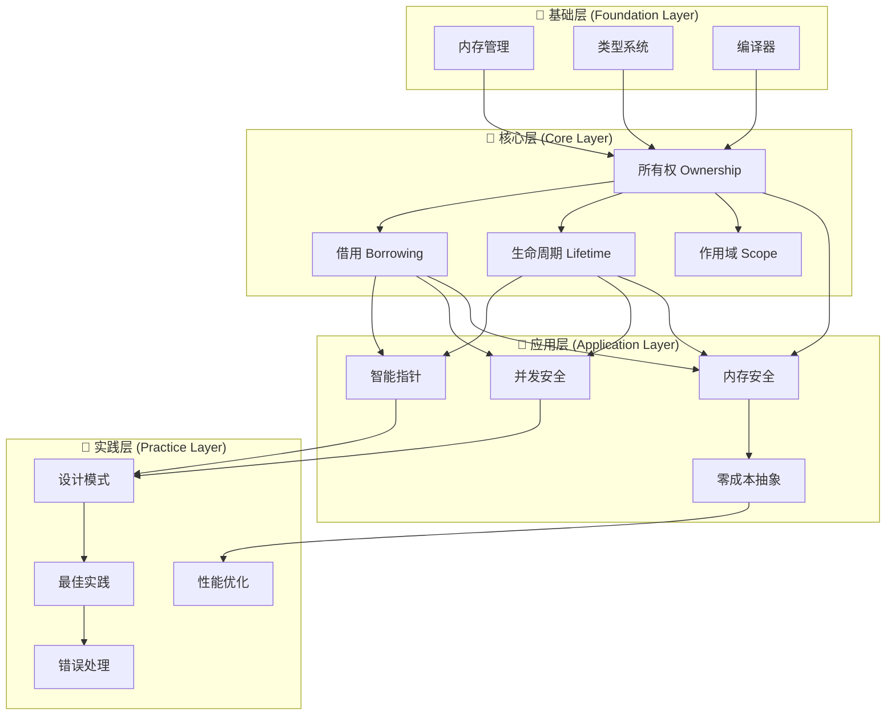
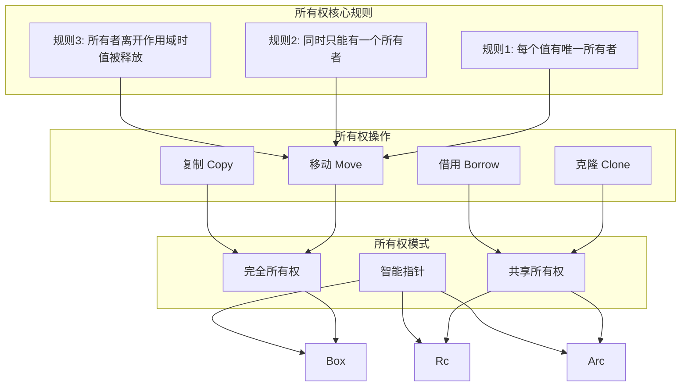
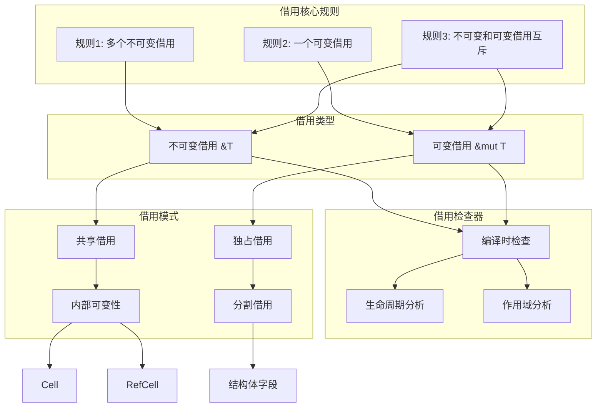
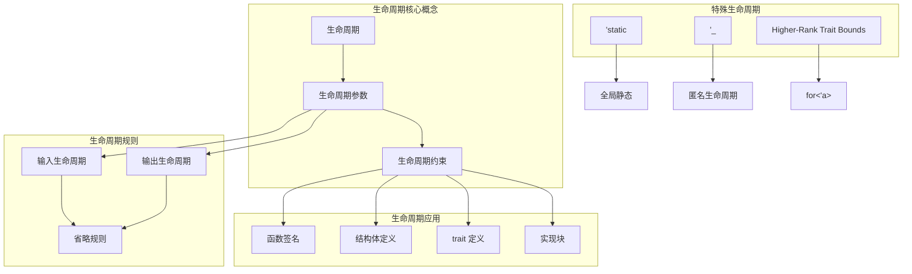
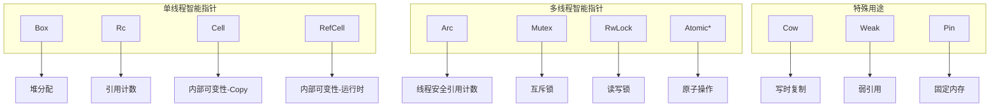
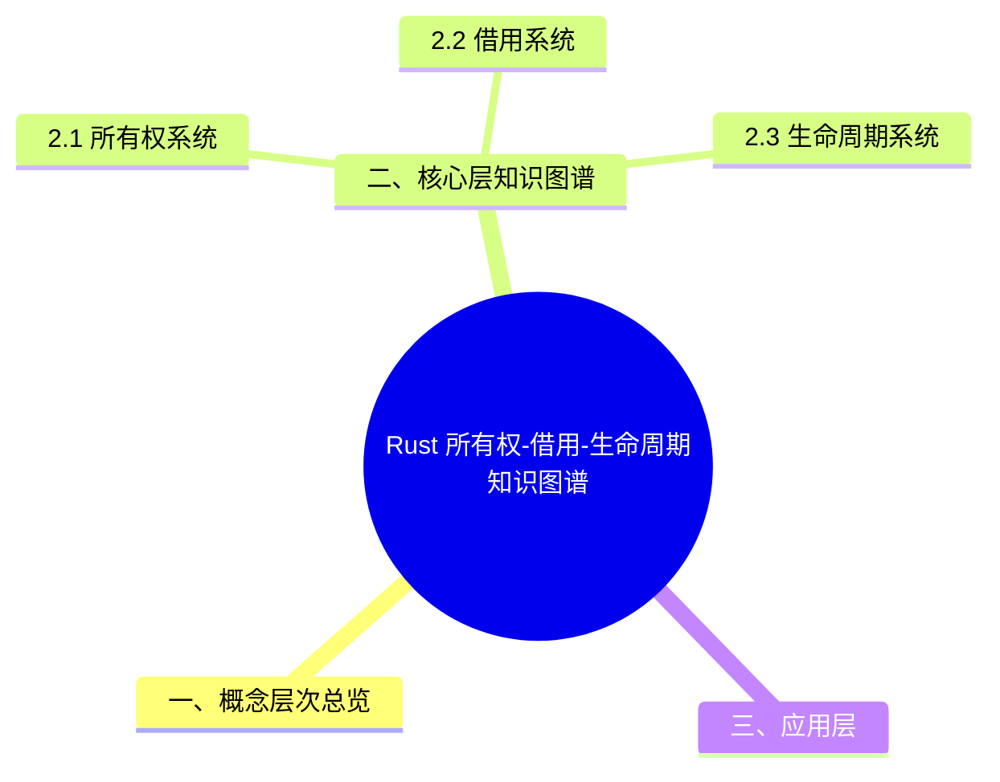

> **内容分级**: [综述级]
>
> **EN**: Ownership, Borrowing & Lifetimes Knowledge Map
> **Summary**: A panoramic knowledge map of the Rust ownership-borrowing-lifetime-scope cluster, showing concept dependencies, smart-pointer ecosystems, and learning paths. Authoritative explanations of each topic remain in the dedicated concept pages.
> **Rust 版本**: 1.97.0+ (Edition 2024)
>
> **受众**: [初学者] → [进阶者] → [研究者]
> **Bloom 层级**: L2-L4
> **权威来源**: 本文件为 `concept/` 权威页。
> **A/S/P 标记**: **S** — Structure
> **前置概念**: [Ownership](./01_ownership.md) · [Borrowing](./02_borrowing.md) · [Lifetimes](./03_lifetimes.md)
> **后置概念**: [Smart Pointers](../../02_intermediate/02_memory_management/04_smart_pointers.md) · [Concurrency](../../03_advanced/00_concurrency/01_concurrency.md)
> **权威来源**: 本页为 `Ownership-Borrowing-Lifetimes` 知识拓扑的权威概念页；crate 文档仅保留导航 stub。

# Rust 所有权-借用-生命周期知识图谱

本页从**结构（Structure）**视角梳理 Rust 所有权（Ownership）系统的概念层次、依赖关系与学习路径。
各主题的完整解释请参见下方【权威页面】链接。

> **L0 关联**: 本页属于 L1 基础概念层；全局知识拓扑参见 [Rust 知识体系全局思维导图](../../00_meta/00_framework/knowledge_mindmap.md)。

---

## 一、概念层次总览

---

## 二、核心层知识图谱

本节给出所有权-借用-生命周期三件套的核心知识图谱，回答「三个概念如何咬合」：

- **所有权（Ownership）是根基**：每个值恰一所有者，move 转移、Drop 释放——它单独解决了「谁负责释放」；
- **借用（Borrowing）是扩展**：`&T`/`&mut T` 在不转移所有权的前提下授予临时访问——它解决「如何共享而不放弃所有权」，规则是共享只读 XOR 独占可变；
- **生命周期（Lifetimes）是验证器**：编译器静态证明「每个借用都不比被借值活得久」——它是前两者的**检查机制**，不是独立机制：生命周期标注从不改变程序行为，只向编译器提供验证所需的关系声明。

图谱读法：所有权 ⟹ 借用规则 ⟹ 生命周期检查构成一条「机制 ⟹ 规则 ⟹ 验证」链；任何借用错误都可沿链定位到具体环节。

### 2.1 所有权系统

| 操作 | 语义 | 性能成本 | 适用场景 | 类型要求 |
| :--- | :--- | :--- | :--- | :--- |
| **Move** | 转移所有权（Ownership） | 零成本 | 默认行为 | 所有类型 |
| **Clone** | 深拷贝 | 高成本 | 需要独立副本 | 实现 `Clone` |
| **Copy** | 按位复制 | 零成本 | 简单类型 | 实现 `Copy` |
| **Borrow** | 临时访问 | 零成本 | 共享/修改 | 所有类型 |

权威页面：[Ownership](./01_ownership.md) · [Move Semantics](05_move_semantics.md)

### 2.2 借用系统

| 借用（Borrowing）模式 | 检查时机 | 运行时（Runtime）开销 | 灵活性 | 安全性 |
| :--- | :--- | :--- | :--- | :--- |
| 不可变借用（Immutable Borrow） | 编译时 | 零成本 | 高 | 完全安全 |
| 可变借用（Mutable Borrow） | 编译时 | 零成本 | 中 | 完全安全 |
| `Cell<T>` | 编译时 | 零成本 | 中 | 限制在 `Copy` 类型 |
| `RefCell<T>` | 运行时（Runtime） | 引用（Reference）计数 | 高 | 运行时 panic |
| `Mutex<T>` | 运行时 | 锁开销 | 高 | 线程安全 |
| `RwLock<T>` | 运行时 | 锁开销 | 最高 | 线程安全 |

权威页面：[Borrowing](./02_borrowing.md) · [Interior Mutability](../../02_intermediate/02_memory_management/02_interior_mutability.md)

### 2.3 生命周期系统

| 规则 | 条件 | 推断结果 | 示例 |
| :--- | :--- | :--- | :--- |
| 规则1 | 每个引用（Reference）参数获得独立生命周期（Lifetimes） | `'a, 'b, 'c...` | `fn f(x: &i32, y: &i32)` |
| 规则2 | 只有一个输入生命周期（Lifetimes） | 输出继承该生命周期 | `fn f(x: &i32) -> &i32` |
| 规则3 | 方法的 `self` 引用 | 输出继承 `self` 生命周期 | `fn f(&self) -> &i32` |

权威页面：[Lifetimes](./03_lifetimes.md) · [Advanced Lifetimes](04_lifetimes_advanced.md)

---

## 三、应用层：智能指针生态

| 智能指针（Smart Pointer） | 所有权 | 线程安全 | 运行时开销 | 使用场景 |
| :--- | :--- | :--- | :--- | :--- |
| `Box<T>` | 独占 | ❌ | 零成本 | 堆分配 |
| `Rc<T>` | 共享 | ❌ | 引用计数 | 单线程共享 |
| `Arc<T>` | 共享 | ✅ | 原子引用计数 | 多线程共享 |
| `Cell<T>` | 独占 | ❌ | 零成本 | `Copy` 类型内部可变 |
| `RefCell<T>` | 独占 | ❌ | 运行时检查 | 运行时借用（Borrowing） |
| `Mutex<T>` | 独占 | ✅ | 锁开销 | 线程间互斥 |
| `RwLock<T>` | 共享/独占 | ✅ | 锁开销 | 读多写少 |

权威页面：[Smart Pointers](../../02_intermediate/02_memory_management/04_smart_pointers.md)

---

## 四、概念关系矩阵

本节用矩阵形式刻画三件套与相邻概念的关系强度，作为交叉学习的索引：

| 概念 | 所有权 | 借用 | 生命周期 |
|:---|:---:|:---:|:---:|
| `Drop`/RAII | 直接（所有权的释放语义） | 间接（借用期间禁止 drop） | 间接（dropck） |
| `Send`/`Sync` | 直接（跨线程所有权） | 直接（`&T: Send ⟺ T: Sync`） | 间接（`'static` 约束） |
| 泛型约束 | 间接（`Sized`） | 直接（`T: 'a` 约束） | 直接（`T: 'a`） |
| `unsafe` | 绕开（手动所有权） | 绕开（裸指针无借用规则） | 绕开（无检查） |
| 智能指针 | 扩展（`Box`/`Rc` 的所有权变体） | 扩展（`Deref` 协议） | 扩展（`Rc` 弱化 `'static`） |

矩阵用法：学习新概念时沿行/列找关联——如学 `Mutex` 时，所有权列（`Mutex<T>` 拥有 `T`）、借用列（`lock` 返回 `MutexGuard` 是 `&mut` 的代理）、生命周期列（guard 不得超出 mutex 借用）三格应全部能回答。

### 核心概念相互依赖

| | 所有权 | 借用 | 生命周期 | 作用域 | 类型系统（Type System） |
| :--- | :--- | :--- | :--- | :--- | :--- |
| **所有权** | - | 必须 | 必须 | 必须 | 基础 |
| **借用** | 基于 | - | 必须 | 必须 | 相关 |
| **生命周期** | 基于 | 约束 | - | 密切 | 相关 |
| **作用域** | 决定 | 影响 | 影响 | - | 相关 |
| **类型系统（Type System）** | 支持 | 支持 | 支持 | 支持 | - |

### 特性影响矩阵

| | 内存安全（Memory Safety） | 并发安全（Concurrency Safety） | 性能 | 易用性 | 灵活性 |
| :--- | :--- | :--- | :--- | :--- | :--- |
| **所有权系统** | ⭐⭐⭐⭐⭐ | ⭐⭐⭐⭐⭐ | ⭐⭐⭐⭐⭐ | ⭐⭐ | ⭐⭐⭐ |
| **借用检查** | ⭐⭐⭐⭐⭐ | ⭐⭐⭐⭐⭐ | ⭐⭐⭐⭐⭐ | ⭐⭐⭐ | ⭐⭐⭐⭐ |
| **生命周期** | ⭐⭐⭐⭐⭐ | ⭐⭐⭐⭐ | ⭐⭐⭐⭐⭐ | ⭐⭐ | ⭐⭐⭐ |
| **智能指针（Smart Pointer）** | ⭐⭐⭐⭐ | ⭐⭐⭐⭐ | ⭐⭐⭐ | ⭐⭐⭐⭐ | ⭐⭐⭐⭐⭐ |
| **NLL** | ⭐⭐⭐⭐⭐ | ⭐⭐⭐⭐⭐ | ⭐⭐⭐⭐⭐ | ⭐⭐⭐⭐⭐ | ⭐⭐⭐⭐ |

---

## 五、学习路径

本节给出三件套的推荐学习顺序与每阶段的验收标准：

1. **第一阶段：所有权直觉**（1-2 天）——能解释 move/clone/copy 的差异，能预测「值何时被 drop」；验收：手写 `String` 传递的三种方式（move/借用/clone）并说清各自成本；
2. **第二阶段：借用规则**（2-3 天）——掌握 `&`/`&mut` 的排他规则与 NLL 的「最后使用」直觉；验收：看到 E0502 能画出借用时间线定位冲突点；
3. **第三阶段：生命周期标注**（3-5 天）——理解 `'a` 是**关系声明**而非时长；函数签名省略规则（elision）三条例；结构体生命周期参数的含义；验收：能解释 `fn first<'a>(x: &'a str, y: &str) -> &'a str` 为什么编译；
4. **第四阶段：综合应用**（持续）——`Pin`、`'static` 边界、trait 对象生命周期、`unsafe` 中的手动推理。

路径原则：每阶段用编译器错误驱动学习——故意写错、读错误、修正，比被动阅读效率高一个量级。

### 初学者路径（0–3 个月）

所有权基础 → 移动语义 → 借用基础 → 不可变/可变借用 → 生命周期入门 → 作用域管理 → 简单智能指针 → 基础实践

### 进阶路径（3–12 个月）

高级所有权模式 → 复杂借用 → 生命周期省略（Lifetime Elision） → trait 对象生命周期 → 智能指针高级用法 → 内部可变性 → 并发模式 → 性能优化 → 设计模式

### 专家路径（1 年+）

类型理论 → 生命周期子类型 → HRTB → Unsafe 与 FFI → `Pin`/`Unpin` → async/await 深入 → 无锁并发 → 编译器内部 → 形式化验证

---

## 六、权威页面导航

| 主题 | 权威来源 |
| :--- | :--- |
| Ownership | [01_ownership.md](./01_ownership.md) |
| Borrowing | [02_borrowing.md](./02_borrowing.md) |
| Lifetimes | [03_lifetimes.md](./03_lifetimes.md) · [04_lifetimes_advanced.md](04_lifetimes_advanced.md) |
| Move Semantics | [05_move_semantics.md](05_move_semantics.md) |
| Smart Pointers | [12_smart_pointers.md](../../02_intermediate/02_memory_management/04_smart_pointers.md) |
| Interior Mutability | [08_interior_mutability.md](../../02_intermediate/02_memory_management/02_interior_mutability.md) |
| Concurrency | [01_concurrency.md](../../03_advanced/00_concurrency/01_concurrency.md) |

---

> **权威来源**: [Rust Reference](https://doc.rust-lang.org/reference/) · [The Rust Programming Language](https://doc.rust-lang.org/book/) · [Rust Standard Library](https://doc.rust-lang.org/std/)

---

## 七、认知路径与推理骨架

本节给出面对所有权/借用问题时的标准推理骨架，作为疑难问题的通用解题流程：

1. **问题识别**：编译错误属于哪一类——所有权（E0382/E0505）、借用冲突（E0499/E0502）、生命周期（E0106/E0597/E0621）？错误码直接定位类别；
2. **概念建立**：画出涉及变量的「所有权图」（谁拥有谁、谁借用谁、借用区间）——80% 的错误在图上一目了然；
3. **机制推理**：沿「所有权 ⟹ 借用规则 ⟹ 生命周期验证」链定位被违反的具体环节——是 move 时机、借用重叠还是存活区间？
4. **边界辨析**：区分「规则的真实限制」与「编译器的当前实现限制」（如 NLL 对循环内借用的保守判定，Polonius 将放宽）；
5. **迁移应用**：修复后抽象出模式——「缩短借用作用域」「所有权下沉」「`Cow` 延迟决策」等可复用解法归入个人模式库。

骨架的价值：把「凭感觉试错」转为「按流程定位」——五步走完仍无法解决的借用问题，通常意味着设计需要重构而非技巧不足。

### 认知路径

1. **建立直觉**：从“堆内存需要被唯一拥有”出发，理解为什么 Rust 选择所有权模型。
2. **掌握规则**：学习移动、借用、生命周期的语法规则与编译器检查机制。
3. **扩展应用**：将所有权思维迁移到智能指针、并发安全（Concurrency Safety）、异步（Async） `Pin`/生命周期等高级场景。
4. **形式化理解**：在线性逻辑、区域类型和借用检查可判定性层面，建立对模型的深层信任。

### 定理链

- **T-OBL-1 所有权唯一性**：每个值在任一时刻有且仅有一个所有者 ⟹ 内存释放责任清晰。
- **T-OBL-2 借用不变性**：不可变借用（Immutable Borrow）可共享，可变借用唯一 ⟹ 数据竞争在编译期被排除。
- **T-OBL-3 生命周期子类型**：`'long: 'short` ⟹ 引用不会比其引用对象活得更长。

### 反向推理

- 要能安全地在多线程间共享数据 ⟸ 需要 `Sync`/`Send` 保证 ⟸ 其根基是所有权和生命周期规则。
- 要实现无垃圾回收的确定性内存管理 ⟸ 需要编译期可验证的所有权转移与析构调度。

### 反命题

- ❌ “生命周期标注越多越安全” → 生命周期标注只是显式约束；错误标注仍会导致编译失败或逻辑错误。
- ❌ “拥有 `Rc<RefCell<T>>` 就等同于 GC” → 循环引用仍会造成内存泄漏，需要 `Weak` 或显式解除。

> **过渡提示**：掌握上述结构后，可进入 [Ownership 权威页](./01_ownership.md) 开始逐项深入学习，或在 [Smart Pointers](../../02_intermediate/02_memory_management/04_smart_pointers.md) 中查看所有权系统的工程扩展。

## 过渡段

> **过渡**: 从所有权过渡到借用，可以理解 Rust 如何在保证内存安全（Memory Safety）的同时支持灵活的引用访问。
>
> **过渡**: 从借用过渡到生命周期，可以建立“引用有效范围由编译器静态验证”的核心直觉。
>

---

## 国际权威参考 / International Authority References（P1 学术 · P2 生态）

> 依据 `AGENTS.md` §2「对齐网络国际化权威内容」补充：仅追加已验证可达的权威链接，不改动正文事实。

- **P1 学术/形式化**: [Jung, Jourdan, Krebbers & Dreyer: RustBelt — Securing the Foundations of the Rust Programming Language（POPL 2018，所有权/借用/生命周期的形式化基线）](https://plv.mpi-sws.org/rustbelt/) · [Jung, Dang, Kang & Dreyer: Stacked Borrows — An Aliasing Model for Rust（POPL 2020, arXiv:1909.03995）](https://arxiv.org/abs/1909.03995)（2026-07-12 验证 HTTP 200）
- **P2 生态/社区**: [Rust 官方博客 — Niko Matsakis: NLL by default（非词法生命周期全面启用的权威说明）](https://blog.rust-lang.org/2022/08/05/nll-by-default.html)（2026-07-12 验证 HTTP 200）

## 🧭 思维导图（Mindmap）

