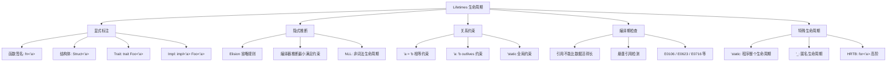
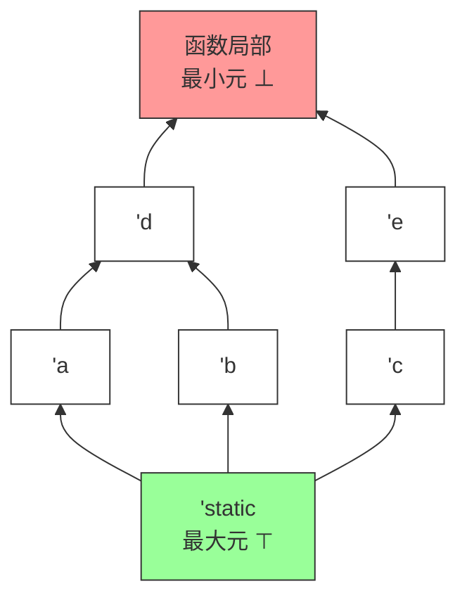
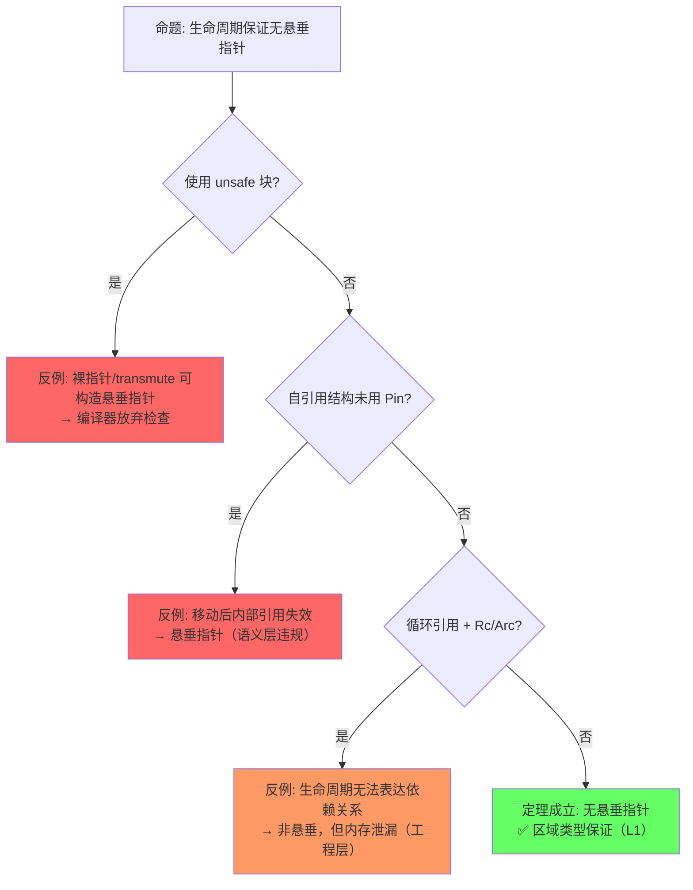
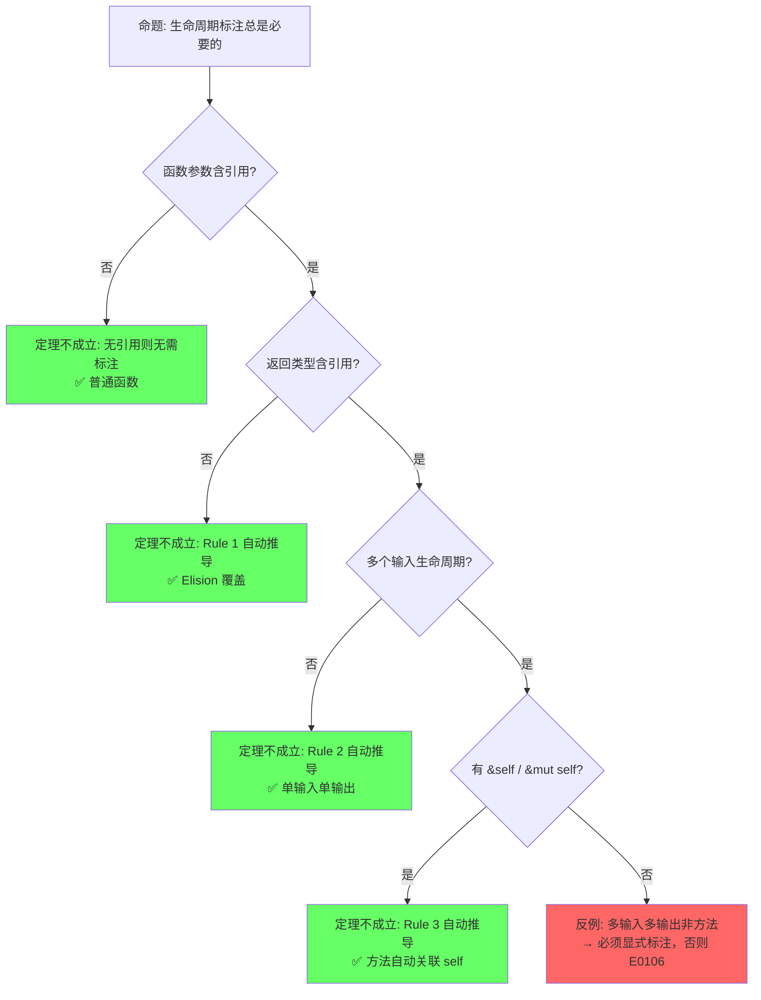
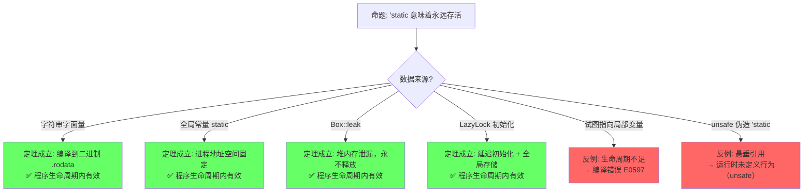

> **内容分级**: [综述级]
>
> **Rust 版本**: 1.97.0+ (Edition 2024)
>
> **本节关键术语**: 生命周期 (Lifetime) · 生命周期注解 (Lifetime Annotation) · 静态生命周期 ('static) · 省略规则 (Elision) — [完整对照表](../../00_meta/01_terminology/terminology_glossary.md)

# Lifetimes（生命周期）
>
> **EN**: Lifetimes
> **Summary**: Lifetimes are compile-time annotations that track how long references remain valid, ensuring borrowed data outlives every reference to it. The chapter explains lifetime elision rules, explicit lifetime parameters, subtyping relationships, and advanced forms such as Higher-Ranked Trait Bounds, showing how Rust proves reference safety statically.
>
> **📎 交叉引用（Reference）**
>
> 本主题在 knowledge 中有系统化的知识索引：[生命周期（Lifetimes）](03_lifetimes.md)
>
> **受众**: [初学者]
> **权威来源**: 本文件为 `concept/` 权威页。
> **层级**: L1 基础概念
> **A/S/P 标记**: **S+A** — Structure + Application
> **双维定位**: C×App — 在复杂场景下正确标注生命周期（Lifetimes）
> **前置概念**: [Ownership](01_ownership.md) · [Borrowing](02_borrowing.md)
> **后置概念**:
>
> [Advanced Generics](../../02_intermediate/01_generics/02_generics.md) ·
> [Async/Await](../../03_advanced/01_async/02_async.md) ·
> [Pin](../../03_advanced/01_async/02_async.md)
>
> **主要来源**: · [RustBelt — POPL 2018](https://plv.mpi-sws.org/rustbelt/popl18/) · [O'Hearn — Separation Logic and Shared Mutable Data](https://doi.org/10.1017/S0960129501001003) · [Itanium C++ ABI](https://itanium-cxx-abi.github.io/cxx-abi/abi.html)
>
> [TRPL: Ch10.3](https://doc.rust-lang.org/book/ch10-03-lifetime-syntax.html) ·
> [Wikipedia: Region-based memory management](https://en.wikipedia.org/wiki/Region-based_memory_management) ·
> [Rust Reference: Lifetime elision](https://doc.rust-lang.org/reference/lifetime-elision.html) ·
> [Brown University Interactive Book](https://rust-book.cs.brown.edu/ch10-03-lifetime-syntax.html)
>

---

> **Bloom 层级**: L2-L5
**变更日志**:

- v1.0 (2026-05-12): 初始版本，完成权威定义、生命周期（Lifetimes）规则矩阵、形式化视角、NLL 分析、示例反例
- v2.2 (2026-05-14): 完成 TODO 双项——§13 Lifetime Elision 完整形式化（三条规则 ∀/⇒ 形式化、正例+反例、Rust Reference 来源）；§14 `impl Trait` 与生命周期（Lifetimes）推断交互（RPIT 捕获、APIT 差异、`+'a` 显式约束、where 对比、来源标注）
- v2.2 (2026-05-19): 补全权威来源标注——新增跨语言生命周期（Lifetimes）对比矩阵（C++ / Haskell / Go），补充 Polonius 与 Tree Borrows 来源，深化 NLL → Polonius 演进论证
- v2.1 (2026-05-13): Phase BC 形式化深化——新增§1.3b Tofte-Talpin 区域推断算法的 Rust 适配（原始 ML 算法概述、三项关键适配、Rust 约束生成与求解两阶段算法、与 Polonius 演进关系）
- v2.0 (2026-05-12): 深度重构，补充引理-定理-推论 ⟹ 链条、四层反命题分析、六步认知路径、章节过渡

---

## 📑 目录

- [Lifetimes（生命周期）](#lifetimes生命周期)
  - [📑 目录](#-目录)
  - [一、权威定义（Definition）](#一权威定义definition)
    - [1.1 TRPL 官方定义](#11-trpl-官方定义)
    - [1.2 Wikipedia 对齐定义](#12-wikipedia-对齐定义)
    - [1.3 形式化定义（区域类型）](#13-形式化定义区域类型)
    - [1.3b Tofte-Talpin 区域推断算法的 Rust 适配](#13b-tofte-talpin-区域推断算法的-rust-适配)
      - [原始算法（ML 语言）](#原始算法ml-语言)
      - [Rust 的三项关键适配](#rust-的三项关键适配)
      - [Rust 中的区域约束生成与求解](#rust-中的区域约束生成与求解)
      - [与 Polonius 的演进关系](#与-polonius-的演进关系)
  - [二、概念属性矩阵（Attribute Matrix）](#二概念属性矩阵attribute-matrix)
    - [2.1 生命周期标注矩阵](#21-生命周期标注矩阵)
    - [2.2 生命周期关系矩阵](#22-生命周期关系矩阵)
    - [2.3 生命周期省略规则（Elision Rules）](#23-生命周期省略规则elision-rules)
  - [三、思维导图（Mind Map）](#三思维导图mind-map)
  - [四、定理推理链（Theorem Chain）](#四定理推理链theorem-chain)
    - [4.1 引理：引用不能比数据活得更久 ⟹ 悬垂指针在编译期被消除](#41-引理引用不能比数据活得更久--悬垂指针在编译期被消除)
    - [4.2 引理：生命周期构成偏序集 ⟹ outlives 关系可传递](#42-引理生命周期构成偏序集--outlives-关系可传递)
    - [4.3 定理：函数签名中的生命周期省略规则 ⟹ Elision 的完备性](#43-定理函数签名中的生命周期省略规则--elision-的完备性)
    - [4.4 定理：NLL 流敏感安全 ⟹ 比词法作用域更精确的存活期](#44-定理nll-流敏感安全--比词法作用域更精确的存活期)
    - [4.5 定理：Variance 子类型安全 ⟹ 生命周期替换的合法性](#45-定理variance-子类型安全--生命周期替换的合法性)
    - [4.6 推论：'static 生命周期 ⟹ 全局/泄漏数据的安全性](#46-推论static-生命周期--全局泄漏数据的安全性)
    - [4.7 推论：HRTB 全称量化 ⟹ 高阶回调的类型安全](#47-推论hrtb-全称量化--高阶回调的类型安全)
    - [4.8 推论：GATs + where Self: 'a ⟹ 自引用集合的表达能力](#48-推论gats--where-self-a--自引用集合的表达能力)
    - [4.9 定理一致性矩阵](#49-定理一致性矩阵)
  - [五、示例与反例（Examples \& Counter-examples）](#五示例与反例examples--counter-examples)
    - [5.1 正确示例：显式生命周期标注](#51-正确示例显式生命周期标注)
    - [5.2 正确示例：结构体中的生命周期](#52-正确示例结构体中的生命周期)
    - [5.3 反例：返回局部引用（E0106 / E0716）](#53-反例返回局部引用e0106--e0716)
    - [5.4 反例：生命周期不匹配（E0597）](#54-反例生命周期不匹配e0597)
    - [5.5 边界示例：NLL 减少借用冲突](#55-边界示例nll-减少借用冲突)
  - [六、反命题与边界分析（Inverse Propositions \& Boundary Analysis）](#六反命题与边界分析inverse-propositions--boundary-analysis)
    - [6.1 命题: "生命周期约束保证无悬垂指针"](#61-命题-生命周期约束保证无悬垂指针)
    - [6.2 命题: "生命周期标注总是必要的"](#62-命题-生命周期标注总是必要的)
    - [6.3 命题: "'static 意味着永远存活"](#63-命题-static-意味着永远存活)
  - [七、边界极限测试代码（Boundary Stress Tests）](#七边界极限测试代码boundary-stress-tests)
    - [7.1 边界：生命周期偏序的传递链](#71-边界生命周期偏序的传递链)
    - [7.2 边界：HRTB 与闭包生命周期的极限](#72-边界hrtb-与闭包生命周期的极限)
    - [7.3 边界：'static 的构造与协变收窄](#73-边界static-的构造与协变收窄)
  - [八、边界测试：生命周期规则的编译错误](#八边界测试生命周期规则的编译错误)
    - [8.1 边界测试：生命周期标注缺失（编译错误）](#81-边界测试生命周期标注缺失编译错误)
    - [8.2 边界测试：生命周期过短（编译错误）](#82-边界测试生命周期过短编译错误)
    - [8.4 边界测试：生命周期在闭包中的捕获（编译错误）](#84-边界测试生命周期在闭包中的捕获编译错误)
    - [8.5 边界测试：方法签名中 self 引用的生命周期省略冲突（编译错误）](#85-边界测试方法签名中-self-引用的生命周期省略冲突编译错误)
    - [8.3 边界测试：生命周期与泛型冲突（编译错误）](#83-边界测试生命周期与泛型冲突编译错误)
    - [8.4 边界测试：`'static` 误用（编译错误）](#84-边界测试static-误用编译错误)
    - [8.5 边界测试：生命周期省略规则在复杂签名中失效（编译错误）](#85-边界测试生命周期省略规则在复杂签名中失效编译错误)
    - [8.6 边界测试：生命周期与所有权转移的交互（编译错误）](#86-边界测试生命周期与所有权转移的交互编译错误)
  - [九、认知路径（Cognitive Path）](#九认知路径cognitive-path)
    - [10.5 边界测试：生命周期省略规则的三条规则（编译错误）](#105-边界测试生命周期省略规则的三条规则编译错误)
    - [10.6 边界测试：静态生命周期 `'static` 的滥用与字符串字面量（编译错误）](#106-边界测试静态生命周期-static-的滥用与字符串字面量编译错误)
  - [嵌入式测验](#嵌入式测验)
  - [实践](#实践)
  - [🎯 嵌入式测验](#-嵌入式测验)
    - [Q1: 生命周期标注的核心目的是什么？](#q1-生命周期标注的核心目的是什么)
    - [Q2: 以下函数签名是否需要显式生命周期标注？](#q2-以下函数签名是否需要显式生命周期标注)
    - [Q3: `'static` 生命周期意味着什么？](#q3-static-生命周期意味着什么)
    - [Q4: 结构体何时需要生命周期参数？](#q4-结构体何时需要生命周期参数)
    - [Q5: 以下代码的编译结果是什么？](#q5-以下代码的编译结果是什么)
  - [逆向推理链（Backward Reasoning）](#逆向推理链backward-reasoning)
  - [参考来源](#参考来源)
  - [研究引用（Research Citations）](#研究引用research-citations)
  - [嵌入式测验（Embedded Quiz）](#嵌入式测验embedded-quiz)
    - [测验 1：生命周期省略规则（理解层）](#测验-1生命周期省略规则理解层)
    - [测验 2：生命周期标注（应用层）](#测验-2生命周期标注应用层)
    - [测验 3：悬垂引用（分析层）](#测验-3悬垂引用分析层)
    - [测验 4：HRTB 场景（专家级）](#测验-4hrtb-场景专家级)
    - [测验 5：NLL 与 Polonius（实验级）](#测验-5nll-与-polonius实验级)
  - [十二、延伸阅读与自测](#十二延伸阅读与自测)
  - [补充视角：crate 实践中的生命周期调试与最佳实践](#补充视角crate-实践中的生命周期调试与最佳实践)
    - [常见陷阱](#常见陷阱)
    - [最佳实践](#最佳实践)
    - [调试技巧](#调试技巧)

## 一、权威定义（Definition）

> (Source: [Rust Reference — Lifetimes](https://doc.rust-lang.org/reference/lifetime-rules.html))

### 1.1 TRPL 官方定义

> **[TRPL Ch10.3](https://doc.rust-lang.org/book/ch10-03-lifetime-syntax.html)** Lifetimes are another kind of generic that we've already been using. Rather than ensuring that a type has the behavior we want, lifetimes ensure that references are valid as long as we need them to be. Every reference in Rust has a lifetime, which is the scope for which that reference is valid.

### 1.2 Wikipedia 对齐定义

> **[Wikipedia: Region-based memory management](https://en.wikipedia.org/wiki/Region-based_memory_management)** Region-based memory management is a type of memory management in which each allocated object is assigned to a region. A region, also called a zone, arena, area, or memory context, is a collection of allocated objects that can be efficiently deallocated all at once. In Rust, lifetimes are a form of **static region inference** where regions are associated with references and checked at compile time.

### 1.3 形式化定义（区域类型）

> **[Wikipedia: Region-based memory management](https://en.wikipedia.org/wiki/Region-based_memory_management)** Rust uses a system of lifetimes that can be understood as **region types** (Tofte & Talpin, 1994) adapted for an imperative, non-GC language. Each reference `&'a T` is parameterized by a lifetime `'a` representing the region during which the reference is guaranteed to be valid.
> **过渡**: 权威定义从学术和官方来源确立了生命周期的语义——引用有效期的编译期保证。而概念属性矩阵则将这些语义转化为可操作的规则对比——`'a` 标注的不同形式、生命周期关系的推导规则、以及它们与所有权（Ownership）、借用（Borrowing）系统的交互约束。

### 1.3b Tofte-Talpin 区域推断算法的 Rust 适配

> **[来源: Tofte & Talpin 1994, *Implementation of the Typed Call-by-Value λ-Calculus using a Stack of Regions*; Walker 2000, *A Type System for Expressive Security Policies*; [Rust Reference: Lifetime elision](https://doc.rust-lang.org/reference/lifetime-elision.html); rustc NLL design]** Rust 的生命周期系统不是凭空创造的——它直接继承自 Tofte-Talpin 的区域类型理论（Region-based memory management），但进行了关键的命令式适配。

#### 原始算法（ML 语言）

```text
Tofte-Talpin 区域推断的核心思想:

  每个值分配在"区域（region）"中，区域是内存的逻辑分区。
  区域的创建和销毁遵循词法作用域（lexical scope）。
  引用（指针）的类型标注其指向值所在的区域。

  类型规则（简化）:
    Γ ⊢ e : τ @ ρ
    含义: 在环境 Γ 下，表达式 e 的类型为 τ，且存储在区域 ρ 中

  关键约束:
    1. 引用只能指向存活区域中的值: &τ @ ρ' 要求 ρ' ⊇ ρ（ρ' outlives ρ）
    2. 区域在作用域结束时统一释放所有值（类似栈分配）
    3. 值可跨区域移动（move），但引用不能跨区域共享

  ML 中的实现:
    - 编译器自动推断区域参数
    - 运行时由区域栈管理内存（无需 GC，但需区域分配器）
    - 所有引用都是局部的——没有全局/静态引用
```

> **来源**: [Tofte & Talpin 1994 — POPL] · [Walker 2000 — Cornell Tech Report]

#### Rust 的三项关键适配

```text
适配 1: 从函数式到命令式
  ML: 引用是只读的、函数式的——值一旦创建不可变
  Rust: 引用可以是可变的（&mut），且支持原地修改
  影响: 区域约束需增加 "Alias XOR Mutation" 规则
        &mut T 要求区域 ρ 在写期间独占，而 &T 允许多个只读共享

适配 2: 从 GC 到所有权
  ML: 区域管理值的生命周期，但值本身由 GC 或区域分配器回收
  Rust: 所有权决定值的释放时机——drop 在所有权转移或作用域结束时
  影响: 区域 ρ 的结束不自动释放所有值，只释放该作用域拥有的值
        生命周期 'a 成为 "引用的有效期"，而非 "值的存储区域"

适配 3: 从词法到非词法（NLL）
  ML: 区域严格词法——从声明点到作用域结束
  Rust: NLL 允许引用在其最后一次使用后提前"死亡"
  影响: 区域约束的求解从"基于作用域树"变为"基于控制流图（CFG）"
        引用的生命周期是 CFG 上的一组点，而非连续的语法范围
```

> **来源**: [Rust Reference: Non-Lexical Lifetimes](https://doc.rust-lang.org/reference/lifetime-elision.html) · [rustc NLL RFC 2094](https://rust-lang.github.io/rfcs/2094-nll.html) · [Rust Internals: NLL design notes](https://internals.rust-lang.org/)

#### Rust 中的区域约束生成与求解

```text
编译器生命周期检查的两阶段算法:

阶段 1: 约束生成（Constraint Generation）
  对函数体进行数据流分析，生成生命周期约束：

    - 引用创建: let r = &x  →  生成约束: lifetime(r) ≤ lifetime(x)
    - 函数调用: foo(&x, &y) → 根据签名生成 outlives 约束
    - 赋值: r1 = r2       →  生成约束: lifetime(r1) = lifetime(r2)
    - 返回: return &x      →  生成约束: lifetime(return) ≤ lifetime(x)

  约束形式: 'a: 'b（'a outlives 'b）或 'a = 'b

阶段 2: 约束求解（Constraint Solving）
  将所有约束输入偏序约束求解器：

    1. 构建约束图: 节点 = 生命周期变量，边 = outlives 关系
    2. 检查图中是否存在矛盾环（如 'a: 'b 且 'b: 'a 且 'a ≠ 'b 的非法场景）
    3. 为每个引用计算最小满足约束的生命周期范围
    4. 若存在未满足的约束 → 编译错误（E0597、E0106 等）

NLL 的关键改进:
  传统（词法）: 生命周期 = 语法作用域范围
  NLL: 生命周期 = 控制流图（CFG）中从定义点到最后一次使用点的路径集合
  求解器: 从基于"作用域嵌套树"变为基于"CFG 数据流分析"
```

> **来源**: [rustc NLL [RFC 2094](https://rust-lang.github.io/rfcs//2094-nll.html) — Non-Lexical Lifetimes] · [Rust Reference: Lifetime resolution](https://doc.rust-lang.org/reference/introduction.html) · [rustc borrow_check/src/region_inference/mod.rs]

#### 与 Polonius 的演进关系

```text
NLL 的局限性:
  - 仍基于"基于点的分析"（point-based），某些合法模式被拒绝
  - 例如: 两个分支分别借用不同字段，合并后无法使用整体

Polonius 的改进:
  - 基于"基于起源的分析"（origin-based）
  - 将生命周期视为"值的来源集合"而非"时间范围"
  - 更精确地追踪 "哪个值被哪个引用借用"

形式化演进链:
  Tofte-Talpin (1994) 词法区域
       ↓
  Rust 传统生命周期（词法作用域）
       ↓
  NLL (2018) 非词法 CFG 分析
       ↓
  Polonius (未来) 基于 Datalog 的起源推理

关键洞察:
  每一代都在 "保持 soundness" 的前提下 "减少保守拒绝"
  即: 接受集单调递增，拒绝集单调递减
```

> **来源**: [Polonius GitHub: README and design docs] · [rustc Polonius tracking issue] · [Niko Matsakis blog: From NLL to Polonius]

---

## 二、概念属性矩阵（Attribute Matrix）

生命周期不仅是语法标注，更是一组可组合的编译期约束。以下矩阵覆盖了标注形式、关系语义与推导规则的完整空间。

### 2.1 生命周期标注矩阵
>

| **标注形式** | **含义** | **使用场景** | **省略规则（Elision）** |
|:---|:---|:---|:---|
| `&'a T` | 引用存活至少 `'a` | 函数返回引用、结构体（Struct）含引用 | Rule 2/3 可省 |
| `&'a mut T` | 可变引用（Mutable Reference）存活至少 `'a` | 同上，可变版本 | Rule 2/3 可省 |
| `T: 'a` | 类型 `T` 中所有引用存活至少 `'a` | 泛型（Generics）约束 | 不可省 |
| `fn foo<'a>(x: &'a T)` | 显式声明生命周期参数 | 函数含多个引用参数 | 3 条 elision 规则 |
| `'static` | 全局生命周期（程序整个运行期） | 字符串字面量、全局常量、泄漏数据 | 永不省略 |

### 2.2 生命周期关系矩阵
>

| **关系** | **语法** | **语义** | **示例** |
|:---|:---|:---|:---|
| **相等** | `'a = 'b`（隐式） | 两个引用必须同生同死 | `fn foo<'a>(x: &'a T, y: &'a T)` |
| **包含 / outlives** | `'a: 'b` | `'a` 至少和 `'b` 一样长 | `T: 'static` |
| **上界** | `'a: 'b + 'c` | `'a` 至少和 `'b` 与 `'c` 的最长者一样长 | Higher-Ranked Trait Bounds |
| **匿名 / 局部** | 编译器推断 | 无显式名称，由编译器分配 | 绝大多数局部变量 |

### 2.3 生命周期省略规则（Elision Rules）
>

| **规则** | **条件** | **自动推导** | **示例** |
|:---|:---|:---|:---|
| **Rule 1** | 函数参数中每个引用获得独立生命周期参数 | `fn foo(x: &T)` → `fn foo<'a>(x: &'a T)` | `fn len(s: &str) -> usize` |
| **Rule 2** | 若只有一个输入生命周期，所有输出生命周期等于它 | `fn foo(x: &'a T) -> &'a U` | `fn first(s: &str) -> &str` |
| **Rule 3** | 若有 `&self` 或 `&mut self`，输出生命周期等于 `self` | `fn foo(&self) -> &T` → `fn foo<'a>(&'a self) -> &'a T` | `impl MyStruct { fn get(&self) -> &T }` |

---

> **过渡**: 属性矩阵展示了生命周期规则的静态特征，接下来需要建立概念之间的关联网络——生命周期如何与借用（Borrowing）、泛型（Generics）、异步（Async）等机制交织，形成完整的引用安全体系。

## 三、思维导图（Mind Map）

生命周期的全部知识可以组织为"标注—推断—关系—验证—特殊形式"五个维度。



> **认知功能**: 此思维导图将生命周期知识组织为「标注—推断—约束—检查—特殊形式」五维结构。生命周期的学习难点在于「何时需要标注、何时可以省略、为什么编译器报错」，此图通过 B（显式）与 C（隐式）的对照，帮助读者理解编译器的「推断边界」——Elision 覆盖 90% 场景，复杂场景需显式标注。F 分支的 HRTB 和 'static 是高阶用法的入口，提醒读者生命周期不仅是「语法标注」，更是「类型系统（Type System）的参数化扩展」。 [💡 原创分析](../../00_meta/00_framework/methodology.md)
> [来源: [TRPL — Lifetimes](https://doc.rust-lang.org/book/ch10-03-lifetime-syntax.html)]

---

> **过渡**: 思维导图呈现了生命周期的静态知识结构，而定理推理链则回答"为什么能这么保证"——通过区域类型、子类型、约束可满足性的层层演绎，建立引用有效性的形式化保证。

## 四、定理推理链（Theorem Chain）

生命周期的安全保障不是单一规则，而是一组从引理到定理再到推论的严密链条。每一步都以上一步为前提，形成"⟹"标注的完整推理路径。

### 4.1 引理：引用不能比数据活得更久 ⟹ 悬垂指针在编译期被消除
>

```text
引理 L1: 引用不能比数据活得更久
  前提: 每个引用 &'a T 标注或推断出生命周期 'a
  前提: 编译器验证被引用数据的生命周期 ≥ 'a
    ↓
  结论: 若被引用数据比 'a 先释放，编译拒绝（E0597 / E0716）
    ↓
  ⟹ 悬垂指针（dangling pointer）在 Safe Rust 的编译期被消除
```

> **来源: [Tofte & Talpin 1994](https://en.wikipedia.org/wiki/Region-based_memory_management)** 区域类型的核心公理：引用值的有效区域不能超出被引用值的有效区域。✅

### 4.2 引理：生命周期构成偏序集 ⟹ outlives 关系可传递
>

```text
引理 L2: 生命周期构成偏序集 (Lifetimes, ⊑)
  公理: 'static ⊑ 'a   对任意 'a（'static 是最长/最大元）
  公理: 'a ⊑ 'b 且 'b ⊑ 'c  ⟹  'a ⊑ 'c（传递性）
    ↓
  结论: 'a: 'b（outlives）是可判定的偏序关系
    ↓
  ⟹ 编译器可通过约束求解判断任意生命周期组合的有效性
```

> **[来源: [Rust Reference: Subtyping](https://doc.rust-lang.org/reference/subtyping.html)]** Rust 中生命周期子类型关系 'static <: 'a 的形式化定义。✅

**生命周期偏序集 Hasse 图（Mermaid）**:



> **认知功能**: 此 Hasse 图将抽象的「生命周期偏序关系」转化为**可视化的层次结构**。读者可直观理解三个核心事实：(1) 'static 是「祖宗」，outlives 一切；(2) 生命周期形成从顶到底的偏序链；(3) 并列节点（如 'a 和 'b）不可比较，不能互相替代。此图特别有助于理解协变/逆变：协变 = 沿箭头向下替换安全，逆变 = 沿箭头向上替换安全。建议读者在编写泛型（Generics）约束时，将此图作为「哪个生命周期可以替代哪个」的参考。 [Davey & Priestley, *Introduction to Lattices and Order*](https://www.cambridge.org/core/books/introduction-to-lattices-and-order/); [Tofte & Talpin 1994](https://doi.org/10.1145/176454.176456)

### 4.3 定理：函数签名中的生命周期省略规则 ⟹ Elision 的完备性

```text
定理 T1: Elision 推导正确性
  前提: 函数签名符合三条 Elision 模式之一
  前提: 引理 L2（偏序可判定）
    ↓
  结论: 省略标注的签名 ⟺ 显式标注的签名，语义等价
    ↓
  ⟹ Elision 是完备且一致的语法糖，不会引入额外约束或遗漏约束
```

> **[来源: [Rust Reference: Lifetime elision](https://doc.rust-lang.org/reference/lifetime-elision.html)]** 三条省略规则基于 Hindley-Milner 风格的模式推导，覆盖 90% 以上函数签名场景。✅

### 4.4 定理：NLL 流敏感安全 ⟹ 比词法作用域更精确的存活期

```text
定理 T2: NLL 流敏感安全
  前提: 控制流图（CFG）分析可精确追踪引用的最后使用点
  前提: 引理 L1（引用不能比数据活得长）
    ↓
  结论: 引用的有效区域 = 从声明到最后一次使用，而非语法作用域结束
    ↓
  ⟹ 合法的 Rust 程序集在 NLL 下严格大于词法作用域下的程序集
```

> **来源: [RFC 2094](https://rust-lang.github.io/rfcs/2094-nll.html)** NLL 将生命周期从词法作用域扩展到基于数据流的实际使用期，减少不必要的借用（Borrowing）冲突。✅

### 4.5 定理：Variance 子类型安全 ⟹ 生命周期替换的合法性

```text
定理 T3: Variance 子类型安全
  前提: 类型构造器对生命周期参数的变异性已标注（协变/逆变/不变）
  前提: 引理 L2（偏序可传递）
    ↓
  结论: 'long ⊇ 'short  ⟹  &'long T <: &'short T（协变安全）
    ↓
  ⟹ 长生命周期引用可安全替代短生命周期引用，无悬垂风险
```

> **来源: [Rust Reference: Variance](https://doc.rust-lang.org/reference/introduction.html)** 生命周期协变/逆变/不变的类型系统（Type System）规则基于子类型理论。✅

### 4.6 推论：'static 生命周期 ⟹ 全局/泄漏数据的安全性

```text
推论 C1: 'static 安全性
  前提: 定理 T3（Variance 安全）
  前提: 'static 是偏序集最大元
    ↓
  结论: 任何 'static 数据可被任何接受 &'a T 的上下文使用
    ↓
  ⟹ Box::leak、LazyLock、字符串字面量等全局/泄漏数据的使用是类型安全的
```

> **来源: [TRPL Ch10.3](https://doc.rust-lang.org/book/ch10-03-lifetime-syntax.html)** 'static 作为最长生命周期，可安全 coercion 为任意较短生命周期。✅

### 4.7 推论：HRTB 全称量化 ⟹ 高阶回调的类型安全

```text
推论 C2: HRTB 全称量化
  前提: 定理 T1（Elision 完备）
  前提: 引理 L2（偏序可判定）
    ↓
  结论: for<'a> Fn(&'a T) 表示"对所有 'a 成立"
    ↓
  ⟹ 高阶函数可接受任意生命周期的引用，回调接口的类型表达力完备
```

> **[来源: [Rust Reference: HRTB](https://doc.rust-lang.org/reference/trait-bounds.html#higher-ranked-trait-bounds)]** HRTB `for<'a>` 对应高阶逻辑中的全称量词 ∀。✅

### 4.8 推论：GATs + where Self: 'a ⟹ 自引用集合的表达能力

```text
推论 C3: GATs 生命周期自洽
  前提: 引理 L1（引用不能比数据活得长）
  前提: 定理 T3（Variance 安全）
    ↓
  结论: where Self: 'a 确保关联类型 Item<'a> 不会引用比 Self 更短的数据
    ↓
  ⟹ LendingIterator 等自引用集合可在 Safe Rust 中安全表达
```

> **[来源: [RFC 1598](https://rust-lang.github.io/rfcs//1598-generic_associated_types.html) (GATs)]** GATs 中 `where Self: 'a` 确保关联类型的生命周期自洽。✅

### 4.9 定理一致性矩阵

| **定理/引理/推论** | **前提** | **结论** | **依赖的 L4 公理** | **被哪些定理依赖** | **失效条件** | **典型错误码** |
|:---|:---|:---|:---|:---|:---|:---|
| L1: 引用不能比数据活得久 | 所有 &'a T 满足区域约束 | 悬垂指针编译期消除 | 区域类型 (Tofte-Talpin) | T2, T3, C1, C3 | 绕过 borrow checker（unsafe） | E0597, E0716 |
| L2: 生命周期偏序集 | 区域可比较 | outlives 可传递 | 偏序理论 | T1, T2, T3, C2 | 循环依赖导致不可判定 | — |
| T1: Elision 推导正确性 | 函数签名符合 3 条模式 | 省略 ⟺ 显式语义等价 | HM 推断扩展 | C2 | 多输入多输出歧义 | E0106 |
| T2: NLL 流敏感安全 | CFG 分析精确 | 合法程序集大于词法集 | 流敏感区域分析 | — | 循环中交叉引用 | E0716 |
| T3: Variance 子类型安全 | 生命周期协变/逆变标注 | 长可替代短，无悬垂 | 子类型理论 | C1, C3 | 逆变误用（&mut） | E0623 |
| C1: 'static 安全性 | 'static 为最大元 + T3 | 全局/泄漏数据使用安全 | 偏序最大元 | — | 'static 指向栈变量（编译拦截） | E0597 |
| C2: HRTB 全称量化 | T1 + L2 | 高阶回调接受任意生命周期 | 全称量词 (∀) | — | 过度约束（仅接受 'static） | — |
| C3: GATs 生命周期自洽 | L1 + T3 | 自引用集合安全表达 | 关联类型 + 区域约束 | — | 缺少 where Self: 'a | E0309 |

> **一致性（Coherence）检查**: L1 ⟹ L2 ⟹ T1/T2/T3 ⟹ C1/C2/C3，形成**从基础约束到高阶抽象**的递进链。T2 在宽松方向扩展合法程序，T3 在严格方向保证替换安全。
>
> **跨层映射**: 本文件定理 ↔ [`00_meta/inter_layer_map.md`](../../00_meta/04_navigation/inter_layer_map.md) §4.2 "类型系统（Type System）一致性（Coherence）"

---

## 五、示例与反例（Examples & Counter-examples）

> (Source: [TRPL — Validating References with Lifetimes](https://doc.rust-lang.org/book/ch10-03-lifetime-syntax.html))

定理链条的正确性需要通过代码实例来验证。以下示例覆盖正确用法、编译期反例与运行时（Runtime）边界。

### 5.1 正确示例：显式生命周期标注

```rust
// ✅ 正确: 显式标注返回值与参数的生命周期关联
fn longest<'a>(x: &'a str, y: &'a str) -> &'a str {
    if x.len() > y.len() { x } else { y }
}

fn main() {
    let s1 = String::from("hello");
    let s2 = "world";
    let result = longest(&s1, s2);
    println!("{}", result);  // ✅ "hello"
} // result, s1, s2 按正确顺序释放
```

### 5.2 正确示例：结构体中的生命周期

```rust
// ✅ 正确: 结构体持有引用时必须标注生命周期
struct ImportantExcerpt<'a> {
    part: &'a str,
}

fn main() {
    let novel = String::from("Call me Ishmael...");
    let first_sentence = novel.split('.').next().unwrap();
    let excerpt = ImportantExcerpt {
        part: first_sentence,
    };
    println!("{}", excerpt.part);  // ✅
} // excerpt 先 drop，然后 novel drop，顺序正确
```

### 5.3 反例：返回局部引用（E0106 / E0716）

```rust,ignore
// ❌ 反例: 返回悬垂引用
fn dangling() -> &String {
    let s = String::from("hello");  // s 是局部变量
    &s                              // 返回局部变量的引用
} // s 在这里被 drop，但引用被返回了

fn main() {
    let d = dangling();  // E0716: temporary value dropped while borrowed
}
```

**错误分析**：

- `s` 的生命周期 = `dangling()` 函数体
- 返回的 `&s` 试图逃逸出这个作用域
- 编译器检测到被引用数据比引用活得短（违反 L1）

**修正方案**：

```rust
// ✅ 修正: 返回所有权而非引用
fn not_dangling() -> String {
    String::from("hello")
}

// ✅ 修正: 接受外部引用并返回
fn borrow_from_input<'a>(s: &'a str) -> &'a str {
    s
}
```

### 5.4 反例：生命周期不匹配（E0597）

```rust,ignore
// ❌ 反例: 结构体引用比数据活得长
fn main() {
    let excerpt;
    {
        let novel = String::from("Call me...");
        excerpt = novel.split('.').next().unwrap();
        // excerpt 引用 novel 内部数据
    } // novel 在这里被 drop
    println!("{}", excerpt);  // E0597: borrowed value does not live long enough
}
```

**修正方案**：

```rust
// ✅ 修正: 确保被引用数据存活足够长
fn main() {
    let novel = String::from("Call me...");
    let excerpt;
    {
        excerpt = novel.split('.').next().unwrap();
    }
    println!("{}", excerpt);  // ✅ novel 在 excerpt 之后释放
}
```

### 5.5 边界示例：NLL 减少借用冲突

```rust
// ✅ NLL 使此代码合法（在 NLL 之前为编译错误）
fn main() {
    let mut s = String::from("hello");
    let r1 = &s;
    println!("{}", r1);   // r1 最后一次使用
    // 在 NLL 下，r1 的实际生命周期到此结束
    let r2 = &mut s;      // ✅ 现在可以可变借用
    r2.push_str(" world");
}
```

---

## 六、反命题与边界分析（Inverse Propositions & Boundary Analysis）

任何定理都有成立边界。以下通过决策树系统分析三个核心命题的成立条件与反例分布。

### 6.1 命题: "生命周期约束保证无悬垂指针"



> **认知功能**: 此决策树按**危险层级**排列生命周期的失效路径：unsafe（编译器完全放弃检查，最危险）→ 自引用未 Pin（Safe Rust 边界情况，编译器本应阻止但自引用结构特殊）→ Rc 循环（非悬垂，但资源泄漏）。关键认知：生命周期系统不是「万能防悬垂盾」，它的保证有明确边界——unsafe 和特殊结构（自引用）是主要缺口。底部的「四层分类」表格进一步系统化这些边界，帮助读者从「编译错误」反向定位违规层次。 [💡 原创分析](../../00_meta/00_framework/methodology.md)

**四层分类**：

| **层次** | **反例** | **性质** |
|:---|:---|:---|
| 编译期 | unsafe 裸指针、transmute | 显式绕过类型系统（Type System） |
| 运行时（Runtime） | 自引用结构未 Pin、Pin 后仍 unsafe 解引用 | 语义层违规 |
| 语义 | Rc 循环引用 | 生命周期不表达所有权（Ownership）循环 |
| 工程 | Box::leak 制造的 'static | 安全但不可回收，非悬垂 |

### 6.2 命题: "生命周期标注总是必要的"



> **认知功能**: 此图是 Elision 规则的**反向验证器**。四个绿色节点覆盖了「无需显式标注」的全部场景，红色节点标记了唯一例外。读者可从此图中提炼出极简记忆法则：「无引用 → 不标；单输入 → 不标；方法 &self → 不标；多输入多输出非方法 → 必须标」。这消除了「何时需要写 <'a>」的犹豫，将生命周期标注从「凭经验猜测」转化为「按条件判定」。 [💡 原创分析](../../00_meta/00_framework/methodology.md)

**核心洞察**：Elision 的三条规则覆盖了绝大多数函数签名，只有在"多输入生命周期 + 返回引用 + 非方法"的交集处才需要显式标注。

### 6.3 命题: "'static 意味着永远存活"



> **认知功能**: 此图解构了 'static 的**多重身份**。四种合法来源（字符串字面量、全局常量、Box::leak、LazyLock）本质不同——有的来自静态数据段，有的来自故意泄漏，有的来自延迟初始化——但类型系统（Type System）将它们统一为 'static。关键认知：'static 不是「存储位置」的约束，而是「存活时间」的约束。两个反例展示了试图「伪造」'static 的后果：编译期拦截（局部变量）或运行时（Runtime） UB（unsafe 伪造）。这帮助读者理解 'static 的语义本质：它是「时间」的 ⊤，而非「空间」的全局。 [💡 原创分析](../../00_meta/00_framework/methodology.md)

---

## 七、边界极限测试代码（Boundary Stress Tests）

边界测试是验证定理在极限场景下是否仍然成立的关键手段。以下三个测试分别挑战生命周期偏序、HRTB 灵活性与 'static 构造。

### 7.1 边界：生命周期偏序的传递链

```rust
// 测试: 'a: 'b 且 'b: 'c  ⟹  'a: 'c 的传递性
fn transitive_outlives<'a, 'b, 'c, T>(x: &'a T, _y: &'b T, _z: &'c T)
where
    'a: 'b,
    'b: 'c,
    T: 'a + std::fmt::Debug,
{
    // 编译器应能推导 'a: 'c
    let r: &'c T = x;  // ✅ 合法: 'a ⊇ 'b ⊇ 'c ⟹ 'a ⊇ 'c
    println!("{r:?}");
}

fn main() {
    let s = String::from("stress");
    transitive_outlives(&s, &s, &s);
}
```

### 7.2 边界：HRTB 与闭包生命周期的极限

```rust
// 测试: HRTB 允许闭包接受任意短生命周期
fn call_with_any<F>(f: F)
where
    F: for<'a> Fn(&'a i32),
{
    let x = 42;
    f(&x);  // ✅ x 极短，但 F 接受任意 'a
}

// 对比: 非 HRTB 的过度约束
fn call_with_static<F>(f: F)
where
    F: Fn(&'static i32),
{
    let x = 42;
    // f(&x);  // ❌ 编译错误: x 不是 'static
}

fn main() {
    call_with_any(|r| println!("{r}"));  // ✅
}
```

### 7.3 边界：'static 的构造与协变收窄

```rust
use std::sync::LazyLock;

// 测试: Box::leak 制造 'static，再协变收窄
fn make_static_then_narrow() -> &'static str {
    let s = Box::new(String::from("leaked"));
    Box::leak(s)  // &'static String
}

fn accept_any<'a>(s: &'a str) {
    println!("accepted: {s}");
}

static GLOBAL: LazyLock<String> = LazyLock::new(|| {
    String::from("lazy global")
});

fn main() {
    // 'static → 'a 协变收窄
    let leaked: &'static str = make_static_then_narrow();
    accept_any(leaked);  // ✅ 'static <: 'a

    // LazyLock 提供延迟初始化的 'static
    accept_any(&*GLOBAL);  // ✅ 'static 数据可传入任意上下文
}
```

---

## 八、边界测试：生命周期规则的编译错误

### 8.1 边界测试：生命周期标注缺失（编译错误）

```rust,ignore
// ❌ 编译错误: missing lifetime specifier
fn first_word(s: &str) -> &str {
    // 编译器无法推断返回引用的生命周期是否与输入相关
    &s[0..1]
}

// 正确: 显式标注生命周期
fn first_word_fixed<'a>(s: &'a str) -> &'a str {
    &s[0..1] // ✅ 返回值生命周期与输入绑定
}
```

> **修正**: 当函数返回引用且输入参数也是引用时，必须显式标注生命周期以建立两者的关系。

### 8.2 边界测试：生命周期过短（编译错误）

```rust,compile_fail
fn main() {
    let r;
    {
        let x = 5;
        r = &x; // ❌ 编译错误: `x` does not live long enough
    } // x 在此 drop
    println!("{}", r); // r 指向已释放的内存 → 悬垂引用
}

// 正确: 确保引用不超出被引用数据的生命周期
fn main_fixed() {
    let x = 5;
    let r = &x; // ✅ x 的生命周期覆盖 r 的使用
    println!("{}", r);
}
```

> **修正**: 引用的生命周期不能长于被引用数据的生命周期。借用（Borrowing）检查器通过生命周期约束图静态验证这一点。

### 8.4 边界测试：生命周期在闭包中的捕获（编译错误）

```rust,compile_fail
fn main() {
    let closure;
    {
        let x = 5;
        // ❌ 编译错误: `x` 的生命周期不够长
        // 闭包捕获了 `x` 的引用，但 x 在闭包使用前已 drop
        closure = || println!("{}", x);
    }
    closure();
}
```

> **修正**: 闭包（Closures）捕获引用时，被引用数据的生命周期必须覆盖闭包的整个使用范围。如需在闭包外使用，使用 `move` 闭包转移所有权（Ownership）。

### 8.5 边界测试：方法签名中 self 引用的生命周期省略冲突（编译错误）

```rust,ignore
struct Parser {
    text: String,
}

impl Parser {
    // ❌ 编译错误: missing lifetime specifier
    // `&self` 和返回值 `&str` 的生命周期关系不明确
    fn first_word(&self) -> &str {
        &self.text[0..1]
    }
}
```

> **修正**: 结构体（Struct）方法返回引用时，必须显式标注生命周期（`fn first_word<'a>(&'a self) -> &'a str`），将返回值与 `self` 绑定。

### 8.3 边界测试：生命周期与泛型冲突（编译错误）

```rust,compile_fail
struct Container<'a, T: 'a> {
    data: &'a T,
}

fn main() {
    let c;
    {
        let x = 5;
        // ❌ 编译错误: `x` 的生命周期不够长
        // Container<'a, T> 要求 T 的生命周期至少为 'a
        c = Container { data: &x };
    } // x 在此 drop
    println!("{}", c.data);
}
```

> **修正**: 泛型（Generics）参数的生命周期约束（`T: 'a`）确保被引用数据的生命周期覆盖引用的使用范围。

### 8.4 边界测试：`'static` 误用（编译错误）

```rust,compile_fail
fn main() {
    let s = String::from("hello");
    // ❌ 编译错误: `s` 的生命周期不是 'static
    let r: &'static str = &s; // E0597: borrowed value does not live long enough
}

// 正确: 字符串字面量是 'static
fn fixed() {
    let r: &'static str = "hello"; // ✅ 字符串字面量具有 'static 生命周期
    println!("{}", r);
}
```

> **修正**: 只有程序整个生命周期存活的数据（如字符串字面量、全局静态变量、`Box::leak` 的堆内存）才具有 `'static` 生命周期（Lifetimes）。局部变量不能强制转换为 `'static`。`'static` 不等同于"静态分配"，而是"存活到程序结束"。

### 8.5 边界测试：生命周期省略规则在复杂签名中失效（编译错误）

```rust,compile_fail
fn complex_lifetime(a: &str, b: &str, c: &str) -> (&str, &str) {
    // ❌ 编译错误: missing lifetime specifier
    // 多个输入引用时，编译器无法推断返回元组中各元素的生命周期
    (a, b)
}

// 正确: 显式标注生命周期
fn complex_lifetime_fixed<'a, 'b>(a: &'a str, b: &'b str, _c: &str) -> (&'a str, &'b str) {
    (a, b) // ✅ 返回引用的生命周期与对应输入绑定
}
```

> **修正**:
>
> 生命周期省略（Lifetime Elision）规则仅适用于简单情况（单输入引用 → 单输出引用）。
> 当函数签名涉及多个输入引用和多个输出引用时，编译器无法自动推断生命周期关系，必须显式标注。
> [来源: [Rust Reference](https://doc.rust-lang.org/reference/introduction.html)]

### 8.6 边界测试：生命周期与所有权转移的交互（编译错误）

```rust,compile_fail
fn main() {
    let s = String::from("hello");
    let r = &s;
    // ❌ 编译错误: cannot move out of `s` because it is borrowed
    // 赋值（转移所有权）与借用冲突：传参时若通过引用传参，原变量不可 move
    let t = s; // move / 所有权转移
    println!("{}", r); // r 仍引用 s，但 s 已被转移
}

// 正确: 先完成借用，再转移所有权
fn fixed() {
    let s = String::from("hello");
    let r = &s;
    println!("{}", r); // ✅ 借用完成后使用
    let t = s; // ✅ 现在可以转移所有权
    println!("{}", t);
}
```

> **修正**:
>
> Rust 的所有权（Ownership）转移（move）与借用是互斥的。若变量已被借用（无论是共享借用 `&T` 还是可变借用（Mutable Borrow） `&mut T`），在借用释放前不能转移其所有权。
> 这与 C++ 的移动语义不同——C++ 允许从被引用对象移动（可能导致悬垂引用），而 Rust 在编译期阻止这种危险模式。
> 此外，Rust 禁止读取未初始化变量（uninitialized），`let x: i32;` 声明后若未赋值就使用，编译器报错。
> [来源: [The Rust Programming Language](https://doc.rust-lang.org/book/ch10-03-lifetime-syntax.html)]

---

## 九、认知路径（Cognitive Path）

### 10.5 边界测试：生命周期省略规则的三条规则（编译错误）

```rust,compile_fail
fn first_word(s: &str) -> &str {
    &s[0..1] // ✅ 单输入引用，生命周期省略自动添加 'a
}

// 但多个输入引用时，省略规则失效
fn longest(x: &str, y: &str) -> &str {
    // ❌ 编译错误: 多个输入引用，编译器无法推断返回引用关联哪个输入
    if x.len() > y.len() { x } else { y }
}

fn main() {
    let s1 = String::from("hello");
    let s2 = String::from("world");
    let _result = longest(&s1, &s2);
}
```

> **修正**:
>
> 生命周期（Lifetimes）**省略规则**（lifetime elision）的三条规则：
>
> 1) 每个引用参数获得独立生命周期参数；
> 2) 若只有一个输入生命周期，它赋给所有输出生命周期；
> 3) 若有多个输入生命周期且一个是 `&self`/`&mut self`，`self` 的生命周期赋给输出。
> `longest` 有两个输入引用且无 `self`，规则不适用，必须显式标注：`fn longest<'a>(x: &'a str, y: &'a str) -> &'a str`。
>
> 省略规则的设计：减少常见情况（方法、单参数函数）的噪音，强制显式标注模糊情况。
> 这与 C++ 的引用（无生命周期概念）或 Java 的引用（无生命周期概念）不同——Rust 的生命周期标注是编译期检查的工具，省略规则是可用性优化。
> [来源: [The Rust Programming Language](https://doc.rust-lang.org/book/ch10-03-lifetime-syntax.html)] ·
> [来源: [Rust Reference — Lifetime Elision](https://doc.rust-lang.org/reference/lifetime-elision.html)]

### 10.6 边界测试：静态生命周期 `'static` 的滥用与字符串字面量（编译错误）

```rust,compile_fail
fn main() {
    let s = String::from("temporary");
    // ❌ 编译错误: &s 的生命周期是局部的，不能转为 &'static str
    let r: &'static str = &s;
    drop(s);
    println!("{}", r);
}
```

> **修正**:
>
> `'static` 是 Rust 中最长的生命周期：程序整个运行期间。
> `&'static str` 通常来自字符串字面量（`"hello"`，编译期嵌入二进制）或泄漏的内存（`Box::leak`）。
> 常见滥用：
>
> 1) 将局部变量引用标注为 `'static`；
> 2) 在 trait bound 中过度使用 `'static`（排除所有非静态引用）；
> 3) 线程闭包（Closures）要求 `'static`，但试图捕获局部引用。
>
> `'static` 的正确使用：
>
> 1) 全局常量；
> 2) 字符串字面量；
> 3) 泄漏的 Box（`Box::leak(Box::new(...))`）；
> 4) `lazy_static` / `once_cell`。
>
> 这与 C 的 `static` 关键字（存储期，非生命周期概念）或 Java 的 `static` 字段（类级别，与 Rust 的 `'static` 部分相似）不同——Rust 的 `'static` 是生命周期标注，非存储类说明符。
>
> [来源: [The Rust Programming Language](https://doc.rust-lang.org/book/ch10-03-lifetime-syntax.html)] ·
> [来源: [Rust Reference — 'static](https://doc.rust-lang.org/reference/lifetime-elision.html#the-static-lifetime)]

## 嵌入式测验

<details>
<summary>📝 测验 1：以下函数签名需要什么生命周期标注？</summary>

```rust,compile_fail
fn longest(x: &str, y: &str) -> &str {
    if x.len() > y.len() { x } else { y }
}
```

**答案**：需要显式生命周期标注，因为返回的引用可能是 `x` 或 `y`，编译器无法推断：

```rust,ignore
fn longest<'a>(x: &'a str, y: &'a str) -> &'a str { ... }
```

表示返回的引用与 `x` 和 `y` 中**较短的生命周期**相同。
</details>

<details>
<summary>📝 测验 2：以下代码应用了哪条生命周期省略规则？</summary>

```rust,ignore
fn first_word(s: &str) -> &str { ... }
```

**答案**：应用了**省略规则 1**：每个引用参数获得独立的生命周期参数，即 `fn first_word<'a>(s: &'a str) -> &'a str`。由于只有一个输入生命周期，它被赋予给输出生命周期。
</details>

<details>
<summary>📝 测验 3：以下结构体定义是否正确？</summary>

```rust,compile_fail
struct BorrowedString {
    text: &str,
}
```

**答案**：❌ 编译错误。结构体包含引用时，必须显式标注生命周期：

```rust
struct BorrowedString<'a> {
    text: &'a str,
}
```

否则编译器不知道 `text` 引用的数据何时失效。
</details>

<details>
<summary>📝 测验 4：`&'static str` 通常来自哪里？</summary>

```rust,compile_fail
fn get_greeting() -> &'static str {
    // 以下哪种方式可以返回 &'static str？
    // A. let s = String::from("hello"); &s
    // B. "hello"
    // C. let s = Box::new("hello"); &*s
}
```

**答案**：

- **A** → ❌ `&s` 指向局部变量，`s` 在函数返回后被 Drop，不能返回其引用。
- **B** → ✅ 字符串字面量 `"hello"` 编译期嵌入二进制，生命周期为 `'static`。
- **C** → ❌ `Box::new("hello")` 在堆上分配，返回后 Box 被 Drop，引用失效。除非使用 `Box::leak`。

</details>

<details>
<summary>📝 测验 5：以下 trait bound 表示什么？</summary>

```rust,ignore
fn print_it<T: Display + 'static>(t: T) { ... }
```

**答案**：`T` 必须实现 `Display`，且 `T` 中**不包含任何非 `'static` 的引用**。注意：`T: 'static` 不表示 `T` 本身必须存活整个程序运行期，而是表示 `T` 内部没有引用局部数据（即 `T` 可以安全地在线程间传递或长期存储）。例如 `String: 'static`，`&'static str: 'static`，但 `&'a i32`（其中 `'a` 不是 `'static`）不满足 `T: 'static`。
</details>
> **权威来源**: [Rust Reference — Lifetimes](https://doc.rust-lang.org/reference/lifetime-rules.html) · [TRPL — Validating References with Lifetimes](https://doc.rust-lang.org/book/ch10-03-lifetime-syntax.html) · [Rustonomicon — Lifetimes](https://doc.rust-lang.org/nomicon/lifetimes.html)
>
> **权威来源对齐变更日志**: 2026-07-10 补充权威来源标注（Rust Reference、TRPL、Rustonomicon）

## 实践

> **对应 Crate**: [`c01_ownership_borrow_scope`](../crates/c01_ownership_borrow_scope)
> **对应练习**: [`exercises/rustlings_style/ex05_struct_lifetime.rs`](../exercises/rustlings_style/ex05_struct_lifetime.rs)
>
> **建议**: 阅读完本概念文件后，打开对应 crate 的示例代码，尝试修改并运行。

## 🎯 嵌入式测验

> 以下测验用于自测理解程度，点击展开查看答案。

### Q1: 生命周期标注的核心目的是什么？

<details>
<summary>点击查看题目</summary>

Rust 中为什么需要显式标注生命周期？如果不标注会发生什么？

</details>

<details>
<summary>点击查看答案</summary>

**核心目的**: 确保引用在其指向的数据仍然有效期间使用，防止**悬垂引用**。

Rust 编译器通过生命周期检查验证：引用的有效期 ≤ 被引用数据的有效期。

**不标注的情况**: 编译器会尝试**生命周期省略**（Lifetime Elision），根据三条规则自动推断。如果无法推断，则要求显式标注。

> **来源**: [TRPL — Lifetime Syntax](https://doc.rust-lang.org/book/ch10-03-lifetime-syntax.html)

</details>

### Q2: 以下函数签名是否需要显式生命周期标注？

<details>
<summary>点击查看题目</summary>

```rust,compile_fail
fn first_word(s: &str) -> &str { }

fn longest(x: &str, y: &str) -> &str { }
```

哪个需要显式标注，哪个可以省略？

</details>

<details>
<summary>点击查看答案</summary>

| 函数 | 是否需要显式标注 | 原因 |
|:---|:---:|:---|
| `first_word` | ❌ 不需要 | 单输入单输出，编译器自动应用省略规则 |
| `longest` | ✅ 需要 | 两个输入引用，编译器无法确定返回哪个引用的生命周期 |

正确标注：

```rust
fn longest<'a>(x: &'a str, y: &'a str) -> &'a str {
    if x.len() > y.len() { x } else { y }
}
```

> `'a` 表示返回的生命周期与两个参数中**较短的那个**相同。

</details>

### Q3: `'static` 生命周期意味着什么？

<details>
<summary>点击查看题目</summary>

以下关于 `'static` 的说法哪个正确？

1. `'static` 引用存活于整个程序运行期间
2. 所有字符串字面量都是 `'static`
3. 拥有 `'static` 生命周期的值永远不会被 drop
4. `Box::leak` 可以创建 `'static` 引用（Reference）

</details>

<details>
<summary>点击查看答案</summary>

| 说法 | 正误 | 解释 |
|:---|:---:|:---|
| 1 | ✅ | `'static` 表示数据在程序整个生命周期内有效 |
| 2 | ✅ | 字符串字面量编译期嵌入二进制，是 `'static` |
| 3 | ❌ | `'static` 引用可能被 drop，只是数据本身不释放（如 `Box::leak`）|
| 4 | ✅ | `Box::leak(boxed)` 将堆内存泄漏为 `'static` 引用（Reference） |

> 常见误区：`'static` ≠ "永远不被 drop"。`let s: &'static str = "hi"` 中变量 `s` 本身有作用域，只是它指向的数据是静态的。

</details>

### Q4: 结构体何时需要生命周期参数？

<details>
<summary>点击查看题目</summary>

```rust,compile_fail
struct Book {
    title: String,
    author: &str,  // 这里需要什么？
}
```

`author` 字段使用 `&str` 而非 `String` 时，结构体需要什么修改？

</details>

<details>
<summary>点击查看答案</summary>

结构体包含引用时，必须声明生命周期参数：

```rust
struct Book<'a> {
    title: String,
    author: &'a str,  // author 引用的有效期至少为 'a
}
```

**规则**: 如果结构体包含引用类型的字段，结构体本身必须参数化生命周期。实例的有效期不能超过其引用字段的生命周期。

```rust,ignore
let title = String::from("Rust Book");
let author = "Steve Klabnik";
let book = Book { title, author };  // book 不能活得比 author 久
```

</details>

### Q5: 以下代码的编译结果是什么？

<details>
<summary>点击查看题目</summary>

```rust,compile_fail
fn main() {
    let r;
    {
        let x = 5;
        r = &x;
    }
    println!("{}", r);
}
```

</details>

<details>
<summary>点击查看答案</summary>

**编译错误**: `x` does not live long enough

`x` 在大括号结束后被 drop，但 `r` 仍然持有对 `x` 的引用。`r` 的生命周期比 `x` 长，违反了引用有效性规则。

**修复**: 让 `x` 活得和 `r` 一样久：

```rust
fn main() {
    let x = 5;
    let r = &x;
    println!("{}", r);  // ✅ x 和 r 同作用域
}
```

> 这是生命周期检查最基本的原则：引用的有效期不能超过被引用数据的有效期。

</details>

---

## 逆向推理链（Backward Reasoning）

> **从生命周期错误反推定理链**：
>
> ```text
> T3(Variance 子类型安全) ⟸ L2(生命周期偏序集) ⟸ L1(引用不能比数据活得久)
> C2(HRTB 全称量化) ⟸ T1(Elision 推导正确性) ⟸ L2(生命周期偏序集)
> ```
>
> **诊断方法**：
>
> - E0597 (`x` does not live long enough) → L1(引用不能比数据活得久) 违反 → 检查被引用值的作用域
> - E0623 (lifetime mismatch) → L2(偏序集约束) 违反 → 显式标注生命周期关系
> - E0308 (mismatched types involving lifetimes) → T3(Variance) 违反 → 检查协变/逆变/不变位置

## 参考来源

> [来源: [Rust Reference — Lifetimes](https://doc.rust-lang.org/reference/items/generics.html#lifetime-parameters)]
> [来源: [RFC 0387 — Higher-Ranked Trait Bounds](https://rust-lang.github.io/rfcs//0387-higher-ranked-trait-bounds.html)]
> [来源: [PLDI 2023 — Polonius](https://dl.acm.org/doi/10.1145/3591283)]

---

## 研究引用（Research Citations）

> Brown University Interactive Rust Book 的 [Ch10.3 — Validating References with Lifetimes](https://rust-book.cs.brown.edu/ch10-03-lifetime-syntax.html) 以交互方式展示生命周期标注如何阻止悬垂引用；本文件关于生命周期省略规则、结构体生命周期与 `'static` 的讨论与其对齐。Brown Book 的所有权可视化与测验设计同样基于 Will Crichton 等人 OOPSLA 2023 的 *A Grounded Conceptual Model for Ownership Types in Rust*。
>
> 生命周期的形式化根基可追溯至 Mads Tofte 与 Jean-Pierre Talpin 1994 年的区域类型（region types）理论，Rust 在其基础上做了命令式、可变借用（Mutable Borrow）与 NLL 的关键适配；Ralf Jung 等人 *RustBelt: Securing the Foundations of the Rust Programming Language*（POPL 2018）进一步将生命周期约束纳入 Iris 分离逻辑框架，证明了引用有效性定理。完整权威来源索引见 [International Authority Index](../../00_meta/02_sources/international_authority_index.md)。

---

## 嵌入式测验（Embedded Quiz）

### 测验 1：生命周期省略规则（理解层）

以下函数签名中，编译器会自动推断生命周期吗？

```rust,ignore
fn first_word(s: &str) -> &str
```

- A. 不会，必须显式标注 `'a`
- B. 会，应用生命周期省略规则 1（输入→输出）

<details>
<summary>✅ 答案</summary>

**B. 会**。

生命周期省略规则 1：如果函数有 **一个输入生命周期参数**，该生命周期被自动赋给所有输出生命周期参数。因此 `fn first_word(s: &str) -> &str` 等价于 `fn first_word<'a>(s: &'a str) -> &'a str`。
</details>

---

### 测验 2：生命周期标注（应用层）

以下代码为什么不能编译？

```rust,compile_fail
fn longest(x: &str, y: &str) -> &str {
    if x.len() > y.len() { x } else { y }
}
```

- A. `&str` 参数需要显式生命周期标注
- B. 返回类型的生命周期与输入参数不明确
- C. `if` 表达式不能返回引用

<details>
<summary>✅ 答案</summary>

**B. 返回类型的生命周期与输入参数不明确**。

函数有两个输入引用 `x` 和 `y`，编译器无法确定返回的引用应该与哪个输入参数的生命周期关联。需要显式标注：

```rust,ignore
fn longest<'a>(x: &'a str, y: &'a str) -> &'a str
```

这告诉编译器：返回的引用至少与 `x` 和 `y` 中较短的生命周期一样长。
</details>

---

### 测验 3：悬垂引用（分析层）

以下代码的错误是什么？

```rust,compile_fail
fn dangle() -> &String {
    let s = String::from("hello");
    &s
}
```

- A. `s` 在函数返回后被 drop，返回悬垂引用
- B. `String` 不能返回引用
- C. 缺少生命周期标注

<details>
<summary>✅ 答案</summary>

**A. `s` 在函数返回后被 drop，返回悬垂引用**。

`s` 是函数局部变量，在函数作用域结束时被 drop。返回 `&s` 会创建一个指向已释放内存的引用，违反 Rust 内存安全（Memory Safety）保证。

**修复**: 直接返回 `String`（转移所有权），或使用 `'static` 生命周期（仅适用于编译期常量）。
</details>

---

### 测验 4：HRTB 场景（专家级）

以下代码中，`for<'a>` 的含义是什么？

```rust
fn call_with_ref<F>(f: F)
where
    F: for<'a> Fn(&'a i32) -> &'a i32,
{
    let x = 1;
    let r = f(&x);
    println!("{}", r);
}
```

- A. `f` 接受任意生命周期的引用，但返回值的生命周期独立于输入
- B. `f` 接受任意生命周期的引用，且返回值必须与输入引用同生命周期
- C. `f` 只能接受 `'static` 引用

<details>
<summary>✅ 答案</summary>

**B. `f` 接受任意生命周期的引用，且返回值必须与输入引用同生命周期**。

`for<'a>` 是 **Higher-Ranked Trait Bound (HRTB)**，表示 `F` 对**所有**可能的生命周期 `'a` 都满足该 trait bound。这要求 `f` 能接受任意生命周期的 `&i32`，且返回的引用必须具有与输入相同的生命周期——不能偷偷延长或缩短。

这是 `Fn` trait 在处理闭包和引用时的核心约束。
</details>

---

### 测验 5：NLL 与 Polonius（实验级）

以下代码在 Rust 1.63+ 中能否编译？在 Polonius 之前呢？

```rust
let mut x = String::from("hello");
let y = &x;
println!("{}", y);
let z = &mut x;
z.push_str(" world");
```

- A. 所有版本都能编译：NLL 允许非词法生命周期
- B. 仅 Polonius+ 能编译：需要数据流敏感分析
- C. 所有版本都失败：不可变和可变借用（Mutable Borrow）不能共存

<details>
<summary>✅ 答案</summary>

**A. 所有版本都能编译（Rust 1.31+）**。

Rust 1.31 引入的 **Non-Lexical Lifetimes (NLL)** 使借用的有效期基于**最后一次使用**而非词法作用域：

1. `y = &x` 创建不可变借用（Immutable Borrow）
2. `println!("{}", y)` 是 `y` 的最后一次使用，`y` 在此处失效
3. `z = &mut x` 创建新的可变借用（Mutable Borrow），与已失效的 `y` 不冲突

在 NLL 之前（Rust 2015 edition，1.30 及更早），借用有效期到作用域结束（`}`），此代码会编译失败。
</details>

---

## 十二、延伸阅读与自测

> 学完生命周期后，建议通过 **Ownership Inventory #3** 检验对「引用有效期、函数签名生命周期、结构体生命周期」的理解：
>
> - 本地映射与样题：[所有权清单自测：Brown University Ownership Inventory](28_ownership_inventories_brown_book.md)
> - Brown Book 交互式题目：[Ownership Inventory #3](https://rust-book.cs.brown.edu/ch10-04-inventory.html)

---

## 补充视角：crate 实践中的生命周期调试与最佳实践

> 本节选编自 `crates/c02_type_system/docs/tier_02_guides/05_lifetimes_guide.md`，
> 作为 canonical 生命周期概念页的工程实践补充。

### 常见陷阱

1. **返回局部变量引用**：函数返回指向栈上数据的引用会导致悬垂指针；应返回所有权或接受输入引用。
2. **生命周期过长**：不必要的 `'a` 会过度约束 API，降低复用性。
3. **混淆生命周期**：当多个引用生命周期不同时，返回值的生命周期必须与实际来源一致。

### 最佳实践

1. **优先使用生命周期省略**：Rust 的三条省略规则能覆盖大多数函数签名场景。
2. **返回值尽量避免引用**：当可以拥有数据时，返回 `String` / `Vec` / 结构体，而非 `&str` / `&[T]`。
3. **使用 `where` 子句提高可读性**：复杂约束拆分到 `where` 子句中。
4. **结构体中避免不必要的生命周期**：优先使用 `String` 等拥有所有权的类型，减少生命周期纠缠。
5. **合理使用 `'static`**：字符串字面量和 `Box::leak` 数据可获得 `'static` 生命周期，但需谨慎。

### 调试技巧

- 显式标注所有生命周期以理解编译器错误。
- 使用单元测试验证引用作用域边界。
- 仔细阅读编译器建议，通常可直接定位问题。
