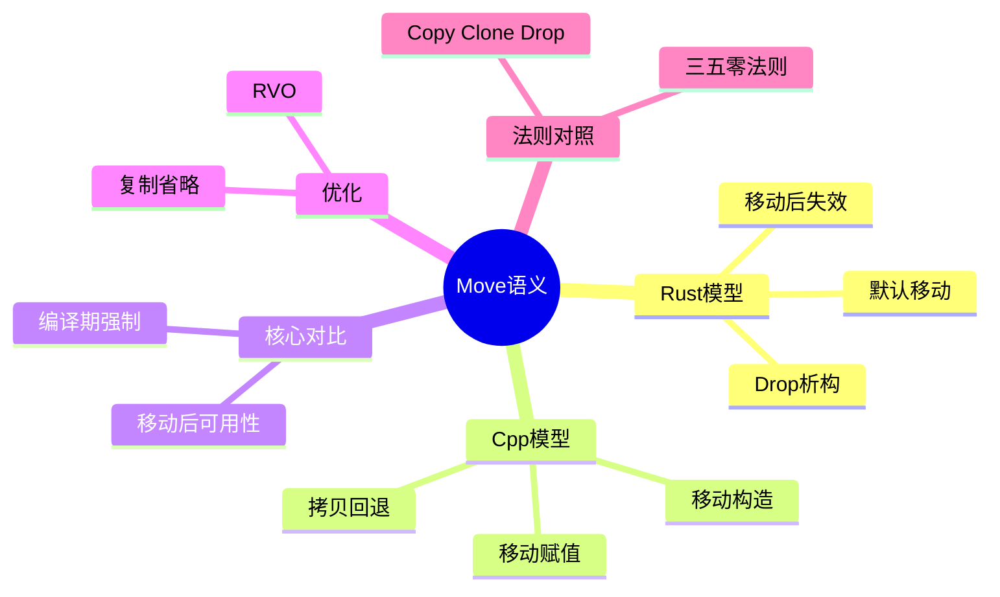

> **内容分级**: [综述级]
>
# Move 语义：C++ 与 Rust 的资源转移模型
>
> **EN**: Move Semantics
> **Summary**: A focused comparison of move semantics in C++ (move constructors, xvalues, moved-from state) and Rust (ownership transfer, Copy/Clone, compiler-enforced invalidation).
> **Rust 版本**: 1.97.0+ (Edition 2024)
>
> **受众**: [初学者]
> **权威来源**: 本文件为 `concept/` 权威页。
> **层级**: L1 基础概念
> **A/S/P 标记**: C+S — Comparison + Structure
> **双维定位**: C×Ana
> **前置概念**: [Ownership](01_ownership.md) · [Variable Model](../03_values_and_references/03_variable_model.md) · [Borrowing](02_borrowing.md) · [学习指南](../../00_meta/04_navigation/07_learning_guide.md)
> **后置概念**: [Rust vs C++](../../05_comparative/01_systems_languages/01_rust_vs_cpp.md) · [Construction](../../02_intermediate/00_traits/05_construction_and_initialization.md)
> **主要来源**: · [RustBelt — POPL 2018](https://plv.mpi-sws.org/rustbelt/popl18/) · [O'Hearn — Separation Logic and Shared Mutable Data](https://doi.org/10.1017/S0960129501001003) · [Itanium C++ ABI](https://itanium-cxx-abi.github.io/cxx-abi/abi.html)
>
> [TRPL Ch 4 — What is Ownership?](https://doc.rust-lang.org/book/ch04-01-what-is-ownership.html) ·
> [TRPL Ch 10 — Generic Types, Traits, and Lifetimes](https://doc.rust-lang.org/book/ch10-00-generics.html) ·
> [Rust Reference — Moved and Copied Types](https://doc.rust-lang.org/reference/expressions.html#moved-and-copied-types) ·
> [cppreference — Move Constructors](https://en.cppreference.com/w/cpp/language/move_constructor) ·
> [cppreference — Move assignment operator](https://en.cppreference.com/w/cpp/language/move_assignment) ·
> [cppreference — Value categories](https://en.cppreference.com/w/cpp/language/value_category) ·
> [Brown CRP — Copy and Move Constructors](https://cel.cs.brown.edu/crp/idioms/constructors/copy_and_move_constructors.html) ·
> [StackOverflow — How does Rust provide move semantics?](https://stackoverflow.com/questions/27922584/how-does-rust-provide-move-semantics) ·
> [The Coded Message — C++ Move Semantics Considered Harmful](https://thecodedmessage.com/posts/cpp-move-harmful/) ·
> [Stroustrup — The C++ Programming Language, 4th ed.](https://www.stroustrup.com/4th.html)
>
---

> **Bloom 层级**: L1-L4

---
> **权威来源**:
> [Rust Reference — Moved and Copied Types](https://doc.rust-lang.org/reference/expressions.html#moved-and-copied-types) ·
> [TRPL — What is Ownership?](https://doc.rust-lang.org/book/ch04-01-what-is-ownership.html) ·
> [TRPL — References and Borrowing](https://doc.rust-lang.org/book/ch04-02-references-and-borrowing.html)
>
> **权威来源对齐变更日志**: 2026-07-10 补充权威来源标注（Rust Reference、TRPL）

---

## 🧠 知识结构图



## 一、核心命题

> **Move 语义解决同一个问题：如何在不复制大量数据的情况下转移资源所有权（Ownership）。
> 但 C++ 和 Rust 的解决方案完全不同：
> C++ 的 move 是一种特殊的构造函数，允许程序员手动转移资源，并留下一个"有效但未指定"的源对象；
> Rust 的 move 是所有权（Ownership）系统的基本操作，只是 bitwise copy + 编译期标记源变量无效。**

---

## 二、C++ 的 Move 语义

C++ 的 move 语义是**运行期机制**：`std::move` 只是 static_cast 到右值引用（Reference），真正的移动由移动构造/移动赋值运算符执行——它们是用户可定义、可观察、可有副作用的代码。三个关键后果：

1. **moved-from 状态合法**：移动后源对象仍存在且可析构，处于「有效但未指定」状态——标准只保证析构与赋新值安全，读取是逻辑错误（但编译器不检查）；
2. **值类别体系**：lvalue/prvalue/xvalue 三分决定重载决议与引用（Reference）绑定——`std::move` 产生 xvalue，绑定到 `T&&` 触发移动重载；
3. **拷贝省略（RVO/NRVO）**：C++17 起 prvalue 的拷贝/移动强制省略——「移动」有时根本不发生。

与 Rust 对照的意义：C++ move 是「可定制的运行期操作」，Rust move 是「编译期所有权（Ownership）转移 + 按位拷贝」——后者的 moved-from 状态不可访问（编译错误），这是两套体系最深的分野。

### 2.1 `std::move` 与移动构造函数

```cpp
#include <string>
#include <utility>

std::string s1 = "hello";
std::string s2 = std::move(s1); // s1 变为 xvalue（将亡值）
// s2 调用移动构造函数，接管 s1 的内部缓冲区
// s1 仍处于"有效但未指定状态"
```

C++11 引入的 move 语义：

- `std::move(x)` 实际上只是把 `x` 转换为右值引用（Reference） `T&&`。
- 移动构造函数 `T(T&& other)` 负责转移资源。
- 移动后，源对象处于**有效但未指定状态（valid but unspecified state）**。

### 2.2 值类别

C++ 的值类别体系：

- **lvalue**：可定位的值（有名字、有地址）
- **xvalue**：将亡值（`std::move` 的结果）
- **prvalue**：纯右值（临时对象）
- **glvalue**：lvalue + xvalue
- **rvalue**：xvalue + prvalue

Move 语义依赖于这个复杂的值类别体系。

### 2.3 Moved-from 状态

```cpp
std::string s = "hello";
auto s2 = std::move(s);
// s 仍然可以调用 .empty()、.clear() 等不依赖具体值的函数
// 但不能依赖 s 的内容
```

C++ 不禁止访问 moved-from 对象，只是其值未指定。

---

## 三、Rust 的 Move 语义

Rust 的 move 是**编译期所有权（Ownership）转移**：`let y = x;`（非 `Copy` 类型）把 `x` 的所有权转移给 `y`，`x` 被静态标记为已移动，此后使用触发 E0382。三个核心要点：

1. **按位拷贝 + 源失效**：move 的机器码是 memcpy（常被优化掉），源对象的内存不被清零也不运行析构——「移动后源失效」是编译期事实，不是运行期状态；
2. **`Copy` vs `Clone`**：`Copy` 类型（无 `Drop`、字段全 `Copy`）的 move 退化为按位复制且源保持有效；`Clone` 是显式的深复制请求（`x.clone()`），可能昂贵——Rust 没有隐式深拷贝；
3. **函数边界的 move**：传参是 move（或借用（Borrowing）），返回值是 move 出——所有权沿调用链流动，每个值的负责者（drop 执行者）在编译期唯一确定。

判定准则：看到赋值/传参先问「这里 move、copy 还是 borrow」——三者成本与后续可用性完全不同。

### 3.1 所有权转移

```rust
fn main() {
    let s1 = String::from("hello");
    let s2 = s1; // move：所有权从 s1 转移到 s2
    // println!("{}", s1); // ❌ 编译错误：borrow of moved value
    println!("{}", s2);   // ✅
}
```

Rust 的 move（Rust Reference: [Moved and Copied Types](https://doc.rust-lang.org/reference/expressions.html#moved-and-copied-types)）：

- 对于未实现 `Copy` 的类型，赋值 = 所有权（Ownership）转移。
- 转移是 bitwise copy（对于堆分配类型是复制指针/长度/容量）。
- 源变量在编译期被标记为无效，后续访问被禁止。

> StackOverflow 上的高票回答总结为：Rust 的 move 本质上是“shallow copy + 禁止再次使用源变量”，因此不需要 C++ 式的 moved-from 状态（[How does Rust provide move semantics?](https://stackoverflow.com/questions/27922584/how-does-rust-provide-move-semantics)）。

### 3.2 `Copy` vs `Clone`

```rust
#[derive(Clone, Copy, Debug)]
struct Point { x: f64, y: f64 }

fn main() {
    let p1 = Point { x: 1.0, y: 2.0 };
    let p2 = p1; // Copy：p1 仍然可用
    println!("{:?} {:?}", p1, p2);

    let s1 = String::from("hello");
    let s2 = s1.clone(); // 显式深拷贝
    println!("{} {}", s1, s2);
}
```

- `Copy`：隐式按位复制，原变量仍可用。
- `Clone`：显式复制，可能涉及深拷贝。
- 默认 move：对于非 `Copy` 类型，转移所有权（Ownership）。

---

## 四、核心对比

| 维度 | C++ | Rust |
|:---|:---|:---|
| Move 操作 | `std::move`（类型转换）+ 移动构造函数 | 赋值语句（语言级语义） |
| 实现位置 | 构造函数体内手动转移资源 | 编译器自动 bitwise copy + 标记无效 |
| 源对象状态 | 有效但未指定 | 编译期禁止访问 |
| 值类别 | lvalue/xvalue/prvalue/glvalue/rvalue | place expression / value expression |
| 空状态 | 某些类型有（如 `std::string`） | 无，变量要么有效要么不存在 |
| 默认行为 | 拷贝构造（深拷贝） | move（所有权（Ownership）转移） |
| 显式复制 | 拷贝构造函数 | `Clone::clone()` |
| 编译期保证 | 无 | moved-from 访问被编译器拒绝 |

---

## 五、RVO 与 Copy Elision

返回值优化（RVO）在两种语言中的形态对比揭示了 move 语义的设计差异：

- **C++**：RVO/NRVO 是**优化**——拷贝/移动构造函数必须存在且可访问（C++17 前），即使最终被省略；C++17 起 prvalue 强制省略（guaranteed copy elision）成为语义而非优化；
- **Rust**：move 本身就是按位拷贝，「省略」体现在 ABI 层——大返回值通过隐式输出指针（sret）直接写入调用方栈帧，小返回值走寄存器。Rust 没有「移动构造函数」概念，因此没有「省略移动」的问题——按位拷贝发生与否是 ABI 细节，语义上 move 总是「转移 + 源失效」。

实践推论：Rust 中「返回大结构体（Struct）是否低效」的担心通常多余（sret 已避免拷贝）；真正需要关心的是 `Box` 大对象避免栈上构造（`Box::new_uninit` 模式，仍 nightly 部分）。

### 5.1 C++ 拷贝省略（RVO/NRVO）

```cpp
std::string make_string() {
    return std::string("hello"); // RVO 可能省略拷贝
}
```

C++ 的 RVO 是编译器优化，直到 C++17 的 guaranteed copy elision 之前都不是强制的（cppreference: [Copy elision](https://en.cppreference.com/w/cpp/language/copy_elision)）。

### 5.2 Rust 的保证省略

Rust 的设计哲学是：move 本身就是廉价的 bitwise copy，因此不需要复杂的拷贝省略优化。

```rust
fn make_string() -> String {
    String::from("hello") // 直接构造在调用者的栈空间
}
```

Rust 保证：返回局部值不会发生深拷贝，只是所有权（Ownership）转移。

---

## 六、三/五/零法则 vs Copy/Clone/Drop

C++ 中管理资源需要 Rule of Three/Five/Zero。

Rust 中，复合类型的行为由字段 trait 自动推导：

| C++ | Rust |
|:---|:---|
| 析构函数 | `Drop` trait |
| 拷贝构造函数 | `Clone` trait |
| 拷贝赋值 | `Clone` + 赋值 |
| 移动构造函数 | 语言级 move |
| 移动赋值 | 语言级 move |
| Rule of Zero | 字段自动实现 `Copy`/`Clone`/`Drop` |

```rust
struct Buffer {
    data: Vec<u8>, // Vec 已实现 Drop/Clone，Buffer 自动获得
}
```

---

## 七、形式化视角

C++ move 可以形式化为：

```text
move: T → T' × T_invalid
```

即 move 后产生一个有效的新对象和一个"仍然存在但状态未指定"的源对象。

Rust move 可以形式化为：

```text
move: T@src → T@dst
```

即资源从 `src` 的变量名重新绑定到 `dst`，`src` 从环境中移除。

> **关键洞察**：C++ 的 move 是"复制 + 使源对象进入特殊状态"；Rust 的 move 是"重新绑定资源标识符"。Rust 的模型更简单，因为它不需要 moved-from 状态的概念。

---

## 八、总结

- **L1**：C++ move 调用移动构造函数，源对象变为"有效但未指定"；Rust move 是赋值语句，源变量被编译器标记为无效。
- **L2**：Rust 的 `Copy`/`Clone` 替代了 C++ 的拷贝构造；Rust 的语言级 move 替代了 C++ 的移动构造；`Drop` 替代析构函数。
- **L3**：C++ move 是复杂值类别体系和特殊成员函数的产物；Rust move 是所有权（Ownership）系统的基本操作，消除了 moved-from 状态、双重释放和使用已释放对象等整类错误。

---

## 九、延伸阅读

- [TRPL: What Is Ownership?](https://doc.rust-lang.org/book/ch04-01-what-is-ownership.html)
- [TRPL: Generic Types, Traits, and Lifetimes](https://doc.rust-lang.org/book/ch10-00-generics.html)
- [Rust Reference: Moved and Copied Types](https://doc.rust-lang.org/reference/expressions.html#moved-and-copied-types)
- [cppreference: Move Constructors](https://en.cppreference.com/w/cpp/language/move_constructor)
- [cppreference: Move Assignment Operator](https://en.cppreference.com/w/cpp/language/move_assignment)
- [cppreference: Value Categories](https://en.cppreference.com/w/cpp/language/value_category)
- [Brown CRP: Copy and Move Constructors](https://cel.cs.brown.edu/crp/idioms/constructors/copy_and_move_constructors.html)
- [StackOverflow: How does Rust provide move semantics?](https://stackoverflow.com/questions/27922584/how-does-rust-provide-move-semantics)
- [The Coded Message: C++ Move Semantics Considered Harmful](https://thecodedmessage.com/posts/cpp-move-harmful/)
- [Stroustrup — The C++ Programming Language, 4th ed.](https://www.stroustrup.com/4th.html)

---

## 判定表：Move / Copy / Clone 处置判定

| 场景/条件 | 判定结论 | 依据（定理/规则） | 反例或失效条件 |
|:---|:---|:---|:---|
| 非 `Copy` 类型赋值、传参、返回 | move：bitwise copy + 源变量编译期标记无效 | §3.1 Rust move 语义 | `Copy` 类型 ⟹ 源变量仍可用（§3.2） |
| 需要保留源变量且类型可复制 | 隐式 `Copy`（仅限 `Copy` 类型） | §3.2 `Copy` vs `Clone` | 含堆资源的类型不能 `Copy` |
| 需要深拷贝堆数据 | 显式 `.clone()` | `Clone` trait（§3.2） | 误以为赋值是深拷贝 ⟹ 实际是 move |
| 期待 C++ 式 moved-from 状态 | 不存在：变量要么有效要么不存在 | §4 核心对比 | 用 `Option::take` 表达「可取空」语义 |
| 依赖 RVO/NRVO 避免拷贝 | Rust 无需：move 本身是 bitwise copy | §5 RVO 与 Copy Elision | 大型栈数组 move 仍是 memcpy，注意栈占用 |
| 自定义资源管理（三/五法则场景） | 实现 `Drop`；通常无需手写移动构造 | §6 三/五/零法则 vs Copy/Clone/Drop | 同时实现 `Copy` 与 `Drop` ⟹ 编译禁止 |

## 相关概念

- [对应测验](../../02_intermediate/08_quizzes/30_quiz_cpp_rust_foundations.md) — C/C++ → Rust 工程层基础对比（RTTI、宏（Macro）、异常安全、构造、move 语义）
- **上层概念**: [Ownership](01_ownership.md) · [Variable Model](../03_values_and_references/03_variable_model.md) · [Borrowing](02_borrowing.md) · [学习指南](../../00_meta/04_navigation/07_learning_guide.md)
- **下层概念**: [Rust vs C++](../../05_comparative/01_systems_languages/01_rust_vs_cpp.md) · [Construction](../../02_intermediate/00_traits/05_construction_and_initialization.md)

## 国际权威参考 / International Authority References（P1 学术 · P2 生态）

> 依据 `AGENTS.md` §2「对齐网络国际化权威内容」补充：仅追加已验证可达的权威链接，不改动正文事实。

- **P2 生态/社区**: [Learn Rust With Entirely Too Many Linked Lists](https://rust-unofficial.github.io/too-many-lists/)

## 📋 关键属性

| 属性 | 取值 / 判定 | 依据 |
|---|---|---|
| 触发条件 | 非 `Copy` 类型在赋值、传参、返回时转移所有权 | Rust 默认值语义，无隐式复制构造 |
| 源状态 | move 后原变量不可再使用（E0382） | 借用（Borrowing）检查器编译期静态判定 |
| 运行时（Runtime）成本 | 栈上按位拷贝 + 源失效，无堆数据复制、无引用计数 | 零成本抽象（Zero-Cost Abstraction）原则 |
| 与 C++ 差异 | C++ move 后源处于「有效但未指定」状态；Rust 源直接失效 | 所有权模型 vs 类不变量模型 |
| 可恢复性 | 需 `Clone`（显式深拷贝）或 `Copy`（隐式按位复制）恢复共享 | `Copy`/`Clone` trait 契约 |

## 🔗 概念关系

- **上位（is-a）**：Move 语义是 [Ownership](01_ownership.md) 所有权转移机制的核心操作，作用于 [Variable Model](../03_values_and_references/03_variable_model.md) 定义的变量-值绑定。
- **下位（实例）**：`String`、`Vec<T>` 等堆类型的 move 实例分析见 [Rust vs C++](../../05_comparative/01_systems_languages/01_rust_vs_cpp.md)。
- **对偶**：与显式深拷贝 `Clone` / 按位复制 `Copy` 相对，工程抉择见 [构造与初始化](../../02_intermediate/00_traits/05_construction_and_initialization.md)。
- **组合**：与 [Borrowing](02_borrowing.md) 互斥协作——move 转移所有权，借用只临时出让访问权。
- **依赖**：语义正确性依赖 [Lifetimes](03_lifetimes.md) 对引用存活期的静态验证。

---

## ⚠️ 反例与陷阱：移动后再次使用（use after move）

**反例**（rustc 1.97 实测编译失败：E0382）：

```rust,compile_fail
fn main() {
    let s = String::from("hi");
    let t = s;
    println!("{s}");
}
```

非 `Copy` 类型赋值即移动，`s` 已失效；这与 C++ 移动后「有效但未指定」不同，Rust 直接编译拒绝。

**修正**：

```rust
fn main() {
    let s = String::from("hi");
    let t = s.clone();
    println!("{s} {t}");
}
```

---

## 认知路径（Cognitive Path）

> **认知路径**: 从 [Ownership（所有权）](01_ownership.md) 与 [Variable Model（变量模型）](../03_values_and_references/03_variable_model.md) 出发，经由本节的核心判定规则，到达 [Borrowing（借用）](02_borrowing.md)、[Lifetimes（生命周期）](03_lifetimes.md)、[Rust vs C++（跨语言对比）](../../05_comparative/01_systems_languages/01_rust_vs_cpp.md) 与工程实践。

### 核心推理链

| 定理 | 前提 | 结论 | 置信度 |
|:---|:---|:---|:---:|
| Move 规则 ⟹ 可编译 | 掌握 Copy/Clone 区别 | 能写出符合借用检查器的资源转移代码 | 高 |
| 忽略 Copy 边界 ⟹ 编译错误 | 非 Copy 类型赋值后继续使用 | 出现 E0382 错误 | 高 |
| 显式 Clone 最佳实践 ⟹ 安全抽象 | 需要共享时选择 clone 或 Rc | 减少意外移动与数据竞争 | 中 |

### 反命题与边界

> **反命题**: "Move 语义会复制数据（Copy）" —— 错误。正确判定是 Move 是 bitwise 转移 + 原绑定失效；只有实现 `Copy` 的类型才按位复制。
> **边界**: 当类型实现 `Drop` 或需 `ManuallyDrop` 时，移动语义受析构顺序约束；跨 FFI 边界需显式管理（参见 [Unsafe Rust](../../03_advanced/02_unsafe/01_unsafe.md)）。

> **过渡**: 理解 Move 语义（Move Semantics）后，下一步应学习 [Borrowing（借用）](02_borrowing.md) 与 [Lifetimes（生命周期）](03_lifetimes.md)，并注意 `Copy` 与 `Clone` 的边界。
> **过渡**: 在 [Ownership（所有权）](01_ownership.md) 与 [Variable Model（变量模型）](../03_values_and_references/03_variable_model.md) 的基础上，本节将资源转移扩展为可判定规则。
> **过渡**: 从本节规则到 [Rust vs C++（跨语言对比）](../../05_comparative/01_systems_languages/01_rust_vs_cpp.md)，核心变化是理解 Rust moved-from 状态与 C++ 有效但未指定状态的本质差异。

> 资源确定性释放 ⟸ RAII + 所有权唯一性
> 无 moved-from 漏洞 ⟸ 编译期标记原绑定失效
