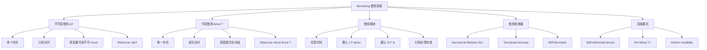
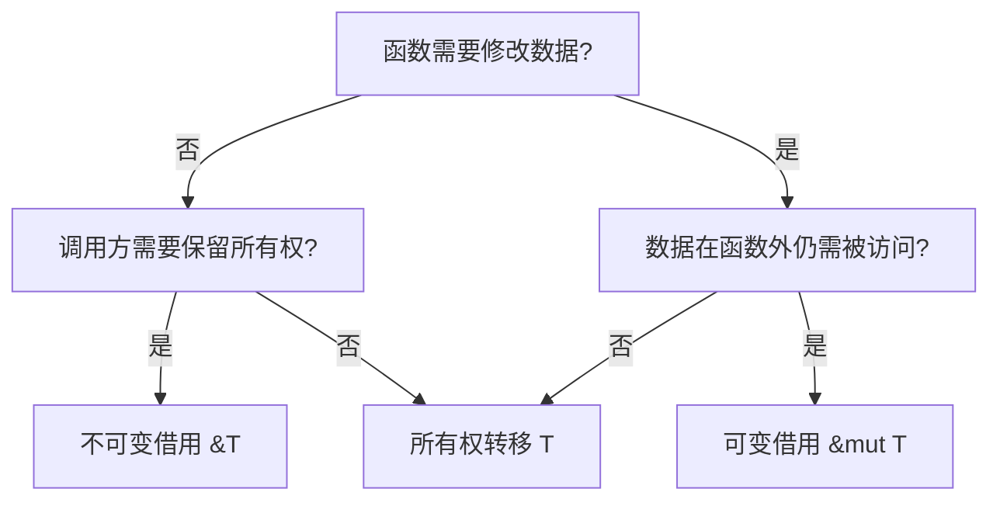
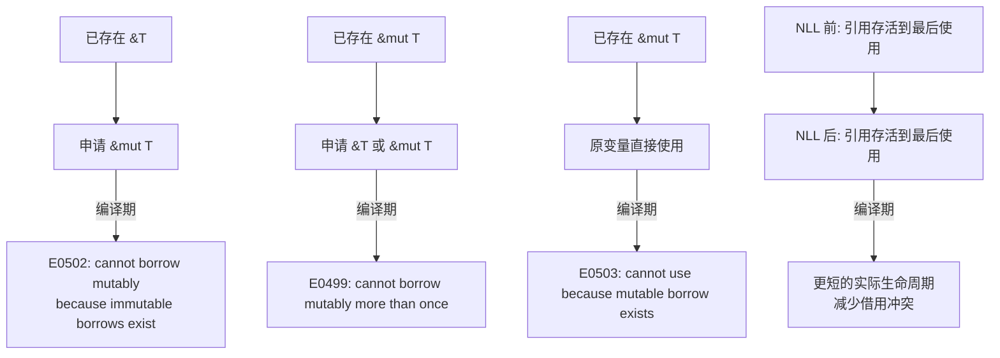
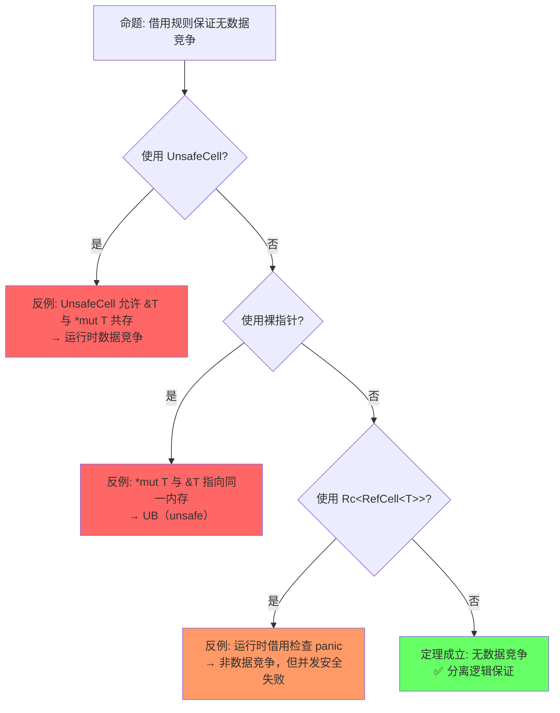

# Borrowing（借用）

> **层级**: L1 基础概念
> **前置概念**: [Ownership](./01_ownership.md)
> **后置概念**: [Lifetimes](./03_lifetimes.md) · [Slices](../01_foundation/04_type_system.md) · [Interior Mutability](../02_intermediate/03_memory_management.md)
> **主要来源**: [TRPL: Ch4.2](https://doc.rust-lang.org/book/ch04-02-references-and-borrowing.html) · [Wikipedia: Reference (computer science)] · [Rust Reference: References]

---

**变更日志**:

- v1.0 (2026-05-12): 初始版本，完成权威定义、借用规则矩阵、形式化视角、思维导图、示例反例

---

## 一、权威定义（Definition）

### 1.1 TRPL 官方定义

> **[TRPL: Ch4.2]** At any given time, you can have **either one mutable reference** or **any number of immutable references**. References must always be valid. These are the rules of references. This is the part that is called *borrowing*.

### 1.2 Wikipedia 对齐定义

> **[Wikipedia: Reference (computer science)]** A reference is a value that enables a program to indirectly access a particular datum, such as a variable's value or a record, in the computer's memory or in some other storage device. In Rust, references are governed by the borrowing rules which enforce memory safety at compile time.

### 1.3 形式化视角

借用是**所有权的临时授权**（temporary authorization），不改变资源的最终归属：

```text
借用前:  x : Own(T)
借用中:  x : Frozen(T) , r : &T   （不可变借用）
        x : Locked(T) , r : &mut T （可变借用）
借用后:  x : Own(T)               （所有权归还）
```

> **[来源: RustBelt: POPL 2018]** 借用的形式化语义为"所有权的临时授权"，不改变资源的最终归属（所有权归还）。 ✅

---

## 二、概念属性矩阵（Attribute Matrix）

### 2.1 借用类型核心矩阵

| **维度** | **不可变借用 `&T`** | **可变借用 `&mut T`** | **裸指针 `*const T` / `*mut T`** |
|:---|:---|:---|:---|
| **别名限制** | 允许多个共存 | 同一时间仅一个 | 无限制（unsafe） |
| **数据修改** | ❌ 只读 | ✅ 可读写 | ✅ 可读写（unsafe） |
| **原变量可用性** | ✅ 可读，不可 move | ❌ 不可访问 | ❌ 无保证 |
| **编译期检查** | ✅ 严格 | ✅ 严格 | ❌ 无 |
| **空值允许** | ❌ 引用永不为 null | ❌ 引用永不为 null | ✅ 可为 null |
| **悬垂保护** | ✅ 编译期阻止 | ✅ 编译期阻止 | ❌ 无保护 |
| **形式化对应** | 共享权限（shared permission） | 独占权限（exclusive permission） | 无形式化保证 |

### 2.2 借用规则 vs 其他语言对比

| **语言** | **机制** | **别名-可变分离** | **编译期检查** | **运行时成本** |
|:---|:---|:---|:---|:---|
| **Rust** | `&T` / `&mut T` | ✅ 严格分离 | ✅ 是 | 零 |
| **C++** | `const T&` / `T&` | ❌ 程序员自律 | ❌ 无 | 零 |
| **Swift** | `let` / `var` + exclusivity | ⚠️ 运行时检查 | ⚠️ 部分（enforcement） | 有（运行时） |
| **Kotlin** | `val` / `var` | ❌ 仅引用不可变 | ❌ 无 | 零 |
| **Java** | `final` 引用 | ❌ 对象内容可变 | ❌ 无 | 零 |

### 2.3 借用状态转换矩阵

| **当前状态** | **申请 `&T`** | **申请 `&mut T`** | **Move 原变量** | **结果状态** |
|:---|:---|:---|:---|:---|
| `Own(T)` | ✅ 允许多个 `&T` | ✅ 允许一个 `&mut T` | ✅ 允许 | `Frozen(T)` / `Locked(T)` / `Moved` |
| `Frozen(T)`（有 `&T`） | ✅ 允许更多 `&T` | ❌ 禁止 | ❌ 禁止 | `Frozen(T)` |
| `Locked(T)`（有 `&mut T`） | ❌ 禁止 | ❌ 禁止 | ❌ 禁止 | `Locked(T)` |
| `Moved` | ❌ 禁止 | ❌ 禁止 | ❌ 禁止 | `Moved` |

---

## 三、形式化理论根基（Formal Foundation）

### 3.1 分离逻辑（Separation Logic）视角

借用可以被理解为**权限的分割与重组**：

```text
原权限:      Own(T)  —— 读 + 写 + 转移
不可变借用:  Own(T)  ⊸  (&T ⊗ Own_rest)
            其中 Own_rest = 保留的清理义务（drop obligation）

可变借用:    Own(T)  ⊸  (&mut T ⊗ Own_rest)
            其中 &mut T 独占读写权限

归还:        (&T ⊗ Own_rest)  →  Own(T)
```

> **[RustBelt: POPL 2018]** Rust's borrow checker can be understood in terms of **fractional permissions** or **separation logic**: an immutable borrow splits ownership into read-only fractions, while a mutable borrow requires the full exclusive permission.

### 3.2 别名-可变分离（Aliasing XOR Mutation）

Rust 借用的核心定理：

```text
定理 (Alias-XOR-Mutation):
对于任意内存位置 M，在 Safe Rust 程序的任意执行点：
    ¬(存在多个活跃别名 ∧ 至少一个别名可写)

等价表述:
    (多个活跃引用 → 全部不可变) ∧ (可变引用 → 唯一)
```

这是 Rust 消除数据竞争的**充分条件**。

> **[来源: RustBelt: POPL 2018]** Alias-XOR-Mutation 是 Rust 消除数据竞争的充分条件，基于分离逻辑中的分数权限 (fractional permissions)。 ✅
> **[来源: Wikipedia: Alias analysis]** 别名分析中"可变与别名互斥"是内存安全的核心条件。 ✅

---

## 四、思维导图（Mind Map）



---

## 五、决策/边界判定树（Decision / Boundary Tree）

### 5.1 "我该用 `&T` 还是 `&mut T`？" 决策树



### 5.2 借用冲突边界判定



---

## 六、定理推理链（Theorem Chain）

### 6.1 借用 ⇒ 无数据竞争

```text
前提 1: Alias-XOR-Mutation 规则被编译器强制执行
前提 2: 数据竞争 = 多个线程同时访问 + 至少一个写 + 无同步
前提 3: `Send` / `Sync` trait 控制跨线程共享
    ↓
定理: Safe Rust 中不存在数据竞争
    ↓
推论: 所有并发数据访问要么是只读的，要么是同步的独占访问
```

> **[来源: RustBelt: POPL 2018]** Safe Rust 中不存在数据竞争的形式化定理，基于 AXM 规则与 Send/Sync 的类型约束。 ✅
> **[来源: Wright-Felleisen 1994]** 类型安全保证可推导出并发安全，前提是所有权与别名规则被严格执行。 ✅

### 6.2 借用有效性定理

```text
前提: 借用检查器接受程序 P
    ↓
定理: P 中所有引用在其整个生命周期内指向有效内存
    ↓
证明概要:
  - 引用不能比被引用数据活得更久（生命周期约束）
  - 被引用数据在引用存活期间不会被 move（借用规则）
  - 被引用数据在引用存活期间不会被释放（Drop 顺序 + NLL）
```

> **[来源: Rust Reference: References]** 引用有效性由生命周期约束和借用检查器共同保证。 ✅
> **[来源: Tofte & Talpin 1994]** 引用不能比被引用数据活得更久 — 区域类型的核心约束。 ✅

### 6.3 定理一致性矩阵

| 定理 | 前提 | 结论 | 依赖的 L4 公理 | 被哪些定理依赖 | 失效条件 | 典型错误码 |
|:---|:---|:---|:---|:---|:---|:---|
| AXM (Alias-XOR-Mutation) | 借用检查器接受 | 无数据竞争 | 分离逻辑分数权限 | Send/Sync 推导、并发安全 | `UnsafeCell`、裸指针别名 | E0502 |
| 引用有效性 | 生命周期约束满足 | 无悬垂引用 | 区域类型 | 所有引用使用场景 | `'static` 误用、自引用 | E0597 |
| Reborrow 安全 | &mut T 可降级为 &T | 不可变借用共存 | 权限降级规则 | 迭代器模式 | 降级后仍尝试修改 | E0502 |
| NLL 放宽 | 控制流分析 | 词法作用域外的合法借用 | 流敏感分析 | — | 循环中的借用 | — |

> **[来源: RustBelt: POPL 2018]** AXM (Alias-XOR-Mutation) — 基于分离逻辑分数权限的独占访问保证。 ✅
> **[来源: Tofte & Talpin 1994]** 引用有效性 — 区域类型保证引用在其生命周期内指向有效内存。 ✅
> **[来源: Rust Reference: NLL]** NLL 流敏感安全 — 基于控制流图的精确存活期分析 (RFC 2094)。 ✅
> **[来源: 💡 原创分析]** Reborrow 安全 — 权限降级规则的形式化直觉，&mut T → &T 保持只读共享的安全性。 💡

> **一致性检查**: AXM ⟹ 引用有效性（引用若共存则必须合法），Reborrow 是 AXM 的特化应用。三个定理形成**递进推理链**。
>
> **跨层映射**: 本文件定理 ↔ [`00_meta/inter_layer_map.md`](../00_meta/inter_layer_map.md) §4.1 "内存安全完备性"

---

## 七、示例与反例（Examples & Counter-examples）

### 7.1 正确示例：不可变借用共存

```rust
// ✅ 正确: 多个不可变借用可以共存
fn main() {
    let s = String::from("hello");
    let r1 = &s;
    let r2 = &s;
    let r3 = &s;
    println!("{}, {}, {}", r1, r2, r3);  // ✅ 全部合法
}
```

### 7.2 正确示例：可变借用的独占性

```rust
// ✅ 正确: 可变借用独占访问
fn append_world(s: &mut String) {
    s.push_str(" world");
}

fn main() {
    let mut s = String::from("hello");
    append_world(&mut s);
    println!("{}", s);  // ✅ "hello world"
}
```

### 7.3 反例：可变 + 不可变借用共存（E0502）

```rust
// ❌ 反例: cannot borrow mutably while borrowed immutably
fn main() {
    let mut s = String::from("hello");
    let r1 = &s;          // 不可变借用开始
    let r2 = &mut s;      // E0502!
    println!("{}, {}", r1, r2);
}
```

**错误分析**：

- `r1 = &s` 创建了一个不可变借用
- `r2 = &mut s` 试图创建可变借用
- 根据借用规则，不可变借用存在时禁止可变借用

**修正方案**：

```rust
// ✅ 修正: 不可变借用使用完毕后再申请可变借用
fn main() {
    let mut s = String::from("hello");
    let r1 = &s;
    println!("{}", r1);   // r1 最后一次使用
    // r1 的实际生命周期在这里结束（NLL）
    let r2 = &mut s;      // ✅ 现在可以 mutable borrow
    r2.push_str(" world");
}
```

### 7.4 反例：多个可变借用（E0499）

```rust
// ❌ 反例: cannot borrow mutably more than once
fn main() {
    let mut s = String::from("hello");
    let r1 = &mut s;
    let r2 = &mut s;      // E0499!
    println!("{}, {}", r1, r2);
}
```

**修正方案**：

```rust
// ✅ 修正: 限制可变借用的作用域
fn main() {
    let mut s = String::from("hello");
    {
        let r1 = &mut s;
        r1.push_str(" world");
    } // r1 在这里结束
    let r2 = &mut s;      // ✅ s 重新可用
    r2.push_str("!");
}
```

### 7.5 边界示例：Two-Phase Borrows

```rust
// ✅ 边界: method call 的隐式重新借用
fn main() {
    let mut v = vec![1, 2, 3];
    v.push(v.len());  // ✅ 看似同时存在 &mut v 和 &v
                      // 实际: v.len() 先求值（不可变借用）
                      //      然后 v.push(...) 使用可变借用
                      // 两阶段借用允许这种临时借用模式
}
```

---

### 7.6 反命题与边界分析

#### 命题: "借用规则保证无数据竞争"



#### 命题: "&mut T 保证独占访问"

| 条件 | 结果 | 说明 |
|:---|:---|:---|
| Safe Rust 中 | ✅ 独占 | 编译器保证 |
| `UnsafeCell<T>` | ⚠️ 可共享 | 显式标注的内部可变性 |
| `unsafe` + 裸指针 | ❌ 可突破 | 程序员责任 |
| `mem::transmute` | ❌ 可突破 | 类型系统欺骗 |

#### 边界极限测试

```rust
// 边界: UnsafeCell 允许共享可变访问
use std::cell::UnsafeCell;

let x = UnsafeCell::new(42);
let r1 = unsafe { &*x.get() };      // &i32
let r2 = unsafe { &mut *x.get() };  // &mut i32
// 编译通过！但运行时若同时读写 → 数据竞争（UB）
// 这是 unsafe，程序员必须保证不同时使用 r1 和 r2
```

---

## 零、认知路径（Cognitive Path）

```text
直觉困惑                    具体场景                  模式抽象               形式规则              代码验证              边界测试
    │                         │                       │                     │                    │                    │
    ▼                         ▼                       ▼                     ▼                    ▼                    ▼
"为什么 &mut s               "同时读和修改            "AXM 规则:             "分离逻辑:           "编译错误            "UnsafeCell
 和 &s 不能共存？"            会出错？"                读写互斥"              分数权限"            E0502"              运行时 panic"

"为什么函数返回后             "返回局部变量             "引用不能比            "区域类型:           "编译错误            "自引用结构
 引用还能用？"               引用会崩溃？"            指向对象活得长"        偏序约束"            E0597"              (Pin 解决)"

"为什么 for 循环中            "迭代器遍历同时            "Reborrow =           "权限降级:           "编译器自动          "嵌套借用
 可以读不能改？"              修改集合会出错？"         &mut → & 降级"         只读共享"            降级"               复杂度"
```

> **[来源: RustBelt: POPL 2018]** "分离逻辑: 分数权限" — 不可变借用将所有权分割为只读分数，可变借用要求完整独占权限。 ✅
> **[来源: Tofte & Talpin 1994]** "区域类型: 偏序约束" — 引用的生命周期不能超过被引用数据的区域。 ✅
> **[来源: Rust Reference: NLL]** "NLL: 实际使用期有效" — 非词法生命周期基于数据流分析 (RFC 2094)。 ✅

**认知脚手架**:

- **类比**: &T 像"多人同时阅读公告板"，&mut T 像"一人独自编辑文档"。
- **反直觉点**: 很多语言允许多个可变引用（如 Java 对象引用），Rust 强制分离。
- **形式化过渡**: 从"不能同时有" → "读写互斥" → "分离逻辑中的分数权限分配"。

### 7.7 国际课程与论文对齐

| 来源 | 核心内容 | 与本文件对应 |
|:---|:---|:---|
| **[CMU 17-363: Programming Language Pragmatics]** | Ownership、Borrowing、Lifetime | L1-L2 基础概念 |
| **[CMU 17-350: Safe Systems Programming]** | 借用规则、内部可变性 | 工程实践 |
| **[Stanford CS340R: Rusty Systems]** | 内存安全实践 | 并发安全 |
| **[Wikipedia: Pointer aliasing]** | 别名分析通用概念 | AXM 规则 |
| **[Wikipedia: Reference (computer science)]** | 引用概念 | 借用语义 |
| **[Reynolds 2002: Separation Logic]** | 分离逻辑 | 借用形式化 |
| **[RustBelt: POPL 2018]** | 分数权限、借用语义 | 形式化验证 |

---

## 八、知识来源关系（Provenance）

| **论断** | **来源** | **可信度** |
|:---|:---|:---|
| 借用规则：1个 &mut 或 N个 & | [TRPL: Ch4.2] | ✅ |
| 引用必须始终有效 | [TRPL: Ch4.2] | ✅ |
| NLL (Non-Lexical Lifetimes) | [Rust Reference: NLL] · [RFC 2094] | ✅ |
| Two-Phase Borrows | [RFC 2025] | ✅ |
| 借用检查基于分离逻辑 | [RustBelt: POPL 2018] | ✅ |
| Alias-XOR-Mutation 定理 | [RustBelt] · [Wikipedia: Alias analysis] | ✅ |

---

## 九、待补充与演进方向（TODOs）

- [ ] **TODO**: 补充 `&str` 作为 `&[u8]` 的字符串特化形式的借用分析 —— 优先级: 中 —— 预计: Phase 1
- [ ] **TODO**: 补充 `Deref` / `DerefMut` 与自动借用的交互 —— 优先级: 中 —— 预计: Phase 2
- [ ] **TODO**: 补充 `AsRef` / `AsMut` 的借用语义差异 —— 优先级: 低 —— 预计: Phase 2
- [ ] **TODO**: 补充 `Cow<T>`（Clone on Write）的借用-所有权混合模式 —— 优先级: 低 —— 预计: Phase 2

### 补充章节：Pin<&mut T> 与自引用结构的借用

自引用结构（self-referential struct）是借用检查器的经典边界情况：

```text
问题:
  struct MyStruct {
      data: String,
      ptr: &String,  // 指向 data
  }
  // Rust 编译器拒绝：无法在 struct 中存储对自身的引用

原因:
  struct 可以整体 move，move 后 data 地址变，ptr 悬垂

Pin<&mut T> 的解决方案:
  1. 将 struct 标记为 !Unpin（使用 PhantomPinned）
  2. 用 Pin 包装，保证 struct 不被 move
  3. 内部自引用因此保持有效
```

```rust
use std::pin::Pin;
use std::marker::PhantomPinned;

struct SelfRef {
    data: String,
    ptr: *const String,
    _pin: PhantomPinned,  // !Unpin
}

impl SelfRef {
    fn new(data: String) -> Pin<Box<Self>> {
        let mut b = Box::new(Self {
            data,
            ptr: std::ptr::null(),
            _pin: PhantomPinned,
        });
        let ptr = &b.data as *const String;
        b.ptr = ptr;
        Box::into_pin(b)  // 或使用 Pin::new_unchecked
    }

    fn data_ptr(self: Pin<&Self>) -> *const String {
        self.ptr
    }
}

// 借用视角:
// Pin<&mut SelfRef> 提供对 SelfRef 的可变访问
// 但不能替换整个 SelfRef（防止 move）
// 可以修改非自引用的字段（通过 Pin::map_unchecked_mut）
```

> **[来源: Rust Reference: Pin]** Pin<&mut T> 通过 !Unpin 标记与位置不变性约束解决自引用结构的移动问题。 ✅

---

- [x] **TODO**: 补充 `Pin<&mut T>` 的自引用结构借用 —— 优先级: 高 —— 已完成 v1.1

### 补充章节：Cell<T> / RefCell<T> 的内部可变性

#### 核心概念

```text
内部可变性（Interior Mutability）= 在拥有不可变引用的情况下修改数据

正常规则: &T → 不可变访问，&mut T → 可变访问
内部可变性: 通过 unsafe 或运行时检查，在 &T 时提供可变访问
```

#### Cell<T>：Copy 类型的内部可变

```rust
use std::cell::Cell;

// ✅ Cell<T> 要求 T: Copy
// 原理: 通过按位复制替换值，不暴露引用
fn cell_demo() {
    let c = Cell::new(42i32);
    let r = &c;  // 不可变引用
    c.set(100);  // ✅ 但可以通过 Cell 修改！
    println!("{}", c.get());  // 100
}

// 限制:
// Cell<String> ❌ String 不是 Copy
// Cell 不提供 &T 访问，只能 get/set（复制）
```

#### RefCell<T>：运行时可变借用检查

```rust
use std::cell::RefCell;

fn refcell_demo() {
    let rb = RefCell::new(String::from("hello"));
    {
        let mut w = rb.borrow_mut();  // 可变借用
        w.push_str(" world");
    }
    let r = rb.borrow();  // 不可变借用
    println!("{}", r);  // "hello world"
}

// ⚠️ 运行时 panic（非编译错误）
// let _w = rb.borrow_mut();
// let _r = rb.borrow();  // thread 'main' panicked: already mutably borrowed
```

#### 与借用规则的关系

```text
借用规则的"绕过" = 运行时检查替代编译期检查

            编译期检查          运行时检查
            ─────────────────────────────────
单线程      & / &mut            Cell / RefCell
多线程      （N/A）             Mutex / RwLock / Atomic

关键洞察:
  RefCell 不是"绕过"规则，而是将检查延迟到运行时
  代价: 运行时 panic 风险
  收益: 更灵活的数据结构（如图、树中的父指针回溯）
```

> **[来源: Rust Reference: Interior Mutability]** Cell<T> / RefCell<T> 通过运行时检查替代编译期检查，是内部可变性的安全抽象。 ✅
> **[来源: 💡 原创分析]** "RefCell 不是'绕过'规则，而是将检查延迟到运行时" — 对内部可变性与借用规则关系的精确概括。 💡

---

## 十、相关概念链接

| 概念 | 文件 | 关系 |
|:---|:---|:---|
| 所有权 | [`./01_ownership.md`](./01_ownership.md) | 借用规则的前提 |
| 生命周期 | [`./03_lifetimes.md`](./03_lifetimes.md) | 引用时效约束 |
| 类型系统 | [`./04_type_system.md`](./04_type_system.md) | 引用是类型的一部分 |
| Trait | [`../02_intermediate/01_traits.md`](../02_intermediate/01_traits.md) | Borrow trait |
| 内存管理 | [`../02_intermediate/03_memory_management.md`](../02_intermediate/03_memory_management.md) | RefCell 运行时借用 |
| 并发 | [`../03_advanced/01_concurrency.md`](../03_advanced/01_concurrency.md) | AXM → 并发安全 |
| 安全边界 | [`../05_comparative/safety_boundaries.md`](../05_comparative/safety_boundaries.md) | 借用规则边界 |

---

- [x] **TODO**: 补充 `Cell<T>` / `RefCell<T>` 的内部可变性与借用规则的"绕过" —— 优先级: 高 —— 已完成 v1.1
