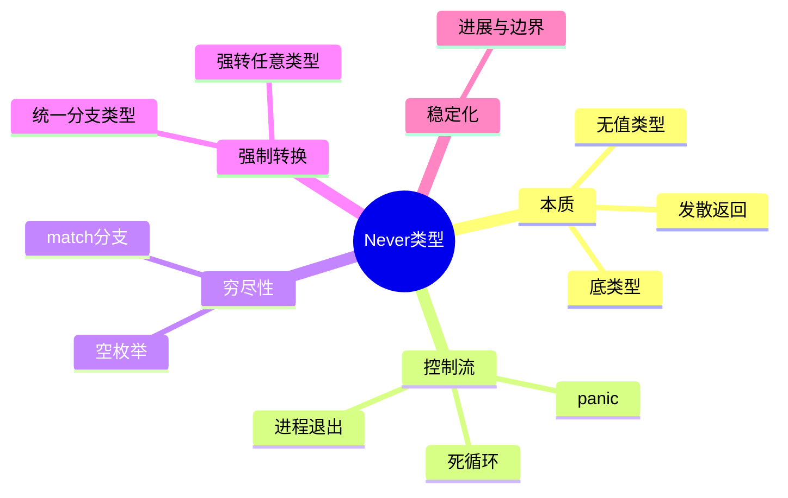

> **内容分级**: [综述级]
>
> **本节关键术语**: Never 类型 (!) · 发散函数 (Diverging Function) · 类型归一 (Type Unification) · 空类型 (Empty Type) · 穷尽匹配 (Exhaustiveness) — [完整对照表](../../00_meta/01_terminology/01_terminology_glossary.md)
>

# Never Type (`!`)：底类型与穷尽性
>
> **EN**: Never Type
> **Summary**: Never Type — The never type `!`: its formal semantics, inference rules, control-flow use, and exhaustiveness checking.
> **受众**: [初学者]
> **Bloom 层级**: L3-L4
> **权威来源**: 本文件为 `concept/` 权威页。
> **A/S/P 标记**: **S** — Structure
> **双维定位**: C×Str — 结构型类型系统（Type System）
> **定位**: 系统讲解 Rust 中 `!` (never type) 的形式语义、类型推导规则、控制流应用和穷尽性检查机制。
> **前置概念**: [类型系统（Type System）](01_type_system.md) · [所有权（Ownership）](../01_ownership_borrow_lifetime/01_ownership.md) · [错误处理（Error Handling）](../08_error_handling/01_error_handling_basics.md)
> **后置概念**: [泛型（Generics）](../../02_intermediate/01_generics/01_generics.md) · [Async](../../03_advanced/01_async/01_async.md) · 形式方法

---

> **来源**: · [Pierce — Types and Programming Languages](https://www.cis.upenn.edu/~bcpierce/tapl/) · [System F](https://en.wikipedia.org/wiki/System_F) · [Brown University — Concepts in Rust Programming](https://cel.cs.brown.edu/crp/) · [Brown Interactive Rust Book](https://rust-book.cs.brown.edu/) · [Oxide: The Essence of Rust](https://arxiv.org/abs/1903.00982) · [Itanium C++ ABI](https://itanium-cxx-abi.github.io/cxx-abi/abi.html)
>
> [Rust Reference — Never Type](https://doc.rust-lang.org/reference/types/never.html) ·
> [The Rust Programming Language](https://doc.rust-lang.org/book/title-page.html) ·
> [Rustonomicon](https://doc.rust-lang.org/nomicon/index.html) ·
> [RFC 1216](https://rust-lang.github.io/rfcs/1216-bang-type.html) ·
> [Rust Release Notes — 1.92.0](https://doc.rust-lang.org/beta/releases.html) ·
> [Rust Release Notes — 1.96.0](https://github.com/rust-lang/rust/issues/156512)
>
> **稳定化状态**:
> `!` 已在大量上下文中可用（如发散函数、`Result<T, !>`、`Option<!>`），但**完整类型地位（full never type stabilization）仍在进行中**。
> Rust 1.92 将 `never_type_fallback_flowing_into_unsafe` 与 `dependency_on_unit_never_type_fallback` 两个 future-compatibility lint 提升为 deny-by-default；Rust 1.96 进一步统一了 `!` 在 tuple 表达式中的 coercion 行为。

## 🧠 知识结构图



## 目录

- [Never Type (`!`)：底类型与穷尽性](#never-type-底类型与穷尽性)
  - [🧠 知识结构图](#-知识结构图)
  - [目录](#目录)
  - [一、核心概念](#一核心概念)
    - [1.1 什么是 `!`](#11-什么是-)
    - [1.2 形式语义：底类型](#12-形式语义底类型)
    - [1.3 Coercion 规则](#13-coercion-规则)
  - [二、控制流应用](#二控制流应用)
    - [2.1 发散函数](#21-发散函数)
    - [2.2 `Result<T, !>` — 不可能失败](#22-resultt---不可能失败)
    - [2.3 `Option<!>` — 不可能存在](#23-option--不可能存在)
  - [三、穷尽性检查](#三穷尽性检查)
    - [3.1 Match 臂完备性](#31-match-臂完备性)
    - [3.2 与空枚举的对比](#32-与空枚举的对比)
  - [四、Never Type 稳定化进展](#四never-type-稳定化进展)
    - [4.1 完整稳定化仍在进行中](#41-完整稳定化仍在进行中)
    - [4.2 Rust 1.92：deny-by-default 的 future-compatibility lint](#42-rust-192deny-by-default-的-future-compatibility-lint)
    - [4.3 Rust 1.96：Tuple Coercion](#43-rust-196tuple-coercion)
    - [4.4 Rust 1.97：`must_use` 将 `Result<T, !>` / `ControlFlow<!, T>` 视为 `T`](#44-rust-197must_use-将-resultt---controlflow-t-视为-t)
  - [五、常见模式](#五常见模式)
    - [模式 1：编译期常量求值](#模式-1编译期常量求值)
    - [模式 2：流处理中的不可能错误](#模式-2流处理中的不可能错误)
    - [模式 3：与 `ControlFlow` 结合](#模式-3与-controlflow-结合)
  - [六、边界测试](#六边界测试)
    - [6.1 边界测试：尝试构造 `!` 的值（编译错误）](#61-边界测试尝试构造--的值编译错误)
    - [6.2 边界测试：`Some(!)` 不可构造（编译错误）](#62-边界测试some-不可构造编译错误)
    - [6.3 边界测试：忘记处理 `Ok` 分支（编译错误）](#63-边界测试忘记处理-ok-分支编译错误)
  - [嵌入式测验（Embedded Quiz）](#嵌入式测验embedded-quiz)
    - [测验 1：`!`（never type）在 Rust 类型系统中被称为底类型。它有一个特殊性质：它是任何类型的子类型。请问，`Result<i32, !>` 的 `Err` 分支在 match 中需要处理吗？（理解层）](#测验-1never-type在-rust-类型系统中被称为底类型它有一个特殊性质它是任何类型的子类型请问resulti32--的-err-分支在-match-中需要处理吗理解层)
    - [测验 2：以下代码是否合法？`let x: String = panic!("abort");`。如果合法，运行时会发生什么？（理解层）](#测验-2以下代码是否合法let-x-string--panicabort如果合法运行时会发生什么理解层)
    - [测验 3：`continue`、`break`（带值除外）、`return` 和 `panic!` 有什么共同类型特征？（理解层）](#测验-3continuebreak带值除外return-和-panic-有什么共同类型特征理解层)
    - [测验 4：函数签名 `fn foo() -> !` 表示什么含义？这种函数可以正常返回吗？（理解层）](#测验-4函数签名-fn-foo----表示什么含义这种函数可以正常返回吗理解层)
    - [测验 5：为什么 `match` 一个类型为 `!` 的值时，可以写零个分支？这与 Rust 的穷尽性检查矛盾吗？（理解层）](#测验-5为什么-match-一个类型为--的值时可以写零个分支这与-rust-的穷尽性检查矛盾吗理解层)
  - [实践](#实践)
  - [认知路径](#认知路径)
    - [核心推理链](#核心推理链)
  - [国际权威参考 / International Authority References（P2 生态）](#国际权威参考--international-authority-referencesp2-生态)
  - [📋 关键属性](#-关键属性)
  - [🔗 概念关系](#-概念关系)

---

## 一、核心概念

`!`（Never type，又称底类型 / bottom type）是 Rust 类型系统中「无任何值」的类型。它的核心概念可归纳为两点：

- **什么是 `!`**：表示「计算永远不会正常返回」——发散函数（如 `panic!`、`loop {}`、`std::process::exit`）的返回类型。它 inhabitant（居留项）为空，与空枚举 `enum Void {}` 同构，但 `!` 由语言内建且享有特殊的强制规则。
- **强制规则（coercion）**：`!` 可以隐式强制到任意类型 `T`。直观理由是「一个永远不会产生的值，可以承诺是任何类型而不被拆穿」。这正是 `let x: i32 = loop {};` 能编译、以及 `match` 中发散臂不破坏类型一致性的形式依据。

判定一个表达式是否为 `!` 类型，标准是控制流：该表达式求值后，程序的控制流是否还能到达后继语句。不能到达（panic、无限循环、return、break、continue）则为发散表达式，类型为 `!`。

### 1.1 什么是 `!`

> **[来源: [Rust Reference](https://doc.rust-lang.org/reference/types/never.html)]**

`!`（读作 "bang" 或 "never type"）是 Rust 中最特殊的类型：

- **它没有值**——不存在任何类型为 `!` 的值
- **它可以转换为任何类型**——通过类型系统（Type System）的 coercion 规则
- **它表示"永远不会返回"**——用于标记 diverging 的控制流

```rust
// `panic!` 返回 `!`
fn always_panics() -> ! {
    panic!("this never returns")
}

// `loop {}` 返回 `!`
fn infinite_loop() -> ! {
    loop { /* ... */ }
}

// `std::process::exit` 返回 `!`
fn fatal_error() -> ! {
    std::process::exit(1)
}
```

> **认知功能**: `!` 填补了 Rust 类型系统（Type System）的"底部"——在所有类型的层级中，`!` 位于最底层，可以隐式转换为任何其他类型。

### 1.2 形式语义：底类型

> **[来源: [Type Theory — Bottom Type](https://en.wikipedia.org/wiki/Bottom_type)]**

在类型论中，`!` 对应 **底类型**（bottom type，记作 ⊥）：

| 概念 | 符号 | 含义 |
|------|------|------|
| 顶类型（top type） | `dyn Any` / `()` | 所有类型的超集 |
| 底类型（bottom type） | `!` | 所有类型的子集 |
| 空类型 | `enum Void {}` | 无构造器的枚举（Enum） |

```text
类型层级（子类型关系）:

        dyn Any / ()
       /   |   \
    i32  String  Vec<T>
       \   |   /
        ! (bottom)
```

> **关键洞察**: `!` 是**所有类型的子类型**（在类型论的子类型关系中）。这意味着 wherever 期望一个 `T`，都可以提供一个 `!`——因为 `!` 永远不会实际存在，所以这种替换是安全的。

### 1.3 Coercion 规则

> **[来源: [Rust Reference — Type Coercions](https://doc.rust-lang.org/reference/type-coercions.html)]**

`!` 可以自动 coercion 为任何类型，这使得它在控制流中极其自然：

```rust
fn demo_coercion(flag: bool) -> String {
    if flag {
        "hello".to_string()  // String
    } else {
        panic!("never")      // ! → 自动 coercion 为 String
    }
}
```

**Coercion 发生的上下文**：

| 上下文 | 示例 |
|--------|------|
| 条件表达式分支 | `if { ! } else { T }` |
| Match 臂 | `match x { A => T, B => ! }` |
| 函数返回 | `fn f() -> T { panic!() }` |
| 赋值 | `let x: T = panic!();` |
| Tuple 表达式（Rust 1.96+） | `(panic!(), 42)` |

---

## 二、控制流应用

`!` 在控制流中的三类典型应用，分别利用「底类型可强制到任意类型」这一规则的不同侧面：

1. **发散函数**：`fn die() -> ! { panic!("fatal") }` 的返回类型是 `!`，因此可以出现在任何期望返回值的上下文中，如 `let v = if ok { v } else { die() };`——`else` 臂类型为 `!`，强制到 `V` 后整个 `if` 表达式类型一致。
2. **`Result<T, !>`**：表示「不可能失败」的计算。`Result<T, !>` 与 `T` 在类型论上同构（可通过 `unwrap` 的特例 `match r { Ok(t) => t }` 无风险解包），用于占位未来可能引入错误的 API，或与要求 `Result` 的泛型接口适配。
3. **`Option<!>`**：表示「不可能存在」的值。`Option<!>` 恒为 `None`，在类型级编程中用作「此分支已被排除」的标记。

三者的共同判定依据：类型参数中出现 `!` 的位置，对应的运行时情况在类型论上不可达，编译器允许（并要求）你不为它编写处理代码。

### 2.1 发散函数

> **[来源: [The Rust Programming Language](https://doc.rust-lang.org/book/title-page.html)]**

发散函数（diverging function）是返回 `!` 的函数，它们通过 `panic!`、`exit` 或无限循环结束，不会正常返回。

```rust,ignore
/// 类型签名明确标记：此函数不会返回
pub fn fatal_error(message: &str) -> ! {
    eprintln!("Fatal: {}", message);
    std::process::exit(1)
}

/// 在控制流中自然融入
pub fn get_config() -> Config {
    match Config::load() {
        Ok(cfg) => cfg,
        Err(e) => fatal_error(&e), // ! 自动 coercion 为 Config
    }
}
```

### 2.2 `Result<T, !>` — 不可能失败

> **[来源: [Rust Standard Library](https://doc.rust-lang.org/std/result/)]**

当操作在逻辑上不可能失败时，使用 `!` 作为 `Result` 的错误类型：

```rust,ignore
/// 编译期已验证的解析（不可能失败）
pub fn parse_compile_time_known() -> Result<i32, !> {
    Ok("42".parse().unwrap()) // 我们知道 "42" 一定能解析
}

/// 安全地 unwrap 不可能失败的结果
pub fn unwrap_infallible<T>(result: Result<T, !>) -> T {
    match result {
        Ok(v) => v,
        // Err 分支不需要！编译器验证其穷尽性
    }
}
```

**与 `Result<T, Infallible>` 的关系**：

在 Rust 标准库中，`std::convert::Infallible` 是 `!` 的一个类型别名（在将来会完全统一）。当前推荐使用 `!`（Rust 1.96+）。

### 2.3 `Option<!>` — 不可能存在

> **[来源: [Rust Standard Library](https://doc.rust-lang.org/std/option/)]**

`Option<!>` 等价于 `None`——因为无法构造 `Some(!)`：

```rust,ignore
/// 表示"已经被过滤掉的值"
pub fn impossible_value() -> Option<!> {
    None // 唯一可能的值
}

/// Match 只需处理 None
pub fn handle_impossible(opt: Option<!>) -> &'static str {
    match opt {
        None => "确实不存在",
        // Some 分支不需要
    }
}
```

---

## 三、穷尽性检查

never type `!` 与穷尽性检查的关系是它在类型系统中最实用的角色：

- **空类型的穷尽**：`match x: ! { }`——零个臂即穷尽（没有值需要匹配），编译器接受空 `match` 作为「此分支不可达」的类型证明；
- **`Result<T, !>` 的化简**：`Err` 变体不可构造，因此 `match` 只需处理 `Ok`——`!` 让「不可能的错误」在类型层面消失，调用方无需处理幽灵分支；
- **与空枚举的对比**：`enum Void {}` 与 `!` 语义同构，但 `!` 额外享有「可强制转换为任意类型」的子类型性质——`let x: String = panic!();` 合法正因为 `panic!` 的类型 `!` 是任何类型的子类型。

稳定化状态：`!` 作为完整类型（可出现在任意类型位置）仍是 `never_type` feature（nightly）；稳定版中 `!` 已可用于函数返回类型与上述 match 场景，1.92+ 的 future-compat lint 逐步收紧其边界用法。

### 3.1 Match 臂完备性

> **[来源: [Rust Reference — Patterns](https://doc.rust-lang.org/reference/patterns.html)]**

Rust 编译器利用 `!` 的空性（uninhabitedness）进行穷尽性检查：

```rust,ignore
/// 对 Result<T, !> 的 match 不需要 Err 分支
pub fn process_infallible(result: Result<i32, !>) -> i32 {
    match result {
        Ok(v) => v,
        // 编译器知道 Err(!) 不可能存在
    }
}

/// 泛化：任何包含 ! 的枚举变体都不需要处理
#[derive(Debug)]
enum Event<T, E> {
    Data(T),
    Error(E),
    End,
}

/// 当 E = ! 时，Error 变体不可构造
pub fn handle_events(event: Event<i32, !>) -> Option<i32> {
    match event {
        Event::Data(v) => Some(v),
        Event::End => None,
        // Event::Error 不需要处理
    }
}
```

> **认知功能**: 穷尽性检查将运行时（Runtime）错误转化为编译时保证。`!` 的类型空性使编译器能够"删除"逻辑上不可能的分支，减少代码冗余的同时提升安全性。

### 3.2 与空枚举的对比

> **[💡 原创分析](../../00_meta/00_framework/methodology.md)**

| 特性 | `!` (never type) | `enum Void {}` (空枚举（Enum）) |
|------|------------------|------------------------|
| 标准库支持 | ✅ 原生支持 | ❌ 需自定义 |
| `Result<T, !>` | ✅ 直接可用 | ❌ 需 `Result<T, Void>` |
| Coercion 规则 | ✅ 自动 coercion | ❌ 无特殊规则 |
| 与 `panic!` 集成 | ✅ `panic!()` 返回 `!` | ❌ 不直接关联 |
| 类型论地位 | ✅ 标准底类型 | ❌ 用户定义类型 |

```rust,ignore
// 使用空枚举（旧方式，不推荐）
enum Void {}

fn old_style() -> Result<i32, Void> {
    Ok(42)
}

// 使用 never type（推荐方式）
fn new_style() -> Result<i32, !> {
    Ok(42)
}
```

---

## 四、Never Type 稳定化进展

Never type 的稳定化是一个跨越多年的渐进过程，本节按时间线梳理其状态（截至 Rust 1.97）：

- **未完整稳定的部分**：`!` 作为一等类型在任意位置书写（如 `fn f() -> !` 已稳定，但泛型参数 `Result<T, !>` 中的显式 `!` 标注、trait 中关联类型为 `!` 等）仍受 `never_type` feature gate 约束，跟踪 issue 为 rust-lang/rust#35121。稳定化的主要障碍是「`!` 与 `()` 的历史兼容」：早期代码中发散函数的实际类型被推为 `()`，全量切换会破坏部分 trait impl 的匹配。
- **Rust 1.92 的进展**：与 never type 相关的 future-incompat lint 转为 deny-by-default，推动生态代码为最终稳定化提前修复。
- **Rust 1.96 的进展**：元组强制（tuple coercion）相关的 `!` 边角案例修复，使 `(T, !)` 这类复合位置的行为与理论一致。

实践建议：stable 上需要「不可能错误」语义时，使用 `std::convert::Infallible`——它是稳定的空枚举，与 `!` 同构，且 `From<!>` / `Into<!>` 方向的转换在稳定化后将无缝衔接。

### 4.1 完整稳定化仍在进行中

> **[来源: [Rust Project Goals 2026 — Stabilize never type](https://rust-lang.github.io/rust-project-goals/2026/stabilize-never-type.html)]**

`!` 作为 Rust 类型系统的底类型，其完整稳定化是一个多阶段过程：

| 阶段 | 版本 | 内容 | 状态 |
|:---|:---|:---|:---:|
| 底类型语义可用 | 1.0+ | `panic!`、`loop {}`、`return` 等发散表达式类型为 `!` | ✅ 已稳定 |
| `Result<T, !>` / `Option<!>` 模式 | 1.x+ | 用 `!` 表达"不可能的错误/值" | ✅ 已稳定 |
| Never type fallback lint | 1.92 | `never_type_fallback_flowing_into_unsafe`、`dependency_on_unit_never_type_fallback` 设为 deny-by-default | ✅ 已稳定 |
| Tuple coercion 统一 | 1.96 | `!` 在 tuple 表达式中总是 coercion | ✅ 已稳定 |
| 完整类型地位 | 待定 | 消除剩余不稳定边界，可能需要下一代 trait solver 配合 | 🧪 进行中 |

### 4.2 Rust 1.92：deny-by-default 的 future-compatibility lint

Rust 1.92 将以下两个 lint 提升为 deny-by-default：

- `never_type_fallback_flowing_into_unsafe`：检测 `!` fallback 流入 `unsafe` 上下文、可能导致 soundness 问题的代码。
- `dependency_on_unit_never_type_fallback`：检测依赖 "`!` 在某些位置回退为 `()`" 这一旧行为的代码。

这些 lint 不会破坏正常代码，但会迫使开发者修复那些将在完整 never type 稳定化后失效的边缘模式。

[来源: [Rust 1.92 Release Notes](https://doc.rust-lang.org/beta/releases.html)]

### 4.3 Rust 1.96：Tuple Coercion

> **[来源: [Rust 1.96 Release Notes](https://github.com/rust-lang/rust/issues/156512)]**

Rust 1.96 稳定了 never type 在 **tuple 表达式**中的 coercion 行为：

```rust,ignore
/// Rust 1.96+：! 在 tuple 中自动 coercion
fn tuple_coercion_demo() -> (i32, String) {
    if false {
        (panic!("never"), "test".to_string())
        // panic!() 返回 !，在 tuple 中被 coercion 为 i32
    } else {
        (42, "hello".to_string())
    }
}

/// 实际应用场景：配置加载
fn load_critical_config() -> (String, u16) {
    match Config::try_load() {
        Ok(cfg) => (cfg.host, cfg.port),
        Err(_) => (fatal_error("config missing"), 0),
        // fatal_error() 返回 !，在 tuple 中被 coercion
    }
}

struct Config {
    host: String,
    port: u16,
}

impl Config {
    fn try_load() -> Result<Self, ()> {
        Ok(Config { host: "localhost".to_string(), port: 8080 })
    }
}
```

> **关键洞察**: 1.96 之前，某些边缘情况下 `!` 在 tuple 中不会被自动 coercion，导致需要显式处理。1.96 统一了这一行为，使 `!` 的语义更加一致。
>
> ```rust
> // Rust 1.96+：tuple 中包含 `!` 时统一 coercion
> fn demo() -> (i32, String) {
>     let s: String = panic!("never"); // `panic!()` 返回 `!`，coerce 为 String
>     // 在 1.96 之前，`(panic!(), s)` 这种 tuple 可能因 coercion 不一致而需要额外标注
>     (panic!("never"), s)
> }
> ```

### 4.4 Rust 1.97：`must_use` 将 `Result<T, !>` / `ControlFlow<!, T>` 视为 `T`

> **[来源: [Rust 1.97.0 Release Notes — Language](https://releases.rs/docs/1.97.0/)]**（"Consider `Result<T, Uninhabited>` and `ControlFlow<Uninhabited, T>` to be equivalent to `T` for must use lint"，curl 200 实测 2026-07-12）

`#[must_use]` 作用于 `Result` / `ControlFlow` 时，lint 的触发条件是“**丢弃该值可能丢失一个有意义的失败/中断**”。当错误类型 `E`（或 `Break` 类型 `B`）是**不可构造类型**（uninhabited，如 `!`）时，`Err`/`Break` 变体在运行时**不可能存在**，值必然为 `Ok(t)`/`Continue(t)`——此时丢弃它与丢弃一个普通的 `T` 无异。Rust 1.97.0 起，`unused_must_use` lint 据此将 `Result<T, !>` 等价于 `T`、`ControlFlow<!, T>` 等价于 `T`：

```rust,ignore
// edition = "2024", rust = "1.97" —— 需 nightly + never_type（稳定版尚不能在签名中书写 `!`）
#![feature(never_type)]
use std::ops::ControlFlow;

fn fallible() -> Result<u32, !> { Ok(1) }
fn flow() -> ControlFlow<!, u32> { ControlFlow::Continue(2) }

fn main() {
    fallible(); // 1.97：与丢弃 u32 等价，不触发 unused_must_use
    flow();     // 同上（rustc +nightly 2026-07-12 实测无告警）
}
```

| 返回类型 | 1.96 及更早 | 1.97.0+ | 理由 |
|:---|:---:|:---:|:---|
| `Result<T, E>`（`E` 可构造） | `must_use` 告警 | `must_use` 告警 | `Err` 可能携带真实错误 |
| `Result<T, !>` | `must_use` 告警（误报） | **不告警** | `Err(!)` 不可构造，值必为 `Ok(t)` |
| `ControlFlow<B, T>`（`B` 可构造） | `must_use` 告警 | `must_use` 告警 | `Break` 可能携带真实中断值 |
| `ControlFlow<!, T>` | `must_use` 告警（误报） | **不告警** | `Break(!)` 不可构造，值必为 `Continue(t)` |

> **边界与现状**：该变化是 **lint 诊断层面**的等价，不改变类型系统规则；在稳定版 1.97 上 `!` 仍不能在签名中直接书写（E0658，`never_type` 仍未稳定，见 §4.1），直接受益者是 nightly 的 `never_type` 用户与 `!` 稳定化的未来路径。它与 §2.2 `Result<T, !>` 模式、模式 3 `ControlFlow` 结合互为印证：**不可构造的错误/中断类型使“必须处理”失去意义**。

---

## 五、常见模式

`!` 的工程应用集中在「把不可能编码进类型」的三类模式：

1. **编译期常量求值错误通道**：const 泛型校验失败时用 `!` 标记不可达的编译期路径；
2. **流处理中的不可能错误**：`Stream<Item = Result<T, !>>` 声明「此流永不失败」——`?` 传播时 `Err` 分支被类型系统证明不存在，错误处理代码可安全省略；
3. **与 `ControlFlow` 结合**：`ControlFlow<!, T>` 表示「只会 Continue」——`Break` 分支的匹配被穷尽性检查免除，反之 `ControlFlow<B, !>` 表示「必然 Break」。

1.97 的进展：`#[must_use]` 处理将 `Result<T, !>`/`ControlFlow<!, T>` 视为 `T`（不可构造的错误变体不再触发 must_use 噪音）——见版本追踪页 `rust_1_97_stabilized.md`。

### 模式 1：编译期常量求值

```rust,ignore
/// 编译期计算不可能运行时失败
pub const fn compile_time_compute(input: u32) -> Result<u32, !> {
    Ok(input * 2)
}
```

### 模式 2：流处理中的不可能错误

```rust,ignore
/// 过滤后的流：错误已被前置处理
pub fn filtered_stream(items: Vec<Result<i32, String>>) -> Vec<Result<i32, !>> {
    items.into_iter().filter_map(|r| r.ok().map(Ok)).collect()
}
```

### 模式 3：与 `ControlFlow` 结合

```rust,ignore
use std::ops::ControlFlow;

/// 递归遍历中的短路控制
fn find_target(items: &[i32]) -> ControlFlow<i32, !> {
    for &item in items {
        if item == 42 {
            return ControlFlow::Break(item);
        }
    }
    // 永远不会继续（Continue），因为函数总是 Break 或遍历结束
    unreachable!()
}
```

---

## 六、边界测试

本节的边界用例固化 `!` 的不可构造性与子类型性质：

- **尝试构造 `!` 的值**：任何声称返回 `!` 的表达式必须发散（panic/loop/return）——「构造一个 `!` 值」在类型系统中不可表达，这是底类型的定义性特征；
- **`Some(!)` 不可构造**：`Option<!>` 只有 `None` 一个可构造值——模式匹配自动退化为单分支；
- **忘记处理 `Ok` 分支**：`Result<i32, !>` 的 `match` 只写 `Err` 臂（以为「重点在错误」）触发非穷尽错误——方向恰恰反过来：错误分支才是可省略的。

每组用例演示「类型系统如何把逻辑不可能性前移为编译错误」，这是 `!` 教学价值的核心。

### 6.1 边界测试：尝试构造 `!` 的值（编译错误）

```rust,compile_fail
// ❌ 编译错误：无法构造 `!` 类型的值
fn make_never() -> ! {
    // 没有任何表达式可以产生 `!` 类型的值
    // 只能返回另一个 diverging 表达式
    42 // 错误：i32 不是 !
}
```

> **修正**: `!` 没有值，只能通过 diverging 操作（panic、exit、无限循环）"产生"。

### 6.2 边界测试：`Some(!)` 不可构造（编译错误）

```rust,compile_fail
// ❌ 编译错误：无法构造 `Some(!)`
fn impossible_some() -> Option<!> {
    Some(???) // 没有任何值可以填入此处
}
```

> **修正**: `Option<!>` 的唯一可能值是 `None`，因为 `!` 不可构造。

### 6.3 边界测试：忘记处理 `Ok` 分支（编译错误）

```rust,compile_fail
// ❌ 编译错误：match 不穷尽
fn incomplete_match(result: Result<i32, !>) -> i32 {
    match result {
        // 缺少 Ok 分支
    }
}
```

> **修正**: 即使 `Err(!)` 不需要处理，`Ok(v)` 分支仍然必须存在。编译器只"删除"包含 `!` 的变体，不删除其他变体。

---

> **权威来源**:
> [Rust Reference — Never Type](https://doc.rust-lang.org/reference/types/never.html) ·
> [The Rust Programming Language](https://doc.rust-lang.org/book/title-page.html) ·
> [Rustonomicon](https://doc.rust-lang.org/nomicon/index.html) ·
> [RFC 1216](https://rust-lang.github.io/rfcs/1216-bang-type.html)
>
> **文档版本**: 1.0
> **Rust 版本**: 1.97.0+ stable (Edition 2024)
> **最后更新**: 2026-05-29
> **状态**: ✅ 已完成

## 嵌入式测验（Embedded Quiz）

理解「嵌入式测验（Embedded Quiz）」需要把握测验 1：`!`（never type）在 Rust 类型系统中被称为…、测验 2：以下代码是否合法？`let x: String = pani…、测验 3：`continue`、`break`（带值除外）、`retu…、测验 4：函数签名 `fn foo() -> !` 表示什么含义？这种…等5个方面，本节依次展开。

### 测验 1：`!`（never type）在 Rust 类型系统中被称为底类型。它有一个特殊性质：它是任何类型的子类型。请问，`Result<i32, !>` 的 `Err` 分支在 match 中需要处理吗？（理解层）

**题目**: `!`（never type）在 Rust 类型系统中被称为底类型。它有一个特殊性质：它是任何类型的子类型。请问，`Result<i32, !>` 的 `Err` 分支在 match 中需要处理吗？

<details>
<summary>✅ 答案与解析</summary>

不需要。因为 `!` 没有任何值，`Err(!)` 实际上不可能发生，编译器允许省略 `Err` 分支，同时仍保证 match 的穷尽性。
</details>

---

### 测验 2：以下代码是否合法？`let x: String = panic!("abort");`。如果合法，运行时会发生什么？（理解层）

**题目**: 以下代码是否合法？`let x: String = panic!("abort");`。如果合法，运行时（Runtime）会发生什么？

<details>
<summary>✅ 答案与解析</summary>

代码合法。`panic!` 的返回类型是 `!`，而 `!` 可以强制转换为任何类型（包括 `String`）。但运行时（Runtime）会在 `panic!` 处立即 panic，赋值永远不会真正执行。
</details>

---

### 测验 3：`continue`、`break`（带值除外）、`return` 和 `panic!` 有什么共同类型特征？（理解层）

**题目**: `continue`、`break`（带值除外）、`return` 和 `panic!` 有什么共同类型特征？

<details>
<summary>✅ 答案与解析</summary>

它们的表达式类型都是 `!`（never type），表示这些控制流永远不会到达表达式的正常结束点。
</details>

---

### 测验 4：函数签名 `fn foo() -> !` 表示什么含义？这种函数可以正常返回吗？（理解层）

**题目**: 函数签名 `fn foo() -> !` 表示什么含义？这种函数可以正常返回吗？

<details>
<summary>✅ 答案与解析</summary>

表示该函数永远不会正常返回。它必须要么无限循环、要么 panic、要么调用另一个返回 `!` 的函数。正常返回任何具体值都会编译错误。
</details>

---

### 测验 5：为什么 `match` 一个类型为 `!` 的值时，可以写零个分支？这与 Rust 的穷尽性检查矛盾吗？（理解层）

**题目**: 为什么 `match` 一个类型为 `!` 的值时，可以写零个分支？这与 Rust 的穷尽性检查矛盾吗？

<details>
<summary>✅ 答案与解析</summary>

不矛盾。穷尽性检查要求覆盖所有可能的值。`!` 没有值，所以零个分支已经覆盖了所有 0 种情况，因此编译器认为 match 是穷尽的。
</details>

## 实践

> **相关资源**:
>
> - [crates/ 示例代码](../crates) — 与本文概念对应的可编译示例
> - [exercises/ 练习](../exercises) — 动手编程挑战
> - [MVP 学习路径](../../00_meta/04_navigation/08_learning_mvp_path.md) — 从零到多线程 CLI 的 40 小时路径
>
> **建议**: 阅读完本概念文件后，打开对应 crate 的示例代码，尝试修改并运行。完成至少 1 道相关练习以巩固理解。

## 认知路径

> **认知路径**: 从 L0 基础概念出发，经由本节的 **Never Type (`!`)：底类型与穷尽性** 核心原理，通向 L2 进阶模式与 L3 工程实践。

### 核心推理链

| 定理 | 前提 | 结论 | 置信度 |
|:---|:---|:---|:---|
| Never Type (`!`)：底类型与穷尽性 基础定义 ⟹ 正确用法 | 理解语法与语义 | 能写出符合惯用法的代码 | 高 |
| Never Type (`!`)：底类型与穷尽性 正确用法 ⟹ 常见陷阱 | 忽略边界条件 | 编译错误或运行时（Runtime） bug | 高 |
| Never Type (`!`)：底类型与穷尽性 常见陷阱 ⟹ 深度掌握 | 系统学习反模式 | 能进行代码审查与优化 | 高 |

> 控制流完整性 ⟸ 穷尽性匹配 ⟸ ! 类型包含无值
> 类型系统一致性（Coherence） ⟸ 底类型 ⊥ ⟸ 任何类型的子类型

---

## 国际权威参考 / International Authority References（P2 生态）

> 依据 `AGENTS.md` §2「对齐网络国际化权威内容」补充：仅追加已验证可达的权威链接，不改动正文事实。

- **P2 生态/社区**: [docs.rs/never-say-never — 生态权威 API 文档（`!` never 类型稳定化前的多版本兼容实践）](https://docs.rs/never-say-never)（2026-07-12 验证 HTTP 200）

## 📋 关键属性

| 属性 | 取值 / 判定 | 依据 |
|---|---|---|
| 类型地位 | 底类型（bottom type），无值可实例化（uninhabited） | 类型论；`enum Void {}` 同构 |
| 子类型关系 | `!` 是任意类型的子类型，可强转为任何类型 | 发散表达式类型规则（Reference） |
| 稳定状态 | `-> !` 返回标注稳定；完整 never type 仍为 nightly（`never_type` feature） | RFC 1216 跟踪 |
| 控制流角色 | `panic!`、`loop {}`、`return`、`continue` 的类型为 `!` | 发散（diverging）表达式 |
| 穷尽性 | 对空类型 `match x {}` 无需分支即穷尽 | 穷尽性检查规则 |

## 🔗 概念关系

- **上位（is-a）**：[Type System](01_type_system.md) 类型格中的底元素。
- **下位（实例）**：空枚举 `enum Void {}`、永不返回函数签名等实例见本页「常见模式」节。
- **对偶**：与单元类型 `()`（恰好一个值）相对，见 [语句与表达式](../04_control_flow/03_statements_and_expressions.md)。
- **组合**：与 [Error Handling](../08_error_handling/01_error_handling_basics.md) 组合为 `Result<T, !>` 表达「不可能失败」。
- **依赖**：穷尽性分析依赖 [Patterns](../04_control_flow/02_patterns.md) 的可反驳性规则。
