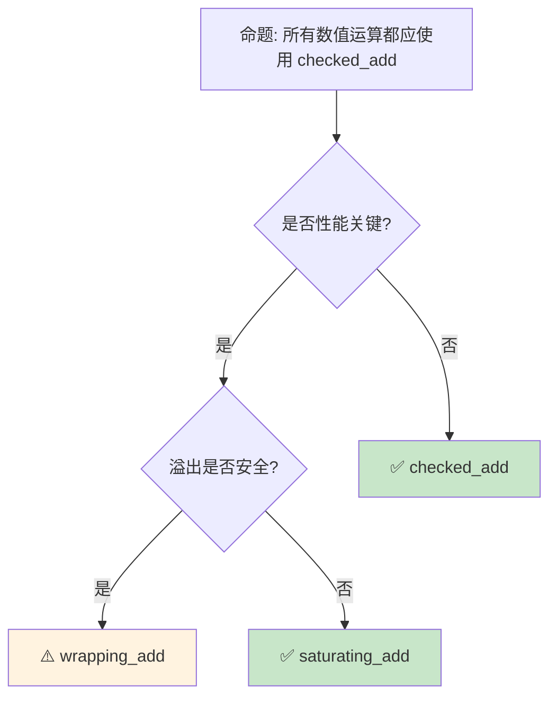

> **内容分级**: [综述级]
>
> **Rust 版本**: 1.96.1+ (Edition 2024)
> **本节关键术语**:
>
> 数值类型 (Numeric Types) · 整数类型 (Integer) · 浮点类型 (Float) · 有符号 (Signed) · 无符号 (Unsigned) ·
> 整数溢出 (Integer Overflow) · 浮点数 (Floating Point) · 类型转换 (Type Conversion) · 类型推断 (Type Inference) · 字面值后缀 (Literal Suffix)
> — [完整对照表](../../00_meta/01_terminology/terminology_glossary.md)
>

# 数值类型与运算：从整数到浮点的完整图景
>
> **EN**: Numerics
> **Summary**: Numerics: core Rust concepts, syntax, and examples.
> **受众**: [初学者]
> **Bloom 层级**: 记忆 → 理解
> **定位**: 系统讲解 Rust **数值类型**——从整数、浮点、饱和运算到类型转换和溢出行为，揭示 Rust 如何在安全性与性能之间做出精确的设计选择。
> **前置概念**: [Type System](04_type_system.md) · [Ownership](../01_ownership_borrow_lifetime/01_ownership.md)
> **后置概念**: [Zero Cost Abstractions](../00_start/06_zero_cost_abstractions.md) · [Collections](../05_collections/08_collections.md)

---

> **来源**: [Rust Reference — Types](https://doc.rust-lang.org/reference/types.html) · · [Pierce — Types and Programming Languages](https://www.cis.upenn.edu/~bcpierce/tapl/) · [System F](https://en.wikipedia.org/wiki/System_F) · [Oxide: The Essence of Rust](https://arxiv.org/abs/1903.00982)
> [TRPL — Data Types](https://doc.rust-lang.org/book/ch03-02-data-types.html) ·
> [std::num](https://doc.rust-lang.org/std/num/) ·
> [RFC 0560 — Integer Overflow](https://github.com/rust-lang/rfcs/blob/master/text/0560-integer-overflow.md) ·
> [IEEE 754](https://en.wikipedia.org/wiki/IEEE_754)

## 📑 目录

- [数值类型与运算：从整数到浮点的完整图景](#数值类型与运算从整数到浮点的完整图景)
  - [📑 目录](#-目录)
  - [一、核心概念](#一核心概念)
    - [1.1 整数类型全景](#11-整数类型全景)
    - [1.2 浮点类型与 IEEE 754](#12-浮点类型与-ieee-754)
    - [1.3 溢出行为与饱和运算](#13-溢出行为与饱和运算)
  - [二、技术细节](#二技术细节)
    - [2.1 类型转换与 as](#21-类型转换与-as)
    - [2.2 Wrapping、Saturating、Checked、Overflowing](#22-wrappingsaturatingcheckedoverflowing)
    - [2.3 NonZero 类型与优化](#23-nonzero-类型与优化)
    - [2.4 SIMD 与向量化](#24-simd-与向量化)
  - [三、数值类型矩阵](#三数值类型矩阵)
  - [四、反命题与边界分析](#四反命题与边界分析)
    - [4.1 反命题树](#41-反命题树)
    - [4.2 边界极限](#42-边界极限)
  - [五、常见陷阱](#五常见陷阱)
  - [六、来源与延伸阅读](#六来源与延伸阅读)
  - [相关概念文件](#相关概念文件)
  - [权威来源索引](#权威来源索引)
  - [十二、边界测试：数值类型的编译错误](#十二边界测试数值类型的编译错误)
    - [12.1 边界测试：整数溢出在 Debug 与 Release 中的差异（运行时行为）](#121-边界测试整数溢出在-debug-与-release-中的差异运行时行为)
    - [12.2 边界测试：浮点数相等比较（逻辑错误）](#122-边界测试浮点数相等比较逻辑错误)
    - [12.3 边界测试：`as` 转换的截断风险（编译错误）](#123-边界测试as-转换的截断风险编译错误)
    - [12.4 边界测试：浮点数作为 `match` 条件（编译错误）](#124-边界测试浮点数作为-match-条件编译错误)
    - [12.5 边界测试：`as` 转换的截断与符号变化（逻辑错误）](#125-边界测试as-转换的截断与符号变化逻辑错误)
    - [12.6 边界测试：浮点数的 `NaN` 比较（逻辑错误）](#126-边界测试浮点数的-nan-比较逻辑错误)
    - [12.7 边界测试：`as` 截断与 `From` 语义差异（编译错误）](#127-边界测试as-截断与-from-语义差异编译错误)
    - [12.8 边界测试：`usize`/`isize` 平台相关大小（编译错误）](#128-边界测试usizeisize-平台相关大小编译错误)
    - [12.9 边界测试：位运算与逻辑运算混用（编译错误）](#129-边界测试位运算与逻辑运算混用编译错误)
    - [12.10 边界测试：`Wrapping<T>` 与 `T` 的混用陷阱（编译错误）](#1210-边界测试wrappingt-与-t-的混用陷阱编译错误)
  - [实践](#实践)
  - [认知路径](#认知路径)
    - [核心推理链](#核心推理链)
    - [反命题与边界](#反命题与边界)
  - [嵌入式测验](#嵌入式测验)
    - [测验 1：整数溢出行为（记忆层）](#测验-1整数溢出行为记忆层)
    - [测验 2：`as` 与 `TryFrom` 的区别（理解层）](#测验-2as-与-tryfrom-的区别理解层)
    - [测验 3：NonZero 类型优化（应用层）](#测验-3nonzero-类型优化应用层)
    - [测验 4：浮点数陷阱（分析层）](#测验-4浮点数陷阱分析层)
    - [测验 5：`usize` 的平台相关性与跨平台风险（理解层）](#测验-5usize-的平台相关性与跨平台风险理解层)

---

## 一、核心概念

### 1.1 整数类型全景

```text
Rust 整数类型:

  有符号整数:
  ┌──────────┬────────────┬──────────────────────────────┐
  │ 类型      │ 大小       │ 范围                         │
  ├──────────┼────────────┼──────────────────────────────┤
  │ i8       │ 1 字节     │ -128 ~ 127                   │
  │ i16      │ 2 字节     │ -32,768 ~ 32,767             │
  │ i32      │ 4 字节     │ -2.1e9 ~ 2.1e9               │
  │ i64      │ 8 字节     │ -9.2e18 ~ 9.2e18             │
  │ i128     │ 16 字节    │ -1.7e38 ~ 1.7e38             │
  │ isize    │ 指针大小   │ -2^(N-1) ~ 2^(N-1)-1         │
  └──────────┴────────────┴──────────────────────────────┘
> [来源: [TRPL](https://doc.rust-lang.org/book/ch03-02-data-types.html)]

  无符号整数:
  ┌──────────┬────────────┬──────────────────────────────┐
  │ 类型      │ 大小       │ 范围                         │
  ├──────────┼────────────┼──────────────────────────────┤
  │ u8       │ 1 字节     │ 0 ~ 255                      │
  │ u16      │ 2 字节     │ 0 ~ 65,535                   │
  │ u32      │ 4 字节     │ 0 ~ 4.3e9                    │
  │ u64      │ 8 字节     │ 0 ~ 1.8e19                   │
  │ u128     │ 16 字节    │ 0 ~ 3.4e38                   │
  │ usize    │ 指针大小    │ 0 ~ 2^N-1                    │
  └──────────┴────────────┴──────────────────────────────┘

  字面量表示:
  ├── 十进制: 98_222（下划线分隔可读性）
  ├── 十六进制: 0xff
  ├── 八进制: 0o77
  ├── 二进制: 0b1111_0000
  └── 类型后缀: 57u8, 0x1f_i64

  默认类型:
  └── 未标注类型的整数默认 i32
      // let x = 5;  // 类型: i32
```

> **认知功能**: Rust 的**显式整数类型**（无默认"int"）是类型安全的设计选择——它迫使开发者考虑数值的范围和符号，防止隐式截断。
> [来源: [Rust Reference — Integer Types](https://doc.rust-lang.org/reference/types/numeric.html#integer-types)]

---

### 1.2 浮点类型与 IEEE 754
>

```text
Rust 浮点类型 (IEEE 754 标准):

  ┌──────────┬────────────┬─────────────────────────────────┐
  │ 类型      │ 大小       │ 精度                            │
  ├──────────┼────────────┼─────────────────────────────────┤
  │ f32      │ 4 字节     │ ~7 位十进制数                    │
  │ f64      │ 8 字节     │ ~15 位十进制数                   │
  └──────────┴────────────┴─────────────────────────────────┘

  默认类型: f64（现代 64 位 CPU 上 f64 与 f32 速度相同）

  特殊值:
  ├── NaN (Not a Number): f64::NAN
  ├── 正无穷: f64::INFINITY
  ├── 负无穷: f64::NEG_INFINITY
  └── 正负零: +0.0, -0.0（不同位模式）

  注意事项:
  ├── 浮点比较: a == b 通常不可靠
  │   └── 应使用 (a - b).abs() < epsilon
  ├── 无总序: NaN != NaN
  │   └── 使用 total_cmp() 获得总序
  └── 精度损失: 0.1 + 0.2 != 0.3

  字面量:
  ├── 3.14, -2.5
  ├── 科学计数法: 1.2e5
  └── 必须有小数点或指数: 5f64, 5.0
```

> **浮点洞察**: Rust 的 `f64` 默认选择反映了**"安全优先"**的设计哲学——在大多数平台上 f64 不比 f32 慢，但精度翻倍。
> [来源: [IEEE 754 Wikipedia](https://en.wikipedia.org/wiki/IEEE_754)]

---

### 1.3 溢出行为与饱和运算
>

```rust
// 整数溢出行为（release vs debug）

// Debug 模式: 溢出 panic!
let x: u8 = 255;
// let y = x + 1;  // debug: panic!，release: wrapping

// 显式控制溢出行为:
use std::num::Wrapping;

let x = Wrapping(255u8);
let y = x + Wrapping(1);  // Wrapping(0)，不 panic

// 四种溢出处理方法:
let a: u8 = 200;
let b: u8 = 100;

// 1. wrapping: 回绕（模运算）
a.wrapping_add(b);  // 44 (300 % 256)

// 2. saturating: 饱和（限制在范围内）
a.saturating_add(b);  // 255 (u8::MAX)

// 3. checked: 返回 Option
a.checked_add(b);  // None（溢出时）

// 4. overflowing: 返回 (值, 是否溢出)
a.overflowing_add(b);  // (44, true)

// 使用场景:
// - wrapping: 位运算、哈希、游戏循环计数器
// - saturating: 图像处理、音频、保证不溢出
// - checked: 算术运算，溢出时优雅处理
// - overflowing: 多精度算术、进位传播
```

> **溢出洞察**: Rust 的**显式溢出方法**将 C/C++ 的"未定义行为"转化为**明确的选择**——开发者必须显式选择溢出语义。
> [来源: [RFC 0560 — Integer Overflow](https://github.com/rust-lang/rfcs/blob/master/text/0560-integer-overflow.md)]

---

## 二、技术细节

### 2.1 类型转换与 as
>

```rust,ignore
// Rust 的显式类型转换

// as: 可能截断的转换
let a: i32 = 300;
let b: i8 = a as i8;  // 44 (截断)

let c: f64 = 3.7;
let d: i32 = c as i32;  // 3 (截断小数)

// as 的转换矩阵:
┌─────────────────────────────────────────────────────┐
│ 从 \ 到  │ i8~i128 │ u8~u128 │ f32 │ f64 │ bool │ char │
├─────────────────────────────────────────────────────┤
│ i8~i128  │ ✅      │ ✅      │ ✅  │ ✅  │ ✅   │ ⚠️   │
│ u8~u128  │ ✅      │ ✅      │ ✅  │ ✅  │ ✅   │ ⚠️   │
│ f32, f64 │ ✅(截断)│ ✅(截断)│ ✅  │ ✅  │ ❌   │ ❌   │
│ bool     │ ✅      │ ✅      │ ✅  │ ✅  │ -    │ ❌   │
│ char     │ ✅      │ ✅      │ ✅  │ ✅  │ ❌   │ -    │
└─────────────────────────────────────────────────────┘

// From/Into: 安全、无截断的转换
let a: i32 = 42;
let b: i64 = a.into();  // ✅ 自动推导目标类型

let c: u32 = 42;
// let d: i32 = c.into();  // ❌ 编译错误！可能溢出

// TryFrom/TryInto: 可能失败的转换
use std::convert::TryInto;
let e: i64 = 300;
let f: i8 = e.try_into()?;  // Err(Overflow)!

// 最佳实践:
// - 窄化转换（可能丢失数据）: 使用 try_into() 或 checked
// - 拓宽转换（安全）: 使用 into()
// - 位模式转换: 使用 as
```

> **转换洞察**: Rust 的**显式转换**（`as`、`From`、`TryFrom`）消除了 C/C++ 的**隐式类型转换陷阱**。
> [来源: [std::convert](https://doc.rust-lang.org/std/convert/index.html)]

---

### 2.2 Wrapping、Saturating、Checked、Overflowing
>

```rust,ignore
// 四种溢出处理方法的对比

use std::num::{Wrapping, Saturating};

// Wrapping 类型（代数包装）
let a = Wrapping(250u8);
let b = Wrapping(10u8);
assert_eq!((a + b).0, 4);  // (250 + 10) % 256 = 4

// Saturating 类型（边界限制）
let c = Saturating(250u8);
let d = Saturating(10u8);
assert_eq!((c + d).0, 255);  // 饱和到 u8::MAX

// Checked 方法（返回 Option）
let e: u8 = 250;
assert_eq!(e.checked_add(10), None);
assert_eq!(e.checked_add(5), Some(255));

// Overflowing 方法（返回进位）
let f: u8 = 250;
let (result, overflowed) = f.overflowing_add(10);
assert_eq!(result, 4);
assert!(overflowed);

// 何时使用:
┌────────────────┬────────────────────────────────────────┐
│ 方法           │ 使用场景                               │
├────────────────┼────────────────────────────────────────┤
│ wrapping_add   │ 位运算、哈希、计数器回绕               │
│ saturating_add │ 图像/音频处理、保证不 panic            │
│ checked_add    │ 通用算术、安全敏感代码                 │
│ overflowing_add│ 多精度算术、进位传播                   │
└────────────────┴────────────────────────────────────────┘
```

> **方法洞察**: 四种方法覆盖了**所有合理的溢出语义**——从数学正确性（checked）到性能（wrapping）到安全性（saturating）。
> [来源: [std::num::Wrapping](https://doc.rust-lang.org/std/num/struct.Wrapping.html)]

---

### 2.3 NonZero 类型与优化
>

```rust
use std::num::{NonZeroU32, NonZeroU64};

// NonZero 类型: 保证值不为零
let size = NonZeroU32::new(1024).unwrap();
// let bad = NonZeroU32::new(0);  // 返回 None

// 核心价值:  niche value optimization
// Option<NonZeroU32> 只需 4 字节（不是 8 字节）
// 因为 0 被用作 None 的表示

// 内存布局对比:
// Option<u32>:     tag (4/8 bytes) + u32 (4 bytes) = 8/12 bytes
// Option<NonZeroU32>: 直接使用 0 表示 None = 4 bytes

// 使用场景:
// - 大小/长度（通常不为 0）
// - 指针（NonNull<T>）
// - 持续时间、容量

// 与指针优化的关系:
// Option<&T>: 使用 null 指针表示 None（同为 niche optimization）
// Option<NonNull<T>>: 双重优化
```

> **NonZero 洞察**: `NonZero` 类型是 Rust **类型系统（Type System）与优化**结合的经典案例——编译器利用**niche value**（零）压缩 `Option<T>` 的表示。
> [来源: [std::num::NonZeroU32](https://doc.rust-lang.org/std/num/type.NonZeroU32.html)]

---

### 2.4 SIMD 与向量化

```text
SIMD (Single Instruction Multiple Data):

  std::simd (nightly / Rust 1.64+ 实验):
  ├── 向量类型: f32x4, i32x8
  ├── 并行操作: +, -, *, /
  ├── 掩码操作: 条件选择
  └── 对齐加载/存储

  代码示例:

  use std::simd::*;

  let a = f32x4::from_array([1.0, 2.0, 3.0, 4.0]);
  let b = f32x4::from_array([5.0, 6.0, 7.0, 8.0]);
  let c = a + b; // [6.0, 8.0, 10.0, 12.0]

  第三方 crate:
  ├── packed_simd: 稳定版替代
  ├── wide: 跨平台 SIMD
  └── simdeez: 运行时选择 SIMD 宽度

  注意:
  ├── 需要平台支持
  ├── 对齐要求
  └── 边界处理
```

> **SIMD 洞察**: **SIMD 是数值计算性能的最后防线**——向量化可将吞吐量提升 4-16 倍。
> [来源: [std::simd](https://doc.rust-lang.org/std/simd/index.html)]

---

## 三、数值类型矩阵

```text
数值类型选择指南:

  计数/索引:
  ├── 数组索引: usize（平台指针大小）
  ├── 集合大小: usize
  └── 循环计数: i32/i64（视范围而定）

  文件/网络:
  ├── 文件大小: u64（大文件支持）
  ├── 偏移量: u64 或 i64
  └── 协议字段: 根据协议规范精确类型

  科学计算:
  ├── 一般计算: f64（默认精度）
  ├── GPU/图形: f32（内存带宽）
  └── 高精度: 使用 decimal/rug crate

  嵌入式:
  ├── 寄存器: u8/u16/u32（匹配硬件位宽）
  ├── 标志位: u8（位运算）
  └── 传感器值: i16/i32（ADC 分辨率）

  财务:
  ├── ❌ 不使用浮点！
  ├── ✅ 使用整数（分/厘为单位）
  └── 或使用 rust_decimal 等库
```

> **类型选择**: Rust 的**精确数值类型**迫使开发者思考数值的真实语义——这是避免整数溢出和精度错误的**第一道防线**。
> [来源: [Rust API Guidelines — Type Safety](https://rust-lang.github.io/api-guidelines//type-safety.html)]

---

## 四、反命题与边界分析

### 4.1 反命题树
>



> **认知功能**: 数值运算方法的选择是一个**三元权衡**——性能（wrapping）、安全（checked）、可用性（saturating）。

---

### 4.2 边界极限
>

```text
边界 1: 浮点精度
├── f32 只有 ~7 位十进制精度
├── f64 只有 ~15 位十进制精度
├── 财务计算绝对不能用浮点
└── 需要精确十进制: 使用 rust_decimal 或 bigdecimal

边界 2: 整数除法
├── Rust 整数除法向零截断（不是向下取整）
├── -5 / 2 = -2（不是 -3）
├── 与 Python 的 // 不同
└── 需要向下取整: 使用 .div_euclid()

边界 3: 移位操作的位数
├── 1u32 << 32 在 debug 模式 panic
├── 在 release 模式 wrapping（位数模运算）
├── 与 C 的未定义行为不同
└── Rust 明确定义为 wrapping

边界 4: char 到整数的转换
├── 'A' as u8 = 65（ASCII）
├── '中' as u8 截断为低位
├── 非 ASCII 字符用 as 会丢失信息
└── 使用 encode_utf8() 获取 UTF-8 字节

边界 5: usize/isize 的平台依赖
├── 32 位平台: 4 字节
├── 64 位平台: 8 字节
├── 序列化到文件时大小不固定
└── 使用 u64/i64 进行跨平台数据交换

边界 6: 常量求值
├── const fn 中浮点比较可能不稳定
├── 编译期计算对数值操作有额外限制
└── 缓解: 避免 const 上下文中的浮点相等比较

边界 7: 性能开销
├── checked_* 运算在 Debug/Release 均引入分支开销
├── wrapping_* 通常映射为普通机器指令，接近零额外开销
└── 缓解: 在 Release 模式结合显式方法选择

边界 8: FFI 映射
├── C 的 int/long 到 Rust 的映射随平台变化
├── 应避免在 FFI 边界依赖 C 的“基本整型”
└── 缓解: 使用 libc crate 的明确类型（如 c_int、c_long）
```

> **边界要点**: 数值运算的边界主要与**浮点精度**、**整数除法语义**、**移位位数**、**char 转换**、**平台依赖**、**常量求值**、**性能开销**和**FFI 映射**相关。
> [来源: [Rust Reference — Operator Expressions](https://doc.rust-lang.org/reference/expressions/operator-expr.html)] · [Rust Performance Book](https://nnethercote.github.io/perf-book/)

---

## 五、常见陷阱

```text
陷阱 1: 隐式截断
  ❌ let x: u8 = 256;  // 编译错误（字面量溢出）
  ✅ let x: u8 = 255;   // 正确

陷阱 2: as 的隐式截断
  ❌ let x: i32 = -1;
     let y: u32 = x as u32;  // 4294967295！
  ✅ 窄化转换使用 try_into()
     let y: u32 = x.try_into()?;

陷阱 3: 浮点比较
  ❌ if x == 0.1 { ... }  // 不可靠
  ✅ if (x - 0.1).abs() < f64::EPSILON { ... }

陷阱 4: 忘记 checked 在算术运算中
  ❌ let sum = a + b;  // debug 可能 panic
  ✅ let sum = a.checked_add(b)?;

陷阱 5: usize 与 u32 混淆
  ❌ fn process(data: &[u8], index: u32) { data[index]; }
     // 可能越界（u32 > usize 在 32 位平台）
  ✅ fn process(data: &[u8], index: usize) { data[index]; }

陷阱 6: 除以零
  ❌ let x = 1 / 0;  // panic！
  ✅ let x = 1.checked_div(0);  // None

陷阱 7: 位运算与逻辑运算优先级混淆
  ❌ if x & 1 == 0 { ... }  // 实际为 x & (1 == 0)
  ✅ if (x & 1) == 0 { ... }
```

> **陷阱总结**: 数值陷阱主要与**截断**、**类型转换**、**浮点比较**、**溢出**、**索引类型**、**除零**和**位运算优先级**相关。
> [来源: [Rust Reference — Numeric Types](https://doc.rust-lang.org/reference/types/numeric.html)]

---

## 六、来源与延伸阅读

| 来源 | 可信度 | 说明 |
|:---|:---:|:---|
| [Rust Reference — Numeric Types](https://doc.rust-lang.org/reference/types/numeric.html) | ✅ 一级 | 数值类型参考 |
| [TRPL — Data Types](https://doc.rust-lang.org/book/ch03-02-data-types.html) | ✅ 一级 | 基础教程 |
| [RFC 0560 — Integer Overflow](https://github.com/rust-lang/rfcs/blob/master/text/0560-integer-overflow.md) | ✅ 一级 | 溢出行为 RFC |
| [std::num](https://doc.rust-lang.org/std/num/) | ✅ 一级 | 数值模块（Module） |
| [IEEE 754](https://en.wikipedia.org/wiki/IEEE_754) | ✅ 一级 | 浮点标准 |
| [Rust Performance Book](https://nnethercote.github.io/perf-book/) | ✅ 二级 | 性能与类型尺寸优化 |

---

## 相关概念文件

- [Type System](04_type_system.md) — 类型系统（Type System）
- [Zero Cost Abstractions](../00_start/06_zero_cost_abstractions.md) — 零成本抽象（Zero-Cost Abstraction）
- [Collections](../05_collections/08_collections.md) — 集合类型
- [Performance](../../06_ecosystem/10_performance/15_performance_optimization.md) — 性能优化
- [Error Handling](../../02_intermediate/03_error_handling/04_error_handling.md) — 错误处理（Error Handling）

---

> **权威来源**: [Rust Reference](https://doc.rust-lang.org/reference/introduction.html), [The Rust Programming Language](https://doc.rust-lang.org/book/ch03-02-data-types.html)
>
> **权威来源对齐变更日志**: 2026-05-22 创建 [Authority Source Sprint Batch 9](../../00_meta/02_sources/international_authority_index.md)

**文档版本**: 1.0
**对应 Rust 版本**: 1.96.1+ (Edition 2024)
**最后更新**: 2026-05-22
**状态**: ✅ 概念文件创建完成

---

## 权威来源索引

>
>
>

---

---

---

> **补充来源**

## 十二、边界测试：数值类型的编译错误

### 12.1 边界测试：整数溢出在 Debug 与 Release 中的差异（运行时行为）

```rust
fn main() {
    let mut x: u8 = 255;
    // Debug 模式: panic! (算术溢出检查开启)
    // Release 模式: 环绕为 0 (two's complement wrapping)
    // x = x + 1; // 行为取决于编译配置

    // 正确: 显式选择溢出行为
    let y = x.wrapping_add(1); // 总是环绕: 255 + 1 = 0
    let z = x.saturating_add(1); // 饱和: 255 + 1 = 255
    let w = x.checked_add(1); // 返回 Option: None
    println!("y={} z={} w={:?}", y, z, w);
}
```

> **修正**: Rust 整数溢出在 Debug 模式 panic（安全检查），在 Release 模式静默环绕（性能优化）。
> 这不同于 C/C++ 的未定义行为——Rust 明确定义了环绕语义，只是默认在 Debug 时 panic。
> 生产代码应使用显式方法（`wrapping_*`、`saturating_*`、`checked_*`、`overflowing_*`）表达意图，避免依赖编译模式。
> 这与 Swift 的默认溢出 panic（所有模式）和 C 的未定义行为形成对比。
> [来源: [Rust Reference](https://doc.rust-lang.org/reference/introduction.html)]

### 12.2 边界测试：浮点数相等比较（逻辑错误）

```rust
fn main() {
    let a: f64 = 0.1 + 0.2;
    let b: f64 = 0.3;
    // ⚠️ 逻辑错误: 直接比较浮点数
    if a == b {
        println!("equal"); // 可能不执行！
    }
    println!("a={:.20}, b={:.20}", a, b);
    // 输出: a=0.30000000000000004441, b=0.29999999999999998890
}

// 正确: 使用 epsilon 比较
fn approx_eq(a: f64, b: f64, epsilon: f64) -> bool {
    (a - b).abs() < epsilon // 近似相等
}
```

> **修正**: 浮点数（IEEE 754）不能进行精确相等比较，因为二进制表示无法精确表达大多数十进制小数。
> Rust 编译器会警告 `a == b`（clippy::float_cmp），但不阻止编译。
> 正确做法是比较差值是否小于某个 epsilon。对于财务计算，考虑使用 `rust_decimal` 或 `bigdecimal` 库避免浮点误差。
> [来源: [Rust Reference](https://doc.rust-lang.org/reference/introduction.html)]

### 12.3 边界测试：`as` 转换的截断风险（编译错误）

```rust,compile_fail
fn main() {
    let x: i32 = 300;
    // ❌ 编译错误: expected `i8`, found `i32`
    // Rust 禁止隐式类型转换
    let y: i8 = x;
}

// 正确: 显式转换（但注意截断）
fn fixed() {
    let x: i32 = 300;
    let y = x as i8; // ✅ 显式 cast，但 300 → 44（截断）
    println!("{}", y);
}
```

> **修正**: Rust 禁止隐式整数转换，即使是缩小范围（`i32` → `i8`）也需要 `as` 关键字。`as` 执行截断转换（truncating cast），高位丢弃。
> 如需安全检查，使用 `TryInto::try_into()`（返回 `Result`）。
> 这与 C 的隐式转换（`int` → `char` 静默截断）形成对比——Rust 的显式性消除了意外截断 bug。
> [来源: [Rust Reference](https://doc.rust-lang.org/reference/introduction.html)]

### 12.4 边界测试：浮点数作为 `match` 条件（编译错误）

```rust,ignore
fn main() {
    let x: f64 = 0.1 + 0.2;
    // ❌ 编译错误: floating-point types cannot be used in patterns
    // match x {
    //     0.3 => println!("exact"),
    //     _ => println!("other"),
    // }
}

// 正确: 使用范围比较
fn fixed() {
    let x: f64 = 0.1 + 0.2;
    if (x - 0.3).abs() < 1e-10 {
        println!("approximate");
    }
}
```

> **修正**: Rust 的 `match` 要求模式是**精确匹配**的，浮点数因精度问题不能用于模式。
> `0.1 + 0.2 != 0.3` 在二进制浮点中是事实，因此 `match 0.3` 可能永远不会匹配。
> 编译器直接拒绝浮点模式，强制开发者使用 epsilon 比较或区间检查。
> 这与 C 的 `switch`（不支持浮点）类似，但 Rust 的错误信息更明确——指出浮点模式的语义问题。
> [来源: [Rust Reference](https://doc.rust-lang.org/reference/introduction.html)]

### 12.5 边界测试：`as` 转换的截断与符号变化（逻辑错误）

```rust,ignore
fn main() {
    let x: i32 = -1;
    let y = x as u32; // 4294967295
    // ⚠️ 逻辑错误: 有符号转无符号，值 reinterpret 而非报错
    println!("{}", y);

    let big: i32 = 300;
    let small = big as i8; // 44
    // ⚠️ 逻辑错误: 大转小，截断低 8 位，无警告
    println!("{}", small);
}
```

> **修正**: Rust 的 `as` 关键字执行**截断/扩展转换**（truncating/widening cast），不检查值是否在目标类型范围内。
> `i32 → u32` 是位的重新解释（two's complement），`i32 → i8` 截断低 8 位。
> 这些转换永不 panic，但可能产生意外结果。
> 安全替代：
>
> 1) `try_into()`（返回 `Result`，值越界时 `Err`）；
> 2) `checked_cast`（不稳定）；
> 3) 显式范围检查。
> Rust 的设计哲学：`as` 是"我知道我在做什么"的低级操作，需要开发者负责正确性。
> 这与 C 的 `(type)value`（相同行为，无替代）或 Swift 的 `Int8(big)`（运行时（Runtime）检查，失败 panic）不同——Rust 在性能和安全性间提供明确选择。
> [来源: [The Rust Programming Language](https://doc.rust-lang.org/book/ch03-02-data-types.html)] ·
> [来源: [Rust Standard Library](https://doc.rust-lang.org/std/convert/trait.TryInto.html)]

### 12.6 边界测试：浮点数的 `NaN` 比较（逻辑错误）

```rust,ignore
fn main() {
    let x: f64 = f64::NAN;
    // ❌ 逻辑错误: NaN 与任何值比较都返回 false，包括自身
    if x == f64::NAN {
        println!("is NaN"); // 永远不会执行
    }

    // 正确: 使用 is_nan()
    if x.is_nan() {
        println!("is NaN"); // ✅
    }
}
```

> **修正**: IEEE 754 规定 `NaN != NaN`，因此 `x == f64::NAN` 总是 `false`。
> 检测 `NaN` 必须使用 `is_nan()`。
> 这是浮点数的常见陷阱：排序、去重、哈希时 `NaN` 破坏常规假设。
> Rust 的 `HashMap` 和 `BTreeMap` 不直接支持 `f32`/`f64` 作为键，因为 `NaN` 使相等性不满足等价关系（反身性不成立）。
> `ordered_float` crate 通过将 `NaN` 映射到特定值解决此问题。
> 这与 C/C++ 的 `isnan()` 宏（Macro）、Python 的 `math.isnan()`、Java 的 `Double.isNaN()` 相同——所有遵循 IEEE 754 的语言都有此问题。
> Rust 的类型系统（Type System）不阻止 `NaN` 比较错误，但 `Hash` 限制防止 `NaN` 导致更严重的集合不一致。
> [来源: [IEEE 754 Standard](https://ieeexplore.ieee.org/document/8766229)] ·
> [来源: [Rust Standard Library](https://doc.rust-lang.org/std/primitive.f64.html)]

### 12.7 边界测试：`as` 截断与 `From` 语义差异（编译错误）

```rust,compile_fail
fn main() {
    let x: u32 = 1000;
    // ❌ 编译错误: `u8` 不能从 `u32` 通过 From 转换（可能截断）
    let y: u8 = u8::from(x);
    // 正确: 使用 `as` 显式截断 或 `try_into()` 安全检查
    // let y = x as u8;        // 截断为 232
    // let y: u8 = x.try_into().unwrap(); // 运行时 panic
}
```

> **修正**:
> Rust 的数值转换分三层：
>
> 1) `From`/`Into`——保证无损转换（`u8::from(5u8)` 合法，`u8::from(1000u32)` 不实现）；
> 2) `TryFrom`/`TryInto`——可能失败，返回 `Result`；
> 3) `as`——强制转换，可能截断/溢出/符号变化，编译期不检查。
> 设计意图：`From` 是"可信转换"，`as` 是"我清楚后果"。
> `u8::from(x)` 编译错误是因为 `From<u32>` 未为 `u8` 实现。
> 这与 C 的隐式截断（`int` → `char`，静默截断）或 Java 的强制类型转换（`(byte)1000` 截断）不同
> ——Rust 的类型系统（Type System）区分了"安全但可能失败"和"显式承担风险"两种语义。
> [来源: [Rust Standard Library](https://doc.rust-lang.org/std/convert/trait.From.html)] ·
> [来源: [The Rust Programming Language](https://doc.rust-lang.org/book/ch03-02-data-types.html)]

### 12.8 边界测试：`usize`/`isize` 平台相关大小（编译错误）

```rust,compile_fail
fn main() {
    let x: usize = 1_000_000_000_000;
    // usize 与 u64 即使同宽也是不同类型，需要显式 as 转换
    let y = x as u64;

    let arr = [0u8; 1_000_000_000_000]; // ❌ 编译错误: array size too large
}

// 正确: 使用 Vec 避免栈溢出
fn fixed() {
    let arr = vec![0u8; 1_000_000]; // ✅ 堆分配
    println!("len={}", arr.len());
}
```

> **修正**: `usize` 在 32 位平台是 32 位，64 位平台是 64 位。
> 依赖 `usize` 精确大小的代码不可移植；跨平台数据交换应使用固定大小的 `u32`/`u64`。
> 数组大小 `[T; N]` 中的 `N` 必须是 `usize`，超大数组在栈上分配会导致栈溢出。
> 对于动态或大数据，始终使用 `Vec<T>`（堆分配）。
> Rust 的数组大小限制是 `isize::MAX` 字节，但实际受栈大小限制。
> [来源: [Rust Reference](https://doc.rust-lang.org/reference/introduction.html)]

### 12.9 边界测试：位运算与逻辑运算混用（编译错误）

```rust,compile_fail
fn main() {
    let a = 0b1010;
    let b = 0b1100;
    // ❌ 编译错误: cannot apply binary operator `&&` to type `{integer}`
    // && 是逻辑与，要求 bool 操作数
    let c = a && b;
}

// 正确: 使用位运算符
fn fixed() {
    let a = 0b1010;
    let b = 0b1100;
    let c = a & b; // ✅ 位与: 0b1000
    println!("{:b}", c);
}
```

> **修正**: Rust 严格区分位运算（`&`、`|`、`^`、`!`）和逻辑运算（`&&`、`||`、`!`）。位运算作用于整数类型，逻辑运算作用于 `bool`。
> C/C++ 中 `&&` 和 `&` 在某些上下文可互换（非零即真），但 Rust 不允许。这消除了 C 语言中常见的 `if (flags & MASK)` 与 `if (flags && MASK)` 混淆错误。
> [来源: [Rust Reference](https://doc.rust-lang.org/reference/introduction.html)]

### 12.10 边界测试：`Wrapping<T>` 与 `T` 的混用陷阱（编译错误）

```rust,compile_fail
use std::num::Wrapping;

fn main() {
    let a = Wrapping(255u8);
    let b = 1u8;
    // ❌ 编译错误: Wrapping<u8> 与 u8 不能直接运算
    let c = a + b;
}
```

> **修正**: `Wrapping<T>` 是一个 newtype 包装器，提供**环绕算术**（wrapping arithmetic）：溢出时静默环绕（`255u8 + 1 = 0`）。
> 但它与原始类型 `T` 是不同的类型，不能直接混用运算。
> 正确：`Wrapping(255u8) + Wrapping(1u8)` 或 `a.0 + b`（解包后）。
> Rust 的整数默认使用 panic-on-overflow（debug 模式）或 wrapping（release 模式）。
> `Wrapping` 显式选择环绕语义，适用于哈希、密码学、游戏循环等场景。
> 这与 C 的"始终环绕"（UB 仅在 signed overflow）或 Swift 的"默认 panic"不同——Rust 显式区分了两种语义。
> [来源: [Rust Standard Library](https://doc.rust-lang.org/std/num/struct.Wrapping.html)] ·
> [来源: [RFC 0560 — Integer Overflow](https://github.com/rust-lang/rfcs/blob/master/text/0560-integer-overflow.md)]

## 实践

> **相关资源**:
>
> - [crates/ 示例代码](../crates) — 与本文概念对应的可编译示例
> - [exercises/ 练习](../exercises) — 动手编程挑战
> - [MVP 学习路径](../../00_meta/04_navigation/learning_mvp_path.md) — 从零到多线程 CLI 的 40 小时路径
>
> **建议**: 阅读完本概念文件后，打开对应 crate 的示例代码，尝试修改并运行。完成至少 1 道相关练习以巩固理解。

## 认知路径

> **认知路径**: 从 L0 基础概念出发，经由本节的 **数值类型与运算：从整数到浮点的完整图景** 核心原理，通向 L2 进阶模式与 L3 工程实践。

### 核心推理链

| 定理 | 前提 | 结论 | 置信度 |
|:---|:---|:---|:---|
| 数值类型与运算：从整数到浮点的完整图景 基础定义 ⟹ 正确用法 | 理解语法与语义 | 能写出符合惯用法的代码 | 高 |
| 数值类型与运算：从整数到浮点的完整图景 正确用法 ⟹ 常见陷阱 | 忽略边界条件 | 编译错误或运行时（Runtime） bug | 高 |
| 数值类型与运算：从整数到浮点的完整图景 常见陷阱 ⟹ 深度掌握 | 系统学习反模式 | 能进行代码审查与优化 | 高 |

> 算术安全 ⟸ 溢出检查 / Wrapping ⟸ 整数类型系统（Type System）
> 浮点一致性（Coherence） ⟸ IEEE 754 遵循 ⟸ f32/f64 语义
> **过渡**: 掌握 数值类型与运算：从整数到浮点的完整图景 的基础语法后，下一步需要理解其在类型系统（Type System）中的位置与与其他概念的交互关系。
> **过渡**: 在实践中应用 数值类型与运算：从整数到浮点的完整图景 时，务必关注边界条件与异常处理，这是从"能编译"到"能生产"的关键跃迁。
> **过渡**: 数值类型与运算：从整数到浮点的完整图景 的设计理念体现了 Rust 零成本抽象（Zero-Cost Abstraction）与安全保证的核心权衡，理解这一权衡有助于迁移到更高级的并发与形式化验证领域。

### 反命题与边界

> **反命题**: "数值类型与运算：从整数到浮点的完整图景 在所有场景下都是最佳选择" —— 错误。需要根据具体上下文权衡性能、可读性与安全性，某些场景下显式替代方案可能更优。

---

## 嵌入式测验

### 测验 1：整数溢出行为（记忆层）

**题目**: 在 Rust 中，`let x: u8 = 255; x + 1` 在不同编译模式下的行为是什么？

- A. Debug 和 Release 模式下都 panic
- B. Debug 模式下 panic，Release 模式下 wrapping（回绕为 0）
- C. Debug 模式下 wrapping，Release 模式下 panic
- D. 两种模式都静默 wrapping（与 C 相同）

<details>
<summary>✅ 答案与解析</summary>

**正确答案是 B**。

Rust 的整数溢出行为取决于编译模式：

- **Debug 模式**: 开启溢出检查，溢出时 `panic!`
- **Release 模式**: 不检查溢出，使用 two's complement wrapping（回绕）

这与 C/C++ 的未定义行为不同——Rust 明确定义了 wrapping 语义，只是 Debug 时额外安全检查。

**生产代码应使用显式方法**: `wrapping_add`、`saturating_add`、`checked_add` 或 `overflowing_add`，避免依赖编译模式。
</details>

---

### 测验 2：`as` 与 `TryFrom` 的区别（理解层）

**题目**: 以下代码的输出是什么？

```rust
fn main() {
    let a: i32 = -1;
    let b = a as u32;
    println!("b = {}", b);

    let c: i32 = 300;
    let d = c as i8;
    println!("d = {}", d);
}
```

- A. `b = -1`, `d = 300`
- B. `b = 4294967295`, `d = 44`
- C. 编译错误
- D. `b = 0`, `d = 44`

<details>
<summary>✅ 答案与解析</summary>

**正确答案是 B**。

Rust 的 `as` 执行**截断/重新解释转换**（truncating/reinterpreting cast）：

1. `i32 → u32`: 位的重新解释。`-1` 的 two's complement 表示全为 `1`， reinterpret 为 `u32` 得到 `4294967295`（`u32::MAX`）。
2. `i32 → i8`: 截断低 8 位。`300` 的二进制低 8 位是 `44`。

`as` 永远不会 panic，但可能产生意外结果。安全替代：

- `try_into()` 返回 `Result`，值越界时返回 `Err`
- `checked_add` 等系列方法进行安全算术运算

</details>

---

### 测验 3：NonZero 类型优化（应用层）

**题目**: 在 64 位平台上，`Option<NonZeroU32>` 占用多少字节？为什么？

- A. 8 字节（tag + 值）
- B. 4 字节（niche value optimization）
- C. 12 字节（对齐填充）
- D. 16 字节（与 `Option<u64>` 相同）

<details>
<summary>✅ 答案与解析</summary>

**正确答案是 B**。

`NonZeroU32` 保证值不为 0，编译器利用这个**niche value**（零值）来压缩 `Option<T>` 的表示：

- `0` 表示 `None`
- 非零值表示 `Some(value)`

因此 `Option<NonZeroU32>` 只需 4 字节（一个 `u32`），不需要额外的 tag。

同理：

- `Option<&T>` 使用 null 指针表示 `None`（也是 niche optimization）
- `Option<NonNull<T>>` 同样压缩为指针大小

这是 Rust **类型系统（Type System）与内存布局**结合的经典优化案例。
</details>

---

### 测验 4：浮点数陷阱（分析层）

**题目**: 以下代码的输出是什么？为什么？

```rust
fn main() {
    let x: f64 = f64::NAN;
    if x == f64::NAN {
        println!("equal");
    } else {
        println!("not equal");
    }

    if x.is_nan() {
        println!("is_nan");
    }
}
```

- A. `equal` → `is_nan`
- B. `not equal` → `is_nan`
- C. `equal` → （无输出）
- D. 编译错误

<details>
<summary>✅ 答案与解析</summary>

**正确答案是 B**。

根据 IEEE 754 标准，`NaN != NaN`——NaN 与任何值（包括自身）比较都返回 `false`。因此 `x == f64::NAN` 永远为 `false`，输出 `not equal`。

检测 NaN 必须使用 `is_nan()` 方法。

这也是 `HashMap` 和 `BTreeMap` 不支持 `f32`/`f64` 作为键的原因：`NaN` 破坏了等价关系（反身性不成立）。如需使用浮点作为键，可考虑 `ordered_float` crate。
</details>

---

### 测验 5：`usize` 的平台相关性与跨平台风险（理解层）

**题目**: `usize` 的大小由什么决定？在写跨平台代码时，将 `usize` 直接与固定大小的整数类型混用有什么风险？

- A. 由编译器版本决定；无风险
- B. 由目标平台指针宽度决定；在 32 位与 64 位平台间可能导致溢出或类型不匹配
- C. 固定为 8 字节；与 `u64` 完全等价
- D. 由 Cargo 特性决定；仅在嵌入式场景有风险

<details>
<summary>✅ 答案与解析</summary>

**正确答案是 B**。

`usize` 大小由目标平台指针宽度决定（32 位平台 4 字节，64 位平台 8 字节）。与 `u32`/`u64` 混用可能因平台不同导致溢出或类型不匹配。
</details>

---

> **测验设计来源**: [Bloom Taxonomy 2001] · [Brown University Interactive Rust Book — Quiz Design](https://rust-book.cs.brown.edu/) · [IEEE 754 Standard](https://ieeexplore.ieee.org/document/8766229)
