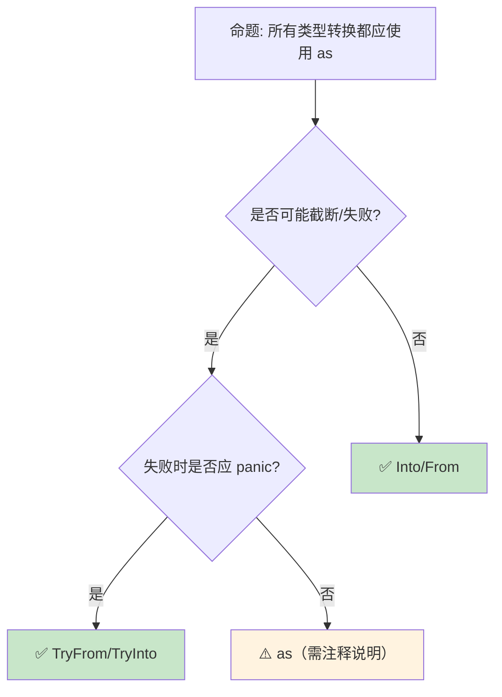

> **内容分级**: [综述级]
>
> **本节关键术语**: 强制转换 (Coercion) · 显式转换 (Casting) · as · Deref 强制转换 · 类型推断（Type Inference） — [完整对照表](../../00_meta/01_terminology/terminology_glossary.md)
>
# 类型强制与转换：显式与隐式的边界
>
> **EN**: Coercion and Casting
> **Summary**: Coercion and Casting: core Rust concepts, syntax, and examples.
> **受众**: [初学者]
> **Bloom 层级**: L2-L3
> **权威来源**: 本文件为 `concept/` 权威页。
> **A/S/P 标记**: **S** — Structure
> **双维定位**: C×Und — 理解类型转换和强制转换规则
> **定位**: 系统讲解 Rust **类型强制（coercion）**和**类型转换（casting）**——从 deref 强制、子类型强制到显式 `as` 转换，揭示 Rust 如何在安全与灵活性之间精确控制类型变换。
> **前置概念**: [Type System](04_type_system.md) · [Ownership](../01_ownership_borrow_lifetime/01_ownership.md) · [Traits](../../02_intermediate/00_traits/01_traits.md)
> **后置概念**: [FFI](../../03_advanced/04_ffi/05_rust_ffi.md) · [Generics](../../02_intermediate/01_generics/02_generics.md)

---

> **来源**: [Rust Reference — Type Coercions](https://doc.rust-lang.org/reference/type-coercions.html) · · [Pierce — Types and Programming Languages](https://www.cis.upenn.edu/~bcpierce/tapl/) · [System F](https://en.wikipedia.org/wiki/System_F) · [Brown University — Concepts in Rust Programming](https://cel.cs.brown.edu/crp/) · [Brown Interactive Rust Book](https://rust-book.cs.brown.edu/) · [Oxide: The Essence of Rust](https://arxiv.org/abs/1903.00982) · [Itanium C++ ABI](https://itanium-cxx-abi.github.io/cxx-abi/abi.html)
> [Rust Reference — Cast Expressions](https://doc.rust-lang.org/reference/expressions/operator-expr.html#cast-expressions) ·
> [TRPL — Data Types](https://doc.rust-lang.org/book/ch03-02-data-types.html) ·
> [RFC 0401 — Coercions](https://rust-lang.github.io/rfcs//0401-coercions.html) ·
> [Wikipedia — Type Conversion](https://en.wikipedia.org/wiki/Type_conversion)

## 📑 目录

- [类型强制与转换：显式与隐式的边界](#类型强制与转换显式与隐式的边界)
  - [📑 目录](#-目录)
  - [一、核心概念](#一核心概念)
    - [1.1 强制（Coercion）与转换（Cast）的区别](#11-强制coercion与转换cast的区别)
    - [1.2 Deref 强制](#12-deref-强制)
    - [1.3 子类型强制](#13-子类型强制)
  - [二、技术细节](#二技术细节)
    - [2.1 as 转换的完整矩阵](#21-as-转换的完整矩阵)
    - [2.2 From/Into 与 TryFrom/TryInto](#22-frominto-与-tryfromtryinto)
    - [2.3 指针转换](#23-指针转换)
  - [三、转换模式矩阵](#三转换模式矩阵)
  - [四、反命题与边界分析](#四反命题与边界分析)
    - [4.1 反命题树](#41-反命题树)
    - [4.2 边界极限](#42-边界极限)
  - [五、常见陷阱](#五常见陷阱)
  - [六、来源与延伸阅读](#六来源与延伸阅读)
  - [相关概念文件](#相关概念文件)
  - [权威来源索引](#权威来源索引)
  - [十、边界测试：类型转换的编译错误](#十边界测试类型转换的编译错误)
    - [10.1 边界测试：不安全的 `as` 转换导致截断（运行时错误）](#101-边界测试不安全的-as-转换导致截断运行时错误)
    - [10.2 边界测试：裸指针与引用转换的生命周期丢失（编译错误 / 运行时 UB）](#102-边界测试裸指针与引用转换的生命周期丢失编译错误--运行时-ub)
    - [10.3 边界测试： trait 对象强制转换的 `Sized` 约束（编译错误）](#103-边界测试-trait-对象强制转换的-sized-约束编译错误)
    - [10.4 边界测试：`as` 关键字的转换限制（编译错误）](#104-边界测试as-关键字的转换限制编译错误)
    - [10.5 边界测试：`dyn Trait` 到 `dyn Trait` 的跨 trait upcasting（1.86+ 已支持）](#105-边界测试dyn-trait-到-dyn-trait-的跨-trait-upcasting186-已支持)
    - [10.5 边界测试：强制类型转换与 `Deref` 的自动解引用（编译错误）](#105-边界测试强制类型转换与-deref-的自动解引用编译错误)
    - [10.6 边界测试：函数指针到闭包的类型不兼容（编译错误）](#106-边界测试函数指针到闭包的类型不兼容编译错误)
    - [10.8 边界测试：const fn 中的非编译期操作](#108-边界测试const-fn-中的非编译期操作)
  - [实践](#实践)
  - [嵌入式测验（Embedded Quiz）](#嵌入式测验embedded-quiz)
    - [测验 1：Deref 强制转换（理解层）](#测验-1deref-强制转换理解层)
    - [测验 2：`as` 与 `TryFrom`（应用层）](#测验-2as-与-tryfrom应用层)
    - [测验 3：From/Into 的孤儿规则（分析层）](#测验-3frominto-的孤儿规则分析层)
    - [测验 4：指针转换的安全性（分析层）](#测验-4指针转换的安全性分析层)
    - [测验 5：强制 vs 转换的选择（评价层）](#测验-5强制-vs-转换的选择评价层)
  - [认知路径](#认知路径)
    - [核心推理链](#核心推理链)
    - [反命题与边界](#反命题与边界)
  - [Rust 1.97.0 交叉语义](#rust-1970-交叉语义)
    - [1. 这是一处“收窄”，不是 coercion 规则的普遍改动](#1-这是一处收窄不是-coercion-规则的普遍改动)
    - [2. 与 coercion 分类的关系：这是“隐式、安全”那类的收窄](#2-与-coercion-分类的关系这是隐式安全那类的收窄)
    - [3. 为什么“收窄”而不是“换种写法”：健全性](#3-为什么收窄而不是换种写法健全性)

---

## 一、核心概念

### 1.1 强制（Coercion）与转换（Cast）的区别

```text
Rust 中的类型变换:

  强制（Coercion）: 隐式、安全
  ├── 编译器自动执行
  ├── 无运行时开销
  ├── 不会丢失信息
  └── 发生在特定位置（函数参数、赋值等）

  转换（Cast）: 显式、可能截断
  ├── 使用 as 关键字
  ├── 可能丢失信息
  ├── 运行时无检查（与 try_into 不同）
  └── 开发者承担责任

  转换（Conversion）: 显式、安全
  ├── 使用 Into/From trait
  ├── 不会丢失信息
  ├── 类型系统保证安全
  └── 可能失败时使用 TryFrom/TryInto

  对比:
  ┌─────────────────┬─────────────────┬─────────────────┬─────────────────┐
  │ 特性            │ Coercion        │ as Cast         │ Into/From       │
  ├─────────────────┼─────────────────┼─────────────────┼─────────────────┤
  │ 语法            │ 隐式            │ as              │ .into()         │
  │ 安全            │ ✅ 总是安全      │ ⚠️ 可能截断     │ ✅ 总是安全      │
  │ 信息丢失        │ ❌ 无           │ ✅ 可能         │ ❌ 无           │
  │ 运行时开销      │ 零              │ 零              │ 取决于实现      │
  │ 失败可能        │ 无              │ 无（静默截断）  │ 编译期保证      │
  └─────────────────┴─────────────────┴─────────────────┴─────────────────┘
```

> **认知功能**: Rust **严格区分**隐式安全转换（coercion）和显式可能危险转换（cast）——避免了 C/C++ 的隐式截断陷阱。
> [来源: [Rust Reference — Type Coercions](https://doc.rust-lang.org/reference/type-coercions.html)]

---

### 1.2 Deref 强制

```rust
// Deref 强制: 最常用的 coercion

use std::ops::Deref;

// 自动从 &Wrapper 到 &Inner 的转换
fn takes_str(s: &str) { }

let string = String::from("hello");
takes_str(&string);  // &String → &str（通过 Deref）

let boxed = Box::new(String::from("hello"));
takes_str(&boxed);   // &Box<String> → &String → &str

// 自定义 Deref:
struct MyVec<T>(Vec<T>);

impl<T> Deref for MyVec<T> {
    type Target = Vec<T>;
    fn deref(&self) -> &Self::Target { &self.0 }
}

fn takes_slice<T>(s: &[T]) {}
let my_vec = MyVec(vec![1, 2, 3]);
takes_slice(&my_vec);  // &MyVec<i32> → &Vec<i32> → &[i32]

// Deref 强化的触发位置:
// ├── 函数/方法参数
// ├── let 语句右侧
// ├── 结构体字段初始化
// ├── 匹配臂
// └── 如果条件

// 注意: DerefMut 对应可变引用
fn takes_mut(s: &mut str) { }
let mut string = String::from("hello");
takes_mut(&mut string);  // &mut String → &mut str
```

> **Deref 洞察**: `Deref` 强制是 Rust **"透明包装器"**模式的基础——它使自定义类型可以无缝替换底层类型。
> [来源: [std::ops::Deref](https://doc.rust-lang.org/std/ops/trait.Deref.html)]

---

### 1.3 子类型强制

```text
子类型强制（Subtype Coercion）:

  生命周期子类型:
  ├── &'static T 可以强制为 &'a T
  ├── 'static 是 "最大" 生命周期
  ├── 长生命周期可以"缩短"
  └── 这是协变（covariance）

  Trait Object:
  ├── &T 可以强制为 &dyn Trait（如果 T: Trait）
  ├── Box<T> 可以强制为 Box<dyn Trait>
  ├── 发生动态分发（vtable）
  └── 有运行时开销

   unsized 强制:
  ├── &T 可以强制为 &Trait（unsized coercion）
  ├── [T; N] 可以强制为 [T]
  └── 发生在指针级别

  示例:
  fn takes_any_lifetime<'a>(s: &'a str) {}
  let static_str: &'static str = "hello";
  takes_any_lifetime(static_str);  // &'static str → &'a str

  fn takes_trait(obj: &dyn std::fmt::Display) {}
  let x = 42;
  takes_trait(&x);  // &i32 → &dyn Display
```

> **子类型洞察**: 生命周期（Lifetimes）子类型是 Rust **借用（Borrowing）检查器的核心**——它允许"长生命周期的值用于短生命周期的上下文"。
> [来源: [Rust Reference — Subtyping](https://doc.rust-lang.org/reference/subtyping.html)]

---

## 二、技术细节

### 2.1 as 转换的完整矩阵

```rust
// as 转换: 显式、可能截断

// 数值类型间转换
let a: i32 = 300;
let b: i8 = a as i8;  // 44 (截断)

let c: f64 = 3.7;
let d: i32 = c as i32;  // 3 (截断小数)

// 完整转换矩阵:
//               i8~i128  u8~u128  f32  f64  bool  char
// i8~i128         ✅       ✅     ✅   ✅   ✅   ⚠️
// u8~u128         ✅       ✅     ✅   ✅   ✅   ⚠️
// f32, f64       ✅(截断) ✅(截断) ✅   ✅   ❌   ❌
// bool            ✅       ✅     ✅   ✅   -    ❌
// char            ✅       ✅     ✅   ✅   ❌   -

// 指针转换
let ptr: *const u8 = &0u8;
let addr = ptr as usize;  // 指针 → 整数
let ptr2 = addr as *const u8;  // 整数 → 指针

// 函数指针转换
fn foo() {}
let fn_ptr: fn() = foo;
let void_ptr = fn_ptr as *const ();  // fn() → *const ()

// 注意: as 不检查合法性
// let bad: *const u8 = 0xdeadbeef as *const u8;  // 编译通过但可能无效
```

> **as 洞察**: `as` 是 Rust 的**"我相信你"**操作——编译器不验证转换的合法性，开发者承担全部责任。
> [来源: [Rust Reference — Cast Expressions](https://doc.rust-lang.org/reference/expressions/operator-expr.html#cast-expressions)]

---

### 2.2 From/Into 与 TryFrom/TryInto

```rust,ignore
// 安全转换: From/Into

// 自动实现: 实现 From<T> 自动获得 Into<T>
impl From<i32> for i64 {
    fn from(x: i32) -> Self { x as i64 }
}

let a: i32 = 42;
let b: i64 = a.into();  // ✅ 安全，无信息丢失

// 自定义转换
#[derive(Debug)]
struct Port(u16);

impl From<u16> for Port {
    fn from(port: u16) -> Self {
        Port(port)
    }
}

impl From<Port> for u16 {
    fn from(port: Port) -> Self {
        port.0
    }
}

// 可能失败的转换: TryFrom/TryInto
use std::convert::TryInto;

let a: i64 = 300;
let b: i8 = a.try_into()?;  // Err(OverflowError)!

// 为自定义类型实现
#[derive(Debug)]
struct NonZeroU8(u8);

impl TryFrom<u8> for NonZeroU8 {
    type Error = &'static str;
    fn try_from(value: u8) -> Result<Self, Self::Error> {
        if value == 0 {
            Err("value must be non-zero")
        } else {
            Ok(NonZeroU8(value))
        }
    }
}

let ok = NonZeroU8::try_from(5)?;   // ✅
let err = NonZeroU8::try_from(0)?;  // ❌ Err
```

> **From 洞察**: `From`/`Into` 是 Rust **类型转换的惯用方式**——它比 `as` 更安全，比自定义函数更标准。
> [来源: [std::convert::From](https://doc.rust-lang.org/std/convert/trait.From.html)]

---

### 2.3 指针转换

```rust,ignore
// 指针转换的安全与危险

// 安全: 引用 → 原始指针
let x = 42;
let r: *const i32 = &x;  // 隐式转换

// 安全: 原始指针 → 引用（需 unsafe）
let r: &i32 = unsafe { &*r };  // 解引用后再取引用

// 危险: 任意整数 → 指针
let bad_ptr = 0xdeadbeef as *const i32;  // 可能无效地址

// FFI 中的指针转换
use std::ffi::c_void;

extern "C" {
    fn malloc(size: usize) -> *mut c_void;
    fn free(ptr: *mut c_void);
}

let ptr = unsafe { malloc(1024) as *mut u8 };
// ... 使用 ptr
unsafe { free(ptr as *mut c_void); }

// 对齐要求
#[repr(align(16))]
struct Aligned([u8; 64]);

let aligned = Aligned([0; 64]);
let ptr = &aligned as *const Aligned as *const u8;
// ptr 是 16 字节对齐的
```

> **指针洞察**: Rust 的**原始指针（Raw Pointer）**（*const T,*mut T）是**unsafe 的入口**——它们可以指向任意地址，解引用（Reference）需要 unsafe 块。
> [来源: [Rust Reference — Raw Pointers](https://doc.rust-lang.org/reference/types/pointer.html#raw-pointers-const-and-mut)]

---

## 三、转换模式矩阵

```text
场景 → 方案 → 推荐方式

拓宽转换（安全）:
  → Into/From
  → i32 → i64, u8 → u16
  → let b: i64 = a.into();

窄化转换（可能失败）:
  → TryFrom/TryInto
  → i64 → i32
  → let b: i32 = a.try_into()?;

位模式转换:
  → as
  → f32 ↔ u32（reinterpret）
  → unsafe { std::mem::transmute::<f32, u32>(x) }

指针 ↔ 整数:
  → as
  → 地址运算、FFI
  → let addr = ptr as usize;

引用 → Trait Object:
  → 隐式 coercion
  → &Concrete → &dyn Trait
  → takes_trait(&concrete);

原始指针 → 引用:
  → unsafe 解引用
  → 需要验证指针有效性
  → unsafe { &*raw_ptr }
```

> **模式矩阵**: Rust 的**类型转换分层**——安全转换用 Into，可能失败用 TryInto，位操作用 as，指针用 unsafe。
> [来源: [Rust API Guidelines — Conversions](https://rust-lang.github.io/api-guidelines//naming.html#ad-hoc-conversions-follow-as_-to_-into_-conventions-c-conv)]

---

## 四、反命题与边界分析

### 4.1 反命题树
>



> **认知功能**: **as 是最后手段**——优先使用类型系统（Type System）保证安全的转换方式。
> [来源: [Rust Clippy — Casting Lints](https://rust-lang.github.io/rust-clippy//master/index.html#/cast)]

---

### 4.2 边界极限
>

```text
边界 1: transmute 的危险性
├── std::mem::transmute 可以任意重解释位模式
├── 大小必须相同
├── 极易产生 UB
└── 缓解: 尽量用 as 或 From/Into

边界 2: 浮点转换
├── f64 → f32 可能溢出为 inf
├── 浮点 → 整数截断小数（向零取整）
├── NaN/inf → 整数是未定义行为
└── 缓解: 使用 try_into 或检查边界

边界 3: 字符转换
├── char → u32 总是安全
├── u32 → char 可能无效（不是 Unicode 标量值）
├── char::from_u32 返回 Option
└── 缓解: 使用 char::from_u32

边界 4: 胖指针转换
├── &dyn Trait 是胖指针（2 个 usize）
├── 不能直接与 thin pointer 互转
├── 结构复杂
└── 缓解: 使用 raw pointer 操作

边界 5: const 上下文限制
├── const fn 中转换受限
├── 某些 as 转换在 const 中不可用
├── 随 Rust 版本逐步放宽
└── 缓解: 使用 const fn 支持的子集
```

> **边界要点**: 类型转换的边界主要与**transmute**、**浮点**、**字符**、**胖指针**和 **const** 相关。
> [来源: [std::mem::transmute](https://doc.rust-lang.org/std/mem/fn.transmute.html)]

---

## 五、常见陷阱

```text
陷阱 1: as 的静默截断
  ❌ let x: i32 = 300;
     let y: i8 = x as i8;  // 44，无警告！

  ✅ let y: i8 = x.try_into()?;
     // 或明确检查: assert!(x >= i8::MIN as i32 && x <= i8::MAX as i32);

陷阱 2: 指针转换后解引用
  ❌ let ptr = 0xdeadbeef as *const i32;
     let val = unsafe { *ptr };  // 可能 segfault！

  ✅ 确保指针有效后再解引用
     // 通常从有效引用转换而来

陷阱 3: transmute 大小不匹配
  ❌ let x: u64 = 1;
     let y: u32 = unsafe { std::mem::transmute(x) };  // 编译错误！

  ✅ 大小必须匹配
     // let y: [u32; 2] = unsafe { std::mem::transmute(x) };

陷阱 4: 忘记 Deref 的隐式转换
  ❌ fn foo(s: &str) {}
     let b = Box::new(String::from("hi"));
     foo(&*b);  // 不必要的显式解引用

  ✅ foo(&b);  // Deref 自动处理 &Box<String> → &str

陷阱 5: Trait Object 的隐式转换限制
  ❌ let v = vec![1, 2, 3];
     let t: &dyn Display = &v;  // 错误！Vec<i32> 未实现 Display

  ✅ let t: &dyn Display = &42;  // i32 实现 Display
```

> **陷阱总结**: 类型转换的陷阱主要与**as 截断**、**无效指针**、**transmute 大小**、**Deref 冗余**和**Trait Object**相关。

---

## 六、来源与延伸阅读
>

| 来源 | 可信度 | 说明 |
|:---|:---:|:---|
| [Rust Reference — Type Coercions](https://doc.rust-lang.org/reference/type-coercions.html) | ✅ 一级 | 强制参考 |
| [Rust Reference — Cast Expressions](https://doc.rust-lang.org/reference/expressions/operator-expr.html#cast-expressions) | ✅ 一级 | 转换参考 |
| [std::convert](https://doc.rust-lang.org/std/convert/index.html) | ✅ 一级 | 转换 trait |
| [RFC 0401 — Coercions](https://rust-lang.github.io/rfcs//0401-coercions.html) | ✅ 一级 | 强制设计 |
| [Rust Clippy — Casts](https://rust-lang.github.io/rust-clippy//master/index.html#/cast) | ✅ 一级 | Lint 规则 |

---

## 相关概念文件

- [Type System](04_type_system.md) — 类型系统（Type System）
- [Traits](../../02_intermediate/00_traits/01_traits.md) — Trait 系统
- [Generics](../../02_intermediate/01_generics/02_generics.md) — 泛型（Generics）
- [FFI](../../03_advanced/04_ffi/05_rust_ffi.md) — 外部函数接口

---

> **权威来源**: [Rust Reference](https://doc.rust-lang.org/reference/introduction.html), [The Rust Programming Language](https://doc.rust-lang.org/book/title-page.html)
>
> **权威来源对齐变更日志**: 2026-05-22 创建 [Authority Source Sprint Batch 10](../../00_meta/02_sources/international_authority_index.md)

**文档版本**: 1.0
**对应 Rust 版本**: 1.97.0+ (Edition 2024)
**最后更新**: 2026-05-22
**状态**: ✅ 概念文件创建完成

---

## 权威来源索引

>
>
>

---

---

---

> **补充来源**

## 十、边界测试：类型转换的编译错误

### 10.1 边界测试：不安全的 `as` 转换导致截断（运行时错误）

```rust
fn main() {
    let x: i32 = 300;
    let y = x as i8; // ⚠️ 截断: 300 -> 44（因为 i8 范围是 -128..127）
    println!("{}", y); // 输出 44，无运行时 panic
    // `as` 转换是静默的，可能导致数据丢失

    // 正确: 使用 try_into() 进行安全转换
    let z: Result<i8, _> = x.try_into();
    match z {
        Ok(v) => println!("{}", v),
        Err(_) => println!("overflow"), // ✅ 检测截断
    }
}
```

> **修正**: `as` 执行截断转换（truncating cast），不检查范围。
> 将大类型转为小类型时，高位被丢弃。
> 如需安全检查，使用 `TryInto::try_into()`（返回 `Result`）。
> 在 Rust 1.60+ 中，`as` 转换 `f64` → `i32` 的未定义行为已被定义为饱和截断（saturating cast），但整数间转换仍静默截断。
> [来源: [Rust Reference](https://doc.rust-lang.org/reference/introduction.html)]

### 10.2 边界测试：裸指针与引用转换的生命周期丢失（编译错误 / 运行时 UB）

```rust,compile_fail
fn main() {
    let x = 42;
    let r = &x;
    let ptr = r as *const i32; // 引用 → 裸指针（允许）
    // ❌ 编译错误: 裸指针不能直接转回引用（需要 unsafe）
    let r2: &i32 = ptr; // 编译错误: expected `&i32`, found `*const i32`
}

// 正确: 在 unsafe 块中转换，但需保证指针有效
unsafe fn ptr_to_ref(ptr: *const i32) -> Option<&'static i32> {
    if ptr.is_null() {
        None
    } else {
        Some(&*ptr) // ✅ unsafe 解引用
    }
}
```

> **修正**: 引用（Reference） → 裸指针是安全操作（隐式转换），但裸指针 → 引用必须在 `unsafe` 块中进行，且程序员必须保证指针有效、对齐、不悬垂。
> 这是 Rust 安全边界的典型设计：从安全区到 unsafe 区容易，从 unsafe 区回到安全区需要显式承诺。
> [来源: [Rustonomicon](https://doc.rust-lang.org/nomicon/index.html)]

### 10.3 边界测试： trait 对象强制转换的 `Sized` 约束（编译错误）

```rust,compile_fail
fn to_trait_object<T>(x: T) -> Box<dyn std::fmt::Display> {
    // ❌ 编译错误: `T` 可能不是 `Sized`，`Box::new` 要求 `Sized`
    Box::new(x)
}

fn main() {
    let s = String::from("hello");
    let obj = to_trait_object(s);
    println!("{}", obj);
}
```

> **修正**: `Box<dyn Trait>` 的构造要求具体类型 `T` 是 `Sized`，因为 `Box::new` 需要在编译期知道分配大小。
> 对于 DST（`str`、`[T]`、`dyn Trait`），不能直接 `Box::new`，必须使用 `Box::from_raw` 或特殊构造方法。
> 若函数需要接受可能非 `Sized` 的类型，应使用 `?Sized` bound：`fn to_trait_object<T: ?Sized + Display>(x: Box<T>) -> Box<dyn Display>`。
> 这与 C++ 的虚函数指针（总是 `sizeof(void*)`，无需 `Sized` 概念）不同——Rust 的 DST 设计更通用，但需要显式处理大小未知类型。
> `Box<dyn Trait>` 本身是 DST（胖指针），但构造它需要已知大小的原始值。
> [来源: [The Rust Programming Language](https://doc.rust-lang.org/book/ch19-04-advanced-types.html)] ·
> [来源: [Rust Reference — Dynamically Sized Types](https://doc.rust-lang.org/reference/dynamically-sized-types.html)]

### 10.4 边界测试：`as` 关键字的转换限制（编译错误）

```rust,compile_fail
fn main() {
    let v = vec![1, 2, 3];
    // ❌ 编译错误: `as` 不支持任意类型转换
    let s = v as String;
}
```

> **修正**: Rust 的 `as` 关键字支持有限的原语转换：数值类型间（`i32` → `u64`、`f32` → `i32`）、指针间（`*mut T` → `*mut U`）、引用（Reference）到指针（`&T` → `*const T`）。
> 不支持：1) 任意 struct 间转换；2) `Vec<T>` → `String`；3) `&str` → `String`（需 `.to_string()`）；4)  trait 对象转换（需显式 `as` 或 `From`）。
> 这是 Rust"显式转换"原则的体现：危险的转换（如截断、位重解释）用 `as`，安全的转换用 `From`/`Into`，任意的转换用 `mem::transmute`（unsafe）。
> 这与 C 的 `(type)value`（任意转换）或 C++ 的 `static_cast`/`reinterpret_cast`（更细粒度但仍很强大）不同——Rust 限制隐式/便捷转换，鼓励开发者思考每次转换的语义。
> [来源: [The Rust Programming Language](https://doc.rust-lang.org/book/ch03-02-data-types.html)] ·
> [来源: [Rust Reference — Type Cast Expressions](https://doc.rust-lang.org/reference/expressions/operator-expr.html#type-cast-expressions)]

### 10.5 边界测试：`dyn Trait` 到 `dyn Trait` 的跨 trait upcasting（1.86+ 已支持）

```rust,ignore
trait A {}
trait B: A {}

fn upcast(b: &dyn B) -> &dyn A {
    // Rust 1.86+ 已支持 trait object upcasting：
    // `dyn B` 可以向上转型为 `dyn A`，因为 `B: A`
    b as &dyn A
}
```

> **说明**: Trait object 的**向上转型**（upcasting）：`dyn B` → `dyn A`（`B: A`）在 Rust 1.86+ 已稳定支持。实现上，`dyn B` 的 vtable 包含 `B` 的方法，向上转型到 `dyn A` 时需要额外的 vtable 指针或调整，因此早期 Rust 不允许直接 `as` 转换。
> 当前写法：`b as &dyn A`。
> 旧版 workaround（1.86 之前）：1) 在 trait 中定义 `as_a(&self) -> &dyn A` 方法；2) 使用泛型（Generics）而非 trait object；3) 使用 `downcast_ref`（若具体类型已知）。
> 这与 Java 的接口向上转型（自动，无开销）或 C++ 的多继承（复杂 vtable 调整）不同——Rust 的单一继承 trait + 自动 upcasting 是设计演进的方向。
> [来源: [Rust Reference — Trait Objects](https://doc.rust-lang.org/reference/types/trait-object.html)] ·
> [来源: [Trait Upcasting RFC](https://rust-lang.github.io/rfcs//3324-dyn-upcasting.html)]

### 10.5 边界测试：强制类型转换与 `Deref` 的自动解引用（编译错误）

```rust,compile_fail
use std::ops::Deref;

struct Wrapper(String);

impl Deref for Wrapper {
    type Target = String;
    fn deref(&self) -> &String { &self.0 }
}

fn takes_str(s: &str) {
    println!("{}", s);
}

fn main() {
    let w = Wrapper(String::from("hello"));
    // ✅ Deref 自动解引用: &Wrapper → &String → &str
    takes_str(&w);

    // ❌ 编译错误: Deref 只作用于引用，不作用于值
    let s: String = w; // 需要实现 DerefMove（不存在）
}
```

> **修正**: `Deref` trait 提供**自动解引用**：`&Wrapper` 自动转为 `&String`（若 `Wrapper: Deref<Target = String>`），再转为 `&str`（若 `String: Deref<Target = str>`）。
> 但 `Deref` 的限制：
>
> 1) 只作用于引用（`&T`），不作用于值移动；
> 2) 不可链式用于方法调用的 receiver（`w.len()` 调用 `String::len` 是通过自动解引用）；
> 3) 不可用于 `let s: String = w`（需要 `DerefMove`，Rust 中不存在）。
> `Deref` 的设计目的：让自定义类型像智能指针（Smart Pointer）一样行为（`Box<T>`、`Rc<T>`、`Arc<T>`）。
> 这与 C++ 的隐式转换运算符（`operator T()`，可作用于值移动）或 Swift 的 `ExpressibleByStringLiteral` 不同——Rust 的 `Deref` 是受限的自动解引用，滥用会导致设计问题。
> [来源: [The Rust Programming Language](https://doc.rust-lang.org/book/ch15-02-deref.html)] ·
> [来源: [Rust API Guidelines](https://rust-lang.github.io/api-guidelines//predictability.html)]

### 10.6 边界测试：函数指针到闭包的类型不兼容（编译错误）

```rust,compile_fail
fn takes_fn(f: fn(i32) -> i32) -> i32 {
    f(42)
}

fn main() {
    let closure = |x| x + 1;
    // ❌ 编译错误: 闭包类型与 fn(i32) -> i32 不兼容
    // takes_fn(closure);

    // 正确: 闭包不捕获环境时，可强制转为函数指针
    let closure_no_capture = |x: i32| -> i32 { x + 1 };
    takes_fn(closure_no_capture); // ✅

    // 捕获环境的闭包不能转为函数指针
    let offset = 1;
    let closure_capture = |x| x + offset;
    // takes_fn(closure_capture); // ❌ 编译错误
}
```

> **修正**: 闭包（Closures）与函数指针的类型关系：
>
> 1) **无捕获闭包（Closures）**（`Fn` / `FnMut` / `FnOnce` 不捕获环境）可**强制转换**为函数指针 `fn(T) -> U`；
> 2) **捕获闭包（Closures）**有编译器生成的匿名类型（如 `{closure@main.rs:10:5}`），不能转为函数指针；
> 3) `fn` 指针大小固定（两个指针：`data` + `code` 或单个代码指针），闭包（Closures）类型大小取决于捕获的变量。
> 需要传递捕获闭包时，使用 trait object：`Box<dyn Fn(i32) -> i32>` 或 `&dyn Fn(i32) -> i32`。
> 这与 C++ 的 lambda（无捕获时可转为函数指针，有捕获时不能）或 Java 的 lambda（总是转为函数式接口，但底层是对象）类似
> ——Rust 的闭包类型系统（Type System）精确区分捕获和无捕获。
> [来源: [The Rust Programming Language](https://doc.rust-lang.org/book/ch13-01-closures.html)] ·
> [来源: [Rust Reference — Closure Types](https://doc.rust-lang.org/reference/types/closure.html)]

### 10.8 边界测试：const fn 中的非编译期操作

```rust,compile_fail
const fn foo(x: i32) -> i32 {
    // ❌ 编译错误: Vec::new() 不是 const fn（在旧版本中）
    let v = Vec::new();
    x
}

fn main() {}
```

> **修正**: **Const fn**：
>
> 1) 函数体必须是编译期可计算的；
> 2) `Vec::new()` 在某些 Rust 版本中不是 `const fn`；
> 3) 编译期限制逐步放宽（`const_mut_refs`、`const_vec_string` 等）。
>
> **权威来源**:
> [Rust Reference](https://doc.rust-lang.org/reference/introduction.html) ·
> [The Rust Programming Language](https://doc.rust-lang.org/book/title-page.html) ·
> [Rust Standard Library](https://doc.rust-lang.org/std/index.html) ·
> [Rust RFCs](https://rust-lang.github.io/rfcs/index.html)
> **对应 Rust 版本**: 1.97.0+ (Edition 2024)
> **权威来源**:
> [Rust Reference](https://doc.rust-lang.org/reference/introduction.html) ·
> [The Rust Programming Language](https://doc.rust-lang.org/book/title-page.html) ·
> [Rust Standard Library](https://doc.rust-lang.org/std/index.html)
> **对应 Rust 版本**: 1.97.0+ (Edition 2024)

## 实践

> **相关资源**:
>
> - [crates/ 示例代码](../crates) — 与本文概念对应的可编译示例
> - [exercises/ 练习](../exercises) — 动手编程挑战
> - [MVP 学习路径](../../00_meta/04_navigation/learning_mvp_path.md) — 从零到多线程 CLI 的 40 小时路径
>
> **建议**: 阅读完本概念文件后，打开对应 crate 的示例代码，尝试修改并运行。完成至少 1 道相关练习以巩固理解。

## 嵌入式测验（Embedded Quiz）

### 测验 1：Deref 强制转换（理解层）

以下代码为什么能编译？

```rust
fn greet(name: &str) {}

fn main() {
    let s = String::from("hello");
    greet(&s);
}
```

- A. `String` 是 `&str` 的子类型
- B. `String` 实现了 `Deref<Target = str>`，编译器自动解引用
- C. `&String` 可以隐式转换为 `&str` 是因为两者大小相同

<details>
<summary>✅ 答案</summary>

**B. `String` 实现了 `Deref<Target = str>`，编译器自动解引用**。

这是 **Deref 强制转换（Deref coercion）**：

- `String` 实现 `Deref<Target = str>`
- 当函数期望 `&str` 但传入 `&String` 时，编译器自动插入 `.deref()` 调用
- 结果：`greet(&s)` 等价于 `greet(s.deref())`，即 `greet(&**s)`

类似的：`Box<T>` → `&T`，`Rc<T>` → `&T`，`Vec<T>` → `&[T]`。
</details>

---

### 测验 2：`as` 与 `TryFrom`（应用层）

以下哪种转换在越界时会返回 `Err` 而不是截断？

- A. `let x: i8 = 300i32 as i8;`
- B. `let x: i8 = 300i32.try_into().unwrap();`
- C. 两者都会 panic

<details>
<summary>✅ 答案</summary>

**B. `300i32.try_into().unwrap()`**。

- `as` 执行截断转换（truncating cast），永远不 panic：`300i32 as i8 = 44`
- `TryFrom` 在转换失败时返回 `Err`：`300i32.try_into::<i8>()` 返回 `Err(TryFromIntError)`
- 对 `unwrap()` 会 panic，但这是显式选择处理错误的方式

安全建议：优先使用 `TryFrom/TryInto`，只在明确需要位模式重解释时使用 `as`。
</details>

---

### 测验 3：From/Into 的孤儿规则（分析层）

以下代码能否编译？

```rust
struct Wrapper(i32);
impl From<i32> for Wrapper {
    fn from(x: i32) -> Self { Wrapper(x) }
}

fn main() {
    let w: Wrapper = 42.into();
}
```

- A. 编译失败：不能为自定义类型实现 `From`
- B. 编译失败：`into()` 需要显式类型标注
- C. 编译通过

<details>
<summary>✅ 答案</summary>

**C. 编译通过**。

`From<T>` 是标准库 trait，`Wrapper` 是自定义类型。为自定义类型实现外部 trait 满足孤儿规则（Orphan Rule）。实现 `From<i32> for Wrapper` 后，编译器自动提供 `Into<Wrapper> for i32` 的 blanket impl，因此 `42.into()` 合法。

注意：`into()` 需要目标类型可推断，此处通过 `let w: Wrapper` 显式标注。
</details>

---

### 测验 4：指针转换的安全性（分析层）

以下代码的问题是什么？

```rust,ignore
let raw_ptr: *const i32 = &42;
let ref_ptr: &i32 = unsafe { &*raw_ptr };
```

- A. 裸指针不能转换为引用
- B. 引用指向的数据生命周期（Lifetimes）不够长（字面量 `42` 是临时值）
- C. 代码完全安全

<details>
<summary>✅ 答案</summary>

**B. 引用指向的数据生命周期（Lifetimes）不够长**。

`&42` 创建一个临时 `i32`，在语句结束后即被销毁。`raw_ptr` 成为悬垂指针，后续通过 `&*raw_ptr` 解引用是未定义行为（UB）。

安全使用裸指针转引用的条件：

1. 裸指针确实指向有效、已初始化的内存
2. 指向的数据在引用使用期间保持有效
3. 不违反别名规则（`&mut` 独占，`&` 共享）

</details>

---

### 测验 5：强制 vs 转换的选择（评价层）

函数参数类型为 `&str`，传入 `&String` 时发生什么？

- A. 显式 `as` 转换
- B. 隐式 Deref 强制转换
- C. 编译错误，必须手动写 `&*s`

<details>
<summary>✅ 答案</summary>

**B. 隐式 Deref 强制转换**。

Deref 强制转换是 Rust 的隐式转换机制之一：

- 发生在函数调用、方法调用、赋值等场景
- 只适用于实现了 `Deref`/`DerefMut` 的类型
- 不改变值的实际类型，只是临时借用（Borrowing）为另一种引用

这与 `as` 不同：`as` 是显式、可能改变值表示的转换（如整数截断、指针重解释）。
</details>

---

## 认知路径

> **认知路径**: 从 L0 基础概念出发，经由本节的 **类型强制与转换：显式与隐式的边界** 核心原理，通向 L2 进阶模式与 L3 工程实践。

### 核心推理链

| 定理 | 前提 | 结论 | 置信度 |
| :--- | :--- | :--- | :--- |
| 类型强制与转换：显式与隐式的边界 基础定义 ⟹ 正确用法 | 理解语法与语义 | 能写出符合惯用法的代码 | 高 |
| 类型强制与转换：显式与隐式的边界 正确用法 ⟹ 常见陷阱 | 忽略边界条件 | 编译错误或运行时（Runtime） bug | 高 |
| 类型强制与转换：显式与隐式的边界 常见陷阱 ⟹ 深度掌握 | 系统学习反模式 | 能进行代码审查与优化 | 高 |

> 类型转换安全 ⟸ Deref/From/Into 自动 ⟸ 编译期检查
> 显式转换正确 ⟸ as / try_from 语义 ⟸ 类型系统（Type System）
> **过渡**: 掌握 类型强制与转换：显式与隐式的边界 的基础语法后，下一步需要理解其在类型系统（Type System）中的位置与与其他概念的交互关系。
> **过渡**: 在实践中应用 类型强制与转换：显式与隐式的边界 时，务必关注边界条件与异常处理，这是从"能编译"到"能生产"的关键跃迁。
> **过渡**: 类型强制与转换：显式与隐式的边界 的设计理念体现了 Rust 零成本抽象（Zero-Cost Abstraction）与安全保证的核心权衡，理解这一权衡有助于迁移到更高级的并发与形式化验证领域。

### 反命题与边界

> **反命题**: "类型强制与转换：显式与隐式的边界 在所有场景下都是最佳选择" —— 错误。需要根据具体上下文权衡性能、可读性与安全性，某些场景下显式替代方案可能更优。

---

## Rust 1.97.0 交叉语义

> **适用版本**: Rust 1.97.0+ (Edition 2024)
> **交叉域**: Deref 强制（Coercion）× Pin/Unpin × async 自引用 × 兼容性
> **审计出处**: `reports/GLOBAL_SEMANTIC_CRITICAL_AUDIT_2026_07_11.md` §2.4、§4 P2-2 缺口 #4
> **本小节性质**: 交叉语义补充，**只增不删**；原有 coercion/cast 矩阵（§一–§五）保持不变。迁移操作见 [`migration_197_decision_tree.md`](../../07_future/00_version_tracking/migration_197_decision_tree.md) §5–§6；Pin 侧语义见 [`06_pin_unpin.md`](../../03_advanced/01_async/06_pin_unpin.md) §Rust 1.97.0 交叉语义。

### 1. 这是一处“收窄”，不是 coercion 规则的普遍改动

本页 §1.2 列出 Deref 强制的触发位置（函数/方法参数、`let` 右侧、结构体字段初始化、匹配臂、`if` 条件等）。Rust 1.97.0 **没有**改动这些通用规则；它只在**`std::pin::pin!` 宏的返回值上**移除了一处此前被错误允许的 deref coercion。release notes 原文要点（*Compatibility Notes*）：

- “Prevent deref coercions in `pin!`, in order to prevent unsoundness.”
- `pin!(x)` 且 `x: &mut T` → 现在总是 `Pin<&mut &mut T>`，此前有时会 coerce 为 `Pin<&mut T>`。
- 该 coercion 自 **Rust 1.88.0** 起被“错误地允许”。

```rust,ignore
// edition = "2024", rust = "1.97" —— 仅 pin! 返回值上的 coercion 被移除
use std::pin::{pin, Pin};

let mut x = 42_i32;

// (A) 通用 Deref 强制：完全不受 1.97 影响
fn takes_pin_i32(_: Pin<&mut i32>) {}
let p1: Pin<&mut i32> = pin!(x);            // pin!(值) 本就是 Pin<&mut i32>
takes_pin_i32(pin!(x));                     // 形参位置 coercion 照常工作

// (B) pin! 返回值上的 coercion：1.97 起被移除
let p2: Pin<&mut &mut i32> = pin!(&mut x);  // 严格 Pin<&mut &mut i32>
// let p_bad: Pin<&mut i32> = pin!(&mut x); // ❌ 1.97 起类型不匹配（不再 coerce）
let _ = (p1, p2);
```

> **边界（哪些变了、哪些没变）**：
>
> - **变了**：`pin!(&mut x)` 的返回类型上，从 `Pin<&mut &mut T>` 到 `Pin<&mut T>` 的隐式 deref coercion——1.97 起移除。
> - **没变**：本页 §1.2 的通用 Deref 强制（`&Box<T>`→`&T`、`&String`→`&str`、`&Vec<T>`→`&[T]` 等）、§1.3 子类型强制、§2.1 `as` 显式转换——全部照旧。
> - **没变**：`Box::pin` / `futures::pin_mut!` 的用法（它们不涉及该 coercion，见 [`06_pin_unpin.md`](../../03_advanced/01_async/06_pin_unpin.md) §三 模式 4/5）。

### 2. 与 coercion 分类的关系：这是“隐式、安全”那类的收窄

回到本页 §1.1 的分类（Coercion 隐式安全 / `as` 显式可能截断 / `From` 显式安全）：被移除的这处 coercion 原本属于**隐式**那一类，但它**并不安全**——它让 `Pin<&mut &mut T>` 看起来像 `Pin<&mut T>`，从而可能误把“只固定了引用”当成“固定了 pointee”。1.97 的处理方式是**直接禁止**这处隐式转换，而非改成显式 `as`（`as` 也无法表达这种 Pin 层级的转换）：

```rust,ignore
// edition = "2024", rust = "1.97" —— 不能用 as 绕过；正确做法是改写法
use std::pin::{pin, Pin};

let mut x = 42_i32;

// ❌ as 不能完成 Pin<&mut &mut T> → Pin<&mut T>（as 不支持此类指针层级转换）
// let p = pin!(&mut x) as Pin<&mut i32>;

// ✅ 方案 1：固定值本身（绝大多数场景的意图）
let p_a: Pin<&mut i32> = pin!(x);

// ✅ 方案 2：确需固定引用，标注与宏返回类型一致
let p_b: Pin<&mut &mut i32> = pin!(&mut x);
let _ = (p_a, p_b);
```

> 选择判据与 async/自引用场景见 [`migration_197_decision_tree.md`](../../07_future/00_version_tracking/migration_197_decision_tree.md) §5（类型签名层）与 §6（async/自引用层）。

### 3. 为什么“收窄”而不是“换种写法”：健全性

`Pin<&mut T>` 的类型承诺是“`T` 在 drop 前不会被移动”（[`06_pin_unpin.md`](../../03_advanced/01_async/06_pin_unpin.md) §1.2）。而 `pin!(&mut x)` 实际固定的是引用 `&mut x`（引用本身 `Unpin`），**并未固定 `x`**。允许 `Pin<&mut &mut T>` coerce 到 `Pin<&mut T>` 会让类型系统对一个**未被真正固定**的值给出 `Pin<&mut T>` 的承诺——这正是 release notes 所说的 “to prevent unsoundness”。

```rust,ignore
// edition = "2024", rust = "1.97" —— 语义对照：固定引用 ≠ 固定 pointee
use std::pin::{pin, Pin};

let mut x = String::from("hi");
let p: Pin<&mut &mut String> = pin!(&mut x);
// 被 Pin 的是 &mut x（Unpin），不是 x 指向的 String。
// 若允许 coerce 成 Pin<&mut String>，会错误地“证明” String 已被固定。
let _ = p;
```

> ⚠ **需专家复核**：从该误证到具体 UB 的完整利用链（如叠加 `get_unchecked_mut` 后移动 `!Unpin` 值），release notes 未展开；本小节给出的是与本页 §1.1/§1.2 一致的 coercion 层解释，完整不安全证明以 Rustonomicon — Pin 与相关 issue 为准。

> **来源**: [Rust 1.97.0 Release Notes — Compatibility Notes](https://releases.rs/docs/1.97.0/) · [Rust Reference — Type Coercions](https://doc.rust-lang.org/reference/type-coercions.html) · [Rust Reference — Pin](https://doc.rust-lang.org/std/pin/index.html) · 版本页 [`rust_1_97_stabilized.md`](../../07_future/00_version_tracking/rust_1_97_stabilized.md)（§7、§7.1）
> **交叉反链**: [`feature_domain_matrix_197.md`](../../07_future/00_version_tracking/feature_domain_matrix_197.md) · [`migration_197_decision_tree.md`](../../07_future/00_version_tracking/migration_197_decision_tree.md) · [`06_pin_unpin.md`](../../03_advanced/01_async/06_pin_unpin.md)
