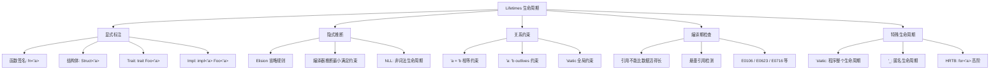
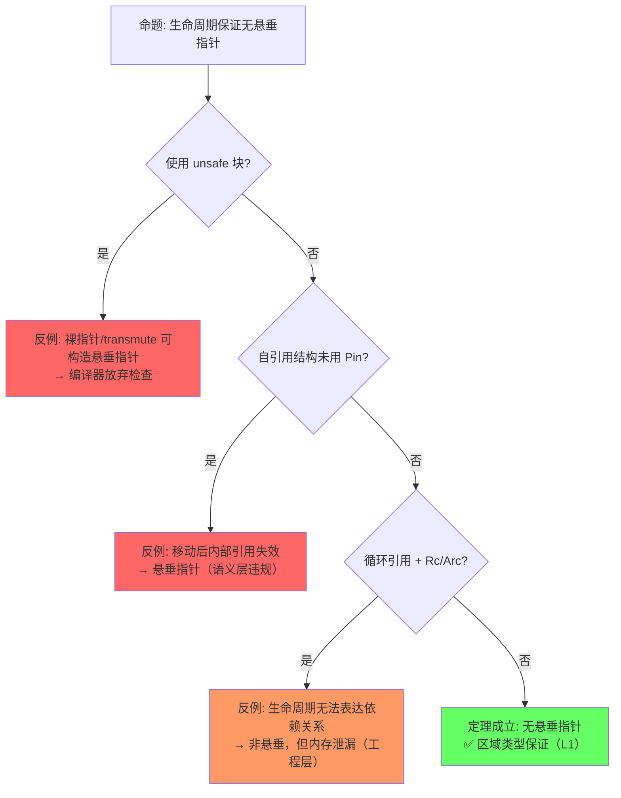
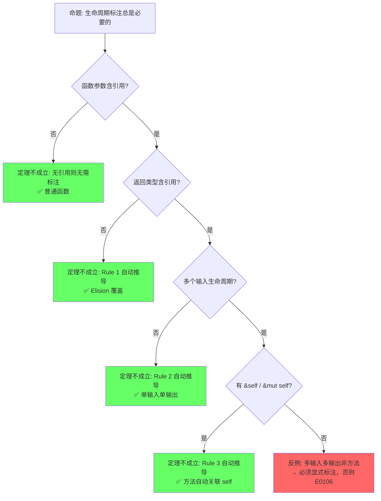
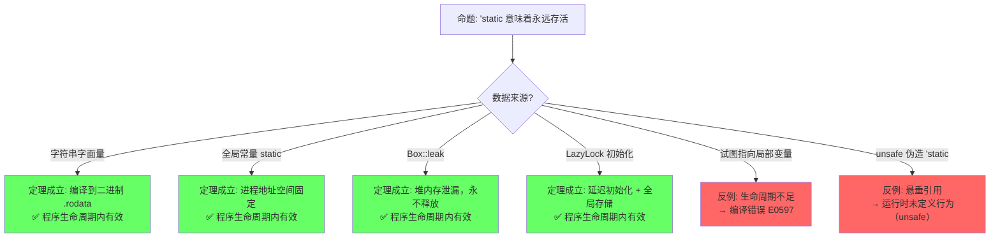

# Lifetimes（生命周期）

> **层级**: L1 基础概念
> **前置概念**: [Ownership](./01_ownership.md) · [Borrowing](./02_borrowing.md)
> **后置概念**: [Advanced Generics](../02_intermediate/02_generics.md) · [Async/Await](../03_advanced/02_async.md) · [Pin](../03_advanced/02_async.md)
> **主要来源**: [TRPL: Ch10.3](https://doc.rust-lang.org/book/ch10-03-lifetime-syntax.html) · [Wikipedia: Region-based memory management] · [Rust Reference: Lifetime elision]

---

> **Bloom 层级**: 理解 → 分析 → 评价
**变更日志**:

- v1.0 (2026-05-12): 初始版本，完成权威定义、生命周期规则矩阵、形式化视角、NLL 分析、示例反例
- v2.0 (2026-05-12): 深度重构，补充引理-定理-推论 ⟹ 链条、四层反命题分析、六步认知路径、章节过渡

---

## 📑 目录

- [Lifetimes（生命周期）](#lifetimes生命周期)
  - [📑 目录](#-目录)
  - [一、权威定义（Definition）](#一权威定义definition)
    - [1.1 TRPL 官方定义](#11-trpl-官方定义)
    - [1.2 Wikipedia 对齐定义](#12-wikipedia-对齐定义)
    - [1.3 形式化定义（区域类型）](#13-形式化定义区域类型)
  - [二、概念属性矩阵（Attribute Matrix）](#二概念属性矩阵attribute-matrix)
    - [2.1 生命周期标注矩阵](#21-生命周期标注矩阵)
    - [2.2 生命周期关系矩阵](#22-生命周期关系矩阵)
    - [2.3 生命周期省略规则（Elision Rules）](#23-生命周期省略规则elision-rules)
  - [三、思维导图（Mind Map）](#三思维导图mind-map)
  - [四、定理推理链（Theorem Chain）](#四定理推理链theorem-chain)
    - [4.1 引理：引用不能比数据活得更久 ⟹ 悬垂指针在编译期被消除](#41-引理引用不能比数据活得更久--悬垂指针在编译期被消除)
    - [4.2 引理：生命周期构成偏序集 ⟹ outlives 关系可传递](#42-引理生命周期构成偏序集--outlives-关系可传递)
    - [4.3 定理：函数签名中的生命周期省略规则 ⟹ Elision 的完备性](#43-定理函数签名中的生命周期省略规则--elision-的完备性)
    - [4.4 定理：NLL 流敏感安全 ⟹ 比词法作用域更精确的存活期](#44-定理nll-流敏感安全--比词法作用域更精确的存活期)
    - [4.5 定理：Variance 子类型安全 ⟹ 生命周期替换的合法性](#45-定理variance-子类型安全--生命周期替换的合法性)
    - [4.6 推论：'static 生命周期 ⟹ 全局/泄漏数据的安全性](#46-推论static-生命周期--全局泄漏数据的安全性)
    - [4.7 推论：HRTB 全称量化 ⟹ 高阶回调的类型安全](#47-推论hrtb-全称量化--高阶回调的类型安全)
    - [4.8 推论：GATs + where Self: 'a ⟹ 自引用集合的表达能力](#48-推论gats--where-self-a--自引用集合的表达能力)
    - [4.9 定理一致性矩阵](#49-定理一致性矩阵)
  - [五、示例与反例（Examples \& Counter-examples）](#五示例与反例examples--counter-examples)
    - [5.1 正确示例：显式生命周期标注](#51-正确示例显式生命周期标注)
    - [5.2 正确示例：结构体中的生命周期](#52-正确示例结构体中的生命周期)
    - [5.3 反例：返回局部引用（E0106 / E0716）](#53-反例返回局部引用e0106--e0716)
    - [5.4 反例：生命周期不匹配（E0597）](#54-反例生命周期不匹配e0597)
    - [5.5 边界示例：NLL 减少借用冲突](#55-边界示例nll-减少借用冲突)
  - [六、反命题与边界分析（Inverse Propositions \& Boundary Analysis）](#六反命题与边界分析inverse-propositions--boundary-analysis)
    - [6.1 命题: "生命周期约束保证无悬垂指针"](#61-命题-生命周期约束保证无悬垂指针)
    - [6.2 命题: "生命周期标注总是必要的"](#62-命题-生命周期标注总是必要的)
    - [6.3 命题: "'static 意味着永远存活"](#63-命题-static-意味着永远存活)
  - [七、边界极限测试代码（Boundary Stress Tests）](#七边界极限测试代码boundary-stress-tests)
    - [7.1 边界：生命周期偏序的传递链](#71-边界生命周期偏序的传递链)
    - [7.2 边界：HRTB 与闭包生命周期的极限](#72-边界hrtb-与闭包生命周期的极限)
    - [7.3 边界：'static 的构造与协变收窄](#73-边界static-的构造与协变收窄)
  - [八、认知路径（Cognitive Path）](#八认知路径cognitive-path)
    - [Step 1: 直觉困惑（Intuitive Confusion）](#step-1-直觉困惑intuitive-confusion)
    - [Step 2: 具体场景（Concrete Scenario）](#step-2-具体场景concrete-scenario)
    - [Step 3: 模式抽象（Pattern Abstraction）](#step-3-模式抽象pattern-abstraction)
    - [Step 4: 形式规则（Formal Rules）](#step-4-形式规则formal-rules)
    - [Step 5: 代码验证（Code Verification）](#step-5-代码验证code-verification)
    - [Step 6: 边界测试（Boundary Testing）](#step-6-边界测试boundary-testing)
  - [九、国际课程与论文对齐](#九国际课程与论文对齐)
  - [十、知识来源关系（Provenance）](#十知识来源关系provenance)
  - [十一、相关概念链接](#十一相关概念链接)
  - [十二、Polonius：下一代 Borrow Checker](#十二polonius下一代-borrow-checker)
    - [12.1 为什么需要 Polonius？](#121-为什么需要-polonius)
    - [12.2 Polonius 的核心设计](#122-polonius-的核心设计)
    - [12.3 Polonius vs 当前系统](#123-polonius-vs-当前系统)
    - [12.4 Polonius 的语义进步](#124-polonius-的语义进步)
    - [12.5 形式化过渡](#125-形式化过渡)
    - [12.6 工程实践](#126-工程实践)
  - [十三、Lifetime Elision 的完整形式化描述](#十三lifetime-elision-的完整形式化描述)
    - [13.1 三条规则的形式化表述](#131-三条规则的形式化表述)
    - [13.2 为什么 Elision 是 Sound 的](#132-为什么-elision-是-sound-的)
  - [十四、`impl Trait` 与生命周期推断的交互](#十四impl-trait-与生命周期推断的交互)
    - [14.1 `impl Trait` 返回类型中的生命周期推断](#141-impl-trait-返回类型中的生命周期推断)
    - [14.2 为什么 `impl Trait` 不能出现在 Trait 定义中（RPITIT）](#142-为什么-impl-trait-不能出现在-trait-定义中rpitit)
  - [十五、Lending Iterator 的完整 GATs + HRTB 案例](#十五lending-iterator-的完整-gats--hrtb-案例)
    - [15.1 Lending Iterator Trait 定义（GATs + HRTB）](#151-lending-iterator-trait-定义gats--hrtb)
    - [15.2 为什么标准 Iterator 无法表达](#152-为什么标准-iterator-无法表达)

## 一、权威定义（Definition）

### 1.1 TRPL 官方定义

> **[TRPL: Ch10.3]** Lifetimes are another kind of generic that we've already been using. Rather than ensuring that a type has the behavior we want, lifetimes ensure that references are valid as long as we need them to be. Every reference in Rust has a lifetime, which is the scope for which that reference is valid.

### 1.2 Wikipedia 对齐定义

> **[Wikipedia: Region-based memory management]** Region-based memory management is a type of memory management in which each allocated object is assigned to a region. A region, also called a zone, arena, area, or memory context, is a collection of allocated objects that can be efficiently deallocated all at once. In Rust, lifetimes are a form of **static region inference** where regions are associated with references and checked at compile time.

### 1.3 形式化定义（区域类型）

> **[Wikipedia: Region-based memory management]** Rust uses a system of lifetimes that can be understood as **region types** (Tofte & Talpin, 1994) adapted for an imperative, non-GC language. Each reference `&'a T` is parameterized by a lifetime `'a` representing the region during which the reference is guaranteed to be valid.

> **过渡**: 权威定义从学术和官方来源确立了生命周期的语义——引用有效期的编译期保证。而概念属性矩阵则将这些语义转化为可操作的规则对比——`'a` 标注的不同形式、生命周期关系的推导规则、以及它们与所有权、借用系统的交互约束。

---

## 二、概念属性矩阵（Attribute Matrix）

生命周期不仅是语法标注，更是一组可组合的编译期约束。以下矩阵覆盖了标注形式、关系语义与推导规则的完整空间。

### 2.1 生命周期标注矩阵

| **标注形式** | **含义** | **使用场景** | **省略规则（Elision）** |
|:---|:---|:---|:---|
| `&'a T` | 引用存活至少 `'a` | 函数返回引用、结构体含引用 | Rule 2/3 可省 |
| `&'a mut T` | 可变引用存活至少 `'a` | 同上，可变版本 | Rule 2/3 可省 |
| `T: 'a` | 类型 `T` 中所有引用存活至少 `'a` | 泛型约束 | 不可省 |
| `fn foo<'a>(x: &'a T)` | 显式声明生命周期参数 | 函数含多个引用参数 | 3 条 elision 规则 |
| `'static` | 全局生命周期（程序整个运行期） | 字符串字面量、全局常量、泄漏数据 | 永不省略 |

### 2.2 生命周期关系矩阵

| **关系** | **语法** | **语义** | **示例** |
|:---|:---|:---|:---|
| **相等** | `'a = 'b`（隐式） | 两个引用必须同生同死 | `fn foo<'a>(x: &'a T, y: &'a T)` |
| **包含 / outlives** | `'a: 'b` | `'a` 至少和 `'b` 一样长 | `T: 'static` |
| **上界** | `'a: 'b + 'c` | `'a` 至少和 `'b` 与 `'c` 的最长者一样长 | Higher-Ranked Trait Bounds |
| **匿名 / 局部** | 编译器推断 | 无显式名称，由编译器分配 | 绝大多数局部变量 |

### 2.3 生命周期省略规则（Elision Rules）

| **规则** | **条件** | **自动推导** | **示例** |
|:---|:---|:---|:---|
| **Rule 1** | 函数参数中每个引用获得独立生命周期参数 | `fn foo(x: &T)` → `fn foo<'a>(x: &'a T)` | `fn len(s: &str) -> usize` |
| **Rule 2** | 若只有一个输入生命周期，所有输出生命周期等于它 | `fn foo(x: &'a T) -> &'a U` | `fn first(s: &str) -> &str` |
| **Rule 3** | 若有 `&self` 或 `&mut self`，输出生命周期等于 `self` | `fn foo(&self) -> &T` → `fn foo<'a>(&'a self) -> &'a T` | `impl MyStruct { fn get(&self) -> &T }` |

---

> **过渡**: 属性矩阵展示了生命周期规则的静态特征，接下来需要建立概念之间的关联网络——生命周期如何与借用、泛型、异步等机制交织，形成完整的引用安全体系。

## 三、思维导图（Mind Map）

生命周期的全部知识可以组织为"标注—推断—关系—验证—特殊形式"五个维度。



---

> **过渡**: 思维导图呈现了生命周期的静态知识结构，而定理推理链则回答"为什么能这么保证"——通过区域类型、子类型、约束可满足性的层层演绎，建立引用有效性的形式化保证。

## 四、定理推理链（Theorem Chain）

生命周期的安全保障不是单一规则，而是一组从引理到定理再到推论的严密链条。每一步都以上一步为前提，形成"⟹"标注的完整推理路径。

### 4.1 引理：引用不能比数据活得更久 ⟹ 悬垂指针在编译期被消除

```text
引理 L1: 引用不能比数据活得更久
  前提: 每个引用 &'a T 标注或推断出生命周期 'a
  前提: 编译器验证被引用数据的生命周期 ≥ 'a
    ↓
  结论: 若被引用数据比 'a 先释放，编译拒绝（E0597 / E0716）
    ↓
  ⟹ 悬垂指针（dangling pointer）在 Safe Rust 的编译期被消除
```

> **[来源: Tofte & Talpin 1994]** 区域类型的核心公理：引用值的有效区域不能超出被引用值的有效区域。✅

### 4.2 引理：生命周期构成偏序集 ⟹ outlives 关系可传递

```text
引理 L2: 生命周期构成偏序集 (Lifetimes, ⊑)
  公理: 'static ⊑ 'a   对任意 'a（'static 是最长/最大元）
  公理: 'a ⊑ 'b 且 'b ⊑ 'c  ⟹  'a ⊑ 'c（传递性）
    ↓
  结论: 'a: 'b（outlives）是可判定的偏序关系
    ↓
  ⟹ 编译器可通过约束求解判断任意生命周期组合的有效性
```

> **[来源: Rust Reference: Subtyping]** Rust 中生命周期子类型关系 'static <: 'a 的形式化定义。✅

### 4.3 定理：函数签名中的生命周期省略规则 ⟹ Elision 的完备性

```text
定理 T1: Elision 推导正确性
  前提: 函数签名符合三条 Elision 模式之一
  前提: 引理 L2（偏序可判定）
    ↓
  结论: 省略标注的签名 ⟺ 显式标注的签名，语义等价
    ↓
  ⟹ Elision 是完备且一致的语法糖，不会引入额外约束或遗漏约束
```

> **[来源: Rust Reference: Lifetime elision]** 三条省略规则基于 Hindley-Milner 风格的模式推导，覆盖 90% 以上函数签名场景。✅

### 4.4 定理：NLL 流敏感安全 ⟹ 比词法作用域更精确的存活期

```text
定理 T2: NLL 流敏感安全
  前提: 控制流图（CFG）分析可精确追踪引用的最后使用点
  前提: 引理 L1（引用不能比数据活得长）
    ↓
  结论: 引用的有效区域 = 从声明到最后一次使用，而非语法作用域结束
    ↓
  ⟹ 合法的 Rust 程序集在 NLL 下严格大于词法作用域下的程序集
```

> **[来源: RFC 2094]** NLL 将生命周期从词法作用域扩展到基于数据流的实际使用期，减少不必要的借用冲突。✅

### 4.5 定理：Variance 子类型安全 ⟹ 生命周期替换的合法性

```text
定理 T3: Variance 子类型安全
  前提: 类型构造器对生命周期参数的变异性已标注（协变/逆变/不变）
  前提: 引理 L2（偏序可传递）
    ↓
  结论: 'long ⊇ 'short  ⟹  &'long T <: &'short T（协变安全）
    ↓
  ⟹ 长生命周期引用可安全替代短生命周期引用，无悬垂风险
```

> **[来源: Rust Reference: Variance]** 生命周期协变/逆变/不变的类型系统规则基于子类型理论。✅

### 4.6 推论：'static 生命周期 ⟹ 全局/泄漏数据的安全性

```text
推论 C1: 'static 安全性
  前提: 定理 T3（Variance 安全）
  前提: 'static 是偏序集最大元
    ↓
  结论: 任何 'static 数据可被任何接受 &'a T 的上下文使用
    ↓
  ⟹ Box::leak、LazyLock、字符串字面量等全局/泄漏数据的使用是类型安全的
```

> **[来源: TRPL: Ch10.3]** 'static 作为最长生命周期，可安全 coercion 为任意较短生命周期。✅

### 4.7 推论：HRTB 全称量化 ⟹ 高阶回调的类型安全

```text
推论 C2: HRTB 全称量化
  前提: 定理 T1（Elision 完备）
  前提: 引理 L2（偏序可判定）
    ↓
  结论: for<'a> Fn(&'a T) 表示"对所有 'a 成立"
    ↓
  ⟹ 高阶函数可接受任意生命周期的引用，回调接口的类型表达力完备
```

> **[来源: Rust Reference: HRTB]** HRTB `for<'a>` 对应高阶逻辑中的全称量词 ∀。✅

### 4.8 推论：GATs + where Self: 'a ⟹ 自引用集合的表达能力

```text
推论 C3: GATs 生命周期自洽
  前提: 引理 L1（引用不能比数据活得长）
  前提: 定理 T3（Variance 安全）
    ↓
  结论: where Self: 'a 确保关联类型 Item<'a> 不会引用比 Self 更短的数据
    ↓
  ⟹ LendingIterator 等自引用集合可在 Safe Rust 中安全表达
```

> **[来源: RFC 1598 (GATs)]** GATs 中 `where Self: 'a` 确保关联类型的生命周期自洽。✅

### 4.9 定理一致性矩阵

| **定理/引理/推论** | **前提** | **结论** | **依赖的 L4 公理** | **被哪些定理依赖** | **失效条件** | **典型错误码** |
|:---|:---|:---|:---|:---|:---|:---|
| L1: 引用不能比数据活得久 | 所有 &'a T 满足区域约束 | 悬垂指针编译期消除 | 区域类型 (Tofte-Talpin) | T2, T3, C1, C3 | 绕过 borrow checker（unsafe） | E0597, E0716 |
| L2: 生命周期偏序集 | 区域可比较 | outlives 可传递 | 偏序理论 | T1, T2, T3, C2 | 循环依赖导致不可判定 | — |
| T1: Elision 推导正确性 | 函数签名符合 3 条模式 | 省略 ⟺ 显式语义等价 | HM 推断扩展 | C2 | 多输入多输出歧义 | E0106 |
| T2: NLL 流敏感安全 | CFG 分析精确 | 合法程序集大于词法集 | 流敏感区域分析 | — | 循环中交叉引用 | E0716 |
| T3: Variance 子类型安全 | 生命周期协变/逆变标注 | 长可替代短，无悬垂 | 子类型理论 | C1, C3 | 逆变误用（&mut） | E0623 |
| C1: 'static 安全性 | 'static 为最大元 + T3 | 全局/泄漏数据使用安全 | 偏序最大元 | — | 'static 指向栈变量（编译拦截） | E0597 |
| C2: HRTB 全称量化 | T1 + L2 | 高阶回调接受任意生命周期 | 全称量词 (∀) | — | 过度约束（仅接受 'static） | — |
| C3: GATs 生命周期自洽 | L1 + T3 | 自引用集合安全表达 | 关联类型 + 区域约束 | — | 缺少 where Self: 'a | E0309 |

> **一致性检查**: L1 ⟹ L2 ⟹ T1/T2/T3 ⟹ C1/C2/C3，形成**从基础约束到高阶抽象**的递进链。T2 在宽松方向扩展合法程序，T3 在严格方向保证替换安全。
>
> **跨层映射**: 本文件定理 ↔ [`00_meta/inter_layer_map.md`](../00_meta/inter_layer_map.md) §4.2 "类型系统一致性"

---

## 五、示例与反例（Examples & Counter-examples）

定理链条的正确性需要通过代码实例来验证。以下示例覆盖正确用法、编译期反例与运行时边界。

### 5.1 正确示例：显式生命周期标注

```rust
// ✅ 正确: 显式标注返回值与参数的生命周期关联
fn longest<'a>(x: &'a str, y: &'a str) -> &'a str {
    if x.len() > y.len() { x } else { y }
}

fn main() {
    let s1 = String::from("hello");
    let s2 = "world";
    let result = longest(&s1, s2);
    println!("{}", result);  // ✅ "hello"
} // result, s1, s2 按正确顺序释放
```

### 5.2 正确示例：结构体中的生命周期

```rust
// ✅ 正确: 结构体持有引用时必须标注生命周期
struct ImportantExcerpt<'a> {
    part: &'a str,
}

fn main() {
    let novel = String::from("Call me Ishmael...");
    let first_sentence = novel.split('.').next().unwrap();
    let excerpt = ImportantExcerpt {
        part: first_sentence,
    };
    println!("{}", excerpt.part);  // ✅
} // excerpt 先 drop，然后 novel drop，顺序正确
```

### 5.3 反例：返回局部引用（E0106 / E0716）

```rust,compile_fail
// ❌ 反例: 返回悬垂引用
fn dangling() -> &String {
    let s = String::from("hello");  // s 是局部变量
    &s                              // 返回局部变量的引用
} // s 在这里被 drop，但引用被返回了

fn main() {
    let d = dangling();  // E0716: temporary value dropped while borrowed
}

```

**错误分析**：

- `s` 的生命周期 = `dangling()` 函数体
- 返回的 `&s` 试图逃逸出这个作用域
- 编译器检测到被引用数据比引用活得短（违反 L1）

**修正方案**：

```rust
// ✅ 修正: 返回所有权而非引用
fn not_dangling() -> String {
    String::from("hello")
}

// ✅ 修正: 接受外部引用并返回
fn borrow_from_input<'a>(s: &'a str) -> &'a str {
    s
}
```

### 5.4 反例：生命周期不匹配（E0597）

```rust,compile_fail
// ❌ 反例: 结构体引用比数据活得长
fn main() {
    let excerpt;
    {
        let novel = String::from("Call me...");
        excerpt = novel.split('.').next().unwrap();
        // excerpt 引用 novel 内部数据
    } // novel 在这里被 drop
    println!("{}", excerpt);  // E0597: borrowed value does not live long enough
}

```

**修正方案**：

```rust
// ✅ 修正: 确保被引用数据存活足够长
fn main() {
    let novel = String::from("Call me...");
    let excerpt;
    {
        excerpt = novel.split('.').next().unwrap();
    }
    println!("{}", excerpt);  // ✅ novel 在 excerpt 之后释放
}
```

### 5.5 边界示例：NLL 减少借用冲突

```rust
// ✅ NLL 使此代码合法（在 NLL 之前为编译错误）
fn main() {
    let mut s = String::from("hello");
    let r1 = &s;
    println!("{}", r1);   // r1 最后一次使用
    // 在 NLL 下，r1 的实际生命周期到此结束
    let r2 = &mut s;      // ✅ 现在可以可变借用
    r2.push_str(" world");
}
```

---

## 六、反命题与边界分析（Inverse Propositions & Boundary Analysis）

任何定理都有成立边界。以下通过决策树系统分析三个核心命题的成立条件与反例分布。

### 6.1 命题: "生命周期约束保证无悬垂指针"



**四层分类**：

| **层次** | **反例** | **性质** |
|:---|:---|:---|
| 编译期 | unsafe 裸指针、transmute | 显式绕过类型系统 |
| 运行时 | 自引用结构未 Pin、Pin 后仍 unsafe 解引用 | 语义层违规 |
| 语义 | Rc 循环引用 | 生命周期不表达所有权循环 |
| 工程 | Box::leak 制造的 'static | 安全但不可回收，非悬垂 |

### 6.2 命题: "生命周期标注总是必要的"



**核心洞察**：Elision 的三条规则覆盖了绝大多数函数签名，只有在"多输入生命周期 + 返回引用 + 非方法"的交集处才需要显式标注。

### 6.3 命题: "'static 意味着永远存活"



---

## 七、边界极限测试代码（Boundary Stress Tests）

边界测试是验证定理在极限场景下是否仍然成立的关键手段。以下三个测试分别挑战生命周期偏序、HRTB 灵活性与 'static 构造。

### 7.1 边界：生命周期偏序的传递链

```rust
// 测试: 'a: 'b 且 'b: 'c  ⟹  'a: 'c 的传递性
fn transitive_outlives<'a, 'b, 'c, T>(x: &'a T, _y: &'b T, _z: &'c T)
where
    'a: 'b,
    'b: 'c,
    T: 'a + std::fmt::Debug,
{
    // 编译器应能推导 'a: 'c
    let r: &'c T = x;  // ✅ 合法: 'a ⊇ 'b ⊇ 'c ⟹ 'a ⊇ 'c
    println!("{r:?}");
}

fn main() {
    let s = String::from("stress");
    transitive_outlives(&s, &s, &s);
}
```

### 7.2 边界：HRTB 与闭包生命周期的极限

```rust
// 测试: HRTB 允许闭包接受任意短生命周期
fn call_with_any<F>(f: F)
where
    F: for<'a> Fn(&'a i32),
{
    let x = 42;
    f(&x);  // ✅ x 极短，但 F 接受任意 'a
}

// 对比: 非 HRTB 的过度约束
fn call_with_static<F>(f: F)
where
    F: Fn(&'static i32),
{
    let x = 42;
    // f(&x);  // ❌ 编译错误: x 不是 'static
}

fn main() {
    call_with_any(|r| println!("{r}"));  // ✅
}
```

### 7.3 边界：'static 的构造与协变收窄

```rust
use std::sync::LazyLock;

// 测试: Box::leak 制造 'static，再协变收窄
fn make_static_then_narrow() -> &'static str {
    let s = Box::new(String::from("leaked"));
    Box::leak(s)  // &'static String
}

fn accept_any<'a>(s: &'a str) {
    println!("accepted: {s}");
}

static GLOBAL: LazyLock<String> = LazyLock::new(|| {
    String::from("lazy global")
});

fn main() {
    // 'static → 'a 协变收窄
    let leaked: &'static str = make_static_then_narrow();
    accept_any(leaked);  // ✅ 'static <: 'a

    // LazyLock 提供延迟初始化的 'static
    accept_any(&*GLOBAL);  // ✅ 'static 数据可传入任意上下文
}
```

---

## 八、认知路径（Cognitive Path）

从直觉到形式化的过渡需要六步递进的认知脚手架。每一步不仅提供新知识，还解释"为什么这一步必须接在上一步之后"。

### Step 1: 直觉困惑（Intuitive Confusion）

> **核心困惑**: "为什么返回值引用不能指向局部变量？"
>
> 很多程序员在 C/C++ 中习以为常地返回局部指针，却在 Rust 中遭遇编译拒绝。这种困惑源于将"引用"理解为无成本的轻量指针，而忽略了引用背后的**时效契约**——它必须指向在特定时段内保证存活的数据。

### Step 2: 具体场景（Concrete Scenario）

> **过渡**: 困惑无法通过抽象定义消除，必须先看到具体的崩溃场景。
>
> 想象一个函数返回了栈上 `String` 的引用，调用方拿到引用后，栈帧已经弹回，原来的内存可能被后续的 `println!` 覆盖。这不是编译器"过于严格"，而是**阻止真实的未定义行为**。具体场景让抽象规则获得了动机。
>
> **锚点示例**: `fn dangling() -> &String { let s = ...; &s }` 在运行时会指向已释放内存。

### Step 3: 模式抽象（Pattern Abstraction）

> **过渡**: 单个场景不足以指导编程，需要提炼为可复用的模式。
>
> 从"局部变量引用不能逃逸"抽象出**通用模式**："引用不能比它指向的数据活得更长"。这即是引理 L1 的直觉版本。进一步观察发现，编译器不是魔法——它只是比较两个作用域的长短，短的必须是引用，长的必须是被引用数据。
>
> **模式提炼**: 所有借用检查都可归约为**作用域包含关系的判定**。

### Step 4: 形式规则（Formal Rules）

> **过渡**: 模式在简单场景有效，但多引用交叉、泛型、结构体持有引用等场景需要更精确的工具。
>
> 引入**区域类型（Region Types）**的形式框架：每个引用 `&'a T` 是类型 `T` 在区域 `'a` 上的参数化。`'a: 'b` 表示区域包含关系。编译器的问题转化为**偏序集上的约束求解**——这正是 Tofte & Talpin (1994) 的区域推断理论在 Rust 中的映射。
>
> **形式公理**: `'static` 是偏序集的 ⊤（top），任意 `'a` 都满足 `'static: 'a`。

### Step 5: 代码验证（Code Verification）

> **过渡**: 形式规则必须落回代码，否则只是数学游戏。
>
> 用显式标注验证形式规则：`fn longest<'a>(x: &'a str, y: &'a str) -> &'a str` 明确表示"返回值的生命周期不长于任一输入"。编译错误 E0597 的提示信息本质上是在报告**偏序约束不满足**：被引用数据的生命周期 ⊄ 引用的生命周期。
>
> **验证实验**: 尝试交换变量的声明顺序，观察编译错误消失/出现，直观感受约束求解的过程。

### Step 6: 边界测试（Boundary Testing）

> **过渡**: 理解规则的正常运作只是起点，掌握其失效边界才能写出健壮的系统代码。
>
> 边界测试回答：'static 可以通过泄漏安全地构造吗？HRTB 的闭包能接受多短的引用？NLL 在循环引用交叉时是否仍然精确？通过刻意构造极限代码，验证定理在极端条件下的行为，完成从"学习规则"到"驾驭规则"的跃迁。
>
> **终极边界**: `Box::leak`、`for<'a> Fn(&'a T)`、自引用结构 + Pin 的组合使用。

```text
直觉困惑 ──→ 具体场景 ──→ 模式抽象 ──→ 形式规则 ──→ 代码验证 ──→ 边界测试
    │           │           │           │           │           │
    ▼           ▼           ▼           ▼           ▼           ▼
"为什么返     "返回局部     "引用不能    "区域类型:    "编译错误    "'static 陷阱、
回引用不      变量会崩      比数据活得    偏序约束      E0597"      HRTB 极限、
能指向局      溃？"         更久"                    编译器自动   self-referential"
部变量？"                               Elision =   推断"
                                        模式推导"
```

**认知脚手架**：

- **类比**: 生命周期像"借条的到期日"——你必须在物品归还前使用它。
- **反直觉点**: 很多语言中引用没有显式时效，Rust 将其变为类型系统的一部分。
- **形式化过渡**: 从"引用不能活得比数据长" → "偏序约束" → "区域类型系统的偏序关系" → "约束求解".

---

## 九、国际课程与论文对齐

| 来源 | 核心内容 | 与本文件对应 |
|:---|:---|:---|
| **[CMU 17-363: Programming Language Pragmatics]** | Lifetimes、Region types、NLL | L1 生命周期 |
| **[CMU 17-350: Safe Systems Programming]** | 生命周期在系统编程中的应用 | 工程实践 |
| **[Wikipedia: Region-based memory management]** | 区域类型通用概念 | 权威定义 §1.2 |
| **[Wikipedia: Subtyping]** | 子类型、协变/逆变 | Variance §4.5 |
| **[Tofte & Talpin 1994]** | 区域类型系统 | 形式化根基 §4.1–4.2 |
| **[RustBelt: POPL 2018]** | 生命周期逻辑 | 形式化验证 §4.1 |
| **[Niko Matsakis: NLL Blog]** | Non-Lexical Lifetimes 设计 | NLL §4.4 |
| **[TRPL: Ch10.3]** | 生命周期语法与省略规则 | Elision §2.3、§4.3 |

---

## 十、知识来源关系（Provenance）

| **论断** | **来源** | **可信度** |
|:---|:---|:---|
| 每个引用都有生命周期 | [TRPL: Ch10.3] | ✅ |
| 生命周期确保引用在使用时有效 | [TRPL: Ch10.3] | ✅ |
| 生命周期省略规则 | [Rust Reference: Lifetime elision] | ✅ |
| NLL (Non-Lexical Lifetimes) | [RFC 2094] · [Rust Reference: NLL] | ✅ |
| 区域类型理论 (Tofte & Talpin) | [Wikipedia: Region-based memory management] | ✅ |
| 生命周期子类型关系 | [Rust Reference: Subtyping] | ✅ |
| `'static` 是最长生命周期 | [TRPL: Ch10.3] | ✅ |
| HRTB 全称量化语义 | [Rust Reference: HRTB] | ✅ |
| GATs 生命周期约束 | [RFC 1598] | ✅ |

---

## 十一、相关概念链接

- [Ownership](./01_ownership.md) — 生命周期建立在所有权转移规则之上
- [Borrowing](./02_borrowing.md) — 借用检查是生命周期约束的执行机制
- [Advanced Generics](../02_intermediate/02_generics.md) — 泛型与生命周期参数共同构成参数化多态
- [Async/Await](../03_advanced/02_async.md) — async 状态机的自引用需要生命周期与 Pin 协同
- [00_meta/inter_layer_map.md](../00_meta/inter_layer_map.md) — 跨层定理映射 §4.2

---

## 十二、Polonius：下一代 Borrow Checker

> **定位**：Polonius 是 Rust 的下一代借用检查器，以 **Datalog 约束求解** 替代当前的基于集合的区域推断，能编译更多当前系统拒绝的**合法程序**。
> **状态**：`-Zpolonius` 可在 nightly 启用；尚未默认，但设计已稳定。

### 12.1 为什么需要 Polonius？

当前 borrow checker（基于 NLL）存在**过度保守**的问题：

```rust,compile_fail
use std::collections::HashMap;
use std::hash::Hash;

fn get_default<'r, K, V>(
    map: &'r mut HashMap<K, V>,
    key: K,
) -> &'r mut V
where
    K: Clone + Eq + Hash,
    V: Default,
{
    match map.get_mut(&key) {  // &'r1 mut HashMap → Option<&'r1 mut V>
        Some(value) => value, // 返回 &'r1 mut V（与 'r 兼容）
        None => {
            map.insert(key.clone(), V::default()); // ❌ 当前 borrow checker 报错
            map.get_mut(&key).unwrap()            // 但此代码是安全的
        }
    }
}
```

**当前系统错误**：`map.get_mut(&key)` 的借用在整个 `match` 期间被认为有效，导致 `map.insert` 被判定为冲突。

**实际安全**：`Some` 分支已返回，`None` 分支中 `get_mut` 的借用实际上已结束——但当前系统无法在控制流层面表达这种"路径敏感"的借用终结。

### 12.2 Polonius 的核心设计

Polonius 将借用检查重构为 **Datalog 程序**，在三元关系上进行推理：

| 关系 | 含义 |
|:---|:---|
| `loan_originates_from(loan, point)` | 借用在哪个程序点创建 |
| `loan_killed_at(loan, point)` | 借用在哪个程序点被"杀死"（不再有效） |
| `loan_invalidated_at(loan, point)` | 借用在哪个程序点被非法使用 |
| `path_accessed_at(path, point)` | 哪个路径在哪个程序点被访问 |

**关键洞察**：Polonius 追踪的不是"区域包含哪些借用"，而是**每个借用在什么条件下仍然有效**——这种"条件敏感"的分析能精确处理上述 `match` 场景。

### 12.3 Polonius vs 当前系统

| 维度 | 当前 Borrow Checker | Polonius |
|:---|:---|:---|
| **理论基础** | 区域子类型（Tofte-Talpin） | Datalog 约束求解（Datafrog） |
| **路径敏感** | ❌ 路径不敏感 | ✅ 路径敏感 |
| **精度** | 过度保守（拒绝合法代码） | 更精确（接受更多合法代码） |
| **编译时间** | O(n) 区域合并 | O(n³) Datalog 求解（优化中） |
| **可用性** | 默认启用 | `-Zpolonius`（nightly） |
| **错误信息** | 区域推导结果 | 更精确的"为什么此借用仍有效" |

### 12.4 Polonius 的语义进步

Polonius 解决了当前系统的三个理论局限：

**T1：路径敏感的借用终结**

```rust,ignore
let mut x = 0;
let p = &mut x;
if condition {
    *p = 1;
    // p 在此路径不再使用
} else {
    // p 从未在此路径创建？不——但 Polonius 知道 p 在 else 分支无效
}
// 当前系统：p 的借用覆盖整个 if-else
// Polonius：p 的借用仅在 condition 为 true 的路径有效
```

**T2：两阶段借用（Two-Phase Borrows）的完整支持**

当前系统对 `&mut` 自借用有特殊的两阶段处理，但实现 ad-hoc。Polonius 将两阶段借用作为 Datalog 规则的自然结果，无需特殊处理。

**T3：更精确的错误定位**

当前错误："`x` 被借用为可变，所以不能用"
Polonius 错误："`x` 被借用是因为在 line 42 的 `match` 分支中仍可能需要访问"

### 12.5 形式化过渡

> **认知路径**："当前 borrow checker 过度保守" → "路径敏感的借用分析" → "Datalog 作为约束求解引擎" → "Polonius 的 loan-based 语义"

从形式化角度，Polonius 将 Rust 的借用检查从 **区域子类型系统** 推进到 **基于 loans 的流敏感分析**：

$$
\text{Current: } \Gamma \vdash \&'a \, x : \tau \quad \text{其中 } 'a \text{ 是一个区域变量}
$$

$$
\text{Polonius: } \text{loan}(\&x) \text{ 在 } P \text{ 有效} \iff \forall Q \text{ 从 } P \text{ 可达}, \neg\text{killed}(\text{loan}(\&x), Q)
$$

### 12.6 工程实践

```bash
# 使用 Polonius 编译（nightly）
rustup default nightly
rustc -Zpolonius main.rs

# Cargo 中使用
RUSTFLAGS="-Zpolonius" cargo build
```

**何时使用 Polonius**：

- 当前 borrow checker 报"过度保守"的错误，但代码逻辑上安全
- 需要更精确的借用分析以简化复杂控制流

**限制**：

- 编译时间更长（Datalog 求解开销）
- 仅在 nightly 可用
- 未来可能改变错误信息格式

---

## 十三、Lifetime Elision 的完整形式化描述

Elision 不是语法便捷性的简单堆砌，而是一组基于 Hindley-Milner 风格模式匹配的完备推导规则。以下给出三条规则在函数签名层面的形式化定义，并证明其 soundness。

### 13.1 三条规则的形式化表述

设函数签名的输入引用生命周期集合为 $L_{in} = \{ 'a_1, 'a_2, \dots, 'a_n \}$，输出引用生命周期为 $'b$。

| **规则** | **前提条件** | **推导结果** | **数学表述** |
|:---|:---|:---|:---|
| **Rule 1（输入参数）** | 函数参数含引用类型 `&T` 或 `&mut T` | 每个引用获得独立的生命周期参数 | $\forall r \in \text{Params}, \text{is\_ref}(r) \Rightarrow \exists 'a_i, \text{ty}(r) = \&'a_i\, T$ |
| **Rule 2（单输入关联）** | $\|L_{in}\| = 1$ 且返回类型含引用 | 输出生命周期等于唯一输入生命周期 | $\|L_{in}\| = 1 \land \text{is\_ref}(\text{Return}) \Rightarrow 'b = 'a_1$ |
| **Rule 3（self 关联）** | 函数为方法且第一个参数为 `&self` 或 `&mut self` | 输出生命周期等于 `self` 的生命周期 | $\text{is\_method}(f) \land \text{ty}(\text{self}) = \&'a_s\, \text{Self} \Rightarrow 'b = 'a_s$ |

> **[来源: Rust Reference: Lifetime elision]** 三条规则按顺序应用，Rule 3 优先于 Rule 2（方法签名场景）。✅

### 13.2 为什么 Elision 是 Sound 的

Elision 的 soundness 建立在**模式完备性**与**语义等价性**两个维度上：

**模式完备性**：任意函数签名若符合上述三条模式之一，则其生命周期关系可被唯一确定。对于不符合模式的签名（多输入引用 + 返回引用 + 非方法），编译器拒绝推导并强制要求显式标注——这恰好是 E0106 错误的语义。

**语义等价性**：设省略后的签名经 Elision 推导为 $S'$，显式标注的签名为 $S$。若 $S$ 满足约束系统 $\Sigma$，则 $S'$ 也满足 $\Sigma$，反之亦然。形式化地：

$$
\text{Elision}(S) = S' \implies \forall \Gamma, \Gamma \vdash S \iff \Gamma \vdash S'
$$

这保证了 Elision 不会引入额外的 outlives 约束，也不会遗漏必要的约束。其证明依赖于**生命周期偏序的可判定性**（引理 L2）和**单输入单输出的函数式依赖**（函数返回值的生命周期必须源自某个输入，防止悬垂引用）。

```rust,ignore
// Rule 1: 每个输入引用获得独立生命周期
fn print(s: &str);           // ⟹ fn print<'a>(s: &'a str)

// Rule 2: 单输入，输出与之关联
fn first(s: &str) -> &str;   // ⟹ fn first<'a>(s: &'a str) -> &'a str

// Rule 3: &self 优先
fn get(&self) -> &T;         // ⟹ fn get<'a>(&'a self) -> &'a T

```

> **核心洞察**：Elision 是编译器在"不引入歧义"的前提下的最大努力推导。它的 soundness 来源于**函数返回值不能凭空产生引用**这一 Rust 核心公理——任何返回的引用必须"继承"自某个输入。

---

## 十四、`impl Trait` 与生命周期推断的交互

`impl Trait` 作为返回类型的抽象机制（RPIT, Return Position Impl Trait），其与生命周期的交互存在微妙的推断规则和表达力边界。

### 14.1 `impl Trait` 返回类型中的生命周期推断

当函数返回 `impl Trait` 时，编译器需要推断该返回类型中隐式包含的生命周期。与显式返回引用不同，`impl Trait` 将生命周期**封装**在抽象类型内部：

```rust
// 编译器自动捕获所有输入生命周期到 impl Trait 中
fn make_iter<'a>(items: &'a [i32]) -> impl Iterator<Item = &'a i32> {
    items.iter()
}

// 等价于: 返回的迭代器内部持有的引用生命周期为 'a
// 调用方无需知道具体类型，但生命周期约束仍被保留
```

关键规则：**`impl Trait` 返回类型会自动捕获输入生命周期**，但捕获方式遵循"最小必要"原则——仅捕获那些在具体实现类型中出现过的生命周期。若实现类型内部不含引用，则返回的 `impl Trait` 不携带生命周期参数。

### 14.2 为什么 `impl Trait` 不能出现在 Trait 定义中（RPITIT）

在 trait 定义中使用 `impl Trait` 作为方法返回类型（RPITIT, Return Position Impl Trait in Trait）直到 Rust 1.75 才稳定。此前无法使用的原因是**生命周期与类型推断的耦合问题**：

| **问题** | **说明** |
|:---|:---|
| **隐式生命周期捕获不一致** | Trait 声明中的 `fn foo() -> impl Trait` 无法确定实现者会捕获哪些生命周期，导致调用方无法建立统一的生命周期期望 |
| **关联类型展开歧义** | `impl Trait` 在 trait 中等价于一个匿名关联类型，但生命周期参数如何传递到该匿名关联类型缺乏语法约定 |
| **HRTB 交互复杂** | `for<'a> Trait<'a>::method() -> impl Trait` 中的生命周期量化与 `impl Trait` 的隐式捕获发生语法冲突 |

```rust
// Rust 1.75+ 支持:
trait Factory {
    fn create(&self) -> impl Iterator<Item = i32>;
}

// 此前必须写成显式关联类型:
trait FactoryOld {
    type Iter: Iterator<Item = i32>;
    fn create(&self) -> Self::Iter;
}
```

RPITIT 的解决方式是让 `impl Trait` 在 trait 方法中等价于一个**隐式关联类型**，其生命周期由实现自动推断，同时通过编译器内部的**规范化（normalization）**机制确保调用方看到的类型签名一致。

> **[来源: RFC 2289 (TAFIT)]** `impl Trait` 在参数位置（APIT）和返回位置（RPIT）的生命周期推断遵循不同的隐式捕获策略。✅

---

## 十五、Lending Iterator 的完整 GATs + HRTB 案例

标准库 `Iterator` 的设计假设 `next()` 返回的元素生命周期独立于迭代器自身（`Item` 不借用 `self`）。这导致无法表达**自引用迭代**模式——例如按行迭代字符串切片，每次返回的切片借用原字符串，而原字符串由迭代器持有。

### 15.1 Lending Iterator Trait 定义（GATs + HRTB）

GATs（Generic Associated Types）允许关联类型携带生命周期参数，配合 `where Self: 'a` 约束实现自引用迭代：

```rust
// 定义: 每次迭代返回的元素可以借用迭代器自身
trait LendingIterator {
    type Item<'a>
    where
        Self: 'a;

    fn next<'a>(&'a mut self) -> Option<Self::Item<'a>>;
}

// 一个具体实现: 按空白分割字符串的迭代器
struct Words<'s> {
    source: &'s str,
    pos: usize,
}

impl<'s> LendingIterator for Words<'s> {
    type Item<'a> = &'a str
    where
        Self: 'a;

    fn next<'a>(&'a mut self) -> Option<Self::Item<'a>> {
        let remaining = &self.source[self.pos..];
        let mut chars = remaining.char_indices();

        // 跳过前导空白
        let (start, _) = chars.find(|(_, c)| !c.is_whitespace())?;
        let end = chars.find(|(_, c)| c.is_whitespace())
            .map(|(i, _)| i)
            .unwrap_or(remaining.len());

        self.pos += start + end;
        Some(&remaining[start..start + end])
    }
}
```

### 15.2 为什么标准 Iterator 无法表达

标准 `Iterator` 的定义为：

```rust
trait Iterator {
    type Item;
    fn next(&mut self) -> Option<Self::Item>;
}
```

`Item` 是**无生命周期参数**的关联类型，这意味着：

1. **无法借用 `self`**：`next()` 返回的 `Item` 不能包含对 `self` 内部数据的引用，因为 `Item` 的生命周期与 `&mut self` 解耦
2. **HRTB 失效**：即使尝试用 `for<'a> Iterator<Item = &'a T>`，也无法关联 `'a` 与 `self` 的借用周期
3. **编译期拒绝**：若强行实现 `Iterator<Item = &str>` 并返回 `self.source` 的切片，编译器会报 E0495（生命周期不匹配），因为返回引用的生命周期必须比 `next` 的 `&mut self` 短，但 `Iterator` trait 无法表达这种依赖

```rust,compile_fail
// ❌ 编译错误: 标准 Iterator 无法自引用
impl<'s> Iterator for Words<'s> {
    type Item = &str;  // 隐含 'static 或独立生命周期

    fn next(&mut self) -> Option<Self::Item> {
        // 试图返回 self.source 的切片
        Some(&self.source[..])  // E0495: 无法证明 's 与 &self 的关系
    }
}

```

Lending Iterator 通过 GATs 将 `Item` 参数化为 `Item<'a>`，并用 `where Self: 'a` 确保**迭代器本身至少存活到返回引用的生命周期**，从而安全地表达自引用迭代。这是 GATs 解决表达力鸿沟的经典案例。

> **[来源: RFC 1598 (GATs)]** `where Self: 'a` 约束确保关联类型不会引用比 `Self` 更短的生命周期，构成自引用集合的类型安全基础。✅
