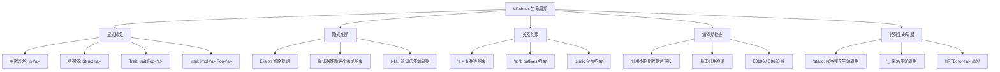
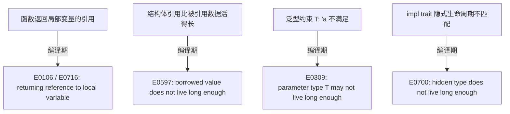

# Lifetimes（生命周期）

> **层级**: L1 基础概念
> **前置概念**: [Ownership](./01_ownership.md) · [Borrowing](./02_borrowing.md)
> **后置概念**: [Advanced Generics](../02_intermediate/02_generics.md) · [Async/Await](../03_advanced/02_async.md) · [Pin](../03_advanced/02_async.md)
> **主要来源**: [TRPL: Ch10.3](https://doc.rust-lang.org/book/ch10-03-lifetime-syntax.html) · [Wikipedia: Region-based memory management] · [Rust Reference: Lifetime elision]

---

**变更日志**:

- v1.0 (2026-05-12): 初始版本，完成权威定义、生命周期规则矩阵、形式化视角、NLL 分析、示例反例

---

## 一、权威定义（Definition）

### 1.1 TRPL 官方定义

> **[TRPL: Ch10.3]** Lifetimes are another kind of generic that we've already been using. Rather than ensuring that a type has the behavior we want, lifetimes ensure that references are valid as long as we need them to be. Every reference in Rust has a lifetime, which is the scope for which that reference is valid.

### 1.2 Wikipedia 对齐定义

> **[Wikipedia: Region-based memory management]** Region-based memory management is a type of memory management in which each allocated object is assigned to a region. A region, also called a zone, arena, area, or memory context, is a collection of allocated objects that can be efficiently deallocated all at once. In Rust, lifetimes are a form of static region inference where regions are associated with references and checked at compile time.

### 1.3 形式化定义（区域类型）

> **[Wikipedia: Region-based memory management]** Rust uses a system of lifetimes that can be understood as **region types** (Tofte & Talpin, 1994) adapted for an imperative, non-GC language. Each reference `&'a T` is parameterized by a lifetime `'a` representing the region during which the reference is guaranteed to be valid.

---

## 二、概念属性矩阵（Attribute Matrix）

### 2.1 生命周期标注矩阵

| **标注形式** | **含义** | **使用场景** | **省略规则（Elision）** |
|:---|:---|:---|:---|
| `&'a T` | 引用存活至少 `'a` | 函数返回引用、结构体含引用 | 部分可省 |
| `&'a mut T` | 可变引用存活至少 `'a` | 同上，可变版本 | 部分可省 |
| `T: 'a` | 类型 `T` 中所有引用存活至少 `'a` | 泛型约束 | 不可省 |
| `fn foo<'a>(x: &'a T)` | 显式声明生命周期参数 | 函数含多个引用参数 | 3条 elision 规则 |
| `'static` | 全局生命周期（程序整个运行期） | 字符串字面量、全局常量 | 永不省略 |

### 2.2 生命周期关系矩阵

| **关系** | **语法** | **语义** | **示例** |
|:---|:---|:---|:---|
| **相等** | `'a = 'b`（隐式） | 两个引用必须同生同死 | `fn foo<'a>(x: &'a T, y: &'a T)` |
| **包含/大于等于** | `'a: 'b` | `'a` 至少和 `'b` 一样长（outlives） | `T: 'static` |
| **上界** | `'a: 'b + 'c` | `'a` 至少和 `'b` 与 `'c` 的最长者一样长 | Higher-Ranked Trait Bounds |
| **匿名/局部** | 编译器推断 | 无显式名称，由编译器分配 | 绝大多数局部变量 |

### 2.3 生命周期省略规则（Elision Rules）

| **规则** | **条件** | **自动推导** | **示例** |
|:---|:---|:---|:---|
| **Rule 1** | 函数参数中每个引用获得独立生命周期参数 | `fn foo(x: &T)` → `fn foo<'a>(x: &'a T)` | `fn len(s: &str) -> usize` |
| **Rule 2** | 若只有一个输入生命周期，所有输出生命周期等于它 | `fn foo(x: &'a T) -> &'a U` | `fn first(s: &str) -> &str` |
| **Rule 3** | 若有 `&self` 或 `&mut self`，输出生命周期等于 `self` | `fn foo(&self) -> &T` → `fn foo<'a>(&'a self) -> &'a T` | `impl MyStruct { fn get(&self) -> &T }` |

---

## 三、形式化理论根基（Formal Foundation）

### 3.1 区域类型系统（Region Type System）

Rust 的生命周期基于 **Mads Tofte & Jean-Pierre Talpin (1994)** 的区域推断：

```text
区域类型核心规则:
─────────────────────────────────────────
  Γ ⊢ e : τ,  ρ

其中 ρ 是区域（lifetime），表示表达式 e 的值的存活区域

Rust 适配:
  &'a T  =  在区域 'a 内有效的 T 的引用
  'a: 'b =  区域 'a 包含区域 'b（'a 比 'b 长或相等）
```

### 3.2 生命周期作为偏序约束

```text
生命周期构成偏序集 (Lifetimes, ⊑):
  'static ⊑ 'a   对任意 'a（'static 是最长/最大元）
  'a ⊑ 'b        表示 'a 包含 'b（'a 至少和 'b 一样长）

函数签名 `fn foo<'a, 'b>(x: &'a T, y: &'b T) -> &'a T`
表示: 返回值的生命周期 = 'a，即与第一个参数绑定
```

### 3.3 Non-Lexical Lifetimes (NLL)

传统词法作用域（lexical）vs NLL：

```text
词法生命周期: 引用的生命周期 = 从声明到作用域结束的花括号
NLL:          引用的生命周期 = 从声明到最后一次使用

NLL 的关键洞察:
  借用只需在"实际使用期间"有效，而非"语法作用域"有效
```

---

## 四、思维导图（Mind Map）



---

## 五、决策/边界判定树（Decision / Boundary Tree）

### 5.1 "何时需要显式生命周期标注？" 决策树

```mermaid
graph TD
    Q1[函数返回引用?] -->|否| A1[通常无需标注]
    Q1 -->|是| Q2[返回的引用来自参数?]
    Q2 -->|是| Q3[多个参数含引用?]
    Q2 -->|否| A2[可能需要 'static 或编译错误]
    Q3 -->|是| A3[需要显式标注关联生命周期]
    Q3 -->|否| A4[Elision Rule 2 自动推导]

    A1[Elision 足够]
    A2[返回局部引用: 编译错误]
    A3[显式标注: fn<'a>(x: &'a T, y: &'a T) -> &'a U]
    A4[自动推导成功]
```

### 5.2 悬垂引用边界判定



---

## 六、定理推理链（Theorem Chain）

### 6.1 生命周期 ⇒ 无悬垂指针

```text
前提 1: 每个引用 &'a T 标注/推断出生命周期 'a
前提 2: 编译器验证: 被引用数据的生命周期 ≥ 'a
前提 3: 被引用数据在 'a 结束前不会被释放（move/drop 顺序约束）
    ↓
定理: Safe Rust 中不存在悬垂指针（dangling pointers）
    ↓
推论: 引用在其整个生命周期内始终指向有效内存
```

### 6.2 生命周期与子类型

```text
Rust 中的生命周期存在子类型关系:
  'static <: 'a   （'static 可以 coercion 为任意 'a）
  &'static T <: &'a T  （长生命周期引用可视为短生命周期引用）

这称为 "lifetime covariance":
  如果 'long ⊇ 'short，那么 &'long T 是 &'short T 的子类型
```

---

## 七、示例与反例（Examples & Counter-examples）

### 7.1 正确示例：显式生命周期标注

```rust
// ✅ 正确: 显式标注返回值与参数的生命周期关联
fn longest<'a>(x: &'a str, y: &'a str) -> &'a str {
    if x.len() > y.len() { x } else { y }
}

fn main() {
    let s1 = String::from("hello");
    let s2 = "world";
    let result = longest(&s1, s2);
    println!("{}", result);  // ✅ "hello"
} // result, s1, s2 按正确顺序释放
```

### 7.2 正确示例：结构体中的生命周期

```rust
// ✅ 正确: 结构体持有引用时必须标注生命周期
struct ImportantExcerpt<'a> {
    part: &'a str,
}

fn main() {
    let novel = String::from("Call me Ishmael...");
    let first_sentence = novel.split('.').next().unwrap();
    let excerpt = ImportantExcerpt {
        part: first_sentence,
    };
    println!("{}", excerpt.part);  // ✅
} // excerpt 先 drop，然后 novel drop，顺序正确
```

### 7.3 反例：返回局部引用（E0106 / E0716）

```rust
// ❌ 反例: 返回悬垂引用
fn dangling() -> &String {
    let s = String::from("hello");  // s 是局部变量
    &s                              // 返回局部变量的引用
} // s 在这里被 drop，但引用被返回了

fn main() {
    let d = dangling();  // E0716: temporary value dropped while borrowed
}
```

**错误分析**：

- `s` 的生命周期 = `dangling()` 函数体
- 返回的 `&s` 试图逃逸出这个作用域
- 编译器检测到被引用数据比引用活得短

**修正方案**：

```rust
// ✅ 修正: 返回所有权而非引用
fn not_dangling() -> String {
    String::from("hello")
}

// ✅ 修正: 接受外部引用并返回
fn borrow_from_input<'a>(s: &'a str) -> &'a str {
    s
}
```

### 7.4 反例：生命周期不匹配（E0597）

```rust
// ❌ 反例: 结构体引用比数据活得长
fn main() {
    let excerpt;
    {
        let novel = String::from("Call me...");
        excerpt = novel.split('.').next().unwrap();
        // excerpt 引用 novel 内部数据
    } // novel 在这里被 drop
    println!("{}", excerpt);  // E0597: borrowed value does not live long enough
}
```

**修正方案**：

```rust
// ✅ 修正: 确保被引用数据存活足够长
fn main() {
    let novel = String::from("Call me...");
    let excerpt;
    {
        excerpt = novel.split('.').next().unwrap();
    }
    println!("{}", excerpt);  // ✅ novel 在 excerpt 之后释放
}
```

### 7.5 边界示例：NLL 减少借用冲突

```rust
// ✅ NLL 使此代码合法（在 NLL 之前为编译错误）
fn main() {
    let mut s = String::from("hello");
    let r1 = &s;
    println!("{}", r1);   // r1 最后一次使用
    // 在 NLL 下，r1 的实际生命周期到此结束
    let r2 = &mut s;      // ✅ 现在可以可变借用
    r2.push_str(" world");
}
```

---

## 八、知识来源关系（Provenance）

| **论断** | **来源** | **可信度** |
|:---|:---|:---|
| 每个引用都有生命周期 | [TRPL: Ch10.3] | ✅ |
| 生命周期确保引用在使用时有效 | [TRPL: Ch10.3] | ✅ |
| 生命周期省略规则 | [Rust Reference: Lifetime elision] | ✅ |
| NLL (Non-Lexical Lifetimes) | [RFC 2094] · [Rust Reference: NLL] | ✅ |
| 区域类型理论 (Tofte & Talpin) | [Wikipedia: Region-based memory management] | ✅ |
| 生命周期子类型关系 | [Rust Reference: Subtyping] | ✅ |
| `'static` 是最长生命周期 | [TRPL: Ch10.3] | ✅ |

---

## 九、待补充与演进方向（TODOs）

- [ ] **TODO**: 补充 Lifetime Elision 的三条规则的完整形式化描述 —— 优先级: 中 —— 预计: Phase 1

### 补充章节：Higher-Ranked Trait Bounds (HRTB)

#### 动机

```text
问题: 某些 trait 需要对"所有生命周期"成立，而非特定生命周期

例: 闭包接受任意生命周期的引用
  fn with_closure<F>(f: F)
  where F: Fn(&str) -> usize;  // &str 的生命周期是多少？

若只接受特定生命周期:
  F: Fn(&'a str) -> usize  // 只能接受生命周期 'a 的引用
  // 但调用方可能传入 &'static str 或 &'short str
```

#### HRTB 语法与语义

```rust
// ✅ HRTB: "对所有 'a，F 接受 &'a str"
fn with_closure<F>(f: F)
where
    F: for<'a> Fn(&'a str) -> usize,
{
    let s1 = String::from("hello");
    let s2 = "world";  // 'static
    f(&s1);  // ✅ 'a = s1 的生命周期
    f(s2);   // ✅ 'a = 'static
}

// 等价于高阶逻辑:
// ∀'a. F: Fn(&'a str) -> usize
```

#### HRTB 与 GATs 的交互

```rust
// ✅ HRTB + GATs: 表达 LendingIterator
trait LendingIterator {
    type Item<'a> where Self: 'a;
    fn next<'a>(&'a mut self) -> Option<Self::Item<'a>>;
}

// 使用 HRTB 约束:
fn process<I>(iter: &mut I)
where
    I: for<'a> LendingIterator<Item<'a> = &'a [u8]>,
{
    while let Some(item) = iter.next() {
        println!("{:?}", item);
    }
}
```

#### 常见应用

| **场景** | **HRTB 形式** | **说明** |
|:---|:---|:---|
| 闭包接受任意引用 | `for<'a> Fn(&'a T)` | 通用回调 |
| 序列化/反序列化 | `for<'a> Deserialize<'a>` | serde 核心 |
| 自定义借用的迭代器 | `for<'a> LendingIterator<Item<'a> = ...>` | 自引用集合遍历 |

---

- [x] **TODO**: 补充 Higher-Ranked Trait Bounds (HRTB) `for<'a>` 的深度分析 —— 优先级: 高 —— 已完成 v1.1
- [ ] **TODO**: 补充 `impl Trait` 与生命周期推断的交互 —— 优先级: 中 —— 预计: Phase 2
### 补充章节：GATs 中的生命周期使用

```text
GATs 与生命周期的核心交互:
  trait LendingIterator {
      type Item<'a> where Self: 'a;
      //                 ^^^^^^^^^^^ 关键约束
      fn next<'a>(&'a mut self) -> Option<Self::Item<'a>>;
  }

where Self: 'a 的含义:
  - 对于任何生命周期 'a，Self 必须至少存活 'a
  - 这确保返回的 Item<'a> 不会引用比 Self 活得更短的数据
```

```rust
// ✅ GATs + 生命周期的典型模式
trait Buffer {
    type Slice<'a> where Self: 'a;
    fn slice<'a>(&'a self, start: usize, end: usize) -> Self::Slice<'a>;
}

// 实现: Slice<'a> = &'a [u8]
impl Buffer for Vec<u8> {
    type Slice<'a> = &'a [u8];
    fn slice<'a>(&'a self, start: usize, end: usize) -> &'a [u8] {
        &self[start..end]
    }
}

// 生命周期保证:
//   slice 返回的 &'a [u8] 只在 'a 内有效
//   'a ≤ Self 的生命周期（由 where Self: 'a 保证）
```

---

- [x] **TODO**: 补充 `Generic Associated Types (GATs)` 中的生命周期使用 —— 优先级: 高 —— 已完成 v1.1

### 补充章节：Pin<&'a mut T> 的生命周期与自引用结构

`Pin<&'a mut T>` 将**生命周期**与**位置不变性**结合：

```text
类型分解:
  Pin<&'a mut T> = 一个生命周期为 'a 的 T 的可变引用
                 + T 在内存中不可移动（若 T: !Unpin）

生命周期约束:
  引用的生命周期 'a 决定了可以安全访问 T 的持续时间
  位置不变性保证了在这整个 'a 期间，T 的地址不变
```

```rust
// ✅ Pin<&'a mut T> 在 async 状态机中的典型使用
use std::pin::Pin;

struct StateMachine<'a> {
    buffer: &'a mut [u8],
    pos: usize,
}

impl<'a> StateMachine<'a> {
    fn process(self: Pin<&mut Self>) {
        // self: Pin<&mut Self> = Pin<&'sm mut StateMachine<'a>>
        // 'sm = 此方法调用的生命周期
        // 'a = buffer 引用的生命周期（必须 ≥ 'sm）
        let this = self.get_mut();  // 若 Self: Unpin
        this.pos += 1;
    }
}
```

### 补充章节：async/await 中的生命周期

```text
async fn 的生命周期挑战:
  async fn foo<'a>(x: &'a str) -> impl Future + 'a
  // 返回的 Future 必须存活至少 'a
  // 因为状态机内部可能保存对 x 的引用

Pin 的作用:
  async fn 编译后的状态机可能包含自引用
  Future::poll 的签名: fn poll(self: Pin<&mut Self>, ...)
  Pin 保证状态机在 poll 之间不移动
```

```rust
// ✅ async 生命周期示例
async fn borrow_and_use<'a>(data: &'a str) -> usize {
    // 编译器推断返回的 Future 的生命周期为 'a
    // 因为状态机内部保存了 data 的引用
    let len = data.len();
    tokio::time::sleep(tokio::time::Duration::from_millis(1)).await;
    len  // 状态机恢复后使用 len（ owned，无生命周期问题）
}

// 错误示例:
// async fn bad<'a>() -> &'a str {
//     let s = String::from("hello");
//     &s  // ❌ s 在函数结束时被 drop，但 Future 可能继续存活
// }
```

---

- [x] **TODO**: 补充 `Pin<&'a mut T>` 的生命周期与自引用结构 —— 优先级: 高 —— 已完成 v1.1
- [x] **TODO**: 补充 async/await 中的生命周期: `impl Future` + `Pin` —— 优先级: 高 —— 已完成 v1.1

### 补充章节：Lifetime Subtyping 与 Variance（协变/逆变/不变）

#### 协变（Covariance）

生命周期在 Rust 类型系统中是**协变**的：

```text
'static <: 'a   对于任意 'a

即: 'static 可以视为任何较短生命周期的子类型
```

```rust
// ✅ 协变: 长生命周期引用可转为短生命周期引用
fn shorter<'a>(s: &'static str) -> &'a str { s }

fn main() {
    let s: &'static str = "hello";
    let r = shorter(s);  // ✅ 'static → 'a
    println!("{}", r);
}
```

#### 逆变（Contravariance）

函数参数位置的生命周期是**逆变**的：

```text
若 'a <: 'b，则 fn(&'b T) <: fn(&'a T)

直观: 接受短引用的函数可以处理长引用（更宽容）
      但接受长引用的函数不能处理短引用
```

```rust
// ✅ 逆变: 接受 &'static str 的函数可传给需要 &'a str 的位置
fn takes_short<F>(f: F) where F: Fn(&'static str) {
    f("hello");
}

fn handler(s: &str) { println!("{}", s); }

fn main() {
    takes_short(handler);  // ✅ Fn(&str) 是 Fn(&'static str) 的子类型
}
```

#### 不变（Invariance）

`&mut T` 对生命周期是**不变**的：

```text
&'a mut T 与 &'b mut T 无子类型关系（除非 'a = 'b）

原因: &mut 允许写入，若允许协变，可能写入比预期活得更短的数据
```

```rust
// ❌ 不变: &mut 不能协变
fn bad<'a, 'b: 'a>(r: &'b mut &'static str) -> &'b mut &'a str {
    r  // E0623: lifetime mismatch
}

// 如果允许: 调用方可能通过返回值写入短生命周期字符串
// 而原始 &'static str 位置期望长生命周期数据
```

#### Variance 判定矩阵

| **类型构造器** | **对生命周期参数** | **对类型参数** | **原因** |
|:---|:---|:---|:---|
| `&'a T` | 协变 | 协变 | 只读，安全收窄 |
| `&'a mut T` | 协变 | **不变** | 可写，必须精确匹配 |
| `Box<T>` | — | 协变 | 独占所有权 |
| `Vec<T>` | — | 协变 | 元素只读访问 |
| `Cell<T>` | — | **不变** | 内部可变 |
| `fn(T) -> U` | — | T: 逆变, U: 协变 | 参数/返回位置 |
| `*const T` | — | 协变 | 只读裸指针 |
| `*mut T` | — | **不变** | 可写裸指针 |

---

- [x] **TODO**: 补充 Lifetime subtyping 与 Variance（协变/逆变/不变） —— 优先级: 高 —— 已完成 v1.1
