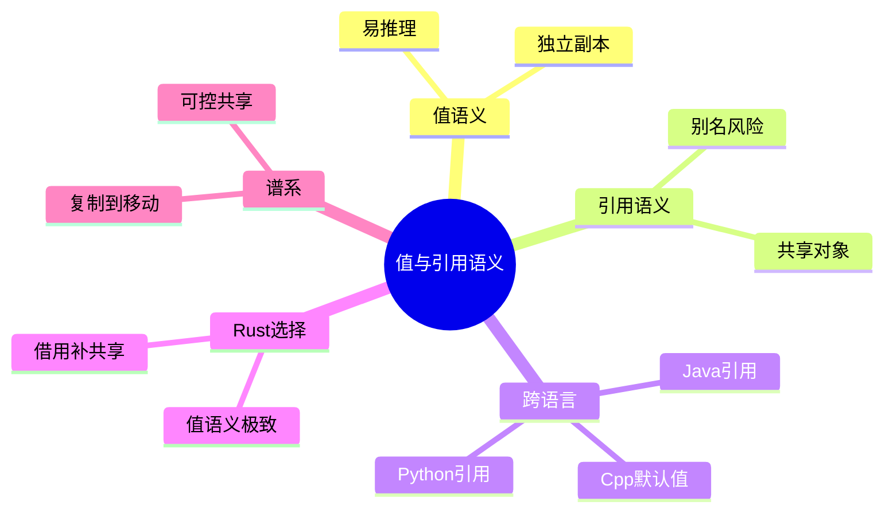

> **内容分级**: [综述级]
>
# 值语义 vs 引用语义：从 C++、Java、Python 到 Rust
>
> **EN**: Value Semantics vs Reference Semantics
> **Summary**: A cross-language comparison of value semantics and reference semantics, positioning Rust's ownership model as an extreme form of value semantics.
> **Rust 版本**: 1.97.0+ (Edition 2024)
>
> **受众**: [初学者]
> **权威来源**: 本文件为 `concept/` 权威页。
> **层级**: L1 基础概念
> **A/S/P 标记**: C+S — Comparison + Structure
> **双维定位**: C×Ana
> **前置概念**: [Ownership](../01_ownership_borrow_lifetime/01_ownership.md) · [Variable Model](03_variable_model.md) · [学习指南](../../00_meta/04_navigation/07_learning_guide.md)
> **后置概念**: [Move Semantics](../01_ownership_borrow_lifetime/05_move_semantics.md) · [Borrowing](../01_ownership_borrow_lifetime/02_borrowing.md)
> **主要来源**:
> · [Rust Reference — Pointer Types](https://doc.rust-lang.org/reference/types/pointer.html) ·
> [Itanium C++ ABI](https://itanium-cxx-abi.github.io/cxx-abi/abi.html) ·
> [Jung et al. — RustBelt: Securing the Foundations of Rust](https://plv.mpi-sws.org/rustbelt/popl18/)
>
> [Pierce — TAPL, §13](https://www.cis.upenn.edu/~bcpierce/tapl/) ·
> [Cardelli & Wegner 1985 — On Understanding Types, Data Abstraction, and Polymorphism](https://doi.org/10.1145/6041.6042) ·
> [TRPL Ch 4 — What is Ownership?](https://doc.rust-lang.org/book/ch04-01-what-is-ownership.html) ·
> [cppreference — Value categories](https://en.cppreference.com/w/cpp/language/value_category) ·
> [Bjarne Stroustrup — New Value Terminology](https://www.stroustrup.com/terminology.pdf) ·
> [CppCon 2023 — Mateusz Pusz, Value Categories](https://www.youtube.com/watch?v=U7xx6gyaiio)
>
---

> **Bloom 层级**: L1-L4

---
> **权威来源**:
> [Rust Reference — Place Expressions and Value Expressions](https://doc.rust-lang.org/reference/expressions.html#place-expressions-and-value-expressions) ·
> [TRPL — What is Ownership?](https://doc.rust-lang.org/book/ch04-01-what-is-ownership.html) ·
> [TRPL — References and Borrowing](https://doc.rust-lang.org/book/ch04-02-references-and-borrowing.html)
>
> **权威来源对齐变更日志**: 2026-07-10 补充权威来源标注（Rust Reference、TRPL）

---

## 🧠 知识结构图



## 一、核心命题

> **变量赋值时，传递的到底是"值的副本"还是"引用（Reference）的副本"？
> 这个问题的答案把编程语言分成两大阵营：
> C++ 和 Rust 倾向于值语义；Java 和 Python 倾向于引用（Reference）语义。
> Rust 的所有权（Ownership）系统把值语义推向了极致：默认转移所有权，显式借用（Borrowing），编译期防止别名冲突。**

---

## 二、值语义
>
> (Source: [TRPL — What is Ownership?](https://doc.rust-lang.org/book/ch04-01-what-is-ownership.html))
（Value Semantics）

### 2.1 定义

> **值语义**：变量绑定的是值本身。赋值、传参时复制的是值的内容。

```cpp
// C++
int a = 42;
int b = a;  // b 是 a 的副本
b = 100;    // 不影响 a
std::cout << a; // 42
```

```rust
// Rust
let a = 42;
let b = a;  // b 是 a 的副本（i32 实现 Copy）
let b = 100; // 不影响 a
println!("{}", a); // 42
```

### 2.2 值语义的语言

- **C**：基本类型和 struct 都是值语义。
- **C++**：默认值语义，但可以通过指针/引用（Reference）实现引用语义。
- **Swift**：结构体（Struct）是值语义，类是引用语义。
- **Rust**：几乎所有类型默认都是值语义（包括 `String`、`Vec` 等堆分配类型，只是它们的 move 转移了所有权（Ownership））。

---

## 三、引用语义（Reference Semantics）

引用语义（reference semantics）是「变量持有指向共享数据的引用而非数据本身」的编程模型。本节从三个层面展开：

1. **定义**：引用语义下，赋值复制的是引用（别名），修改通过任何别名可见——Java/Python/C# 的对象默认语义；其代价是别名带来的可推理性下降（`f(a); g(a);` 后 `a` 的状态需全局分析）；
2. **引用语义的语言谱系**：Java（对象引用 + 原始值类型双轨）、Python（一切皆引用）、C#（`class` 引用 vs `struct` 值）——共同特征是 GC 承担引用目标的释放；
3. **Rust 的位置**：Rust **显式区分**——默认 move/值语义，引用语义通过 `&T`/`&mut T`（借用（Borrowing），编译期检查）或 `Rc`/`Arc`（共享所有权（Ownership），运行期计数）显式引入。引用在 Rust 是**带规则的工具**而非默认模型：借用规则把「别名 + 可变」的危险组合静态排除。

判定准则：需要共享时先问「谁拥有」——单所有者借用（Borrowing）用 `&`，多所有者用 `Rc`/`Arc`，跨线程必须 `Arc`。

### 3.1 定义

> **引用语义**：变量绑定的是对象的引用（地址）。赋值、传参时复制的是引用，多个变量可以指向同一个对象。

```python
# Python
a = [1, 2, 3]
b = a   # b 和 a 指向同一个列表对象
b[0] = 99
print(a)  # [99, 2, 3]
```

```java
// Java
List<Integer> a = new ArrayList<>(Arrays.asList(1, 2, 3));
List<Integer> b = a; // b 和 a 指向同一个对象
b.set(0, 99);
System.out.println(a); // [99, 2, 3]
```

### 3.2 引用语义的语言

- **Java**：对象都是引用语义，基本类型是值语义。
- **Python**：变量都是对象的引用。
- **JavaScript**：对象/数组是引用语义，基本类型是值语义。
- **Ruby**：所有变量都是对象的引用。

---

## 四、Rust：值语义的极致

> (Source: [Rust Reference — Place Expressions and Value Expressions](https://doc.rust-lang.org/reference/expressions.html#place-expressions-and-value-expressions))

### 4.1 默认行为

```rust
let s1 = String::from("hello");
let s2 = s1; // 不是复制，而是 move：所有权从 s1 转移到 s2
// println!("{}", s1); // ❌ 编译错误
```

Rust 的 `String` 看起来像引用语义语言中的对象，但行为完全不同（Rust Reference: [Moved and Copied Types](https://doc.rust-lang.org/reference/expressions.html#moved-and-copied-types)）：

- 赋值不复制数据，而是转移所有权（Ownership）。
- 不能有两个所有者同时存在。
- 如果需要共享，必须显式使用 `&T` / `&mut T` / `Rc<T>` / `Arc<T>`。

### 4.2 显式引用

```rust
let s1 = String::from("hello");
let s2 = &s1; // 显式借用
println!("{} {}", s1, s2); // ✅ 都可用
```

Rust 把"引用"从默认行为变成了显式选择，并通过生命周期（Lifetimes）和借用（Borrowing）规则保证安全。

---

## 五、核心对比

| 维度 | 值语义（C++/Rust） | 引用语义（Java/Python） | Rust 所有权（Ownership） |
|:---|:---|:---|:---|
| 赋值含义 | 复制值 / 转移所有权（Ownership） | 复制引用 | 转移所有权（默认） |
| 别名问题 | 无（每个变量独立） | 有（多个引用指向同一对象） | 编译期禁止可变别名 |
| 默认共享 | 不可共享 | 可共享 | 不可共享，需显式借用（Borrowing） |
| 内存管理 | RAII / 所有权（Ownership） | 垃圾回收 | 所有权 + RAII |
| 性能特征 | 可能复制大数据 | 只复制引用 | move 是 cheap，clone 是显式 |
| 安全性 | 复制开销，但无别名 bug | 可能有别名/数据竞争 | 编译期排除别名 bug |

---

## 六、值语义谱系

```text
C struct ............... 纯值语义，按位复制
C++ class .............. 值语义 + 拷贝/移动构造函数
Swift struct ........... 值语义，写时复制优化
Rust owned type ........ 值语义 + 所有权转移
Rust &T / &mut T ....... 显式受限引用
Java/Python object ..... 引用语义
```

> **关键洞察**：Rust 的独特之处在于，它把"值语义"从"复制数据"推进到"转移所有权（Ownership）"，从而在不使用垃圾回收的情况下，同时获得值语义的可预测性和引用语义的共享能力（通过显式借用（Borrowing））。

---

## 七、总结

- **L1**：值语义传递副本，引用语义传递引用；Rust 默认是值语义，`!Copy` 类型通过 move 转移所有权（Ownership）。
- **L2**：Rust 的所有权系统消除了引用语义语言中常见的别名 bug，同时通过显式借用（Borrowing）提供可控的共享。
- **L3**：Rust 把值语义推向了"所有权转移"的极端，用编译期约束替代了运行时（Runtime）的垃圾回收和手动同步，这是其在系统编程中实现内存安全（Memory Safety）的核心设计。

---

## 八、延伸阅读

- [TRPL: What Is Ownership?](https://doc.rust-lang.org/book/ch04-01-what-is-ownership.html)
- [TRPL: References and Borrowing](https://doc.rust-lang.org/book/ch04-02-references-and-borrowing.html)
- [Rust Reference: Place Expressions and Value Expressions](https://doc.rust-lang.org/reference/expressions.html#place-expressions-and-value-expressions)
- [Pierce TAPL, §13 — References](https://www.cis.upenn.edu/~bcpierce/tapl/)
- [Cardelli & Wegner — On Understanding Types, Data Abstraction, and Polymorphism](https://dl.acm.org/doi/10.1145/6041.6042)
- [cppreference: Value Categories](https://en.cppreference.com/w/cpp/language/value_category)
- [Bjarne Stroustrup — New Value Terminology](https://www.stroustrup.com/terminology.pdf)
- [CppCon 2023 — Mateusz Pusz: Value Categories](https://www.youtube.com/watch?v=U7xx6gyaiio)

---

## 国际权威参考 / International Authority References（P1 学术 · P2 生态）

> 依据 `AGENTS.md` §2「对齐网络国际化权威内容」补充：仅追加已验证可达的权威链接，不改动正文事实。

- **P2 生态/社区**: [Learn Rust With Entirely Too Many Linked Lists](https://rust-unofficial.github.io/too-many-lists/)

## 📋 关键属性

| 属性 | 取值 / 判定 | 依据 |
|---|---|---|
| 默认语义 | 复合类型默认按值 move / copy | 所有权模型 |
| 引用方式 | 借用 `&T`/`&mut T` 或共享指针 `Rc`/`Arc`，需显式标注 | 区别于 Java/Python 默认引用语义 |
| 别名规则 | `&mut` 独占、任意多 `&` 共享，编译期强制 | 借用检查器 |
| 内存位置 | 值语义对象可完整驻留栈帧，无强制堆分配 | 零成本抽象（Zero-Cost Abstraction） |
| 拷贝语义 | 无隐式拷贝构造；复制需 `Copy` / `Clone` | trait 契约 |

## 🔗 概念关系

- **上位（is-a）**：[Variable Model](03_variable_model.md) 变量绑定模型的语义谱系。
- **下位（实例）**：Rust move 作为值语义极值的实例分析见 [Move Semantics](../01_ownership_borrow_lifetime/05_move_semantics.md)。
- **对偶**：与引用语义语言（Java/Python）的对象模型相对，见 [Rust vs C++](../../05_comparative/01_systems_languages/01_rust_vs_cpp.md)。
- **组合**：与 [Ownership](../01_ownership_borrow_lifetime/01_ownership.md) 共同定义对象生命周期（Lifetimes）边界。
- **依赖**：跨线程值共享合法性依赖 [Send/Sync](../../03_advanced/00_concurrency/02_send_sync_auto_traits.md) auto trait。

---

## ⚠️ 反例与陷阱：同时存在两个可变引用

**反例**（rustc 1.97 实测编译失败：E0499）：

```rust,compile_fail
fn main() {
    let mut v = vec![1];
    let a = &mut v;
    let b = &mut v;
    a.push(2);
    b.push(3);
}
```

同一时刻最多一个 `&mut`；第二个可变借用（Mutable Borrow）被借用检查器拒绝，这是引用语义与 C++ 引用别名的根本差异。

**修正**：

```rust
fn main() {
    let mut v = vec![1];
    {
        let a = &mut v;
        a.push(2);
    }
    let b = &mut v;
    b.push(3);
}
```

---

## 认知路径

> **认知路径**: 从 Rust 默认的值语义（move/copy）出发，对比引用语义语言的隐式引用，理解所有权、借用与生命周期的设计动机。

### 核心推理链

| 定理 | 前提 | 结论 | 置信度 |
|:---|:---|:---|:---|
| 默认 move 语义 ⟹ 单一所有者 | 无显式 `&`/`Rc` 时值被移动 | 编译期即可追踪资源释放 | 高 |
| 显式借用 `&`/`&mut` ⟹ 受控别名 | 需要共享读或独占写 | 借用检查器阻止数据竞争 | 高 |
| `Copy` trait 改变语义 ⟹ 值语义可退化为拷贝 | 标量/不可变聚合实现 `Copy` | 保持 C 式按值传递效率 | 高 |

> **过渡**: 理解值语义后，可深入学习 move 语义与 `Copy`/`Clone` 的区别，避免在泛型代码中错误假设拷贝行为。
> **过渡**: 掌握引用语义后，可进一步学习 `&` 与 `&mut` 的独占/共享规则，以及 NLL、Two-Phase Borrows 等细化模型。
> **过渡**: 将值/引用语义与跨线程 `Send`/`Sync` 结合，可理解为什么 `Rc` 不 `Send` 而 `Arc` 可以跨线程共享。

> 悬垂引用避免 ⟸ 生命周期与所有权显式化 ⟸ 默认值语义 + 显式借用
> 并发数据竞争减少 ⟸ &mut 独占写 / & 共享读 ⟸ 编译期别名规则

---

## 反命题与边界

> **反命题**: "Rust 中所有复合类型都默认按引用传递，像 Java 一样。" —— 错误。Rust 默认按值 move（或按 `Copy` 拷贝），引用必须通过 `&`/`&mut` 显式创建；函数参数不会自动共享。
> **边界**: `Rc`/`Arc` 提供共享所有权，但只改变所有权计数不改变借用规则；内部可变性仍需 `Cell`/`RefCell`/`Mutex` 等额外机制。
