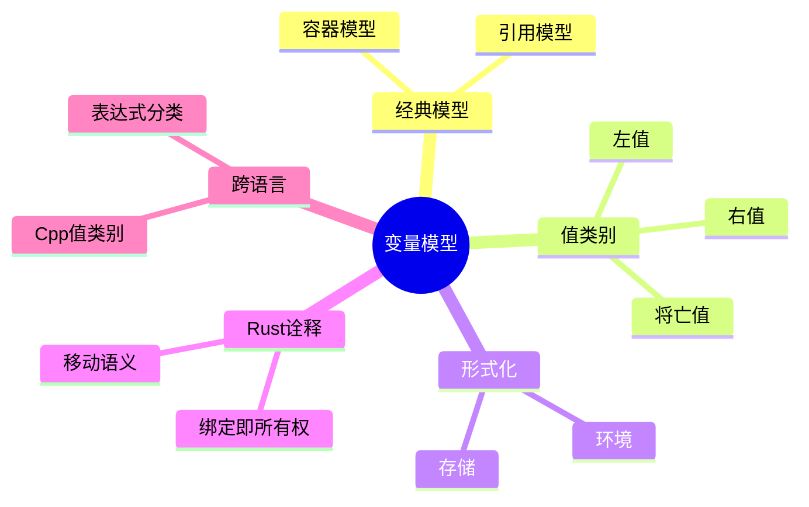

> **内容分级**: [综述级]
> **本节关键术语**: 变量绑定 (Variable Binding) · 可变性 (Mutability) · 遮蔽 (Shadowing) · 常量 (Constant) · 静态变量 (Static) — [完整对照表](../../00_meta/01_terminology/01_terminology_glossary.md)
>
# 变量模型：从通用 PL 视角看 Rust 的所有权
>
> **EN**: Variable Model
> **Summary**: Rust's variable bindings, mutability, shadowing, and move/copy semantics.
>
> 在环境模型中，变量绑定将**名字**映射到**值**。
> 赋值操作改变的是变量在当前环境中的绑定关系。
> ```text 环境 E: 名字 → 值 赋值: E[x] := v  （改变环境中 x 的映射）``` **典型语言**:
> Scheme、Python、JavaScript **特征**: - 变量是环境的条目，不是存储位置 - 赋值 = 重新绑定名字到新的值 - 多个名字可以引用（Reference）同一个值（共享/别名） 在存储模型中，
> 变量绑定将**名字**映射到**存储地址**，存储地址再指向**值**。
> 赋值操作改变的是存储中的内容。
>
> ```text 环境 E: 名字 → 存储地址 存储 S: 地址 →
> **受众**: [初学者]
> **权威来源**: 本文件为 `concept/` 权威页。
> **层级**: L1 基础概念 — 通用编程语言机制
> **A/S/P 标记**: **S** — Structure
> **双维定位**: C×Und — 理解变量在编程语言中的通用语义
> **前置概念**: [Ownership](../01_ownership_borrow_lifetime/01_ownership.md) · [Type System](../02_type_system/01_type_system.md)
> **后置概念**: [Borrowing](../01_ownership_borrow_lifetime/02_borrowing.md) · [Memory Management](../../02_intermediate/02_memory_management/01_memory_management.md) · [Evaluation Strategies](../../04_formal/03_operational_semantics/04_evaluation_strategies.md)
> **主要来源**: · [Itanium C++ ABI](https://itanium-cxx-abi.github.io/cxx-abi/abi.html)

[Pierce — TAPL](https://www.cis.upenn.edu/~bcpierce/tapl/) ·
[Harper — PFPL](https://www.cs.cmu.edu/~rwh/pfpl/) ·
[Felleisen & Flatt — PLAI](https://cs.brown.edu/~sk/Publications/Books/ProgLangs/) ·
[Wikipedia: Evaluation strategy](https://en.wikipedia.org/wiki/Evaluation_strategy) ·
[TRPL — Variables and Mutability](https://doc.rust-lang.org/book/ch03-01-variables-and-mutability.html)

>
> **来源**: [TRPL — Variables and Mutability](https://doc.rust-lang.org/book/ch03-01-variables-and-mutability.html) · [TRPL — Data Types](https://doc.rust-lang.org/book/ch03-02-data-types.html)
---

> **Bloom 层级**: L1-L4

---

## 🧠 知识结构图



## 一、核心命题

> **变量不是内存地址的别名，而是环境（Environment）中名字与存储（Store）中资源之间的映射关系。
> Rust 的所有权（Ownership）系统，本质上是将这一映射关系从隐式（C/C++）提升为显式、可检查、可推理的形式化契约。**

---

## 二、通用 PL 视角：变量的两种经典模型

程序语言理论中，变量有两种经典语义模型，Rust 的所有权体系可以精确地定位为其中一种的线性化扩展：

1. **环境模型（Environment Model）**：变量是「名字 → 值」的直接映射，赋值即替换映射中的值。这是多数脚本语言（Python、Ruby）的直觉模型，简单但无法表达「两个名字共享同一存储」的别名现象。
2. **存储模型（Store Model）**：环境是「名字 → 地址」，存储（store）是「地址 → 值」的两级映射。赋值修改存储，别名 = 两个名字映射到同一地址。C/C++ 的变量语义即此模型，它解释了指针与别名的来源，但也正是悬垂指针、use-after-free 的温床——语言不约束地址的存活。
3. **Rust 的所有权 = 存储模型的线性扩展**：Rust 保留两级映射，但在类型系统中附加线性约束——每个地址在同一时刻至多被一个名字「拥有」，move 即把「名字 → 地址」的映射从环境中原子地转移到新名字。别名只允许以受检的借用形式临时存在。

判定一段代码适用哪种模型的解释，只需问：赋值 `a = b` 之后，`b` 是否仍可用？仍可用是环境/普通存储模型；不可用（非 `Copy`）则是 Rust 的线性存储模型。

### 2.1 环境模型（Environment Model）

在环境模型中，变量绑定将**名字**映射到**值**。
赋值操作改变的是变量在当前环境中的绑定关系。

```text
环境 E: 名字 → 值
赋值: E[x] := v  （改变环境中 x 的映射）
```

**典型语言**: Scheme、Python、JavaScript（Felleisen & Flatt, *PLAI*, Ch. 4）

**特征**:

- 变量是环境的条目，不是存储位置
- 赋值 = 重新绑定名字到新的值
- 多个名字可以引用（Reference）同一个值（共享/别名）

### 2.2 存储模型（Store Model）

在存储模型中，变量绑定将**名字**映射到**存储地址**，存储地址再指向**值**。
赋值操作改变的是存储中的内容。

```text
环境 E: 名字 → 存储地址
存储 S: 地址 → 值
赋值: S[E[x]] := v  （改变存储中的内容，环境不变）
```

**典型语言**: C、C++、Java、Rust（Harper, *PFPL*, Ch. 34）

**特征**:

- 变量 = 名字 + 存储位置（L-value）
- 赋值 = 存储更新（mutation）
- 指针/引用（Reference） = 存储地址的显式操作

### 2.3 Rust 的所有权：存储模型的线性扩展

Rust 在存储模型之上增加了**线性约束**（所有权（Ownership）规则）：

```text
环境 E: 名字 → 资源标识符
资源表 R: 标识符 → (值, 所有权状态)
所有权状态: Own | Moved | Borrowed(&) | Borrowed(&mut) | Dropped
```

**关键差异**:

| 维度 | C/C++ 存储模型 | Rust 所有权（Ownership）模型 |
| :--- | :--- | :--- |
| 资源标识 | 隐式（地址即资源） | 显式（编译器追踪每个资源） |
| 别名管理 | 程序员手动控制 | 编译器静态检查（AXM 规则） |
| 移动语义 | 可选（C++11 `std::move`） | 默认（非 `Copy` 类型自动移动） |
| 资源释放 | 手动（`free`/`delete`）或 RAII | 编译器插入 `drop`（确定性析构） |
| 空悬指针 | 运行时（Runtime）错误（UAF） | 编译期错误（borrow checker） |

> **关键洞察**:
> Rust 不是发明了新的变量模型，而是将 C++ 的 RAII + 移动语义从**工程约定**提升为**类型系统（Type System）公理**——违反规则 = 编译失败。RustBelt 将这种模型形式化为基于 Iris 的分离逻辑（[Jung et al., POPL 2018](https://plv.mpi-sws.org/rustbelt/popl18/)）。

---

## 三、值类别（Value Categories）：从 C++ 到 Rust

值类别（value categories）回答「一个表达式能否出现在赋值左侧、能否取地址、能否被 move」的问题。C++ 与 Rust 给出两套同源但简繁不同的分类：

- **C++ 的值类别体系**：自 C++11 起细分为 lvalue / xvalue / prvalue（及归纳类别 glvalue / rvalue），与引用限定符（`&`、`&&`）和重载决议深度耦合。五分类的复杂性来自「既要支持移动语义又要兼容历史代码」——xvalue 是「即将消亡但身份仍存」的折中类别。
- **Rust 的表达式分类**：只分 **place expression**（位置表达式，对应广义的 lvalue：变量、字段访问、解引用、索引）与 **value expression**（值表达式，对应 rvalue：字面量、算术结果、函数调用返回值）。move 语义使 C++ 的 xvalue 成为多余——「将被 move」不是表达式的固有类别，而是由上下文（最后一次使用）决定。

对应关系：C++ lvalue ≈ Rust place expression；C++ prvalue ≈ Rust value expression；C++ xvalue 在 Rust 中由「place expression 出现在 move 上下文」这一组合表达。判定一个 Rust 表达式是否为 place expression，标准是：它是否表示一个持久的内存位置——`x`、`s.field`、`*p`、`v[i]` 是；`x + 1`、`String::new()` 不是。

### 3.1 C++ 的值类别体系

C++11 引入了精细的值类别体系：

```text
表达式
├── glvalue（广义左值）
│   ├── lvalue（左值）: 可寻址的持久对象
│   └── xvalue（将亡值）: 即将被移动的资源（std::move 结果）
└── rvalue（右值）
    ├── xvalue（将亡值）
    └── prvalue（纯右值）: 临时对象/字面量
```

**核心用途**: 确定表达式是否可以被移动、是否可以取地址、是否可以绑定到引用（Reference）。

### 3.2 Rust 的表达式分类

Rust 采用更简化的二元分类：

| C++ 类别 | Rust 对应 | 说明 |
| :--- | :--- | :--- |
| lvalue | **place expression** | 表示内存位置的表达式（变量、解引用（Reference）、索引） |
| prvalue | **value expression** | 表示值的表达式（字面量、函数调用、运算符结果） |
| xvalue | **无直接对应** | Rust 的 `move` 是编译期语义，不产生特殊表达式类别 |

**关键差异**:

- C++ `std::move(x)` 产生 xvalue（类型转换，x 仍可访问）
- Rust 的 `move` 是真实语义转移（x 被标记为 moved-from，编译器禁止后续访问）

```rust
// C++: std::move 后 obj 仍可访问（值未指定）
// auto moved = std::move(obj); // obj 是 xvalue，但 obj 本身仍存在

// Rust: move 后编译器禁止访问
let s1 = String::from("hello");
let s2 = s1; // s1 的所有权转移到 s2
// println!("{}", s1); // ❌ 编译错误: value borrowed here after move
```

> **形式化命题** [Tier 3]: Rust 消除了 C++ 的 xvalue 类别，因为 Rust 的移动语义在编译期完成（标记 moved-from），无需运行时（Runtime）区分"将亡值"和"普通值"。
>
> **论证**: C++ 需要 xvalue 是因为 `std::move` 只是类型转换，对象的生命周期（Lifetimes）由程序员控制；Rust 的移动是所有权（Ownership）转移，由编译器保证原变量不可访问。

---

## 四、值语义 vs 引用语义

Rust 把值语义（value semantics）推到了谱系的极端端点，本节先给出通用 PL 谱系再定位 Rust 的位置：

**通用 PL 谱系**（从「一切皆共享」到「一切皆复制/移动」）：

| 端点 | 代表语言 | 默认语义 |
|:---|:---|:---|
| 纯引用语义 | Python、Ruby、JavaScript | 变量恒为引用，赋值共享对象 |
| 混合 | Java、C# | 原始类型值语义 + 对象引用语义 |
| 可配置 | C++ | 默认值语义（拷贝构造），可选手写移动/引用 |
| 极端值语义 | **Rust** | 默认 move（唯一所有权），共享必须显式借用 |

**Rust 的「极端」之处**在于：默认值语义 + 无隐式拷贝构造函数。C++ 的 `T b = a;` 可能调用用户定义的拷贝构造（任意副作用），Rust 的 `let b = a;` 只有两种可能——`Copy` 类型的按位复制（无副作用，可证明），或 move（所有权转移，`a` 失效）。共享状态必须经过类型系统可见的借用或显式的 `Rc`/`Arc`，不存在「悄悄共享」的第三条路。

判定依据：给定 `let b = a;`，查 `a` 的类型是否实现 `Copy`——是则为按位复制且 `a` 仍可用；否则为 move 且 `a` 自此不可用。两种情形都不调用任何用户代码。

### 4.1 通用 PL 谱系

| 语义 | 赋值含义 | 典型语言 | 特征 |
| :--- | :--- | :--- | :--- |
| **值语义** | 拷贝值 | C、C++、Rust、Swift、Go | 独立副本，无副作用 |
| **引用（Reference）语义** | 共享引用 | Java、Python、JavaScript、Ruby | 共享对象，赋值传播副作用 |
| **混合语义** | 依类型而定 | C++、Swift、Rust | 值类型（struct）vs 引用（Reference）类型（class/pointer） |

### 4.2 Rust 的极端值语义

Rust 将值语义推向了极端：

```rust
let x = vec![1, 2, 3]; // x 拥有 Vec 的所有权
let y = x;              // y 获得所有权，x 被标记为 moved-from
// x 不能再使用 —— 编译器保证无双重释放
```

这与 C++ 形成鲜明对比：

```cpp
std::vector<int> x = {1, 2, 3};
auto y = std::move(x); // y 获得资源，x 变为"有效但未指定状态"
// x 仍可使用（如 x.empty()），但不能依赖其内容
```

**对比矩阵**:

| 操作 | C++ | Rust |
| :--- | :--- | :--- |
| `let y = x;` | 调用拷贝构造函数（深拷贝） | 若 `Copy`: 位拷贝；若非 `Copy`: 移动（所有权（Ownership）转移） |
| `y = x;` | 调用拷贝/移动赋值运算符 | 若 `Copy`: 位拷贝；若非 `Copy`: 编译错误（x 已移动） |
| `&x` | 取地址（L-value → 指针） | 借用（Borrowing）（创建 `&T` 或 `&mut T`） |
| `x` 使用后被丢弃 | 析构函数自动调用（RAII） | `drop` 自动调用（确定性析构） |
| 空悬引用（Reference） | 运行时（Runtime）错误（UB） | 编译期错误（borrow checker） |

---

## 五、环境（Environment）与存储（Store）的形式化

本节从操作语义中的环境-存储模型 与  Rust 的所有权作为环境-存储约束 两个层面剖析「环境（Environment）与存储（Store）的形式化」。

### 5.1 操作语义中的环境-存储模型

在形式化语义中，程序状态由二元组 `(E, S)` 表示：

```text
E: Var → Loc        （环境：变量名到存储位置的映射）
S: Loc → Val        （存储：存储位置到值的映射）
```

**变量查找**: `E(x)` 找到位置 `l`，然后 `S(l)` 找到值 `v`

**赋值**: `x := v` 更新 `S[E(x)] := v`，环境 `E` 不变

### 5.2 Rust 的所有权作为环境-存储约束

Rust 的 borrow checker 在编译期维护一个**扩展的环境-存储模型**：

```text
E: Var → (Loc, Ownership)
S: Loc → (Val, BorrowState)

Ownership: Own | Moved
BorrowState: None | Shared(usize) | Exclusive
```

**编译期检查规则**:

| 操作 | 前置条件 | 后置状态 |
| :--- | :--- | :--- |
| `let x = val;` | — | `E(x) = (l, Own)`, `S(l) = (val, None)` |
| `let y = x;` | `E(x).ownership = Own`, `x: !Copy` | `E(x).ownership = Moved`, `E(y) = (l, Own)` |
| `let r = &x;` | `E(x).ownership = Own`, `S(l).borrow = None/Shared` | `S(l).borrow = Shared(n+1)` |
| `let r = &mut x;` | `E(x).ownership = Own`, `S(l).borrow = None` | `S(l).borrow = Exclusive` |
| `drop(x)` | `E(x).ownership = Own` | `S(l)` 释放，`E(x).ownership = Moved` |

> **定理** [Tier 2]: 在上述模型中，若程序通过 borrow checker，则运行时（Runtime）永远不会出现 use-after-free 或 double-free。
> **证明草图**:
>
> 1. `Moved` 状态禁止任何读取/写入/借用（Borrowing）操作（编译期拒绝）
> 2. `Exclusive` 借用（Borrowing）期间禁止其他借用或移动（编译期拒绝）
> 3. `Shared` 借用（Borrowing）期间禁止 `Exclusive` 借用或移动（编译期拒绝）
> 4. `drop` 只能对 `Own` 状态调用，且调用后变为 `Moved`
> 5. ∴ 每个存储位置最多被释放一次，且释放后不可访问 来源: [RustBelt — POPL 2018](https://plv.mpi-sws.org/rustbelt/popl18/)

---

## 六、L-value 与 R-value 的 Rust 诠释

本节围绕「L-value 与 R-value 的 Rust 诠释」展开，覆盖 C 语言的 L/R-value 起源 与  Rust 的 place expression 与 value exp… 两个方面。

### 6.1 C 语言的 L/R-value 起源

- **L-value**: 可以出现在赋值左侧的表达式（有地址的对象）
- **R-value**: 只能出现在赋值右侧的表达式（值本身）

### 6.2 Rust 的 place expression 与 value expression

| C/C++ | Rust |
| :--- | :--- | :--- |
| 左侧 | L-value | **place expression** |
| 右侧 | R-value | **value expression** |
| 核心特征 | 可寻址 | 表示内存位置 |

**Rust place expression 的种类**:

- 变量名：`x`
- 解引用（Reference）：`*expr`（当 expr 是指针/引用时）
- 索引：`expr[index]`
- 字段访问：`expr.field`
- 元组索引：`expr.0`

**关键限制**: `&` 运算符只能应用于 place expression。

```rust
let x = 5;
let r1 = &x;       // ✅ x 是 place expression
let r2 = &(x + 1); // ❌ x + 1 是 value expression，不能取引用
// 正确: let r2 = &(x + 1); // 编译错误
// 正确: let temp = x + 1; let r2 = &temp;
```

> **与 C++ 的对比**: C++ 允许 `int& r = (x + 1);` 绑定到临时对象（const 引用（Reference）延长生命周期（Lifetimes）），Rust 完全禁止此操作——这是 Rust "显式优于隐式"设计哲学的体现。

---

## 七、反例与边界测试

「反例与边界测试」部分按反例：混淆绑定与赋值、边界测试：Move 后的环境-存储状态与边界测试：引用与指针的语义差异的顺序逐层展开。

### 7.1 反例：混淆绑定与赋值

```rust,compile_fail
// 错误：试图在 Rust 中重新绑定不可变变量
fn rebind_vs_assign() {
    let x = 5;
    x = 6; // ❌ 编译错误: cannot assign twice to immutable variable

    // 正确: 使用 mut
    let mut y = 5;
    y = 6; // ✅ 这是存储更新，不是重新绑定
}
```

> **关键洞察**: Rust 的 `let mut x = 5; x = 6;` 是**存储模型**的赋值（更新存储中的值），而 `let x = 5; let x = 6;`（shadowing）是**环境模型**的重新绑定（创建新环境条目）。这是两种变量模型在同一语言中的共存。[💡 原创分析](../../00_meta/00_framework/methodology.md)

### 7.2 边界测试：Move 后的环境-存储状态

```rust
fn move_semantics_state() {
    let s1 = String::from("hello"); // E(s1) = (l1, Own), S(l1) = ("hello", None)
    let s2 = s1;                     // E(s1) = (l1, Moved), E(s2) = (l1, Own)

    // println!("{}", s1); // ❌ 编译错误: value used here after move

    // 但 s1 在环境中仍然存在！只是其 ownership 状态为 Moved
    let s1 = String::from("new"); // shadowing: 新 E(s1) = (l2, Own)
    // 原 l1 将在 s2 离开作用域时由 s2 的 drop 释放
}
```

> **边界洞察**: Rust 的 shadowing 不是赋值，而是环境模型的重新绑定。这与 C/C++ 的变量重用完全不同。

### 7.3 边界测试：引用与指针的语义差异

```rust
fn reference_vs_pointer() {
    let x = 5;
    let r = &x;  // Rust: r 是对 x 的借用，编译器追踪生命周期

    // C 等价:
    // int x = 5;
    // int *r = &x; // C: r 是裸指针，编译器不追踪生命周期

    // 关键差异: Rust 的 &x 不是"取地址"，而是"创建受约束的借用"
    // 编译器保证 r 的生命周期不超过 x 的生命周期
}
```

---

## 八、跨语言变量模型对比矩阵

| 维度 | C | C++ | Java | Python | Rust |
|:---|:---|:---|:---|:---|:---|
| **变量模型** | 存储模型 | 存储模型 + RAII | 引用（Reference）模型（变量 = 对象引用） | 名字-值绑定 | 存储模型 + 线性所有权（Ownership） |
| **赋值语义** | 存储更新 | 存储更新 / 移动构造 | 引用重绑定 | 名字重新绑定 | 存储更新（Copy）/ 所有权（Ownership）转移（Move） |
| **别名管理** | 手动（指针） | 手动（指针/引用（Reference）） | 自动（GC） | 自动（GC） | 编译器静态检查 |
| **空悬指针** | 运行时（Runtime） UB | 运行时 UB | 不可能（GC） | 不可能（GC） | 编译期错误 |
| **内存泄漏** | 可能 | 可能（循环引用） | 可能（循环引用） | 可能（循环引用） | 可能（Rc 循环引用） |
| **确定性析构** | 否（手动 free） | 是（RAII） | 否（GC） | 否（GC） | 是（drop 自动插入） |
| **值类别** | L/R-value | L/xvalue/prvalue | 无 | 无 | place / value expression |

---

## 九、知识来源关系

| **论断** | **来源** | **可信度** | **Tier** |
|:---|:---|:---:|:---:|
| 环境模型与存储模型 | [SICP Ch.3] · [Pierce TAPL §13] | ✅ | Tier 1 |
| Rust 所有权（Ownership） = 存储模型 + 线性约束 | [RustBelt — POPL 2018](https://plv.mpi-sws.org/rustbelt/popl18/) · [LL87] | ✅ | Tier 1 |
| C++ 值类别体系 | [C++ Standard §7.2.1] | ✅ | Tier 1 |
| Rust place/value expression | [Rust Reference §8.2.8](https://doc.rust-lang.org/reference/introduction.html) | ✅ | Tier 1 |
| Rust 消除 xvalue 类别 | [💡 原创分析] | ⚠️ | Tier 3 |
| 变量模型对比矩阵 | [💡 原创分析] | ⚠️ | Tier 3 |

---

> **权威来源**: [Rust Reference](https://doc.rust-lang.org/reference/introduction.html) ·
> [TRPL](https://doc.rust-lang.org/book/ch03-01-variables-and-mutability.html) ·
> [Pierce TAPL](https://www.cis.upenn.edu/~bcpierce/tapl/) ·
> [RustBelt POPL 2018](https://plv.mpi-sws.org/rustbelt/popl18/) ·
> [SICP](https://mitp-content-server.mit.edu/books/content/sectbyfn/books_pres_0/6515/sicp.zip/full-text/book/book.html)
> **文档版本**: 1.0
> **Rust 版本**: 1.97.0+ (Edition 2024)
> **最后更新**: 2026-05-24
> **状态**: ✅ 新建 — 通用 PL 基座层

## 十、边界测试：变量模型的编译错误

本节从边界测试：`let` 与 `const` 的初始化差异（编译错误）、边界测试：`const` 与 `static` 的 `Drop` 限制…、边界测试：变量遮蔽（shadowing）与不可变引用的冲突（编译错误）、边界测试：未初始化变量的强制使用（编译错误）等6个方面切入，剖析「边界测试：变量模型的编译错误」的核心内容。

### 10.1 边界测试：`let` 与 `const` 的初始化差异（编译错误）

```rust,compile_fail
fn main() {
    let x: i32;
    // ❌ 编译错误: borrow of possibly-uninitialized variable: `x`
    // let 变量允许未初始化，但使用前必须赋值
    println!("{}", x);
}

// 正确: 使用前初始化
fn fixed() {
    let x: i32;
    x = 42; // ✅ 赋值后可用
    println!("{}", x);
}
```

> **修正**: Rust 的 `let` 绑定允许延迟初始化（declarative without immediate initialization），但编译器通过" definite assignment analysis "确保变量在使用前已被赋值。这与 C/C++ 的未初始化变量（包含垃圾值）形成鲜明对比——Rust 在编译期阻止使用未初始化变量。[来源: [Rust Reference](https://doc.rust-lang.org/reference/introduction.html)]

### 10.2 边界测试：`const` 与 `static` 的 `Drop` 限制（编译错误）

```rust,ignore
struct Resource {
    data: String,
}

impl Drop for Resource {
    fn drop(&mut self) {
        println!("dropping");
    }
}

const CONST_RES: Resource = Resource {
    data: String::new(),
}; // ❌ 编译错误: `String` 未实现 `Copy`
// const 要求值是编译期可求值的，且不能包含非 Copy 的 Drop 类型

// ⚠️ 警告: `static mut` 在 Rust 2024 Edition 中 `static_mut_refs` 已升级为 deny-by-default。
//    生产代码应优先使用 `std::sync::OnceLock` 或 `std::sync::LazyLock`。
//    此处保留仅作为历史用法演示。
static mut STATIC_RES: Option<Resource> = None;

fn init() {
    unsafe {
        STATIC_RES = Some(Resource { data: String::from("hello") });
    }
}

// ✅ 2024 Edition 推荐写法（无需 unsafe）:
// static STATIC_RES_NEW: std::sync::OnceLock<Resource> = std::sync::OnceLock::new();
```

> **修正**: `const` 变量在编译期求值并内联到使用处，要求值实现 `Copy` 或 `'static` 且不含运行时（Runtime）分配。`static` 变量在数据段分配，允许非 `Copy` 类型，但初始化必须是编译期常量（Rust 1.83+ 的 `const {}` 块放宽了部分限制）。`String`、`Vec` 等堆分配类型不能作为 `const`。[来源: [Rust Reference](https://doc.rust-lang.org/reference/introduction.html)]

### 10.3 边界测试：变量遮蔽（shadowing）与不可变引用的冲突（编译错误）

```rust,ignore
fn main() {
    let x = 5;
    let r = &x;
    let x = x + 1; // 遮蔽，创建新变量
    // ❌ 编译错误: r 仍引用旧的 x，但旧 x 未被移动或释放
    // 实际上此代码编译通过，因为遮蔽不改变原变量的生命周期
    println!("{} {}", r, x);
}
```

> **修正**: Rust 的**变量遮蔽**（shadowing）允许在同一作用域内用相同名称声明新变量。遮蔽不是赋值——它创建全新的绑定，原绑定仍有效（直到作用域结束）。`let x = x + 1` 后，`r` 仍引用旧的 `x`，因为旧 `x` 的生命周期（Lifetimes）未改变。这与 C/Java 的变量重声明（同一作用域内非法）或 Python 的变量重新绑定（无生命周期概念）不同——Rust 的遮蔽是安全的，因为每个绑定有独立的生命周期，编译器追踪所有活跃绑定。但遮蔽可能导致困惑：阅读代码时难以确定哪个 `x` 被使用。建议：在短作用域内使用遮蔽（如 `let x = x.trim()`），避免在长函数中多次遮蔽。[来源: [The Rust Programming Language](https://doc.rust-lang.org/book/ch03-01-variables-and-mutability.html)] · [来源: [Rust Reference — Shadowing](https://doc.rust-lang.org/reference/statements-and-expressions.html#let-statements)]

### 10.4 边界测试：未初始化变量的强制使用（编译错误）

```rust,compile_fail
fn main() {
    let x: i32;
    if some_condition() {
        x = 1;
    }
    // ❌ 编译错误: 若 some_condition() 为 false，x 未初始化
    println!("{}", x);
}

fn some_condition() -> bool { false }
```

> **修正**: Rust 编译器通过**流敏感分析**（flow-sensitive analysis）追踪变量初始化状态：在 `println!` 处，编译器检查所有控制流路径上 `x` 是否已初始化。若存在未初始化路径，编译错误。这与 C 的未初始化变量使用（编译器警告但不阻止，运行时（Runtime）读取垃圾值）或 Java 的局部变量（编译器检查，与 Rust 类似）不同——Rust 的初始化分析更精确：1) 考虑条件分支；2) 考虑循环；3) 考虑 `match` 分支。`MaybeUninit<T>` 允许显式处理未初始化状态，但使用 `unsafe`。这与 Swift 的 `let`/`var`（必须初始化，与 Rust 类似）或 Go 的变量声明（零值初始化，无未初始化概念）不同——Rust 在默认情况下禁止未初始化使用，但允许显式控制（`MaybeUninit`）。[来源: [The Rust Programming Language](https://doc.rust-lang.org/book/ch03-01-variables-and-mutability.html)] · [来源: [Rust Reference — Let Statements](https://doc.rust-lang.org/reference/statements-and-expressions.html#let-statements)]

### 10.5 边界测试：变量遮蔽与不可变重新绑定（编译错误）

```rust,compile_fail
fn main() {
    let x = 5;
    let x = x + 1; // 遮蔽（shadowing），创建新变量
    let x = x * 2; // 再次遮蔽
    println!("{}", x); // 12

    let mut y = 5;
    // ❌ 编译错误: 不能给不可变变量重新赋值
    y = 6; // 但 y 是 mut，所以这可以编译... 真正的错误:

    let z = 5;
    z = 6; // ❌ 编译错误: z 不是 mut
}
```

> **修正**: Rust 的**遮蔽**（shadowing）允许用同名变量隐藏前一个变量，但创建的是**全新变量**（新内存位置，新类型）。`let x = x + 1` 中右侧的 `x` 是旧变量（`i32`），左侧的 `x` 是新变量（也是 `i32`，但可以是不同类型：`let x = "hello"`）。遮蔽 vs 可变绑定：1) 遮蔽不改变原变量，只是名字复用；2) 可变绑定（`mut`）修改同一内存位置；3) 遮蔽允许类型变化，可变绑定不允许。常见选择：遮蔽用于类型转换（`let s = s.trim()`），`mut` 用于计数器/累加器。这与 JavaScript 的 `var`/`let`（同名变量覆盖，无遮蔽概念）或 Haskell 的 `let`（纯函数式，无赋值）不同——Rust 的遮蔽是函数式编程影响的设计，减少 `mut` 的使用。[来源: [The Rust Programming Language](https://doc.rust-lang.org/book/ch03-01-variables-and-mutability.html)] · [来源: [Rust Reference — Variables](https://doc.rust-lang.org/reference/statements.html#let-statements)]

### 10.6 边界测试：`Drop` 的顺序与变量声明顺序的依赖（逻辑错误）

```rust,ignore
struct Resource(&'static str);

impl Drop for Resource {
    fn drop(&mut self) {
        println!("dropping {}", self.0);
    }
}

fn main() {
    let a = Resource("a");
    let b = Resource("b");
    // drop 顺序: b 先，a 后（与声明顺序相反）
    // 若 a 的初始化依赖 b 的资源，b 先 drop 可能导致 a 的 drop 失败
}
```

> **修正**: Rust 的 **drop 顺序**：1) 变量按**声明顺序的逆序** drop（LIFO）；2) struct 字段按声明顺序 drop；3) tuple 元素按声明顺序 drop；4) 数组/vec 元素按索引顺序 drop；5) 闭包（Closures）捕获变量按未指定顺序 drop。依赖 drop 顺序的代码是脆弱的：不同 Rust 版本可能改变闭包捕获的 drop 顺序。安全模式：1) 使 drop 相互独立（不依赖其他变量的状态）；2) 使用 `ManuallyDrop` 显式控制；3) 用 `scopeguard` crate 的 `defer!` 明确清理顺序。这与 C++ 的析构顺序（局部变量逆序、成员按声明顺序）类似——但 Rust 的 `Drop::drop` 不接收参数，不能基于其他对象的状态进行条件清理。[来源: [The Rust Programming Language](https://doc.rust-lang.org/book/ch15-03-drop.html)] · [来源: [Rust Reference — Destructor Order](https://doc.rust-lang.org/reference/destructors.html)]

## 嵌入式测验（Embedded Quiz）

本节将「嵌入式测验（Embedded Quiz）」分解为若干主题：测验 1：在 Rust 中，`let x = 5;` 之后 `x` 绑…、测验 2：`let mut x = 5; x = 6;` 中，`x =…、测验 3：Rust 的变量绑定在离开作用域时会发生什么？谁负责释放资源…、测验 4：`Copy` trait 对变量模型有什么影响？实现 `Co…等5个方面。

### 测验 1：在 Rust 中，`let x = 5;` 之后 `x` 绑定到值 `5`。从变量模型角度看，`x` 是值的名称还是内存位置的名称？（理解层）

**题目**: 在 Rust 中，`let x = 5;` 之后 `x` 绑定到值 `5`。从变量模型角度看，`x` 是值的名称还是内存位置的名称？

<details>
<summary>✅ 答案与解析</summary>

`x` 是值的名称（binding）。Rust 变量绑定到值，而非内存位置。所有权（Ownership）系统决定值何时被释放。
</details>

---

### 测验 2：`let mut x = 5; x = 6;` 中，`x = 6` 是修改了原有内存，还是重新绑定了一个新值？（理解层）

**题目**: `let mut x = 5; x = 6;` 中，`x = 6` 是修改了原有内存，还是重新绑定了一个新值？

<details>
<summary>✅ 答案与解析</summary>

对于基本类型如 `i32`，是修改了绑定的值（覆盖）。对于非 `Copy` 类型如 `String`，`x = String::from("a")` 会先 drop 旧值，再绑定新值。
</details>

---

### 测验 3：Rust 的变量绑定在离开作用域时会发生什么？谁负责释放资源？（理解层）

**题目**: Rust 的变量绑定在离开作用域时会发生什么？谁负责释放资源？

<details>
<summary>✅ 答案与解析</summary>

绑定拥有的值会在作用域结束时通过 `Drop::drop` 自动释放。编译器插入 drop 调用，无需手动 free。
</details>

---

### 测验 4：`Copy` trait 对变量模型有什么影响？实现 `Copy` 的类型在赋值时行为有何不同？（理解层）

**题目**: `Copy` trait 对变量模型有什么影响？实现 `Copy` 的类型在赋值时行为有何不同？

<details>
<summary>✅ 答案与解析</summary>

`Copy` 类型赋值时按位复制（bitwise copy），原变量仍然有效。未实现 `Copy` 的类型赋值时发生 move，原变量失效。
</details>

---

### 测验 5：为什么 Rust 没有 C/C++ 意义上的"未初始化变量"读取？（理解层）

**题目**: 为什么 Rust 没有 C/C++ 意义上的"未初始化变量"读取？

<details>
<summary>✅ 答案与解析</summary>

Rust 编译器要求所有变量在使用前必须初始化。读取未初始化变量是编译错误，消除了使用野值的风险。
</details>

## 实践

> **相关资源**:
>
> - [crates/ 示例代码](../crates) — 与本文概念对应的可编译示例
> - [exercises/ 练习](../exercises) — 动手编程挑战
> - [MVP 学习路径](../../00_meta/04_navigation/08_learning_mvp_path.md) — 从零到多线程 CLI 的 40 小时路径
>
> **建议**: 阅读完本概念文件后，打开对应 crate 的示例代码，尝试修改并运行。完成至少 1 道相关练习以巩固理解。

## 权威来源对照

| 来源 | 与本节对应的核心论点 |
|:---|:---|
| [Felleisen & Flatt — PLAI](https://cs.brown.edu/~sk/Publications/Books/ProgLangs/) | 环境模型与存储模型在教学中的区分 |
| [Harper — PFPL](https://www.cs.cmu.edu/~rwh/pfpl/) | 命令式语言的存储语义与变量绑定形式化 |
| [Pierce — TAPL](https://www.cis.upenn.edu/~bcpierce/tapl/) | 引用类型、线性类型与别名控制 |
| [RustBelt (Jung et al., POPL 2018)](https://plv.mpi-sws.org/rustbelt/popl18/) | Rust 所有权（Ownership）模型的 Iris 分离逻辑形式化 |
| [TRPL — Variables and Mutability](https://doc.rust-lang.org/book/ch03-01-variables-and-mutability.html) | Rust 变量绑定与可变性实践 |

## 总结

- **L1**：变量是名字到值/存储地址的映射；Rust 在这一映射上增加了所有权（Ownership）状态。
- **L2**：Rust 用 `Copy`/`Move`/`Borrow`/`Drop` 显式管理资源生命周期（Lifetimes），替代了手动内存管理。
- **L3**：所有权不是新模型，而是把 C++ 的 RAII/move 约定提升为类型系统（Type System）公理，使内存安全（Memory Safety）可在编译期证明。

---

## 📋 关键属性

| 属性 | 取值 / 判定 | 依据 |
|---|---|---|
| 经典模型 | 环境模型（binding → value）vs 存储模型（binding → location） | 本文 §二 |
| Rust 定位 | 存储模型的线性扩展：每个存储位置有唯一所有者 | 本文 §2.3 |
| 表达式分类 | place expression（位置）vs value expression（值） | 本文 §六 |
| 值语义强度 | 极端值语义：赋值/传参默认 move，仅 `Copy` 类型隐式复制 | 本文 §四 |
| 初始化强制 | 未初始化变量的使用编译期拒绝 | 本文 §10.4 |

## 🔗 概念关系

- **上位（is-a）**：编程语言变量理论的模型分类。
- **下位（实例）**：环境模型、存储模型、Rust 线性存储模型、place/value 表达式分类。
- **组合**：与 [所有权](../01_ownership_borrow_lifetime/01_ownership.md)、[Move 语义](../01_ownership_borrow_lifetime/05_move_semantics.md) 直接对应（move = 存储位置的线性转移）。
- **依赖**：是 [副作用与纯度](../00_start/04_effects_and_purity.md) 推理的语义底座。

---

## 国际权威参考 / International Authority References（P1 学术 · P2 生态）

> 依据 `AGENTS.md` §2「对齐网络国际化权威内容」补充：仅追加已验证可达的权威链接，不改动正文事实。

- **P2 生态/社区**: [Learn Rust With Entirely Too Many Linked Lists](https://rust-unofficial.github.io/too-many-lists/)

---

## 相关概念

- [对应测验](../11_quizzes/29_quiz_pl_foundations.md) — 通用 PL 基座（变量模型、求值策略、效果、控制流、数据抽象）
