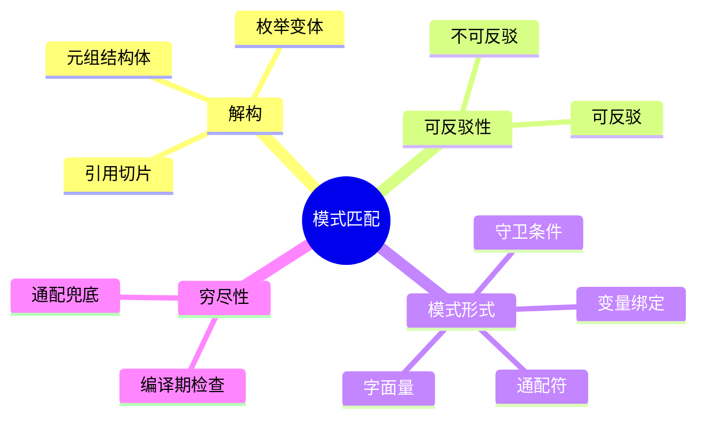

# 模式匹配（Patterns）

> **EN**: Patterns
> **Summary**: Rust 模式匹配的权威规范：解构、可反驳性、各种模式形式（literal、identifier、wildcard、rest、range、reference、struct、tuple、slice、path、or-patterns）及其绑定模式。 Authoritative specification of Rust pattern matching: destructuring, refutability, all pattern forms, and binding modes.
> **Rust 版本**: 1.97.0+ (Edition 2024)
>
> **受众**: [初学者]
> **内容分级**: [综述级]
> **Bloom 层级**: L2-L3
> **权威来源**: 本文件为 `concept/` 权威页。
> **A/S/P 标记**: **S** — Specification
> **双维定位**: S×App — 规范应用
> **前置依赖**: [Type System](../02_type_system/01_type_system.md) · [Control Flow](01_control_flow.md) · [Enums and Variants](../02_type_system/01_type_system.md)
> **后置概念**:
> [Match Expressions](04_statements_and_expressions.md) ·
> [Destructuring](../../02_intermediate/01_generics/01_generics.md) ·
> [Refutability Analysis](../../02_intermediate/04_types_and_conversions/04_type_system_advanced.md)
> **定理链**: Pattern → Refutability → Exhaustiveness
> **主要来源**:
> [Rust Reference — Patterns](https://doc.rust-lang.org/reference/patterns.html) ·
> [Pierce — Types and Programming Languages](https://www.cis.upenn.edu/~bcpierce/tapl/) ·
> [System F](https://en.wikipedia.org/wiki/System_F) ·
> [Brown University — Concepts in Rust Programming](https://cel.cs.brown.edu/crp/) ·
> [Brown Interactive Rust Book](https://rust-book.cs.brown.edu/) ·
> [Jung et al. — RustBelt: Securing the Foundations of Rust](https://plv.mpi-sws.org/rustbelt/popl18/) ·
> [TRPL — Patterns](https://doc.rust-lang.org/book/ch18-00-patterns.html) ·
> [Itanium C++ ABI](https://itanium-cxx-abi.github.io/cxx-abi/abi.html)
>
> **来源**: [Rust Reference — Patterns](https://doc.rust-lang.org/reference/patterns.html)

---
> **权威来源**: [Rust Reference — Patterns](https://doc.rust-lang.org/reference/patterns.html) · [TRPL — Patterns](https://doc.rust-lang.org/book/ch18-00-patterns.html)
>
> **权威来源对齐变更日志**: 2026-07-10 补充权威来源标注（Rust Reference、TRPL）

---

## 🧠 知识结构图



## 一、什么是模式

**模式（pattern）** 用于将值与结构进行匹配，并可选地将变量绑定到这些结构内部的值。模式还用于变量声明、函数/闭包（Closures）参数等场景。

模式常见于：

- `let` 声明
- 函数和闭包（Closures）参数
- `match` 表达式
- `if let` / `while let` 表达式
- `for` 表达式

---

## 二、解构（Destructuring）

模式可以**解构**结构体（Struct）、枚举（Enum）和元组，将值拆分为各个组成部分。

```rust
enum Message {
    Quit,
    WriteString(String),
    Move { x: i32, y: i32 },
    ChangeColor(u8, u8, u8),
}

let message = Message::WriteString(String::from("hi"));
match message {
    Message::Quit => println!("Quit"),
    Message::WriteString(write) => println!("{}", &write),
    Message::Move { x, y: 0 } => println!("move {} horizontally", x),
    Message::Move { .. } => println!("other move"),
    Message::ChangeColor { 0: red, 1: green, 2: _ } => {
        println!("color change, red: {}, green: {}", red, green);
    }
}
```

- `_` 匹配单个字段。
- `..` 匹配剩余所有字段。
- 命名字段可简写：`Move { x, y }` 等价于 `Move { x: x, y: y }`。

---

## 三、可反驳性

> (Source: [Rust Reference — Patterns](https://doc.rust-lang.org/reference/patterns.html))
（Refutability）

- **可反驳模式（refutable）**: 可能无法匹配被匹配的值。
- **不可反驳模式（irrefutable）**: 总是匹配被匹配的值。

```rust
let (x, y) = (1, 2);           // 不可反驳
if let (a, 3) = (1, 2) { }     // 可反驳
```

`let` 绑定和函数参数要求不可反驳模式；`if let`、`while let`、`match` 允许可反驳模式。

---

## 四、模式形式

本节系统枚举（Enum） Rust 模式（pattern）的全部形式。模式是「值的形状描述 + 可选的变量绑定」，出现在 `match`/`if let`/`let`/`for`/函数参数五个位置。核心形式：

- **字面量模式**：`42`、`"hello"`、`true`——按值相等匹配；
- **标识符模式**：`x` 绑定（默认 move/copy，`ref`/`ref mut` 改绑定方式）、`CONST` 路径常量（按值匹配，与绑定的区分靠命名解析）；
- **通配与剩余**：`_` 匹配不绑定、`..` 省略剩余字段/元素（每模式最多一次，元组中位置可推断）；
- **范围模式**：`1..=5`、`'a'..='z'`——仅整数/字符/浮点（浮点范围匹配已废弃，1.42+ 警告）；
- **绑定模式（binding modes）**：`match` 引用（Reference）时自动进入 `ref` 模式（default binding mode 切换）——`match &opt { Some(x) => ... }` 中 `x: &T` 无需手写 `ref`。

组合规则：模式可嵌套（结构体（Struct）/元组/枚举（Enum）解构）、可加守卫（`if` 条件，不参与穷尽性分析）、可用 `|` 或模式与 `@` 绑定（`x @ Some(_)`）。

### Literal patterns

匹配与字面量完全相同的值。总是可反驳。

```rust
let i = 3;
match i {
    -1 => println!("minus one"),
    1 => println!("one"),
    2 | 4 => println!("two or four"),
    _ => println!("other"),
}
```

### Identifier patterns

绑定匹配值到变量。单独使用 `x` 或带 `mut`、`ref`、`ref mut`：

```rust
let a = Some(10);
match a {
    Some(value) => (),      // move/copy
    Some(ref value) => (),  // 共享引用绑定
    None => (),
}
```

`x @ subpattern` 将匹配值绑定到 `x`，同时继续匹配子模式：

```rust
let x = 3;
match x {
    e @ 1..=5 => println!("range element {}", e),
    _ => (),
}
```

### 绑定模式（Binding modes）

当引用（Reference）值被非引用模式匹配（Pattern Matching）时，编译器会自动按 `ref` 或 `ref mut` 绑定，避免手动写 `&`。

```rust
let x: &Option<i32> = &Some(3);
if let Some(y) = x {
    // y 自动转为 ref y，类型为 &i32
}
```

### Wildcard pattern (`_`)

匹配任意单个值，不绑定、不 move、不借用（Borrowing）。总是不可反驳。

### Rest pattern (`..`)

匹配零个或多个剩余元素，用于元组、元组结构体（Struct）、切片（Slice）模式。不可反驳。

```rust
let slice: &[i32] = &[1, 2, 3];
match slice {
    [] => (),
    [one] => (),
    [head, tail @ ..] => (),
}
```

### Range patterns

匹配标量值范围：

- `a..b`：左闭右开
- `a..=b`：闭区间
- `a..`：从 `a` 到最大值
- `..b`：小于 `b`
- `..=b`：小于等于 `b`

范围必须非空。

### Reference patterns (`&` / `&mut`)

解引用（Reference）被匹配的指针并借用（Borrowing）它们。

```rust
let int_reference = &3;
let label = match int_reference {
    &0 => "zero",
    _ => "some",
};
```

### Struct / tuple struct / tuple patterns

用于解构结构体（Struct）、元组结构体、元组。未使用 `..` 时，结构体模式必须指定所有字段。

### Slice patterns

匹配固定大小数组或动态大小切片（Slice）。

```rust
let arr = [1, 2, 3];
match arr {
    [1, _, _] => (),
    [a, b, c] => (),
}
```

### Path patterns

指向常量、枚举（Enum）变体、结构体（Struct）（无字段）或关联常量的路径。

### Or-patterns (`|`)

匹配多个子模式之一：

```rust
let x = 2;
match x {
    1 | 2 | 3 => (),
    _ => (),
}
```

`let` 绑定和函数/闭包（Closures）参数中不允许使用 or-patterns。

---

## 五、穷尽性检查

Rust 编译器检查 `match` 表达式是否穷尽所有可能的值。不可穷尽的模式匹配（Pattern Matching）会导致编译错误。

---

## 六、相关概念

- **上层概念**: [Type System](../02_type_system/01_type_system.md) · [Control Flow](01_control_flow.md) · [Enums and Variants](../02_type_system/01_type_system.md)
- **下层概念**: [Match Expressions](04_statements_and_expressions.md) · [Destructuring](../../02_intermediate/01_generics/01_generics.md) · [Refutability Analysis](../../02_intermediate/04_types_and_conversions/04_type_system_advanced.md)

| 概念 | 关系 |
|:---|:---|
| [Match Expressions](04_statements_and_expressions.md) | 模式在 `match` 中应用 |
| [Enums and Variants](../02_type_system/01_type_system.md) | 枚举（Enum）变体是模式匹配（Pattern Matching）的主要对象 |
| [Destructuring](../../02_intermediate/01_generics/01_generics.md) | 模式解构与泛型（Generics）结合使用 |
| [Control Flow](01_control_flow.md) | `if let`、`while let`、`for` 依赖模式 |
| [Terminology Glossary](../../00_meta/01_terminology/01_terminology_glossary.md) | 术语表（元层参考） |

---

## 国际权威参考 / International Authority References（P2 生态）

> 依据 `AGENTS.md` §2「对齐网络国际化权威内容」补充：仅追加已验证可达的权威链接，不改动正文事实。

- **P2 生态/社区**: [Rust 官方博客 — Rust 1.65.0 发布公告（`let`-`else` 模式稳定化）](https://blog.rust-lang.org/2022/11/03/Rust-1.65.0.html)（2026-07-12 验证 HTTP 200）

---

## 嵌入式测验（Embedded Quiz）

> W3-b 补充（2026-07-12）：本页原无嵌入式测验，按四级题型规范补 3 题（🟢🟡🔴 各 1 题，`<details>` 折叠答案），内容与本页正文严格一致。

### 测验 1：通配符与 Rest 模式（🟢 基础）

关于 `_` 与 `..`，下列说法正确的是？

- A. `_` 匹配任意单个值，不绑定、不 move、不借用（Borrowing），总是不可反驳
- B. `_` 会把匹配到的值绑定到名为 `_` 的变量
- C. `..` 只能匹配恰好一个剩余元素
- D. `_` 是可反驳模式

<details>
<summary>✅ 答案</summary>

**A 正确**。按本页「模式形式」：Wildcard pattern（`_`）匹配任意单个值，不绑定、不 move、不借用（Borrowing），**总是不可反驳**；Rest pattern（`..`）匹配**零个或多个**剩余元素，用于元组、元组结构体（Struct）、切片（Slice）模式，不可反驳。B/C/D 均与正文定义矛盾。

</details>

---

### 测验 2：可反驳性边界（🟡 进阶）

以下代码能否编译？

```rust,ignore
let Some(x) = Some(3);
```

- A. 能编译，`x` 绑定为 `3`
- B. 不能编译：`let` 绑定要求不可反驳模式，而 `Some(x)` 是可反驳模式
- C. 能编译，但运行时（Runtime）可能 panic
- D. 不能编译：`Some(3)` 类型未知

<details>
<summary>✅ 答案</summary>

**B 正确**。按本页「三、可反驳性」：`let` 绑定和函数参数**要求不可反驳模式**；`if let`、`while let`、`match` 才允许可反驳模式。`Some(x)` 可能无法匹配（值为 `None` 时），是可反驳模式。修正：`if let Some(x) = Some(3) { ... }`。

</details>

---

### 测验 3：绑定模式自动转换（🔴 专家）

以下代码中 `y` 的类型是什么？

```rust
let x: &Option<i32> = &Some(3);
if let Some(y) = x {
    // y 的类型？
}
```

- A. `i32`
- B. `&i32`
- C. `Option<i32>`
- D. 编译错误：模式与引用（Reference）类型不匹配

<details>
<summary>✅ 答案</summary>

**B 正确，`y: &i32`**。按本页「绑定模式（Binding modes）」：当引用值被非引用模式匹配（Pattern Matching）时，编译器会**自动按 `ref` 绑定**，避免手动写 `&`——`Some(y)` 匹配 `&Option<i32>` 时，`y` 自动转为 `ref y`，类型为 `&i32`。这是默认绑定模式（default binding modes）机制，而非隐式解引用复制。

</details>

## 📋 关键属性

| 属性 | 取值 / 判定 | 依据 |
|---|---|---|
| 可反驳性 | 模式分可反驳（refutable）与不可反驳（irrefutable）；`let` 要求不可反驳 | Reference 模式分类 |
| 穷尽性 | `match` 必须覆盖所有可能值（编译期检查） | 穷尽性检查 |
| 解构能力 | 结构体、元组、枚举、引用、切片（Slice）、嵌套均可解构 | 模式文法 |
| 绑定模式 | 默认按值绑定；`ref`/`ref mut` 或 match ergonomics 按引用 | Rust 2018 match ergonomics |
| 组合扩展 | `\|` 或模式、`@` 子模式绑定、`if` 守卫 | 模式扩展语法 |

## 🔗 概念关系

- **上位（is-a）**：[Control Flow](01_control_flow.md) 中分支结构的数据驱动形式。
- **下位（实例）**：字面量/通配/范围/或模式等具体形式见本页「模式形式」节。
- **对偶**：与命令式 `if let` 早退相对；`match` 本身是表达式，见 [Statements and Expressions](04_statements_and_expressions.md)。
- **组合**：与 [Enumerations](../07_modules_and_items/05_enumerations.md) 组合实现和类型的穷尽解构。
- **依赖**：空匹配的合法性依赖 [Never Type](../02_type_system/02_never_type.md) 的不可实例化性。

---

## ⚠️ 反例与陷阱：match 非穷尽

**反例**（rustc 1.97 实测编译失败：E0004）：

```rust,compile_fail
fn main() {
    let x = Some(1);
    match x {
        Some(v) => println!("{v}"),
    }
}
```

`match` 必须穷尽所有可能；漏掉 `None` 分支即编译错误，这是模式匹配（Pattern Matching）相对 if/else 的核心保证。

**修正**：

```rust
fn main() {
    let x = Some(1);
    match x {
        Some(v) => println!("{v}"),
        None => {}
    }
}
```

---

## 认知路径

> **认知路径**: 从模式匹配作为「值形状」的解构工具出发，理解可反驳/不可反驳、穷尽性、绑定模式与守卫如何组合成 Rust 控制流核心。

### 核心推理链

| 定理 | 前提 | 结论 | 置信度 |
|:---|:---|:---|:---|
| 模式可反驳性区分 ⟹ 合法位置 | 理解 irrefutable vs refutable | 正确使用 `let`/`match`/`if let` | 高 |
| 穷尽性检查 ⟹ 运行时安全 | `match` 覆盖所有变体 | 编译期消除未处理分支 | 高 |
| 默认绑定模式 + 守卫 ⟹ 表达力提升 | 掌握 match ergonomics 与 `if` | 写出简洁且正确的解构代码 | 高 |

> **过渡**: 掌握基础模式后，可进一步学习切片模式、嵌套解构、或模式、`@` 绑定与 `if-let` guards 等高级用法。
> **过渡**: 将模式与枚举结合，可理解 `Option`/`Result` 的穷尽处理为什么是 Rust 错误处理的基础。
> **过渡**: 对比模式匹配与 if/else 链，可学习何时选择 `match` 以换取编译期保证，何时用 `if let` 简化早退逻辑。

> 未处理分支为零 ⟸ 穷尽性检查 ⟸ 模式覆盖所有变体
> 借用冲突减少 ⟸ 默认绑定模式按引用 ⟸ 避免不必要 move

---

## 反命题与边界

> **反命题**: "模式匹配只是更漂亮的 switch-case，没有额外安全保证。" —— 错误。Rust 的 `match` 要求穷尽，且绑定模式受所有权/借用规则约束；漏分支或错误绑定会在编译期报错。
> **边界**: 模式不能用于动态类型检查（如 `dyn Trait` 下cast），运行时多态需配合 `enum` 或 `Any`/`downcast`。
