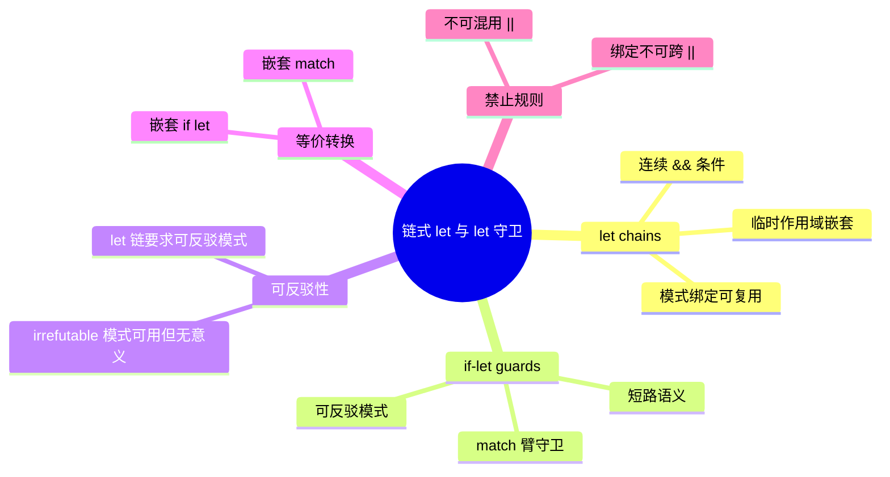

# 链式 let 与 let 守卫（Let Chains & If-Let Guards）

> **EN**: Let Chains and If-Let Guards
> **Summary**: Authoritative semantics for Rust `let chains` and `if-let guards` covering pattern-binding visibility, refutability constraints, `&&`-only connection, and nested equivalence.
> **Rust 版本**: 1.97.0+ (Edition 2024)
>
> **受众**: [初学者]
> **内容分级**: [综述级]
> **Bloom 层级**: L2-L3
> **权威来源**: 本文件为 `concept/` 权威页。
> **A/S/P 标记**: **S** — Specification
> **双维定位**: S×App — 规范应用
> **前置依赖**: [Control Flow](01_control_flow.md) · [Patterns](02_patterns.md) · [Statements and Expressions](04_statements_and_expressions.md) · [Enums and Variants](../02_type_system/01_type_system.md)
> **后置概念**:
> [Match Expressions](04_statements_and_expressions.md) ·
> [Pattern Matching](02_patterns.md) ·
> [Error Handling](../../02_intermediate/03_error_handling/01_error_handling.md)
> **定理链**: Pattern → Refutability → Let Chain → If-Let Guard
> **L0 对齐**: [术语表](../../00_meta/01_terminology/01_terminology_glossary.md)
> **主要来源**:
> [Rust Reference — If let expressions](https://doc.rust-lang.org/reference/expressions/if-expr.html#if-let-expressions) ·
> [Rust Reference — Match expressions](https://doc.rust-lang.org/reference/expressions/match-expr.html) ·
> [RFC 2294 — if-let-guard](https://rust-lang.github.io/rfcs/2294-if-let-guard.html) ·
> [RFC 2497 — if-let-chains](https://rust-lang.github.io/rfcs/2497-if-let-chains.html) ·
> [TRPL — Patterns](https://doc.rust-lang.org/book/ch18-00-patterns.html) ·
> [Brown University — Concepts in Rust Programming](https://cel.cs.brown.edu/crp/) ·
> [Brown Interactive Rust Book](https://rust-book.cs.brown.edu/)
>
> **来源**: [Rust Reference — If let expressions](https://doc.rust-lang.org/reference/expressions/if-expr.html#if-let-expressions) · [Rust Reference — Match expressions](https://doc.rust-lang.org/reference/expressions/match-expr.html)

---
> **权威来源**: [Rust Reference — If let expressions](https://doc.rust-lang.org/reference/expressions/if-expr.html#if-let-expressions) · [Rust Reference — Match expressions](https://doc.rust-lang.org/reference/expressions/match-expr.html)
>
> **权威来源对齐变更日志**: 2026-07-15 创建权威页（Rust 1.97.0 / Edition 2024）。

---

## 🧠 知识结构图



## 一、核心概念

**链式 let（`let chains`）** 允许在单个 `if`/`while` 条件中把多个 `let` 模式匹配（Pattern Matching）与布尔表达式用 `&&` 串起来，绑定在后续条件中可见。

```rust
fn main() {
    let opt: Option<i32> = Some(5);
    if let Some(x) = opt && x > 0 {
        println!("positive: {}", x);
    }
}
```

**let 守卫（`if-let guards`）** 允许在 `match` 臂的 `if` 守卫中写 `let` 模式匹配（Pattern Matching），用来在已匹配绑定上再做一层可选解构。

```rust
fn parse(v: Option<&str>) -> Option<i32> {
    match v {
        Some(s) if let Ok(n) = s.parse::<i32>() => Some(n),
        _ => None,
    }
}
```

两者共同依赖 Rust 模式系统的**可反驳性（refutability）** 与**绑定可见性**规则：

- `let` 链中的每个 `let PAT = EXPR` 必须位于 `&&` 连接的序列中；
- 绑定只向后传播，不会向前或向外泄漏；
- `||` 不能出现，因为右侧分支无法保证左侧绑定已建立。

## 二、`let chains` 语法与语义

本节从基本形式、绑定模式到 `else` 分支，逐步展开 `let chains` 的语法结构与运行时语义，说明多个 `let` 模式与布尔表达式如何通过 `&&` 连接成单一条件。

### 2.1 基本形式

```rust
fn main() {
    let a: Option<i32> = Some(1);
    let b: Option<i32> = Some(2);

    if let Some(x) = a && let Some(y) = b && x + y > 0 {
        println!("x = {}, y = {}", x, y);
    }
}
```

语义等价于：

```rust,ignore
if let Some(x) = a {
    if let Some(y) = b {
        if x + y > 0 {
            println!("x = {}, y = {}", x, y);
        }
    }
}
```

### 2.2 绑定模式

`let chains` 支持所有可反驳模式，包括元组、枚举（Enum）变体、字面量、引用（Reference）模式等。

```rust
fn main() {
    let pair: (Option<i32>, Result<i32, ()>) = (Some(3), Ok(4));
    if let (Some(x), Ok(y)) = pair && x < y {
        println!("{} < {}", x, y);
    }
}
```

### 2.3 `else` 分支

`let chains` 是 `if` 表达式的一部分，自然支持 `else` / `else if`：

```rust
fn classify(v: Option<&str>) -> &'static str {
    if let Some(s) = v && s.starts_with("rust") {
        "starts with rust"
    } else if let Some(s) = v && s.len() > 5 {
        "long other"
    } else {
        "short or none"
    }
}
```

## 三、`if-let guards` 语法与语义

本节说明 `if-let guards` 在 `match` 臂守卫中引入新绑定的写法，剖析它与传统 `if` 守卫的异同，以及其与 `let chains` 的语法关联。

### 3.1 基本形式

`if-let guards` 把 `if let PAT = EXPR` 放在 `match` 臂的 `=>` 之前，作为该臂的附加过滤条件。

```rust
fn main() {
    let input = Some("42");
    match input {
        Some(s) if let Ok(n) = s.parse::<i32>() => println!("parsed: {}", n),
        Some(_) => println!("not a number"),
        None => println!("no input"),
    }
}
```

### 3.2 与传统守卫的区别

传统 `if` 守卫只能使用已绑定变量：

```rust
match x {
    Some(v) if v > 0 => {}
    _ => {}
}
```

`if-let guards` 则可在守卫内部引入新的绑定，但该绑定**仅在对应 match 臂的右侧有效**。

### 3.3 与 `let chains` 的语法关联

`if-let guards` 内部也允许 `&&` 链式 let：

```rust,ignore
match (a, b) {
    (Some(x), Some(y)) if let Ok(z) = x.parse::<i32>()
                          && let Ok(w) = y.parse::<i32>()
                          && z + w > 0 => {}
    _ => {}
}
```

## 四、与嵌套结构的等价转换

本节给出 `let chains` 与嵌套 `if let`、`if-let guards` 与嵌套 `match` 之间的机械转换规则，帮助理解表面语法背后的作用域语义。

### 4.1 `let chains` → 嵌套 `if let`

任何纯 `&&` 链都可机械地转换为向右嵌套的 `if let`：

```rust,ignore
if let Some(x) = opt && x > 0 && let Some(y) = f(x) {
    body
}
```

等价于：

```rust,ignore
if let Some(x) = opt {
    if x > 0 {
        if let Some(y) = f(x) {
            body
        }
    }
}
```

> **注意**：转换后缩进增加，但语义完全一致；`let chains` 的价值在于减少缩进并显式表达“所有条件属于同一次判定”。

### 4.2 `if-let guards` → 嵌套 `match`

```rust,ignore
match v {
    Some(s) if let Ok(n) = s.parse::<i32>() => body(n),
    _ => fallback,
}
```

等价于：

```rust,ignore
match v {
    Some(s) => match s.parse::<i32>() {
        Ok(n) => body(n),
        Err(_) => fallback,
    },
    _ => fallback,
}
```

> 等价转换说明：`if-let guards` 不会扩大 match 臂的覆盖范围，只是把原本需要嵌套 `match` 的逻辑压缩到单臂内。

## 五、临时作用域与绑定可见性

本节厘清 `let chains` 与 `if-let guards` 引入的绑定何时向后可见、何时遮蔽外层同名变量、何时因作用域结束而不可用。

### 5.1 向后可见

`let chains` 中，某个 `let` 引入的绑定在其右侧的所有条件中可见：

```rust
fn main() {
    let opt: Option<i32> = Some(10);
    if let Some(x) = opt && x > 0 && x % 2 == 0 {
        println!("even positive: {}", x);
    }
}
```

### 5.2 不向外泄漏

绑定仅在 `if` 的 true 分支内可见，不会泄漏到 `else` 或外层作用域。

```rust
fn main() {
    let opt: Option<i32> = Some(10);
    if let Some(x) = opt && x > 0 {
        println!("in then: {}", x);
    } else {
        // x 在这里不可用
    }
    // x 在这里也不可用
}
```

### 5.3 变量遮蔽（Shadowing）

同一条 `let chains` 中，后续绑定可以遮蔽（shadow）外层或前面引入的同名绑定：

```rust
fn main() {
    let x = 1;
    let opt: Option<i32> = Some(2);
    if let Some(x) = opt && x > x { // 右侧 x 为绑定值 2
        println!("inner x = {}", x);
    }
    println!("outer x = {}", x);
}
```

> 遮蔽规则与嵌套 `if let` 一致，但连续书写时更易产生可读性问题，建议避免在同一条链中遮蔽同名变量。

## 六、判定规则

本节汇总使用 `let chains` 与 `if-let guards` 时必须满足的语法约束，并解释 `||` 因破坏绑定一致性而被禁止的根本原因。

### 6.1 何时可以使用 `let chains`

必须同时满足：

1. 条件之间只用 `&&` 连接；
2. 每个 `let PAT = EXPR` 中的 `PAT` 是**可反驳模式**或不可反驳模式（不可反驳模式合法但无实际过滤作用）；
3. 布尔子表达式中使用的变量必须已被左侧的 `let` 或外层作用域绑定；
4. 不跨越 `||`。

### 6.2 为什么 `||` 不能与 `let chains` 混用

`||` 的语义是短路或：左侧为真时右侧不执行。若允许 `if let Some(x) = a || x > 0`，当左侧匹配失败时，`x` 未绑定，右侧 `x > 0` 无意义。

Rust 的解决方式是：

- `let chains` 中**禁止** `||`；
- 需要表达“或”逻辑时，退回到嵌套 `if let` / `match` / `if let ... else if let ...`。

### 6.3 可反驳性约束

`let chains` 中每个模式理论上可以是可反驳的；若写不可反驳模式，等价于普通 `let` 绑定，不会触发过滤，但会引入绑定。

```rust
fn main() {
    let pair = (1, 2);
    // 合法但冗余：pair 的解构总是成功
    if let (x, y) = pair && x + y > 0 {
        println!("{}", x + y);
    }
}
```

## 七、与 Rust 1.97 / Edition 2024 的关系

| 特性 | 稳定版本 | 当前项目版本 |
|---|---|---|
| `let chains` | Rust 1.64（2022-09） | ✅ 1.97.0+ 可用 |
| `if-let guards` | Rust 1.83（2024-11） | ✅ 1.97.0+ 可用 |
| Edition 2024 语法兼容 | — | ✅ 无额外 `feature` 开关 |

在 Edition 2024 下：

- `let chains` 自 Rust 1.64 起已稳定，无需特性门控；
- `if-let guards` 同样已稳定；
- 与 `match ergonomics`、默认绑定模式、`let-else` 等特性共同构成现代 Rust 的模式控制流体系。

> `let-else` 与 `let chains` 互补：前者用于早退，后者用于连续过滤。

## 八、边界测试与反例

本节通过典型反例展示编译器如何拒绝违背绑定可见性、可反驳性规则以及混用 `||` 的代码，并给出对应的修正方案。

### 反例 1：在 `||` 中使用 `let`（编译错误）

```rust,compile_fail
fn main() {
    let opt: Option<i32> = Some(1);
    if let Some(x) = opt || x > 0 {
        println!("{}", x);
    }
}
```

**错误原因**：`||` 右侧的 `x` 在左侧匹配失败时未绑定，Rust 禁止在 `let chains` 中使用 `||`。

**修正**：使用嵌套 `if let` 或拆分条件。

```rust
fn main() {
    let opt: Option<i32> = Some(1);
    if let Some(x) = opt {
        if x > 0 {
            println!("{}", x);
        }
    }
}
```

### 反例 2：绑定在后续条件外使用（编译错误）

```rust,compile_fail
fn main() {
    let opt: Option<i32> = Some(1);
    if let Some(x) = opt && x > 0 {
        println!("{}", x);
    }
    println!("{}", x); // x 不在作用域内
}
```

**错误原因**：`x` 仅在 `if` 的 true 分支内可见，不能在外层或 `else` 分支使用。

**修正**：把对外层 `x` 的使用移到 true 分支内，或在外层单独声明变量。

### 反例 3：模式可反驳性导致的错误（编译期）

把可反驳模式当作不可反驳的 `let` 绑定使用会编译失败：

```rust,compile_fail
fn main() {
    let opt: Option<i32> = Some(1);
    // 错误：let 绑定左侧要求不可反驳模式
    let Some(x) = opt && x > 0;
}
```

**错误原因**：裸 `let Some(x) = opt;` 要求模式不可反驳；`Some(x)` 是可反驳模式。

**修正**：使用 `if let` 或 `let-else`。

### 反例 4：绑定在 `&&` 之前使用（编译错误）

```rust,compile_fail
fn main() {
    let opt: Option<i32> = Some(1);
    if x > 0 && let Some(x) = opt {
        println!("{}", x);
    }
}
```

**错误原因**：`x > 0` 出现在 `let Some(x) = opt` 左侧，此时 `x` 尚未绑定。**修正**：调整顺序，让引入绑定的 `let` 位于使用它的表达式左侧。

## 九、关键属性

| 属性 | 取值 / 判定 | 依据 |
|---|---|---|
| 连接运算符 | 仅 `&&`，禁止 `\|\|` | `let chains` 语义要求绑定向后传播 |
| 模式可反驳性 | 允许可反驳模式；不可反驳模式合法但冗余 | `if let` 语义扩展 |
| 绑定可见性 | 向右可见，true 分支内可见，不向外泄漏 | 临时作用域规则 |
| 短路语义 | 左侧匹配失败则右侧不执行 | `&&` 短路 |
| 与 `let-else` 关系 | `let-else` 用于早退；`let chains` 用于连续过滤 | 互补语法 |
| 稳定版本 | `let chains` 1.64+；`if-let guards` 1.83+ | Rust 稳定化历史 |

## 十、概念关系

- **上位（is-a）**：链式 let 与 let 守卫是 [Control Flow](01_control_flow.md) 中基于 [Patterns](02_patterns.md) 的条件分支形式。
- **下位（实例）**：`if let Some(x) = opt && x > 0` 是 `let chains` 的最小实例；`Some(s) if let Ok(n) = ... =>` 是 `if-let guards` 的最小实例。
- **对偶**：与嵌套 `if let` / `match` 语义等价，但表面语法更扁平。
- **组合**：与 [Error Handling](../../02_intermediate/03_error_handling/01_error_handling.md) 中的 `Result`/`Option` 组合使用，可显著减少嵌套深度。
- **依赖**：依赖 [Patterns](02_patterns.md) 的可反驳性、穷尽性与绑定模式理论。

---

## 国际权威参考 / International Authority References（P2 生态）

- [Rust 1.83.0 发布公告 — `if-let-guards` 稳定化](https://blog.rust-lang.org/2024/11/28/Rust-1.83.0.html)
- [Rust 1.64.0 发布公告 — `let_chains` 稳定化](https://blog.rust-lang.org/2022/09/22/Rust-1.64.0.html)

---

## 嵌入式测验（Embedded Quiz）

本节用两道选择题检验对 `||` 混用边界与 `if-let guards` 绑定可见性的理解，覆盖本节最容易出错的两个语义点。

### 测验 1：`||` 混用边界（🟡 进阶）

以下代码能否编译？

```rust,ignore
fn main() {
    let opt: Option<i32> = Some(1);
    if let Some(x) = opt || x > 0 {
        println!("{}", x);
    }
}
```

- A. 能编译，`x` 在两侧都可用
- B. 不能编译：`||` 与 `let chains` 混用会导致右侧 `x` 可能未绑定
- C. 能编译，但 `x` 在右侧是外层同名变量
- D. 不能编译：`opt` 与 `x > 0` 类型不匹配

<details>
<summary>✅ 答案</summary>

**B 正确**。按本页「6.2 为什么 `||` 不能与 `let chains` 混用」：`||` 短路或的右侧在左侧为真时才不执行；若左侧匹配失败，`x` 未绑定，右侧 `x > 0` 无意义。Rust 在 `let chains` 中禁止 `||`。修正：拆分为嵌套 `if let` 或 `if let ... else if let ...`。

</details>

---

### 测验 2：if-let guards 绑定可见性（🔴 专家）

以下代码中，`n` 的可见范围是？

```rust,ignore
match input {
    Some(s) if let Ok(n) = s.parse::<i32>() => println!("{}", n),
    Some(_) => println!("not a number"),
    None => {}
}
```

- A. 整个 `match` 表达式
- B. 仅 `Some(s) if let Ok(n) = ... =>` 这一臂的右侧
- C. `Some(_)` 和 `None` 臂也可以使用 `n`
- D. `s` 和 `n` 都可在 `match` 后的代码使用

<details>
<summary>✅ 答案</summary>

**B 正确**。按本页「3.2 与传统守卫的区别」：`if-let guards` 引入的绑定 `n` 仅在该 `match` 臂的右侧有效，不会泄漏到其他臂或 `match` 外部。`s` 作为该臂的匹配绑定，同样只在对应臂的右侧有效。

</details>
