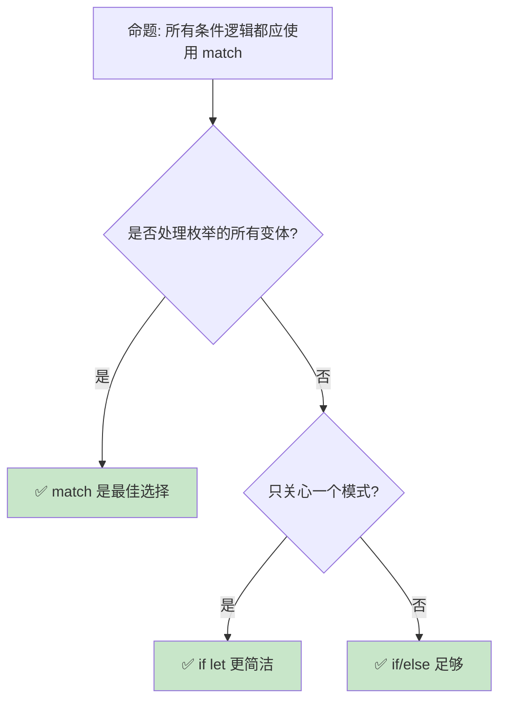
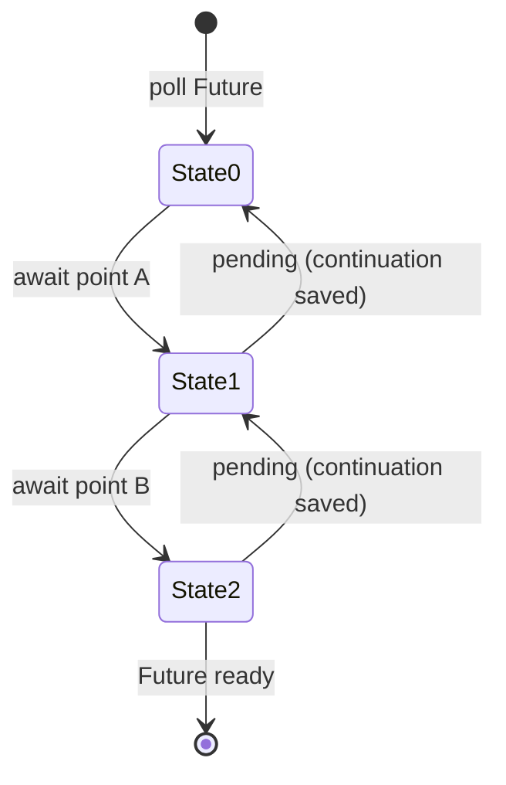
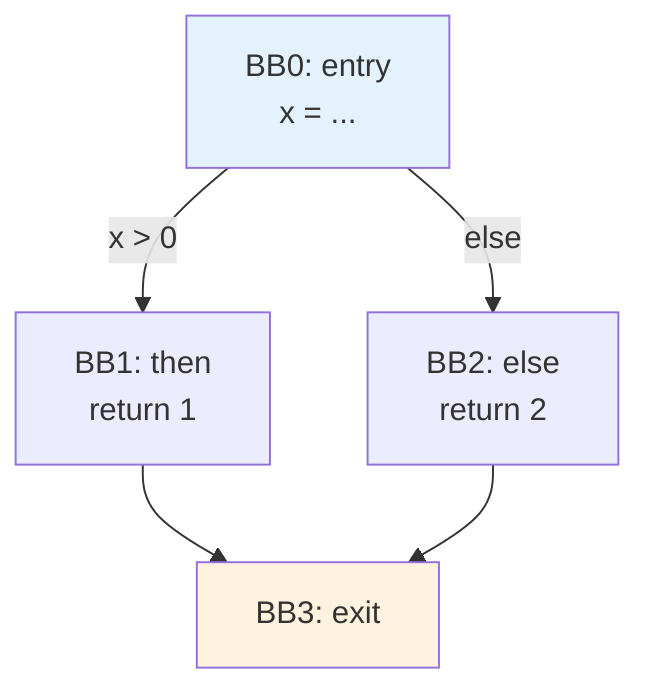
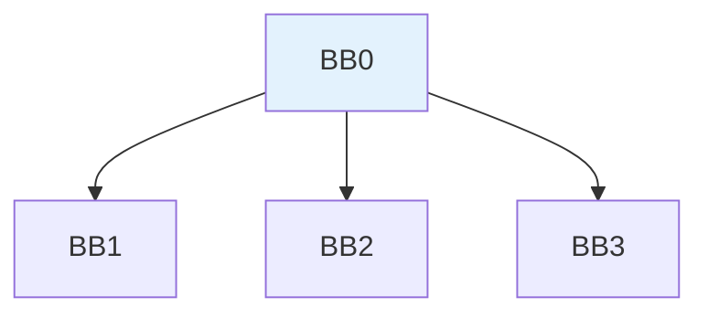
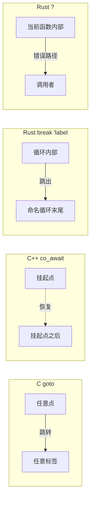

> **内容分级**: [综述级]
>
> **本节关键术语**: 控制流 (Control Flow) · 条件分支 (Conditional) · 循环 (Loop) · 模式匹配 (Pattern Matching) · 守卫条件 (Guard) — [完整对照表](../../00_meta/01_terminology/terminology_glossary.md)
>
# 控制流：表达式导向的流程控制
>
> **EN**: Control Flow
> **Summary**: Control Flow — Expression-oriented control flow: if, match, loop, if-let, and while-let as value-producing expressions.
> **受众**: [初学者]
> **Bloom 层级**: L2-L3
> **权威来源**: 本文件为 `concept/` 权威页。
> **A/S/P 标记**: **A+S** — Application + Structure
> **双维定位**: C×App — 应用控制流结构和模式匹配（Pattern Matching）
> **定位**: 分析 Rust **控制流结构**的设计哲学——从表达式导向（expression-oriented）的 `if`/`match`/`loop`，到 `if let`/`while let` 的模式匹配（Pattern Matching）集成，揭示 Rust 如何将控制流转化为**值生成**而非**副作用执行**。
> **前置概念**: [Ownership](../01_ownership_borrow_lifetime/01_ownership.md) · [Type System](../02_type_system/04_type_system.md)
> **后置概念**: [Generics](../../02_intermediate/01_generics/02_generics.md) · [Async](../../03_advanced/01_async/02_async.md)

---

> **来源**:
> [Rust Reference — Expressions](https://doc.rust-lang.org/reference/expressions.html) ·
> · [Peyton Jones — The Implementation of Functional Programming Languages](https://www.microsoft.com/en-us/research/publication/the-implementation-of-functional-programming-languages/) ·
> [Brown University — Concepts in Rust Programming](https://cel.cs.brown.edu/crp/) ·
> [Oxide: The Essence of Rust](https://arxiv.org/abs/1903.00982) ·
> [Itanium C++ ABI](https://itanium-cxx-abi.github.io/cxx-abi/abi.html)
> [TRPL Ch3 — Control Flow](https://doc.rust-lang.org/book/ch03-05-control-flow.html) ·
> [TRPL Ch6 — Match](https://doc.rust-lang.org/book/ch06-02-match.html) ·
> [Rust Reference — Loop Expressions](https://doc.rust-lang.org/reference/expressions/loop-expr.html) ·
> [RFC 160 — `if let`](https://github.com/rust-lang/rfcs/pull/160)

## 📑 目录

- [控制流：表达式导向的流程控制](#控制流表达式导向的流程控制)
  - [📑 目录](#-目录)
  - [一、核心概念](#一核心概念)
    - [1.1 表达式 vs 语句](#11-表达式-vs-语句)
    - [1.2 match：穷尽性模式匹配](#12-match穷尽性模式匹配)
    - [1.3 if let / while let：简化的模式匹配](#13-if-let--while-let简化的模式匹配)
  - [二、技术细节](#二技术细节)
    - [2.1 loop 与值返回](#21-loop-与值返回)
    - [2.2 标签与嵌套循环控制](#22-标签与嵌套循环控制)
    - [2.3 块表达式与尾部值](#23-块表达式与尾部值)
  - [三、常见模式](#三常见模式)
  - [四、反命题与边界分析](#四反命题与边界分析)
    - [4.1 反命题树](#41-反命题树)
    - [4.2 边界极限](#42-边界极限)
  - [五、常见陷阱](#五常见陷阱)
  - [六、来源与延伸阅读](#六来源与延伸阅读)
  - [相关概念](#相关概念)
  - [权威来源索引](#权威来源索引)
  - [十二、边界测试：控制流的编译错误](#十二边界测试控制流的编译错误)
    - [12.1 边界测试：`loop` 返回值类型不匹配（编译错误）](#121-边界测试loop-返回值类型不匹配编译错误)
    - [12.2 边界测试：`if let` 与 `while let` 的变量遮蔽（编译错误）](#122-边界测试if-let-与-while-let-的变量遮蔽编译错误)
    - [10.3 边界测试：`loop` 表达式的类型推断（编译错误）](#103-边界测试loop-表达式的类型推断编译错误)
    - [10.4 边界测试：`?` 运算符在 `main` 中的返回类型（编译错误）](#104-边界测试-运算符在-main-中的返回类型编译错误)
    - [10.5 边界测试：`loop` 返回值与 `break` 的类型一致性（编译错误）](#105-边界测试loop-返回值与-break-的类型一致性编译错误)
    - [10.6 边界测试：`match` 臂中的变量绑定与模式守卫（编译错误）](#106-边界测试match-臂中的变量绑定与模式守卫编译错误)
  - [实践](#实践)
  - [参考来源](#参考来源)
  - [认知路径](#认知路径)
    - [核心推理链](#核心推理链)
    - [反命题与边界](#反命题与边界)
  - [嵌入式测验（Embedded Quiz）](#嵌入式测验embedded-quiz)
    - [测验 1：`if` 作为表达式（理解层）](#测验-1if-作为表达式理解层)
    - [测验 2：`match` 穷尽性（应用层）](#测验-2match-穷尽性应用层)
    - [测验 3：`loop` 返回值（应用层）](#测验-3loop-返回值应用层)
    - [测验 4：`if let` 语法（应用层）](#测验-4if-let-语法应用层)
    - [测验 5：`break` 标签（分析层）](#测验-5break-标签分析层)
  - [补充章节：控制流理论深化（P1-4）](#补充章节控制流理论深化p1-4)
    - [7.1 结构化程序定理（Böhm–Jacopini 定理）](#71-结构化程序定理böhmjacopini-定理)
      - [形式化定义](#形式化定义)
      - [三种结构化构造的 ASCII 示意图](#三种结构化构造的-ascii-示意图)
      - [与 Rust 的对应](#与-rust-的对应)
      - [代码示例：仅用三种结构实现欧几里得算法](#代码示例仅用三种结构实现欧几里得算法)
    - [7.2 Continuation / `call/cc` / CPS 变换 / Delimited Continuation](#72-continuation--callcc--cps-变换--delimited-continuation)
      - [形式化定义](#形式化定义-1)
      - [Rust 关联](#rust-关联)
      - [`async/await` 作为显式 Continuation 的 Mermaid 示意图](#asyncawait-作为显式-continuation-的-mermaid-示意图)
      - [代码示例](#代码示例)
      - [Delimited Continuation 与 `async` 的类比](#delimited-continuation-与-async-的类比)
    - [7.3 控制流图（CFG）、基本块、边与支配树](#73-控制流图cfg基本块边与支配树)
      - [形式化定义](#形式化定义-2)
      - [`if-else` 的 CFG 与支配树 Mermaid 图](#if-else-的-cfg-与支配树-mermaid-图)
      - [与编译器优化的关系](#与编译器优化的关系)
      - [Rust 关联](#rust-关联-1)
      - [代码示例：一个极小 CFG 与迭代式支配集计算](#代码示例一个极小-cfg-与迭代式支配集计算)
    - [7.4 循环不变量：与 Hoare 逻辑的衔接](#74-循环不变量与-hoare-逻辑的衔接)
      - [形式化定义](#形式化定义-3)
      - [部分正确性与完全正确性](#部分正确性与完全正确性)
      - [Rust 关联](#rust-关联-2)
      - [代码示例 1：二分查找的循环不变量](#代码示例-1二分查找的循环不变量)
      - [代码示例 2：带不变量的简单累加](#代码示例-2带不变量的简单累加)
    - [7.5 `goto` 的消除与恢复：C `goto` / C++ `co_await` / Rust `?` / `break 'label` 的控制流本质](#75-goto-的消除与恢复c-goto--c-co_await--rust---break-label-的控制流本质)
      - [形式化定义](#形式化定义-4)
      - [C `goto`：自由但危险](#c-goto自由但危险)
      - [C++ `co_await`：协程的恢复式控制流](#c-co_await协程的恢复式控制流)
      - [Rust `break 'label` 与 `?`：结构化跳转的两种受限形式](#rust-break-label-与-结构化跳转的两种受限形式)
      - [四种机制的跳转范围对比 Mermaid 图](#四种机制的跳转范围对比-mermaid-图)
      - [对比表](#对比表)
      - [从 `goto` 到结构化控制的恢复路径](#从-goto-到结构化控制的恢复路径)
  - [补充视角：crate 实践中的循环选型](#补充视角crate-实践中的循环选型)
    - [`loop` / `while` / `for` 功能对比](#loop--while--for-功能对比)
    - [选择指南](#选择指南)
    - [性能提示](#性能提示)
  - [国际权威参考 / International Authority References（P2 生态）](#国际权威参考--international-authority-referencesp2-生态)

---

## 一、核心概念

### 1.1 表达式 vs 语句

```text
Rust 是表达式导向语言（Expression-Oriented Language）:

  表达式（Expression）: 产生值
  ├── 2 + 3 → 5
  ├── if condition { 1 } else { 0 } → 1 或 0
  ├── match x { A => 1, B => 2 } → 1 或 2
  └── { let x = 1; x + 1 } → 2

  语句（Statement）: 不产生值（单元类型 ()）
  ├── let x = 5;  // let 是语句
  ├── x = 3;      // 赋值是语句
  └── fn foo() {} // 函数定义是语句

  与 C/Java 的本质差异:
  ┌─────────────────┬─────────────────┬─────────────────┐
  │ 代码            │ C/Java          │ Rust            │
  ├─────────────────┼─────────────────┼─────────────────┤
  │ if              │ 语句            │ 表达式           │
  │ match           │ switch 语句     │ 表达式           │
  │ 代码块 {}        │ 作用域          │ 表达式（尾值）   │
  │ 三元运算符       │ a ? b : c       │ if a { b } else │
  │                 │                 │ { c }           │
  └─────────────────┴─────────────────┴─────────────────┘
> [来源: [TRPL](https://doc.rust-lang.org/book/ch03-05-control-flow.html)]

  表达式导向的好处:
  ├── 控制流可以返回值，减少临时变量
  ├── let result = if x > 0 { x } else { -x };  // 绝对值
  ├── 代码更简洁，更接近函数式风格
  └── 编译器能进行更精确的类型检查
```

> **认知功能**: 表达式导向是 Rust 的**核心设计哲学**——几乎所有控制结构都是表达式，可以嵌套、可以赋值、可以作为返回值。
> **关键洞察**: 这使得 Rust 在没有三元运算符的情况下，仍然能写出比 C 更简洁的条件表达式。
> [来源: [Rust Reference — Expressions vs Statements](https://doc.rust-lang.org/reference/statements-and-expressions.html)]

---

### 1.2 match：穷尽性模式匹配

```rust,ignore
// match 是 Rust 最强大的控制流工具

enum Message {
    Quit,
    Move { x: i32, y: i32 },
    Write(String),
    ChangeColor(i32, i32, i32),
}

fn process(msg: Message) -> String {
    match msg {
        Message::Quit => String::from("quit"),
        Message::Move { x, y } => format!("move to ({}, {})", x, y),
        Message::Write(text) => format!("write: {}", text),
        Message::ChangeColor(r, g, b) => format!("color: {} {} {}", r, g, b),
    }
}

// 穷尽性检查: 编译器确保所有变体都被处理
// 如果遗漏 Message::Quit，编译错误！

// match 作为表达式
let value = match option {
    Some(x) => x * 2,
    None => 0,
};

// 守卫条件（guard）
match num {
    n if n < 0 => "negative",
    n if n > 0 => "positive",
    _ => "zero",
}

// 绑定模式
match result {
    Ok(value) @ 1..=10 => println!("small success: {}", value),
    Ok(value) => println!("success: {}", value),
    Err(e) => println!("error: {}", e),
}
```

> **match 洞察**: Rust 的 `match` 要求**穷尽性**（exhaustiveness）——编译器检查所有可能的模式都被覆盖。这消除了 C `switch` 的**遗漏 case** bug。
> [来源: [Rust Reference — Match Expressions](https://doc.rust-lang.org/reference/expressions/match-expr.html)]

---

### 1.3 if let / while let：简化的模式匹配

```rust,ignore
// if let: 当只关心一个模式时使用

// 代替冗长的 match
match option {
    Some(value) => println!("{}", value),
    _ => {},  // 必须写，但什么都不做
}

// 用 if let 简化
if let Some(value) = option {
    println!("{}", value);
}

// if let ... else
if let Some(value) = option {
    println!("{}", value);
} else {
    println!("none");
}

// while let: 循环条件为模式匹配
let mut stack = vec![1, 2, 3];
while let Some(top) = stack.pop() {
    println!("{}", top);  // 打印 3, 2, 1
}

// let else (Rust 1.65+): 提前返回
fn get_count(map: &HashMap<String, i32>, key: &str) -> i32 {
    let Some(&count) = map.get(key) else {
        return 0;  // 如果模式不匹配，执行 else 块并返回
    };
    count * 2  // count 在这里已解包
}

// let chains (Rust 1.70+): 连续模式匹配
if let Some(x) = opt1 && let Some(y) = opt2 && x > y {
    println!("{} > {}", x, y);
}
```

> **if let/while let 洞察**: 这些语法是 `match` 的**语法糖**——它们在只关心一个模式时减少 boilerplate。`let else` 进一步简化了**提前返回**模式。
> [来源: [RFC 160 — if let](https://github.com/rust-lang/rfcs/pull/160)] · [来源: [RFC 3137 — let else](https://github.com/rust-lang/rfcs/pull/3137)]

---

## 二、技术细节

### 2.1 loop 与值返回

```rust,ignore
// loop 可以返回值（Rust 特有）
let result = loop {
    // 做一些工作
    if condition_met {
        break 42;  // break 带值
    }
};
// result == 42

// 对比其他语言的 loop
// C/Java: 需要额外的变量存储结果
// Rust: loop 本身就是表达式

// 实际应用: 重试逻辑
let response = loop {
    match try_request().await {
        Ok(resp) => break resp,
        Err(e) if e.is_retriable() => {
            tokio::time::sleep(RETRY_DELAY).await;
            continue;
        }
        Err(e) => break Err(e),  // 不可重试错误，返回
    }
};

// for 循环与迭代器
for item in collection { ... }  // 消费迭代器
for item in &collection { ... }  // 借用迭代
for i in 0..10 { ... }  // 范围迭代

// for 不返回值，但可以用其他方式收集结果
let sum: i32 = (0..10).map(|x| x * 2).sum();
```

> **loop 洞察**: `loop` 作为**表达式**是 Rust 的独特设计——它使**重试逻辑**、**状态机循环**等模式能简洁地返回值。
> [来源: [Rust Reference — Loop Expressions](https://doc.rust-lang.org/reference/expressions/loop-expr.html)]

---

### 2.2 标签与嵌套循环控制

```rust,ignore
// 标签循环: 控制嵌套循环

'outer: for x in 0..10 {
    'inner: for y in 0..10 {
        if x * y > 50 {
            break 'outer;  // 跳出外层循环
        }
        println!("({}, {})", x, y);
    }
}

// continue 也可以带标签
'search: for i in 0..100 {
    for j in 0..100 {
        if !is_valid(i, j) {
            continue 'search;  // 跳到外层下一次迭代
        }
        process(i, j);
    }
}

// 标签与 loop 表达式结合
let result = 'retry: loop {
    for attempt in 0..3 {
        match try_operation() {
            Ok(v) => break 'retry v,
            Err(_) if attempt < 2 => continue,
            Err(e) => break 'retry Err(e),
        }
    }
};
```

> **标签洞察**: 循环标签解决了**嵌套循环控制**的问题——不需要 goto，也不需要额外的标志变量。
> [来源: [Rust Reference — Labeled Loops](https://doc.rust-lang.org/reference/expressions/loop-expr.html#loop-labels)]

---

### 2.3 块表达式与尾部值

```rust,ignore
// 块表达式 {} 的值是其最后一个表达式
let value = {
    let x = 1;
    let y = 2;
    x + y  // 尾部表达式（无分号）→ 块的值是 3
};

// 尾部语句（有分号）→ 块的值是 ()
let unit = {
    let x = 1;
    x + 1;  // 分号 → 语句 → 块值 = ()
};

// 函数隐式返回尾部表达式
fn add(a: i32, b: i32) -> i32 {
    a + b  // 等同于 return a + b;
}

// match 分支也是块表达式
let result = match option {
    Some(x) => {
        let doubled = x * 2;
        doubled  // 分支的值
    }
    None => 0,
};

// if 作为表达式
let max = if a > b { a } else { b };

// 注意: if 分支类型必须一致
let x = if condition {
    42      // i32
} else {
    "hello" // &str → 编译错误！
};
```

> **块表达式洞察**: Rust 的**尾部值规则**是表达式导向的基础——任何块 `{}` 都可以是一个值，只要最后一个表达式没有分号。
> [来源: [Rust Reference — Block Expressions](https://doc.rust-lang.org/reference/expressions/block-expr.html)]

---

## 三、常见模式

```text
模式 1: 使用 match 进行枚举处理
  match msg {
      Message::Quit => handle_quit(),
      Message::Move { x, y } => handle_move(x, y),
      Message::Write(text) => handle_write(text),
      Message::ChangeColor(r, g, b) => handle_color(r, g, b),
  }

模式 2: if let 解包 Option
  if let Some(value) = maybe_value {
      process(value);
  }

模式 3: while let 消费迭代器
  while let Some(item) = iter.next() {
      process(item);
  }

模式 4: let else 提前返回
  fn foo(opt: Option<i32>) -> i32 {
      let Some(x) = opt else { return 0; };
      x * 2
  }

模式 5: loop 重试
  let result = loop {
      match try_operation() {
          Ok(v) => break v,
          Err(_) => continue,
      }
  };

模式 6: 匹配守卫
  match age {
      n if n < 13 => "child",
      n if n < 20 => "teenager",
      n if n < 65 => "adult",
      _ => "senior",
  }

模式 7: 范围模式 (Rust 1.55+)
  match x {
      1..=10 => "small",
      11..=100 => "medium",
      _ => "large",
  }
```

> **模式总结**: Rust 的控制流模式强调**穷尽性**和**表达式导向**——编译器帮助你处理所有情况，同时控制流可以自然地产生值。
> [来源: [TRPL — Patterns](https://doc.rust-lang.org/book/ch18-00-patterns.html)]

---

## 四、反命题与边界分析

### 4.1 反命题树



> **认知功能**: 此决策树帮助选择正确的控制流结构。核心原则是：**枚举（Enum）处理用 match，单模式解包用 if let，简单布尔条件用 if**。
> [来源: [Rust Clippy — Match Patterns](https://rust-lang.github.io/rust-clippy//master/index.html)]

---

### 4.2 边界极限

```text
边界 1: match 的穷尽性限制
├── match 要求处理所有情况
├── 对于整数类型（i32 等），不可能穷尽所有值
├── 解决方案: 使用通配符 _ 捕获剩余情况
└── 但这可能隐藏遗漏的边界情况

边界 2: 表达式类型一致性
├── if/else 的两个分支必须返回相同类型
├── match 的所有分支必须返回相同类型
├── 这限制了某些动态类型风格的代码
└── 解决方案: 使用 enum 统一不同类型

边界 3: async 中的控制流
├── break/continue 在 async 块中的行为
├── loop 在 async fn 中的 Pin 交互
├── for await（尚未稳定）
└── 需要理解 Future 的 poll 模型

边界 4: const 上下文中的控制流
├── const fn 支持 if/match/loop
├── 但循环有迭代次数限制
├── 复杂的 const 控制流可能触发编译器限制
└── const eval 的步数限制

边界 5: 模式匹配的深度
├── 过深的嵌套模式可能难以阅读
├── 解构大型结构体时模式冗长
└── 解决方案: 使用 @ 绑定或部分匹配
```

> **边界要点**: 控制流的边界主要与**穷尽性要求**、**类型一致性（Coherence）**、**异步（Async）交互**和**const 限制**相关。
> [来源: [Rust Reference — Const Evaluation](https://doc.rust-lang.org/reference/const_eval.html)]

---

## 五、常见陷阱

```text
陷阱 1: 在 if/else 分支中返回不同类型
  ❌ let x = if condition { 42 } else { "hello" };
     // 编译错误: i32 和 &str 类型不匹配

  ✅ let x = if condition { Some(42) } else { None };
     // 或: 使用 enum 统一类型

陷阱 2: 忘记 match 的穷尽性
  ❌ match option {
       Some(x) => println!("{}", x),
       // 遗漏 None → 编译错误
     }

  ✅ match option {
       Some(x) => println!("{}", x),
       None => {},  // 显式处理
     }

陷阱 3: 在块末尾意外添加分号
  ❌ fn get_value() -> i32 {
       let x = 42;
       x;  // 分号 → 块值 = () → 编译错误
     }

  ✅ fn get_value() -> i32 {
       let x = 42;
       x   // 无分号 → 块值 = 42
     }

陷阱 4: 混淆 break 和 return
  ❌ fn search() -> i32 {
       for i in 0..10 {
           if found(i) {
               break i;  // 返回循环值，不是函数返回值
           }
       }
     }

  ✅ fn search() -> i32 {
       for i in 0..10 {
           if found(i) {
               return i;  // 从函数返回
           }
       }
       -1
     }

陷阱 5: let else 中的作用域
  ❌ fn foo(opt: Option<i32>) {
       let Some(x) = opt else { return; };
       // x 在这里可用
     }
     // 但如果 else 块不返回，x 不可用

  ✅ 确保 let else 的 else 块发散（return/panic/break）
```

> **陷阱总结**: 控制流的陷阱主要与**类型一致性（Coherence）**、**穷尽性**、**尾部值规则**和**作用域**相关。
> [来源: [Rust Compiler Error E0308](https://doc.rust-lang.org/error_codes/E0308.html)]

---

## 六、来源与延伸阅读

| 来源 | 可信度 | 说明 |
|:---|:---:|:---|
| [Rust Reference — Expressions](https://doc.rust-lang.org/reference/expressions.html) | ✅ 一级 | 官方表达式参考 |
| [TRPL Ch3 — Control Flow](https://doc.rust-lang.org/book/ch03-05-control-flow.html) | ✅ 一级 | 控制流入门 |
| [TRPL Ch6 — Match](https://doc.rust-lang.org/book/ch06-02-match.html) | ✅ 一级 | match 详解 |
| [TRPL Ch18 — Patterns](https://doc.rust-lang.org/book/ch18-00-patterns.html) | ✅ 一级 | 模式匹配（Pattern Matching）深入 |
| [RFC 160 — if let](https://github.com/rust-lang/rfcs/pull/160) | ✅ 一级 | if let RFC |
| [RFC 3137 — let else](https://github.com/rust-lang/rfcs/pull/3137) | ✅ 一级 | let else RFC |

---

## 相关概念

- **上层概念**: [Ownership](../01_ownership_borrow_lifetime/01_ownership.md) · [Type System](../02_type_system/04_type_system.md)
- **下层概念**: [Generics](../../02_intermediate/01_generics/02_generics.md) · [Async](../../03_advanced/01_async/02_async.md)

- [Ownership](../01_ownership_borrow_lifetime/01_ownership.md) — 所有权（Ownership）模型
- [Type System](../02_type_system/04_type_system.md) — 类型系统（Type System）
- [Generics](../../02_intermediate/01_generics/02_generics.md) — 迭代器（Iterator）
- [Async](../../03_advanced/01_async/02_async.md) — 异步控制流

---

> **权威来源**: [Rust Reference](https://doc.rust-lang.org/reference/introduction.html), [The Rust Programming Language](https://doc.rust-lang.org/book/ch03-05-control-flow.html)
>
> **权威来源对齐变更日志**: 2026-05-22 创建 [Authority Source Sprint Batch 9](../../00_meta/02_sources/international_authority_index.md)

**文档版本**: 1.0
**Rust 版本**: 1.97.0+ (Edition 2024)
**最后更新**: 2026-05-22
**状态**: ✅ 概念文件创建完成

---

## 权威来源索引

> **补充来源**

## 十二、边界测试：控制流的编译错误

### 12.1 边界测试：`loop` 返回值类型不匹配（编译错误）

```rust,compile_fail
fn main() {
    let result = loop {
        break 42; // break 带值
        break "hello"; // ❌ 编译错误: mismatched types
        // 同一 loop 的所有 break 必须返回相同类型
    };
    println!("{}", result);
}

// 正确: 所有 break 返回相同类型
fn fixed() -> i32 {
    loop {
        if some_condition() {
            break 42; // ✅ i32
        }
        break 0; // ✅ i32
    }
}

fn some_condition() -> bool { false }
```

> **修正**: `loop` 表达式可以返回值（通过 `break expr;`），但所有 `break` 分支必须返回相同类型。编译器通过控制流分析推断 `loop` 的类型。
> 若存在不一致的 `break` 类型，编译器报错。这类似于 `match` 的所有分支必须返回相同类型。
> [来源: [Rust Reference](https://doc.rust-lang.org/reference/introduction.html)]

### 12.2 边界测试：`if let` 与 `while let` 的变量遮蔽（编译错误）

```rust,compile_fail
fn main() {
    let x = Some(5);
    if let Some(x) = x {
        // x 在此处遮蔽外部 x
        println!("inner: {}", x);
    }
    // ❌ 编译错误: `x` 的值已被移动
    // 若 x 不是 Copy 类型，if let 的解构可能消耗值
    println!("outer: {}", x);
}

// 正确: 使用引用匹配
fn fixed() {
    let x = Some(String::from("hello"));
    if let Some(ref inner) = x { // ✅ 匹配引用，不消耗 x
        println!("inner: {}", inner);
    }
    println!("outer: {:?}", x); // ✅ x 仍有效
}
```

> **修正**: `if let` 和 `while let` 通过模式匹配解构值。
> 若模式不使用 `ref` 或 `ref mut`，则发生所有权（Ownership）移动（对非 `Copy` 类型）。
> 使用 `ref` 绑定创建引用（Reference）而非获取所有权（Ownership），允许在匹配后继续使用原值。
> 这是 Rust 模式匹配与所有权（Ownership）系统的关键交互点。
> [来源: [The Rust Programming Language](https://doc.rust-lang.org/book/ch03-05-control-flow.html)]

### 10.3 边界测试：`loop` 表达式的类型推断（编译错误）

```rust,ignore
fn maybe_return() -> i32 {
    let x = loop {
        if some_condition() {
            break 42;
        }
        // ❌ 编译错误: 若 loop 永不 break，或 break 的类型不一致
    };
    x
}

fn some_condition() -> bool { true }
```

> **修正**: `loop` 是 Rust 中唯一可返回值的循环结构：`break expr` 返回 `expr` 作为 `loop` 的值。
> 编译器要求：
>
> 1) 所有 `break` 返回相同类型；
> 2) 若 `loop` 可能无限循环（无 `break`），其类型为 `!`（never type），可 coerce 为任意类型。
> `loop { break 42 }` 的类型是 `i32`，`loop { break "hello" }` 的类型是 `&str`。
> 若 `break` 的类型不一致，编译错误。这与 C 的 `for`/`while`（无返回值）或 Haskell 的 `rec`/`fix`（返回值但语义不同）不同——Rust 的 `loop` 返回值使某些模式更简洁（如重试逻辑返回操作结果）。
> `loop` 与 `break` 的组合是 Rust 控制流的独特设计。
> [来源: [The Rust Programming Language](https://doc.rust-lang.org/book/ch03-05-control-flow.html)] ·
> [来源: [Rust Reference — Loop Expressions](https://doc.rust-lang.org/reference/expressions/loop-expr.html)]

### 10.4 边界测试：`?` 运算符在 `main` 中的返回类型（编译错误）

```rust,compile_fail
fn main() {
    let file = std::fs::File::open("not_exist.txt")?;
    // ❌ 编译错误: `?` 要求函数返回 Result 或 Option
    // main 默认返回 ()
}
```

> **修正**:
> `?` 运算符只能在返回 `Result` 或 `Option` 的函数中使用。
> `main` 函数可返回 `Result<(), E>`（`E: Debug`），Rust 在返回 `Err` 时打印错误并设置非零退出码。
> 正确写法：`fn main() -> Result<(), Box<dyn std::error::Error>> { let file = std::fs::File::open("...")?; Ok(()) }`。
> 这与 Go 的 `if err != nil { return err }`（在 main 中返回 error 等价于 `os.Exit(1)`）或 Python 的 `sys.exit(1)` 类似——Rust 的类型系统（Type System）要求显式声明 `main` 可能失败。
> `main` 返回 `Result` 是 Rust 错误处理（Error Handling）哲学的自然延伸：连程序入口点也使用 `Result`。
> [来源: [The Rust Programming Language](https://doc.rust-lang.org/book/ch09-02-recoverable-errors-with-result.html)] ·
> [来源: [Rust Reference — Main Function](https://doc.rust-lang.org/reference/crates-and-source-files.html#main-functions)]

### 10.5 边界测试：`loop` 返回值与 `break` 的类型一致性（编译错误）

```rust,compile_fail
fn main() {
    let result = loop {
        if true {
            break 42; // break 返回 i32
        } else {
            break "hello"; // ❌ 编译错误: break 返回 &str，与之前的 i32 不一致
        }
    };
    println!("{}", result);
}
```

> **修正**:
> `loop` 是 Rust 中唯一可返回值的循环：`break expr` 将 `expr` 作为 `loop` 表达式的值。
> 编译器要求：
>
> 1) 所有 `break` 返回相同类型；
> 2) 若 `loop` 可能无限循环（无 `break`），其类型为 `!`（never type），可 coerce 为任意类型。
> `loop { break 42 }` 的类型是 `i32`。若 `break` 的类型不一致，编译错误。
> 这与 C 的 `for`/`while`（无返回值）或 Haskell 的 `rec`/`fix`（返回值但语义不同）不同——Rust 的 `loop` 返回值使某些模式更简洁（如重试逻辑返回操作结果）。`loop` 与 `break` 的组合是 Rust 控制流的独特设计。
> [来源: [The Rust Programming Language](https://doc.rust-lang.org/book/ch03-05-control-flow.html)] ·
> [来源: [Rust Reference — Loop Expressions](https://doc.rust-lang.org/reference/expressions/loop-expr.html)]

### 10.6 边界测试：`match` 臂中的变量绑定与模式守卫（编译错误）

```rust,ignore
fn main() {
    let x = Some(5);
    match x {
        Some(n) if n > 3 => println!("big: {}", n),
        Some(n) => println!("small: {}", n),
        None => println!("none"),
    }

    let y = Some(String::from("hello"));
    match y {
        Some(ref s) if s.len() > 3 => println!("long: {}", s),
        // ❌ 编译错误: 若模式守卫中使用 move 绑定，可能冲突
        Some(s) => println!("short: {}", s),
        None => {},
    }
}
```

> **修正**:
> `match` 的**模式守卫**（pattern guard，`if` 条件）在绑定后执行，但守卫中的借用（Borrowing）可能与后续臂冲突。
> `ref` 关键字创建引用绑定（`&T` 而非 `T`），避免 move。`ref mut` 创建可变引用（Mutable Reference）绑定。
> 模式守卫的限制：
>
> 1) 守卫中不能引入新绑定；
> 2) 守卫中的变量是引用（Reference）而非值（若使用 `ref`）；
> 3) 守卫不移动值，但若守卫失败，后续臂可能获得 move 绑定。
> 这与 Haskell 的 `case` guard（类似，但 Haskell 是惰性求值，守卫语义不同）或 Scala 的 `match` with `if` guard（类似，但无所有权（Ownership）影响）不同
> ——Rust 的模式守卫需考虑所有权（Ownership）和借用（Borrowing）的交互。
> [来源: [The Rust Programming Language](https://doc.rust-lang.org/book/ch18-03-pattern-syntax.html)] ·
> [来源: [Rust Reference — Match Guards](https://doc.rust-lang.org/reference/expressions/match-expr.html#match-guards)]

## 实践

> **相关资源**:
>
> - [crates/ 示例代码](../crates) — 与本文概念对应的可编译示例
> - [exercises/ 练习](../exercises) — 动手编程挑战
> - [MVP 学习路径](../../00_meta/04_navigation/learning_mvp_path.md) — 从零到多线程 CLI 的 40 小时路径
>
> **建议**: 阅读完本概念文件后，打开对应 crate 的示例代码，尝试修改并运行。完成至少 1 道相关练习以巩固理解。

## 参考来源

> [来源: [The Rust Programming Language, Ch. 3.5](https://doc.rust-lang.org/book/ch03-05-control-flow.html)]
> [来源: [RFC 1210 — `impl Trait`](https://doc.rust-lang.org/reference/types/impl-trait.html)]
> [来源: [RFC 2497 — if let chains](https://rust-lang.github.io/rfcs//2497-if-let-chains.html)]

## 认知路径

> **认知路径**: 从 L0 基础概念出发，经由本节的 **控制流：表达式导向的流程控制** 核心原理，通向 L2 进阶模式与 L3 工程实践。

### 核心推理链

| 定理 | 前提 | 结论 | 置信度 |
|:---|:---|:---|:---|
| 控制流：表达式导向的流程控制 基础定义 ⟹ 正确用法 | 理解语法与语义 | 能写出符合惯用法的代码 | 高 |
| 控制流：表达式导向的流程控制 正确用法 ⟹ 常见陷阱 | 忽略边界条件 | 编译错误或运行时（Runtime） bug | 高 |
| 控制流：表达式导向的流程控制 常见陷阱 ⟹ 深度掌握 | 系统学习反模式 | 能进行代码审查与优化 | 高 |

> 程序行为可预测 ⟸ 控制流结构化 ⟸ match/loop/if 穷尽性
> 无未定义行为 ⟸ 穷尽性匹配强制 ⟸ 类型系统（Type System）约束
> **过渡**: 掌握 控制流：表达式导向的流程控制 的基础语法后，下一步需要理解其在类型系统（Type System）中的位置与与其他概念的交互关系。
> **过渡**: 在实践中应用 控制流：表达式导向的流程控制 时，务必关注边界条件与异常处理，这是从"能编译"到"能生产"的关键跃迁。
> **过渡**: 控制流：表达式导向的流程控制 的设计理念体现了 Rust 零成本抽象（Zero-Cost Abstraction）与安全保证的核心权衡，理解这一权衡有助于迁移到更高级的并发与形式化验证领域。

### 反命题与边界

> **反命题**: "控制流：表达式导向的流程控制 在所有场景下都是最佳选择" —— 错误。需要根据具体上下文权衡性能、可读性与安全性，某些场景下显式替代方案可能更优。

---

## 嵌入式测验（Embedded Quiz）

### 测验 1：`if` 作为表达式（理解层）

以下代码能否编译？

```rust,compile_fail
fn main() {
    let x = if true { 5 } else { 6.0 };
    println!("{}", x);
}
```

<details>
<summary>✅ 答案</summary>

**编译错误**。

Rust 的 `if` 是表达式，要求所有分支返回**相同类型**。此处 `if` 分支返回 `i32`，`else` 分支返回 `f64`，类型不匹配。

修复方案：

```rust
let x = if true { 5.0 } else { 6.0 };  // 统一为 f64
// 或
let x: f64 = if true { 5.0 } else { 6.0 };
```

</details>

---

### 测验 2：`match` 穷尽性（应用层）

以下代码能否编译？

```rust,compile_fail
fn main() {
    let x: Option<i32> = Some(5);
    match x {
        Some(n) if n > 0 => println!("positive"),
        None => println!("none"),
    }
}
```

<details>
<summary>✅ 答案</summary>

**编译错误**。

`match` 必须覆盖所有可能的变体。此处缺少 `Some(n) where n <= 0` 的处理。

守卫（`if n > 0`）不改变穷尽性分析——编译器仍要求显式覆盖所有基础模式。

修复方案：

```rust,ignore
match x {
    Some(n) if n > 0 => println!("positive"),
    Some(_) => println!("non-positive"),
    None => println!("none"),
}
// 或: _ => println!("other"),
```

</details>

---

### 测验 3：`loop` 返回值（应用层）

以下代码的输出是什么？

```rust
fn main() {
    let mut count = 0;
    let result = loop {
        count += 1;
        if count == 3 {
            break count * 2;
        }
    };
    println!("{}", result);
}
```

<details>
<summary>✅ 答案</summary>

**输出 `6`**。

Rust 的 `loop` 可以通过 `break value;` 返回一个值。此处：

- `count` 递增到 3 时，`break count * 2` 返回 6
- `result` 被赋值为 6

这是 Rust 控制流表达式化的体现——`loop`、`if`、`match` 都可以返回值。
</details>

---

### 测验 4：`if let` 语法（应用层）

以下两段代码是否等价？

```rust,ignore
// 版本 A
match x {
    Some(v) => println!("{}", v),
    _ => (),
}

// 版本 B
if let Some(v) = x {
    println!("{}", v);
}
```

<details>
<summary>✅ 答案</summary>

**等价**。

`if let` 是 `match` 的语法糖，专门用于只关心一个模式、忽略其他模式的场景。版本 B 更简洁，是 Rust 惯用写法。

Rust 1.95+ 还引入了 `if let` 守卫：

```rust,ignore
if let Some(v) = x && v > 0 {
    println!("positive: {}", v);
}
```

</details>

---

### 测验 5：`break` 标签（分析层）

以下代码的输出是什么？

```rust
fn main() {
    let mut count = 0;
    'outer: loop {
        'inner: loop {
            count += 1;
            if count == 3 {
                break 'outer;
            }
            if count == 2 {
                break 'inner;
            }
        }
        println!("after inner");
    }
    println!("after outer, count={}", count);
}
```

<details>
<summary>✅ 答案</summary>

**输出**：

```text
after inner
after outer, count=3
```

执行流程：

1. `count = 1`：`break 'inner` 不触发，继续
2. `count = 2`：`break 'inner` 触发，回到 `outer` 循环，打印 `after inner`
3. `count = 3`：`break 'outer` 触发，完全退出外层循环，打印 `after outer, count=3`

标签化的 `break` 允许从内层循环直接退出到指定的外层循环，避免使用额外的标志变量。
</details>

---

## 补充章节：控制流理论深化（P1-4）

本章节从**程序语言理论**视角深化对 Rust 控制流的理解：结构化程序定理说明为何 Rust 摒弃 `goto` 仍保持图灵完备；Continuation 与 CPS 变换解释 `async/await` 与 `?` 的本质；控制流图、基本块与支配树是理解 MIR 与借用（Borrowing）检查器的基础；循环不变量与 Hoare 逻辑为编写可信的循环提供证明框架；最后对比 `goto`、`co_await`、`break 'label` 与 `?` 四种非局部控制转移机制。

---

### 7.1 结构化程序定理（Böhm–Jacopini 定理）

#### 形式化定义

结构化程序定理（Böhm & Jacopini, 1966）指出：对于任意一个可计算函数，存在一个**单入口/单出口（single-entry/single-exit）**的程序来计算它，且该程序仅由以下三种控制结构复合而成：

1. **顺序（Sequence）**：`S1; S2` —— 语句按先后顺序执行。
2. **选择（Selection）**：`if B then S1 else S2` —— 根据条件选择分支。
3. **迭代（Iteration）**：`while B do S` —— 在条件满足时重复执行。

形式化地，若程序设计语言提供顺序、选择、迭代三种组合子，并允许任意嵌套，则该语言已足以表达所有可计算函数。这也意味着：**无限制的 `goto` 并非可计算性的必要条件**。

> **直觉解释**：任何复杂控制流都可以被"拉直"成由这三种积木搭建的结构。`goto` 只是让这些积木可以任意拼接的"捷径"，但捷径会破坏整体结构的可读性与可验证性。

#### 三种结构化构造的 ASCII 示意图

```text
顺序 (Sequence)          选择 (Selection)              迭代 (Iteration)
┌───────────┐            ┌───────────┐                  ┌───────────┐
│   S1      │            │  条件 B?  │                  │  条件 B?  │──否──► 退出
│   S2      │            │  /      \ │                  │  /      \ │
│   ...     │            是        否                  是        否
│   Sn      │            ▼          ▼                  ▼          │
└───────────┘         ┌────┐    ┌────┐              ┌────┐       │
                      │ S1 │    │ S2 │              │ S  │───────┘
                      └────┘    └────┘              └────┘
```

#### 与 Rust 的对应

Rust 的核心控制流——`if`/`match`/`loop`/`while`/`for`——正是结构化程序定理的工程实现：

- `if` 与 `match` 提供**选择**；
- `loop`/`while`/`for` 提供**迭代**；
- 表达式块 `{}` 提供**顺序组合**；
- 即使是 `break 'label`，也仍然受限于**退出命名循环**这一结构化操作，不会破坏单入口/单出口性质。

Rust 没有 `goto`，因此任何 Rust 程序在控制流层面都是结构化的，这直接提升了代码的可推理性与可维护性。

#### 代码示例：仅用三种结构实现欧几里得算法

以下用 Rust 实现欧几里得算法，它仅使用顺序、选择、迭代三种结构，展示了结构化控制流的充分性：

```rust
fn gcd(a: u64, b: u64) -> u64 {
    let mut x = a;
    let mut y = b;
    while y != 0 {              // 迭代
        let tmp = y;            // 顺序
        y = x % y;
        x = tmp;
    }
    x                           // 选择已内嵌在 while 条件中
}

fn main() {
    println!("gcd(48, 18) = {}", gcd(48, 18));
}
```

> **关键洞察**：Böhm–Jacopini 定理不是说 `goto` 没有用处，而是说**它不是表达能力的必需品**。Rust 的设计师据此剔除了 `goto`，同时通过 `break 'label` 和 `?` 保留了两类最常见的受控跳转需求。
> **关联章节**: [Error Handling Basics](../08_error_handling/32_error_handling_basics.md) · [Async Control Flow](../../03_advanced/01_async/02_async.md)

---

### 7.2 Continuation / `call/cc` / CPS 变换 / Delimited Continuation

#### 形式化定义

**Continuation（续延）** 是"计算的剩余部分"。形式上，若表达式 `e` 在当前上下文 `C[·]` 中求值，则该上下文的语义函数 `κ(v) = C[v]` 就是 `e` 的 continuation。一个 continuation 接收当前子表达式的值，并返回整个程序的剩余结果。

```text
完整程序: C[e]
          │
          ▼
       子表达式 e
          │ 求值得到 v
          ▼
   continuation κ(v) = C[v]
          │ 继续执行
          ▼
        最终结果
```

**`call/cc`**（call-with-current-continuation，Scheme 等语言提供）捕获当前 continuation 并作为普通函数暴露给调用者。调用该函数会抛弃当前调用栈，回到捕获点继续执行。

```scheme
(call/cc (lambda (k)
  (if (some-condition?)
      (k 42)        ; 立即回到 call/cc 调用点，返回 42
      0)))          ; 正常返回 0
```

**CPS 变换（Continuation-Passing Style）** 是一种程序变换：把每个函数扩展一个额外参数 `k`，函数不再直接返回结果，而是把结果传递给 `k`。经过 CPS 变换后，所有函数调用都变成**尾调用（tail call）**，控制流完全显式化。

直接风格：

```text
f(x) = E[f(g(y))]
```

CPS 风格：

```text
f(x, k) = g(y, λr. k(E[r]))
```

**Delimited Continuation（有界续延）** 是对全栈 continuation 的裁剪，只捕获到某个"控制分隔符"为止的剩余计算。典型算子为 `reset`（设定边界）与 `shift`（捕获到边界的 continuation）。它与 `async/await` 中的挂起边界非常相似。

```text
reset {              // 边界
  ...
  shift { k =>       // k 是 reset 内剩余计算的续延
    ... k(v) ...     // 可在未来某时刻恢复
  }
  ...                // 这段代码被 k 捕获
}
```

#### Rust 关联

Rust **没有** `call/cc`，原因与所有权（Ownership）模型密切相关：`call/cc` 会捕获整个调用栈的延续，可能与线性资源（如已获取的锁、已打开的文件）产生不可预测的生命周期（Lifetimes）交互，破坏 Rust 的借用（Borrowing）规则。

然而，Rust 中多处存在 continuation 的显式或隐式形式：

- **`async/await`**：`Future` 本质上是一个可以挂起和恢复的**显式 continuation**；`await` 点将后续代码打包为状态机的下一个状态。
- **`?` 运算符**：`expr?` 在错误时提前返回当前函数的 continuation（即把 `Err(e)` 交给调用者），等价于一种受限的"错误 continuation"。
- **回调/闭包（Closures）**：高阶函数可以把后续计算作为闭包参数传递，这是手写的 CPS。

#### `async/await` 作为显式 Continuation 的 Mermaid 示意图



#### 代码示例

以下展示直接风格与 CPS 风格的阶乘对比，并展示 `?` 如何作为一种隐式 continuation：

```rust
// 直接风格
fn factorial_direct(n: u64) -> u64 {
    if n == 0 { 1 } else { n * factorial_direct(n - 1) }
}

// CPS 风格：显式传递 continuation
// 使用 Box<dyn FnOnce> 擦除递归生成的闭包类型，避免编译期单态化无限展开
fn factorial_cps(n: u64, k: Box<dyn FnOnce(u64)>) {
    if n == 0 {
        k(1);
    } else {
        factorial_cps(n - 1, Box::new(move |r| k(n * r)));
    }
}

// ? 运算符：错误路径的隐式 continuation
fn may_fail(n: i32) -> Result<i32, &'static str> {
    if n < 0 {
        return Err("negative");
    }
    Ok(n)
}

fn sum_checked(a: i32, b: i32) -> Result<i32, &'static str> {
    let x = may_fail(a)?; // 错误时直接返回 Err，等价于 match + return
    let y = may_fail(b)?;
    Ok(x + y)
}

fn main() {
    println!("direct: {}", factorial_direct(5));
    factorial_cps(5, Box::new(|r| println!("cps: {}", r)));
    println!("checked: {:?}", sum_checked(3, -1));
}
```

#### Delimited Continuation 与 `async` 的类比

```text
直接 call/cc: 捕获"从当前点到程序结束"的全部计算
              ▓▓▓▓▓▓▓▓▓▓▓▓▓▓▓▓▓▓▓▓▓▓▓▓▓▓▓▓▓▓▓▓▓▓▓▓▓▓▓▓▓▓▓▓▓
              ▲────── 捕获点                              ▲ 程序结束

delimited (reset/shift): 只捕获到指定边界内的计算
              [━━━━ 边界 reset ━━━━]
              ▓▓▓▓▓▓▓▓▓▓▓▓▓▓▓▓▓▓▓▓▓▓
              ▲────── shift 捕获点   ▲ 边界

async/await:  每个 await 点把当前 Future 的"剩余代码"作为状态机续延
              Future::poll 的边界就是一次 poll 调用
```

> **关键洞察**：CPS 把隐式的"返回"变成显式的函数调用，使控制流成为可编程对象；Rust 通过 `Future` 和 `?` 在保留所有权（Ownership）安全的前提下，提供了两种受限但工程上更可控的 continuation 形式。
> **关联章节**: [Async](../../03_advanced/01_async/02_async.md) · [Closures](../00_start/15_closure_basics.md) · [Error Handling](../08_error_handling/32_error_handling_basics.md)

---

### 7.3 控制流图（CFG）、基本块、边与支配树

#### 形式化定义

- **基本块（Basic Block, BB）**：一个最大连续指令序列，满足：
  1. 只能从第一条指令进入；
  2. 只能从最后一条指令离开；
  3. 内部无分支、无跳转目标（除入口外）。
- **控制流图（Control Flow Graph, CFG）**：有向图 `G = (B, E, entry, exit)`，其中节点 `B` 为基本块集合，边 `E ⊆ B × B` 表示基本块之间的可能转移，`entry` 为唯一入口，`exit` 为唯一出口。
- **支配（Dominator）**：若从 `entry` 到节点 `n` 的每条路径都经过节点 `d`，则称 `d` 支配 `n`（记为 `d dom n`）。每个节点都支配自身。
- **直接支配者（Immediate Dominator, idom）**：严格支配 `n` 且不被 `n` 的任何其他严格支配者所支配的节点；除 `entry` 外唯一存在。所有节点的 `idom` 构成**支配树（Dominator Tree）**。

#### `if-else` 的 CFG 与支配树 Mermaid 图



对应支配树：



#### 与编译器优化的关系

CFG 与支配树是许多编译器优化的基础数据结构：

| 优化 | 依赖的结构 | 说明 |
|:---|:---|:---|
| **常量传播** | CFG + 数据流方程 | 在基本块入口/出口传播常量值 |
| **死代码消除** | CFG 可达性 | 不可达基本块可直接删除 |
| **SSA 形式** | 支配边界 | 确定在哪里插入 φ 函数 |
| **循环不变量外提** | 支配树 + 回边 | 识别循环并判断表达式是否在每次迭代中不变 |
| **借用（Borrowing）检查** | CFG + 生命周期（Lifetimes） | Rust 的 borrowck 在 MIR CFG 上分析值的活跃区间 |

#### Rust 关联

Rust 编译器在生成 MIR（Mid-level IR）时会构建函数的 CFG；借用（Borrowing）检查器（borrowck）利用支配关系判断值的生命周期（Lifetimes）、借用是否合法以及 `&mut` 是否唯一。例如，变量的定义必须**支配**其使用点，否则会出现 use-before-init 错误。

#### 代码示例：一个极小 CFG 与迭代式支配集计算

```rust
use std::collections::{HashMap, HashSet};

#[derive(Clone, Debug)]
enum Terminator {
    Jump(usize),
    Branch { cond: bool, then_: usize, else_: usize },
    Return,
}

#[derive(Clone, Debug)]
struct BasicBlock {
    id: usize,
    instrs: Vec<String>,
    term: Terminator,
}

struct Cfg {
    blocks: Vec<BasicBlock>,
    entry: usize,
}

impl Cfg {
    fn predecessors(&self, id: usize) -> Vec<usize> {
        let mut preds = Vec::new();
        for bb in &self.blocks {
            match bb.term {
                Terminator::Jump(target) if target == id => preds.push(bb.id),
                Terminator::Branch { then_, else_, .. } => {
                    if then_ == id { preds.push(bb.id); }
                    if else_ == id { preds.push(bb.id); }
                }
                _ => {}
            }
        }
        preds
    }

    // 迭代法求支配集：entry 只支配自身，其余节点初始为全集，然后取前驱支配集交集 + 自身
    fn dominators(&self) -> HashMap<usize, HashSet<usize>> {
        let all: HashSet<usize> = self.blocks.iter().map(|b| b.id).collect();
        let mut dom: HashMap<usize, HashSet<usize>> = HashMap::new();
        for bb in &self.blocks {
            if bb.id == self.entry {
                let mut s = HashSet::new();
                s.insert(bb.id);
                dom.insert(bb.id, s);
            } else {
                dom.insert(bb.id, all.clone());
            }
        }

        let mut changed = true;
        while changed {
            changed = false;
            for bb in &self.blocks {
                if bb.id == self.entry { continue; }
                let preds = self.predecessors(bb.id);
                let mut new_set: HashSet<usize> = all.clone();
                for p in &preds {
                    new_set = new_set.intersection(&dom[p]).copied().collect();
                }
                new_set.insert(bb.id);
                if new_set != dom[&bb.id] {
                    dom.insert(bb.id, new_set);
                    changed = true;
                }
            }
        }
        dom
    }
}

fn main() {
    // if x > 0 { return 1 } else { return 2 }
    let cfg = Cfg {
        entry: 0,
        blocks: vec![
            BasicBlock { id: 0, instrs: vec!["x > 0".into()], term: Terminator::Branch { cond: true, then_: 1, else_: 2 } },
            BasicBlock { id: 1, instrs: vec!["ret 1".into()], term: Terminator::Return },
            BasicBlock { id: 2, instrs: vec!["ret 2".into()], term: Terminator::Return },
        ],
    };

    for (id, doms) in cfg.dominators() {
        println!("BB{} is dominated by {:?}", id, doms);
    }
}
```

**输出解释**：`BB0`（入口）支配所有块；`BB1` 与 `BB2` 只被 `BB0` 和自身支配。支配树中 `BB0` 是 `BB1`、`BB2` 的父节点。

> **关键洞察**：Rust 编译器内部把你的 `if`/`match`/`loop` 都转化为 MIR 的基本块与边。理解 CFG 与支配树，有助于阅读编译器错误信息（如 borrow checker 报错中的"use of possibly-uninitialized variable"）并优化性能敏感代码。
> **关联章节**: [Borrowing](../01_ownership_borrow_lifetime/02_borrowing.md) · [Lifetimes](../01_ownership_borrow_lifetime/03_lifetimes.md) · [Formal Type Theory](../../04_formal/00_type_theory/02_type_theory.md)

---

### 7.4 循环不变量：与 Hoare 逻辑的衔接

#### 形式化定义

**Hoare 三元组** `{P} S {Q}` 表示：若程序状态满足前置条件 `P`，执行语句 `S` 后，状态满足后置条件 `Q`。

对于循环 `while C do S`，**循环不变量（Loop Invariant）** `I` 是满足以下条件的断言：

1. **初始化（Init）**：`P ⇒ I`，进入循环前 `I` 成立；
2. **保持（Preserve）**：`{I ∧ C} S {I}`，若 `I` 与循环条件同时成立，执行循环体后 `I` 仍然成立；
3. **终止（Post）**：`I ∧ ¬C ⇒ Q`，当 `I` 成立而循环条件不成立时，可推出循环后置条件 `Q`。

```text
        P
        │ init
        ▼
   ┌──── I ────┐
   │     │     │
   │     ▼     │
   │   C ? ────┼── 否 ──► Q
   │  是       │
   │   ▼       │
   │   S       │
   │   │       │
   └──►┘       │
       preserve
```

#### 部分正确性与完全正确性

- **部分正确性（Partial Correctness）**：只要程序终止，结果就满足规范。Hoare 逻辑中的 `while` 规则本身只保证部分正确性。
- **完全正确性（Total Correctness）**：程序不仅正确，而且**必然终止**。需要额外证明一个**变体函数（Variant Function）**——每次迭代严格递减、且有下界的量。Rust 的类型系统（Type System）通常不直接证明终止，但 `const fn` 的求值步数限制是编译器对终止性的一个工程近似。

#### Rust 关联

Rust 的类型系统（Type System）已经在编译期保证了许多不变量（如引用（Reference）合法性、变量初始化），但数值/逻辑不变量仍需要程序员维护。Rust 通过 `assert!` / `debug_assert!` 可以在运行时（Runtime）检查不变量；在关键循环中显式写出不变量注释，是提高代码可信度的有效手段。

#### 代码示例 1：二分查找的循环不变量

以下二分查找实现了清晰的循环不变量：

```rust
fn binary_search(arr: &[i32], target: i32) -> Option<usize> {
    let mut lo = 0usize;
    let mut hi = arr.len(); // 搜索区间 [lo, hi)

    // 循环不变量：
    // 1. 0 <= lo <= hi <= arr.len()
    // 2. 若 target 在 arr 中，则其下标 ∈ [lo, hi)
    while lo < hi {
        debug_assert!(lo <= hi && hi <= arr.len());

        let mid = lo + (hi - lo) / 2;
        match arr[mid].cmp(&target) {
            std::cmp::Ordering::Equal => return Some(mid),
            std::cmp::Ordering::Less => lo = mid + 1,   // target 不在 [lo, mid]
            std::cmp::Ordering::Greater => hi = mid,    // target 不在 [mid, hi)
        }

        // 保持：区间缩小，但不变量仍然成立
        debug_assert!(lo <= hi);
    }

    // 终止：lo == hi，且不变量说明 target 不在 arr 中
    None
}

fn main() {
    let arr = [1, 3, 5, 7, 9];
    println!("{:?}", binary_search(&arr, 5));
    println!("{:?}", binary_search(&arr, 4));
}
```

#### 代码示例 2：带不变量的简单累加

```rust
fn sum_to(n: u32) -> u32 {
    let mut i = 0u32;
    let mut acc = 0u32;

    // 循环不变量：acc == sum(0..i) 且 0 <= i <= n
    while i < n {
        acc += i;
        i += 1;
        // 保持：acc == sum(0..i)
        debug_assert!(acc == (0..i).sum::<u32>());
    }

    // 终止：i == n，因此 acc == sum(0..n)
    acc
}

fn main() {
    println!("sum_to(10) = {}", sum_to(10));
}
```

> **关键洞察**：循环不变量是连接"代码如何运行"与"代码为何正确"的桥梁。Rust 的穷尽性 `match` 与强类型系统（Type System）进一步减少了需要显式维护的不变量数量。
> **关联章节**: [Assert & Matches](../../02_intermediate/06_macros_and_metaprogramming/05_assert_matches.md) · [Range Types](../../02_intermediate/04_types_and_conversions/06_range_types.md)

---

### 7.5 `goto` 的消除与恢复：C `goto` / C++ `co_await` / Rust `?` / `break 'label` 的控制流本质

#### 形式化定义

控制流本质上是一组**程序计数器（Program Counter, PC）**的转移规则。不同语言机制对这种转移施加了不同约束：

| 机制 | 转移规则 | 约束 |
|:---|:---|:---|
| **`goto`** | `PC → 任意标签` | 无约束，可前跳、后跳、跳入/跳出作用域 |
| **`break 'label`** | `PC → 命名循环结束点` | 只能向上跳出循环，保持结构化 |
| **`?`** | `PC → 当前函数返回点` | 仅沿错误路径返回，正常路径顺序执行 |
| **`co_await`** | `PC → 挂起点 / 恢复点` | 只能在协程边界挂起，恢复时回到挂起点 |

#### C `goto`：自由但危险

C 的 `goto` 可以从函数内任意位置跳转到任意标签。它常用于错误清理、跳出深层嵌套，但也容易破坏变量初始化分析与资源释放：

```c
int process(FILE *f) {
    char *buf = malloc(1024);
    if (!buf) goto err_buf;

    if (fread(buf, 1, 1024, f) < 0) goto err_read;

    // ... 使用 buf ...
    free(buf);
    return 0;

err_read:
    free(buf);
err_buf:
    return -1;
}
```

上述代码中，`goto` 的错误路径需要人工保证 `free(buf)` 被调用。一旦分支增多，维护成本指数上升。这正是 Rust 通过 RAII + `?` 想要避免的问题。

#### C++ `co_await`：协程的恢复式控制流

C++20 引入的 `co_await` 允许协程在 `await` 点挂起，把"恢复执行"的续延交给调用者或调度器：

```cpp
task<int> fetch_and_double() {
    int x = co_await fetch();   // 挂起，保存当前状态，返回控制流
    co_return x * 2;            // 恢复后从这里继续
}
```

`co_await` 与 Rust 的 `await` 本质相同：都是**delimited continuation** 的工程实现——把当前函数剩余代码打包成一个可在未来恢复的状态。区别在于 Rust 的 `Future` 是零成本、手动 poll 驱动的；C++ 的协程框架更依赖编译器生成的状态机与 promise 类型。

#### Rust `break 'label` 与 `?`：结构化跳转的两种受限形式

Rust 明确拒绝 `goto`，因为无限制跳转会使数据流与生命周期（Lifetimes）分析变得不可行。`break 'label` 是 Rust 对嵌套循环控制的唯一"非局部跳转"机制，且只能向上跳出循环，不能跳入循环或跳转到任意标签。`?` 则通过 `Try` trait 把错误处理（Error Handling）控制流从正常路径中分离，使代码保持线性阅读体验。

```rust
fn find_pair_sum(target: i32, matrix: &[Vec<i32>]) -> Option<(usize, usize)> {
    // break 'label 可用于带标签的块，以结构化方式返回值
    let result: Option<(usize, usize)> = 'outer: {
        for (i, row) in matrix.iter().enumerate() {
            for (j, &val) in row.iter().enumerate() {
                if val == target {
                    break 'outer Some((i, j));
                }
            }
        }
        None
    };
    result
}

fn read_config(path: &str) -> Result<String, std::io::Error> {
    // ?：错误时把 Err 作为函数结果返回，正常时继续
    let content = std::fs::read_to_string(path)?;
    Ok(content.trim().to_string())
}
```

#### 四种机制的跳转范围对比 Mermaid 图



#### 对比表

| 特性 | `goto`（C/汇编） | `break 'label`（Rust） | `?`（Rust） | `co_await`（C++20 / Rust `await`） |
|:---|:---|:---|:---|:---|
| **跳转目标** | 任意标签 | 仅命名循环的结束点 | 当前函数调用者 | 协程挂起点之后 |
| **结构化程度** | 非结构化 | 结构化（单入口/单出口） | 结构化（限于错误返回） | 结构化（限于协程边界） |
| **与所有权（Ownership）交互** | 难以追踪资源释放 | 编译器保证 Drop | 编译器保证 Drop + 错误路径 | 编译器生成状态机保存/恢复 |
| **典型用途** | 早期优化/状态机/错误清理 | 多层循环提前退出 | 错误传播 | 异步（Async） I/O、生成器 |
| **continuation 类型** | 无 | 隐式（循环出口） | 隐式（错误返回） | 显式（promise/Future） |

#### 从 `goto` 到结构化控制的恢复路径

```text
goto 的错误清理模式
        │
        ▼
  ┌─────────────┐
  │  RAII + ?   │  Rust 首选：资源自动释放，错误路径线性传播
  └─────────────┘
        │
        ▼
  ┌─────────────┐
  │ break 'label │ 处理深层嵌套循环的结构化退出
  └─────────────┘
        │
        ▼
  ┌─────────────┐
  │ async/await │ 处理"先挂起、后恢复"的 delimited continuation
  └─────────────┘
```

> **关键洞察**：`break 'label`、`?` 与 `async/await` 都是 Rust 在结构化程序定理框架内提供的受限"跳转"机制——分别处理循环嵌套、错误路径与异步（Async）挂起；二者都不会破坏资源的安全释放，也不会像 `goto` 那样导致不可达代码或生命周期（Lifetimes）混乱。C++ 的 `co_await` 则在另一套类型系统（Type System）约束下解决了同一类问题。
> **关联章节**: [Error Handling Basics](../08_error_handling/32_error_handling_basics.md) · [Async Control Flow](../../03_advanced/01_async/02_async.md) · [Panic and Abort](../08_error_handling/13_panic_and_abort.md)

---

> **补充说明**：以上五个小节共同说明，Rust 的控制流设计并非随意删减 `goto`，而是在结构化程序定理、continuation 理论与编译器实现需求之间取得的工程平衡。理解这些理论背景，有助于把 Rust 的语法选择从"风格偏好"提升为"有理论依据的工程决策"。

---

## 补充视角：crate 实践中的循环选型

> 本节选编自 `crates/c03_control_fn/docs/tier_02_guides/02_loops_guide.md`，
> 作为 canonical 控制流概念页的工程实践补充。

### `loop` / `while` / `for` 功能对比

| 特性 | `loop` | `while` | `for` |
| :--- | :--- | :--- | :--- |
| 用途 | 无限循环 | 条件循环 | 迭代循环 |
| 退出条件 | 显式 `break` | 条件为 false | 迭代器（Iterator）耗尽 |
| 返回值 | ✅ 支持 | ❌ 不支持 | ❌ 不支持 |
| 标签 | ✅ 支持 | ✅ 支持 | ✅ 支持 |
| 适用场景 | 事件循环、重试 | 条件判断 | 集合遍历 |
| 可读性 | 中等 | 良好 | 最佳 |

### 选择指南

- 使用 `loop`：无限循环、事件循环、需要返回值或带标签退出的场景。
- 使用 `while`：条件不确定、需要在每次迭代前检查谓词的场景。
- 使用 `for`：遍历集合、范围表达式；通常最易读且最易被编译器优化。

### 性能提示

在 `release` 模式下，三种循环通常会被优化为相似的机器码；
`for` 配合迭代器（Iterator）往往是首选，兼顾可读性与向量化潜力。

---

## 国际权威参考 / International Authority References（P2 生态）

> 依据 `AGENTS.md` §2「对齐网络国际化权威内容」补充：仅追加已验证可达的权威链接，不改动正文事实。

- **P2 生态/社区**: [docs.rs/itertools — 生态权威 API 文档（迭代器与 `for` 控制流的生态扩展）](https://docs.rs/itertools)（2026-07-12 验证 HTTP 200）
