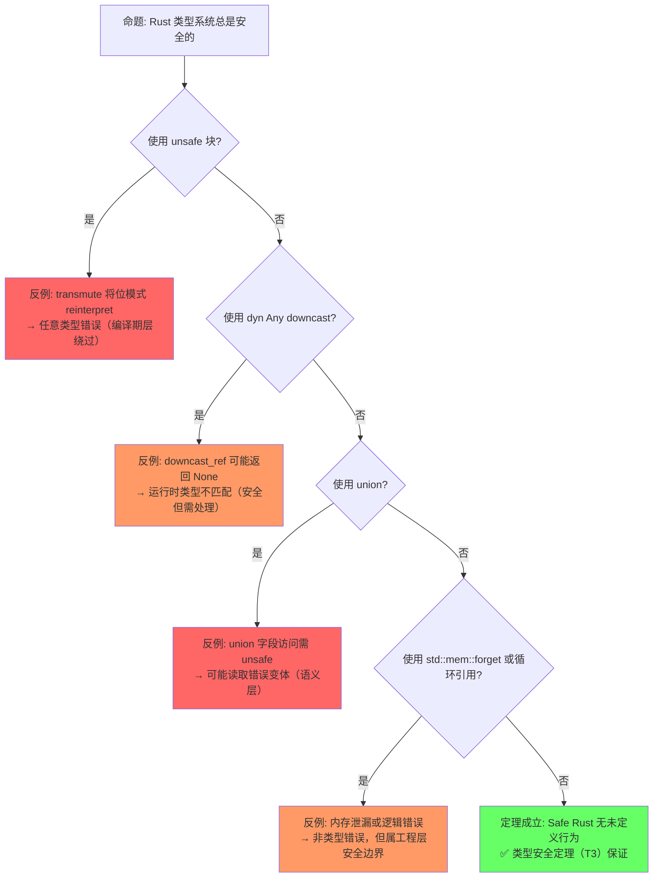
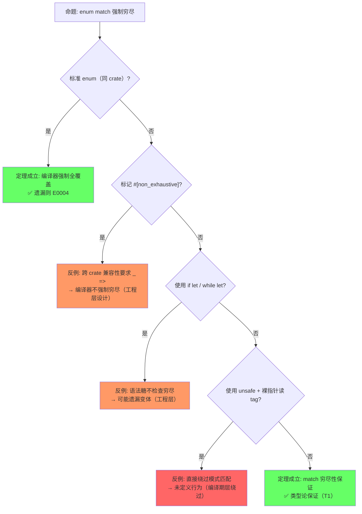
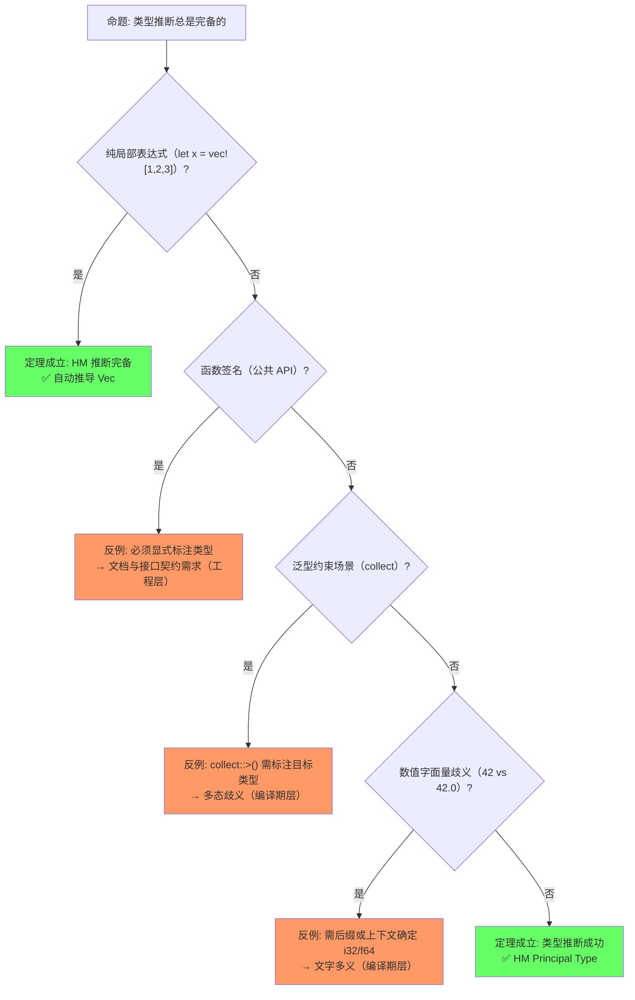

# Type System Basics（类型系统基础）

> **层级**: L1 基础概念
> **前置概念**: [Ownership](./01_ownership.md)
> **后置概念**: [Traits](../02_intermediate/01_traits.md) · [Generics](../02_intermediate/02_generics.md) · [Algebraic Data Types](../02_intermediate/01_traits.md)
> **主要来源**: [TRPL: Ch3](https://doc.rust-lang.org/book/ch03-00-common-programming-concepts.html) · [TRPL: Ch6](https://doc.rust-lang.org/book/ch06-00-enums.html) · [Wikipedia: Type system] · [Rust Reference: Types]

---

**变更日志**:

- v1.0 (2026-05-12): 初始版本，完成权威定义、类型分类矩阵、ADT 分析、形式化视角、思维导图、示例反例
- v2.0 (2026-05-12): 深度重构，补充引理-定理-推论 ⟹ 链条、四层反命题分析、六步认知路径、章节过渡、相关概念链接

---

## 一、权威定义（Definition）

### 1.1 Wikipedia 定义

> **[Wikipedia: Type system]** In computer programming, a type system is a logical system comprising a set of rules that assigns a property called a type to every term. A type system constrains the operations that can be performed on values of different types, preventing errors in programs.

> **[Wikipedia: Rust]** Rust has a strong, static type system with type inference. The type system supports algebraic data types, generics, and traits (type classes) but does not use garbage collection.

### 1.2 TRPL 官方定义

> **[TRPL: Ch3.2]** Rust is a statically typed language, which means that it must know the types of all variables at compile time. The compiler can usually infer what type we want to use based on the value and how we use it.

> **[TRPL: Ch6]** Rust's enums are most similar to algebraic data types in functional languages, such as Haskell, F#, OCaml, and others. They allow you to define a type by enumerating its possible variants.

### 1.3 形式化定义

Rust 的类型系统可以形式化为一个**带所有权约束的 Hindley-Milner 类型系统扩展**：

```text
类型推断规则（简化）:
─────────────────────────────────────────
  Γ ⊢ x : τ           （变量）
  Γ ⊢ c : τ           （常量）
  Γ, x:τ₁ ⊢ e : τ₂    （lambda 抽象）
  ─────────────────────
  Γ ⊢ λx.e : τ₁ → τ₂

Rust 扩展:
  Γ ⊢ e : τ₁    τ₁ implements Trait
  ──────────────────────────────────
  Γ ⊢ e : impl Trait

所有权约束:
  Γ; Σ ⊢ e : τ {Σ'}   （Σ = 堆状态，Σ' = 执行后的堆状态）
```

> **[来源: Pierce "Types and Programming Languages"]** Hindley-Milner 类型推断算法及其扩展是 Rust 类型系统的基础。✅
> **[来源: COR: ETH Zurich]** Γ; Σ ⊢ e : τ {Σ'} 的所有权约束形式化表示 Rust 的堆状态演化。✅

> **过渡**: 权威定义从逻辑和官方来源确立了类型系统的语义——静态约束与代数数据类型。而概念属性矩阵则将这些语义转化为可操作的分类——Rust 的类型类别、系统特征与内存布局的系统性对比。

---

## 二、概念属性矩阵（Attribute Matrix）

理解类型系统需要同时把握其静态分类能力与动态内存特征。以下矩阵从类型分类、系统特征与内存布局三个维度建立完整的属性空间。

### 2.1 类型分类矩阵

| **类别** | **子类别** | **Rust 类型** | **内存位置** | **Copy?** | **Size** |
|:---|:---|:---|:---|:---|:---|
| **标量** | 整数 | `i8`-`i128`, `u8`-`u128`, `isize`, `usize` | 栈 | ✅ | 固定 |
| | 浮点 | `f32`, `f64` | 栈 | ✅ | 固定 |
| | 布尔 | `bool` | 栈 | ✅ | 1 byte |
| | 字符 | `char` | 栈 | ✅ | 4 bytes |
| **复合** | 元组 | `(T, U, ...)` | 栈（若成员全栈） | 若成员全 Copy | 成员和 |
| | 数组 | `[T; N]` | 栈（通常） | 若 T: Copy | N × size(T) |
| | 结构体 | `struct` | 视成员而定 | 若成员全 Copy | 成员和 + padding |
| **引用** | 共享 | `&T` | 栈（指针大小） | ✅ | ptr 大小 |
| | 可变 | `&mut T` | 栈（指针大小） | ✅ | ptr 大小 |
| | 裸指针 | `*const T`, `*mut T` | 栈 | ✅ | ptr 大小 |
| **ADT** | 枚举 | `enum` | 标签 + 最大变体 | 若变体全 Copy | tag + max variant |
| | Option | `Option<T>` | 同 `enum` | 若 T: Copy | 优化: 零成本空值 |
| | Result | `Result<T, E>` | 同 `enum` | 若 T,E: Copy | tag + max(T, E) |
| **函数** | 函数指针 | `fn(T) -> U` | 栈 | ✅ | ptr 大小 |
| | 闭包 | `impl Fn/FnMut/FnOnce` | 视捕获而定 | 通常 ❌ | 捕获变量和 |
| **动态** | Trait Object | `dyn Trait` | 栈（胖指针） | ❌ | 2 × ptr |
| | Slice | `[T]` | 无法直接拥有 | N/A | 动态 |

### 2.2 Rust 类型系统特征矩阵

| **特征** | **Rust** | **Haskell** | **C++** | **Java** | **Go** |
|:---|:---|:---|:---|:---|:---|
| **类型检查时机** | 静态 + 编译期 | 静态 | 静态 | 静态 + 运行时擦除 | 静态 |
| **类型推断** | ✅ HM 扩展 | ✅ HM | ⚠️ `auto` | ❌（需显式） | ✅ 局部 |
| **代数数据类型** | ✅ `enum` | ✅ `data` | ⚠️ `variant` (C++17) | ❌ | ❌ |
| **空安全** | ✅ `Option<T>` | ✅ `Maybe` | ❌ `nullptr` | ⚠️ `Optional` | ❌ `nil` |
| **错误处理类型** | ✅ `Result<T,E>` | ✅ `Either` | ❌ 异常 | ⚠️ 异常/Optional | ⚠️ 多返回值 |
| **泛型** | ✅ 单态化 | ✅ | ✅ 模板 | ⚠️ 类型擦除 | ✅ 无约束 |
| **Trait/类型类** | ✅ | ✅ 类型类 | ⚠️ Concepts (C++20) | ✅ 接口 | ✅ 接口 |
| **线性/所有权类型** | ✅ | ⚠️ 线性类型扩展 | ❌ | ❌ | ❌ |

---

> **过渡**: 属性矩阵展示了类型系统的静态分类能力，接下来需要建立概念之间的关联网络——类型如何与所有权、借用、生命周期、Trait 等机制交织，形成完整的类型安全体系。

## 三、思维导图（Mind Map）

Rust 类型系统的全部知识可以组织为"标量—复合—ADT—引用—特殊类型"五个维度，其中 ADT 是 Rust 区别于传统命令式语言的核心表达工具。

```mermaid
graph TD
    A[Type System 类型系统] --> B[标量类型]
    A --> C[复合类型]
    A --> D[代数数据类型 ADT]
    A --> E[引用类型]
    A --> F[特殊类型]

    B --> B1[整数: i8..i128, u8..u128, isize, usize]
    B --> B2[浮点: f32, f64]
    B --> B3[bool, char]

    C --> C1[元组: (T, U)]
    C --> C2[数组: [T; N]]
    C --> C3[结构体: struct]
    C --> C4[切片: [T]]

    D --> D1[枚举: enum = Sum Type]
    D --> D2[Option<T> = 1 + T]
    D --> D3[Result<T, E> = T + E]
    D --> D4[Never: ! = 空类型]

    E --> E1[&T: 共享引用]
    E --> E2[&mut T: 可变引用]
    E --> E3[*const/*mut T: 裸指针]

    F --> F1[impl Trait: 存在类型]
    F --> F2[dyn Trait: 动态分发]
    F --> F3[!: Never 类型]
    F --> F4[元类型: type/const 泛型]
```

---

> **过渡**: 思维导图呈现了类型系统的静态知识结构，而定理推理链则回答"为什么类型检查能保证安全"——通过代数类型、模式匹配穷尽性、类型一致性的层层演绎，建立类型系统的形式化保证。

## 四、定理推理链（Theorem Chain）

Rust 类型系统的安全性保障同样由引理、定理与推论构成严密的推理链条。以下链条从代数结构的完备性出发，一直延伸到运行时安全保证。

### 4.1 引理：ADT（枚举 + 结构体）⟹ 代数数据类型完备性

```text
引理 L1: ADT 代数完备性
  前提: struct 对应积类型（Product Type / ×）
  前提: enum  对应余积类型（Sum Type / Coproduct / +）
    ↓
  结论: Rust ADT 在范畴论意义上封闭于积与余积
    ↓
  ⟹ 任何可计算数据结构都可由 struct + enum 组合表达
```

> **[来源: Category Theory for Programmers]** enum 对应余积（Coproduct / Sum Type），struct 对应积（Product Type）。✅
> **[来源: Pierce "Types and Programming Languages"]** 积与余积的组合构成代数数据类型的完备基。✅

### 4.2 引理：NPO 零成本空值优化 ⟹ Option<&T> 的内存同构于 &T

```text
引理 L2: Null Pointer Optimization
  前提: Rust 引用 `&T` 永不为 null（内存安全公理）
  前提: `Option<&T>` 是余积类型 `1 + &T`
    ↓
  结论: 编译器可用 `&T` 的 0x0 编码 `None`，消除 tag
    ↓
  ⟹ Option<&T> 的内存布局与 &T 完全相同，空值检查零成本
```

> **[来源: Rust Reference: Enums]** NPO 利用引用永不为 null 的特性将 Option<&T> 压缩为单个指针。✅

### 4.3 定理：match 穷尽性检查 ⟹ 无未处理变体

```text
定理 T1: Match 穷尽性
  前提: enum 定义封闭集合（所有变体编译期已知）
  前提: 引理 L1（ADT 完备性确保所有数据结构可枚举）
    ↓
  结论: 编译器验证 match 覆盖 enum 的所有变体
    ↓
  ⟹ Safe Rust 中对 enum 的 match 不会遗漏 case，无需默认分支即可保证穷尽性
```

> **[来源: Rust Reference: Patterns]** match 穷尽性检查由编译器验证，确保 enum 的所有变体都被处理。✅
> **[来源: TRPL: Ch6.1]** Option<T> 强制处理 None 情况，消除空指针错误。✅

### 4.4 定理：类型推断完备性 ⟹ Principal type property

```text
定理 T2: 类型推断完备性
  前提: Rust 类型推断基于 Hindley-Milner 算法的扩展
  前提: 无显式泛型约束的表达式
    ↓
  结论: 存在唯一的最一般类型（Principal Type）可被编译器推断
    ↓
  ⟹ 程序员在绝大多数局部场景无需显式标注类型，同时保持静态检查的严格性
```

> **[来源: Pierce "Types and Programming Languages"]** Hindley-Milner 类型推断对无显式约束的表达式是完备的（Principal type property）。✅

### 4.5 定理：类型一致性（Progress + Preservation）⟹ 运行时无类型错误

```text
定理 T3: 类型安全定理
  前提: 程序通过 Rust 类型检查（含 borrow check）
  前提: 不使用 unsafe 绕过类型系统
    ↓
  结论: Progress（良类型程序不会卡住）+ Preservation（归约保持类型）
    ↓
  ⟹ Safe Rust 运行时不会发生类型不匹配导致的未定义行为
```

> **[来源: Wright & Felleisen 1994]** 类型安全定理（Progress + Preservation）是类型系统的标准元定理。✅

### 4.6 推论：Option<T> ⟹ 空指针在类型层面消除

```text
推论 C1: 空指针消除
  前提: 定理 T1（match 穷尽性）
  前提: 引理 L2（NPO 零成本）
    ↓
  结论: `T` 与 `None` 被强制分离为不同变体，必须显式处理
    ↓
  ⟹ Tony Hoare 的"十亿美元错误"（null pointer）在 Rust 类型层面被消除，且无需运行时开销
```

> **[来源: Wikipedia: Null pointer]** Tony Hoare 将 null 引入 ALGOL W 称为"十亿美元错误"。✅

### 4.7 推论：Result<T, E> ⟹ 错误在类型层面强制处理

```text
推论 C2: 错误强制处理
  前提: 定理 T1（match 穷尽性）
  前提: 引理 L1（ADT 完备性）
    ↓
  结论: `Ok(T)` 与 `Err(E)` 作为 enum 变体，match 必须同时处理
    ↓
  ⟹ 异常隐藏控制流的问题被消除，所有错误路径在类型上显式且不可遗漏
```

> **[来源: TRPL: Ch9]** Result<T, E> 强制显式错误处理，避免异常带来的隐藏控制流。✅

### 4.8 推论：! (Never type) ⟹ 发散类型的逻辑完备性

```text
推论 C3: Never 类型完备性
  前提: 引理 L1（ADT 完备性）
  前提: 类型系统中需要表达"永不返回"的函数语义
    ↓
  结论: `!` 作为空类型（Bottom Type），可与任何类型统一
    ↓
  ⟹ `panic!()`、`loop {}`、`exit()` 等发散函数可安全参与任意控制流，类型系统逻辑闭合
```

> **[来源: Rust Reference: Never type]** `!` 是 Rust 的空类型，可与任意类型统一（coerce）。✅

### 4.9 定理一致性矩阵

| **定理/引理/推论** | **前提** | **结论** | **依赖的 L4 公理** | **被哪些定理依赖** | **失效条件** | **典型错误码** |
|:---|:---|:---|:---|:---|:---|:---|
| L1: ADT 代数完备性 | struct = 积, enum = 余积 | 所有数据结构可组合表达 | 范畴论（积/余积） | T1, C2, C3 | 无法表达开放变体（需 dyn Trait） | — |
| L2: NPO 零成本优化 | `&T` 永不为 null | Option<&T> ≅ &T 内存布局 | 内存安全公理 | C1 | 非引用类型无 NPO | — |
| T1: Match 穷尽性 | enum 封闭 + match 全覆盖 | 无遗漏 case | 代数类型论（和类型） | C1, C2 | `#[non_exhaustive]` 跨 crate | E0004 |
| T2: 类型推断完备性 | 无显式泛型约束 | 唯一最一般类型可推断 | HM 类型推断 | — | 多态场景需标注 | E0282 |
| T3: 类型安全定理 | 类型检查通过 + 无 unsafe | Progress + Preservation | 类型论元定理 | — | `std::mem::transmute` | — |
| C1: 空指针消除 | T1 + L2 | null 在类型层面不可达 | 和类型 + NPO | — | `unsafe` 构造 null &T | — |
| C2: 错误强制处理 | T1 + L1 | 错误路径不可遗漏 | 和类型穷尽性 | — | `unwrap()` 运行时 panic | — |
| C3: Never 类型完备性 | L1 | 发散函数参与任意控制流 | 空类型 (⊥) | — | 不稳定特性需 nightly | — |

> **一致性检查**: L1 ⟹ L2 ⟹ T1/T2/T3 ⟹ C1/C2/C3，形成**从代数结构到运行时安全**的递进链。T1 是连接 ADT 结构与程序正确性的枢纽定理。
>
> **跨层映射**: 本文件定理 ↔ [`00_meta/inter_layer_map.md`](../00_meta/inter_layer_map.md) §4.2 "类型系统一致性"

---

## 五、示例与反例（Examples & Counter-examples）

定理链条的正确性需要通过代码实例来验证。以下示例覆盖正确用法、编译期反例与运行时边界。

### 5.1 正确示例：ADT + Pattern Matching

```rust
// ✅ 正确: enum 表示可能的状态，match 穷尽处理
enum Message {
    Quit,
    Move { x: i32, y: i32 },
    Write(String),
    ChangeColor(i32, i32, i32),
}

fn process(msg: Message) {
    match msg {
        Message::Quit => println!("Quit"),
        Message::Move { x, y } => println!("Move to ({}, {})", x, y),
        Message::Write(text) => println!("Text: {}", text),
        Message::ChangeColor(r, g, b) => println!("RGB({}, {}, {})", r, g, b),
    } // ✅ 编译器验证：所有变体都被处理
}
```

### 5.2 正确示例：Option 消除空值

```rust
// ✅ 正确: Option 强制处理空值情况
fn divide(numerator: f64, denominator: f64) -> Option<f64> {
    if denominator == 0.0 {
        None
    } else {
        Some(numerator / denominator)
    }
}

fn main() {
    let result = divide(10.0, 2.0);
    match result {
        Some(x) => println!("Result: {}", x),
        None => println!("Cannot divide by zero"),
    }
    // 不能直接使用 result + 1（Option<f64> 不实现 Add）
    // 必须先 unwrap 或 match
}
```

### 5.3 反例：未覆盖的 match 分支（E0004）

```rust
// ❌ 反例: non-exhaustive pattern
enum Color {
    Red,
    Green,
    Blue,
}

fn print_color(c: Color) {
    match c {
        Color::Red => println!("Red"),
        Color::Green => println!("Green"),
        // E0004: non-exhaustive patterns: `Blue` not covered
    }
}
```

**错误分析**：

- `Color` 是封闭 enum，编译器已知三个变体
- match 仅覆盖两个变体，违反定理 T1
- 编译器在编译期拦截，而非运行时抛出异常

**修正方案**：

```rust
// ✅ 修正: 覆盖所有变体或使用通配符
fn print_color(c: Color) {
    match c {
        Color::Red => println!("Red"),
        Color::Green => println!("Green"),
        Color::Blue => println!("Blue"),
    }
}

// 或
fn print_color(c: Color) {
    match c {
        Color::Red => println!("Red"),
        Color::Green => println!("Green"),
        _ => println!("Other"),  // ✅ 通配符覆盖剩余变体
    }
}
```

### 5.4 反例：递归类型需要间接层（E0072）

```rust
// ❌ 反例: 递归类型直接自包含
enum List<T> {
    Cons(T, List<T>),  // E0072: recursive type has infinite size
    Nil,
}
```

**错误分析**：

- `List<T>` 的大小 = tag + max(size(T), size(List<T>))
- size(List<T>) 出现在等式右侧，导致无限递归
- 这是 ADT 代数完备性在内存布局层面的边界：无限类型需要递归锚点

**修正方案**：

```rust
// ✅ 修正: 使用 Box 提供间接层（指针大小固定，终止递归）
enum List<T> {
    Cons(T, Box<List<T>>),
    Nil,
}
```

---

## 六、反命题与边界分析（Inverse Propositions & Boundary Analysis）

任何定理都有成立边界。以下通过决策树系统分析三个核心命题的成立条件与反例分布。

### 6.1 命题: "Rust 类型系统总是安全的"



**四层分类**：

| **层次** | **反例** | **性质** |
|:---|:---|:---|
| 编译期 | `unsafe` 块、`transmute`、`union` | 显式绕过类型系统 |
| 运行时 | `dyn Any::downcast_ref` 返回 `None` | 安全，但逻辑可能错误 |
| 语义 | `union` 字段误读、类型双关 | 需 unsafe，编译器不保证 |
| 工程 | `std::mem::forget`、Rc 循环引用 | 内存泄漏，非 UB，但属安全边界 |

### 6.2 命题: "enum match 强制穷尽"



**核心洞察**：`#[non_exhaustive]` 和 `if let` 是编译器故意提供的"逃生舱"，它们在工程层面削弱了穷尽性，但仍在 Safe Rust 的边界内。

### 6.3 命题: "类型推断总是完备的"



---

## 七、边界极限测试代码（Boundary Stress Tests）

边界测试是验证定理在极限场景下是否仍然成立的关键手段。以下三个测试分别挑战类型一致性、穷尽性边界与 NPO 优化。

### 7.1 边界：unsafe 绕过类型系统后的行为

```rust
// 测试: transmute 破坏类型安全（unsafe 边界）
fn type_safety_boundary() {
    let i: u32 = 0x0041_0000;  // 'A' 的 ASCII 码放在高 16 位
    let f: f32 = unsafe { std::mem::transmute(i) };
    println!("transmute u32 -> f32: {}", f);  // 非预期数值，非 panic

    // 更危险的: 将整数转引用（仅在测试环境中展示概念）
    // let ptr: &u32 = unsafe { std::mem::transmute(0x1usize) };
    // 解引用 ptr → 立即段错误 / 未定义行为
}

fn main() {
    type_safety_boundary();
}
```

### 7.2 边界：#[non_exhaustive] 对穷尽性的削弱

```rust
// 测试: 跨 crate 的 non_exhaustive enum 需要通配符
mod external {
    #[non_exhaustive]
    pub enum Status {
        Ok,
        Err,
    }
}

fn handle_status(s: external::Status) {
    match s {
        external::Status::Ok => println!("ok"),
        external::Status::Err => println!("err"),
        // 若省略 _ =>，在当前 crate 编译通过（因为只有两个变体）
        // 但若 external crate 新增变体，当前 crate 不会因此编译失败
        // 这正是 #[non_exhaustive] 的设计意图
        _ => println!("unknown"),
    }
}

fn main() {
    handle_status(external::Status::Ok);
}
```

### 7.3 边界：NPO 与 Option<&T> 的内存同构验证

```rust
// 测试: 验证 Option<&T> 与 &T 大小相同（NPO）
use std::mem::size_of;

fn npo_boundary() {
    assert_eq!(size_of::<&u32>(), size_of::<Option<&u32>>());
    assert_eq!(size_of::<Box<u32>>(), size_of::<Option<Box<u32>>>());

    // 对比: 无 NPO 的类型（tag 无法消除）
    assert!(size_of::<Option<u32>>() > size_of::<u32>());

    println!("NPO verified: Option<&u32> = {} bytes", size_of::<Option<&u32>>());
}

fn main() {
    npo_boundary();
}
```

---

## 八、认知路径（Cognitive Path）

从直觉到形式化的过渡需要六步递进的认知脚手架。每一步不仅提供新知识，还解释"为什么这一步必须接在上一步之后"。

### Step 1: 直觉困惑（Intuitive Confusion）

> **核心困惑**: "为什么 enum 比 null 好？"
>
> 大多数命令式语言程序员习惯于 `T` 可能就是 `null`，并用 `if (x != null)` 防御。Rust 要求写成 `Option<T>` 并强制 match，初看像是"多余的语法噪音"。困惑的根源在于将"类型的存在性"视为默认，而未意识到**null 实际上是一种隐式的、不可追踪的类型状态**。

### Step 2: 具体场景（Concrete Scenario）

> **过渡**: 抽象辩论无法说服习惯 null 的程序员，必须先看到具体的崩溃场景。
>
> 想象一个函数返回 `User`，调用方直接访问 `user.name`，但数据库查询实际返回了空结果。在 null 语言中，这是运行时 `NullPointerException`。Rust 的 `Option<User>` 强制调用方在编译期处理 `None`，**将运行时崩溃转化为编译期错误**。具体场景让"显式空值"获得了动机——它不是噪音，而是保险。
>
> **锚点示例**: `fn find_user(id: u64) -> Option<User>` 的调用方必须写 `if let Some(u) = ...` 或 `match`。

### Step 3: 模式抽象（Pattern Abstraction）

> **过渡**: 单个场景不足以指导系统设计，需要提炼为可复用的模式。
>
> 从"Option 强制处理空值"抽象出**通用模式**：Rust 用 enum 将"可能的状态"编码为**和类型（Sum Type）**。`Option<T> = Some(T) | None`，`Result<T, E> = Ok(T) | Err(E)`。每一种状态都是显式变体，不存在隐式的"第三种可能"。这引出了引理 L1 的直觉版本：enum 让我们可以**枚举所有可能并强制处理每一种**。
>
> **模式提炼**: 所有"或"关系都应由 enum 表达，所有"与"关系都应由 struct 表达。

### Step 4: 形式规则（Formal Rules）

> **过渡**: 模式在简单场景有效，但递归类型、泛型 ADT、与 trait 的交互需要更精确的工具。
>
> 引入**代数数据类型（ADT）**的形式框架：struct 是**积类型** `A × B`（同时拥有 A 和 B），enum 是**余积类型** `A + B`（要么是 A 要么是 B）。`Option<T> ≅ 1 + T`，其中 `1` 是单元类型（None）。match 的穷尽性检查对应于**和类型的消除规则**——你必须处理所有注入（injection）。这正是定理 T1 的形式化根基。
>
> **形式公理**: 若类型 `T` 是封闭 enum，则对 `T` 的 match 必须覆盖其所有构造子（constructors）。

### Step 5: 代码验证（Code Verification）

> **过渡**: 形式规则必须落回代码，否则只是代数游戏。
>
> 用编译错误 E0004 验证形式规则：当你遗漏一个 enum 变体时，编译器不仅报错，还会列出未覆盖的变体。这不是简单的语法检查——它是在执行**和类型的穷尽性证明**。尝试添加 `#[non_exhaustive]`，观察通配符 `_ =>` 如何成为编译器认可的"穷尽策略"，从而理解定理的边界。
>
> **验证实验**: 故意遗漏 match 分支，阅读错误信息；再添加 `_ =>`，观察编译通过，思考"安全"与"完备"的权衡。

### Step 6: 边界测试（Boundary Testing）

> **过渡**: 理解规则的正常运作只是起点，掌握其失效边界才能写出健壮的系统代码。
>
> 边界测试回答：unsafe transmute 能破坏类型安全吗？`#[non_exhaustive]` 如何削弱穷尽性？NPO 对所有类型都生效吗？通过刻意构造极限代码，验证定理在极端条件下的行为，完成从"学习类型系统"到"驾驭类型系统"的跃迁。
>
> **终极边界**: `std::mem::transmute`、`#[non_exhaustive]` 跨 crate 演化、`Option<bool>` 与 `Option<&T>` 的内存布局差异。

```text
直觉困惑 ──→ 具体场景 ──→ 模式抽象 ──→ 形式规则 ──→ 代码验证 ──→ 边界测试
    │           │           │           │           │           │
    ▼           ▼           ▼           ▼           ▼           ▼
"为什么 Rust     "null 指针    "Option<T> =    "和类型:       "编译器强制    "unwrap()
没有 null？"   导致崩溃      显式空值"      Some/None     match 处理"    运行时 panic"
              怎么避免？"                  代数完备"                    "non_exhaustive
                                                                      削弱穷尽"

"怎么实现        "不同类型需要   "Trait = 共享    "Type Class /  "impl / dyn    "对象安全
多态？"        相同接口"      行为接口"      存在类型"      分发"        限制"

"编译器怎么      "let x =       "类型推断 =     "HM 算法:      "rustc 自动    "collect()
知道变量        vec![1,2,3]    约束求解"       统一算法"      推导"        需标注"
类型？"        不需要写类型？"
```

**认知脚手架**：

- **类比**: enum 像"单选按钮"——必须且只能选一个；struct 像"表单"——每个字段都必须填写。
- **反直觉点**: 很多语言有隐式 null，Rust 用 `Option<T>` 强制显式处理。
- **形式化过渡**: 从"不能为空" → `Option<T>` 类型 → "和类型 (A + 1)" → "代数类型论" → "范畴论余积".

---

## 九、国际课程与论文对齐

| 来源 | 核心内容 | 与本文件对应 |
|:---|:---|:---|
| **[CMU 17-363: Programming Language Pragmatics]** | 类型系统、ADT、模式匹配 | L1 类型系统 |
| **[CMU 17-350: Safe Systems Programming]** | 类型安全与内存安全的关系 | T3 类型安全定理 |
| **[Wikipedia: Type system]** | 类型系统的通用定义 | 权威定义 §1.1 |
| **[Wikipedia: Algebraic data type]** | 积类型与余积类型 | 引理 L1 |
| **[Pierce "Types and Programming Languages"]** | Hindley-Milner、类型推断、子类型 | T2、形式化定义 |
| **[Wright & Felleisen 1994]** | Progress + Preservation | T3 类型安全定理 |
| **[Category Theory for Programmers]** | 积、余积、初始对象、终对象 | L1 ADT 完备性 |
| **[TRPL: Ch3.2]** | 静态类型与类型推断 | 权威定义 §1.2 |
| **[TRPL: Ch6]** | enum 与模式匹配 | T1 match 穷尽性 |
| **[TRPL: Ch9]** | Result<T, E> 错误处理 | 推论 C2 |

---

## 十、知识来源关系（Provenance）

| **论断** | **来源** | **可信度** |
|:---|:---|:---|
| Rust 是静态类型语言 | [TRPL: Ch3.2] | ✅ |
| 编译器通常可推断类型 | [TRPL: Ch3.2] | ✅ |
| enum 类似函数式语言的 ADT | [TRPL: Ch6] | ✅ |
| `Option<T>` 消除空指针 | [TRPL: Ch6.1] · [Wikipedia: Null pointer] | ✅ |
| `Result<T, E>` 强制错误处理 | [TRPL: Ch9] | ✅ |
| NPO 优化 Option<&T> | [Rust Reference: Enums] | ✅ |
| ADT 对应积与余积 | [Category Theory for Programmers] | ✅ |
| match 穷尽性检查 | [Rust Reference: Patterns] | ✅ |
| 类型系统理论基础 | [Pierce 2002 — Types and Programming Languages] | ✅ |
| 类型安全定理 (Progress + Preservation) | [Wright & Felleisen 1994 — JFP] | ✅ |
| 子类型理论基础 | [Cardelli 1996 — Type Systems, ACM Computing Surveys] | ✅ |
| Never 类型语义 | [Rust Reference: Never type] | ✅ |

---

## 十一、相关概念链接

- [Ownership](./01_ownership.md) — 类型系统与所有权规则共同构成 Safe Rust 的内存安全基础
- [Borrowing](./02_borrowing.md) — 引用类型 `&T`、`&mut T` 是类型系统对内存别名的约束表达
- [Lifetimes](./03_lifetimes.md) — 生命周期是类型系统的参数化扩展，将时间维度引入类型
- [Traits](../02_intermediate/01_traits.md) — Trait 将行为抽象引入类型系统，对应 Haskell Type Class
- [Generics](../02_intermediate/02_generics.md) — 泛型参数化使 ADT 具备多态表达能力
- [00_meta/inter_layer_map.md](../00_meta/inter_layer_map.md) — 跨层定理映射 §4.2 "类型系统一致性"

---

## 十二、待补充与演进方向（TODOs）

- [ ] **TODO**: 补充 `!` (Never type) 的完整形式化分析与控制流图交互 —— 优先级: 中 —— 预计: Phase 1
- [ ] **TODO**: 补充 Const Generics（常量泛型）的类型系统扩展 —— 优先级: 中 —— 预计: Phase 2
- [ ] **TODO**: 补充 Type Inference 的 HM 算法完整规则与 Rust 扩展 —— 优先级: 低 —— 预计: Phase 3
- [ ] **TODO**: 补充 Zero-sized types (ZST) 和 PhantomData 的类型论意义 —— 优先级: 中 —— 预计: Phase 2
- [ ] **TODO**: 补充 Discriminant 和内存布局的底层分析 —— 优先级: 低 —— 预计: Phase 3
- [ ] **TODO**: 补充 `union` 的类型安全边界与使用模式 —— 优先级: 低 —— 预计: Phase 3
