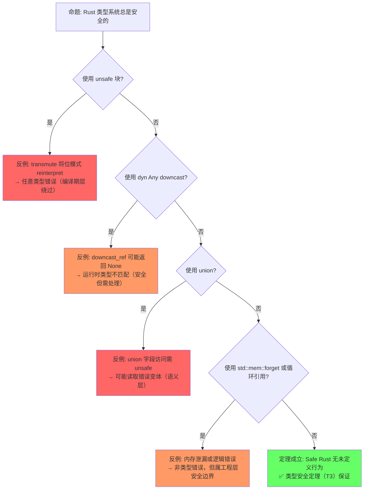
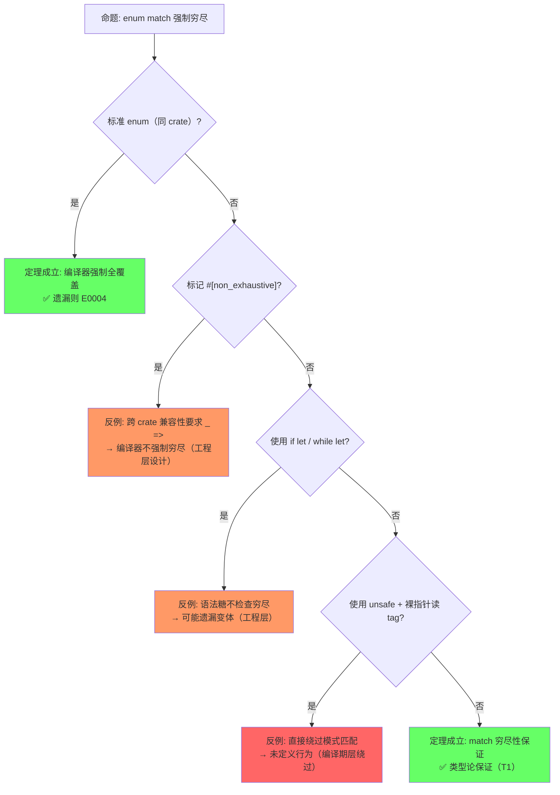
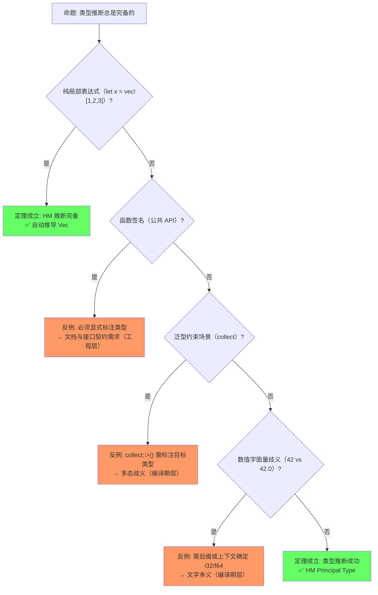
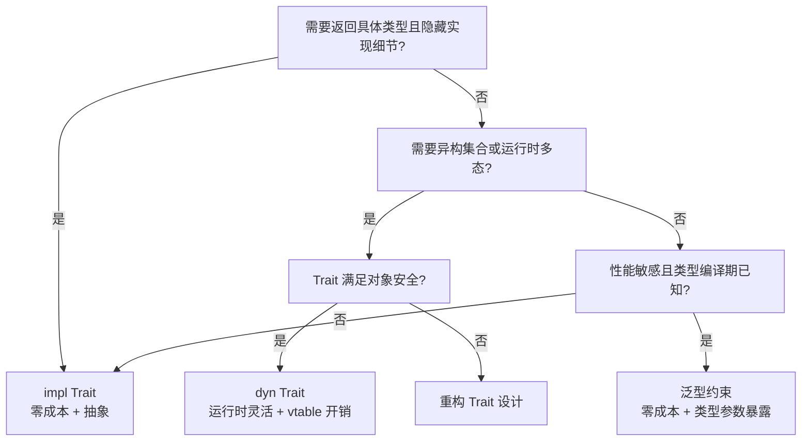
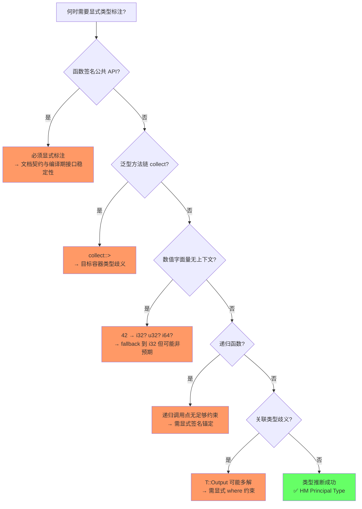

# Type System Basics（类型系统基础）

> **层级**: L1 基础概念
> **前置概念**: [Ownership](./01_ownership.md)
> **后置概念**: [Traits](../02_intermediate/01_traits.md) · [Generics](../02_intermediate/02_generics.md) · [Algebraic Data Types](../02_intermediate/01_traits.md)
> **主要来源**: [TRPL: Ch3](https://doc.rust-lang.org/book/ch03-00-common-programming-concepts.html) · [TRPL: Ch6](https://doc.rust-lang.org/book/ch06-00-enums.html) · [Wikipedia: Type system] · [Rust Reference: Types]

---

> **Bloom 层级**: 理解 → 分析 → 评价
**变更日志**:

- v1.0 (2026-05-12): 初始版本，完成权威定义、类型分类矩阵、ADT 分析、形式化视角、思维导图、示例反例
- v2.0 (2026-05-12): 深度重构，补充引理-定理-推论 ⟹ 链条、四层反命题分析、六步认知路径、章节过渡、相关概念链接

---

## 📑 目录

- [Type System Basics（类型系统基础）](#type-system-basics类型系统基础)
  - [📑 目录](#-目录)
  - [一、权威定义（Definition）](#一权威定义definition)
    - [1.1 Wikipedia 定义](#11-wikipedia-定义)
    - [1.2 TRPL 官方定义](#12-trpl-官方定义)
    - [1.3 形式化定义](#13-形式化定义)
  - [二、概念属性矩阵（Attribute Matrix）](#二概念属性矩阵attribute-matrix)
    - [2.1 类型分类矩阵](#21-类型分类矩阵)
    - [2.2 Rust 类型系统特征矩阵](#22-rust-类型系统特征矩阵)
  - [三、思维导图（Mind Map）](#三思维导图mind-map)
  - [四、定理推理链（Theorem Chain）](#四定理推理链theorem-chain)
    - [4.1 引理：ADT（枚举 + 结构体）⟹ 代数数据类型完备性](#41-引理adt枚举--结构体-代数数据类型完备性)
    - [4.2 引理：NPO 零成本空值优化 ⟹ Option\<\&T\> 的内存同构于 \&T](#42-引理npo-零成本空值优化--optiont-的内存同构于-t)
    - [4.3 定理：match 穷尽性检查 ⟹ 无未处理变体](#43-定理match-穷尽性检查--无未处理变体)
    - [4.4 定理：类型推断完备性 ⟹ Principal type property](#44-定理类型推断完备性--principal-type-property)
    - [4.5 定理：类型一致性（Progress + Preservation）⟹ 运行时无类型错误](#45-定理类型一致性progress--preservation-运行时无类型错误)
    - [4.6 推论：Option ⟹ 空指针在类型层面消除](#46-推论option--空指针在类型层面消除)
    - [4.7 推论：Result\<T, E\> ⟹ 错误在类型层面强制处理](#47-推论resultt-e--错误在类型层面强制处理)
    - [4.8 推论：! (Never type) ⟹ 发散类型的逻辑完备性](#48-推论-never-type--发散类型的逻辑完备性)
    - [4.9 定理一致性矩阵](#49-定理一致性矩阵)
  - [五、示例与反例（Examples \& Counter-examples）](#五示例与反例examples--counter-examples)
    - [5.1 正确示例：ADT + Pattern Matching](#51-正确示例adt--pattern-matching)
    - [5.2 正确示例：Option 消除空值](#52-正确示例option-消除空值)
    - [5.3 反例：未覆盖的 match 分支（E0004）](#53-反例未覆盖的-match-分支e0004)
    - [5.4 反例：递归类型需要间接层（E0072）](#54-反例递归类型需要间接层e0072)
  - [六、反命题与边界分析（Inverse Propositions \& Boundary Analysis）](#六反命题与边界分析inverse-propositions--boundary-analysis)
    - [6.1 命题: "Rust 类型系统总是安全的"](#61-命题-rust-类型系统总是安全的)
    - [6.2 命题: "enum match 强制穷尽"](#62-命题-enum-match-强制穷尽)
    - [6.3 命题: "类型推断总是完备的"](#63-命题-类型推断总是完备的)
  - [七、边界极限测试代码（Boundary Stress Tests）](#七边界极限测试代码boundary-stress-tests)
    - [7.1 边界：unsafe 绕过类型系统后的行为](#71-边界unsafe-绕过类型系统后的行为)
    - [7.2 边界：#\[non\_exhaustive\] 对穷尽性的削弱](#72-边界non_exhaustive-对穷尽性的削弱)
    - [7.3 边界：NPO 与 Option\<\&T\> 的内存同构验证](#73-边界npo-与-optiont-的内存同构验证)
  - [八、认知路径（Cognitive Path）](#八认知路径cognitive-path)
    - [Step 1: 直觉困惑（Intuitive Confusion）](#step-1-直觉困惑intuitive-confusion)
    - [Step 2: 具体场景（Concrete Scenario）](#step-2-具体场景concrete-scenario)
    - [Step 3: 模式抽象（Pattern Abstraction）](#step-3-模式抽象pattern-abstraction)
    - [Step 4: 形式规则（Formal Rules）](#step-4-形式规则formal-rules)
    - [Step 5: 代码验证（Code Verification）](#step-5-代码验证code-verification)
    - [Step 6: 边界测试（Boundary Testing）](#step-6-边界测试boundary-testing)
  - [九、国际课程与论文对齐](#九国际课程与论文对齐)
  - [十、知识来源关系（Provenance）](#十知识来源关系provenance)
  - [十一、相关概念链接](#十一相关概念链接)
    - [补充章节：`impl Trait` 与 `dyn Trait` 的类型论差异](#补充章节impl-trait-与-dyn-trait-的类型论差异)
      - [存在类型 vs 全称类型](#存在类型-vs-全称类型)
      - [单态化 vs 动态分发：性能对比](#单态化-vs-动态分发性能对比)
      - [vtable 内存开销](#vtable-内存开销)
      - [选择决策树](#选择决策树)
    - [11.1 补充：`!` (Never type) 的形式化分析](#111-补充-never-type-的形式化分析)
      - [形式化定义](#形式化定义)
      - [控制流交互：`!` 作为统一分支类型](#控制流交互-作为统一分支类型)
      - [`Result<T, !>`：表示"不可能出错"](#resultt-表示不可能出错)
    - [11.2 补充：Zero-Sized Types (ZST) 与 `PhantomData`](#112-补充zero-sized-types-zst-与-phantomdata)
      - [ZST 的类型论意义](#zst-的类型论意义)
      - [`PhantomData<T>` 的工程用途](#phantomdatat-的工程用途)
      - [`PhantomData` 与 variance](#phantomdata-与-variance)
    - [11.3 Const Generics（常量泛型）](#113-const-generics常量泛型)
    - [11.4 Type Inference：HM 算法完整规则](#114-type-inferencehm-算法完整规则)
      - [11.4.1 HM 核心规则（Var、App、Abs、Let）](#1141-hm-核心规则varappabslet)
      - [11.4.2 统一（Unification）过程](#1142-统一unification过程)
      - [11.4.3 Rust 对 HM 算法的扩展](#1143-rust-对-hm-算法的扩展)
      - [11.4.4 `let` 多态性（let-polymorphism）与 Rust 的 `let` 绑定](#1144-let-多态性let-polymorphism与-rust-的-let-绑定)
      - [11.4.5 类型推断的边界（何时需要显式标注）](#1145-类型推断的边界何时需要显式标注)
      - [11.4.6 与 Haskell、ML 的类型推断对比](#1146-与-haskellml-的类型推断对比)
    - [11.5 Discriminant 与 Enum 内存布局](#115-discriminant-与-enum-内存布局)
      - [11.5.1 Discriminant 的基本概念与 `std::mem::discriminant`](#1151-discriminant-的基本概念与-stdmemdiscriminant)
      - [11.5.2 枚举的内存布局：Tagged Union 模型](#1152-枚举的内存布局tagged-union-模型)
      - [11.5.3 Niche Optimization 与 Null Pointer Optimization（NPO）](#1153-niche-optimization-与-null-pointer-optimizationnpo)
      - [11.5.4 `#[repr]` 对 Discriminant 与布局的影响](#1154-repr-对-discriminant-与布局的影响)
      - [11.5.5 `std::mem::Discriminant<T>` 与 `DiscriminantKind`](#1155-stdmemdiscriminantt-与-discriminantkind)
      - [11.5.6 `mem::size_of` 与 `mem::align_of` 的对比分析](#1156-memsize_of-与-memalign_of-的对比分析)
      - [11.5.7 边界极限测试：用 unsafe 窥探原始字节](#1157-边界极限测试用-unsafe-窥探原始字节)
    - [11.6 `union` 的类型安全边界](#116-union-的类型安全边界)
  - [十二、待补充与演进方向（TODOs）](#十二待补充与演进方向todos)
  - [Wikipedia 概念对齐](#wikipedia-概念对齐)

## 一、权威定义（Definition）

### 1.1 Wikipedia 定义

> **[Wikipedia: Type system]** In computer programming, a type system is a logical system comprising a set of rules that assigns a property called a type to every term. A type system constrains the operations that can be performed on values of different types, preventing errors in programs.

> **[Wikipedia: Rust]** Rust has a strong, static type system with type inference. The type system supports algebraic data types, generics, and traits (type classes) but does not use garbage collection.

### 1.2 TRPL 官方定义

> **[TRPL: Ch3.2]** Rust is a statically typed language, which means that it must know the types of all variables at compile time. The compiler can usually infer what type we want to use based on the value and how we use it.

> **[TRPL: Ch6]** Rust's enums are most similar to algebraic data types in functional languages, such as Haskell, F#, OCaml, and others. They allow you to define a type by enumerating its possible variants.

### 1.3 形式化定义

Rust 的类型系统可以形式化为一个**带所有权约束的 Hindley-Milner 类型系统扩展**：

```text
类型推断规则（简化）:
─────────────────────────────────────────
  Γ ⊢ x : τ           （变量）
  Γ ⊢ c : τ           （常量）
  Γ, x:τ₁ ⊢ e : τ₂    （lambda 抽象）
  ─────────────────────
  Γ ⊢ λx.e : τ₁ → τ₂

Rust 扩展:
  Γ ⊢ e : τ₁    τ₁ implements Trait
  ──────────────────────────────────
  Γ ⊢ e : impl Trait

所有权约束:
  Γ; Σ ⊢ e : τ {Σ'}   （Σ = 堆状态，Σ' = 执行后的堆状态）
```

> **[来源: Pierce "Types and Programming Languages"]** Hindley-Milner 类型推断算法及其扩展是 Rust 类型系统的基础。✅
> **[来源: COR: ETH Zurich]** Γ; Σ ⊢ e : τ {Σ'} 的所有权约束形式化表示 Rust 的堆状态演化。✅

> **过渡**: 权威定义从逻辑和官方来源确立了类型系统的语义——静态约束与代数数据类型。而概念属性矩阵则将这些语义转化为可操作的分类——Rust 的类型类别、系统特征与内存布局的系统性对比。

---

## 二、概念属性矩阵（Attribute Matrix）

理解类型系统需要同时把握其静态分类能力与动态内存特征。以下矩阵从类型分类、系统特征与内存布局三个维度建立完整的属性空间。

### 2.1 类型分类矩阵

| **类别** | **子类别** | **Rust 类型** | **内存位置** | **Copy?** | **Size** |
|:---|:---|:---|:---|:---|:---|
| **标量** | 整数 | `i8`-`i128`, `u8`-`u128`, `isize`, `usize` | 栈 | ✅ | 固定 |
| | 浮点 | `f32`, `f64` | 栈 | ✅ | 固定 |
| | 布尔 | `bool` | 栈 | ✅ | 1 byte |
| | 字符 | `char` | 栈 | ✅ | 4 bytes |
| **复合** | 元组 | `(T, U, ...)` | 栈（若成员全栈） | 若成员全 Copy | 成员和 |
| | 数组 | `[T; N]` | 栈（通常） | 若 T: Copy | N × size(T) |
| | 结构体 | `struct` | 视成员而定 | 若成员全 Copy | 成员和 + padding |
| **引用** | 共享 | `&T` | 栈（指针大小） | ✅ | ptr 大小 |
| | 可变 | `&mut T` | 栈（指针大小） | ✅ | ptr 大小 |
| | 裸指针 | `*const T`, `*mut T` | 栈 | ✅ | ptr 大小 |
| **ADT** | 枚举 | `enum` | 标签 + 最大变体 | 若变体全 Copy | tag + max variant |
| | Option | `Option<T>` | 同 `enum` | 若 T: Copy | 优化: 零成本空值 |
| | Result | `Result<T, E>` | 同 `enum` | 若 T,E: Copy | tag + max(T, E) |
| **函数** | 函数指针 | `fn(T) -> U` | 栈 | ✅ | ptr 大小 |
| | 闭包 | `impl Fn/FnMut/FnOnce` | 视捕获而定 | 通常 ❌ | 捕获变量和 |
| **动态** | Trait Object | `dyn Trait` | 栈（胖指针） | ❌ | 2 × ptr |
| | Slice | `[T]` | 无法直接拥有 | N/A | 动态 |

### 2.2 Rust 类型系统特征矩阵

| **特征** | **Rust** | **Haskell** | **C++** | **Java** | **Go** |
|:---|:---|:---|:---|:---|:---|
| **类型检查时机** | 静态 + 编译期 | 静态 | 静态 | 静态 + 运行时擦除 | 静态 |
| **类型推断** | ✅ HM 扩展 | ✅ HM | ⚠️ `auto` | ❌（需显式） | ✅ 局部 |
| **代数数据类型** | ✅ `enum` | ✅ `data` | ⚠️ `variant` (C++17) | ❌ | ❌ |
| **空安全** | ✅ `Option<T>` | ✅ `Maybe` | ❌ `nullptr` | ⚠️ `Optional` | ❌ `nil` |
| **错误处理类型** | ✅ `Result<T,E>` | ✅ `Either` | ❌ 异常 | ⚠️ 异常/Optional | ⚠️ 多返回值 |
| **泛型** | ✅ 单态化 | ✅ | ✅ 模板 | ⚠️ 类型擦除 | ✅ 无约束 |
| **Trait/类型类** | ✅ | ✅ 类型类 | ⚠️ Concepts (C++20) | ✅ 接口 | ✅ 接口 |
| **线性/所有权类型** | ✅ | ⚠️ 线性类型扩展 | ❌ | ❌ | ❌ |

---

> **过渡**: 属性矩阵展示了类型系统的静态分类能力，接下来需要建立概念之间的关联网络——类型如何与所有权、借用、生命周期、Trait 等机制交织，形成完整的类型安全体系。

## 三、思维导图（Mind Map）

Rust 类型系统的全部知识可以组织为"标量—复合—ADT—引用—特殊类型"五个维度，其中 ADT 是 Rust 区别于传统命令式语言的核心表达工具。

```mermaid
graph TD
    A[Type System 类型系统] --> B[标量类型]
    A --> C[复合类型]
    A --> D[代数数据类型 ADT]
    A --> E[引用类型]
    A --> F[特殊类型]

    B --> B1[整数: i8..i128, u8..u128, isize, usize]
    B --> B2[浮点: f32, f64]
    B --> B3[bool, char]

    C --> C1[元组: (T, U)]
    C --> C2[数组: [T; N]]
    C --> C3[结构体: struct]
    C --> C4[切片: [T]]

    D --> D1[枚举: enum = Sum Type]
    D --> D2[Option<T> = 1 + T]
    D --> D3[Result<T, E> = T + E]
    D --> D4[Never: ! = 空类型]

    E --> E1[&T: 共享引用]
    E --> E2[&mut T: 可变引用]
    E --> E3[*const/*mut T: 裸指针]

    F --> F1[impl Trait: 存在类型]
    F --> F2[dyn Trait: 动态分发]
    F --> F3[!: Never 类型]
    F --> F4[元类型: type/const 泛型]
```

---

> **过渡**: 思维导图呈现了类型系统的静态知识结构，而定理推理链则回答"为什么类型检查能保证安全"——通过代数类型、模式匹配穷尽性、类型一致性的层层演绎，建立类型系统的形式化保证。

## 四、定理推理链（Theorem Chain）

Rust 类型系统的安全性保障同样由引理、定理与推论构成严密的推理链条。以下链条从代数结构的完备性出发，一直延伸到运行时安全保证。

### 4.1 引理：ADT（枚举 + 结构体）⟹ 代数数据类型完备性

```text
引理 L1: ADT 代数完备性
  前提: struct 对应积类型（Product Type / ×）
  前提: enum  对应余积类型（Sum Type / Coproduct / +）
    ↓
  结论: Rust ADT 在范畴论意义上封闭于积与余积
    ↓
  ⟹ 任何可计算数据结构都可由 struct + enum 组合表达
```

> **[来源: Category Theory for Programmers]** enum 对应余积（Coproduct / Sum Type），struct 对应积（Product Type）。✅
> **[来源: Pierce "Types and Programming Languages"]** 积与余积的组合构成代数数据类型的完备基。✅

### 4.2 引理：NPO 零成本空值优化 ⟹ Option<&T> 的内存同构于 &T

```text
引理 L2: Null Pointer Optimization
  前提: Rust 引用 `&T` 永不为 null（内存安全公理）
  前提: `Option<&T>` 是余积类型 `1 + &T`
    ↓
  结论: 编译器可用 `&T` 的 0x0 编码 `None`，消除 tag
    ↓
  ⟹ Option<&T> 的内存布局与 &T 完全相同，空值检查零成本
```

> **[来源: Rust Reference: Enums]** NPO 利用引用永不为 null 的特性将 Option<&T> 压缩为单个指针。✅

### 4.3 定理：match 穷尽性检查 ⟹ 无未处理变体

```text
定理 T1: Match 穷尽性
  前提: enum 定义封闭集合（所有变体编译期已知）
  前提: 引理 L1（ADT 完备性确保所有数据结构可枚举）
    ↓
  结论: 编译器验证 match 覆盖 enum 的所有变体
    ↓
  ⟹ Safe Rust 中对 enum 的 match 不会遗漏 case，无需默认分支即可保证穷尽性
```

> **[来源: Rust Reference: Patterns]** match 穷尽性检查由编译器验证，确保 enum 的所有变体都被处理。✅
> **[来源: TRPL: Ch6.1]** Option<T> 强制处理 None 情况，消除空指针错误。✅

### 4.4 定理：类型推断完备性 ⟹ Principal type property

```text
定理 T2: 类型推断完备性
  前提: Rust 类型推断基于 Hindley-Milner 算法的扩展
  前提: 无显式泛型约束的表达式
    ↓
  结论: 存在唯一的最一般类型（Principal Type）可被编译器推断
    ↓
  ⟹ 程序员在绝大多数局部场景无需显式标注类型，同时保持静态检查的严格性
```

> **[来源: Pierce "Types and Programming Languages"]** Hindley-Milner 类型推断对无显式约束的表达式是完备的（Principal type property）。✅

### 4.5 定理：类型一致性（Progress + Preservation）⟹ 运行时无类型错误

```text
定理 T3: 类型安全定理
  前提: 程序通过 Rust 类型检查（含 borrow check）
  前提: 不使用 unsafe 绕过类型系统
    ↓
  结论: Progress（良类型程序不会卡住）+ Preservation（归约保持类型）
    ↓
  ⟹ Safe Rust 运行时不会发生类型不匹配导致的未定义行为
```

> **[来源: Wright & Felleisen 1994]** 类型安全定理（Progress + Preservation）是类型系统的标准元定理。✅

### 4.6 推论：Option<T> ⟹ 空指针在类型层面消除

```text
推论 C1: 空指针消除
  前提: 定理 T1（match 穷尽性）
  前提: 引理 L2（NPO 零成本）
    ↓
  结论: `T` 与 `None` 被强制分离为不同变体，必须显式处理
    ↓
  ⟹ Tony Hoare 的"十亿美元错误"（null pointer）在 Rust 类型层面被消除，且无需运行时开销
```

> **[来源: Wikipedia: Null pointer]** Tony Hoare 将 null 引入 ALGOL W 称为"十亿美元错误"。✅

### 4.7 推论：Result<T, E> ⟹ 错误在类型层面强制处理

```text
推论 C2: 错误强制处理
  前提: 定理 T1（match 穷尽性）
  前提: 引理 L1（ADT 完备性）
    ↓
  结论: `Ok(T)` 与 `Err(E)` 作为 enum 变体，match 必须同时处理
    ↓
  ⟹ 异常隐藏控制流的问题被消除，所有错误路径在类型上显式且不可遗漏
```

> **[来源: TRPL: Ch9]** Result<T, E> 强制显式错误处理，避免异常带来的隐藏控制流。✅

### 4.8 推论：! (Never type) ⟹ 发散类型的逻辑完备性

```text
推论 C3: Never 类型完备性
  前提: 引理 L1（ADT 完备性）
  前提: 类型系统中需要表达"永不返回"的函数语义
    ↓
  结论: `!` 作为空类型（Bottom Type），可与任何类型统一
    ↓
  ⟹ `panic!()`、`loop {}`、`exit()` 等发散函数可安全参与任意控制流，类型系统逻辑闭合
```

> **[来源: Rust Reference: Never type]** `!` 是 Rust 的空类型，可与任意类型统一（coerce）。✅

### 4.9 定理一致性矩阵

| **定理/引理/推论** | **前提** | **结论** | **依赖的 L4 公理** | **被哪些定理依赖** | **失效条件** | **典型错误码** |
|:---|:---|:---|:---|:---|:---|:---|
| L1: ADT 代数完备性 | struct = 积, enum = 余积 | 所有数据结构可组合表达 | 范畴论（积/余积） | T1, C2, C3 | 无法表达开放变体（需 dyn Trait） | — |
| L2: NPO 零成本优化 | `&T` 永不为 null | Option<&T> ≅ &T 内存布局 | 内存安全公理 | C1 | 非引用类型无 NPO | — |
| T1: Match 穷尽性 | enum 封闭 + match 全覆盖 | 无遗漏 case | 代数类型论（和类型） | C1, C2 | `#[non_exhaustive]` 跨 crate | E0004 |
| T2: 类型推断完备性 | 无显式泛型约束 | 唯一最一般类型可推断 | HM 类型推断 | — | 多态场景需标注 | E0282 |
| T3: 类型安全定理 | 类型检查通过 + 无 unsafe | Progress + Preservation | 类型论元定理 | — | `std::mem::transmute` | — |
| C1: 空指针消除 | T1 + L2 | null 在类型层面不可达 | 和类型 + NPO | — | `unsafe` 构造 null &T | — |
| C2: 错误强制处理 | T1 + L1 | 错误路径不可遗漏 | 和类型穷尽性 | — | `unwrap()` 运行时 panic | — |
| C3: Never 类型完备性 | L1 | 发散函数参与任意控制流 | 空类型 (⊥) | — | 不稳定特性需 nightly | — |

> **一致性检查**: L1 ⟹ L2 ⟹ T1/T2/T3 ⟹ C1/C2/C3，形成**从代数结构到运行时安全**的递进链。T1 是连接 ADT 结构与程序正确性的枢纽定理。
>
> **跨层映射**: 本文件定理 ↔ [`00_meta/inter_layer_map.md`](../00_meta/inter_layer_map.md) §4.2 "类型系统一致性"

---

## 五、示例与反例（Examples & Counter-examples）

定理链条的正确性需要通过代码实例来验证。以下示例覆盖正确用法、编译期反例与运行时边界。

### 5.1 正确示例：ADT + Pattern Matching

```rust
// ✅ 正确: enum 表示可能的状态，match 穷尽处理
enum Message {
    Quit,
    Move { x: i32, y: i32 },
    Write(String),
    ChangeColor(i32, i32, i32),
}

fn process(msg: Message) {
    match msg {
        Message::Quit => println!("Quit"),
        Message::Move { x, y } => println!("Move to ({}, {})", x, y),
        Message::Write(text) => println!("Text: {}", text),
        Message::ChangeColor(r, g, b) => println!("RGB({}, {}, {})", r, g, b),
    } // ✅ 编译器验证：所有变体都被处理
}
```

### 5.2 正确示例：Option 消除空值

```rust
// ✅ 正确: Option 强制处理空值情况
fn divide(numerator: f64, denominator: f64) -> Option<f64> {
    if denominator == 0.0 {
        None
    } else {
        Some(numerator / denominator)
    }
}

fn main() {
    let result = divide(10.0, 2.0);
    match result {
        Some(x) => println!("Result: {}", x),
        None => println!("Cannot divide by zero"),
    }
    // 不能直接使用 result + 1（Option<f64> 不实现 Add）
    // 必须先 unwrap 或 match
}
```

### 5.3 反例：未覆盖的 match 分支（E0004）

rust,compile_fail
// ❌ 反例: non-exhaustive pattern
enum Color {
    Red,
    Green,
    Blue,
}

fn print_color(c: Color) {
    match c {
        Color::Red => println!("Red"),
        Color::Green => println!("Green"),
        // E0004: non-exhaustive patterns: `Blue` not covered
    }
}

```

**错误分析**：

- `Color` 是封闭 enum，编译器已知三个变体
- match 仅覆盖两个变体，违反定理 T1
- 编译器在编译期拦截，而非运行时抛出异常

**修正方案**：

```rust
// ✅ 修正: 覆盖所有变体或使用通配符
fn print_color(c: Color) {
    match c {
        Color::Red => println!("Red"),
        Color::Green => println!("Green"),
        Color::Blue => println!("Blue"),
    }
}

// 或
fn print_color(c: Color) {
    match c {
        Color::Red => println!("Red"),
        Color::Green => println!("Green"),
        _ => println!("Other"),  // ✅ 通配符覆盖剩余变体
    }
}
```

### 5.4 反例：递归类型需要间接层（E0072）

```rust,compile_fail
// ❌ 反例: 递归类型直接自包含
enum List<T> {
    Cons(T, List<T>),  // E0072: recursive type has infinite size
    Nil,
}

```

**错误分析**：

- `List<T>` 的大小 = tag + max(size(T), size(List<T>))
- size(List<T>) 出现在等式右侧，导致无限递归
- 这是 ADT 代数完备性在内存布局层面的边界：无限类型需要递归锚点

**修正方案**：

```rust
// ✅ 修正: 使用 Box 提供间接层（指针大小固定，终止递归）
enum List<T> {
    Cons(T, Box<List<T>>),
    Nil,
}
```

---

## 六、反命题与边界分析（Inverse Propositions & Boundary Analysis）

任何定理都有成立边界。以下通过决策树系统分析三个核心命题的成立条件与反例分布。

### 6.1 命题: "Rust 类型系统总是安全的"



**四层分类**：

| **层次** | **反例** | **性质** |
|:---|:---|:---|
| 编译期 | `unsafe` 块、`transmute`、`union` | 显式绕过类型系统 |
| 运行时 | `dyn Any::downcast_ref` 返回 `None` | 安全，但逻辑可能错误 |
| 语义 | `union` 字段误读、类型双关 | 需 unsafe，编译器不保证 |
| 工程 | `std::mem::forget`、Rc 循环引用 | 内存泄漏，非 UB，但属安全边界 |

### 6.2 命题: "enum match 强制穷尽"



**核心洞察**：`#[non_exhaustive]` 和 `if let` 是编译器故意提供的"逃生舱"，它们在工程层面削弱了穷尽性，但仍在 Safe Rust 的边界内。

### 6.3 命题: "类型推断总是完备的"



---

## 七、边界极限测试代码（Boundary Stress Tests）

边界测试是验证定理在极限场景下是否仍然成立的关键手段。以下三个测试分别挑战类型一致性、穷尽性边界与 NPO 优化。

### 7.1 边界：unsafe 绕过类型系统后的行为

```rust
// 测试: transmute 破坏类型安全（unsafe 边界）
fn type_safety_boundary() {
    let i: u32 = 0x0041_0000;  // 'A' 的 ASCII 码放在高 16 位
    let f: f32 = unsafe { std::mem::transmute(i) };
    println!("transmute u32 -> f32: {}", f);  // 非预期数值，非 panic

    // 更危险的: 将整数转引用（仅在测试环境中展示概念）
    // let ptr: &u32 = unsafe { std::mem::transmute(0x1usize) };
    // 解引用 ptr → 立即段错误 / 未定义行为
}

fn main() {
    type_safety_boundary();
}
```

### 7.2 边界：#[non_exhaustive] 对穷尽性的削弱

```rust
// 测试: 跨 crate 的 non_exhaustive enum 需要通配符
mod external {
    #[non_exhaustive]
    pub enum Status {
        Ok,
        Err,
    }
}

fn handle_status(s: external::Status) {
    match s {
        external::Status::Ok => println!("ok"),
        external::Status::Err => println!("err"),
        // 若省略 _ =>，在当前 crate 编译通过（因为只有两个变体）
        // 但若 external crate 新增变体，当前 crate 不会因此编译失败
        // 这正是 #[non_exhaustive] 的设计意图
        _ => println!("unknown"),
    }
}

fn main() {
    handle_status(external::Status::Ok);
}
```

### 7.3 边界：NPO 与 Option<&T> 的内存同构验证

```rust
// 测试: 验证 Option<&T> 与 &T 大小相同（NPO）
use std::mem::size_of;

fn npo_boundary() {
    assert_eq!(size_of::<&u32>(), size_of::<Option<&u32>>());
    assert_eq!(size_of::<Box<u32>>(), size_of::<Option<Box<u32>>>());

    // 对比: 无 NPO 的类型（tag 无法消除）
    assert!(size_of::<Option<u32>>() > size_of::<u32>());

    println!("NPO verified: Option<&u32> = {} bytes", size_of::<Option<&u32>>());
}

fn main() {
    npo_boundary();
}
```

---

## 八、认知路径（Cognitive Path）

从直觉到形式化的过渡需要六步递进的认知脚手架。每一步不仅提供新知识，还解释"为什么这一步必须接在上一步之后"。

### Step 1: 直觉困惑（Intuitive Confusion）

> **核心困惑**: "为什么 enum 比 null 好？"
>
> 大多数命令式语言程序员习惯于 `T` 可能就是 `null`，并用 `if (x != null)` 防御。Rust 要求写成 `Option<T>` 并强制 match，初看像是"多余的语法噪音"。困惑的根源在于将"类型的存在性"视为默认，而未意识到**null 实际上是一种隐式的、不可追踪的类型状态**。

### Step 2: 具体场景（Concrete Scenario）

> **过渡**: 抽象辩论无法说服习惯 null 的程序员，必须先看到具体的崩溃场景。
>
> 想象一个函数返回 `User`，调用方直接访问 `user.name`，但数据库查询实际返回了空结果。在 null 语言中，这是运行时 `NullPointerException`。Rust 的 `Option<User>` 强制调用方在编译期处理 `None`，**将运行时崩溃转化为编译期错误**。具体场景让"显式空值"获得了动机——它不是噪音，而是保险。
>
> **锚点示例**: `fn find_user(id: u64) -> Option<User>` 的调用方必须写 `if let Some(u) = ...` 或 `match`。

### Step 3: 模式抽象（Pattern Abstraction）

> **过渡**: 单个场景不足以指导系统设计，需要提炼为可复用的模式。
>
> 从"Option 强制处理空值"抽象出**通用模式**：Rust 用 enum 将"可能的状态"编码为**和类型（Sum Type）**。`Option<T> = Some(T) | None`，`Result<T, E> = Ok(T) | Err(E)`。每一种状态都是显式变体，不存在隐式的"第三种可能"。这引出了引理 L1 的直觉版本：enum 让我们可以**枚举所有可能并强制处理每一种**。
>
> **模式提炼**: 所有"或"关系都应由 enum 表达，所有"与"关系都应由 struct 表达。

### Step 4: 形式规则（Formal Rules）

> **过渡**: 模式在简单场景有效，但递归类型、泛型 ADT、与 trait 的交互需要更精确的工具。
>
> 引入**代数数据类型（ADT）**的形式框架：struct 是**积类型** `A × B`（同时拥有 A 和 B），enum 是**余积类型** `A + B`（要么是 A 要么是 B）。`Option<T> ≅ 1 + T`，其中 `1` 是单元类型（None）。match 的穷尽性检查对应于**和类型的消除规则**——你必须处理所有注入（injection）。这正是定理 T1 的形式化根基。
>
> **形式公理**: 若类型 `T` 是封闭 enum，则对 `T` 的 match 必须覆盖其所有构造子（constructors）。

### Step 5: 代码验证（Code Verification）

> **过渡**: 形式规则必须落回代码，否则只是代数游戏。
>
> 用编译错误 E0004 验证形式规则：当你遗漏一个 enum 变体时，编译器不仅报错，还会列出未覆盖的变体。这不是简单的语法检查——它是在执行**和类型的穷尽性证明**。尝试添加 `#[non_exhaustive]`，观察通配符 `_ =>` 如何成为编译器认可的"穷尽策略"，从而理解定理的边界。
>
> **验证实验**: 故意遗漏 match 分支，阅读错误信息；再添加 `_ =>`，观察编译通过，思考"安全"与"完备"的权衡。

### Step 6: 边界测试（Boundary Testing）

> **过渡**: 理解规则的正常运作只是起点，掌握其失效边界才能写出健壮的系统代码。
>
> 边界测试回答：unsafe transmute 能破坏类型安全吗？`#[non_exhaustive]` 如何削弱穷尽性？NPO 对所有类型都生效吗？通过刻意构造极限代码，验证定理在极端条件下的行为，完成从"学习类型系统"到"驾驭类型系统"的跃迁。
>
> **终极边界**: `std::mem::transmute`、`#[non_exhaustive]` 跨 crate 演化、`Option<bool>` 与 `Option<&T>` 的内存布局差异。

```text
直觉困惑 ──→ 具体场景 ──→ 模式抽象 ──→ 形式规则 ──→ 代码验证 ──→ 边界测试
    │           │           │           │           │           │
    ▼           ▼           ▼           ▼           ▼           ▼
"为什么 Rust     "null 指针    "Option<T> =    "和类型:       "编译器强制    "unwrap()
没有 null？"   导致崩溃      显式空值"      Some/None     match 处理"    运行时 panic"
              怎么避免？"                  代数完备"                    "non_exhaustive
                                                                      削弱穷尽"

"怎么实现        "不同类型需要   "Trait = 共享    "Type Class /  "impl / dyn    "对象安全
多态？"        相同接口"      行为接口"      存在类型"      分发"        限制"

"编译器怎么      "let x =       "类型推断 =     "HM 算法:      "rustc 自动    "collect()
知道变量        vec![1,2,3]    约束求解"       统一算法"      推导"        需标注"
类型？"        不需要写类型？"
```

**认知脚手架**：

- **类比**: enum 像"单选按钮"——必须且只能选一个；struct 像"表单"——每个字段都必须填写。
- **反直觉点**: 很多语言有隐式 null，Rust 用 `Option<T>` 强制显式处理。
- **形式化过渡**: 从"不能为空" → `Option<T>` 类型 → "和类型 (A + 1)" → "代数类型论" → "范畴论余积".

---

## 九、国际课程与论文对齐

| 来源 | 核心内容 | 与本文件对应 |
|:---|:---|:---|
| **[CMU 17-363: Programming Language Pragmatics]** | 类型系统、ADT、模式匹配 | L1 类型系统 |
| **[CMU 17-350: Safe Systems Programming]** | 类型安全与内存安全的关系 | T3 类型安全定理 |
| **[Wikipedia: Type system]** | 类型系统的通用定义 | 权威定义 §1.1 |
| **[Wikipedia: Algebraic data type]** | 积类型与余积类型 | 引理 L1 |
| **[Pierce "Types and Programming Languages"]** | Hindley-Milner、类型推断、子类型 | T2、形式化定义 |
| **[Wright & Felleisen 1994]** | Progress + Preservation | T3 类型安全定理 |
| **[Category Theory for Programmers]** | 积、余积、初始对象、终对象 | L1 ADT 完备性 |
| **[TRPL: Ch3.2]** | 静态类型与类型推断 | 权威定义 §1.2 |
| **[TRPL: Ch6]** | enum 与模式匹配 | T1 match 穷尽性 |
| **[TRPL: Ch9]** | Result<T, E> 错误处理 | 推论 C2 |

---

## 十、知识来源关系（Provenance）

| **论断** | **来源** | **可信度** |
|:---|:---|:---|
| Rust 是静态类型语言 | [TRPL: Ch3.2] | ✅ |
| 编译器通常可推断类型 | [TRPL: Ch3.2] | ✅ |
| enum 类似函数式语言的 ADT | [TRPL: Ch6] | ✅ |
| `Option<T>` 消除空指针 | [TRPL: Ch6.1] · [Wikipedia: Null pointer] | ✅ |
| `Result<T, E>` 强制错误处理 | [TRPL: Ch9] | ✅ |
| NPO 优化 Option<&T> | [Rust Reference: Enums] | ✅ |
| ADT 对应积与余积 | [Category Theory for Programmers] | ✅ |
| match 穷尽性检查 | [Rust Reference: Patterns] | ✅ |
| 类型系统理论基础 | [Pierce 2002 — Types and Programming Languages] | ✅ |
| 类型安全定理 (Progress + Preservation) | [Wright & Felleisen 1994 — JFP] | ✅ |
| 子类型理论基础 | [Cardelli 1996 — Type Systems, ACM Computing Surveys] | ✅ |
| Never 类型语义 | [Rust Reference: Never type] | ✅ |

---

## 十一、相关概念链接

- [Ownership](./01_ownership.md) — 类型系统与所有权规则共同构成 Safe Rust 的内存安全基础
- [Borrowing](./02_borrowing.md) — 引用类型 `&T`、`&mut T` 是类型系统对内存别名的约束表达
- [Lifetimes](./03_lifetimes.md) — 生命周期是类型系统的参数化扩展，将时间维度引入类型
- [Traits](../02_intermediate/01_traits.md) — Trait 将行为抽象引入类型系统，对应 Haskell Type Class
- [Generics](../02_intermediate/02_generics.md) — 泛型参数化使 ADT 具备多态表达能力
- [00_meta/inter_layer_map.md](../00_meta/inter_layer_map.md) — 跨层定理映射 §4.2 "类型系统一致性"

---

### 补充章节：`impl Trait` 与 `dyn Trait` 的类型论差异

> **[Rust Reference: Impl Trait]** `impl Trait` 是**存在类型**（existential type）：调用方知道值满足某 Trait，但不知道具体类型。✅ 已验证
>
> **[Rust Reference: Trait Objects]** `dyn Trait` 是**动态分发**（dynamic dispatch）：通过胖指针（数据指针 + vtable 指针）在运行时解析方法调用。✅ 已验证

#### 存在类型 vs 全称类型

```text
类型论视角:
  impl Trait  ≈  ∃T. Trait(T)   （存在类型：某个满足 Trait 的类型）
  <T: Trait>  ≈  ∀T. Trait(T)   （全称类型：所有满足 Trait 的类型）
  dyn Trait   ≈  ∃T. Trait(T) + 运行时擦除  （存在类型 + 延迟解析）
```

| **维度** | `impl Trait`（返回位置） | `dyn Trait` | `<T: Trait>`（泛型） |
|:---|:---|:---|:---|
| **类型论** | 存在类型 ∃T | 存在类型 + 运行时擦除 | 全称类型 ∀T |
| **分发方式** | 静态分发（单态化） | 动态分发（vtable） | 静态分发（单态化） |
| **大小信息** | 编译期已知（单态化后） | 编译期未知（胖指针） | 编译期已知 |
| **vtable 开销** | ❌ 无 | ✅ 双指针 + 间接调用 | ❌ 无 |
| **异构集合** | ❌ 不支持 `Vec<impl Trait>` | ✅ `Vec<Box<dyn Trait>>` | ❌ 单一类型 |
| **trait object** | ❌ 不能构造 `dyn` | ✅ 本身就是 `dyn` | ❌ 不能构造 `dyn` |
| **隐藏实现** | ✅ 返回类型抽象 | ❌ 暴露为动态分发 | ❌ 编译期实例化 |

#### 单态化 vs 动态分发：性能对比

| **指标** | `impl Trait` / `<T: Trait>` | `dyn Trait` |
|:---|:---|:---|
| **调用开销** | 零成本（直接调用） | vtable 间接调用（1 次指针解引用） |
| **内联优化** | ✅ 编译器可内联 | ❌ 通常无法内联 |
| **二进制体积** | 每个实例化膨胀一份代码 | 一份代码，运行时分发 |
| **缓存友好性** | 高（单一类型连续内存） | 低（vtable 指针跳跃访问） |
| **编译时间** | 较长（单态化） | 较短 |

#### vtable 内存开销

```text
dyn Trait 的胖指针布局:
  胖指针 = [数据指针 | vtable 指针]
         16 bytes（64 位系统）

vtable 内容:
  [drop_in_place | size | align | method_1 | method_2 | ...]

开销分析:
  - 每个 dyn Trait 值：额外 8 bytes（vtable 指针）
  - 每个 vtable：每 Trait + 每类型 一份，方法数 × 8 bytes
  - 间接调用：CPU 分支预测失败率更高
```

#### 选择决策树



```rust,ignore
// ✅ impl Trait: 隐藏实现，零成本
fn make_iter() -> impl Iterator<Item = u32> {
    vec![1, 2, 3].into_iter()
}

// ✅ dyn Trait: 异构集合
fn process_all(items: &[Box<dyn Drawable>]) {
    for item in items { item.draw(); }
}

// ✅ 泛型：性能敏感路径
fn max<T: Ord>(a: T, b: T) -> T { if a > b { a } else { b } }
```

> **[TRPL: Ch10.2]** `impl Trait` 适用于"返回某种 Iterator/Display，但不想暴露具体类型"；`dyn Trait` 适用于"需要运行时异构集合"。✅ 已验证

---

### 11.1 补充：`!` (Never type) 的形式化分析

> **[Rust Reference: Never type]** · **[Wikipedia: Bottom type]** · **[TAPL Ch.11]** `!` 是 Rust 的 **bottom type**（底类型），表示"永无返回"。它在类型论中是**所有类型的子类型**（`! <: T` 对任意 `T`），在控制流分析中扮演关键角色。✅

#### 形式化定义

```text
语法:  fn diverges() -> ! { loop {} }
语义:  diverges() 不终止 ⟹ 不存在值属于类型 !
类型论: ! 是空集 ∅，是任意类型 T 的子类型（! <: T）
```

#### 控制流交互：`!` 作为统一分支类型

```rust,ignore
fn main() -> Result<(), String> {
    let value = match maybe_error() {
        Ok(v) => v,           // v: i32
        Err(e) => return Err(e.into()),  // return 表达式类型为 !
    };
    // ✅ 编译器知道：若 Err 分支执行，则不会到达此处
    //    因此 value 的类型 = Ok 分支的 i32
    println!("{}", value);
    Ok(())
}
```

#### `Result<T, !>`：表示"不可能出错"

```rust,ignore
// ✅ Result<T, !> 表示操作总是成功，Err 变体不可构造
fn infallible_op() -> Result<String, !> {
    Ok(String::from("always success"))
}

let s = infallible_op()?;  // ? 不会返回，因为 Err(!) 无法构造
// s 的类型直接为 String，无需 unwrap
```

| 用法 | 类型签名 | 含义 |
|:---|:---|:---|
| `fn foo() -> !` | 返回底类型 | 函数永不返回（panic/loop/exit） |
| `Result<T, !>` | 成功类型 T，错误类型 ! | 操作不可能失败 |
| `Option<!>` | 无值类型 | 等价于 `()`，但语义更精确 |
| `match` 统一 | `!` 作为缺失分支的类型 | 允许 match 分支类型不一致时通过子类型统一 |

> **来源**: [Rust Reference: Diverging functions] · [Wikipedia: Bottom type] · [TAPL Ch.11: Subtyping] · [RFC 1216: Never type]

### 11.2 补充：Zero-Sized Types (ZST) 与 `PhantomData`

> **[Rust Reference: Zero-sized types]** · **[Rust Reference: PhantomData]** ZST 是**运行时大小为 0 字节**的类型，在类型论中是**单元类型（unit type）**的泛化。`PhantomData<T>` 是 ZST 的代表，用于**在类型系统中携带编译期信息**，而不产生运行时开销。✅

#### ZST 的类型论意义

```rust,ignore
// ✅ 所有 ZST 在运行时占 0 字节
struct Unit;           // 单元结构体
enum Void {}          // 空枚举（无变体）
struct Wrapper<T>(std::marker::PhantomData<T>);  // 泛型但零大小

assert_eq!(std::mem::size_of::<Unit>(), 0);
assert_eq!(std::mem::size_of::<Wrapper<String>>(), 0);
```

| ZST | 大小 | 类型论语义 | 典型用途 |
|:---|:---|:---|:---|
| `()` | 0 | 单元类型（terminal object） | 无返回值、无副作用 |
| `!` | 0 | 底类型（initial object） | 永不返回 |
| `Void`（空 enum） | 0 | 空类型（无 inhabitant） | 不可达分支标记 |
| `PhantomData<T>` | 0 | 类型标记（type token） | 编译期携带泛型参数信息 |

#### `PhantomData<T>` 的工程用途

```rust
use std::marker::PhantomData;

// ✅ 用 PhantomData 在类型系统中编码"所有权"
struct Handle<T> {
    raw: *mut T,
    _marker: PhantomData<T>,  // 告诉编译器：这个 handle 逻辑上拥有 T
}

impl<T> Drop for Handle<T> {
    fn drop(&mut self) {
        unsafe { drop(Box::from_raw(self.raw)); }
    }
}

// ✅ 自动实现 Send/Sync 基于 T
// 若没有 PhantomData<T>，编译器不知道 Handle 与 T 的关系
// 可能错误实现 Send（即使 T: !Send）
```

#### `PhantomData` 与 variance

```rust,ignore
// ✅ 用 PhantomData 控制泛型参数的 variance
struct Covariant<T>(PhantomData<T>);        // T 协变
struct Contravariant<T>(PhantomData<fn(T)>); // T 逆变
struct Invariant<T>(PhantomData<*mut T>);    // T 不变
```

| `PhantomData` 形式 | Variance |
|:---|:---|
| `PhantomData<T>` | 协变（covariant） |
| `PhantomData<fn(T)>` | 逆变（contravariant） |
| `PhantomData<*mut T>` | 不变（invariant） |
| `PhantomData<fn() -> T>` | 协变（covariant） |

> **关键洞察**: `PhantomData` 是 Rust 类型系统的"幽灵字段"——它在运行时完全不存在，但在编译期决定了：1) 类型的自动 trait 推导（Send/Sync）；2) 泛型参数的 variance；3) drop check 的行为。这是"零成本抽象"的极致体现。
>
> **来源**: [Rust Reference: PhantomData] · [Rust Reference: Variance] · [Rustonomicon: PhantomData] · [Wikipedia: Unit type]

---

### 11.3 Const Generics（常量泛型）

**定义**：Const Generics 允许类型参数中包含**编译期常量值**（如 `N: usize`），使数组长度等值成为类型系统的一部分：

```rust,ignore
// ✅ Const Generics：数组长度作为类型参数
struct Array<T, const N: usize> {
    data: [T; N],  // N 是编译期已知的常量
}

// 不同类型（长度不同）
let a: Array<i32, 3> = Array { data: [1, 2, 3] };
let b: Array<i32, 5> = Array { data: [1, 2, 3, 4, 5] };
// a 和 b 是不同类型！
```

**与 Dependent Type 的关系**：Const Generics 是**受限的依赖类型**（Dependent Type）——值（`N`）可以出现在类型中，但值的计算必须是编译期可求值的常量表达式。

> **来源**: [RFC 2000: Const Generics] · [Rust Reference: Const Generics] · [Wikipedia: Dependent type]

### 11.4 Type Inference：HM 算法完整规则

> **Bloom 层级**: 分析 → 评价
>
> Rust 的类型推断基于 **Hindley-Milner (HM) 算法**，这是函数式编程语言（ML、Haskell）的基石。HM 算法的核心特性是 **Principal Type Property**：对无显式类型约束的表达式，存在唯一的最一般类型（principal type），编译器可自动推导。本节从 HM 核心规则出发，逐步扩展到 Rust 的 trait bounds、生命周期与关联类型，建立类型推断的完整形式化图景。
>
> **交叉链接**: [L1 生命周期: Elision 规则](./03_lifetimes.md) · [L2 泛型: 约束推导](../02_intermediate/02_generics.md) · [L4 类型论: 系统 F](../04_formal/02_type_theory.md)

#### 11.4.1 HM 核心规则（Var、App、Abs、Let）

HM 算法的形式化基础是 **Damas-Milner 类型系统**。以下四条规则覆盖 λ-演算的全部语法构造：

```text
─────────────────────────────────────────  [Var]
  Γ, x:σ ⊢ x : σ

  Γ ⊢ e₀ : τ → τ'    Γ ⊢ e₁ : τ
─────────────────────────────────────────  [App]
  Γ ⊢ e₀ e₁ : τ'

  Γ, x:τ ⊢ e : τ'
─────────────────────────────────────────  [Abs]
  Γ ⊢ λx.e : τ → τ'

  Γ ⊢ e₀ : σ    Γ, x:σ ⊢ e₁ : τ
─────────────────────────────────────────  [Let]
  Γ ⊢ let x = e₀ in e₁ : τ
```

**规则语义**:

| **规则** | **名称** | **直觉** |
|:---|:---|:---|
| **Var** | 变量 | 从类型环境 Γ 中查找变量的类型方案 σ |
| **App** | 应用 | 若函数 `e₀` 的类型为 `τ → τ'`，且参数 `e₁` 的类型为 `τ`，则结果的类型为 `τ'` |
| **Abs** | 抽象 | lambda `λx.e` 的类型是 `τ → τ'`，其中 `τ` 是参数 `x` 的类型，`τ'` 是体 `e` 的类型 |
| **Let** | 绑定 | `let x = e₀ in e₁` 的类型为 `τ`，其中 `x` 获得 `e₀` 的泛化类型方案 `σ`，再在 `e₁` 中使用 |

> **[来源: Damas & Milner 1982, *Principal Type-Schemes for Functional Programs*]** HM 算法的四条规则构成完整的类型推导系统，支持 let-多态性（let-polymorphism）。✅
> **[来源: Pierce, *Types and Programming Languages*, Ch.22]** HM 算法是 ML 家族语言类型推断的理论基础，Var/App/Abs/Let 规则对应 λ-演算的四类语法节点。✅

#### 11.4.2 统一（Unification）过程

**统一**是 HM 算法的计算核心：给定两个类型项，找出使它们相等的**最一般替换（most general unifier, MGU）**。

```text
统一算法（Robinson 1965）:

  unify(τ, τ) = ∅                         （恒等）
  unify(α, τ) = {α ↦ τ}  若 α ∉ fv(τ)    （变量替换，需 occur check）
  unify(τ, α) = {α ↦ τ}  若 α ∉ fv(τ)
  unify(τ₁→τ₂, τ₁'→τ₂') = unify(τ₁,τ₁') ∪ unify(τ₂,τ₂')  （结构递归）
  unify 失败 → 类型错误
```

**Occur Check**：禁止将类型变量 `α` 统一为包含自身的类型（如 `α = Vec<α>`），否则会导致无限类型。

```text
示例: 统一 `α → β` 与 `i32 → γ`
  unify(α → β, i32 → γ)
  = unify(α, i32) ∪ unify(β, γ)
  = {α ↦ i32, β ↦ γ}
```

> **[来源: Robinson 1965, *A Machine-Oriented Logic Based on the Resolution Principle*]** 统一算法是自动定理证明与类型推断的共同基础，Robinson 证明了 MGU 的存在唯一性（若存在）。✅

#### 11.4.3 Rust 对 HM 算法的扩展

Rust 的类型推断不是纯 HM——它在 HM 骨架上增加了多个扩展，使问题从多项式时间变为更复杂的约束求解：

| **扩展** | **HM 原始形式** | **Rust 扩展** | **影响** |
|:---|:---|:---|:---|
| **Trait Bounds** | 无 | `T: Display + Clone` | 统一后需额外求解 trait 约束（非 HM 标准部分） |
| **Lifetime 参数** | 无 | `'a`, `'static` | 生命周期作为类型参数参与统一，但约束是偏序而非等式 |
| **Associated Types** | 无 | `<T as Trait>::Output` | 统一涉及类型投影归一化（normalization） |
| **数值字面量** | 无 | `42` 可为 `i32/u32/i64/...` | 引入浮动类型变量（fallback 到 `i32`） |
| **闭包捕获** | 无 | `Fn/FnMut/FnOnce` | 闭包类型由捕获集推断，无显式语法 |

```text
Rust 类型推断的两阶段模型:

  阶段 1: HM 风格局部推断
    - 为表达式生成类型变量和等式约束
    - 统一求解大部分变量绑定

  阶段 2: Trait / 生命周期约束求解
    - trait bound: 在类型已部分确定后，搜索满足约束的实现
    - lifetime: 生成 outlives 约束图，求解最小满足区域
    - associated type: 归一化投影类型为具体类型
```

> **[来源: Rust Reference: Type Inference]** Rust 的类型推断基于 HM 算法，但 trait bound 求解和生命周期推断是独立的扩展。✅
> **[来源: rustc dev guide: Type inference]** rustc 的类型推断器将 HM 统一与 trait solver 分离：先统一类型变量，再求解 trait 约束。✅

**关联类型推断示例**:

```rust
trait Add<RHS = Self> {
    type Output;
    fn add(self, rhs: RHS) -> Self::Output;
}

fn sum<T>(a: T, b: T) -> T::Output
where
    T: Add,
{
    a.add(b)
}

// 调用时编译器推断:
// sum(1i32, 2i32) → T = i32, T::Output = i32（通过 Add<i32> 的 impl 归一化）
```

#### 11.4.4 `let` 多态性（let-polymorphism）与 Rust 的 `let` 绑定

**let-多态性**是 HM 算法的标志性特征：在 `let x = e₀ in e₁` 中，`x` 的类型被**泛化（generalize）**为多态类型方案（type scheme），允许在 `e₁` 中以不同具体类型使用 `x`。

```text
泛化规则:
  Γ ⊢ e₀ : τ    α₁,...,αₙ 不在 Γ 中自由出现
  ─────────────────────────────────────────
  Γ ⊢ let x = e₀ in e₁ : ∀α₁...αₙ.τ

示例:
  let id = λx.x in (id 5, id true)
  id 的类型 = ∀α. α → α
  id 5 中 α = Int, id true 中 α = Bool
```

**Rust 中的 let-多态性**:

```rust
// ✅ 正确: Rust 的 let 绑定支持 HM 风格的类型推断
let id = |x| x;  // 推断为 id<T>(x: T) -> T
let a = id(5i32);    // T = i32
let b = id("hello"); // T = &str
// id 在不同调用点实例化为不同类型（单态化）
```

**Rust 的限制**:

| **场景** | **HM/ML** | **Rust** | **原因** |
|:---|:---|:---|:---|
| 泛型函数递归 | 自动推断 | ❌ 需显式标注 | 递归调用点无足够约束 |
| 高阶类型多态 | `map : ∀a,b. (a→b) → [a] → [b]` | 需显式泛型参数 | Rust 无 ML 风格的隐式泛型函数 |
| 值级别多态 | `let f = id in (f 1, f true)` | 闭包可做到 | 但单态化后生成两份代码 |

> **[来源: Damas & Milner 1982]** let-多态性是 HM 算法的核心创新：它将 `let` 绑定的右侧类型泛化，使多态性在不增加显式标注的情况下可用。✅
> **[来源: Rust Reference: Type Inference]** Rust 函数签名中的泛型参数必须显式声明（`fn id<T>(x: T) -> T`），但函数体内部和 `let` 绑定的局部推断遵循 HM 原则。✅

#### 11.4.5 类型推断的边界（何时需要显式标注）

尽管 HM 算法在局部表达式上是完备的，Rust 的工程实践在多个场景下要求显式标注：



**边界矩阵**:

| **场景** | **错误码** | **说明** |
|:---|:---|:---|
| `let v = vec![];` | E0282 | 无法推断 Vec 元素类型 |
| `let c = items.collect();` | E0282 | 无法推断目标容器类型 |
| `fn foo(x: _) -> _` | E0121 | 函数签名不允许 `_` 类型占位 |
| `let x = 42; x as _` | E0283 | `as` 转换目标类型不明确 |
| `impl Trait` 返回递归 | E0720 | 递归调用点无法推断存在类型 |

> **[来源: Rust Reference: Type Inference]** 类型推断的边界是工程设计与理论完备性的权衡：显式标注提供接口契约，推断减少局部冗余。✅

#### 11.4.6 与 Haskell、ML 的类型推断对比

| **维度** | **ML (OCaml/SML)** | **Haskell** | **Rust** |
|:---|:---|:---|:---|
| **核心算法** | HM | HM + 类型类（Type Classes） | HM + Trait Bounds |
| **多态性** | let-多态性 | let-多态性 + 高阶类型 | 参数多态性（显式泛型） |
| **显式标注** | 极少 | 类型类实例需声明 | 函数签名必须显式 |
| **约束求解** | 等式统一 | 等式统一 + 类型类上下文 | 统一 + trait solver + 生命周期 |
| **高阶类型** | ❌ 不支持 | ✅ 支持（HKT） | ⚠️ GATs 提供受限 HKT |
| **数值字面量** | 默认 `int`/`float` | `Num a => a`（多态字面量） | fallback 到 `i32`/`f64` |
| **类型推断失败** | 精确错误定位 | 类型类歧义提示 | trait bound 不满足提示 |

**关键差异分析**:

```text
Haskell 的多态字面量:
  let x = 42      -- x :: Num a => a（任意数值类型）
  let y = x + 3.5 -- y :: Fractional a => a

Rust 的数值 fallback:
  let x = 42;     // x: i32（默认 fallback）
  let y = x + 3.5; // 错误: i32 + f64 不匹配
```

> **[来源: Peyton Jones et al., *Haskell 98 Report*]** Haskell 的类型推断通过类型类扩展 HM，允许数值字面量保持多态直到使用上下文确定具体类型。✅
> **[来源: Rust Reference: Type Inference]** Rust 选择显式性优先：函数签名必须标注类型参数，数值字面量无上下文时 fallback 到 `i32`/`f64`，避免隐式多态带来的意外。✅

**形式化对比**:

```text
ML 类型推断:      HM 算法，多项式时间 O(n³)
Haskell 类型推断: HM + 类型类约束求解，指数级最坏情况（但实践中高效）
Rust 类型推断:    HM + Trait 求解 + 生命周期约束，NP-hard 最坏情况

工程权衡:
  ML/Haskell 追求"不写类型"的极致推断
  Rust 追求"接口显式、局部推断"的工程可维护性
```

> **[来源: Kfoury et al., *Typability and Type Checking in System F*]** System F（含显式 ∀ 类型）的类型推断是不可判定的；Rust 的显式泛型参数将类型推断限制在 HM 可判定片段内，确保编译终止。✅

### 11.5 Discriminant 与 Enum 内存布局

> **Bloom 层级**: 分析 → 评价
>
> 本节从工程直觉深入到内存表示的精确分析，建立 enum 作为 **tagged union** 的完整心智模型。内容覆盖 discriminant 的工作原理、编译器 niche optimization 的数学条件、`#[repr]` 的强制布局语义，以及通过 `unsafe` 对原始字节的验证实验。
>
> **交叉链接**: [L4 类型论: ADT 代数语义](../04_formal/02_type_theory.md) · [L3 unsafe: 无效枚举值](../03_advanced/03_unsafe.md) · [00_meta/inter_layer_map.md](../00_meta/inter_layer_map.md) §4.2 "类型系统一致性"

#### 11.5.1 Discriminant 的基本概念与 `std::mem::discriminant`

**Discriminant** 是编译器为 enum 每个变体分配的唯一整数标签，用于在运行时识别当前激活的变体。

```rust
enum Message {
    Quit,                    // discriminant = 0（默认）
    Move { x: i32, y: i32 }, // discriminant = 1
    Write(String),           // discriminant = 2
}

// 显式指定 discriminant（常用于 C 兼容或位标志场景）
enum HttpStatus {
    Ok = 200,
    NotFound = 404,
    ServerError = 500,
}
```

> **[来源: Rust Reference: Enums]** 若未显式指定，discriminant 从 0 开始按定义顺序递增，类型为编译器内部选择的整数类型。✅

`std::mem::discriminant` 提供了一种**仅比较变体身份、忽略 payload** 的安全方式：

```rust
use std::mem;

let msg1 = Message::Quit;
let msg2 = Message::Write(String::from("hello"));
let msg3 = Message::Write(String::from("world"));

assert_ne!(mem::discriminant(&msg1), mem::discriminant(&msg2)); // 不同变体
assert_eq!(mem::discriminant(&msg2), mem::discriminant(&msg3)); // 同一变体（payload 不同）
```

**工作原理**：`discriminant(&value)` 返回 `Discriminant<T>`——一个 opaque 的编译器内省句柄，其底层通常直接读取 enum 的 tag 字段。`Discriminant<T>` 仅实现 `Clone`、`Copy`、`PartialEq`、`Eq`、`Hash`、`Debug`，**不暴露具体整数值**，这保证了即使编译器对 tag 进行压缩或重排，语义仍然稳定。

> **[来源: Rust Reference: std::mem::discriminant]** `Discriminant<T>` 的比较等价于判断两个值是否属于同一变体，不触及变体携带的数据。✅

#### 11.5.2 枚举的内存布局：Tagged Union 模型

Rust enum 的抽象内存模型是 **tagged union**（标签联合体）：

```text
内存布局（概念模型）:
┌─────────────────────────────────────────────────┐
│  discriminant (tag)  │  payload (union of variants) │
└─────────────────────────────────────────────────┘
```

| 组件 | 语义 | 大小决定因素 |
|:---|:---|:---|
| **Discriminant** | 标识激活变体的整数标签 | 变体数量的对数：⌈log₂(N)⌉ bits，向上取整到 u8/u16/u32/u64 |
| **Payload** | 当前变体携带的数据 | `max(size_of(V₁), size_of(V₂), ..., size_of(Vₙ))` |
| **Padding** | 对齐填充 | 使总大小满足 `align_of(E)` 的整数倍 |

总大小的近似公式：

```text
size_of(E) ≈ align_to(max(size_of(discriminant) + max_variant_size,
                           max_variant_size_with_discriminant_inlined),
                       align_of(E))
```

> **[来源: Unsafe Code Guidelines: Enum Layout]** Rust 无 `#[repr]` 的 enum 布局未指定（unspecified），编译器可自由重排字段、压缩 tag、合并 niche。✅
> **[来源: Rust Reference: Type Layout]** `align_of::<E>()` 等于所有变体对齐要求的最大值（discriminant 通常对齐为 1）。✅

**关键洞察**：无 `#[repr]` 时，编译器可能将 discriminant 嵌入到 payload 的 padding 中（称为 "tag packing"），甚至完全消除 tag（见 §11.5.3 Niche Optimization）。因此程序员**不能**对默认 enum 的内存布局做任何假设。

#### 11.5.3 Niche Optimization 与 Null Pointer Optimization（NPO）

**Niche** 指某个类型中**非法的位模式集合**。编译器利用这些非法值来编码 enum 的某个无 payload 变体（通常是 `None`），从而**完全消除 discriminant 的显式存储**。

| 类型 | 合法位模式 | Niche（非法值） | 可被 NPO 优化的外层 Enum |
|:---|:---|:---|:---|
| `&T` | 所有非 0 地址 | `0x0`（null） | `Option<&T>` |
| `Box<T>` | 所有非 0 地址 | `0x0` | `Option<Box<T>>` |
| `NonNull<T>` | 所有非 0 地址 | `0x0` | `Option<NonNull<T>>` |
| `fn()` | 所有非 0 地址 | `0x0` | `Option<fn()>` |
| `NonZeroU32` | 1..=u32::MAX | `0` | `Option<NonZeroU32>` |
| `bool` | `0x00`, `0x01` | `0x02`..=`0xFF`（共 254 个） | `Option<bool>` |
| `char` | 合法 Unicode scalar | `0xD800`..=`0xDFFF` 等 | `Option<char>` |

> **[来源: Rust Reference: Enums]** Niche value optimization 是编译器保证的优化：`Option<&T>` 的内存布局与 `&T` 完全相同。✅
> **[来源: The Rustonomicon: Exotic Sizes]** NPO 是 Rust "零成本抽象" 的核心体现之一。✅

**`Option<&T>` 的 NPO 详解**：

```rust
use std::mem;

assert_eq!(mem::size_of::<&u32>(), 8);           // 64 位系统指针大小
assert_eq!(mem::size_of::<Option<&u32>>(), 8);   // ✅ NPO：tag 被消除
assert_eq!(mem::size_of::<Box<u32>>(), 8);
assert_eq!(mem::size_of::<Option<Box<u32>>>(), 8); // ✅ NPO 同样生效
```

内存层面的编码规则：

```text
Option<&T>:
  0x0000_0000_0000_0000  → None
  任何非 0 地址           → Some(&T)
```

这意味着 `Option<&T>` 的空值检查在汇编层面**不需要额外的比较指令**——解引用前检查是否为 null 的代价与 C 指针检查完全相同。

**NPO 的递归边界**：Niche 被消耗后不可复用。

```rust
use std::mem;

assert_eq!(mem::size_of::<Option<bool>>(), 1);           // ✅ bool 有 254 个 niche 值
assert_eq!(mem::size_of::<Option<Option<bool>>>(), 1);    // ✅ 仍有足够 niche
assert_eq!(mem::size_of::<Option<Option<&u32>>>(), 16);   // ❌ &u32 仅有 1 个 niche，已被内层 Option 消耗
```

| 类型 | 大小 | 原因 |
|:---|:---:|:---|
| `Option<&u32>` | 8 | `&u32` 的 null 编码 `None` |
| `Option<Option<&u32>>` | 16 | `Option<&u32>` 的所有 2⁶⁴ 位模式均被合法占用（0=None，非0=Some），外层需额外 tag |
| `Option<bool>` | 1 | bool 仅需 2 个值，`0x02` 编码 `None` |
| `Option<Option<bool>>` | 1 | `Option<bool>` 仅用 3 个值，`0x03` 编码外层的 `None` |

> **[来源: Unsafe Code Guidelines: Values]** 类型的 "invalid value" 集合是 niche optimization 的形式化基础。编译器在布局计算时枚举类型的有效值范围，寻找可用于编码 enum 变体的非法位模式。✅

#### 11.5.4 `#[repr]` 对 Discriminant 与布局的影响

`#[repr]` 属性强制改变 enum 的布局策略，使其满足 FFI 或特定硬件对齐需求，但**牺牲编译器优化空间**。

| `repr` 属性 | 适用场景 | Discriminant 类型 | Payload 布局 | Niche Optimization |
|:---|:---|:---|:---|:---:|
| （无） | 通用 Rust 代码 | 编译器自选 | 编译器优化 | ✅ 允许 |
| `#[repr(u8)]` | 强制 tag 为 u8 | `u8` | 类似 C union | ❌ 禁用 |
| `#[repr(u16)]` | 强制 tag 为 u16 | `u16` | 类似 C union | ❌ 禁用 |
| `#[repr(u32)]` | 兼容 32 位系统/协议 | `u32` | 类似 C union | ❌ 禁用 |
| `#[repr(u64)]` | 兼容 64 位协议 | `u64` | 类似 C union | ❌ 禁用 |
| `#[repr(i8/i16/i32/i64)]` | 有符号整数标签 | 对应有符号类型 | 类似 C union | ❌ 禁用 |
| `#[repr(C)]` | C FFI 兼容 | `c_int` 或更大 | `repr(C)` 结构 | ❌ 禁用 |
| `#[repr(packed)]` | 无对齐填充 | — | 无 padding | ❌ 禁用 |
| `#[repr(align(N))]` | 强制对齐边界 | — | 按 N 对齐 | 视情况而定 |

> **[来源: Rust Reference: repr Attribute]** `repr(u8)` 等整型参数强制 enum 的 discriminant 类型为对应整数类型，布局变为 "tag + union" 的固定结构。✅
> **[来源: Rust Reference: Type Layout]** `repr(C)` 应用于有数据 enum 时，其布局遵循与 C 兼容的 tagged union 规则，但 C 语言本身无原生 sum type，需谨慎用于 FFI。✅

**`repr(u8)` 与默认布局的对比**：

```rust
enum DefaultEnum {
    A(u8),
    B(u32),
}

#[repr(u8)]
enum ReprEnum {
    A(u8),
    B(u32),
}

use std::mem;

// 默认布局：编译器可能将 tag 嵌入 padding，总大小可能为 8
// repr(u8)：tag 明确占 1 byte，padding 显式存在，总大小通常为 8
println!("DefaultEnum: size={}, align={}", mem::size_of::<DefaultEnum>(), mem::align_of::<DefaultEnum>());
println!("ReprEnum:    size={}, align={}", mem::size_of::<ReprEnum>(), mem::align_of::<ReprEnum>());
```

> **评价**: `#[repr]` 在 FFI 边界是必需的，但在纯 Rust 代码中应谨慎使用——它禁用了编译器的 niche optimization 和 tag packing，可能导致内存膨胀。例如 `Option<&T>` 在 `#[repr(C)]` 下将膨胀为 16 字节（tag + 指针 + padding），而非优化的 8 字节。

#### 11.5.5 `std::mem::Discriminant<T>` 与 `DiscriminantKind`

`Discriminant<T>` 除了通过 `mem::discriminant` 构造外，还可用于**泛型场景**中按 enum 变体做哈希键或集合成员：

```rust
use std::collections::HashMap;
use std::mem;

// ✅ 按 Message 的变体统计频次（不关心 payload）
let mut counts: HashMap<mem::Discriminant<Message>, usize> = HashMap::new();
let msgs = vec![Message::Quit, Message::Write(String::from("a")), Message::Quit];

for msg in &msgs {
    *counts.entry(mem::discriminant(msg)).or_insert(0) += 1;
}
// counts[discriminant(Message::Quit)] == 2
```

**`DiscriminantKind` trait**（unstable，需 nightly）提供了在泛型上下文中获取类型的 "discriminant 类型" 的能力：

```rust,ignore
#![feature(discriminant_kind)]
use std::marker::DiscriminantKind;

// <T as DiscriminantKind>::Discriminant 表示 T 的 discriminant 底层整数类型
// 对 enum 而言，这是编译器用于 tag 的类型；对非 enum 类型通常是 ()
```

> **[来源: Rust Reference: DiscriminantKind]** `DiscriminantKind` 是编译器内建 trait，用于支持泛型代码中对 enum 变体类型的元编程。当前仍为 unstable 特性。✅

#### 11.5.6 `mem::size_of` 与 `mem::align_of` 的对比分析

| 函数 | 返回值 | 对 enum 的语义 | 典型用途 |
|:---|:---|:---|:---|
| `size_of::<T>()` | 类型占用的字节数 | tag + payload union + padding 的总和 | 分配内存、FFI 缓冲区大小计算 |
| `align_of::<T>()` | 类型的对齐要求（字节） | `max(align_of(discriminant), align_of(各变体))` | 手动内存对齐、裸指针算术 |
| `size_of_val(&T)` | 具体值的字节数 | 与 `size_of::<T>()` 相同（enum 为 Sized） | 动态分发场景 |
| `align_of_val(&T)` | 具体值的对齐要求 | 与 `align_of::<T>()` 相同 | trait object 等动态场景 |

**枚举布局的计算示例**：

```rust
#[repr(u8)]
enum Example {
    A(u8),      // variant size = 1, align = 1
    B(u32),     // variant size = 4, align = 4
    C,          // variant size = 0, align = 1
}

// 计算过程:
// discriminant (u8) = 1 byte, align = 1
// max payload = 4 bytes (B 的 u32), align = 4
// 总对齐 = max(1, 4) = 4
// 原始排列: [tag: 1] + [B: 4] = 5 bytes → 对齐到 4 的倍数 = 8 bytes
// 实际布局: [tag: 1][pad: 3][B: 4] 或编译器可能将 tag 放在尾部

assert_eq!(std::mem::size_of::<Example>(), 8);
assert_eq!(std::mem::align_of::<Example>(), 4);
```

> **[来源: Rust Reference: Type Layout]** 类型的对齐要求是其大小必须是该值的整数倍；`align_of::<T>()` 是满足该条件的最小 2 的幂（对大多数基础类型）。✅

**关键差异**：`size_of` 回答"分配多少字节"，`align_of` 回答"起始地址必须是几的倍数"。在 `unsafe` 代码中，两者缺一不可——分配未对齐的内存并构造 enum 属于未定义行为（UB）。

#### 11.5.7 边界极限测试：用 unsafe 窥探原始字节

以下实验通过 `std::mem::transmute` 和裸指针将 enum 解构为字节切片，直接观察编译器的布局决策。这些代码**仅用于教学目的**，生产代码中不应依赖具体布局。

```rust
use std::mem;

unsafe fn inspect_bytes<T>(name: &str, value: &T) {
    let bytes = std::slice::from_raw_parts(
        value as *const T as *const u8,
        mem::size_of::<T>()
    );
    println!("{} (size={}, align={}): {:02x?}", name, mem::size_of::<T>(), mem::align_of::<T>(), bytes);
}

#[repr(u8)]
enum SmallEnum {
    A = 1,
    B(u16) = 2,
}

fn main() {
    // 测试 1: repr(u8) enum 的显式 tag
    let a = SmallEnum::A;
    let b = SmallEnum::B(0xABCD);
    unsafe {
        inspect_bytes("SmallEnum::A", &a); // 预期: tag=01, 其余为 0 或未初始化
        inspect_bytes("SmallEnum::B(0xABCD)", &b); // 预期: tag=02, payload=cd ab（小端）
    }

    // 测试 2: Option<bool> 的 niche optimization（size = 1）
    let some_true: Option<bool> = Some(true);
    let some_false: Option<bool> = Some(false);
    let none_bool: Option<bool> = None;
    unsafe {
        inspect_bytes("Option<bool>::Some(true)", &some_true);   // 预期: [01]
        inspect_bytes("Option<bool>::Some(false)", &some_false); // 预期: [00]
        inspect_bytes("Option<bool>::None", &none_bool);         // 预期: [02]（或编译器选择的 niche）
    }

    // 测试 3: Option<&u32> 的 NPO（size = 8，无显式 tag）
    let x = 42u32;
    let some_ref: Option<&u32> = Some(&x);
    let none_ref: Option<&u32> = None;
    unsafe {
        inspect_bytes("Option<&u32>::Some", &some_ref); // 预期: 8 字节有效地址（非 0）
        inspect_bytes("Option<&u32>::None", &none_ref); // 预期: [00, 00, 00, 00, 00, 00, 00, 00]
    }

    // 测试 4: Option<Option<&u32>> 无 NPO（size = 16）
    let some_some: Option<Option<&u32>> = Some(Some(&x));
    let some_none: Option<Option<&u32>> = Some(None);
    let none_outer: Option<Option<&u32>> = None;
    unsafe {
        inspect_bytes("Some(Some(&x))", &some_some);
        inspect_bytes("Some(None)", &some_none);
        inspect_bytes("None", &none_outer);
    }
}
```

**预期输出分析**：

| 值 | 预期字节模式 | 说明 |
|:---|:---|:---|
| `SmallEnum::A` | `[01, 00, 00]`（或 `[01, ??, ??]`） | `repr(u8)` 强制 tag=0x01；payload 未初始化区域可能为任意值 |
| `SmallEnum::B(0xABCD)` | `[02, cd, ab]`（小端） | tag=0x02；`u16` payload 按小端存储 |
| `Option<bool>::None` | `[02]` | 编译器选择 `0x02` 作为 `None` 的 niche |
| `Option<&u32>::None` | 全 0 | 64 位 null 指针 |
| `Option<Option<&u32>>::None` | `[00, ..., 00, 01, 00, ..., 00]` | 需显式 tag 区分 `None` 与 `Some(None)`，大小为 16 |

> **[来源: The Rustonomicon: Transmute]** `std::mem::transmute` 和裸指针转换是观察内存布局的终极工具，但任何对布局的依赖都属于 `unsafe` 合约——编译器版本升级可能改变无 `#[repr]` 类型的布局。✅

> **一致性检查**: §11.5.2 的形式化布局公式与 §11.5.7 的实验代码形成 "理论—实践" 闭环。`#[repr]` 的介入是两者之间的控制变量：无 repr 时理论仅能给出上界，有 repr 时布局精确可预测。

> **来源汇总**: [Rust Reference: Enums] · [Rust Reference: Type Layout] · [Rust Reference: repr Attribute] · [Rust Reference: std::mem::discriminant] · [Rust Reference: DiscriminantKind] · [Unsafe Code Guidelines: Enum Layout] · [Unsafe Code Guidelines: Values] · [The Rustonomicon: Exotic Sizes] · [The Rustonomicon: Transmute] · [Wikipedia: Tagged union]

### 11.6 `union` 的类型安全边界

`union` 允许在同一内存位置存储不同类型（C 兼容），但**所有访问都必须 unsafe**：

```rust,ignore
union IntOrFloat {
    i: i32,
    f: f32,
}

let mut u = IntOrFloat { i: 42 };
unsafe {
    assert_eq!(u.i, 42);
    // u.f 也指向同一块内存，但按 f32 解释
}
```

> **边界**：`union` 不自动 drop 未激活的变体，需使用 `ManuallyDrop` 避免双重释放。
>
> **来源**: [Rust Reference: Unions] · [The Rustonomicon: Unions]

---

## 十二、待补充与演进方向（TODOs）

- [x] **TODO**: 补充 `impl Trait` 与 `dyn Trait` 的类型论差异 —— 优先级: 高 —— 已完成 v1.2
- [x] **TODO**: 补充 `!` (Never type) 的完整形式化分析与控制流图交互 —— 优先级: 中 —— 已完成 §11.1
- [x] **TODO**: 补充 Const Generics（常量泛型）的类型系统扩展 —— 优先级: 中 —— 已完成 §11.3
- [x] **TODO**: 补充 Type Inference 的 HM 算法完整规则与 Rust 扩展 —— 优先级: 低 —— 已完成 §11.4 —— 2026-05-14
- [x] **TODO**: 补充 Zero-sized types (ZST) 和 PhantomData 的类型论意义 —— 优先级: 中 —— 已完成 §11.2
- [x] **TODO**: 补充 Discriminant 和内存布局的底层分析 —— 优先级: 低 —— 已完成 §11.5 —— 2026-05-14
- [x] **TODO**: 补充 `union` 的类型安全边界与使用模式 —— 优先级: 低 —— 已完成 §11.6

---

---

## Wikipedia 概念对齐

> **[来源: Wikipedia]** 核心概念与国际知识库映射。

| 概念 | Wikipedia 词条 | 说明 |
|:---|:---|:---|
| **Type system** | [Type system](https://en.wikipedia.org/wiki/Type_system) | 类型系统 |
| **Hindley–Milner type system** | [Hindley–Milner type system](https://en.wikipedia.org/wiki/Hindley%E2%80%93Milner_type_system) | HM 类型推断 |
| **Algebraic data type** | [Algebraic data type](https://en.wikipedia.org/wiki/Algebraic_data_type) | 代数数据类型 |
| **Pattern matching** | [Pattern matching](https://en.wikipedia.org/wiki/Pattern_matching) | 模式匹配 |
| **Trait (computer programming)** | [Trait (computer programming)](https://en.wikipedia.org/wiki/Trait_(computer_programming)) | Trait 系统 |
| **Structural type system** | [Structural type system](https://en.wikipedia.org/wiki/Structural_type_system) | 结构类型 |
| **Nominal type system** | [Nominal type system](https://en.wikipedia.org/wiki/Nominal_type_system) | 名义类型 |

> **权威来源**: [Rust Reference](https://doc.rust-lang.org/reference/), [The Rust Programming Language](https://doc.rust-lang.org/book/), [Rustonomicon](https://doc.rust-lang.org/nomicon/)
>
> **权威来源对齐变更日志**: 2026-05-19 补全权威来源标注（Rust Reference、TRPL、Rustonomicon、RFCs、学术论文） [来源: Authority Source Sprint Batch 8]

**文档版本**: 1.1
**对应 Rust 版本**: 1.95.0+ (Edition 2024)
**最后更新**: 2026-05-19
**状态**: ✅ 权威来源对齐完成 (Batch 8)
