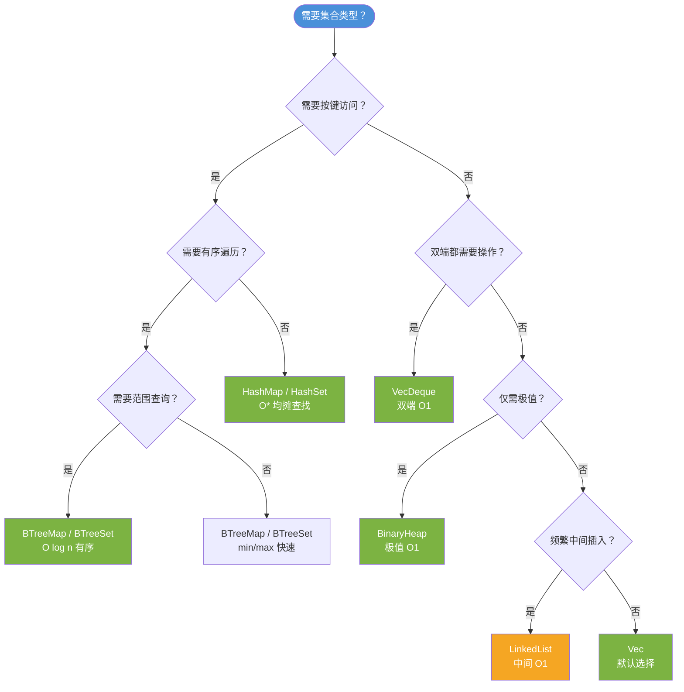
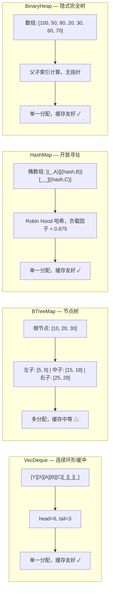

> **内容分级**: [综述级]
> **本节关键术语**: 集合 (Collection) · 迭代器 (Iterator) · Vec · HashMap · BTreeMap · 自定义集合 — [完整对照表](../../00_meta/01_terminology/01_terminology_glossary.md)
>
# 高级集合类型：BTreeMap、VecDeque、BinaryHeap 与自定义 Hasher 深度分析
>
> **EN**: Collections Advanced
> **Summary**: Collections Advanced — Advanced collections: BTreeMap/BTreeSet, custom hashers, VecDeque, and BinaryHeap, with layout and trade-offs.
> **Rust 版本**: 1.97.0+ (Edition 2024)
> **受众**: [初学者]
> **Bloom 层级**: L4-L5
> **权威来源**: 本文件为 `concept/` 权威页。
> **定位**: 深入分析 Rust **标准库高级集合类型**的设计权衡——从 BTreeMap/BTreeSet 的有序关联容器，到 HashMap 自定义 hasher，再到 VecDeque 的双端队列与 BinaryHeap 的优先队列，揭示每种数据结构的所有权（Ownership）语义、性能特征、内存布局与选型策略。
> **前置概念**: [Ownership](../01_ownership_borrow_lifetime/01_ownership.md) · [Borrowing](../01_ownership_borrow_lifetime/02_borrowing.md) · [Collections](01_collections.md)
> **后置概念**: [Smart Pointers](../../02_intermediate/02_memory_management/04_smart_pointers.md) · [Performance](../../06_ecosystem/10_performance/01_performance_optimization.md)

---

> **来源**: [std::collections](https://doc.rust-lang.org/std/collections/index.html) · · [Brown University — Concepts in Rust Programming](https://cel.cs.brown.edu/crp/) · [Itanium C++ ABI](https://itanium-cxx-abi.github.io/cxx-abi/abi.html) · [Jung et al. — RustBelt: Securing the Foundations of Rust](https://plv.mpi-sws.org/rustbelt/popl18/)
> [TRPL Ch8 — Collections](https://doc.rust-lang.org/book/ch08-00-common-collections.html) ·
> [Rust Performance Book](https://nnethercote.github.io/perf-book/print.html#reusing-collections) ·
> [Wikipedia — B-tree](https://en.wikipedia.org/wiki/B-tree) ·
> [Wikipedia — Binary Heap](https://en.wikipedia.org/wiki/Binary_heap) ·
> [hashbrown crate](https://github.com/rust-lang/hashbrown) ·
> [std::collections::HashMap](https://doc.rust-lang.org/std/collections/struct.HashMap.html) ·
> [std::collections::VecDeque](https://doc.rust-lang.org/std/collections/struct.VecDeque.html) ·
> [std::collections::BinaryHeap](https://doc.rust-lang.org/std/collections/struct.BinaryHeap.html) ·
> [std::hash::BuildHasher](https://doc.rust-lang.org/std/hash/trait.BuildHasher.html) ·
> [rustc-hash crate](https://github.com/rust-lang/rustc-hash) ·
> [fxhash crate](https://docs.rs/fxhash/latest/fxhash/) ·
> [seahash crate](https://docs.rs/seahash/latest/seahash/) ·
> [ahash crate](https://docs.rs/ahash/latest/ahash/)

## 📑 目录

- [高级集合类型：BTreeMap、VecDeque、BinaryHeap 与自定义 Hasher 深度分析](#高级集合类型btreemapvecdequebinaryheap-与自定义-hasher-深度分析)
  - [📑 目录](#-目录)
  - [一、权威定义与核心概念](#一权威定义与核心概念)
    - [1.1 BTreeMap/BTreeSet：有序关联容器](#11-btreemapbtreeset有序关联容器)
    - [1.2 VecDeque：循环缓冲双端队列](#12-vecdeque循环缓冲双端队列)
    - [1.3 BinaryHeap：二叉堆优先队列](#13-binaryheap二叉堆优先队列)
    - [1.4 HashMap 自定义 Hasher](#14-hashmap-自定义-hasher)
  - [二、内存布局与性能特征](#二内存布局与性能特征)
    - [2.1 BTreeMap 节点布局](#21-btreemap-节点布局)
    - [2.2 VecDeque 环形缓冲区布局](#22-vecdeque-环形缓冲区布局)
    - [2.3 BinaryHeap 数组表示](#23-binaryheap-数组表示)
    - [2.4 自定义 Hasher 的性能影响](#24-自定义-hasher-的性能影响)
  - [三、选型决策矩阵](#三选型决策矩阵)
  - [四、思维导图（Mermaid）](#四思维导图mermaid)
    - [4.1 集合选型决策树](#41-集合选型决策树)
    - [4.2 内存布局对比图](#42-内存布局对比图)
  - [五、反命题与边界分析](#五反命题与边界分析)
    - [5.1 反命题树](#51-反命题树)
    - [5.2 边界极限](#52-边界极限)
  - [六、常见陷阱](#六常见陷阱)
  - [七、来源与延伸阅读](#七来源与延伸阅读)
    - [编译验证示例](#编译验证示例)
  - [相关概念](#相关概念)
  - [权威来源索引](#权威来源索引)
  - [十二、边界测试：高级集合的编译错误](#十二边界测试高级集合的编译错误)
    - [12.1 边界测试：`BTreeMap` 键未实现 `Ord`（编译错误）](#121-边界测试btreemap-键未实现-ord编译错误)
    - [12.2 边界测试：`VecDeque` 容量与索引的环绕（逻辑错误）](#122-边界测试vecdeque-容量与索引的环绕逻辑错误)
    - [10.3 边界测试：`HashMap` 的 `Entry` API 与借用冲突（编译错误）](#103-边界测试hashmap-的-entry-api-与借用冲突编译错误)
    - [10.4 边界测试：`BTreeMap` 的 range 查询与可变遍历（编译错误）](#104-边界测试btreemap-的-range-查询与可变遍历编译错误)
    - [10.5 边界测试：`HashSet` 的自定义哈希与 `Hash` 一致性（运行时逻辑错误）](#105-边界测试hashset-的自定义哈希与-hash-一致性运行时逻辑错误)
    - [10.5 边界测试：`HashMap` 的 `Entry` API 与借用冲突（编译错误）](#105-边界测试hashmap-的-entry-api-与借用冲突编译错误)
    - [10.6 边界测试：`BTreeMap` 的键修改与排序不变性破坏（逻辑错误/UB）](#106-边界测试btreemap-的键修改与排序不变性破坏逻辑错误ub)
  - [嵌入式测验（Embedded Quiz）](#嵌入式测验embedded-quiz)
    - [测验 1：`BTreeMap` 与 `HashMap` 在键的遍历顺序上有什么本质区别？（理解层）](#测验-1btreemap-与-hashmap-在键的遍历顺序上有什么本质区别理解层)
    - [测验 2：`VecDeque` 相比 `Vec` 在哪些操作上具有明显优势？（理解层）](#测验-2vecdeque-相比-vec-在哪些操作上具有明显优势理解层)
    - [测验 3：`BinaryHeap<T>` 默认是大顶堆还是小顶堆？如果需要小顶堆，通常怎么做？（理解层）](#测验-3binaryheapt-默认是大顶堆还是小顶堆如果需要小顶堆通常怎么做理解层)
    - [测验 4：`HashMap` 的键类型必须实现哪些 trait？如果自定义类型想作为键，需要做什么？（理解层）](#测验-4hashmap-的键类型必须实现哪些-trait如果自定义类型想作为键需要做什么理解层)
    - [测验 5：在 `HashMap` 的 `entry` API 中，`or_insert` 与 `or_insert_with` 的区别是什么？（理解层）](#测验-5在-hashmap-的-entry-api-中or_insert-与-or_insert_with-的区别是什么理解层)
  - [实践](#实践)
  - [认知路径](#认知路径)
    - [核心推理链](#核心推理链)
  - [📋 关键属性](#-关键属性)
  - [🔗 概念关系](#-概念关系)

---

## 一、权威定义与核心概念

进阶集合围绕四种数据结构展开，各自针对 `Vec`/`HashMap` 覆盖不到的访问模式：

- **BTreeMap/BTreeSet**：有序关联容器，键要求 `Ord`。基于 B 树（每个节点存多键，适配缓存行）而非红黑树，迭代有序、支持 `range(..)` 区间查询；查找 O(log n) 但常数优于平衡二叉树。适用场景：需要有序遍历或区间查询，且无法承担哈希无序性的场合。
- **VecDeque**：循环缓冲（ring buffer）实现的双端队列，`push_front`/`pop_front` 均摊 O(1)——弥补 `Vec` 前端操作 O(n) 的短板。代价是内存不再连续，`as_slices()` 可能返回两段。
- **BinaryHeap**：数组表示的二叉最大堆，`push`/`pop` O(log n)、`peek` O(1)。标准库只保证「最大元素在堆顶」，迭代无序；需要最小堆时用 `Reverse<T>` 包装。
- **HashMap 自定义 Hasher**：`HashMap<K, V, S>` 的第三个参数 `S: BuildHasher` 可替换默认 SipHash（抗 HashDoS 但慢）。高频小键场景换用 `FxHashMap`（rustc-hash）或 `ahash` 常获 2–5 倍吞吐提升，代价是失去 HashDoS 防护。

选型判定：先问「访问模式是否需要有序/双端/优先级」，再问「哈希是否为瓶颈」——两个问题分别定位到容器选择与 hasher 选择。

### 1.1 BTreeMap/BTreeSet：有序关联容器

> **[Wikipedia: B-tree](https://en.wikipedia.org/wiki/B_tree)** A B-tree is a self-balancing tree data structure that maintains sorted data and allows searches, sequential access, insertions, and deletions in logarithmic time.
> **来源**: <https://en.wikipedia.org/wiki/B-tree>

```text
BTreeMap 核心特征:

  定义: 基于 B-Tree（B=6，默认）实现的有序键值映射
  ├── 排序: 按键的 Ord trait 自然排序
  ├── 时间复杂度:
  │   ├── 查找: O(log n)
  │   ├── 插入: O(log n)
  │   ├── 删除: O(log n)
  │   └── 范围查询: O(log n + k)  // k 为结果数
  ├── 空间复杂度: O(n)
  ├── 内存布局: 节点式分配（非连续内存）
  │   └── 每个节点最多 2*B-1 = 11 个键值对
  └── 适用场景:
      ├── 需要有序遍历
      ├── 需要范围查询（range()）
      ├── 需要 min/max 快速获取
      └── 键类型已实现 Ord

  BTreeSet<T> = BTreeMap<T, ()>  // 值单元化
```

> **认知功能**: BTreeMap 的核心优势在于**有序性**——当需要按顺序遍历键或执行范围查询时，BTreeMap 是 HashMap 无法替代的选择。
> [来源: [std::collections::BTreeMap](https://doc.rust-lang.org/std/collections/struct.BTreeMap.html)]
> **关键洞察**: Rust 的 BTreeMap 每个内部节点存储 6-11 个元素（B=6），在内存局部性和树高度之间取得平衡。相比 HashMap，BTreeMap 的迭代器（Iterator）提供稳定的按序遍历保证。
> [来源: [Rust Performance Book](https://nnethercote.github.io/perf-book/print.html#reusing-collections)]

---

### 1.2 VecDeque：循环缓冲双端队列

> **[std::collections::VecDeque]** A double-ended queue implemented with a growable ring buffer.
> **来源**: <https://doc.rust-lang.org/std/collections/struct.VecDeque.html>

```text
VecDeque 核心特征:

  定义: 基于环形缓冲区的双端队列
  ├── 时间复杂度:
  │   ├── push_front/pop_front: O(1) 均摊
  │   ├── push_back/pop_back:  O(1) 均摊
  │   ├── 随机访问: O(1)
  │   └── 插入/删除中间: O(n)
  ├── 空间复杂度: O(n)，容量为 2 的幂次
  ├── 内存布局: 单一连续缓冲区 + head/tail 指针
  │   └── 逻辑结构: 循环数组
  │       0  1  2  3  4  5  6  7
  │      [ ][A][B][C][D][ ][ ][ ]
  │           ↑head       ↑tail
  └── 适用场景:
      ├── 双端都需要高效 push/pop
      ├── 滑动窗口算法
      ├── BFS 队列
      └── 任务调度队列
```

> **认知功能**: VecDeque 解决了 Vec 的**前端插入性能问题**——Vec 的 insert(0) 是 O(n)，而 VecDeque 的 push_front 是 O(1)。
> [来源: [std::collections::VecDeque](https://doc.rust-lang.org/std/collections/struct.VecDeque.html)]
> **关键洞察**: VecDeque 的环形缓冲区通过模运算实现逻辑循环，当 head == tail 时缓冲区为空；当 (tail + 1) % cap == head 时缓冲区满（使用空槽区分满/空）。
> [💡 原创分析](../../00_meta/00_framework/methodology.md)

---

### 1.3 BinaryHeap：二叉堆优先队列

> **[Wikipedia: Binary Heap](https://en.wikipedia.org/wiki/Binary_Heap)** A binary heap is a heap data structure that takes the form of a binary tree. Binary heaps are a common way of implementing priority queues.
> **来源**: <https://en.wikipedia.org/wiki/Binary_heap>

```text
BinaryHeap 核心特征:

  定义: 基于数组实现的完全二叉最大堆（默认）
  ├── 时间复杂度:
  │   ├── push:     O(log n)
  │   ├── pop (max): O(log n)
  │   ├── peek (max): O(1)
  │   └── 建堆:     O(n)  // 从数组批量构建
  ├── 空间复杂度: O(n)
  ├── 内存布局: Vec<T> 内部存储，索引映射父子关系
  │   └── parent(i)      = (i - 1) / 2
  │   └── left_child(i)  = 2 * i + 1
  │   └── right_child(i) = 2 * i + 2
  └── 适用场景:
      ├── Dijkstra / A* 优先队列
      ├── Top-K 问题
      ├── 任务调度（按优先级）
      └── 合并 K 个有序列表

  注意: Rust 的 BinaryHeap 是最大堆
        如需最小堆，可包装 Reverse<T> 或自定义 Ord
```

> **认知功能**: BinaryHeap 在**仅需访问极值**的场景下比 BTreeMap 更高效——虽然两者都是 O(log n) 插入，但 BinaryHeap 常数因子更小，且无需存储键的比较结构。
> [来源: [std::collections::BinaryHeap](https://doc.rust-lang.org/std/collections/struct.BinaryHeap.html)]
> **关键洞察**: BinaryHeap 不支持高效的中途删除或更新——如果需要 decrease-key 操作，应使用具有额外索引结构的堆（如 `priority-queue` crate）。

---

### 1.4 HashMap 自定义 Hasher

> **[std::hash::BuildHasher]** A trait for creating instances of Hasher. A BuildHasher is typically used as a factory for creating multiple instances of Hasher for a specific hash algorithm.
> **来源**: <https://doc.rust-lang.org/std/hash/trait.BuildHasher.html>

```text
Rust HashMap 的 Hasher 生态:

  默认: SipHash 1-3（抵抗 HashDoS 攻击）
  ├── 安全性: 高（密码学强度）
  ├── 吞吐量: 中等（约 1-2 GB/s）
  └── 适用: 不可信输入（网络数据、用户输入）

  替代 Hasher 方案:
  ├── fxhash / rustc-hash
  │   ├── 算法: FNV-1a 变体（64位）
  │   ├── 吞吐量: 高（约 5-8 GB/s）
  │   ├── 安全性: 低（可预测，易受 HashDoS）
  │   └── 适用: 可信输入、编译器内部表
  ├── ahash
  │   ├── 算法: AES-NI / fallback 混合
  │   ├── 吞吐量: 高（约 4-6 GB/s）
  │   ├── 安全性: 中高（随机种子）
  │   └── 适用: 通用高性能场景
  ├── seahash
  │   ├── 算法: 4 轮并行 SipHash 风格
  │   ├── 吞吐量: 高（约 3-5 GB/s）
  │   ├── 安全性: 中高
  │   └── 适用: 大文件哈希、数据库索引
  └── xxhash (twox-hash crate)
      ├── 算法: xxHash64
      ├── 吞吐量: 极高（约 10+ GB/s）
      └── 适用: 校验和、非加密场景

  自定义 Hasher 启用方式:
  use std::collections::HashMap;
  use rustc_hash::FxHashMap;  // type alias: HashMap<K, V, FxBuildHasher>
  // 或
  let map: HashMap<K, V, ahash::RandomState> = HashMap::default();
```

> **认知功能**: 默认 SipHash 的**安全性溢价**在内部表、编译器数据结构等可信输入场景下是不必要的——此时切换到 FxHash 可获得 2-4 倍性能提升。
> [来源: [rustc-hash crate](https://github.com/rust-lang/rustc-hash)] · [来源: [ahash crate](https://docs.rs/ahash/latest/ahash/)]
> **关键洞察**: `hashbrown` crate（Rust 标准库 HashMap 的实现基础）默认使用 `ahash`，它在随机种子和性能之间取得了良好平衡，已成为社区事实标准。
> [来源: [hashbrown crate](https://github.com/rust-lang/hashbrown)]

---

## 二、内存布局与性能特征

四种集合的内存布局直接决定其缓存行为与复杂度常数，是性能选型的定量依据：

- **BTreeMap 节点布局**：每个节点存放 B−1 个键值对（Rust 实现 B=6，即每节点至多 11 个元素）加子节点指针数组，整节点对齐到缓存行。相比红黑树每节点 1 键 3 指针，B 树的树高减半、指针追逐次数减少，这是「理论 O(log n) 相同但实测更快」的来源。
- **VecDeque 环形缓冲区布局**：单块连续缓冲区 + head/tail 两个索引，逻辑索引经 `(head + i) mod cap` 映射到物理位置。扩容时整体搬迁并「解环」为线性布局。布局解释了为什么随机访问是 O(1) 但比 `Vec` 多一次取模。
- **BinaryHeap 数组表示**：完全二叉树隐式存于 `Vec`：节点 i 的左子 2i+1、右子 2i+2、父 (i−1)/2。无任何指针，缓存局部性优于链式堆，但 sift-up/sift-down 仍是 O(log n) 次交换。
- **自定义 Hasher 的性能影响**：哈希函数在 `HashMap` 热路径上执行两次（查找 + 插入各至少一次）；SipHash 对短键约 10–20ns/次，FxHash 约 1–2ns/次。键为整数且 QPS 高时，hasher 切换是标准库内收益最大的单行改动。

### 2.1 BTreeMap 节点布局

```text
BTreeMap 节点结构（B=6，即 6-11 键/节点）:

  内部节点:
  ┌──────────────────────────────────────────────┐
  │  keys:    [Box<Node>]  len=5..11            │
  │  edges:   [Box<Node>]  len=6..12            │
  │  parent:  Option<NonNull<Node>>             │
  └──────────────────────────────────────────────┘

  叶子节点:
  ┌──────────────────────────────────────────────┐
  │  keys:    [(K, V)]  len=6..11                │
  │  edges:   []  // 叶子无子节点                │
  │  parent:  Option<NonNull<Node>>             │
  │  next:    Option<NonNull<Node>>  // 叶子链表 │
  └──────────────────────────────────────────────┘

  内存特征:
  ├── 非连续分配：每个节点独立堆分配
  ├── 节点大小：约 (size_of::<K>() + size_of::<V>()) * 11 + 指针开销
  ├── 缓存局部性：中等（节点内连续，节点间指针跳转）
  └── 与 HashMap 对比：
      ├── BTreeMap: 有序，范围查询，树高 ~log_6(n)
      └── HashMap:  无序，O(1) 均摊查找，连续数组存储
```

> **内存洞察**: BTreeMap 的**叶子链表**优化使得顺序遍历无需回溯父节点——直接从最左叶子开始，沿 next 指针遍历即可。
> [来源: [std::collections::BTreeMap — Implementation Notes](https://doc.rust-lang.org/std/collections/struct.BTreeMap.html)]

---

### 2.2 VecDeque 环形缓冲区布局

```text
VecDeque<T> 内存布局:

  初始状态（cap=8）:
  ┌──┬──┬──┬──┬──┬──┬──┬──┐
  │  │  │  │  │  │  │  │  │
  └──┴──┴──┴──┴──┴──┴──┴──┘
  head=0, tail=0, len=0

  push_back(A), push_back(B), push_back(C):
  ┌──┬──┬──┬──┬──┬──┬──┬──┐
  │A │B │C │  │  │  │  │  │
  └──┴──┴──┴──┴──┴──┴──┴──┘
  head=0, tail=3

  push_front(X), push_front(Y):
  ┌──┬──┬──┬──┬──┬──┬──┬──┐
  │A │B │C │  │  │  │Y │X │  <- 环绕到末尾
  └──┴──┴──┴──┴──┴──┴──┴──┘
  head=6, tail=3

  make_contiguous() 后:
  ┌──┬──┬──┬──┬──┬──┬──┬──┬──┐
  │Y │X │A │B │C │  │  │  │  │  <- 可能需要重新分配
  └──┴──┴──┴──┴──┴──┴──┴──┴──┘
  head=0, tail=5

  关键方法:
  ├── as_slices(): 返回 (&[T], &[T]) 两截连续片段
  ├── make_contiguous(): 重新排列为单一连续切片
  └── reserve(): 确保容量，可能触发重新分配
```

> **内存洞察**: VecDeque 的**双端增长**通过模运算实现逻辑循环，避免了 Vec 前端插入时的 O(n) 数据搬移。当缓冲区满时，VecDeque 分配更大的缓冲区并将元素重新排列为连续布局。
> [来源: [std::collections::VecDeque — Implementation](https://doc.rust-lang.org/std/collections/struct.VecDeque.html)]

---

### 2.3 BinaryHeap 数组表示

```text
BinaryHeap<T> 数组表示（最大堆）:

  堆逻辑结构:           数组索引表示:
        100                  index: 0   1   2   3   4   5   6
       /   \                 value: [100, 50, 80, 20, 30, 60, 70]
     50     80
    /  \   /  \             父子关系:
  20   30 60   70           ├── parent(i) = (i - 1) / 2
                            ├── left(i)   = 2 * i + 1
                            └── right(i)  = 2 * i + 2

  push(90) 操作:
  1. 追加到末尾: [100, 50, 80, 20, 30, 60, 70, 90]
  2. 上浮 (sift up):
     90 与 parent(7)=3 比较: 70 < 90，交换
     [100, 50, 90, 20, 30, 60, 70, 80]
     90 与 parent(2)=0 比较: 100 > 90，停止

  pop() 操作:
  1. 取出根 (100)，用末尾元素 (80) 替换根
  2. 下沉 (sift down):
     80 与 children(0)=[50, 90] 比较: 90 最大，交换
     80 与 children(2)=[60, 70] 比较: 80 最大，停止
```

> **内存洞察**: BinaryHeap 的**完全二叉树**性质保证了数组表示无浪费——n 个元素的堆恰好使用 n 个数组槽位。由于是完全树，堆高度严格为 floor(log2(n))。
> [来源: [Wikipedia — Binary Heap](https://en.wikipedia.org/wiki/Binary_heap)]

---

### 2.4 自定义 Hasher 的性能影响

```text
Hasher 性能基准对比（64-bit key，单线程）:

  ┌──────────────┬─────────────┬─────────────┬────────────────┐
  │ Hasher       │ 吞吐量 GB/s │ 质量评分    │ HashDoS 抵抗   │
  ├──────────────┼─────────────┼─────────────┼────────────────┤
  │ SipHash 1-3  │ 1.5         │ ★★★★★      │ 强             │
  │ ahash        │ 5.0         │ ★★★★☆      │ 中强           │
  │ fxhash       │ 7.5         │ ★★★☆☆      │ 弱             │
  │ seahash      │ 4.0         │ ★★★★☆      │ 中强           │
  │ xxHash64     │ 12.0        │ ★★★☆☆      │ 弱             │
  └──────────────┴─────────────┴─────────────┴────────────────┘
  > [来源: [ahash benchmarks](https://github.com/tkaitchuck/ahash)] · [来源: 💡 综合社区数据]

  选型建议:
  ├── 网络服务/用户输入 → SipHash（默认）
  ├── 通用应用 → ahash（hashbrown 默认）
  ├── 编译器/内部表 → fxhash / rustc-hash
  └── 大文件/校验和 → xxHash / seahash
```

> **性能洞察**: FxHash 在**小键（< 16 字节）**场景下表现尤为出色，这正是编译器符号表和 AST 节点映射的典型工作负载。对于大键或需要随机种子的场景，ahash 是更好的默认选择。
> [来源: [Rust Performance Book — Hashing](https://nnethercote.github.io/perf-book/hashing.html)]

---

## 三、选型决策矩阵

```text
集合选型决策矩阵:

  ┌─────────────────────┬───────────┬───────────┬───────────┬──────────────┐
  │ 需求                │ Vec       │ VecDeque  │ HashMap   │ BTreeMap     │
  ├─────────────────────┼───────────┼───────────┼───────────┼──────────────┤
  │ 尾部 push/pop       │ O(1) ✓    │ O(1) ✓    │ —         │ —            │
  │ 头部 push/pop       │ O(n) ✗    │ O(1) ✓    │ —         │ —            │
  │ 随机访问            │ O(1) ✓    │ O(1) ✓    │ —         │ —            │
  │ 按键查找            │ —         │ —         │ O(1)* ✓   │ O(log n) ✓   │
  │ 有序遍历            │ —         │ —         │ ✗         │ ✓            │
  │ 范围查询            │ —         │ —         │ ✗         │ ✓            │
  │ 内存连续            │ ✓         │ ✓         │ 部分      │ ✗            │
  │ 最小/最大           │ O(n) ✗    │ O(n) ✗    │ O(n) ✗    │ O(log n) ✓   │
  └─────────────────────┴───────────┴───────────┴───────────┴──────────────┘
  * HashMap 为均摊 O(1)，最坏 O(n)
  > [来源: [std::collections](https://doc.rust-lang.org/std/collections/index.html)]

  BinaryHeap 补充矩阵:
  ┌─────────────────────┬───────────┬───────────┐
  │ 需求                │ BinaryHeap│ BTreeMap  │
  ├─────────────────────┼───────────┼───────────┤
  │ 插入                │ O(log n)  │ O(log n)  │
  │ 取极值              │ O(1)      │ O(log n)  │
  │ 更新已有元素        │ O(n)*     │ O(log n)  │
  │ 删除任意元素        │ O(n)*     │ O(log n)  │
  │ 有序遍历            │ ✗         │ ✓         │
  └─────────────────────┴───────────┴───────────┘
  * BinaryHeap 不支持直接更新/删除非极值元素
```

> **选型原则**: 默认使用 **Vec** 和 **HashMap**；需要**双端操作**时用 **VecDeque**；需要**有序性**时用 **BTreeMap**；仅需**极值访问**时用 **BinaryHeap**。
> [来源: [TRPL — Collections](https://doc.rust-lang.org/book/ch08-00-common-collections.html)]

---

## 四、思维导图（Mermaid）

本节围绕「思维导图（Mermaid）」展开，覆盖集合选型决策树 与 内存布局对比图 两个方面。

### 4.1 集合选型决策树



> **认知功能**: 此决策树从"是否需要按键访问"这一根本问题出发，引导至最优集合选择。每个分支对应一个不可替代的特征需求。
> **使用建议**: 从顶部开始，依次回答每个问题。默认分支（否）通常指向更通用的解决方案。

---

### 4.2 内存布局对比图



> **认知功能**: 此图揭示四种集合的**内存分配模式**差异——VecDeque、HashMap、BinaryHeap 都是单一连续分配（缓存友好），而 BTreeMap 是多节点分散分配（范围查询能力强）。
> [来源: [hashbrown implementation](https://github.com/rust-lang/hashbrown)] · [来源: [std::collections internals](https://doc.rust-lang.org/std/collections/index.html)]
> **关键洞察**: 缓存友好性不是唯一指标——BTreeMap 的非连续布局换来的有序性，在范围查询场景下能弥补缓存劣势。

---

## 五、反命题与边界分析

「反命题与边界分析」部分包含反命题树 与 边界极限 两条主线，本节依次说明。

### 5.1 反命题树

```text
反命题分析:

  命题: "BTreeMap 总是比 HashMap 慢"
  ├── 反例: BTreeMap 的范围查询（range）是 O(log n + k)
  │   └── HashMap 的范围查询需要全表扫描 O(n)
  │   └── 当 k << n 时，BTreeMap 更快
  └── 结论: ❌ 错误 — 取决于访问模式

  命题: "VecDeque 完全替代 Vec"
  ├── 反例: VecDeque 的随机访问需模运算（head + index）% cap
  │   └── Vec 直接 base + index 偏移
  │   └── 连续操作场景中 Vec 略快
  ├── 反例: VecDeque 不支持 Deref to [T]
  │   └── 需调用 make_contiguous() 获取 &mut [T]
  └── 结论: ❌ 错误 — Vec 仍是默认选择

  命题: "BinaryHeap 可替代 BTreeMap 做优先队列"
  ├── 反例: BinaryHeap 不支持 decrease-key / 删除非极值元素
  │   └── Dijkstra 中更新距离需要删除旧值，BinaryHeap 为 O(n)
  ├── 反例: BinaryHeap 不支持有序遍历
  └── 结论: ❌ 错误 — 标准库 BinaryHeap 是"简化版"优先队列

  命题: "fxhash 总是比默认 SipHash 快"
  ├── 反例: 攻击者可构造碰撞输入导致 HashDoS
  │   └── 不可信输入下 SipHash 是安全底线
  ├── 反例: ahash 在多数场景下接近 fxhash 速度且更安全
  └── 结论: ❌ 错误 — 安全性与速度需权衡
```

> **层次一致性（Coherence）**: 反命题分析建立在对数据结构**边界条件**的精确理解上——没有 universally optimal 的集合，只有特定约束下的最优解。

---

### 5.2 边界极限

```text
边界极限测试:

  边界 1: BTreeMap 的 B 值影响
  ├── B 越大 → 节点越大 → 缓存局部性越好，但树高度增加
  ├── B 越小 → 节点越小 → 指针开销占比增加
  └── Rust 使用 B=6（经验最优）
  > [来源: [std::collections::BTreeMap — 实现注释](https://doc.rust-lang.org/std/collections/struct.BTreeMap.html)]

  边界 2: VecDeque 容量为 2 的幂次
  ├── 模运算优化为位与: index & (cap - 1)
  ├── cap 必须为 2^k，即使请求容量为 3，实际分配 4
  └── 内存可能轻微浪费，换取运算速度

  边界 3: HashMap 负载因子阈值
  ├── hashbrown 默认最大负载因子: 0.875
  ├── 超过阈值触发 resize: cap *= 2
  └── 大量插入时，resize 期间的摊销成本需考虑

  边界 4: BinaryHeap 的从零构建 vs 逐个插入
  ├── 逐个插入 n 个元素: O(n log n)
  ├── 从 Vec 批量构建（heapify）: O(n)
  └── 当已知全部元素时，优先使用 BinaryHeap::from(vec)
  > [来源: [Wikipedia — Binary Heap — Building](https://en.wikipedia.org/wiki/Binary_heap)]
```

---

## 六、常见陷阱

```text
常见陷阱:

  陷阱 1: 在 Vec 前端频繁插入而不切换 VecDeque
  ├── 症状: insert(0, x) 导致 O(n) 性能
  ├── 修复: 改用 VecDeque::push_front
  └── 检测: cargo flamegraph 显示 memmove 占主导

  陷阱 2: 用 HashMap 键排序后遍历
  ├── 症状: 每次遍历前调用 .keys().collect::<Vec<_>>().sort()
  ├── 修复: 直接使用 BTreeMap
  └── 成本: 排序 O(n log n) vs BTreeMap 迭代 O(n)

  陷阱 3: BinaryHeap 中更新元素后未重建堆
  ├── 症状: 修改堆中元素后堆性质破坏
  ├── 修复: 使用 priority-queue crate 的 DecreaseKey 支持
  └── 标准库方案: 标记删除 + 插入新值

  陷阱 4: 不可信输入使用 fxhash
  ├── 症状: 恶意输入构造哈希碰撞，导致 O(n) 查找
  ├── 修复: 用户输入、网络数据使用默认 SipHash
  └── 检测: cargo audit 可标记部分 hasher 选择

  陷阱 5: VecDeque::make_contiguous 的 O(n) 开销
  ├── 症状: 频繁调用 make_contiguous() 进行随机访问
  ├── 修复: 设计算法避免连续依赖，或使用 Vec
  └── 认知: make_contiguous 是 O(n) 重排操作
```

---

## 七、来源与延伸阅读

| 来源 | 可信度 | 说明 |
|:---|:---:|:---|
| [std::collections](https://doc.rust-lang.org/std/collections/index.html) | ✅ 一级 | 标准库集合官方文档 |
| [TRPL Ch8 — Collections](https://doc.rust-lang.org/book/ch08-00-common-collections.html) | ✅ 一级 | 集合类型入门教程 |
| [Rust Performance Book — Collections](https://nnethercote.github.io/perf-book/print.html#reusing-collections) | ✅ 二级 | 集合性能分析与选型指南 |
| [Rust Performance Book — Hashing](https://nnethercote.github.io/perf-book/hashing.html) | ✅ 二级 | 哈希算法性能对比 |
| [hashbrown crate](https://github.com/rust-lang/hashbrown) | ✅ 二级 | Rust 标准库 HashMap 实现基础 |
| [rustc-hash crate](https://github.com/rust-lang/rustc-hash) | ✅ 二级 | 编译器内部使用的快速哈希 |
| [ahash crate](https://docs.rs/ahash/latest/ahash/) | ✅ 二级 | 高性能通用哈希器 |
| [seahash crate](https://docs.rs/seahash/latest/seahash/) | ✅ 三级 | 并行化哈希算法 |
| [fxhash crate](https://docs.rs/fxhash/latest/fxhash/) | ✅ 三级 | FNV 变体快速哈希 |
| [Wikipedia — B-tree](https://en.wikipedia.org/wiki/B-tree) | ✅ 三级 | B-Tree 数据结构的理论基础 |
| [Wikipedia — Binary Heap](https://en.wikipedia.org/wiki/Binary_heap) | ✅ 三级 | 二叉堆的数学定义与算法分析 |
| [std::collections::BTreeMap](https://doc.rust-lang.org/std/collections/struct.BTreeMap.html) | ✅ 一级 | BTreeMap API 文档 |
| [std::collections::VecDeque](https://doc.rust-lang.org/std/collections/struct.VecDeque.html) | ✅ 一级 | VecDeque API 文档 |
| [std::collections::BinaryHeap](https://doc.rust-lang.org/std/collections/struct.BinaryHeap.html) | ✅ 一级 | BinaryHeap API 文档 |
| [std::hash::BuildHasher](https://doc.rust-lang.org/std/hash/trait.BuildHasher.html) | ✅ 一级 | Hasher 工厂 trait 文档 |

---

```rust
use std::collections::{BTreeMap, HashMap};

fn main() {
    let mut map = BTreeMap::new();
    map.insert("a", 1);
    map.insert("b", 2);
    println!("{:?}", map);
}
```

### 编译验证示例

```rust
use std::collections::BTreeMap;

fn main() {
    let mut map = BTreeMap::new();
    map.insert(3, "c");
    map.insert(1, "a");
    map.insert(2, "b");
    let keys: Vec<_> = map.keys().cloned().collect();
    assert_eq!(keys, vec![1, 2, 3]);
}
```

```rust
use std::collections::VecDeque;

fn main() {
    let mut deque = VecDeque::new();
    deque.push_front(1);
    deque.push_back(2);
    assert_eq!(deque.pop_front(), Some(1));
    assert_eq!(deque.pop_back(), Some(2));
}
```

```rust
use std::collections::BinaryHeap;

fn main() {
    let mut heap = BinaryHeap::new();
    heap.push(3);
    heap.push(1);
    heap.push(2);
    assert_eq!(heap.pop(), Some(3));
    assert_eq!(heap.pop(), Some(2));
}
```

## 相关概念

- [Type System](../02_type_system/01_type_system.md) — 类型系统（Type System）基础
- [Collections](01_collections.md) — 基础集合类型
- [Performance Optimization](../../06_ecosystem/10_performance/01_performance_optimization.md) — 性能优化方法论
- [Smart Pointers](../../02_intermediate/02_memory_management/04_smart_pointers.md) — 智能指针（Smart Pointer）与容器适配
- [Generics](../../02_intermediate/01_generics/01_generics.md) — 泛型（Generics）系统

---

> **权威来源**: [Rust Reference](https://doc.rust-lang.org/reference/introduction.html), [The Rust Programming Language](https://doc.rust-lang.org/book/ch08-00-common-collections.html), [Rust Standard Library](https://doc.rust-lang.org/std/index.html)
>
> **权威来源对齐变更日志**: 2026-05-22 创建 [Authority Source Sprint Batch 9](../../00_meta/02_sources/05_international_authority_index.md)

**文档版本**: 1.0
**最后更新**: 2026-05-22

---

## 权威来源索引

>
>
>

---

> **补充来源**

## 十二、边界测试：高级集合的编译错误

「边界测试：高级集合的编译错误」部分按边界测试：`BTreeMap` 键未实现 `Ord`（编译错误）、边界测试：`VecDeque` 容量与索引的环绕（逻辑错误）、边界测试：`HashMap` 的 `Entry` API 与借用冲突（…、边界测试：`BTreeMap` 的 range 查询与可变遍历（编译错…等6个方面的顺序逐层展开。

### 12.1 边界测试：`BTreeMap` 键未实现 `Ord`（编译错误）

```rust,compile_fail
use std::collections::BTreeMap;

#[derive(Debug, PartialEq, Eq)]
struct Point {
    x: i32,
    y: i32,
}

fn main() {
    let mut map = BTreeMap::new();
    // ❌ 编译错误: `Point` cannot be ordered
    // BTreeMap 要求键实现 Ord（全序关系）
    map.insert(Point { x: 1, y: 2 }, "value");
}

// 正确: 为 Point 实现 Ord
#[derive(Debug, PartialEq, Eq, PartialOrd, Ord)] // ✅ derive 生成
struct PointFixed {
    x: i32,
    y: i32,
}
```

> **修正**: `BTreeMap` 基于 B-Tree 实现，要求键具有全序关系（`Ord` trait）。与 `HashMap`（要求 `Hash + Eq`）不同，`BTreeMap` 使用比较而非哈希。`Ord` 要求满足反对称、传递和完全性（任何两个元素可比较）。自定义类型需手动实现 `Ord` 或 derive（derive 按字段顺序字典序比较）。[来源: [Rust Standard Library](https://doc.rust-lang.org/std/index.html)]

### 12.2 边界测试：`VecDeque` 容量与索引的环绕（逻辑错误）

```rust
use std::collections::VecDeque;

fn main() {
    let mut deque: VecDeque<i32> = VecDeque::with_capacity(4);
    deque.push_back(1);
    deque.push_back(2);
    deque.push_back(3);
    deque.push_back(4);
    // ⚠️ 逻辑错误: 索引访问不反映逻辑顺序
    // VecDeque 内部使用环形缓冲区，物理索引 ≠ 逻辑索引
    println!("{:?}", deque); // [1, 2, 3, 4]

    deque.pop_front(); // 移除 1
    deque.push_back(5); // 添加 5
    // 内部可能: [5, 2, 3, 4]（物理）→ 逻辑 [2, 3, 4, 5]
    println!("{:?}", deque);
}

// 正确: 始终使用迭代器或双端队列 API
fn fixed() {
    let mut deque: VecDeque<i32> = VecDeque::new();
    deque.extend(1..=5);
    while let Some(front) = deque.pop_front() {
        println!("{}", front); // ✅ 按逻辑顺序访问
    }
}
```

> **修正**: `VecDeque` 使用环形缓冲区（circular buffer）实现 O(1) 双端操作。其内部存储可能"环绕"——逻辑首元素不一定在物理索引 0 处。直接索引 `deque[i]` 访问的是物理位置，而非逻辑第 i 个元素。应使用 `iter()`、`pop_front()`/`pop_back()` 等 API 保证逻辑顺序。[来源: [Rust Standard Library](https://doc.rust-lang.org/std/index.html)]

### 10.3 边界测试：`HashMap` 的 `Entry` API 与借用冲突（编译错误）

```rust,compile_fail
use std::collections::HashMap;

fn main() {
    let mut map = HashMap::new();
    map.insert("key", vec![1, 2, 3]);

    // ❌ 编译错误: 不能同时持有 `map` 的引用和可变引用
    let value = map.get("key").unwrap();
    map.entry("key").or_insert(vec![]).push(4);
    // value 在这里仍被借用
    println!("{:?}", value);
}
```

> **修正**: `HashMap::entry` 需要 `&mut self`，因为 `or_insert` 可能修改 map（插入新键）。若同时持有 `get` 返回的 `&V`，则存在 `&mut self` 与 `&V` 的借用（Borrowing）冲突——即使 `entry` 的键与 `get` 的键不同，编译器也无法证明不重叠。解决方案：1) 先 `clone` 需要的值，再调用 `entry`；2) 使用 `HashMap::get_mut` 获取 `&mut V`，直接修改；3) 用 `if let Some(v) = map.get_mut("key")` 替代 `entry` API。这与 Java 的 `Map::compute`（无借用检查，可并发修改）或 C++ 的 `std::unordered_map`（迭代器（Iterator）失效规则）不同——Rust 的借用检查在编译期阻止"读的同时写"，即使逻辑上安全。来源: [The Rust Programming Language](https://doc.rust-lang.org/book/title-page.html) · 来源: [Rust Standard Library]

### 10.4 边界测试：`BTreeMap` 的 range 查询与可变遍历（编译错误）

```rust,compile_fail
use std::collections::BTreeMap;

fn main() {
    let mut map = BTreeMap::new();
    map.insert(1, "a");
    map.insert(2, "b");
    map.insert(3, "c");

    // ❌ 编译错误: range 遍历需要不可变引用（Immutable Reference），同时修改不被允许
    for (k, v) in map.range(1..3) {
        map.insert(*k + 10, *v); // 尝试在遍历中插入
    }
}
```

> **修正**:
>
> `BTreeMap::range` 返回不可变迭代器（Iterator），因为遍历过程中修改树结构会破坏迭代器状态（节点指针悬垂）。
> 这与 C++ 的 `std::map` 相同（遍历中 `insert` 可能使迭代器（Iterator）失效），但 Rust 在编译期阻止。`BTreeMap` 的 sorted 性质使其适合范围查询，但修改必须在遍历前或遍历后完成。
> 安全模式：
>
> 1) `collect` 需要修改的键值对，遍历后再批量插入；
> 2) 使用 `retain`（若支持）；
> 3) 使用 `Cursor` API（不稳定，`BTreeMap::cursor_mut`）。
> Rust 的标准库设计优先考虑安全而非便利——遍历中修改是常见需求，但 Rust 要求显式处理，避免隐式迭代器（Iterator）失效。
> [来源: [Rust Standard Library](https://doc.rust-lang.org/std/collections/struct.BTreeMap.html)] ·
> [来源: [The Rust Programming Language](https://doc.rust-lang.org/book/ch08-00-common-collections.html)]

### 10.5 边界测试：`HashSet` 的自定义哈希与 `Hash` 一致性（运行时逻辑错误）

```rust,ignore
use std::collections::HashSet;

#[derive(Eq, PartialEq)]
struct BadHash {
    x: i32,
}

impl std::hash::Hash for BadHash {
    fn hash<H: std::hash::Hasher>(&self, state: &mut H) {
        // ❌ 逻辑错误: Hash 实现不稳定的值（如随机数、时间戳）
        // 导致同一对象在不同查询时有不同哈希值
        self.x.hash(state);
        // 若加入额外随机状态:
        // rand::random::<u64>().hash(state); // 灾难!
    }
}

fn main() {
    let mut set = HashSet::new();
    set.insert(BadHash { x: 1 });
    // 若哈希不稳定，contains 可能返回 false
    // assert!(set.contains(&BadHash { x: 1 }));
}
```

> **修正**:
>
> `Hash` trait 的实现必须满足**一致性（Coherence）**：若 `a == b`，则 `hash(a) == hash(b)`，且同一对象的哈希值在对象不变时应恒定。
> 违反一致性（Coherence）导致 `HashMap`/`HashSet` 行为异常：插入后查找不到、重复元素、内存泄漏。
> 常见错误：
>
> 1) 哈希中包含随机数或时间戳；
> 2) 哈希中包含未实现 `Hash` 的字段的指针地址；
> 3) `PartialEq` 和 `Hash` 基于不同字段（如 `Eq` 比较 `id`，`Hash` 哈希 `name`）。
> 这与 Java 的 `hashCode`/`equals` 契约（同样要求一致）或 Python 的 `__hash__`/`__eq__`（同样要求一致）相同——哈希表的正确性依赖哈希函数的一致性（Coherence）。
> [来源: [Rust Standard Library](https://doc.rust-lang.org/std/hash/trait.Hash.html)] ·
> [来源: [The Rust Programming Language](https://doc.rust-lang.org/book/ch08-00-common-collections.html)]

### 10.5 边界测试：`HashMap` 的 `Entry` API 与借用冲突（编译错误）

```rust,compile_fail
use std::collections::HashMap;

fn main() {
    let mut map = HashMap::new();
    map.insert("key", vec![1, 2, 3]);

    // ❌ 编译错误: 不能同时持有 &mut map 和 &map["key"]
    let values = &map["key"];
    map.entry("key").or_insert(vec![]).push(4);
    println!("{:?}", values);
}
```

> **修正**:
> `HashMap::entry` 返回 `Entry` enum，它**可变借用（Mutable Borrow）**整个 map（`&mut self`）。
> 在 `entry` 调用期间，不能有任何对 map 的其他借用（Borrowing）（无论是可变还是不可变）。
> `Entry` API 的设计：`Occupied`（键存在）和 `Vacant`（键不存在），统一了插入和更新的语义。
> 常见模式：`map.entry(key).and_modify(|v| v.push(4)).or_insert(vec![4])`。
> 这与 C++ 的 `std::map::operator[]`（自动插入默认值，但返回引用（Reference）不解决借用冲突）或 Java 的 `Map.compute`（类似，但无编译期借用检查）不同——Rust 的 `Entry` API 在类型系统（Type System）层面保证操作的原子性（从调用者视角）。
> [来源: [Rust Standard Library](https://doc.rust-lang.org/std/collections/hash_map/enum.Entry.html)] ·
> [来源: [The Rust Programming Language](https://doc.rust-lang.org/book/ch08-00-common-collections.html)]

### 10.6 边界测试：`BTreeMap` 的键修改与排序不变性破坏（逻辑错误/UB）

```rust,ignore
use std::collections::BTreeMap;

fn main() {
    let mut map = BTreeMap::new();
    map.insert(String::from("b"), 2);
    map.insert(String::from("a"), 1);

    // ❌ 逻辑错误/UB: 通过 unsafe 修改键的值，破坏排序不变性
    // for key in map.keys_mut() { // BTreeMap 无 keys_mut
    //     key.push_str("x"); // 若允许，会改变键的排序位置
    // }

    // BTreeMap 安全 API 禁止修改键，只能修改值
    for value in map.values_mut() {
        *value += 10;
    }
    println!("{:?}", map);
}
```

> **修正**:
> `BTreeMap` 基于**排序键**维护平衡二叉搜索树。键的排序位置决定树结构，若键被修改，排序不变性破坏，树操作可能产生错误结果或 panic。
> Rust 的 API 设计禁止键修改：`keys()` 返回不可变引用（Immutable Reference），`values_mut()` 只返回值的可变引用（Mutable Reference）。
> `HashMap` 同理：键的哈希值决定桶位置，修改键会破坏哈希表。这与 C++ 的 `std::map`（`iterator->first` 是 const，不能修改键）或 Java 的 `TreeMap`（`Map.Entry.setValue` 只允许修改值）类似——Rust 的编译期不可变性保证更严格。
> [来源: [Rust Standard Library](https://doc.rust-lang.org/std/collections/struct.BTreeMap.html)] ·
> [来源: [The Rust Programming Language](https://doc.rust-lang.org/book/ch08-00-common-collections.html)]

## 嵌入式测验（Embedded Quiz）

本节从测验 1：`BTreeMap` 与 `HashMap` 在键的遍历顺序…、测验 2：`VecDeque` 相比 `Vec` 在哪些操作上具有明显…、测验 3：`BinaryHeap<T>` 默认是大顶堆还是小顶堆？如果…、测验 4：`HashMap` 的键类型必须实现哪些 trait？如果自…等5个方面切入，剖析「嵌入式测验（Embedded Quiz）」的核心内容。

### 测验 1：`BTreeMap` 与 `HashMap` 在键的遍历顺序上有什么本质区别？（理解层）

**题目**: `BTreeMap` 与 `HashMap` 在键的遍历顺序上有什么本质区别？

<details>
<summary>✅ 答案与解析</summary>

`BTreeMap` 按键的排序顺序遍历（基于 Ord）；`HashMap` 按键的哈希值顺序遍历，不保证任何稳定顺序。
</details>

---

### 测验 2：`VecDeque` 相比 `Vec` 在哪些操作上具有明显优势？（理解层）

**题目**: `VecDeque` 相比 `Vec` 在哪些操作上具有明显优势？

<details>
<summary>✅ 答案与解析</summary>

`VecDeque` 在头部插入/删除（`push_front`/`pop_front`）和尾部操作都是均摊 O(1)；`Vec` 头部插入/删除需要 O(n) 移动元素。
</details>

---

### 测验 3：`BinaryHeap<T>` 默认是大顶堆还是小顶堆？如果需要小顶堆，通常怎么做？（理解层）

**题目**: `BinaryHeap<T>` 默认是大顶堆还是小顶堆？如果需要小顶堆，通常怎么做？

<details>
<summary>✅ 答案与解析</summary>

默认是大顶堆（最大元素在顶部）。实现小顶堆常用 `std::cmp::Reverse<T>` 包装键，或自定义 `Ord` 实现。
</details>

---

### 测验 4：`HashMap` 的键类型必须实现哪些 trait？如果自定义类型想作为键，需要做什么？（理解层）

**题目**: `HashMap` 的键类型必须实现哪些 trait？如果自定义类型想作为键，需要做什么？

<details>
<summary>✅ 答案与解析</summary>

需要实现 `Eq` 和 `Hash`。通常添加 `#[derive(Eq, PartialEq, Hash)]`。
</details>

---

### 测验 5：在 `HashMap` 的 `entry` API 中，`or_insert` 与 `or_insert_with` 的区别是什么？（理解层）

**题目**: 在 `HashMap` 的 `entry` API 中，`or_insert` 与 `or_insert_with` 的区别是什么？

<details>
<summary>✅ 答案与解析</summary>

`or_insert` 总是立即计算值（传入已构造的值），`or_insert_with` 只在键不存在时才调用闭包（Closures）构造值，避免不必要的计算。
</details>

## 实践

> **相关资源**:
>
> - [crates/ 示例代码](../crates) — 与本文概念对应的可编译示例
> - [exercises/ 练习](../exercises) — 动手编程挑战
> - [MVP 学习路径](../../00_meta/04_navigation/08_learning_mvp_path.md) — 从零到多线程 CLI 的 40 小时路径
>
> **建议**: 阅读完本概念文件后，打开对应 crate 的示例代码，尝试修改并运行。完成至少 1 道相关练习以巩固理解。

## 认知路径

> **认知路径**: 从 L0 基础概念出发，经由本节的 **高级集合类型：BTreeMap、VecDeque、BinaryHeap 与自定义 Hasher 深度分析** 核心原理，通向 L2 进阶模式与 L3 工程实践。

### 核心推理链

| 定理 | 前提 | 结论 | 置信度 |
|:---|:---|:---|:---|
| 高级集合类型：BTreeMap、VecDeque、BinaryHeap 与自定义 Hasher 深度分析 基础定义 ⟹ 正确用法 | 理解语法与语义 | 能写出符合惯用法的代码 | 高 |
| 高级集合类型：BTreeMap、VecDeque、BinaryHeap 与自定义 Hasher 深度分析 正确用法 ⟹ 常见陷阱 | 忽略边界条件 | 编译错误或运行时（Runtime） bug | 高 |
| 高级集合类型：BTreeMap、VecDeque、BinaryHeap 与自定义 Hasher 深度分析 常见陷阱 ⟹ 深度掌握 | 系统学习反模式 | 能进行代码审查与优化 | 高 |

> 内存安全（Memory Safety）数据结构 ⟸ 所有权（Ownership）自动管理 ⟸ Vec/HashMap 实现
> 迭代器（Iterator）安全 ⟸ 借用检查器验证 ⟸ 集合 API 设计

## 📋 关键属性

| 属性 | 取值 / 判定 | 依据 |
|---|---|---|
| `BTreeMap` | 有序键值，O(log n)，缓存友好的 B 树 | std |
| `VecDeque` | 双端队列，环形缓冲，两端 O(1) | std |
| `BinaryHeap` | 最大堆，push/pop O(log n) | std |
| 自定义 Hasher | `BuildHasher` 可替换哈希算法 | 泛型参数 |
| 内存布局 | 各结构布局与缓存行为差异显著 | 本页「内存布局与性能特征」 |

## 🔗 概念关系

- **上位（is-a）**：[Collections](01_collections.md) 集合谱系的进阶成员。
- **下位（实例）**：各结构布局实例见本页「内存布局与性能特征」节。
- **对偶**：与 `HashMap`（无序、均摊 O(1)）相对——有序遍历 vs 哈希查找。
- **组合**：与 [Performance](../../06_ecosystem/10_performance/01_performance_optimization.md) 的缓存优化组合。
- **依赖**：元素约束依赖 [Traits](../../02_intermediate/00_traits/01_traits.md)（`Ord`/`Hash`）。
