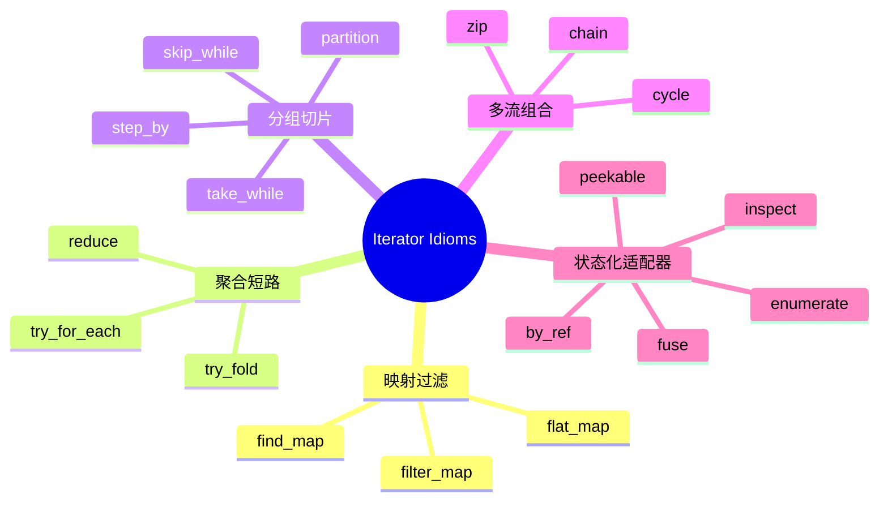

> **内容分级**: [进阶]
> **本节关键术语**: 迭代器 · Iterator 适配器 · 惰性求值 · 零成本抽象 — [完整对照表](../../00_meta/01_terminology/01_terminology_glossary.md)

# 迭代器惯用组合（Iterator Idioms）

> **EN**: Iterator Idioms in Rust
> **Summary**: A systematic guide to idiomatic Rust iterator combinators including `filter_map`, `flat_map`, `reduce`, `try_for_each`, `partition`, `find_map`, `try_fold`, `peekable`, `fuse`, `cycle`, `zip`, `enumerate`, `step_by`, `skip_while`, `take_while`, `inspect`, `by_ref`, and `chain`, with examples and counter-examples.
>
> **Rust 版本**: 1.97.0+ (Edition 2024)
> **受众**: [进阶]
> **Bloom 层级**: L2-L3
> **权威来源**: 本文件为 `concept/` 权威页。
> **定位**: 本页系统讲解 Rust 标准库 `Iterator` trait 的常用组合子，帮助读者用惰性求值链替代命令式循环，写出更短、更快、更安全的代码。
>
> **前置概念**: [Collections](01_collections.md) · [Ownership](../../01_foundation/01_ownership_borrow_lifetime/01_ownership.md) · [Error Handling](../../02_intermediate/03_error_handling/01_error_handling.md)
> **后置概念**: [Idioms Spectrum](../../06_ecosystem/03_design_patterns/02_idioms_spectrum.md) · [Type Conversions](../../02_intermediate/04_types_and_conversions/07_type_conversions.md)

---

> **来源**:
> [The Rust Programming Language — Iterators](https://doc.rust-lang.org/book/ch13-02-iterators.html) ·
> [std::iter::Iterator](https://doc.rust-lang.org/std/iter/trait.Iterator.html) ·
> [Rust API Guidelines](https://rust-lang.github.io/api-guidelines/) ·
> [Effective Rust](https://www.effective-rust.com/) ·
> [RustBelt: Securing the Foundations of the Rust Programming Language](https://plv.mpi-sws.org/rustbelt/popl18/)

---

## 📑 目录

- [迭代器惯用组合（Iterator Idioms）](#迭代器惯用组合iterator-idioms)
  - [📑 目录](#-目录)
  - [一、迭代器核心模型](#一迭代器核心模型)
  - [二、映射与过滤组合](#二映射与过滤组合)
    - [2.1 `filter_map`](#21-filter_map)
    - [2.2 `flat_map`](#22-flat_map)
    - [2.3 `find_map`](#23-find_map)
  - [三、聚合与短路组合](#三聚合与短路组合)
    - [3.1 `reduce`](#31-reduce)
    - [3.2 `try_fold`](#32-try_fold)
    - [3.3 `try_for_each`](#33-try_for_each)
  - [四、分组与切片组合](#四分组与切片组合)
    - [4.1 `partition`](#41-partition)
    - [4.2 `skip_while` / `take_while`](#42-skip_while--take_while)
    - [4.3 `step_by`](#43-step_by)
  - [五、多流组合](#五多流组合)
    - [5.1 `zip`](#51-zip)
    - [5.2 `chain`](#52-chain)
    - [5.3 `cycle`](#53-cycle)
  - [六、状态化适配器](#六状态化适配器)
    - [6.1 `enumerate`](#61-enumerate)
    - [6.2 `peekable`](#62-peekable)
    - [6.3 `fuse`](#63-fuse)
    - [6.4 `inspect`](#64-inspect)
    - [6.5 `by_ref`](#65-by_ref)
  - [七、反例与陷阱](#七反例与陷阱)
    - [反例 1：用 `filter_map` 时返回 `Some` 统一值](#反例-1用-filter_map-时返回-some-统一值)
    - [反例 2：`collect` 后再次迭代](#反例-2collect-后再次迭代)
    - [反例 3：`zip` 长度不匹配导致静默截断](#反例-3zip-长度不匹配导致静默截断)
  - [八、边界测试](#八边界测试)
    - [8.1 边界测试：`zip` 长度不匹配](#81-边界测试zip-长度不匹配)
    - [8.2 边界测试：`skip_while` 只跳过前缀](#82-边界测试skip_while-只跳过前缀)
    - [8.3 边界测试：`cycle` 无限迭代必须配合 `take`](#83-边界测试cycle-无限迭代必须配合-take)
  - [九、思维导图](#九思维导图)
  - [十、国际权威参考](#十国际权威参考)

---

## 一、迭代器核心模型

Rust 的迭代器是**惰性（lazy）**的：适配器链在调用终止器（如 `collect`、`sum`、`fold`）之前不会执行。编译器通常能把整个链优化成等效于手写循环的机器码——即"零成本抽象"。

```text
迭代器链 = 源（Source） + 一个或多个中间适配器（Adapter） + 一个终止器（Consumer）
```

终止器包括：`collect`、`sum`、`fold`、`for_each`、`try_for_each`、`reduce`、`any`、`all`、`find`、`position`、`count`、`last`、`nth`、`max`、`min` 等。

> **核心原则**：能用迭代器链表达的循环，优先用迭代器链；它通常更短、更易并行化（Rayon）、更少索引越界风险。来源: [TRPL §13](https://doc.rust-lang.org/book/ch13-02-iterators.html)

---

## 二、映射与过滤组合

### 2.1 `filter_map`

`filter_map` 把 `map` + `filter` 合并：闭包返回 `Option<B>`，`Some` 保留，`None` 丢弃。

```rust
fn parse_integers(lines: &[&str]) -> Vec<i32> {
    lines
        .iter()
        .filter_map(|s| s.parse::<i32>().ok())
        .collect()
}

fn main() {
    let lines = vec!["1", "two", "3", "4.5", "5"];
    let nums = parse_integers(&lines);
    assert_eq!(nums, vec![1, 3, 5]);
}
```

反例：先用 `map` 再用 `filter` 会更冗长：

```rust,ignore
// 非惯用
let nums: Vec<i32> = lines
    .iter()
    .map(|s| s.parse::<i32>())
    .filter(|r| r.is_ok())
    .map(|r| r.unwrap())
    .collect();
```

### 2.2 `flat_map`

`flat_map` 先映射，再把每个结果展平为单一迭代器。适合"每个元素产生多个元素"的场景。

```rust
fn words_in_lines<'a>(lines: &'a [&str]) -> Vec<&'a str> {
    lines.iter().flat_map(|line| line.split_whitespace()).collect()
}

fn main() {
    let lines = vec!["hello world", "rust iterator"];
    let words = words_in_lines(&lines);
    assert_eq!(words, vec!["hello", "world", "rust", "iterator"]);
}
```

### 2.3 `find_map`

`find_map` = `find` + `map`：找到第一个使闭包返回 `Some` 的元素，并返回其映射值。

```rust
fn first_even_square(numbers: &[i32]) -> Option<i32> {
    numbers.iter().find_map(|&n| {
        if n % 2 == 0 { Some(n * n) } else { None }
    })
}

fn main() {
    assert_eq!(first_even_square(&[1, 3, 4, 5]), Some(16));
    assert_eq!(first_even_square(&[1, 3, 5]), None);
}
```

---

## 三、聚合与短路组合

### 3.1 `reduce`

`reduce` 把迭代器两两合并为一个值。与 `fold` 不同，`reduce` 没有初始累加器，而是把第一个元素作为初始值。

```rust
fn product(numbers: &[i32]) -> i32 {
    numbers.iter().copied().reduce(|a, b| a * b).unwrap_or(1)
}

fn main() {
    assert_eq!(product(&[2, 3, 4]), 24);
    assert_eq!(product(&[]), 1);
}
```

### 3.2 `try_fold`

`try_fold` 在聚合过程中可以提前返回 `Err`，适合"累加但可能失败"的场景。

```rust
fn sum_parsed(lines: &[&str]) -> Result<i32, std::num::ParseIntError> {
    lines.iter().try_fold(0, |acc, s| {
        let n: i32 = s.parse()?;
        Ok(acc + n)
    })
}

fn main() {
    assert_eq!(sum_parsed(&["1", "2", "3"]).unwrap(), 6);
    assert!(sum_parsed(&["1", "x"]).is_err());
}
```

### 3.3 `try_for_each`

`try_for_each` 对每个元素执行副作用操作，遇到第一个 `Err` 立即返回。

```rust
use std::fs::File;
use std::io::{self, Write};

fn write_lines(lines: &[&str], path: &str) -> io::Result<()> {
    let mut file = File::create(path)?;
    lines.iter().try_for_each(|line| writeln!(file, "{}", line))
}
```

---

## 四、分组与切片组合

### 4.1 `partition`

`partition` 把迭代器拆分为两个集合，按闭包返回的 `bool` 分类。

```rust
fn split_even_odd(numbers: &[i32]) -> (Vec<i32>, Vec<i32>) {
    numbers.iter().copied().partition(|&n| n % 2 == 0)
}

fn main() {
    let (even, odd) = split_even_odd(&[1, 2, 3, 4, 5]);
    assert_eq!(even, vec![2, 4]);
    assert_eq!(odd, vec![1, 3, 5]);
}
```

### 4.2 `skip_while` / `take_while`

`skip_while` 跳过满足条件的元素（一旦不满足即停止跳过）；`take_while` 取满足条件的元素（一旦不满足即停止）。

```rust
fn drop_while_negative(numbers: &[i32]) -> Vec<i32> {
    numbers.iter().copied().skip_while(|&n| n < 0).collect()
}

fn take_while_ascending(numbers: &[i32]) -> Vec<i32> {
    let mut prev = i32::MIN;
    numbers
        .iter()
        .copied()
        .take_while(|&n| {
            let ok = n >= prev;
            prev = n;
            ok
        })
        .collect()
}

fn main() {
    assert_eq!(drop_while_negative(&[-1, -2, 3, -4, 5]), vec![3, -4, 5]);
    assert_eq!(take_while_ascending(&[1, 2, 3, 2, 5]), vec![1, 2, 3]);
}
```

### 4.3 `step_by`

`step_by(n)` 每隔 `n` 个元素取一个。

```rust
fn every_third(numbers: &[i32]) -> Vec<i32> {
    numbers.iter().copied().step_by(3).collect()
}

fn main() {
    assert_eq!(every_third(&[0, 1, 2, 3, 4, 5, 6]), vec![0, 3, 6]);
}
```

---

## 五、多流组合

### 5.1 `zip`

`zip` 把两个迭代器按位置配对，长度以较短者为准。

```rust
fn dot_product(a: &[i32], b: &[i32]) -> i32 {
    a.iter().zip(b).map(|(x, y)| x * y).sum()
}

fn main() {
    assert_eq!(dot_product(&[1, 2, 3], &[4, 5, 6]), 32);
}
```

### 5.2 `chain`

`chain` 把两个迭代器顺序连接。

```rust
fn concat_slices(a: &[i32], b: &[i32]) -> Vec<i32> {
    a.iter().chain(b).copied().collect()
}

fn main() {
    assert_eq!(concat_slices(&[1, 2], &[3, 4]), vec![1, 2, 3, 4]);
}
```

### 5.3 `cycle`

`cycle` 无限重复迭代器（要求迭代器可 Clone）。常与 `zip` 或 `take` 配合使用。

```rust
fn repeat_pattern(pattern: &[i32], n: usize) -> Vec<i32> {
    pattern.iter().cycle().take(n).copied().collect()
}

fn main() {
    assert_eq!(repeat_pattern(&[1, 2, 3], 7), vec![1, 2, 3, 1, 2, 3, 1]);
}
```

---

## 六、状态化适配器

### 6.1 `enumerate`

`enumerate` 为每个元素附上索引 `(idx, item)`。注意：索引是 `usize` 类型。

```rust
fn indexed_words(words: &[&str]) -> Vec<(usize, &str)> {
    words.iter().enumerate().map(|(i, w)| (i + 1, *w)).collect()
}

fn main() {
    let result = indexed_words(&["a", "b", "c"]);
    assert_eq!(result, vec![(1, "a"), (2, "b"), (3, "c")]);
}
```

### 6.2 `peekable`

`peekable` 允许查看下一个元素而不消费它，适合需要"向前看"的解析器。

```rust
fn has_consecutive_duplicates(numbers: &[i32]) -> bool {
    let mut iter = numbers.iter().peekable();
    while let Some(current) = iter.next() {
        if let Some(next) = iter.peek() {
            if current == *next {
                return true;
            }
        }
    }
    false
}

fn main() {
    assert!(has_consecutive_duplicates(&[1, 2, 2, 3]));
    assert!(!has_consecutive_duplicates(&[1, 2, 3]));
}
```

### 6.3 `fuse`

`fuse` 把迭代器变成"一旦返回 `None` 就永远返回 `None`"的迭代器，防止 buggy 迭代器在 `None` 后再次返回 `Some`。

```rust
fn safe_count<I: Iterator>(iter: I) -> usize {
    iter.fuse().count()
}
```

### 6.4 `inspect`

`inspect` 在不改变元素的情况下执行副作用（如日志、调试），常用于观察链中间状态。

```rust
fn sum_with_log(numbers: &[i32]) -> i32 {
    numbers
        .iter()
        .copied()
        .inspect(|n| println!("processing: {}", n))
        .sum()
}
```

### 6.5 `by_ref`

`by_ref` 借用迭代器，使适配器消费后仍能继续使用原迭代器。

```rust
fn split_at_value(numbers: &[i32], threshold: i32) -> (Vec<i32>, Vec<i32>) {
    let mut iter = numbers.iter().copied();
    let first: Vec<i32> = iter.by_ref().take_while(|&n| n < threshold).collect();
    let second: Vec<i32> = iter.collect();
    (first, second)
}

fn main() {
    let (a, b) = split_at_value(&[1, 2, 3, 4, 5], 4);
    assert_eq!(a, vec![1, 2, 3]);
    assert_eq!(b, vec![4, 5]);
}
```

> **注意**：`by_ref` 的常用陷阱是误以为它让适配器"零成本"可重试；实际上它把适配器绑定到借用上，原迭代器状态仍被推进。

---

## 七、反例与陷阱

### 反例 1：用 `filter_map` 时返回 `Some` 统一值

```rust,ignore
// ❌ 非惯用：filter_map 被用来过滤，却没有映射
let evens: Vec<i32> = numbers
    .iter()
    .filter_map(|&n| if n % 2 == 0 { Some(n) } else { None })
    .collect();

// ✅ 修正：直接用 filter
let evens: Vec<i32> = numbers.iter().copied().filter(|&n| n % 2 == 0).collect();
```

### 反例 2：`collect` 后再次迭代

```rust,ignore
// ❌ 低效：collect 到 Vec 后又创建迭代器
let sum: i32 = numbers.iter().map(|n| n * 2).collect::<Vec<_>>().iter().sum();

// ✅ 修正：直接链式 sum
let sum: i32 = numbers.iter().map(|n| n * 2).sum();
```

### 反例 3：`zip` 长度不匹配导致静默截断

```rust
fn main() {
    let a = vec![1, 2, 3];
    let b = vec![10, 20];
    let pairs: Vec<_> = a.iter().zip(b.iter()).collect();
    assert_eq!(pairs, vec![(&1, &10), (&2, &20)]); // 3 被静默丢弃
}
```

> **修正**：若长度不等是 bug，应先用 `assert_eq!(a.len(), b.len())` 或改用 `zip_eq`（`itertools` crate）。来源: [itertools docs](https://docs.rs/itertools)

---

## 八、边界测试

### 8.1 边界测试：`zip` 长度不匹配

```rust
fn main() {
    let a = vec![1, 2, 3];
    let b = vec![10, 20];
    let pairs: Vec<_> = a.iter().zip(b.iter()).collect();
    assert_eq!(pairs.len(), 2); // 不是 3！
}
```

> **诊断**: `zip` 以较短迭代器为准，长迭代器的尾部元素被静默忽略。来源: [std::iter::Iterator::zip](https://doc.rust-lang.org/std/iter/trait.Iterator.html#method.zip)

### 8.2 边界测试：`skip_while` 只跳过前缀

```rust
fn main() {
    let v = vec![-1, -2, 3, -4, 5];
    let rest: Vec<_> = v.iter().copied().skip_while(|&n| n < 0).collect();
    assert_eq!(rest, vec![3, -4, 5]); // -4 没有被跳过
}
```

> **诊断**: `skip_while` 一旦遇到不满足条件的元素就停止跳过，不是过滤所有负数。来源: [std::iter::Iterator::skip_while](https://doc.rust-lang.org/std/iter/trait.Iterator.html#method.skip_while)

### 8.3 边界测试：`cycle` 无限迭代必须配合 `take`

```rust,ignore
fn main() {
    let v = vec![1, 2, 3];
    // ❌ 死循环：collect 无限迭代器
    let _: Vec<_> = v.iter().cycle().collect();
}
```

> **修正**: 无限迭代器必须与 `take(n)`、`zip` 等长度限制器配合使用。来源: [std::iter::Iterator::cycle](https://doc.rust-lang.org/std/iter/trait.Iterator.html#method.cycle)

---

## 九、思维导图



> **认知功能**: 本 mindmap 按"映射 → 聚合 → 分组 → 多流 → 状态"五类组织迭代器适配器，便于根据数据转换需求快速定位。来源: [std::iter](https://doc.rust-lang.org/std/iter/index.html)

---

## 十、国际权威参考

- **P0 官方**: [std::iter::Iterator](https://doc.rust-lang.org/std/iter/trait.Iterator.html)
- **P0 官方**: [The Rust Programming Language — Iterators](https://doc.rust-lang.org/book/ch13-02-iterators.html)
- **P1 生态**: [itertools crate](https://docs.rs/itertools)
- **P1 书籍**: [Effective Rust](https://www.effective-rust.com/)
- **P1 生态**: [Rust API Guidelines](https://rust-lang.github.io/api-guidelines/)

---

> **权威来源**: [std::iter::Iterator](https://doc.rust-lang.org/std/iter/trait.Iterator.html), [TRPL](https://doc.rust-lang.org/book/ch13-02-iterators.html)
> **状态**: ✅ 概念文件创建完成
> **最后更新**: 2026-07-30
