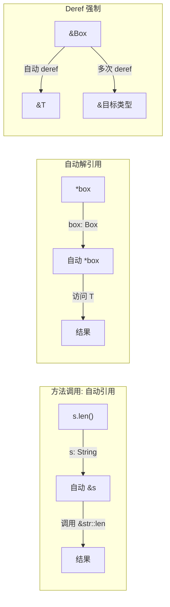
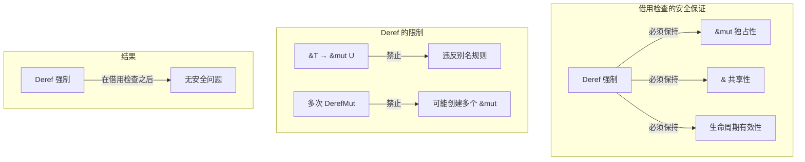

# 引用语义：自动解引用、Deref 强制与类型转换

> **Bloom 层级**: 理解 → 应用
> **定位**: 深入分析 Rust 的**引用语义机制**——自动解引用（Auto-deref）、Deref 强制（Deref Coercion）、类型强制（Type Coercion）以及它们与借用检查器的交互，澄清开发者常见的隐式转换困惑。
> **前置概念**: [Ownership](./01_ownership.md) · [Borrowing](./02_borrowing.md) · [Type System](./04_type_system.md)
> **后置概念**: [Smart Pointers](../02_intermediate/03_memory_management.md) · [Generics](../02_intermediate/02_generics.md)

---

> **来源**:
> [Rust Reference — Type Coercions](https://doc.rust-lang.org/reference/type-coercions.html) ·
> [Rust Reference — Method Call Expressions](https://doc.rust-lang.org/reference/expressions/method-call-expr.html#automatic-referencing) ·
> [TRPL Ch15 — Smart Pointers](https://doc.rust-lang.org/book/ch15-00-smart-pointers.html) ·
> [Rustonomicon — Coercions](https://doc.rust-lang.org/nomicon/coercions.html)

## 📑 目录

- [引用语义：自动解引用、Deref 强制与类型转换](#引用语义自动解引用deref-强制与类型转换)
  - [📑 目录](#-目录)
  - [一、核心概念](#一核心概念)
    - [1.1 引用的多重含义](#11-引用的多重含义)
    - [1.2 自动解引用机制](#12-自动解引用机制)
    - [1.3 Deref 强制](#13-deref-强制)
  - [二、技术细节](#二技术细节)
    - [2.1 方法调用的自动引用](#21-方法调用的自动引用)
    - [2.2 类型强制规则](#22-类型强制规则)
    - [2.3 与借用检查的交互](#23-与借用检查的交互)
  - [三、使用模式](#三使用模式)
  - [四、反命题与边界分析](#四反命题与边界分析)
    - [4.1 反命题树](#41-反命题树)
    - [4.2 边界极限](#42-边界极限)
  - [五、常见困惑解析](#五常见困惑解析)
  - [六、来源与延伸阅读](#六来源与延伸阅读)
  - [相关概念文件](#相关概念文件)

---

## 一、核心概念

### 1.1 引用的多重含义

在 Rust 中，"引用"（reference）在不同上下文中有不同含义：

```text
Rust 中的"引用"层次:

  1. 借用引用 (&T, &mut T)
     ├── 语法: &x, &mut x
     ├── 语义: 对值的非所有权访问
     └── 约束: 受借用检查器管理

  2. 原始指针 (*const T, *mut T)
     ├── 语法: *const T, *mut T
     ├── 语义: 无安全检查的内存地址
     └── 约束: 仅在 unsafe 块中使用

  3. 智能指针 (Box<T>, Rc<T>, Arc<T>)
     ├── 语法: 像值一样使用
     ├── 语义: 拥有所有权 + 附加行为
     └── 约束: 通过 Deref trait 模拟引用行为

  4. 函数指针 (fn() -> T)
     ├── 语法: fn(i32) -> i32
     ├── 语义: 可调用代码的地址
     └── 约束: 无环境捕获（与闭包区分）

关键区分:
  - 借用引用 ≠ 原始指针（后者无安全检查）
  - 借用引用 ≠ 智能指针（后者有所有权）
  - 智能指针通过 Deref 模拟引用行为
```

> **核心洞察**: Rust 的"引用"是一个**语义家族**，而非单一概念。理解各成员的区别是掌握 Rust 内存模型的关键。
> [来源: [Rust Reference — Reference Types](https://doc.rust-lang.org/reference/types/pointer.html#shared-references-)]

---

### 1.2 自动解引用机制



> **认知功能**: 此图展示 Rust 中三种**隐式引用/解引用机制**——自动引用（方法调用）、自动解引用（显式 * 操作）和 Deref 强制（类型转换）。
> [来源: [TRPL](https://doc.rust-lang.org/book/)]
> **使用建议**: 利用自动机制简化代码，但理解其背后的规则以避免意外行为。
> **关键洞察**: 这些隐式转换是**语法糖**——它们在编译期展开为显式操作，无运行时开销。
> [来源: [Rust Reference — Method Call Expressions](https://doc.rust-lang.org/reference/expressions/method-call-expr.html#automatic-referencing)]

---

### 1.3 Deref 强制

```rust,ignore
use std::ops::Deref;

struct MyBox<T>(T);

impl<T> Deref for MyBox<T> {
    type Target = T;
    fn deref(&self) -> &T {
        &self.0
    }
}

// Deref 强制生效:
let b = MyBox(String::from("hello"));
let s: &str = &b;  // ✅ &MyBox<String> → &String → &str

// 展开逻辑:
// 1. &b → &MyBox<String>
// 2. Deref: &MyBox<String> → &String
// 3. Deref (String deref to str): &String → &str
```

> **Deref 强制规则**:
>
> 1. 从 `&T` 到 `&U`，当 `T: Deref<Target=U>`
> 2. 从 `&mut T` 到 `&mut U`，当 `T: DerefMut<Target=U>`
> 3. 从 `&mut T` 到 `&U`，当 `T: Deref<Target=U>`（自动降级为不可变）
> 4. **不允许**: `&T` → `&mut U`（违反别名规则）
> [来源: [Rust Reference — Deref Coercion](https://doc.rust-lang.org/reference/type-coercions.html#unsized-coercions)]

---

## 二、技术细节

### 2.1 方法调用的自动引用

```rust,ignore
let s = String::from("hello");

// 情况 1: self 方法
s.len();        // 自动: (&s).len()

// 情况 2: &self 方法
let r = &s;
r.len();        // 自动: (*r).len() → 然后 (&*r).len()
                // 实际: r 已经是 &String，直接调用 &self 方法

// 情况 3: &mut self 方法
let mut s2 = String::from("world");
s2.push('!');   // 自动: (&mut s2).push('!')

// 情况 4: 多级自动引用
let b = Box::new(String::from("hi"));
b.len();        // 自动: (&*b).len() → &String::len()
```

> **自动引用规则**:
>
> 1. 编译器尝试 `s.method()` → `(&s).method()` → `(&mut s).method()` → `(*s).method()`
> 2. 选择**第一个成功匹配**的调用方式
> 3. 不可变引用优先于可变引用（避免不必要的独占访问）
> [来源: [Rust Reference — Method Call Expressions](https://doc.rust-lang.org/reference/expressions/method-call-expr.html#autoref)]

---

### 2.2 类型强制规则

```text
Rust 的类型强制（隐式转换）:

  1. 子类型强制
     ├── &T → &U（当 T 是 U 的子类型）
     └── 例: &mut T → &T（可变引用是更严格的类型）

  2. Deref 强制
     ├── &T → &U（当 T: Deref<Target=U>）
     ├── &mut T → &mut U（当 T: DerefMut<Target=U>）
     └── &mut T → &U（当 T: Deref<Target=U>）

  3. 指针弱化
     ├── &mut T → *mut T
     ├── &T → *const T
     └── &mut T → *const T

  4. 未大小类型转换
     ├── &T → &dyn Trait（当 T: Trait）
     └── 例: &MyType → &dyn MyTrait

  5. 生命周期延长
     └── 短生命周期引用 → 长生命周期引用

  注意: 与 C++ 不同，Rust 无数值类型隐式转换
  ├── i32 → i64 必须显式: i64::from(x)
  └── f64 → f32 必须显式: x as f32
```

> **强制规则**: Rust 的类型强制是**保守的**——只在类型安全且语义明确时发生。数值类型之间无隐式转换，避免 C/C++ 中的隐式截断 bug。
> [来源: [Rust Reference — Type Coercions](https://doc.rust-lang.org/reference/type-coercions.html)]

---

### 2.3 与借用检查的交互



> **认知功能**: 此图展示 Deref 强制与借用检查器的**协作关系**——Deref 强制发生在借用检查之后，因此不会绕过安全保证。
> [来源: [TRPL](https://doc.rust-lang.org/book/)]
> **关键洞察**: Deref 返回的引用**仍然受借用检查器约束**。`DerefMut::deref_mut` 返回的 `&mut self.0` 遵守所有可变引用的规则。
> [来源: [Rust Reference — Borrow Checker](https://doc.rust-lang.org/reference/statements-and-expressions.html)]

---

## 三、使用模式

```text
模式 1: 智能指针透明化
  let b = Box::new(vec![1, 2, 3]);
  b.push(4);  // 自动: (&mut *b).push(4)
  // Vec::push 需要 &mut self，DerefMut 自动解引用 Box

模式 2: 自定义类型的引用语义
  struct Wrapper(Vec<u8>);

  impl Deref for Wrapper {
      type Target = Vec<u8>;
      fn deref(&self) -> &Vec<u8> { &self.0 }
  }

  impl DerefMut for Wrapper {
      fn deref_mut(&mut self) -> &mut Vec<u8> { &mut self.0 }
  }

  let mut w = Wrapper(vec![1, 2, 3]);
  w.push(4);  // 通过 DerefMut 调用 Vec::push

模式 3: 字符串透明转换
  let s = String::from("hello");
  let s_ref: &str = &s;  // &String → &str（通过 Deref）

模式 4: 避免过度 Deref
  // 不推荐: 多级 Deref 降低代码清晰度
  let r: &&&i32 = &&&5;
  let v = r;  // 自动解引用到 &i32，但意图不明

  // 推荐: 显式标注类型
  let r: &&&i32 = &&&5;
  let v: &i32 = r;  // 意图清晰
```

> **最佳实践**: 利用 Deref 使自定义类型"像引用一样工作"，但避免过度嵌套的引用类型，保持代码清晰。
> [来源: [Rust API Guidelines — Smart Pointers](https://rust-lang.github.io/api-guidelines/)]

---

## 四、反命题与边界分析

### 4.1 反命题树

```mermaid
graph TD
    ROOT["命题: 所有包装类型都应实现 Deref"]
    ROOT --> Q1{"是否语义上是"引用"的扩展?"}
    Q1 -->|是| TRUE["✅ 实现 Deref — 如 Box, Rc, Arc"]
    Q1 -->|否| FALSE["❌ 不应实现 — Deref 不是通用委托机制"]

    style TRUE fill:#c8e6c9
    style FALSE fill:#ffebee
```

> **认知功能**: 此决策树判断是否应为类型实现 Deref。核心判断标准是**语义是否属于"引用"家族**。
> [来源: [TRPL](https://doc.rust-lang.org/book/)]
> **使用建议**: Deref 只用于**智能指针/引用包装器**。普通封装应使用显式方法，而非 Deref。
> **关键洞察**: Deref 的滥用会导致**隐式行为过度**——调用者无法从代码中看出转换发生，增加理解成本。
> [来源: [Rust API Guidelines — Deref](https://rust-lang.github.io/api-guidelines/predictability.html)]

---

### 4.2 边界极限

```text
边界 1: Deref 不是继承
├── Deref 提供隐式转换，不是子类型多态
├── 不能通过 Deref 调用目标类型的 trait 方法（除非也实现了该 trait）
└── 例: Box<dyn Write> 不能自动获得 Write 方法，除非 Box 也 impl Write

边界 2: Deref 和目标类型的方法冲突
├── 如果 Wrapper 和 Target 有同名方法，优先调用 Wrapper 的
├── 无自动 disambiguation，需显式转换
└── 例: wrapper.as_bytes() vs (*wrapper).as_bytes()

边界 3: Deref 与泛型
├── Deref<Target=T> 中的 Target 是关联类型，不是泛型参数
├── 一个类型只能有一个 Target
└── 不能根据上下文选择不同的 Deref 目标

边界 4: 自动引用有成本吗?
├── 无运行时成本——全部是编译期转换
├── 但过度隐式可能影响代码可读性
└── 与 C++ 的隐式转换不同，Rust 的转换是确定性的、可预测的
```

> **边界要点**: Deref 的设计是**克制而精确的**——提供足够的便利性，但不引入不可预测的隐式行为。
> [来源: [Rust Reference — Deref](https://doc.rust-lang.org/std/ops/trait.Deref.html)]

---

## 五、常见困惑解析

```text
困惑 1: &s 和 s.as_str() 的区别
  let s = String::from("hello");
  let r1: &str = &s;        // Deref 强制: &String → &str
  let r2: &str = s.as_str(); // 显式方法调用
  // 结果相同，但 &s 更惯用

困惑 2: 为什么 &mut String 可以传给需要 &str 的参数?
  fn print(s: &str) { println!("{}", s); }
  let mut s = String::from("hi");
  print(&s);      // ✅ &String → &str（Deref）
  print(&mut s);  // ✅ &mut String → &String → &str（降级 + Deref）

困惑 3: 为什么 Box<T> 可以自动解引用，但 Vec<T> 不行?
  // Box<T> 实现了 Deref<Target=T>
  // Vec<T> 实现了 Deref<Target=[T]>——解引用到切片，不是元素
  let v = vec![1, 2, 3];
  // let x: i32 = v;  // ❌ Vec<i32> 不 Deref 到 i32
  let s: &[i32] = &v;  // ✅ Vec<i32> Deref 到 [i32]

困惑 4: * 操作符在哪些情况下自动?
  let b = Box::new(5);
  let r = &b;
  println!("{}", *r);  // 显式解引用
  println!("{}", r);   // 自动解引用（某些上下文）
  // 实际上，对于 Copy 类型，&T 在某些上下文中自动解引用
```

> **困惑总结**: 大多数困惑源于**隐式转换的边界不清晰**。记住：Rust 的自动机制只在**方法调用**和**赋值/传参**时触发，其他场景需显式操作。
> [来源: [TRPL — Smart Pointers](https://doc.rust-lang.org/book/ch15-00-smart-pointers.html)]

---

## 六、来源与延伸阅读

| 来源 | 可信度 | 说明 |
|:---|:---:|:---|
| [Rust Reference — Type Coercions](https://doc.rust-lang.org/reference/type-coercions.html) | ✅ 一级 | 类型强制规则 |
| [Rust Reference — Method Call](https://doc.rust-lang.org/reference/expressions/method-call-expr.html) | ✅ 一级 | 自动引用机制 |
| [TRPL Ch15 — Smart Pointers](https://doc.rust-lang.org/book/ch15-00-smart-pointers.html) | ✅ 一级 | Deref trait 详解 |
| [Rustonomicon — Coercions](https://doc.rust-lang.org/nomicon/coercions.html) | ✅ 一级 | unsafe 强制 |
| [Rust API Guidelines](https://rust-lang.github.io/api-guidelines/) | ✅ 一级 | API 设计最佳实践 |

---

## 相关概念文件

- [Ownership](./01_ownership.md) — 所有权模型
- [Borrowing](./02_borrowing.md) — 借用与生命周期
- [Type System](./04_type_system.md) — Rust 类型系统
- [Memory Management](../02_intermediate/03_memory_management.md) — 内存管理与智能指针
- [Generics](../02_intermediate/02_generics.md) — 泛型与参数多态

---

> **权威来源**: [Rust Reference](https://doc.rust-lang.org/reference/), [The Rust Programming Language](https://doc.rust-lang.org/book/), [Rustonomicon](https://doc.rust-lang.org/nomicon/)
>
> **权威来源对齐变更日志**: 2026-05-21 创建，对齐 Rust 1.95.0+ (Edition 2024)

**文档版本**: 1.0
**对应 Rust 版本**: 1.95.0+ (Edition 2024)
**最后更新**: 2026-05-21
**状态**: ✅ 概念文件创建完成
