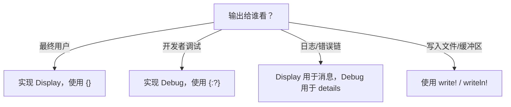
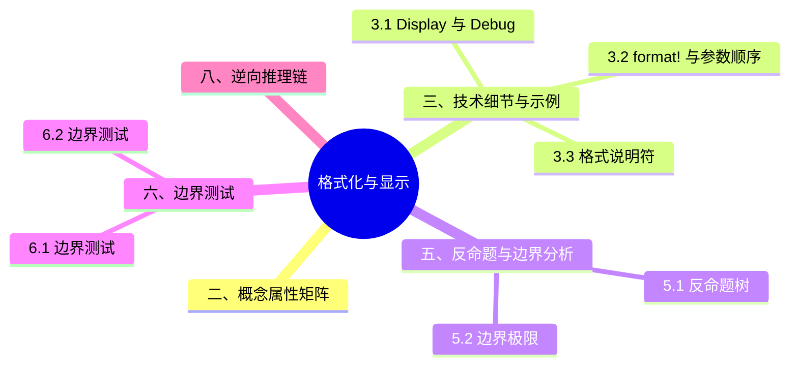

> **内容分级**: [综述级]
> **Rust 版本**: 1.97.0+ (Edition 2024)
> **本节关键术语**: 格式化（Formatting） · `Display` trait · `Debug` trait · `format!` 宏（Macro） · 格式化字符串（Format String） · 占位符（Placeholder）

# 格式化与显示（Display and Debug Formatting）
>
> **EN**: Display and Debug Formatting
> **Summary**: Rust's formatting system is built around the `Display` and `Debug` traits and the `format!` family of macros. It separates user-facing output from programmer-facing diagnostics and supports type-safe, extensible format specifiers.
>
> **受众**: [初学者]
> **层级**: L1 基础概念
> **Bloom 层级**: L1-L3
> **A/S/P 标记**: **A** — Application
> **双维定位**: C×App
> **前置概念**: [Strings and Text](01_strings_and_text.md) · [Traits](../../02_intermediate/00_traits/01_traits.md)
> **后置概念**: [Error Handling](../../02_intermediate/03_error_handling/01_error_handling.md) · [Logging and Tracing](../../06_ecosystem/00_toolchain/14_development_tools.md)
>
> **主要来源**: [std::fmt](https://doc.rust-lang.org/std/fmt/index.html) ·
> [The Rust Programming Language — Printing Values](https://doc.rust-lang.org/book/ch01-02-hello-world.html) ·
> [Rust By Example — Formatted Print](https://doc.rust-lang.org/rust-by-example/hello/print.html)
>
> **权威来源**: 本文件为 `concept/` 权威页。

---

> **变更日志**:
>
> - v1.0 (2026-07-04): 初始创建

## 📑 目录

---

- [格式化与显示（Display and Debug Formatting）](#格式化与显示display-and-debug-formatting)
  - [📑 目录](#-目录)
  - [一、权威定义（Definition）](#一权威定义definition)
    - [1.1 形式化定义](#11-形式化定义)
    - [1.2 直觉解释](#12-直觉解释)
  - [二、概念属性矩阵](#二概念属性矩阵)
  - [三、技术细节与示例](#三技术细节与示例)
    - [3.1 `Display` 与 `Debug`](#31-display-与-debug)
    - [3.2 `format!` 与参数顺序](#32-format-与参数顺序)
    - [3.3 格式说明符](#33-格式说明符)
    - [3.4 自定义格式化 trait](#34-自定义格式化-trait)
  - [四、示例与反例](#四示例与反例)
    - [4.1 正确示例：错误类型实现 Display](#41-正确示例错误类型实现-display)
    - [4.2 反例：格式化参数数量不匹配](#42-反例格式化参数数量不匹配)
    - [4.3 反例：为未实现 Display 的类型使用 `{}`](#43-反例为未实现-display-的类型使用-)
  - [五、反命题与边界分析](#五反命题与边界分析)
    - [5.1 反命题树](#51-反命题树)
    - [5.2 边界极限](#52-边界极限)
  - [六、边界测试](#六边界测试)
    - [6.1 边界测试：命名参数](#61-边界测试命名参数)
    - [6.2 边界测试：动态宽度与精度](#62-边界测试动态宽度与精度)
  - [七、判断推理与决策树](#七判断推理与决策树)
    - [7.1 选择哪种格式化方式？](#71-选择哪种格式化方式)
    - [7.2 与其他概念的辨析](#72-与其他概念的辨析)
  - [八、逆向推理链（Backward Reasoning）](#八逆向推理链backward-reasoning)
  - [九、来源与延伸阅读](#九来源与延伸阅读)
  - [嵌入式测验（Embedded Quiz）](#嵌入式测验embedded-quiz)
    - [测验 1：Display vs Debug](#测验-1display-vs-debug)
    - [测验 2：格式化说明符](#测验-2格式化说明符)
  - [认知路径](#认知路径)
  - [版本兼容性 / Version Compatibility](#版本兼容性--version-compatibility)
  - [国际权威参考 / International Authority References（P1 学术 · P2 生态）](#国际权威参考--international-authority-referencesp1-学术--p2-生态)
  - [🧭 思维导图（Mindmap）](#-思维导图mindmap)

---

## 一、权威定义（Definition）

> Rust 的格式化系统基于 `std::fmt` 模块（Module），核心是 `Display` 和 `Debug` trait。`Display` 用于面向用户的格式化输出，`Debug` 用于面向程序员的调试输出。`format!`、`print!`、`println!`、`eprintln!`、`write!` 等宏（Macro）都使用同一套格式化机制。
>
> [来源: [std::fmt](https://doc.rust-lang.org/std/fmt/index.html)]

### 1.1 形式化定义

```text
format! ("format_string", args...)
print!  ("format_string", args...)
println!("format_string", args...)
write!  (destination, "format_string", args...)
```

格式化字符串中的占位符：

- `{}` — 默认格式（调用 `Display`）
- `{:?}` — 调试格式（调用 `Debug`）
- `{:X}` — 十六进制大写
- `{:>10}` — 右对齐，宽度 10
- `{:.2}` — 小数点后 2 位

### 1.2 直觉解释

`Display` 就像给类型穿上“正式服装”，用于日志、UI、错误消息；`Debug` 则是“X 光片”，暴露内部结构供调试。`format!` 是“字符串模板引擎”，在编译期检查参数类型和数量。

> [💡 原创分析](../../00_meta/00_framework/methodology.md)

---

## 二、概念属性矩阵

| 属性 | 说明 | Rust 表达 | 权威来源 |
|:---|:---|:---|:---|
| 用户输出 | `Display` trait | `impl Display for T` | std::fmt |
| 调试输出 | `Debug` trait | `#[derive(Debug)]` | std::fmt |
| 格式化宏（Macro） | 编译期检查 | `format!("{}", x)` | std::fmt |
| 格式说明符 | 控制宽度、精度、进制等 | `{:08.2}` | std::fmt |
| 可扩展性 | 自定义 trait 如 `Binary`、`LowerHex` | `impl Binary for T` | std::fmt |
| 零开销 | 格式化参数在编译期校验 | N/A | std::fmt |

---

## 三、技术细节与示例

本节展开格式化系统的三个技术要点：

- **格式化 trait 的分工**：`Display`（面向用户的输出）、`Debug`（面向开发者，`{:?}`）、`LowerHex`/`Octal`/`Binary`/`Pointer` 等数值格式——`Display` 需手写或借助 `thiserror` 等，不可派生；
- **格式参数的完整语法**：`{val:>width$.precision$}`——对齐（`<`/`^`/`>`）、填充、宽度、精度、符号（`+`）、进制（`x`/`o`/`b`/`e`）与命名参数（`{name}`，1.58+ 支持 `{var}` 内联捕获）；
- **`format!` 家族的成本模型**：`format!` 分配 `String`、`write!` 写入 `io::Write` 或 `fmt::Write` 不分配（可复用缓冲）、`format_args!` 构造惰性 `Arguments`——日志宏等高频路径应传 `format_args!` 避免无条件分配。

每个要点附最小示例与输出对照，可直接运行验证。

### 3.1 `Display` 与 `Debug`

```rust
use std::fmt;

struct Point {
    x: f64,
    y: f64,
}

impl fmt::Display for Point {
    fn fmt(&self, f: &mut fmt::Formatter<'_>) -> fmt::Result {
        write!(f, "({}, {})", self.x, self.y)
    }
}

impl fmt::Debug for Point {
    fn fmt(&self, f: &mut fmt::Formatter<'_>) -> fmt::Result {
        f.debug_struct("Point")
            .field("x", &self.x)
            .field("y", &self.y)
            .finish()
    }
}

fn main() {
    let p = Point { x: 1.0, y: 2.0 };
    println!("Display: {}", p);   // Display: (1, 2)
    println!("Debug: {:?}", p);    // Debug: Point { x: 1.0, y: 2.0 }
}
```

> **关键洞察**: `Display` 面向最终用户，应稳定、美观；`Debug` 面向开发者，应完整、无歧义。
> [来源: [std::fmt::Display](https://doc.rust-lang.org/std/fmt/trait.Display.html)]

### 3.2 `format!` 与参数顺序

```rust
fn main() {
    let name = "Rust";
    let version = 1.96;
    let s = format!("{} version {:.1}", name, version);
    println!("{}", s);
}
```

### 3.3 格式说明符

```rust
fn main() {
    let n = 42;
    println!("decimal: {}", n);
    println!("hex: {:x}", n);
    println!("HEX: {:X}", n);
    println!("binary: {:b}", n);
    println!("octal: {:o}", n);
    println!("width 10: {:>10}", n);
    println!("pad zeros: {:010}", n);

    let pi = 3.14159;
    println!("pi: {:.2}", pi);
}
```

> **关键洞察**: 格式说明符 `{:` 后可接对齐、宽度、精度、进制等选项，具体见 `std::fmt` 文档。
> [来源: [std::fmt — Syntax](https://doc.rust-lang.org/std/fmt/index.html#syntax)]

### 3.4 自定义格式化 trait

```rust
use std::fmt;

struct Password(String);

impl fmt::Display for Password {
    fn fmt(&self, f: &mut fmt::Formatter<'_>) -> fmt::Result {
        write!(f, "{:*<width$}", "", width = self.0.len())
    }
}

fn main() {
    let pwd = Password("secret".to_string());
    println!("password: {}", pwd); // password: ******
}
```

---

## 四、示例与反例

本节用三组对照说明「格式化与显示（Display and Debug Formatting）」：正确示例：错误类型实现 Display、反例：格式化参数数量不匹配与反例：为未实现 Display 的类型使用 `{}`。每组先给正确示例并标注其成立的类型系统（Type System）依据，再给反例并标注编译器诊断（E0xxx）或运行时（Runtime）后果，最后给出修正方案。判读标准：正确示例应能通过 rustc 1.97 编译且无 clippy 警告，反例的失败点必须可定位到具体规则。

### 4.1 正确示例：错误类型实现 Display

```rust
use std::fmt;

#[derive(Debug)]
struct ConfigError {
    field: String,
}

impl fmt::Display for ConfigError {
    fn fmt(&self, f: &mut fmt::Formatter<'_>) -> fmt::Result {
        write!(f, "invalid config field: {}", self.field)
    }
}

impl std::error::Error for ConfigError {}

fn main() {
    let err = ConfigError { field: "timeout".into() };
    println!("error: {}", err);
    eprintln!("debug: {:?}", err);
}
```

### 4.2 反例：格式化参数数量不匹配

```rust,compile_fail
fn main() {
    let x = 42;
    println!("{} {}", x); // 错误：两个占位符但只有一个参数
}
```

> **错误诊断**: `error[E0067]: invalid reference to positional argument 1 (there is 1 argument)`
> **修正**: 提供与占位符数量一致的参数。
> [来源: [std::fmt](https://doc.rust-lang.org/std/fmt/index.html)]

### 4.3 反例：为未实现 Display 的类型使用 `{}`

```rust,compile_fail
struct MyType;

fn main() {
    let t = MyType;
    println!("{}", t); // 错误：MyType 未实现 Display
}
```

> **错误诊断**: `error[E0277]: MyType doesn't implement Display`
> **修正**: 实现 `Display` 或使用 `{:?}`（若已实现 `Debug`）。
> [来源: [std::fmt::Display](https://doc.rust-lang.org/std/fmt/trait.Display.html)]

---

## 五、反命题与边界分析

本节检验格式化系统的两条常见误判：

- **反命题 1：「`Display` 和 `Debug` 差不多，随便用一个」** —— 错误。`Debug` 承诺「面向程序员的忠实表示」（字符串带引号、结构带字段名），`Display` 承诺「面向用户的友好表示」。用 `{:?}` 输出用户可见文本会泄漏实现细节（字段名、内部结构），是 CLI 工具的常见瑕疵。判定准则：库类型必须实现 `Debug`（可派生），`Display` 只在类型有自然用户表示时实现。
- **反命题 2：「`to_string()` 总是便宜的」** —— 不准确：`ToString` 为所有 `Display` 类型 blanket 实现，每次调用都分配新 `String`——热路径应改用 `write!(&mut buf, ...)` 复用缓冲，或直接用 `Display` 包装延迟格式化。

边界极限小节量化：`format!` 参数的求值次数（每个参数只求值一次，与 C `printf` 不同）、`fmt::Error` 的语义（只表示底层 writer 失败）、以及 `{:*>8}` 类填充的字符级（非字节级）宽度计算。

### 5.1 反命题树

> **反命题 1**: "`{}` 和 `{:?}` 相同" ⟹ 不成立。`{}` 调用 `Display`，`{:?}` 调用 `Debug`。
> **反命题 2**: "`format!` 在运行时（Runtime）才检查参数" ⟹ 不成立。`format!` 在编译期检查参数数量和类型。
> **反命题 3**: "`Debug` 输出适合展示给用户" ⟹ 不成立。`Debug` 输出面向开发者，可能暴露内部结构。
> **反命题 4**: "所有类型都自动实现 `Display`" ⟹ 不成立。`Display` 必须手动实现；`Debug` 可通过 `#[derive(Debug)]` 自动生成。

### 5.2 边界极限

| 边界 | 现状 | 理论极限 | 工程意义 |
|:---|:---|:---|:---|
| 类型安全 | 编译期检查 | 完全类型安全 | 避免运行时（Runtime）格式化错误 |
| 国际化 | 无内置 i18n | 需第三方 crate | `format!` 不支持复数/性别等 |
| 自定义格式 | 通过 trait | 任意 | 可为类型实现专用 trait |
| 性能 | 通常优秀 | 零分配 | `write!` 可直接写入缓冲区 |

---

## 六、边界测试

本节把「格式化与显示（Display and Debug Formatting）」的规则推到编译器与运行时的边界上逐一实测：边界测试：命名参数 与 边界测试：动态宽度与精度。每个用例标注预期结果（编译错误 / 运行时 panic / 逻辑错误），并用 rustc 1.97 验证：能复现的给出诊断信息与触发条件，不能复现的说明原因。这些用例共同回答一个问题——规则在极限处是否仍然成立，以及违反时编译器能否兜底。

### 6.1 边界测试：命名参数

```rust
fn main() {
    let person = "Alice";
    let age = 30;
    println!("{name} is {age} years old", name = person, age = age);
}
```

### 6.2 边界测试：动态宽度与精度

```rust
fn main() {
    let width = 10;
    let precision = 2;
    let pi = 3.14159;
    println!("pi: {:*>width$.precision$}", pi, width = width, precision = precision);
}
```

---

## 七、判断推理与决策树

本节围绕「判断推理与决策树」展开，覆盖选择哪种格式化方式？ 与 与其他概念的辨析 两个方面。

### 7.1 选择哪种格式化方式？



### 7.2 与其他概念的辨析

| 场景 | 推荐选择 | 不推荐 | 理由 |
|:---|:---|:---|:---|
| 用户可见消息 | `Display` + `{}` | `Debug` + `{:?}` | Debug 输出不适合用户 |
| 结构内部查看 | `Debug` + `{:?}` 或 `{:#?}` | 手动字符串拼接 | derive 自动生成 |
| 写入 String | `format!` | `print!` + 重定向 stdout | 直接获得 String |
| 错误消息 | `impl Display for Error` | 仅 `Debug` | 错误 trait 要求 Display |

---

## 八、逆向推理链（Backward Reasoning）

> **从编译错误/运行时症状反推定理链**:
>
> ```text
> error[E0277] trait bound 不满足 ⟸ 类型未实现 Display/Debug ⟸ 实现对应 trait 或改用 {:?}/{}
> error[E0067] 参数数量不匹配 ⟸ format 字符串占位符与参数不一致 ⟸ 检查占位符数量
> 运行时输出混乱 ⟸ 使用了错误的 trait 或格式说明符 ⟸ 区分 Display 与 Debug
> ```
>
> **诊断映射**:
>
> - `error[E0277]: ... doesn't implement Display` → 使用 `{}` 但类型未实现 `Display`。
> - `error[E0277]: ... doesn't implement Debug` → 使用 `{:?}` 但类型未实现 `Debug`。
> - `error[E0067]: invalid reference to positional argument` → `format!` 参数数量不足。

---

## 九、来源与延伸阅读

- [Rust 核心术语英中对照表](../../00_meta/01_terminology/01_terminology_glossary.md)
- [std::fmt](https://doc.rust-lang.org/std/fmt/index.html)
- [std::fmt::Display](https://doc.rust-lang.org/std/fmt/trait.Display.html)
- [std::fmt::Debug](https://doc.rust-lang.org/std/fmt/trait.Debug.html)
- [Rust By Example — Formatted Print](https://doc.rust-lang.org/rust-by-example/hello/print.html)
- [The Rust Programming Language — Printing Values](https://doc.rust-lang.org/book/ch01-02-hello-world.html)

---

## 嵌入式测验（Embedded Quiz）

本节测验覆盖格式化系统的三个核心判别点：

- **理解层**：`Display`/`Debug`/`ToString` 的 trait 关系——为什么实现 `Display` 就自动获得 `ToString`（blanket impl）而反过来不行；
- **应用层**：格式串参数语法——给定目标输出写出对应的格式说明符（对齐、宽度、精度、进制组合）；
- **分析层**：`format!` 与 `write!` 的分配行为——判断给定代码产生几次堆分配，以及 `fmt::Write` 与 `io::Write` 两套 write! 的目标差异（UTF-8 保证 vs 字节流）。

作答建议：测验 2 在 playground 实际运行格式串验证，宽度/精度参数的交互（如 `{:8.3}` 对字符串的截断行为）实测一次胜过读三遍文档。

### 测验 1：Display vs Debug

**题目**: 你正在为自定义类型实现输出，用于向用户显示错误信息。应该实现哪个 trait？

A. `Debug`
B. `Display`
C. `Binary`
D. `LowerHex`

<details>
<summary>✅ 答案与解析</summary>

**答案**: B

**解析**: `Display` 用于面向用户的格式化输出，适合错误消息。`Debug` 用于调试，`Binary`/`LowerHex` 用于特定进制输出。

</details>

### 测验 2：格式化说明符

**题目**: 如何以 8 位宽度、右对齐、前面补零的方式打印整数 `42`？

A. `{:8}`
B. `{:>8}`
C. `{:08}`
D. `{:<8}`

<details>
<summary>✅ 答案与解析</summary>

**答案**: C

**解析**: `{:08}` 表示宽度为 8、前面补零、默认右对齐。`{:8}` 右对齐但补空格；`{:>8}` 显式右对齐补空格；`{:<8}` 左对齐。

</details>

---

## 认知路径

> **认知路径**: 本节从“如何将数据转换为文本”的需求出发，区分用户输出与调试输出，掌握 `format!` 宏和格式说明符，最终形成在错误处理（Error Handling）、日志、UI 中选择正确格式化策略的能力。
>
> 1. **问题识别**: 需要将各种类型的值输出为字符串。
> 2. **概念建立**: `Display` 面向用户，`Debug` 面向开发者，`format!` 是通用格式化入口。
> 3. **机制推理**: 格式化字符串在编译期被解析，参数类型在编译期检查。
> 4. **边界辨析**: `Display` vs `Debug`，格式说明符，自定义 trait。
> 5. **迁移应用**: 在错误消息、日志、调试、文件输出中使用合适的格式化方式。

---

> **权威来源**: [std::fmt](https://doc.rust-lang.org/std/fmt/index.html), [The Rust Programming Language](https://doc.rust-lang.org/book/title-page.html), [Rust By Example](https://doc.rust-lang.org/rust-by-example/index.html)
> **权威来源对齐变更日志**: 2026-07-04 创建 [Rust 1.97.0 std::fmt 与 TRPL 对齐](https://doc.rust-lang.org/std/fmt/index.html)
> **状态**: ✅ 权威来源对齐完成

---

## 版本兼容性 / Version Compatibility

> 本节汇总与本概念相关的 Rust 稳定版本变更。完整列表见对应版本跟踪页。

- **[Rust 1.93](../../07_future/00_version_tracking/rust_1_93_stabilized.md)**
  - `fmt::from_fn` / `fmt::FromFn`

## 国际权威参考 / International Authority References（P1 学术 · P2 生态）

> 依据 `AGENTS.md` §2「对齐网络国际化权威内容」补充：仅追加已验证可达的权威链接，不改动正文事实。

- **P1 学术/形式化**: [Weiss, Patterson, Matsakis & Ahmed: Oxide — The Essence of Rust（Rust 类型系统（Type System）/trait 的学术形式化, arXiv:1903.00982）](https://arxiv.org/abs/1903.00982)（2026-07-12 验证 HTTP 200）
- **P2 生态/社区**: [docs.rs/regex — 生态权威 API 文档](https://docs.rs/regex) · [docs.rs/serde_json — 生态权威 API 文档](https://docs.rs/serde_json)

---

> **Rust 1.93 起**：`std::fmt::from_fn` 与 `std::fmt::FromFn` 稳定，可用闭包（Closures）直接构造实现 `Display` 等格式化 trait 的值，无需定义新类型。详见 [版本页](../../07_future/00_version_tracking/rust_1_93_stabilized.md)（特性矩阵节）。

## 🧭 思维导图（Mindmap）


