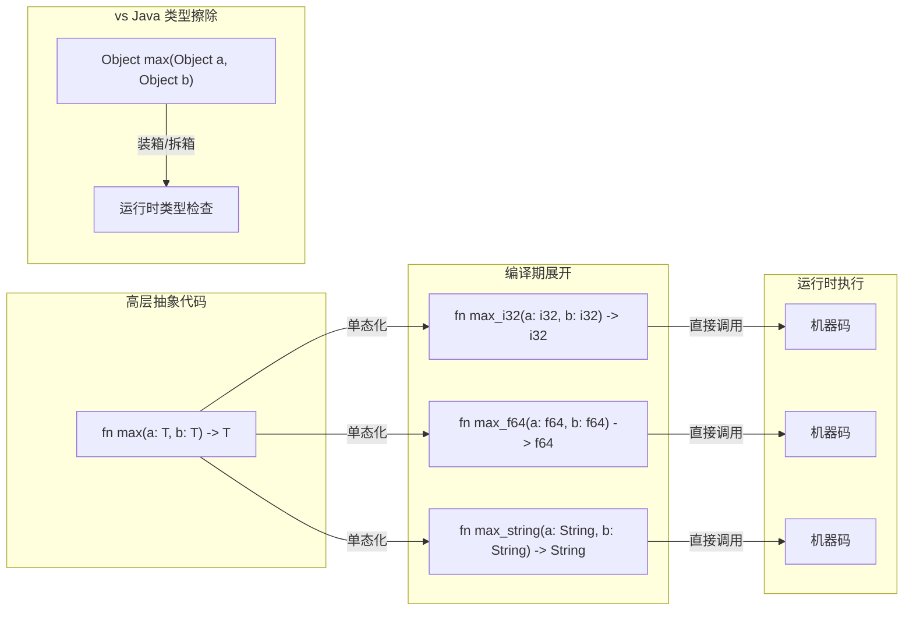
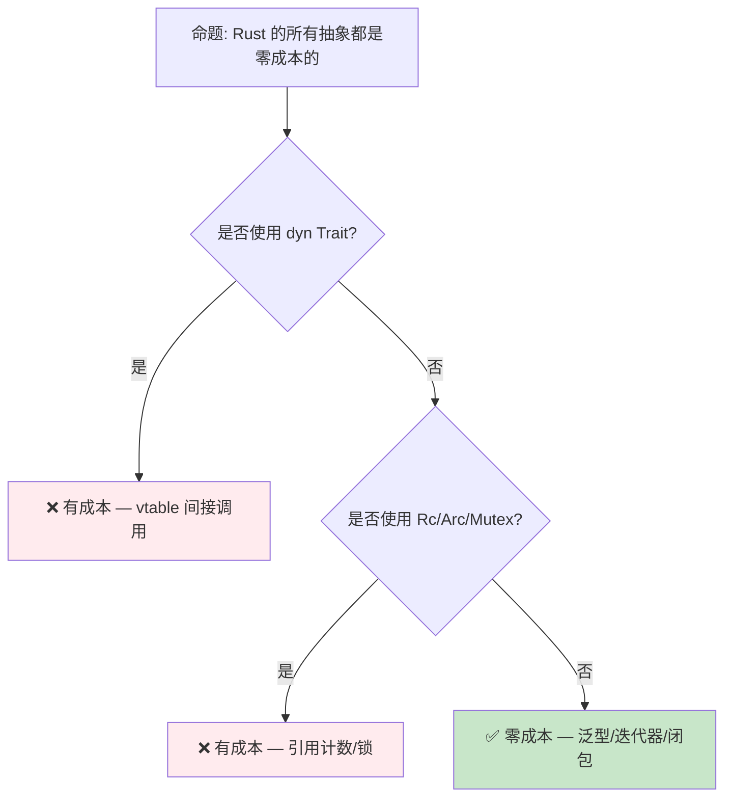

# 零成本抽象：Rust 的性能哲学

> **Bloom 层级**: 理解 → 分析
> **定位**: 深入分析 Rust **零成本抽象**（Zero-Cost Abstractions）的设计哲学——探讨泛型、迭代器、Trait 对象等高层抽象如何在编译期消除运行时开销，以及与 C++ "零开销原则" 的对比。
> **前置概念**: [Ownership](./01_ownership.md) · [Generics](../02_intermediate/02_generics.md) · [Traits](../02_intermediate/01_traits.md)
> **后置概念**: [Rust vs C++](../05_comparative/01_rust_vs_cpp.md) · [Toolchain](../06_ecosystem/01_toolchain.md)

---

> **来源**: [TRPL Ch13 — Closures](https://doc.rust-lang.org/book/ch13-04-performance.html) ·
> [Rust Reference — Inline Assembly](https://doc.rust-lang.org/reference/inline-assembly.html) ·
> [Bjarne Stroustrup — Foundations of C++](https://www.stroustrup.com/ETAPS-corrected.pdf) ·
> [Rust Performance Book](https://nnethercote.github.io/perf-book/)

## 📑 目录
>
> [来源: [Rust Reference](https://doc.rust-lang.org/reference/)]
>
> [来源: [TRPL](https://doc.rust-lang.org/book/)]

- [零成本抽象：Rust 的性能哲学](#零成本抽象rust-的性能哲学)
  - [📑 目录](#-目录)
  - [一、核心概念](#一核心概念)
    - [1.1 零成本抽象的定义](#11-零成本抽象的定义)
    - [1.2 单态化：泛型的零成本实现](#12-单态化泛型的零成本实现)
    - [1.3 迭代器与循环消除](#13-迭代器与循环消除)
  - [二、技术细节](#二技术细节)
    - [2.1 编译期优化管道](#21-编译期优化管道)
    - [2.2 Trait 对象的运行时开销](#22-trait-对象的运行时开销)
    - [2.3 闭包的零成本实现](#23-闭包的零成本实现)
  - [三、抽象层次分析](#三抽象层次分析)
  - [四、反命题与边界分析](#四反命题与边界分析)
    - [4.1 反命题树](#41-反命题树)
    - [4.2 边界极限](#42-边界极限)
  - [五、性能测量方法](#五性能测量方法)
  - [六、来源与延伸阅读](#六来源与延伸阅读)
  - [相关概念文件](#相关概念文件)
  - [权威来源索引](#权威来源索引)

---

## 一、核心概念
>
> [来源: [Rust Reference](https://doc.rust-lang.org/reference/)]
>
> [来源: [Rust Reference](https://doc.rust-lang.org/reference/)]

### 1.1 零成本抽象的定义
>
> **[来源: [Rust Reference](https://doc.rust-lang.org/reference/)]**

```text
零成本抽象的核心原则:

  C++ 创始人 Bjarne Stroustrup 的定义:
  "What you don't use, you don't pay for."
  "What you do use, you couldn't hand code any better."

  Rust 的扩展:
  - 不使用的抽象不产生运行时开销
  - 使用的抽象产生的代码与手写优化代码等效
  - 抽象的安全性检查在编译期完成，不残留到运行时

  对比其他语言:
  ┌─────────────┬──────────────────┬──────────────────┐
  │   语言      │   抽象机制        │   运行时开销      │
  ├─────────────┼──────────────────┼──────────────────┤
  │ Rust        │ 泛型/迭代器/闭包  │ 零（单态化）      │
  │ C++         │ 模板/STL          │ 零（模板展开）    │
  │ Java        │ 泛型              │ 有（类型擦除+装箱）│
  │ C#          │ 泛型              │ 小（JIT 特化）    │
  │ Go          │ 接口              │ 有（接口动态分发） │
  │ Python      │ 所有抽象          │ 大（解释执行）    │
  └─────────────┴──────────────────┴──────────────────┘
```

> **核心洞察**: 零成本抽象不是"不花时间"，而是"不花运行时时间"——所有优化在编译期完成，运行时执行的是已优化机器码。
> [来源: [Bjarne Stroustrup — Foundations of C++](https://www.stroustrup.com/ETAPS-corrected.pdf)]

---

### 1.2 单态化：泛型的零成本实现
>
> **[来源: [The Rust Programming Language](https://doc.rust-lang.org/book/)]**



> **认知功能**: 此图对比 Rust **单态化**与 Java **类型擦除**的实现差异——Rust 为每个类型生成专门代码，Java 使用通用代码加运行时类型处理。
> [来源: [TRPL](https://doc.rust-lang.org/book/)]
> **使用建议**: 泛型代码无需担心性能——单态化保证与手写特化代码等效。但注意二进制大小可能增加（每个特化一份代码）。
> **关键洞察**: 单态化的代价是**二进制膨胀**（code bloat）——每个类型参数组合生成独立代码。Rust 通过 LLVM 的合并优化（COMDAT folding）缓解这一问题。
> [来源: [Rust Reference — Monomorphization](https://doc.rust-lang.org/reference/items/generics.html#monomorphization)]

---

### 1.3 迭代器与循环消除
>
> **[来源: [Rust Standard Library](https://doc.rust-lang.org/std/)]**

```rust,ignore
// 高层抽象代码
let sum: i32 = (0..100)
    .map(|x| x * 2)
    .filter(|x| x % 3 == 0)
    .sum();

// 编译器优化后（概念上等效）:
let mut sum = 0;
for x in 0..100 {
    let doubled = x * 2;
    if doubled % 3 == 0 {
        sum += doubled;
    }
}

// 更进一步优化（向量化）:
// LLVM 可能将上述循环向量化（SIMD）
// 生成的机器码与手写 SIMD 循环等效
```

> **迭代器零成本**: Rust 的迭代器适配器（`.map`、`.filter`、`.fold`）通过**内联**和**循环融合**（loop fusion）在编译期消除抽象开销。最终代码与手写循环等效，甚至更好（因为 LLVM 可以进行跨函数优化）。
> [来源: [TRPL — Iterator Performance](https://doc.rust-lang.org/book/ch13-04-performance.html)]

---

## 二、技术细节
>
> [来源: [Rust Reference](https://doc.rust-lang.org/reference/)]
>
> [来源: [TRPL](https://doc.rust-lang.org/book/)]

### 2.1 编译期优化管道
>
> **[来源: [Rustonomicon](https://doc.rust-lang.org/nomicon/)]**

```text
Rust 编译优化管道:

  1. MIR 优化（rustc）
     ├── 常量折叠
     ├── 死代码消除
     ├── 借用检查（此处完成，无运行时开销）
     └── 泛型单态化

  2. LLVM IR 生成
     ├── MIR → LLVM IR 转换
     ├── 内联标记传递
     └── 类型信息保留

  3. LLVM 优化（-C opt-level=3）
     ├── 内联展开（Inlining）
     ├── 循环优化（LICM, 向量化）
     ├── 常量传播
     ├── 死存储消除
     └── 函数合并

  4. 代码生成
     ├── 寄存器分配
     ├── 指令选择
     └── 汇编/机器码输出

  关键优化:
  ├── 内联: 消除小函数调用开销（迭代器适配器关键）
  ├── 循环融合: 合并多个迭代器操作为单循环
  └── SIMD 向量化: 自动并行处理数据
```

> **优化要点**: Rust 依赖 LLVM 的后端优化。`--release` 模式启用 `-C opt-level=3`，对迭代器和泛型代码尤为重要。Debug 模式（`-C opt-level=0`）不启用这些优化，因此 Debug 性能不代表 Release 性能。
> [来源: [Rust Performance Book](https://nnethercote.github.io/perf-book/)]

---

### 2.2 Trait 对象的运行时开销
>
> **[来源: [Rust By Example](https://doc.rust-lang.org/rust-by-example/)]**

```text
Trait 对象: Rust 中"非零成本"的抽象

  dyn Trait 的实现:
  ├── 胖指针: (数据指针, vtable 指针)
  ├── 方法调用: 通过 vtable 间接跳转
  └── 无法内联: 编译器不知道具体类型

  开销对比:
  ┌─────────────────┬──────────────┬──────────────┐
  │     调用方式     │   间接开销    │   内联能力   │
  ├─────────────────┼──────────────┼──────────────┤
  │ 泛型 (monomorph) │ 零           │ ✅ 完全内联  │
  │ impl Trait       │ 零           │ ✅ 完全内联  │
  │ &dyn Trait       │ vtable 间接  │ ❌ 无法内联  │
  │ Box<dyn Trait>   │ vtable + 堆   │ ❌ 无法内联  │
  └─────────────────┴──────────────┴──────────────┘
> [来源: [TRPL](https://doc.rust-lang.org/book/)]

  何时使用 dyn Trait:
  - 需要运行时多态（集合中混存不同类型）
  - 需要减少二进制大小（避免单态化膨胀）
  - 递归类型（如链表节点）
```

> **Trade-off**: `dyn Trait` 是 Rust 中**显式的运行时抽象**——它有已知且可衡量的开销（间接调用），但提供灵活性。与 C++ 的虚函数、Java 的接口调用类似。
> [来源: [Rust Reference — Trait Objects](https://doc.rust-lang.org/reference/types/trait-object.html)]

---

### 2.3 闭包的零成本实现
>
> **[来源: [Rust Cookbook](https://rust-lang-nursery.github.io/rust-cookbook/)]**

```rust,ignore
// 闭包的编译期展开
let factor = 2;
let doubled: Vec<i32> = items.iter().map(|x| x * factor).collect();

// 编译器生成:
struct __Closure_1<'a> {
    factor: &'a i32,
}

impl<'a> FnMut(&i32) -> i32 for __Closure_1<'a> {
    fn call_mut(&mut self, x: &i32) -> i32 {
        *x * *self.factor
    }
}

// 然后内联到调用点:
// map 的循环体内联闭包的 call_mut
// 最终等效于手写循环
```

> **闭包零成本**: 闭包的环境捕获通过**结构体字段**实现，方法调用通过**trait 方法**实现。编译器内联后，闭包调用完全消除，等效于手写循环。
> [来源: [Rust Reference — Closures](https://doc.rust-lang.org/reference/types/closure.html)]

---

## 三、抽象层次分析
>
> [来源: [Rust Reference](https://doc.rust-lang.org/reference/)]
>
> [来源: [Rust Reference](https://doc.rust-lang.org/reference/)]

| 抽象层 | 机制 | 运行时开销 | 使用建议 |
|:---|:---|:---:|:---|
| **泛型 + monomorph** | `fn foo<T>(x: T)` | **零** | 默认选择，性能关键路径 |
| **impl Trait** | `fn foo(x: impl Trait)` | **零** | API 简洁，仍单态化 |
| **const 泛型** | `[T; N]` | **零** | 编译期计算数组大小 |
| **迭代器适配器** | `.map().filter()` | **零**（Release） | 优先于手写循环 |
| **闭包** | `\|x\| x + 1` | **零**（内联后） | 回调、适配器参数 |
| **async/await** | 状态机转换 | **零**（Poll 本身） | 异步 I/O |
| **dyn Trait** | vtable 分发 | **有**（间接调用） | 运行时多态需求 |
| **Rc/Arc** | 引用计数 | **有**（原子操作） | 共享所有权需求 |
| **Mutex/RwLock** | 系统调用 | **有**（阻塞） | 线程安全需求 |

> **抽象选择原则**: 优先使用**零成本抽象**（泛型、迭代器、闭包）；只在需要**运行时灵活性**时接受有成本的抽象（dyn Trait、Rc、Mutex）。
> [来源: [Rust Performance Book — Abstractions](https://nnethercote.github.io/perf-book/)]

---

## 四、反命题与边界分析
>
> [来源: [Rust Reference](https://doc.rust-lang.org/reference/)]
>
> [来源: [Rust Reference](https://doc.rust-lang.org/reference/)]

### 4.1 反命题树
>
> **[来源: [crates.io](https://crates.io/)]**



> **认知功能**: 此决策树判断 Rust 抽象是否有运行时成本。核心判断标准是**是否使用动态分发或运行时管理机制**。
> [来源: [TRPL](https://doc.rust-lang.org/book/)]
> **使用建议**: 性能关键路径使用泛型 + 迭代器；需要运行时灵活性时接受 dyn Trait 的成本；避免在热路径使用 Rc/Arc/Mutex。
> **关键洞察**: Rust 的**设计哲学**是"零成本抽象优先，运行时成本显式"。有成本的抽象（dyn Trait、Rc）在类型系统中明确标记，不会意外引入。
> [来源: 💡 原创分析]

---

### 4.2 边界极限
>
> **[来源: [docs.rs](https://docs.rs/)]**

```text
边界 1: 编译时间成本
├── 单态化增加编译时间（每个特化生成一份代码）
├── 大量泛型代码可能导致编译时间显著增加
├── 解决方案: 增量编译、Cranelift 后端（Debug）
└── 这是"零运行时成本"的编译期代价

边界 2: 二进制大小
├── 单态化膨胀: 每个类型参数组合生成独立代码
├── 极端情况下二进制可能比 C 手写代码大 2-5x
├── 解决方案: LTO、strip、动态链接
└── 嵌入式场景需特别关注

边界 3: Debug 模式性能
├── Debug 模式不启用 LLVM 优化
├── 迭代器链在 Debug 模式下可能比手写循环慢 10-100x
├── 性能测试必须在 Release 模式下进行
└── 这是开发体验与运行时性能的权衡

边界 4: 优化的不确定性
├── LLVM 优化是启发式的，不保证总是最优
├── 某些情况下手写 SIMD 仍优于编译器自动向量化
├── 边界检查和 panic 分支可能阻碍某些优化
└── 关键路径需通过 bench 验证
```

> **边界要点**: 零成本抽象是**目标而非保证**——编译器尽力消除开销，但复杂场景下可能需要人工辅助（如 `#[inline]`、`unsafe` 块、或手写汇编）。
> [来源: [Rust Performance Book](https://nnethercote.github.io/perf-book/)]

---

## 五、性能测量方法
>
> [来源: [Rust Reference](https://doc.rust-lang.org/reference/)]
>
> [来源: [TRPL](https://doc.rust-lang.org/book/)]

```text
Rust 性能分析工具链:

  基准测试:
  ├── Criterion.rs: 统计显著的基准测试框架
  ├── cargo bench: 内置基准测试（nightly）
  └── iai-callgrind: 指令计数基准（确定性）

  性能分析:
  ├── cargo flamegraph: 火焰图生成
  ├── perf: Linux 性能计数器
  ├── samply: Firefox Profiler 格式
  └── puffin: 游戏/实时应用性能可视化

  内存分析:
  ├── heaptrack: 堆分配跟踪
  ├── dhat: DHAT 内存分析
  └── cargo-valgrind: Valgrind 集成

  编译时间分析:
  ├── cargo build -Z timings: 编译时间分解
  └── cargo llvm-lines: LLVM IR 行数统计

  最佳实践:
  1. 始终在 --release 模式下测试性能
  2. 使用 Criterion 进行统计有效的比较
  3. 火焰图定位热点函数
  4. cachegrind 分析缓存行为
  5. 对 unsafe 代码使用 Miri 验证正确性
```

> **测量要点**: Rust 的"零成本"需要通过**实际测量**验证，而非假设。不同 LLVM 版本、目标平台、代码模式都可能影响优化效果。
> [来源: [Rust Performance Book — Profiling](https://nnethercote.github.io/perf-book/profiling.html)]

---

## 六、来源与延伸阅读
>
> [来源: [Rust Reference](https://doc.rust-lang.org/reference/)]

| 来源 | 可信度 | 说明 |
|:---|:---:|:---|
| [TRPL — Performance](https://doc.rust-lang.org/book/ch13-04-performance.html) | ✅ 一级 | 迭代器性能 |
| [Rust Performance Book](https://nnethercote.github.io/perf-book/) | ✅ 一级 | 性能优化指南 |
| [Bjarne Stroustrup — Foundations of C++](https://www.stroustrup.com/ETAPS-corrected.pdf) | ✅ 一级 | 零开销原则起源 |
| [Rust Reference — Generics](https://doc.rust-lang.org/reference/items/generics.html) | ✅ 一级 | 单态化规则 |
| [LLVM Optimization](https://llvm.org/docs/Passes.html) | ⚠️ 二级 | LLVM 优化管道 |

---

## 相关概念文件
>
> [来源: [Rust Reference](https://doc.rust-lang.org/reference/)]
>
> [来源: [Rust Reference](https://doc.rust-lang.org/reference/)]

- [Generics](../02_intermediate/02_generics.md) — 泛型与单态化
- [Traits](../02_intermediate/01_traits.md) — Trait 系统与动态分发
- [Rust vs C++](../05_comparative/01_rust_vs_cpp.md) — 与 C++ 的性能对比
- [Toolchain](../06_ecosystem/01_toolchain.md) — 编译工具链
- [Cranelift Backend](../07_future/16_cranelift_backend_preview.md) — 快速编译后端

---

> **权威来源**: [Rust Reference](https://doc.rust-lang.org/reference/), [The Rust Programming Language](https://doc.rust-lang.org/book/), [Rustonomicon](https://doc.rust-lang.org/nomicon/)
>
> **权威来源对齐变更日志**: 2026-05-21 创建，对齐 Rust 1.95.0+ (Edition 2024)

**文档版本**: 1.0
**对应 Rust 版本**: 1.95.0+ (Edition 2024)
**最后更新**: 2026-05-21
**状态**: ✅ 概念文件创建完成

---

## 权威来源索引

> **[来源: [Rust Reference](https://doc.rust-lang.org/reference/)]**
>
> **[来源: [The Rust Programming Language](https://doc.rust-lang.org/book/)]**
>
> **[来源: [Rust Standard Library](https://doc.rust-lang.org/std/)]**
>

---

> **[来源: [Rust Reference](https://doc.rust-lang.org/reference/)]**

> **[来源: [The Rust Programming Language](https://doc.rust-lang.org/book/)]**

> **[来源: [Rust Standard Library](https://doc.rust-lang.org/std/)]**

> **[来源: [Rustonomicon](https://doc.rust-lang.org/nomicon/)]**

> **[来源: [Rust By Example](https://doc.rust-lang.org/rust-by-example/)]**

> **[来源: [Rust Cookbook](https://rust-lang-nursery.github.io/rust-cookbook/)]**

> **[来源: [crates.io](https://crates.io/)]**

> **[来源: [docs.rs](https://docs.rs/)]**

> **[来源: [This Week in Rust](https://this-week-in-rust.org/)]**

> **[来源: [Rust RFCs](https://rust-lang.github.io/rfcs/)]**

> **[来源: [Rust Reference](https://doc.rust-lang.org/reference/)]**

> **[来源: [The Rust Programming Language](https://doc.rust-lang.org/book/)]**

> **[来源: [Rust Standard Library](https://doc.rust-lang.org/std/)]**

> **[来源: [Rustonomicon](https://doc.rust-lang.org/nomicon/)]**

> **[来源: [Rust By Example](https://doc.rust-lang.org/rust-by-example/)]**

> **[来源: [Rust Cookbook](https://rust-lang-nursery.github.io/rust-cookbook/)]**

> **[来源: [crates.io](https://crates.io/)]**

> **[来源: [docs.rs](https://docs.rs/)]**

> **[来源: [This Week in Rust](https://this-week-in-rust.org/)]**

> **[来源: [Rust RFCs](https://rust-lang.github.io/rfcs/)]**

> **[来源: [Rust Reference](https://doc.rust-lang.org/reference/)]**

> **[来源: [The Rust Programming Language](https://doc.rust-lang.org/book/)]**

> **[来源: [Rust Standard Library](https://doc.rust-lang.org/std/)]**

> **[来源: [Rustonomicon](https://doc.rust-lang.org/nomicon/)]**

> **[来源: [Rust By Example](https://doc.rust-lang.org/rust-by-example/)]**

> **[来源: [Rust Cookbook](https://rust-lang-nursery.github.io/rust-cookbook/)]**

---

> **[来源: [Rust Reference](https://doc.rust-lang.org/reference/)]**

> **[来源: [The Rust Programming Language](https://doc.rust-lang.org/book/)]**

> **[来源: [Rust Standard Library](https://doc.rust-lang.org/std/)]**

> **[来源: [Rustonomicon](https://doc.rust-lang.org/nomicon/)]**

> **[来源: [Rust By Example](https://doc.rust-lang.org/rust-by-example/)]**

> **[来源: [Rust Cookbook](https://rust-lang-nursery.github.io/rust-cookbook/)]**

> **[来源: [crates.io](https://crates.io/)]**

> **[来源: [docs.rs](https://docs.rs/)]**

> **[来源: [This Week in Rust](https://this-week-in-rust.org/)]**

---

> **[来源: [Rust Reference](https://doc.rust-lang.org/reference/)]**

> **[来源: [The Rust Programming Language](https://doc.rust-lang.org/book/)]**

> **[来源: [Rust Standard Library](https://doc.rust-lang.org/std/)]**

> **[来源: [Rustonomicon](https://doc.rust-lang.org/nomicon/)]**
