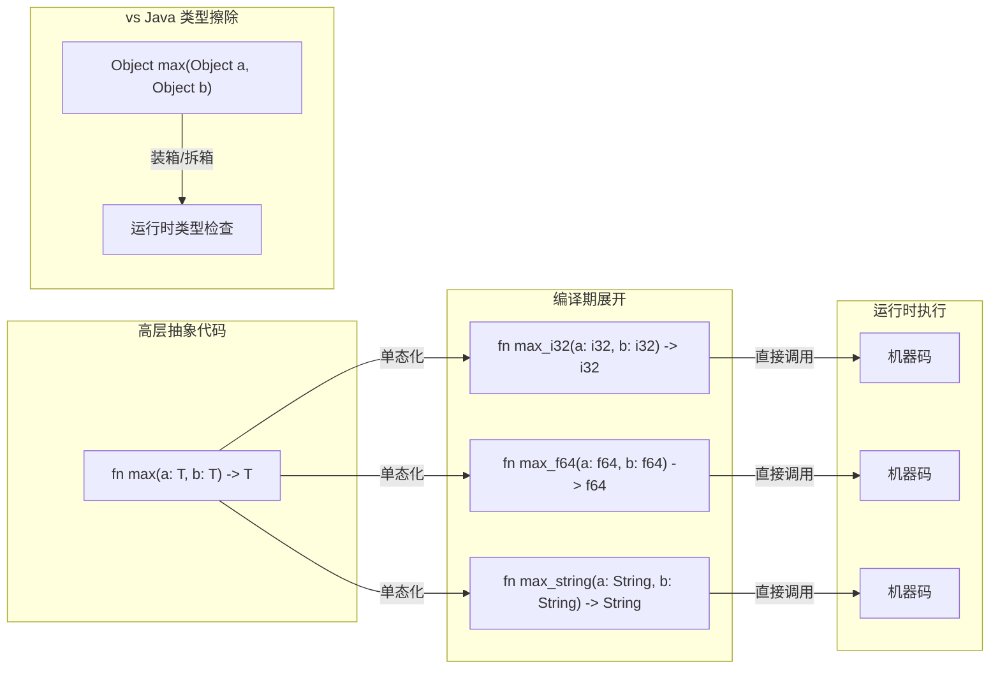
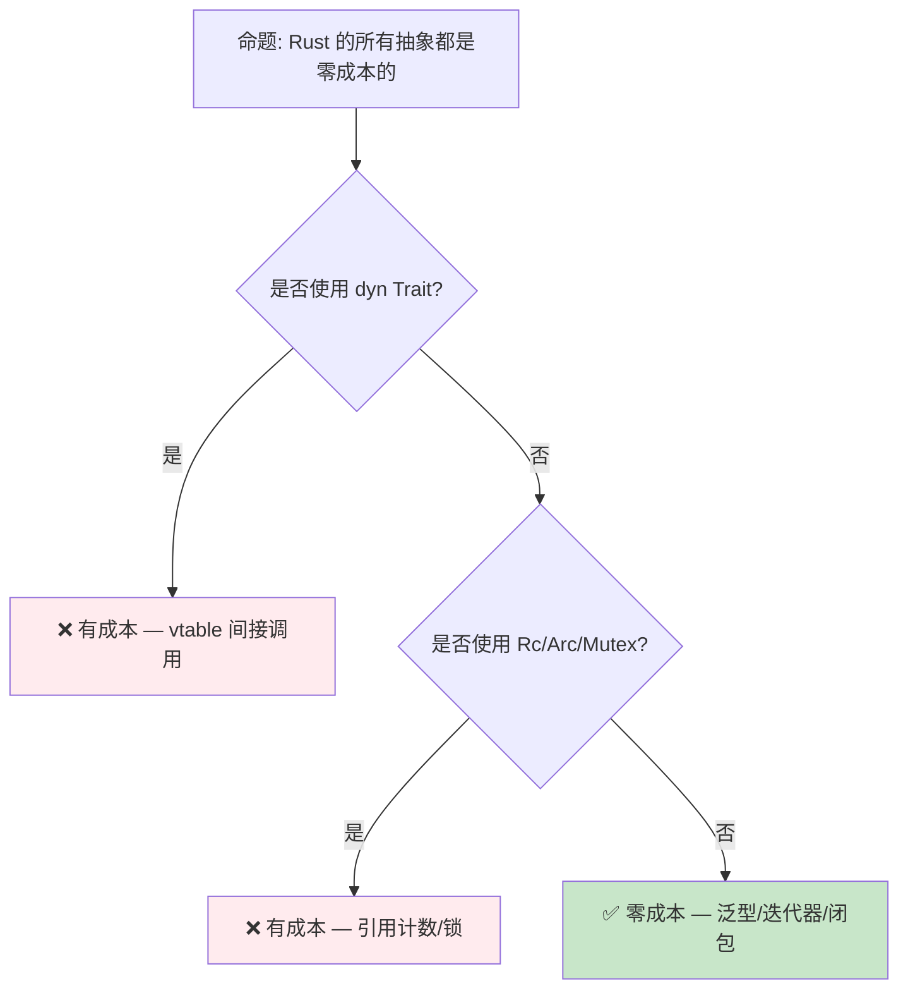

> **内容分级**: [综述级]
>
> **本节关键术语**:
>
> 零成本抽象 (Zero-Cost Abstraction) · 内联 (Inlining) · 单态化 (Monomorphization) · 编译期优化 (Compile-Time Optimization) · 抽象开销 (Abstraction Overhead) — [完整对照表](../00_meta/terminology_glossary.md)
>
# 零成本抽象：Rust 的性能哲学
>
> **EN**: Zero Cost Abstractions
> **Summary**: Zero Cost Abstractions: core Rust concepts, syntax, and examples.
> **受众**: [初学者]
> **Bloom 层级**: 理解 → 分析
> **A/S/P 标记**: **S+P** — Structure + Procedure
> **双维定位**: C×Eva — 评价零成本抽象（Zero-Cost Abstraction）的设计权衡
> **定位**: 深入分析 Rust **零成本抽象（Zero-Cost Abstraction）**（Zero-Cost Abstractions）的设计哲学——探讨泛型（Generics）、迭代器（Iterator）、Trait 对象等高层抽象如何在编译期消除运行时（Runtime）开销，以及与 C++ "零开销原则" 的对比。
> **前置概念**: [Ownership](01_ownership.md) · [Generics](../02_intermediate/02_generics.md) · [Traits](../02_intermediate/01_traits.md)
> **后置概念**: [Rust vs C++](../05_comparative/01_rust_vs_cpp.md) · [Toolchain](../06_ecosystem/01_toolchain.md)

---

> **来源**: [TRPL Ch13 — Closures](https://doc.rust-lang.org/book/ch13-04-performance.html) · · [Brown University — Concepts in Rust Programming](https://cel.cs.brown.edu/crp/) · [Jung et al. — RustBelt: Securing the Foundations of Rust](https://plv.mpi-sws.org/rustbelt/popl18/) · [Itanium C++ ABI](https://itanium-cxx-abi.github.io/cxx-abi/abi.html)
> [Rust Reference — Inline Assembly](https://doc.rust-lang.org/reference/inline-assembly.html) ·
> [Bjarne Stroustrup — Foundations of C++](https://www.stroustrup.com/ETAPS-corrected-draft.pdf) ·
> [Rust Performance Book](https://nnethercote.github.io/perf-book/)

## 📑 目录

- [零成本抽象（Zero-Cost Abstraction）：Rust 的性能哲学](#零成本抽象rust-的性能哲学)
  - [📑 目录](#-目录)
  - [一、核心概念](#一核心概念)
    - [1.1 零成本抽象（Zero-Cost Abstraction）的定义](#11-零成本抽象的定义)
    - [1.2 单态化（Monomorphization）：泛型（Generics）的零成本实现](#12-单态化泛型的零成本实现)
    - [1.3 迭代器（Iterator）与循环消除](#13-迭代器与循环消除)
  - [二、技术细节](#二技术细节)
    - [2.1 编译期优化管道](#21-编译期优化管道)
    - [2.2 Trait 对象的运行时（Runtime）开销](#22-trait-对象的运行时开销)
    - [2.3 闭包（Closures）的零成本实现](#23-闭包的零成本实现)
  - [三、抽象层次分析](#三抽象层次分析)
  - [四、反命题与边界分析](#四反命题与边界分析)
    - [4.1 反命题树](#41-反命题树)
    - [4.2 边界极限](#42-边界极限)
  - [五、性能测量方法](#五性能测量方法)
  - [六、来源与延伸阅读](#六来源与延伸阅读)
  - [相关概念文件](#相关概念文件)
  - [权威来源索引](#权威来源索引)
  - [十二、边界测试：零成本抽象的编译错误](#十二边界测试零成本抽象的编译错误)
    - [12.1 边界测试：泛型（Generics）单态化（Monomorphization）与代码膨胀（逻辑错误 / 编译器限制）](#121-边界测试泛型单态化与代码膨胀逻辑错误--编译器限制)
    - [12.2 边界测试：`inline` 提示与编译器优化（逻辑错误）](#122-边界测试inline-提示与编译器优化逻辑错误)
    - [12.3 边界测试：泛型递归类型的大小计算（编译错误）](#123-边界测试泛型递归类型的大小计算编译错误)
    - [12.4 边界测试：`dyn Trait` 的大小未知（编译错误）](#124-边界测试dyn-trait-的大小未知编译错误)
    - [10.3 边界测试：泛型单态化导致的代码膨胀（编译错误/链接错误）](#103-边界测试泛型单态化导致的代码膨胀编译错误链接错误)
    - [10.4 边界测试：`async` 状态机的 `Pin` 开销（编译错误/运行时（Runtime）行为）](#104-边界测试async-状态机的-pin-开销编译错误运行时行为)
    - [10.3 边界测试：零大小类型的布局陷阱（编译错误/UB）](#103-边界测试零大小类型的布局陷阱编译错误ub)
    - [10.3 边界测试：所有权（Ownership）移动后的再次使用](#103-边界测试所有权移动后的再次使用)
  - [实践](#实践)
  - [参考来源](#参考来源)
  - [嵌入式测验（Embedded Quiz）](#嵌入式测验embedded-quiz)
    - [测验 1：零成本抽象的定义（理解层）](#测验-1零成本抽象的定义理解层)
    - [测验 2：泛型单态化（应用层）](#测验-2泛型单态化应用层)
    - [测验 3：迭代器（Iterator） vs 循环（应用层）](#测验-3迭代器-vs-循环应用层)
    - [测验 4：Trait 对象的开销（分析层）](#测验-4trait-对象的开销分析层)
    - [测验 5：闭包（Closures）的内存布局（分析层）](#测验-5闭包的内存布局分析层)
  - [认知路径](#认知路径)
    - [核心推理链](#核心推理链)
    - [反命题与边界](#反命题与边界)

---

## 一、核心概念

### 1.1 零成本抽象的定义

```text
零成本抽象的核心原则:

  C++ 创始人 Bjarne Stroustrup 的定义:
  "What you don't use, you don't pay for."
  "What you do use, you couldn't hand code any better."

  Rust 的扩展:
  - 不使用的抽象不产生运行时开销
  - 使用的抽象产生的代码与手写优化代码等效
  - 抽象的安全性检查在编译期完成，不残留到运行时

  对比其他语言:
  ┌─────────────┬──────────────────┬──────────────────┐
  │   语言      │   抽象机制        │   运行时开销      │
  ├─────────────┼──────────────────┼──────────────────┤
  │ Rust        │ 泛型/迭代器/闭包  │ 零（单态化）      │
  │ C++         │ 模板/STL          │ 零（模板展开）    │
  │ Java        │ 泛型              │ 有（类型擦除+装箱）│
  │ C#          │ 泛型              │ 小（JIT 特化）    │
  │ Go          │ 接口              │ 有（接口动态分发） │
  │ Python      │ 所有抽象          │ 大（解释执行）    │
  └─────────────┴──────────────────┴──────────────────┘
```

> **核心洞察**: 零成本抽象不是"不花时间"，而是"不花运行时（Runtime）时间"——所有优化在编译期完成，运行时执行的是已优化机器码。
> [来源: [Bjarne Stroustrup — Foundations of C++](https://www.stroustrup.com/ETAPS-corrected-draft.pdf)]

---

### 1.2 单态化：泛型的零成本实现



> **认知功能**: 此图对比 Rust **单态化（Monomorphization）**与 Java **类型擦除**的实现差异——Rust 为每个类型生成专门代码，Java 使用通用代码加运行时类型处理。
> [来源: [TRPL](https://doc.rust-lang.org/book/title-page.html)]
> **使用建议**: 泛型代码无需担心性能——单态化（Monomorphization）保证与手写特化代码等效。但注意二进制大小可能增加（每个特化一份代码）。
> **关键洞察**: 单态化的代价是**二进制膨胀**（code bloat）——每个类型参数组合生成独立代码。Rust 通过 LLVM 的合并优化（COMDAT folding）缓解这一问题。
> [来源: [Rust Reference — Monomorphization](https://doc.rust-lang.org/reference/items/generics.html#monomorphization)]

---

### 1.3 迭代器与循环消除
>

```rust
// 高层抽象代码
let sum: i32 = (0..100)
    .map(|x| x * 2)
    .filter(|x| x % 3 == 0)
    .sum();

// 编译器优化后（概念上等效）:
let mut sum = 0;
for x in 0..100 {
    let doubled = x * 2;
    if doubled % 3 == 0 {
        sum += doubled;
    }
}

// 更进一步优化（向量化）:
// LLVM 可能将上述循环向量化（SIMD）
// 生成的机器码与手写 SIMD 循环等效
```

> **迭代器（Iterator）零成本**: Rust 的迭代器适配器（`.map`、`.filter`、`.fold`）通过**内联**和**循环融合**（loop fusion）在编译期消除抽象开销。
> 最终代码与手写循环等效，甚至更好（因为 LLVM 可以进行跨函数优化）。
> [来源: [TRPL — Iterator Performance](https://doc.rust-lang.org/book/ch13-04-performance.html)]

---

## 二、技术细节

### 2.1 编译期优化管道

```text
Rust 编译优化管道:

  1. MIR 优化（rustc）
     ├── 常量折叠
     ├── 死代码消除
     ├── 借用检查（此处完成，无运行时开销）
     └── 泛型单态化

  2. LLVM IR 生成
     ├── MIR → LLVM IR 转换
     ├── 内联标记传递
     └── 类型信息保留

  3. LLVM 优化（-C opt-level=3）
     ├── 内联展开（Inlining）
     ├── 循环优化（LICM, 向量化）
     ├── 常量传播
     ├── 死存储消除
     └── 函数合并

  4. 代码生成
     ├── 寄存器分配
     ├── 指令选择
     └── 汇编/机器码输出

  关键优化:
  ├── 内联: 消除小函数调用开销（迭代器适配器关键）
  ├── 循环融合: 合并多个迭代器操作为单循环
  └── SIMD 向量化: 自动并行处理数据
```

> **优化要点**:
> Rust 依赖 LLVM 的后端优化。
> `--release` 模式启用 `-C opt-level=3`，对迭代器（Iterator）和泛型代码尤为重要。
> Debug 模式（`-C opt-level=0`）不启用这些优化，因此 Debug 性能不代表 Release 性能。
> [来源: [Rust Performance Book](https://nnethercote.github.io/perf-book/)]

---

### 2.2 Trait 对象的运行时开销

```text
Trait 对象: Rust 中"非零成本"的抽象

  dyn Trait 的实现:
  ├── 胖指针: (数据指针, vtable 指针)
  ├── 方法调用: 通过 vtable 间接跳转
  └── 无法内联: 编译器不知道具体类型

  开销对比:
  ┌─────────────────┬──────────────┬──────────────┐
  │     调用方式     │   间接开销    │   内联能力   │
  ├─────────────────┼──────────────┼──────────────┤
  │ 泛型 (monomorph) │ 零           │ ✅ 完全内联  │
  │ impl Trait       │ 零           │ ✅ 完全内联  │
  │ &dyn Trait       │ vtable 间接  │ ❌ 无法内联  │
  │ Box<dyn Trait>   │ vtable + 堆   │ ❌ 无法内联  │
  └─────────────────┴──────────────┴──────────────┘

  何时使用 dyn Trait:
  - 需要运行时多态（集合中混存不同类型）
  - 需要减少二进制大小（避免单态化膨胀）
  - 递归类型（如链表节点）
```

> **Trade-off**: `dyn Trait` 是 Rust 中**显式的运行时抽象**——它有已知且可衡量的开销（间接调用），但提供灵活性。与 C++ 的虚函数、Java 的接口调用类似。
> [来源: [Rust Reference — Trait Objects](https://doc.rust-lang.org/reference/types/trait-object.html)]

---

### 2.3 闭包的零成本实现

```rust,ignore
// 闭包的编译期展开
let factor = 2;
let doubled: Vec<i32> = items.iter().map(|x| x * factor).collect();

// 编译器生成:
struct __Closure_1<'a> {
    factor: &'a i32,
}

impl<'a> FnMut(&i32) -> i32 for __Closure_1<'a> {
    fn call_mut(&mut self, x: &i32) -> i32 {
        *x * *self.factor
    }
}

// 然后内联到调用点:
// map 的循环体内联闭包的 call_mut
// 最终等效于手写循环
```

> **闭包（Closures）零成本**: 闭包的环境捕获通过**结构体（Struct）字段**实现，方法调用通过**trait 方法**实现。编译器内联后，闭包调用完全消除，等效于手写循环。
> [来源: [Rust Reference — Closures](https://doc.rust-lang.org/reference/types/closure.html)]

---

## 三、抽象层次分析

| 抽象层 | 机制 | 运行时开销 | 使用建议 |
|:---|:---|:---:|:---|
| **泛型（Generics） + monomorph** | `fn foo<T>(x: T)` | **零** | 默认选择，性能关键路径 |
| **impl Trait** | `fn foo(x: impl Trait)` | **零** | API 简洁，仍单态化 |
| **const 泛型（Generics）** | `[T; N]` | **零** | 编译期计算数组大小 |
| **迭代器适配器** | `.map().filter()` | **零**（Release） | 优先于手写循环 |
| **闭包（Closures）** | `\|x\| x + 1` | **零**（内联后） | 回调、适配器参数 |
| **async/await** | 状态机转换 | **零**（Poll 本身） | 异步 I/O |
| **dyn Trait** | vtable 分发 | **有**（间接调用） | 运行时多态需求 |
| **Rc/Arc** | 引用（Reference）计数 | **有**（原子操作） | 共享所有权（Ownership）需求 |
| **Mutex/RwLock** | 系统调用 | **有**（阻塞） | 线程安全需求 |

> **抽象选择原则**: 优先使用**零成本抽象（Zero-Cost Abstraction）**（泛型、迭代器（Iterator）、闭包（Closures））；只在需要**运行时灵活性**时接受有成本的抽象（dyn Trait、Rc、Mutex）。
> [来源: [Rust Performance Book — Abstractions](https://nnethercote.github.io/perf-book/)]

---

## 四、反命题与边界分析

### 4.1 反命题树
>



> **认知功能**: 此决策树判断 Rust 抽象是否有运行时成本。核心判断标准是**是否使用动态分发或运行时管理机制**。
> **使用建议**: 性能关键路径使用泛型 + 迭代器；需要运行时灵活性时接受 dyn Trait 的成本；避免在热路径使用 Rc/Arc/Mutex。
> **关键洞察**: Rust 的**设计哲学**是"零成本抽象优先，运行时成本显式"。有成本的抽象（dyn Trait、Rc）在类型系统（Type System）中明确标记，不会意外引入。
> [来源: 💡 原创分析]

---

### 4.2 边界极限
>

```text
边界 1: 编译时间成本
├── 单态化增加编译时间（每个特化生成一份代码）
├── 大量泛型代码可能导致编译时间显著增加
├── 解决方案: 增量编译、Cranelift 后端（Debug）
└── 这是"零运行时成本"的编译期代价

边界 2: 二进制大小
├── 单态化膨胀: 每个类型参数组合生成独立代码
├── 极端情况下二进制可能比 C 手写代码大 2-5x
├── 解决方案: LTO、strip、动态链接
└── 嵌入式场景需特别关注

边界 3: Debug 模式性能
├── Debug 模式不启用 LLVM 优化
├── 迭代器链在 Debug 模式下可能比手写循环慢 10-100x
├── 性能测试必须在 Release 模式下进行
└── 这是开发体验与运行时性能的权衡

边界 4: 优化的不确定性
├── LLVM 优化是启发式的，不保证总是最优
├── 某些情况下手写 SIMD 仍优于编译器自动向量化
├── 边界检查和 panic 分支可能阻碍某些优化
└── 关键路径需通过 bench 验证
```

> **边界要点**: 零成本抽象是**目标而非保证**——编译器尽力消除开销，但复杂场景下可能需要人工辅助（如 `#[inline]`、`unsafe` 块、或手写汇编）。

---

## 五、性能测量方法

```text
Rust 性能分析工具链:

  基准测试:
  ├── Criterion.rs: 统计显著的基准测试框架
  ├── cargo bench: 内置基准测试（nightly）
  └── iai-callgrind: 指令计数基准（确定性）

  性能分析:
  ├── cargo flamegraph: 火焰图生成
  ├── perf: Linux 性能计数器
  ├── samply: Firefox Profiler 格式
  └── puffin: 游戏/实时应用性能可视化

  内存分析:
  ├── heaptrack: 堆分配跟踪
  ├── dhat: DHAT 内存分析
  └── cargo-valgrind: Valgrind 集成

  编译时间分析:
  ├── cargo build -Z timings: 编译时间分解
  └── cargo llvm-lines: LLVM IR 行数统计

  最佳实践:
  1. 始终在 --release 模式下测试性能
  2. 使用 Criterion 进行统计有效的比较
  3. 火焰图定位热点函数
  4. cachegrind 分析缓存行为
  5. 对 unsafe 代码使用 Miri 验证正确性
```

> **测量要点**: Rust 的"零成本"需要通过**实际测量**验证，而非假设。不同 LLVM 版本、目标平台、代码模式都可能影响优化效果。
> [来源: [Rust Performance Book — Profiling](https://nnethercote.github.io/perf-book/profiling.html)]

---

## 六、来源与延伸阅读
>

| 来源 | 可信度 | 说明 |
|:---|:---:|:---|
| [TRPL — Performance](https://doc.rust-lang.org/book/ch13-04-performance.html) | ✅ 一级 | 迭代器性能 |
| [Rust Performance Book](https://nnethercote.github.io/perf-book/) | ✅ 一级 | 性能优化指南 |
| [Bjarne Stroustrup — Foundations of C++](https://www.stroustrup.com/ETAPS-corrected-draft.pdf) | ✅ 一级 | 零开销原则起源 |
| [Rust Reference — Generics](https://doc.rust-lang.org/reference/items/generics.html) | ✅ 一级 | 单态化规则 |
| [LLVM Optimization](https://llvm.org/docs/Passes.html) | ⚠️ 二级 | LLVM 优化管道 |

---

## 相关概念文件

- [Generics](../02_intermediate/02_generics.md) — 泛型与单态化
- [Traits](../02_intermediate/01_traits.md) — Trait 系统与动态分发
- [Rust vs C++](../05_comparative/01_rust_vs_cpp.md) — 与 C++ 的性能对比
- [Toolchain](../06_ecosystem/01_toolchain.md) — 编译工具链
- [Cranelift Backend](../07_future/38_cranelift_backend_preview.md) — 快速编译后端

---

> **权威来源**: [Rust Reference](https://doc.rust-lang.org/reference/), [The Rust Programming Language](https://doc.rust-lang.org/book/title-page.html), [Rustonomicon](https://doc.rust-lang.org/nomicon/)
>
> **权威来源对齐变更日志**: 2026-05-21 创建，对齐 Rust 1.96.1+ (Edition 2024)

**文档版本**: 1.0
**对应 Rust 版本**: 1.96.1+ (Edition 2024)
**最后更新**: 2026-05-21
**状态**: ✅ 概念文件创建完成

---

## 权威来源索引

---

> **补充来源**

## 十二、边界测试：零成本抽象的编译错误

### 12.1 边界测试：泛型单态化与代码膨胀（逻辑错误 / 编译器限制）

```rust
fn generic_id<T>(x: T) -> T { x }

fn main() {
    let _a = generic_id(1i32);
    let _b = generic_id(2i64);
    let _c = generic_id(3u32);
    let _d = generic_id(4u64);
    // ⚠️ 逻辑错误: 编译器为每个类型生成独立代码
    // → 二进制膨胀（code bloat）
}

// 正确: 使用 trait object 减少单态化（有运行时成本）
fn dyn_id(x: &dyn std::any::Any) -> &dyn std::any::Any {
    x // 动态分发，无单态化
}
```

> **修正**: 零成本抽象的核心是"你不需要的就不付代价"，但"你需要的一定要付代价"。
> 泛型单态化是 Rust 实现零成本多态的方式——每个具体类型生成独立代码，消除运行时分发。
> 代价是二进制体积增大。在嵌入式或受限环境中，需权衡泛型与动态分发。
> 这与 C++ 的模板膨胀问题相同，但 Rust 的编译器（monomorphization collector）更积极地消除未使用的泛型实例。
> [来源: [Rustonomicon](https://doc.rust-lang.org/nomicon/)]

### 12.2 边界测试：`inline` 提示与编译器优化（逻辑错误）

```rust
#[inline(never)]
fn never_inline(x: i32) -> i32 {
    x * 2
}

#[inline(always)]
fn always_inline(x: i32) -> i32 {
    x + 1
}

fn main() {
    let a = never_inline(5);
    let b = always_inline(5);
    // ⚠️ 逻辑错误: `inline(always)` 只是提示，编译器可能拒绝
    // 若函数过大或递归，编译器忽略 inline hint
    println!("{} {}", a, b);
}
```

> **修正**: `#[inline]`、`#[inline(always)]` 和 `#[inline(never)]` 是编译器提示而非强制指令。
> 编译器根据优化级别、函数大小、调用频率等因素决定是否内联。
> `inline(always)` 在递归函数或过大函数上可能被编译器拒绝。
> 真正的零成本抽象依赖编译器的优化决策，而非人工指令。
> 这与 C 的 `inline` 关键字类似，但 Rust 的编译器（LLVM）有更精细的启发式算法。
> [来源: [Rust Reference](https://doc.rust-lang.org/reference/)]

### 12.3 边界测试：泛型递归类型的大小计算（编译错误）

```rust,compile_fail
enum List<T> {
    Cons(T, List<T>), // ❌ 编译错误: recursive type `List<T>` has infinite size
    Nil,
}

// 正确: 使用 Box 引入间接层
enum ListFixed<T> {
    Cons(T, Box<ListFixed<T>>), // ✅ Box 是指针，大小固定
    Nil,
}
```

> **修正**:
> Rust 要求所有类型在编译期具有确定大小。
> 递归类型直接包含自身会导致无限递归的大小计算。
> `Box<T>` 在堆上分配，指针大小固定（平台相关，通常为 8 字节），使编译器能计算 `ListFixed<T>` 的大小。
> 这与 C 的链表（`struct Node { int data; struct Node* next; }`）相同，但 Rust 在类型层面强制此约束——不允许隐式指针，必须显式 `Box`。
> [来源: [The Rust Programming Language](https://doc.rust-lang.org/book/title-page.html)]

### 12.4 边界测试：`dyn Trait` 的大小未知（编译错误）

```rust,ignore
trait Drawable {
    fn draw(&self);
}

fn main() {
    // ❌ 编译错误: `dyn Drawable` 的大小在编译期未知
    let obj: dyn Drawable = /* ... */;
}

// 正确: 使用 Box 或引用
fn fixed() {
    let obj: Box<dyn Drawable> = /* ... */; // ✅ 指针大小固定
}
```

> **修正**:
> `dyn Trait` 是动态大小类型（DST），编译器无法在编译期确定其大小（不同实现类型大小不同）。
> DST 不能直接作为变量类型，必须放在指针后面：`Box<dyn Trait>`、`&dyn Trait`。
> 这与 C++ 的虚函数表指针类似，但 Rust 的 `dyn` 是显式语法，编译器拒绝隐式类型擦除。
> [来源: [Rust Reference](https://doc.rust-lang.org/reference/)]

### 10.3 边界测试：泛型单态化导致的代码膨胀（编译错误/链接错误）

```rust,ignore
fn process<T: std::fmt::Display>(x: T) {
    println!("{}", x);
}

fn main() {
    process(1i32);
    process(2i64);
    process(3u32);
    process(4u64);
    process(5f32);
    process(6f64);
    // ⚠️ 代码膨胀: 每个 T 实例生成一份 process 的代码
    // 若 T 有 100 种实例，二进制体积增加 100 倍
}
```

> **修正**:
> 零成本抽象的核心机制是**单态化**（monomorphization）：为每个使用的具体类型生成独立的机器码。
> 这消除了运行时虚函数调用开销，但导致**代码膨胀**（code bloat）。
> 极端情况下，泛型库（如 `itertools`、`nalgebra`）的复杂泛型链生成巨大的二进制。
> 缓解策略：
>
> 1) 使用 trait 对象 `dyn Trait`（运行时虚分发，体积更小但有间接开销）；
> 2) 将泛型函数拆分为"泛型外壳 + 非泛型内核"（如 `println!` 的格式化逻辑共享）；
> 3) `#[inline(never)]` 控制内联。这与 C++ 的模板（同样单态化，同样膨胀问题）或 Java 的泛型（类型擦除，无膨胀但装箱开销）不同
> ——Rust 在零成本和体积间提供选择，但不自动优化膨胀。
> [来源: [The Rust Programming Language](https://doc.rust-lang.org/book/ch10-01-syntax.html)] ·
> [来源: [Rust Performance Book](https://nnethercote.github.io/perf-book/)]

### 10.4 边界测试：`async` 状态机的 `Pin` 开销（编译错误/运行时行为）

```rust
use std::pin::Pin;

async fn self_ref() -> i32 {
    let x = 5;
    let r = &x;
    // async fn 编译器自动处理 Pin，这段代码完全合法
    *r
}

fn main() {
    let f = self_ref();
    // f 是实现了 Future 的匿名类型，内部可能自引用
    // 必须通过 Pin<&mut f> poll
    // tokio::pin!(f);
}
```

```rust,compile_fail
// ❌ 编译错误: 借用后移动值
// 这是自引用问题的核心: 如果值被移动，其内部的引用将悬垂

fn main() {
    let x = String::from("hello");
    let r = &x;           // 不可变借用 x
    let y = x;            // ❌ 编译错误: x 已被借用，不能移动
    println!("{}", r);    // 如果允许移动，r 将悬垂
}
```

> **修正**:
> `async fn` 编译为状态机，状态机可能**自引用（Reference）**（某个状态包含指向其他状态的引用）。
> 自引用（Reference）的值不能被移动（移动后引用悬垂），因此必须 `Pin` 在内存中。
> `async fn` 的返回类型自动是 `impl Future`，调用者通过 `Pin<&mut impl Future>` `poll`。
> `tokio::pin!` 宏（Macro）在栈上创建 `Pin`，`Box::pin` 在堆上创建。这是零成本抽象的代价：自引用（Reference）检测和 `Pin` 管理是编译器自动完成的，但底层机制复杂。
> 与 JavaScript 的 Promise（无自引用（Reference）问题，因为所有变量在闭包（Closures）中按引用捕获）或 Go 的 goroutine（栈可增长和移动，通过指针重定位处理）不同
> ——Rust 的 async 在编译期生成固定布局的状态机，运行时无额外开销。
> [来源: [The Rust Programming Language](https://doc.rust-lang.org/book/ch17-02-concurrency-with-async.html)] ·
> [来源: [Rust Async Book](https://rust-lang.github.io/async-book/)]

### 10.3 边界测试：零大小类型的布局陷阱（编译错误/UB）

```rust,compile_fail
struct ZeroSized;

fn main() {
    // ❌ 编译错误: 不能创建指向零大小类型的裸指针并解引用
    let ptr = &ZeroSized as *const ZeroSized;
    unsafe {
        let _ = std::ptr::read(ptr);
    }
    // 实际上以上代码可以编译——真正的陷阱是:
    let arr = [ZeroSized; 100];
    assert_eq!(std::mem::size_of_val(&arr), 0);
    // 零大小类型的数组占 0 字节，迭代时所有元素指针相同
    let p1 = &arr[0] as *const ZeroSized;
    let p2 = &arr[1] as *const ZeroSized;
    assert_eq!(p1, p2); // 相同地址！
}
```

> **修正**:
> 零大小类型（ZST，如 `()`、`PhantomData<T>`、空 struct）占 0 字节。
> 其数组也占 0 字节，所有元素的地址相同。
> 这在 unsafe 代码中是常见陷阱：
>
> 1) 不能通过指针算术区分不同 ZST 元素（`ptr.add(1) == ptr`）；
> 2) `std::ptr::read::<()>()` 是 no-op 但合法；
> 3) `Box<ZeroSized>` 的分配可能返回对齐地址但不保证唯一。
> 安全 Rust 中 ZST 是合法的且常用（类型标记、状态机），但 unsafe 边界需格外小心。
> [来源: [Rust Reference — Dynamically Sized Types](https://doc.rust-lang.org/reference/dynamically-sized-types.html)] ·
> [来源: [The Rustonomicon](https://doc.rust-lang.org/nomicon/exotic-sizes.html)]

### 10.3 边界测试：所有权移动后的再次使用

```rust,compile_fail
fn main() {
    let s = String::from("hello");
    let s2 = s;
    // ❌ 编译错误: s 已被 move 到 s2
    println!("{}", s);
}
```

> **修正**: **Move 语义**：1) `String` 非 `Copy`，赋值时 move 所有权（Ownership）；2) move 后原变量无效；3) 解决：使用 `.clone()` 或引用（Reference） `&s`。

## 实践

> **相关资源**:
>
> - [crates/ 示例代码](../crates) — 与本文概念对应的可编译示例
> - [exercises/ 练习](../exercises) — 动手编程挑战
> - [MVP 学习路径](../00_meta/learning_mvp_path.md) — 从零到多线程 CLI 的 40 小时路径
>
> **建议**: 阅读完本概念文件后，打开对应 crate 的示例代码，尝试修改并运行。完成至少 1 道相关练习以巩固理解。

## 参考来源

> [来源: [The Rust Programming Language, Ch. 13](https://doc.rust-lang.org/book/ch13-00-functional-features.html)]
> [来源: [LLVM Language Reference](https://llvm.org/docs/LangRef.html)]
> [来源: [C++ Zero-Cost Abstractions — Stroustrup](https://www.stroustrup.com/)]

## 嵌入式测验（Embedded Quiz）

### 测验 1：零成本抽象的定义（理解层）

Rust 的"零成本抽象"是指？

- A. 抽象没有编译时间开销
- B. 抽象的运行时开销不会高于手写等效的底层代码
- C. 抽象不需要学习成本

<details>
<summary>✅ 答案</summary>

**B. 抽象的运行时开销不会高于手写等效的底层代码**。

Bjarne Stroustrup 的零开销原则：

1. **不需要为未使用的特性付出代价**
2. **使用的抽象在运行时不会比手写等效代码更慢**

Rust 通过编译期优化（内联、单态化、常量传播、向量化）实现这一目标。抽象本身可能有**编译期**成本（如单态化增加代码体积），但运行时成本被消除。
</details>

---

### 测验 2：泛型单态化（应用层）

以下代码会产生多少个 `largest` 的汇编实例？

```rust
fn largest<T: PartialOrd>(a: T, b: T) -> T {
    if a > b { a } else { b }
}

fn main() {
    largest(1i32, 2i32);
    largest(3i32, 4i32);
    largest(1.0f64, 2.0f64);
}
```

- A. 3 个
- B. 2 个
- C. 1 个

<details>
<summary>✅ 答案</summary>

**B. 2 个**。

单态化（Monomorphization）为每个**不同的具体类型**生成一个实例：

- `largest<i32>` — 用于两次 `i32` 调用
- `largest<f64>` — 用于一次 `f64` 调用

两次 `i32` 调用共享同一个实例。这是 Rust 泛型零成本的核心：运行时只有具体类型的代码，没有类型擦除或虚函数调用的开销。
</details>

---

### 测验 3：迭代器 vs 循环（应用层）

以下两种写法，Rust 编译器能否生成等效机器码？

```rust
// 写法 A
let sum: i32 = (0..100).map(|x| x * 2).filter(|x| x % 3 == 0).sum();

// 写法 B
let mut sum = 0;
for x in 0..100 {
    let y = x * 2;
    if y % 3 == 0 {
        sum += y;
    }
}
```

- A. 迭代器版本一定有额外开销
- B. 在 release 模式下，编译器通常能内联并生成等效代码
- C. 循环版本总是更快

<details>
<summary>✅ 答案</summary>

**B. 在 release 模式下，编译器通常能内联并生成等效代码**。

Rust 的迭代器是**零成本抽象**的典范：

- `map`、`filter`、`sum` 等方法都被标记为 `#[inline]`
- LLVM 优化器会将整个迭代器链内联并展开为一个等效的循环
- 通常甚至比手写循环更快（因为迭代器边界信息更明确，便于向量化）

只有在调试模式或类型过于复杂时，迭代器才可能有可测量的开销。
</details>

---

### 测验 4：Trait 对象的开销（分析层）

`dyn Trait` 与泛型 `T: Trait` 的主要性能差异是什么？

- A. `dyn Trait` 更快，因为避免了单态化
- B. `dyn Trait` 有运行时虚表（vtable）查找开销
- C. 两者性能完全相同

<details>
<summary>✅ 答案</summary>

**B. `dyn Trait` 有运行时虚表（vtable）查找开销**。

| 机制 | 编译期 | 运行时（Runtime） |
|:---|:---|:---|
| 泛型 `T: Trait` | 单态化，生成具体代码 | 直接函数调用，无额外开销 |
| `dyn Trait` | 不单态化 | 通过 vtable 间接调用 |

`dyn Trait` 牺牲了部分运行时性能（缓存不友好、阻止内联），换取了更小的代码体积和动态分发能力。在追求性能的代码路径中，优先使用泛型。
</details>

---

### 测验 5：闭包的内存布局（分析层）

以下闭包在内存中占用多少空间？

```rust
let x = 10i32;
let f = || x + 1;
```

- A. 0 字节（完全内联）
- B. 4 字节（一个 i32）
- C. 8 字节（函数指针 + 环境）

<details>
<summary>✅ 答案</summary>

**B. 4 字节（一个 i32）**。

Rust 闭包被编译为匿名结构体（Struct）：

- 捕获的 `x` 作为字段存储（`i32` 占 4 字节）
- 闭包代码通过函数项类型（零大小）内联调用

对于不捕获环境的闭包（如 `|| 42`），闭包类型大小为 **0 字节**（ZST）。这是 Rust 闭包零成本的基础：你只为实际捕获的环境数据付费，不为抽象本身付费。
</details>

---

## 认知路径

> **认知路径**: 从 L0 基础概念出发，经由本节的 **零成本抽象：Rust 的性能哲学** 核心原理，通向 L2 进阶模式与 L3 工程实践。

### 核心推理链

| 定理 | 前提 | 结论 | 置信度 |
|:---|:---|:---|:---|
| 零成本抽象：Rust 的性能哲学 基础定义 ⟹ 正确用法 | 理解语法与语义 | 能写出符合惯用法的代码 | 高 |
| 零成本抽象：Rust 的性能哲学 正确用法 ⟹ 常见陷阱 | 忽略边界条件 | 编译错误或运行时 bug | 高 |
| 零成本抽象：Rust 的性能哲学 常见陷阱 ⟹ 深度掌握 | 系统学习反模式 | 能进行代码审查与优化 | 高 |

> 运行时性能等价于手写 C ⟸ 编译期优化完成 ⟸ 抽象无开销
> 迭代器零成本 ⟸ 内联与向量化 ⟸ 泛型单态化
> **过渡**: 掌握 零成本抽象：Rust 的性能哲学 的基础语法后，下一步需要理解其在类型系统（Type System）中的位置与与其他概念的交互关系。
> **过渡**: 在实践中应用 零成本抽象：Rust 的性能哲学 时，务必关注边界条件与异常处理，这是从"能编译"到"能生产"的关键跃迁。
> **过渡**: 零成本抽象：Rust 的性能哲学 的设计理念体现了 Rust 零成本抽象与安全保证的核心权衡，理解这一权衡有助于迁移到更高级的并发与形式化验证领域。

### 反命题与边界

> **反命题**: "零成本抽象：Rust 的性能哲学 在所有场景下都是最佳选择" —— 错误。需要根据具体上下文权衡性能、可读性与安全性，某些场景下显式替代方案可能更优。
