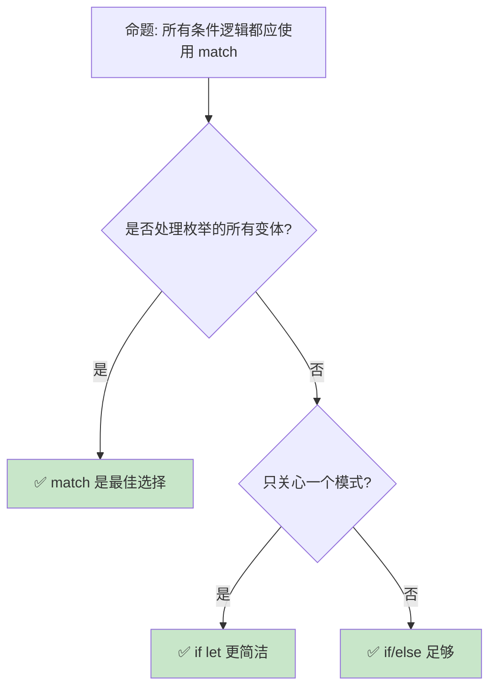

# 控制流：表达式导向的流程控制
>
> **受众**: [初学者]

> **Bloom 层级**: 理解 → 应用
> **A/S/P 标记**: **A+S** — Application + Structure
> **双维定位**: C×App — 应用控制流结构和模式匹配
> **定位**: 分析 Rust **控制流结构**的设计哲学——从表达式导向（expression-oriented）的 `if`/`match`/`loop`，到 `if let`/`while let` 的模式匹配集成，揭示 Rust 如何将控制流转化为**值生成**而非**副作用执行**。
> **前置概念**: [Ownership](./01_ownership.md) · [Type System](./04_type_system.md)
> **后置概念**: [Generics](../02_intermediate/02_generics.md) · [Async](../03_advanced/02_async.md)

---

> **来源**: [Rust Reference — Expressions](https://doc.rust-lang.org/reference/expressions.html) ·
> [TRPL Ch3 — Control Flow](https://doc.rust-lang.org/book/ch03-05-control-flow.html) ·
> [TRPL Ch6 — Match](https://doc.rust-lang.org/book/ch06-02-match.html) ·
> [Rust Reference — Loop Expressions](https://doc.rust-lang.org/reference/expressions/loop-expr.html) ·
> [RFC 160 — `if let`](https://github.com/rust-lang/rfcs/pull/160)

## 📑 目录

- [控制流：表达式导向的流程控制](#控制流表达式导向的流程控制)
  - [📑 目录](#-目录)
  - [一、核心概念](#一核心概念)
    - [1.1 表达式 vs 语句](#11-表达式-vs-语句)
    - [1.2 match：穷尽性模式匹配](#12-match穷尽性模式匹配)
    - [1.3 if let / while let：简化的模式匹配](#13-if-let--while-let简化的模式匹配)
  - [二、技术细节](#二技术细节)
    - [2.1 loop 与值返回](#21-loop-与值返回)
    - [2.2 标签与嵌套循环控制](#22-标签与嵌套循环控制)
    - [2.3 块表达式与尾部值](#23-块表达式与尾部值)
  - [三、常见模式](#三常见模式)
  - [四、反命题与边界分析](#四反命题与边界分析)
    - [4.1 反命题树](#41-反命题树)
    - [4.2 边界极限](#42-边界极限)
  - [五、常见陷阱](#五常见陷阱)
  - [六、来源与延伸阅读](#六来源与延伸阅读)
  - [相关概念文件](#相关概念文件)
  - [权威来源索引](#权威来源索引)
  - [十二、边界测试：控制流的编译错误](#十二边界测试控制流的编译错误)
    - [12.1 边界测试：`loop` 返回值类型不匹配（编译错误）](#121-边界测试loop-返回值类型不匹配编译错误)
    - [12.2 边界测试：`if let` 与 `while let` 的变量遮蔽（编译错误）](#122-边界测试if-let-与-while-let-的变量遮蔽编译错误)
    - [10.3 边界测试：`loop` 表达式的类型推断（编译错误）](#103-边界测试loop-表达式的类型推断编译错误)
    - [10.4 边界测试：`?` 运算符在 `main` 中的返回类型（编译错误）](#104-边界测试-运算符在-main-中的返回类型编译错误)
    - [10.5 边界测试：`loop` 返回值与 `break` 的类型一致性（编译错误）](#105-边界测试loop-返回值与-break-的类型一致性编译错误)
    - [10.6 边界测试：`match` 臂中的变量绑定与模式守卫（编译错误）](#106-边界测试match-臂中的变量绑定与模式守卫编译错误)
  - [实践](#实践)
  - [参考来源](#参考来源)

---

## 一、核心概念

### 1.1 表达式 vs 语句

```text
Rust 是表达式导向语言（Expression-Oriented Language）:

  表达式（Expression）: 产生值
  ├── 2 + 3 → 5
  ├── if condition { 1 } else { 0 } → 1 或 0
  ├── match x { A => 1, B => 2 } → 1 或 2
  └── { let x = 1; x + 1 } → 2

  语句（Statement）: 不产生值（单元类型 ()）
  ├── let x = 5;  // let 是语句
  ├── x = 3;      // 赋值是语句
  └── fn foo() {} // 函数定义是语句

  与 C/Java 的本质差异:
  ┌─────────────────┬─────────────────┬─────────────────┐
  │ 代码            │ C/Java          │ Rust            │
  ├─────────────────┼─────────────────┼─────────────────┤
  │ if              │ 语句            │ 表达式          │
  │ match           │ switch 语句     │ 表达式          │
  │ 代码块 {}       │ 作用域          │ 表达式（尾值）  │
  │ 三元运算符      │ a ? b : c       │ if a { b } else │
  │                 │                 │ { c }           │
  └─────────────────┴─────────────────┴─────────────────┘
> [来源: [TRPL](https://doc.rust-lang.org/book/)]

  表达式导向的好处:
  ├── 控制流可以返回值，减少临时变量
  ├── let result = if x > 0 { x } else { -x };  // 绝对值
  ├── 代码更简洁，更接近函数式风格
  └── 编译器能进行更精确的类型检查
```

> **认知功能**: 表达式导向是 Rust 的**核心设计哲学**——几乎所有控制结构都是表达式，可以嵌套、可以赋值、可以作为返回值。
> **关键洞察**: 这使得 Rust 在没有三元运算符的情况下，仍然能写出比 C 更简洁的条件表达式。
> [来源: [Rust Reference — Expressions vs Statements](https://doc.rust-lang.org/reference/statements-and-expressions.html)]

---

### 1.2 match：穷尽性模式匹配

```rust,ignore
// match 是 Rust 最强大的控制流工具

enum Message {
    Quit,
    Move { x: i32, y: i32 },
    Write(String),
    ChangeColor(i32, i32, i32),
}

fn process(msg: Message) -> String {
    match msg {
        Message::Quit => String::from("quit"),
        Message::Move { x, y } => format!("move to ({}, {})", x, y),
        Message::Write(text) => format!("write: {}", text),
        Message::ChangeColor(r, g, b) => format!("color: {} {} {}", r, g, b),
    }
}

// 穷尽性检查: 编译器确保所有变体都被处理
// 如果遗漏 Message::Quit，编译错误！

// match 作为表达式
let value = match option {
    Some(x) => x * 2,
    None => 0,
};

// 守卫条件（guard）
match num {
    n if n < 0 => "negative",
    n if n > 0 => "positive",
    _ => "zero",
}

// 绑定模式
match result {
    Ok(value) @ 1..=10 => println!("small success: {}", value),
    Ok(value) => println!("success: {}", value),
    Err(e) => println!("error: {}", e),
}
```

> **match 洞察**: Rust 的 `match` 要求**穷尽性**（exhaustiveness）——编译器检查所有可能的模式都被覆盖。这消除了 C `switch` 的**遗漏 case** bug。
> [来源: [Rust Reference — Match Expressions](https://doc.rust-lang.org/reference/expressions/match-expr.html)]

---

### 1.3 if let / while let：简化的模式匹配

```rust,ignore
// if let: 当只关心一个模式时使用

// 代替冗长的 match
match option {
    Some(value) => println!("{}", value),
    _ => {},  // 必须写，但什么都不做
}

// 用 if let 简化
if let Some(value) = option {
    println!("{}", value);
}

// if let ... else
if let Some(value) = option {
    println!("{}", value);
} else {
    println!("none");
}

// while let: 循环条件为模式匹配
let mut stack = vec![1, 2, 3];
while let Some(top) = stack.pop() {
    println!("{}", top);  // 打印 3, 2, 1
}

// let else (Rust 1.65+): 提前返回
fn get_count(map: &HashMap<String, i32>, key: &str) -> i32 {
    let Some(&count) = map.get(key) else {
        return 0;  // 如果模式不匹配，执行 else 块并返回
    };
    count * 2  // count 在这里已解包
}

// let chains (Rust 1.70+): 连续模式匹配
if let Some(x) = opt1 && let Some(y) = opt2 && x > y {
    println!("{} > {}", x, y);
}
```

> **if let/while let 洞察**: 这些语法是 `match` 的**语法糖**——它们在只关心一个模式时减少 boilerplate。`let else` 进一步简化了**提前返回**模式。
> [来源: [RFC 160 — if let](https://github.com/rust-lang/rfcs/pull/160)] · [来源: [RFC 3137 — let else](https://github.com/rust-lang/rfcs/pull/3137)]

---

## 二、技术细节

### 2.1 loop 与值返回

```rust,ignore
// loop 可以返回值（Rust 特有）
let result = loop {
    // 做一些工作
    if condition_met {
        break 42;  // break 带值
    }
};
// result == 42

// 对比其他语言的 loop
// C/Java: 需要额外的变量存储结果
// Rust: loop 本身就是表达式

// 实际应用: 重试逻辑
let response = loop {
    match try_request().await {
        Ok(resp) => break resp,
        Err(e) if e.is_retriable() => {
            tokio::time::sleep(RETRY_DELAY).await;
            continue;
        }
        Err(e) => break Err(e),  // 不可重试错误，返回
    }
};

// for 循环与迭代器
for item in collection { ... }  // 消费迭代器
for item in &collection { ... }  // 借用迭代
for i in 0..10 { ... }  // 范围迭代

// for 不返回值，但可以用其他方式收集结果
let sum: i32 = (0..10).map(|x| x * 2).sum();
```

> **loop 洞察**: `loop` 作为**表达式**是 Rust 的独特设计——它使**重试逻辑**、**状态机循环**等模式能简洁地返回值。
> [来源: [Rust Reference — Loop Expressions](https://doc.rust-lang.org/reference/expressions/loop-expr.html)]

---

### 2.2 标签与嵌套循环控制

```rust,ignore
// 标签循环: 控制嵌套循环

'outer: for x in 0..10 {
    'inner: for y in 0..10 {
        if x * y > 50 {
            break 'outer;  // 跳出外层循环
        }
        println!("({}, {})", x, y);
    }
}

// continue 也可以带标签
'search: for i in 0..100 {
    for j in 0..100 {
        if !is_valid(i, j) {
            continue 'search;  // 跳到外层下一次迭代
        }
        process(i, j);
    }
}

// 标签与 loop 表达式结合
let result = 'retry: loop {
    for attempt in 0..3 {
        match try_operation() {
            Ok(v) => break 'retry v,
            Err(_) if attempt < 2 => continue,
            Err(e) => break 'retry Err(e),
        }
    }
};
```

> **标签洞察**: 循环标签解决了**嵌套循环控制**的问题——不需要 goto，也不需要额外的标志变量。
> [来源: [Rust Reference — Labeled Loops](https://doc.rust-lang.org/reference/expressions/loop-expr.html#loop-labels)]

---

### 2.3 块表达式与尾部值

```rust,ignore
// 块表达式 {} 的值是其最后一个表达式
let value = {
    let x = 1;
    let y = 2;
    x + y  // 尾部表达式（无分号）→ 块的值是 3
};

// 尾部语句（有分号）→ 块的值是 ()
let unit = {
    let x = 1;
    x + 1;  // 分号 → 语句 → 块值 = ()
};

// 函数隐式返回尾部表达式
fn add(a: i32, b: i32) -> i32 {
    a + b  // 等同于 return a + b;
}

// match 分支也是块表达式
let result = match option {
    Some(x) => {
        let doubled = x * 2;
        doubled  // 分支的值
    }
    None => 0,
};

// if 作为表达式
let max = if a > b { a } else { b };

// 注意: if 分支类型必须一致
let x = if condition {
    42      // i32
} else {
    "hello" // &str → 编译错误！
};
```

> **块表达式洞察**: Rust 的**尾部值规则**是表达式导向的基础——任何块 `{}` 都可以是一个值，只要最后一个表达式没有分号。
> [来源: [Rust Reference — Block Expressions](https://doc.rust-lang.org/reference/expressions/block-expr.html)]

---

## 三、常见模式

```text
模式 1: 使用 match 进行枚举处理
  match msg {
      Message::Quit => handle_quit(),
      Message::Move { x, y } => handle_move(x, y),
      Message::Write(text) => handle_write(text),
      Message::ChangeColor(r, g, b) => handle_color(r, g, b),
  }

模式 2: if let 解包 Option
  if let Some(value) = maybe_value {
      process(value);
  }

模式 3: while let 消费迭代器
  while let Some(item) = iter.next() {
      process(item);
  }

模式 4: let else 提前返回
  fn foo(opt: Option<i32>) -> i32 {
      let Some(x) = opt else { return 0; };
      x * 2
  }

模式 5: loop 重试
  let result = loop {
      match try_operation() {
          Ok(v) => break v,
          Err(_) => continue,
      }
  };

模式 6: 匹配守卫
  match age {
      n if n < 13 => "child",
      n if n < 20 => "teenager",
      n if n < 65 => "adult",
      _ => "senior",
  }

模式 7: 范围模式 (Rust 1.55+)
  match x {
      1..=10 => "small",
      11..=100 => "medium",
      _ => "large",
  }
```

> **模式总结**: Rust 的控制流模式强调**穷尽性**和**表达式导向**——编译器帮助你处理所有情况，同时控制流可以自然地产生值。
> [来源: [TRPL — Patterns](https://doc.rust-lang.org/book/ch18-00-patterns.html)]

---

## 四、反命题与边界分析

### 4.1 反命题树



> **认知功能**: 此决策树帮助选择正确的控制流结构。核心原则是：**枚举处理用 match，单模式解包用 if let，简单布尔条件用 if**。
> [来源: [Rust Clippy — Match Patterns](https://rust-lang.github.io/rust-clippy/master/index.html)]

---

### 4.2 边界极限

```text
边界 1: match 的穷尽性限制
├── match 要求处理所有情况
├── 对于整数类型（i32 等），不可能穷尽所有值
├── 解决方案: 使用通配符 _ 捕获剩余情况
└── 但这可能隐藏遗漏的边界情况

边界 2: 表达式类型一致性
├── if/else 的两个分支必须返回相同类型
├── match 的所有分支必须返回相同类型
├── 这限制了某些动态类型风格的代码
└── 解决方案: 使用 enum 统一不同类型

边界 3: async 中的控制流
├── break/continue 在 async 块中的行为
├── loop 在 async fn 中的 Pin 交互
├── for await（尚未稳定）
└── 需要理解 Future 的 poll 模型

边界 4: const 上下文中的控制流
├── const fn 支持 if/match/loop
├── 但循环有迭代次数限制
├── 复杂的 const 控制流可能触发编译器限制
└── const eval 的步数限制

边界 5: 模式匹配的深度
├── 过深的嵌套模式可能难以阅读
├── 解构大型结构体时模式冗长
└── 解决方案: 使用 @ 绑定或部分匹配
```

> **边界要点**: 控制流的边界主要与**穷尽性要求**、**类型一致性**、**异步交互**和**const 限制**相关。
> [来源: [Rust Reference — Const Evaluation](https://doc.rust-lang.org/reference/const_eval.html)]

---

## 五、常见陷阱

```text
陷阱 1: 在 if/else 分支中返回不同类型
  ❌ let x = if condition { 42 } else { "hello" };
     // 编译错误: i32 和 &str 类型不匹配

  ✅ let x = if condition { Some(42) } else { None };
     // 或: 使用 enum 统一类型

陷阱 2: 忘记 match 的穷尽性
  ❌ match option {
       Some(x) => println!("{}", x),
       // 遗漏 None → 编译错误
     }

  ✅ match option {
       Some(x) => println!("{}", x),
       None => {},  // 显式处理
     }

陷阱 3: 在块末尾意外添加分号
  ❌ fn get_value() -> i32 {
       let x = 42;
       x;  // 分号 → 块值 = () → 编译错误
     }

  ✅ fn get_value() -> i32 {
       let x = 42;
       x   // 无分号 → 块值 = 42
     }

陷阱 4: 混淆 break 和 return
  ❌ fn search() -> i32 {
       for i in 0..10 {
           if found(i) {
               break i;  // 返回循环值，不是函数返回值
           }
       }
     }

  ✅ fn search() -> i32 {
       for i in 0..10 {
           if found(i) {
               return i;  // 从函数返回
           }
       }
       -1
     }

陷阱 5: let else 中的作用域
  ❌ fn foo(opt: Option<i32>) {
       let Some(x) = opt else { return; };
       // x 在这里可用
     }
     // 但如果 else 块不返回，x 不可用

  ✅ 确保 let else 的 else 块发散（return/panic/break）
```

> **陷阱总结**: 控制流的陷阱主要与**类型一致性**、**穷尽性**、**尾部值规则**和**作用域**相关。
> [来源: [Rust Compiler Error E0308](https://doc.rust-lang.org/error_codes/E0308.html)]

---

## 六、来源与延伸阅读

| 来源 | 可信度 | 说明 |
|:---|:---:|:---|
| [Rust Reference — Expressions](https://doc.rust-lang.org/reference/expressions.html) | ✅ 一级 | 官方表达式参考 |
| [TRPL Ch3 — Control Flow](https://doc.rust-lang.org/book/ch03-05-control-flow.html) | ✅ 一级 | 控制流入门 |
| [TRPL Ch6 — Match](https://doc.rust-lang.org/book/ch06-02-match.html) | ✅ 一级 | match 详解 |
| [TRPL Ch18 — Patterns](https://doc.rust-lang.org/book/ch18-00-patterns.html) | ✅ 一级 | 模式匹配深入 |
| [RFC 160 — if let](https://github.com/rust-lang/rfcs/pull/160) | ✅ 一级 | if let RFC |
| [RFC 3137 — let else](https://github.com/rust-lang/rfcs/pull/3137) | ✅ 一级 | let else RFC |

---

## 相关概念文件

- [Ownership](./01_ownership.md) — 所有权模型
- [Type System](./04_type_system.md) — 类型系统
- [Generics](../02_intermediate/02_generics.md) — 迭代器
- [Async](../03_advanced/02_async.md) — 异步控制流

---

> **权威来源**: [Rust Reference](https://doc.rust-lang.org/reference/), [The Rust Programming Language](https://doc.rust-lang.org/book/)
>
> **权威来源对齐变更日志**: 2026-05-22 创建 [来源: Authority Source Sprint Batch 9]

**文档版本**: 1.0
**对应 Rust 版本**: 1.96.0+ (Edition 2024)
**最后更新**: 2026-05-22
**状态**: ✅ 概念文件创建完成

---

## 权威来源索引

> **补充来源**

## 十二、边界测试：控制流的编译错误

### 12.1 边界测试：`loop` 返回值类型不匹配（编译错误）

```rust,compile_fail
fn main() {
    let result = loop {
        break 42; // break 带值
        break "hello"; // ❌ 编译错误: mismatched types
        // 同一 loop 的所有 break 必须返回相同类型
    };
    println!("{}", result);
}

// 正确: 所有 break 返回相同类型
fn fixed() -> i32 {
    loop {
        if some_condition() {
            break 42; // ✅ i32
        }
        break 0; // ✅ i32
    }
}

fn some_condition() -> bool { false }
```

> **修正**: `loop` 表达式可以返回值（通过 `break expr;`），但所有 `break` 分支必须返回相同类型。编译器通过控制流分析推断 `loop` 的类型。
> 若存在不一致的 `break` 类型，编译器报错。这类似于 `match` 的所有分支必须返回相同类型。
> [来源: [Rust Reference](https://doc.rust-lang.org/reference/)]

### 12.2 边界测试：`if let` 与 `while let` 的变量遮蔽（编译错误）

```rust,compile_fail
fn main() {
    let x = Some(5);
    if let Some(x) = x {
        // x 在此处遮蔽外部 x
        println!("inner: {}", x);
    }
    // ❌ 编译错误: `x` 的值已被移动
    // 若 x 不是 Copy 类型，if let 的解构可能消耗值
    println!("outer: {}", x);
}

// 正确: 使用引用匹配
fn fixed() {
    let x = Some(String::from("hello"));
    if let Some(ref inner) = x { // ✅ 匹配引用，不消耗 x
        println!("inner: {}", inner);
    }
    println!("outer: {:?}", x); // ✅ x 仍有效
}
```

> **修正**: `if let` 和 `while let` 通过模式匹配解构值。
> 若模式不使用 `ref` 或 `ref mut`，则发生所有权移动（对非 `Copy` 类型）。
> 使用 `ref` 绑定创建引用而非获取所有权，允许在匹配后继续使用原值。
> 这是 Rust 模式匹配与所有权系统的关键交互点。
> [来源: [The Rust Programming Language](https://doc.rust-lang.org/book/)]

### 10.3 边界测试：`loop` 表达式的类型推断（编译错误）

```rust,ignore
fn maybe_return() -> i32 {
    let x = loop {
        if some_condition() {
            break 42;
        }
        // ❌ 编译错误: 若 loop 永不 break，或 break 的类型不一致
    };
    x
}

fn some_condition() -> bool { true }
```

> **修正**: `loop` 是 Rust 中唯一可返回值的循环结构：`break expr` 返回 `expr` 作为 `loop` 的值。
> 编译器要求：
>
> 1) 所有 `break` 返回相同类型；
> 2) 若 `loop` 可能无限循环（无 `break`），其类型为 `!`（never type），可 coerce 为任意类型。
> `loop { break 42 }` 的类型是 `i32`，`loop { break "hello" }` 的类型是 `&str`。
> 若 `break` 的类型不一致，编译错误。这与 C 的 `for`/`while`（无返回值）或 Haskell 的 `rec`/`fix`（返回值但语义不同）不同——Rust 的 `loop` 返回值使某些模式更简洁（如重试逻辑返回操作结果）。
> `loop` 与 `break` 的组合是 Rust 控制流的独特设计。
> [来源: [The Rust Programming Language](https://doc.rust-lang.org/book/ch03-05-control-flow.html)] ·
> [来源: [Rust Reference — Loop Expressions](https://doc.rust-lang.org/reference/expressions/loop-expr.html)]

### 10.4 边界测试：`?` 运算符在 `main` 中的返回类型（编译错误）

```rust,compile_fail
fn main() {
    let file = std::fs::File::open("not_exist.txt")?;
    // ❌ 编译错误: `?` 要求函数返回 Result 或 Option
    // main 默认返回 ()
}
```

> **修正**: `?` 运算符只能在返回 `Result` 或 `Option` 的函数中使用。`main` 函数可返回 `Result<(), E>`（`E: Debug`），Rust 在返回 `Err` 时打印错误并设置非零退出码。正确写法：`fn main() -> Result<(), Box<dyn std::error::Error>> { let file = std::fs::File::open("...")?; Ok(()) }`。这与 Go 的 `if err != nil { return err }`（在 main 中返回 error 等价于 `os.Exit(1)`）或 Python 的 `sys.exit(1)` 类似——Rust 的类型系统要求显式声明 `main` 可能失败。`main` 返回 `Result` 是 Rust 错误处理哲学的自然延伸：连程序入口点也使用 `Result`。[来源: [The Rust Programming Language](https://doc.rust-lang.org/book/ch09-02-recoverable-errors-with-result.html)] · [来源: [Rust Reference — Main Function](https://doc.rust-lang.org/reference/crates-and-source-files.html#main-functions)]

### 10.5 边界测试：`loop` 返回值与 `break` 的类型一致性（编译错误）

```rust,compile_fail
fn main() {
    let result = loop {
        if true {
            break 42; // break 返回 i32
        } else {
            break "hello"; // ❌ 编译错误: break 返回 &str，与之前的 i32 不一致
        }
    };
    println!("{}", result);
}
```

> **修正**: `loop` 是 Rust 中唯一可返回值的循环：`break expr` 将 `expr` 作为 `loop` 表达式的值。编译器要求：1) 所有 `break` 返回相同类型；2) 若 `loop` 可能无限循环（无 `break`），其类型为 `!`（never type），可 coerce 为任意类型。`loop { break 42 }` 的类型是 `i32`。若 `break` 的类型不一致，编译错误。这与 C 的 `for`/`while`（无返回值）或 Haskell 的 `rec`/`fix`（返回值但语义不同）不同——Rust 的 `loop` 返回值使某些模式更简洁（如重试逻辑返回操作结果）。`loop` 与 `break` 的组合是 Rust 控制流的独特设计。[来源: [The Rust Programming Language](https://doc.rust-lang.org/book/ch03-05-control-flow.html)] · [来源: [Rust Reference — Loop Expressions](https://doc.rust-lang.org/reference/expressions/loop-expr.html)]

### 10.6 边界测试：`match` 臂中的变量绑定与模式守卫（编译错误）

```rust,ignore
fn main() {
    let x = Some(5);
    match x {
        Some(n) if n > 3 => println!("big: {}", n),
        Some(n) => println!("small: {}", n),
        None => println!("none"),
    }

    let y = Some(String::from("hello"));
    match y {
        Some(ref s) if s.len() > 3 => println!("long: {}", s),
        // ❌ 编译错误: 若模式守卫中使用 move 绑定，可能冲突
        Some(s) => println!("short: {}", s),
        None => {},
    }
}
```

> **修正**: `match` 的**模式守卫**（pattern guard，`if` 条件）在绑定后执行，但守卫中的借用可能与后续臂冲突。`ref` 关键字创建引用绑定（`&T` 而非 `T`），避免 move。`ref mut` 创建可变引用绑定。模式守卫的限制：1) 守卫中不能引入新绑定；2) 守卫中的变量是引用而非值（若使用 `ref`）；3) 守卫不移动值，但若守卫失败，后续臂可能获得 move 绑定。这与 Haskell 的 `case` guard（类似，但 Haskell 是惰性求值，守卫语义不同）或 Scala 的 `match` with `if` guard（类似，但无所有权影响）不同——Rust 的模式守卫需考虑所有权和借用的交互。[来源: [The Rust Programming Language](https://doc.rust-lang.org/book/ch18-03-pattern-syntax.html)] · [来源: [Rust Reference — Match Guards](https://doc.rust-lang.org/reference/expressions/match-expr.html#match-guards)]

## 实践

> **相关资源**:
>
> - [crates/ 示例代码](../../crates/) — 与本文概念对应的可编译示例
> - [exercises/ 练习](../../exercises/) — 动手编程挑战
> - [MVP 学习路径](./LEARNING_MVP_PATH.md) — 从零到多线程 CLI 的 40 小时路径
>
> **建议**: 阅读完本概念文件后，打开对应 crate 的示例代码，尝试修改并运行。完成至少 1 道相关练习以巩固理解。

## 参考来源

> [来源: [The Rust Programming Language, Ch. 3.5](https://doc.rust-lang.org/book/ch03-05-control-flow.html)]

> [来源: [RFC 1210 — `impl Trait`](https://rust-lang.github.io/rfcs/1210-impl-trait-for-all.html)]

> [来源: [RFC 2497 — if let chains](https://rust-lang.github.io/rfcs/2497-if-let-chains.html)]
